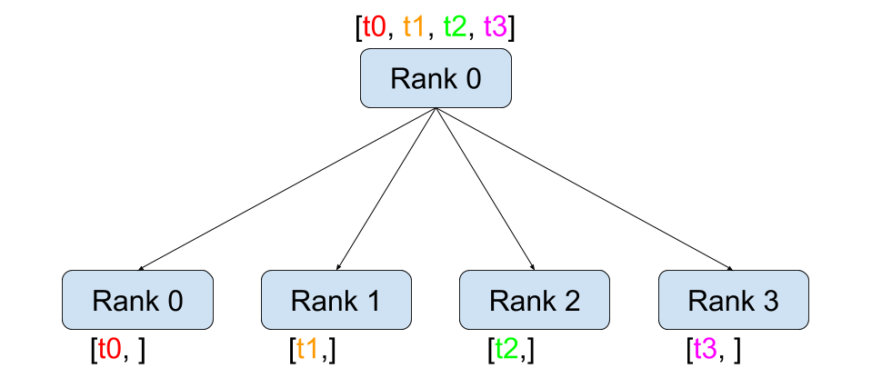
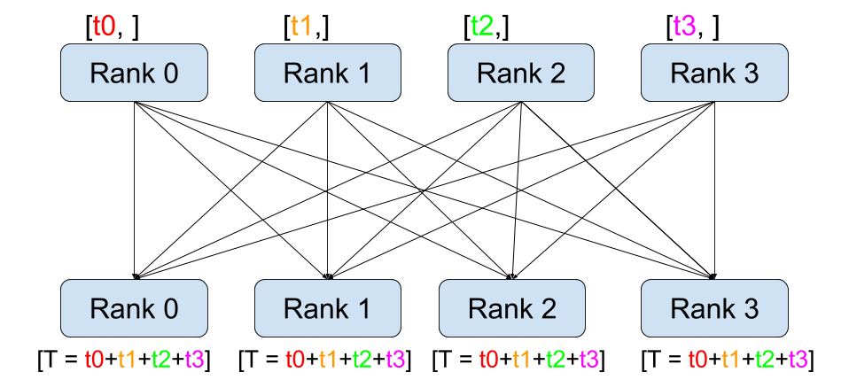

Writing Distributed Applications with PyTorch
=============================================

Created On: Oct 06, 2017 | Last Updated: Feb 20, 2025 | Last Verified: Nov 05, 2024

**Author**: [Séb Arnold](https://seba1511.com/)

Note

 View and edit this tutorial in [github](https://github.com/pytorch/tutorials/blob/main/intermediate_source/dist_tuto.rst).

Prerequisites:

*   [PyTorch Distributed Overview](https://docs.pytorch.org/tutorials/beginner/dist_overview.html)
    

In this short tutorial, we will be going over the distributed package of PyTorch. We’ll see how to set up the distributed setting, use the different communication strategies, and go over some of the internals of the package.

Setup
-----

The distributed package included in PyTorch (i.e., `torch.distributed`) enables researchers and practitioners to easily parallelize their computations across processes and clusters of machines. To do so, it leverages message passing semantics allowing each process to communicate data to any of the other processes. As opposed to the multiprocessing (`torch.multiprocessing`) package, processes can use different communication backends and are not restricted to being executed on the same machine.

In order to get started we need the ability to run multiple processes simultaneously. If you have access to compute cluster you should check with your local sysadmin or use your favorite coordination tool (e.g., [pdsh](https://linux.die.net/man/1/pdsh), [clustershell](https://cea-hpc.github.io/clustershell/), or [slurm](https://slurm.schedmd.com/)). For the purpose of this tutorial, we will use a single machine and spawn multiple processes using the following template.

"""run.py:"""
#!/usr/bin/env python
import os
import sys
import torch
import torch.distributed as dist
import torch.multiprocessing as mp

def run(rank, size):
 """ Distributed function to be implemented later. """
    pass

def init\_process(rank, size, fn, backend\='gloo'):
 """ Initialize the distributed environment. """
    os.environ\['MASTER\_ADDR'\] \= '127.0.0.1'
    os.environ\['MASTER\_PORT'\] \= '29500'
    dist.init\_process\_group(backend, rank\=rank, world\_size\=size)
    fn(rank, size)

if \_\_name\_\_ \== "\_\_main\_\_":
    world\_size \= 2
    processes \= \[\]
    if "google.colab" in sys.modules:
        print("Running in Google Colab")
        mp.get\_context("spawn")
    else:
        mp.set\_start\_method("spawn")
    for rank in range(world\_size):
        p \= mp.Process(target\=init\_process, args\=(rank, world\_size, run))
        p.start()
        processes.append(p)

    for p in processes:
        p.join()

The above script spawns two processes who will each setup the distributed environment, initialize the process group (`dist.init_process_group`), and finally execute the given `run` function.

Let’s have a look at the `init_process` function. It ensures that every process will be able to coordinate through a master, using the same ip address and port. Note that we used the `gloo` backend but other backends are available. (c.f. [Section 5.1](https://docs.pytorch.org/tutorials/intermediate/dist_tuto.html#communication-backends)) We will go over the magic happening in `dist.init_process_group` at the end of this tutorial, but it essentially allows processes to communicate with each other by sharing their locations.

Point-to-Point Communication
----------------------------

Send and Recv

A transfer of data from one process to another is called a point-to-point communication. These are achieved through the `send` and `recv` functions or their _immediate_ counter-parts, `isend` and `irecv`.

"""Blocking point-to-point communication."""

def run(rank, size):
    tensor \= torch.zeros(1)
    if rank \== 0:
        tensor += 1
        \# Send the tensor to process 1
        dist.send(tensor\=tensor, dst\=1)
    else:
        \# Receive tensor from process 0
        dist.recv(tensor\=tensor, src\=0)
    print('Rank ', rank, ' has data ', tensor\[0\])

In the above example, both processes start with a zero tensor, then process 0 increments the tensor and sends it to process 1 so that they both end up with 1.0. Notice that process 1 needs to allocate memory in order to store the data it will receive.

Also notice that `send/recv` are **blocking**: both processes block until the communication is completed. On the other hand immediates are **non-blocking**; the script continues its execution and the methods return a `Work` object upon which we can choose to `wait()`.

"""Non-blocking point-to-point communication."""

def run(rank, size):
    tensor \= torch.zeros(1)
    req \= None
    if rank \== 0:
        tensor += 1
        \# Send the tensor to process 1
        req \= dist.isend(tensor\=tensor, dst\=1)
        print('Rank 0 started sending')
    else:
        \# Receive tensor from process 0
        req \= dist.irecv(tensor\=tensor, src\=0)
        print('Rank 1 started receiving')
    req.wait()
    print('Rank ', rank, ' has data ', tensor\[0\])

When using immediates we have to be careful about how we use the sent and received tensors. Since we do not know when the data will be communicated to the other process, we should not modify the sent tensor nor access the received tensor before `req.wait()` has completed. In other words,

*   writing to `tensor` after `dist.isend()` will result in undefined behaviour.
    
*   reading from `tensor` after `dist.irecv()` will result in undefined behaviour, until `req.wait()` has been executed.
    

However, after `req.wait()` has been executed we are guaranteed that the communication took place, and that the value stored in `tensor[0]` is 1.0.

Point-to-point communication is useful when we want more fine-grained control over the communication of our processes. They can be used to implement fancy algorithms, such as the one used in [Baidu’s DeepSpeech](https://github.com/baidu-research/baidu-allreduce) or [Facebook’s large-scale experiments](https://research.fb.com/publications/imagenet1kin1h/).(c.f. [Section 4.1](https://docs.pytorch.org/tutorials/intermediate/dist_tuto.html#our-own-ring-allreduce))

Collective Communication
------------------------

Scatter

Gather

Reduce

All-Reduce

Broadcast

All-Gather

As opposed to point-to-point communcation, collectives allow for communication patterns across all processes in a **group**. A group is a subset of all our processes. To create a group, we can pass a list of ranks to `dist.new_group(group)`. By default, collectives are executed on all processes, also known as the **world**. For example, in order to obtain the sum of all tensors on all processes, we can use the `dist.all_reduce(tensor, op, group)` collective.

""" All-Reduce example."""
def run(rank, size):
 """ Simple collective communication. """
    group \= dist.new\_group(\[0, 1\])
    tensor \= torch.ones(1)
    dist.all\_reduce(tensor, op\=dist.ReduceOp.SUM, group\=group)
    print('Rank ', rank, ' has data ', tensor\[0\])

Since we want the sum of all tensors in the group, we use `dist.ReduceOp.SUM` as the reduce operator. Generally speaking, any commutative mathematical operation can be used as an operator. Out-of-the-box, PyTorch comes with many such operators, all working at the element-wise level:

*   `dist.ReduceOp.SUM`,
    
*   `dist.ReduceOp.PRODUCT`,
    
*   `dist.ReduceOp.MAX`,
    
*   `dist.ReduceOp.MIN`,
    
*   `dist.ReduceOp.BAND`,
    
*   `dist.ReduceOp.BOR`,
    
*   `dist.ReduceOp.BXOR`,
    
*   `dist.ReduceOp.PREMUL_SUM`.
    

The full list of supported operators is [here](https://pytorch.org/docs/stable/distributed.html#torch.distributed.ReduceOp).

In addition to `dist.all_reduce(tensor, op, group)`, there are many additional collectives currently implemented in PyTorch. Here are a few supported collectives.

*   `dist.broadcast(tensor, src, group)`: Copies `tensor` from `src` to all other processes.
    
*   `dist.reduce(tensor, dst, op, group)`: Applies `op` to every `tensor` and stores the result in `dst`.
    
*   `dist.all_reduce(tensor, op, group)`: Same as reduce, but the result is stored in all processes.
    
*   `dist.scatter(tensor, scatter_list, src, group)`: Copies the ithith tensor `scatter_list[i]` to the ithith process.
    
*   `dist.gather(tensor, gather_list, dst, group)`: Copies `tensor` from all processes in `dst`.
    
*   `dist.all_gather(tensor_list, tensor, group)`: Copies `tensor` from all processes to `tensor_list`, on all processes.
    
*   `dist.barrier(group)`: Blocks all processes in group until each one has entered this function.
    
*   `dist.all_to_all(output_tensor_list, input_tensor_list, group)`: Scatters list of input tensors to all processes in a group and return gathered list of tensors in output list.
    

The full list of supported collectives can be found by looking at the latest documentation for PyTorch Distributed [(link)](https://pytorch.org/docs/stable/distributed.html).

Distributed Training
--------------------

**Note:** You can find the example script of this section in [this GitHub repository](https://github.com/seba-1511/dist_tuto.pth/).

Now that we understand how the distributed module works, let us write something useful with it. Our goal will be to replicate the functionality of [DistributedDataParallel](https://pytorch.org/docs/stable/nn.html#torch.nn.parallel.DistributedDataParallel). Of course, this will be a didactic example and in a real-world situation you should use the official, well-tested and well-optimized version linked above.

Quite simply we want to implement a distributed version of stochastic gradient descent. Our script will let all processes compute the gradients of their model on their batch of data and then average their gradients. In order to ensure similar convergence results when changing the number of processes, we will first have to partition our dataset. (You could also use [torch.utils.data.random\_split](https://pytorch.org/docs/stable/data.html#torch.utils.data.random_split), instead of the snippet below.)

""" Dataset partitioning helper """
class Partition(object):

    def \_\_init\_\_(self, data, index):
        self.data \= data
        self.index \= index

    def \_\_len\_\_(self):
        return len(self.index)

    def \_\_getitem\_\_(self, index):
        data\_idx \= self.index\[index\]
        return self.data\[data\_idx\]

class DataPartitioner(object):

    def \_\_init\_\_(self, data, sizes\=\[0.7, 0.2, 0.1\], seed\=1234):
        self.data \= data
        self.partitions \= \[\]
        rng \= Random()  \# from random import Random
        rng.seed(seed)
        data\_len \= len(data)
        indexes \= \[x for x in range(0, data\_len)\]
        rng.shuffle(indexes)

        for frac in sizes:
            part\_len \= int(frac \* data\_len)
            self.partitions.append(indexes\[0:part\_len\])
            indexes \= indexes\[part\_len:\]

    def use(self, partition):
        return Partition(self.data, self.partitions\[partition\])

With the above snippet, we can now simply partition any dataset using the following few lines:

""" Partitioning MNIST """
def partition\_dataset():
    dataset \= datasets.MNIST('./data', train\=True, download\=True,
                             transform\=transforms.Compose(\[
                                 transforms.ToTensor(),
                                 transforms.Normalize((0.1307,), (0.3081,))
                             \]))
    size \= dist.get\_world\_size()
    bsz \= 128 // size
    partition\_sizes \= \[1.0 / size for \_ in range(size)\]
    partition \= DataPartitioner(dataset, partition\_sizes)
    partition \= partition.use(dist.get\_rank())
    train\_set \= torch.utils.data.DataLoader(partition,
                                         batch\_size\=bsz,
                                         shuffle\=True)
    return train\_set, bsz

Assuming we have 2 replicas, then each process will have a `train_set` of 60000 / 2 = 30000 samples. We also divide the batch size by the number of replicas in order to maintain the _overall_ batch size of 128.

We can now write our usual forward-backward-optimize training code, and add a function call to average the gradients of our models. (The following is largely inspired by the official [PyTorch MNIST example](https://github.com/pytorch/examples/blob/master/mnist/main.py).)

""" Distributed Synchronous SGD Example """
def run(rank, size):
    torch.manual\_seed(1234)
    train\_set, bsz \= partition\_dataset()
    model \= Net()
    optimizer \= optim.SGD(model.parameters(),
                          lr\=0.01, momentum\=0.5)

    num\_batches \= ceil(len(train\_set.dataset) / float(bsz))
    for epoch in range(10):
        epoch\_loss \= 0.0
        for data, target in train\_set:
            optimizer.zero\_grad()
            output \= model(data)
            loss \= F.nll\_loss(output, target)
            epoch\_loss += loss.item()
            loss.backward()
            average\_gradients(model)
            optimizer.step()
        print('Rank ', dist.get\_rank(), ', epoch ',
              epoch, ': ', epoch\_loss / num\_batches)

It remains to implement the `average_gradients(model)` function, which simply takes in a model and averages its gradients across the whole world.

""" Gradient averaging. """
def average\_gradients(model):
    size \= float(dist.get\_world\_size())
    for param in model.parameters():
        dist.all\_reduce(param.grad.data, op\=dist.ReduceOp.SUM)
        param.grad.data /= size

_Et voilà_! We successfully implemented distributed synchronous SGD and could train any model on a large computer cluster.

**Note:** While the last sentence is _technically_ true, there are [a lot more tricks](https://seba-1511.github.io/dist_blog) required to implement a production-level implementation of synchronous SGD. Again, use what [has been tested and optimized](https://pytorch.org/docs/stable/generated/torch.nn.parallel.DistributedDataParallel.html#torch.nn.parallel.DistributedDataParallel).

### Our Own Ring-Allreduce

As an additional challenge, imagine that we wanted to implement DeepSpeech’s efficient ring allreduce. This is fairly easy to implement using point-to-point collectives.

""" Implementation of a ring-reduce with addition. """
def allreduce(send, recv):
   rank \= dist.get\_rank()
   size \= dist.get\_world\_size()
   send\_buff \= send.clone()
   recv\_buff \= send.clone()
   accum \= send.clone()

   left \= ((rank \- 1) + size) % size
   right \= (rank + 1) % size

   for i in range(size \- 1):
       if i % 2 \== 0:
           \# Send send\_buff
           send\_req \= dist.isend(send\_buff, right)
           dist.recv(recv\_buff, left)
           accum\[:\] += recv\_buff\[:\]
       else:
           \# Send recv\_buff
           send\_req \= dist.isend(recv\_buff, right)
           dist.recv(send\_buff, left)
           accum\[:\] += send\_buff\[:\]
       send\_req.wait()
   recv\[:\] \= accum\[:\]

In the above script, the `allreduce(send, recv)` function has a slightly different signature than the ones in PyTorch. It takes a `recv` tensor and will store the sum of all `send` tensors in it. As an exercise left to the reader, there is still one difference between our version and the one in DeepSpeech: their implementation divides the gradient tensor into _chunks_, so as to optimally utilize the communication bandwidth. (Hint: [torch.chunk](https://pytorch.org/docs/stable/torch.html#torch.chunk))

Advanced Topics
---------------

We are now ready to discover some of the more advanced functionalities of `torch.distributed`. Since there is a lot to cover, this section is divided into two subsections:

1.  Communication Backends: where we learn how to use MPI and Gloo for GPU-GPU communication.
    
2.  Initialization Methods: where we understand how to best set up the initial coordination phase in `dist.init_process_group()`.
    

### Communication Backends

One of the most elegant aspects of `torch.distributed` is its ability to abstract and build on top of different backends. As mentioned before, there are multiple backends implemented in PyTorch. Some of the most popular ones are Gloo, NCCL, and MPI. They each have different specifications and tradeoffs, depending on the desired use case. A comparative table of supported functions can be found [here](https://pytorch.org/docs/stable/distributed.html#module-torch.distributed).

**Gloo Backend**

So far we have made extensive usage of the [Gloo backend](https://github.com/facebookincubator/gloo). It is quite handy as a development platform, as it is included in the pre-compiled PyTorch binaries and works on both Linux (since 0.2) and macOS (since 1.3). It supports all point-to-point and collective operations on CPU, and all collective operations on GPU. The implementation of the collective operations for CUDA tensors is not as optimized as the ones provided by the NCCL backend.

As you have surely noticed, our distributed SGD example does not work if you put `model` on the GPU. In order to use multiple GPUs, let us also make the following modifications:

1.  Use `device = torch.device("cuda:{}".format(rank))`
    
2.  `model = Net()` →→ `model = Net().to(device)`
    
3.  Use `data, target = data.to(device), target.to(device)`
    

With the above modifications, our model is now training on two GPUs and you can monitor their utilization with `watch nvidia-smi`.

**MPI Backend**

The Message Passing Interface (MPI) is a standardized tool from the field of high-performance computing. It allows to do point-to-point and collective communications and was the main inspiration for the API of `torch.distributed`. Several implementations of MPI exist (e.g. [Open-MPI](https://www.open-mpi.org/), [MVAPICH2](http://mvapich.cse.ohio-state.edu/), [Intel MPI](https://software.intel.com/en-us/intel-mpi-library)) each optimized for different purposes. The advantage of using the MPI backend lies in MPI’s wide availability - and high-level of optimization - on large computer clusters. [Some](https://developer.nvidia.com/mvapich) [recent](https://developer.nvidia.com/ibm-spectrum-mpi) [implementations](https://www.open-mpi.org/) are also able to take advantage of CUDA IPC and GPU Direct technologies in order to avoid memory copies through the CPU.

Unfortunately, PyTorch’s binaries cannot include an MPI implementation and we’ll have to recompile it by hand. Fortunately, this process is fairly simple given that upon compilation, PyTorch will look _by itself_ for an available MPI implementation. The following steps install the MPI backend, by installing PyTorch [from source](https://github.com/pytorch/pytorch#from-source).

1.  Create and activate your Anaconda environment, install all the pre-requisites following [the guide](https://github.com/pytorch/pytorch#from-source), but do **not** run `python setup.py install` yet.
    
2.  Choose and install your favorite MPI implementation. Note that enabling CUDA-aware MPI might require some additional steps. In our case, we’ll stick to Open-MPI _without_ GPU support: `conda install -c conda-forge openmpi`
    
3.  Now, go to your cloned PyTorch repo and execute `python setup.py install`.
    

In order to test our newly installed backend, a few modifications are required.

1.  Replace the content under `if __name__ == '__main__':` with `init_process(0, 0, run, backend='mpi')`.
    
2.  Run `mpirun -n 4 python myscript.py`.
    

The reason for these changes is that MPI needs to create its own environment before spawning the processes. MPI will also spawn its own processes and perform the handshake described in [Initialization Methods](https://docs.pytorch.org/tutorials/intermediate/dist_tuto.html#initialization-methods), making the `rank`and `size` arguments of `init_process_group` superfluous. This is actually quite powerful as you can pass additional arguments to `mpirun` in order to tailor computational resources for each process. (Things like number of cores per process, hand-assigning machines to specific ranks, and [some more](https://www.open-mpi.org/faq/?category=running#mpirun-hostfile)) Doing so, you should obtain the same familiar output as with the other communication backends.

**NCCL Backend**

The [NCCL backend](https://github.com/nvidia/nccl) provides an optimized implementation of collective operations against CUDA tensors. If you only use CUDA tensors for your collective operations, consider using this backend for the best in class performance. The NCCL backend is included in the pre-built binaries with CUDA support.

### Initialization Methods

To conclude this tutorial, let’s examine the initial function we invoked: `dist.init_process_group(backend, init_method)`. Specifically, we will discuss the various initialization methods responsible for the preliminary coordination step between each process. These methods enable you to define how this coordination is accomplished.

The choice of initialization method depends on your hardware setup, and one method may be more suitable than others. In addition to the following sections, please refer to the [official documentation](https://pytorch.org/docs/stable/distributed.html#initialization) for further information.

**Environment Variable**

We have been using the environment variable initialization method throughout this tutorial. By setting the following four environment variables on all machines, all processes will be able to properly connect to the master, obtain information about the other processes, and finally handshake with them.

*   `MASTER_PORT`: A free port on the machine that will host the process with rank 0.
    
*   `MASTER_ADDR`: IP address of the machine that will host the process with rank 0.
    
*   `WORLD_SIZE`: The total number of processes, so that the master knows how many workers to wait for.
    
*   `RANK`: Rank of each process, so they will know whether it is the master or a worker.
    

**Shared File System**

The shared filesystem requires all processes to have access to a shared file system, and will coordinate them through a shared file. This means that each process will open the file, write its information, and wait until everybody did so. After that all required information will be readily available to all processes. In order to avoid race conditions, the file system must support locking through [fcntl](http://man7.org/linux/man-pages/man2/fcntl.2.html).

dist.init\_process\_group(
    init\_method\='file:///mnt/nfs/sharedfile',
    rank\=args.rank,
    world\_size\=4)

**TCP**

Initializing via TCP can be achieved by providing the IP address of the process with rank 0 and a reachable port number. Here, all workers will be able to connect to the process with rank 0 and exchange information on how to reach each other.

dist.init\_process\_group(
    init\_method\='tcp://10.1.1.20:23456',
    rank\=args.rank,
    world\_size\=4)

**Acknowledgements**

I’d like to thank the PyTorch developers for doing such a good job on their implementation, documentation, and tests. When the code was unclear, I could always count on the [docs](https://pytorch.org/docs/stable/distributed.html) or the [tests](https://github.com/pytorch/pytorch/tree/master/test/distributed) to find an answer. In particular, I’d like to thank Soumith Chintala, Adam Paszke, and Natalia Gimelshein for providing insightful comments and answering questions on early drafts.