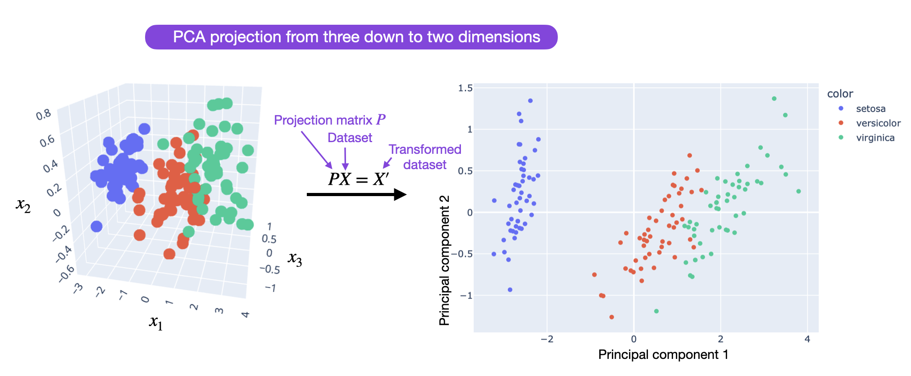
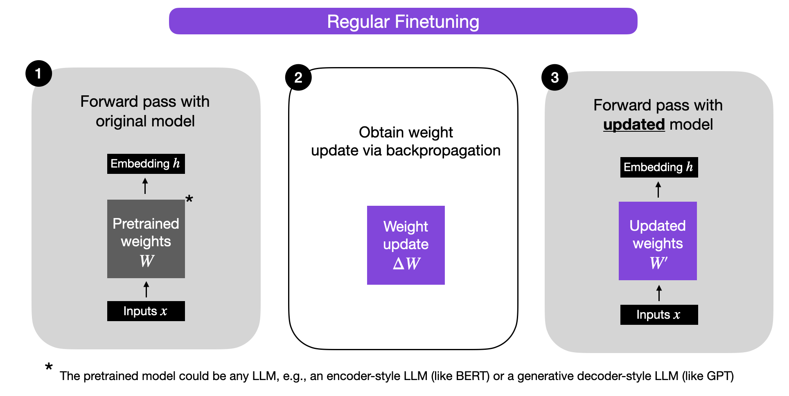
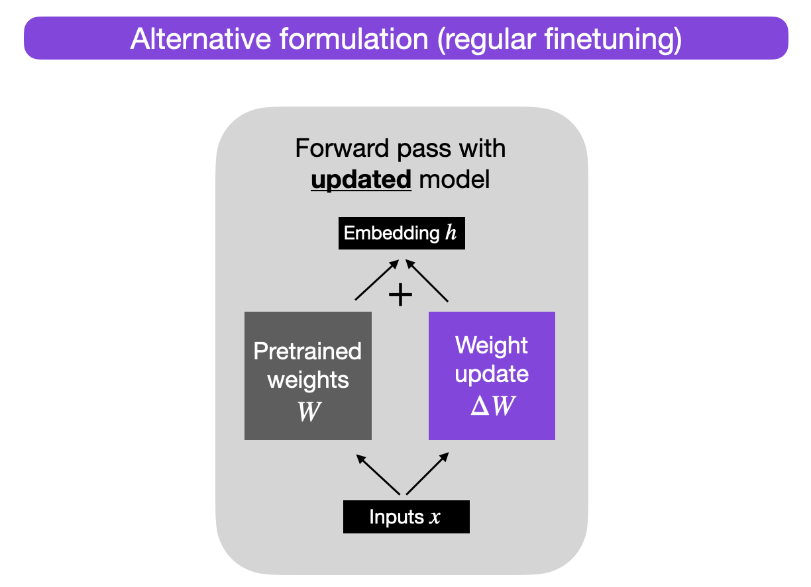
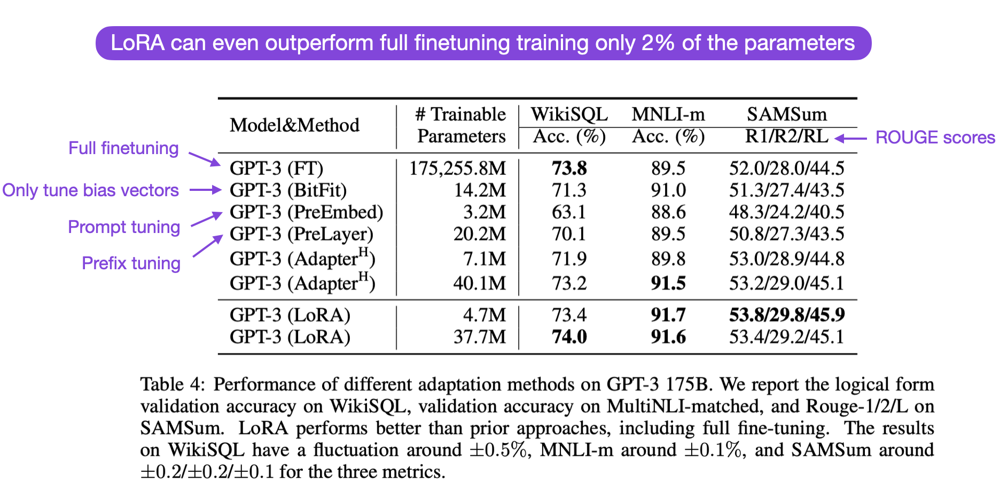
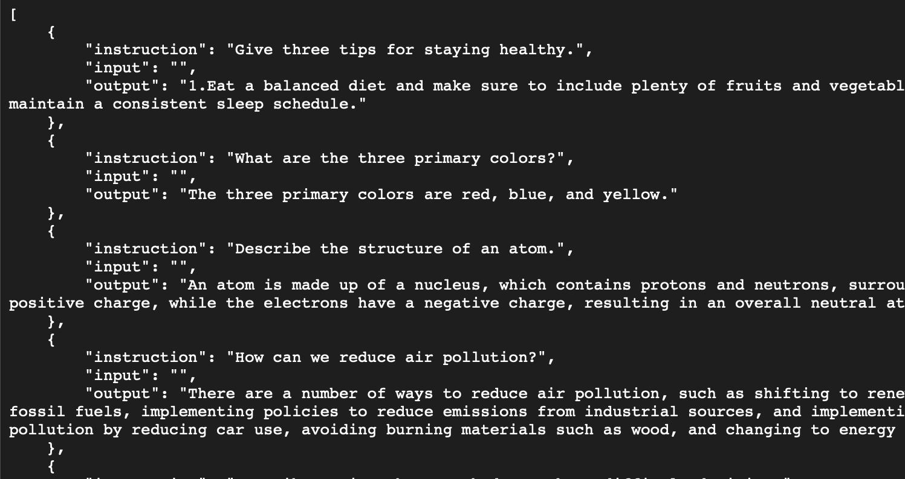
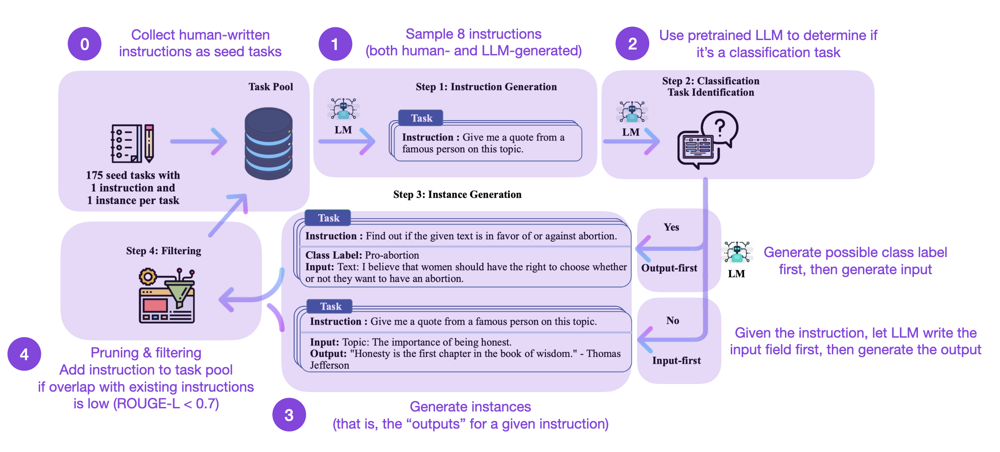

Parameter-Efficient LLM Finetuning With Low-Rank Adaptation (LoRA)
==================================================================

Apr 26, 2023  
by Sebastian Raschka

[RSS](https://sebastianraschka.com/rss_feed.xml)[Subscribe via Email](https://magazine.sebastianraschka.com/subscribe)

Key Takeaways
----------------------------------------------------------------------------------------------

In the rapidly evolving field of AI, using large language models in an efficient and effective manner is becoming more and more important. In this article, you will learn how to tune an LLM with Low-Rank Adaptation (LoRA) in computationally efficient manner!

Why Finetuning?
-------------------------------------------------------------------------------------------------

Pretrained large language models are often referred to as foundation models for a good reason: they perform well on various tasks, and we can use them as a foundation for finetuning on a target task. As discussed in my previous article ([Understanding Parameter-Efficient Finetuning of Large Language Models: From Prefix Tuning to LLaMA-Adapters](https://sebastianraschka.com/blog/2023/llm-finetuning-llama-adapter.html)), we discussed finetuning allows us to adapt a model to a target domain and target task. Still, it can be computationally very costly – the larger the model, the more expensive it is to update its layers.

As an alternative to updating all layers, parameter-efficient methods such as prefix tuning and adapters have been developed – for a detailed review, please see my [previous post](https://sebastianraschka.com/blog/2023/llm-finetuning-llama-adapter.html). Now, there is one more popular parameter-efficient finetuning technique: [Low-rank adaptation (LoRA) by Hu et al](https://arxiv.org/abs/2106.09685). What is LoRA? How does it work? And how does it compare to the other popular finetuning approaches? Let’s answer all these questions in this article!

The Idea Behind Low-Rank Adaptation
------------------------------------------------------------------------------------------------------------------------------------------

The parameter-efficient _Low-rank adaptation_ finetuning technique is, in a nutshell, an implicit low-rank transformation technique for large model weight matrices. So what is a low-rank transformation?

The overall idea and concept are related to principal component analysis (PCA) and singular vector decomposition (SVD), where we approximate a high-dimensional matrix or dataset using a lower-dimensional representation. In other words, we try to find a (linear) combination of a small number of dimensions in the original feature space (or matrix) that can capture most of the information in the dataset.

Making Weight Updates More Efficient
--------------------------------------------------------------------------------------------------------------------------------------------

Building on this idea outlined above, the paper [LoRA: Low-Rank Adaptation of Large Language Models](https://arxiv.org/abs/2106.09685) proposes to decompose the weight changes, _ΔW_, into a lower-rank representation. (To be technically correct, LoRA does not decompose the matrices directly, but it learns the decomposed matrices via backpropagation — this is a nitpicky detail that will make sense later).

Before we take a closer look at LoRA, let’s briefly explain the training procedure during regular finetuning. So, what are the weight changes _ΔW_? Suppose _W_ represents the weight matrix in a given neural network layer. Then, using regular backpropagation, we can obtain the weight update _ΔW_, which is typically calculated as a negative gradient of the loss times the learning rate:

ΔW\=α(−∇LW).

Then, when we have _ΔW_, we can update the original weights as follows: W′\=W+ΔW. This is illustrated in the figure below (bias vectors are omitted for simplicity):

Alternatively, we can keep the weight update matrix separate and compute the outputs as follows: h\=Wx+ΔWx,

where x represents the inputs, as illustrated below.

Why would we do this? For now, this alternative formulation serves a pedagogical goal to illustrate LoRA, but we will come back to it.

So, when we train fully connected (i.e., “dense”) layers in a neural network, as shown above, the weight matrices usually have full rank, which is a technical term meaning that a matrix does not have any linearly dependent (i.e., “redundant”) rows or columns. In contrast, to full rank, low rank means that the matrix has redundant rows or columns.

So, while the weights of a pretrained model have full rank on the pretrained tasks, the LoRA authors point out that pretrained large language models have a low “intrinsic dimension” when they are adapted to a new task, according to [Aghajanyan et al.](https://arxiv.org/abs/2012.13255) (2020).

A low intrinsic dimension means the data can be effectively represented or approximated by a lower-dimensional space while retaining most of its essential information or structure. In other words, this means we can decompose the new weight matrix for the adapted task into lower-dimensional (smaller) matrices without losing too much important information.

For example, suppose ΔW is the weight update for a weight matrix W∈RA×B. Then, we can decompose the weight update matrix into two smaller matrices: ΔW\=WAWB, where WA∈RA×r and WB∈Rr×B. Here, we keep the original weight W frozen and only train the new matrices WA and WB. This, in a nutshell, is the LoRA method, which is illustrated in the figure below.

### Choosing the rank

Note that r, in the figure above, is a hyperparameter here that we can use to specify the rank of the low-rank matrices used for adaptation. A smaller r leads to a simpler low-rank matrix, which results in fewer parameters to learn during adaptation. This can lead to faster training and potentially reduced computational requirements. However, with a smaller r, the capacity of the low-rank matrix to capture task-specific information decreases. This may result in lower adaptation quality, and the model might not perform as well on the new task compared to a higher r. In summary, choosing a smaller r in LoRA has a trade-off between model complexity, adaptation capacity, and the risk of underfitting or overfitting. It’s thus important to experiment with different r values to find the right balance to achieve the desired performance on the new task.

### Implementing LoRA

The implementation of LoRA is relatively straight-forward. We can think of it as a modified forward pass for the fully connected layers in an LLM. In pseudo-code, this looks like as follows:

    input_dim = 768  # e.g., the hidden size of the pre-trained model
    output_dim = 768  # e.g., the output size of the layer
    rank = 8  # The rank 'r' for the low-rank adaptation
    
    W = ... # from pretrained network with shape input_dim x output_dim
    
    W_A = nn.Parameter(torch.empty(input_dim, rank)) # LoRA weight A
    W_B = nn.Parameter(torch.empty(rank, output_dim)) # LoRA weight B
    
    # Initialization of LoRA weights
    nn.init.kaiming_uniform_(W_A, a=math.sqrt(5))
    nn.init.zeros_(W_B)
    
    def regular_forward_matmul(x, W):
        h = x @ W
    return h
    
    def lora_forward_matmul(x, W, W_A, W_B):
        h = x @ W  # regular matrix multiplication
        h += x @ (W_A @ W_B) * alpha # use scaled LoRA weights
    return h
    

In the pseudo-code above, `alpha` is a scaling factor that adjusts the magnitude of the combined result (original model output plus low-rank adaptation). This balances the pretrained model’s knowledge and the new task-specific adaptation — by default, `alpha` is usually set to 1. Also note that while WA is initialized to small random weights, WB is initialized to 0 so that

ΔW\=WAWB\=0 at the beginning of the training, meaning we begin the training with the original weights.

### Parameter efficiency

Now, let’s address the big elephant in the room: how is this parameter efficient if we introduce new weight matrices? The new matrices WA and WB can be very small. For example, suppose A\=100 and B\=500, then the size of ΔW is 100×500\=50,000. Now, if we decompose this into two smaller matrices WA∈R100×5 and WB∈R5×500 , we only have 5×100+5×500\=3,000 parameters in total.

### Reducing inference overhead

Note that in practice, if we keep the original weights W and the matrices WA and WB separate after training as shown above, we will incur a small efficiency penalty during inference as this introduces an additional computation step. Instead, we can update the weights after training via W′\=W+WAWB, which is analogous to W′\=W+ΔW mentioned earlier.

However, there can be practical advantages in keeping the weight matrices WA and WB separate. For example, imagine we want to keep our pretrained model as a base model for various customers, and we want to create a finetuned LLM for each customer starting from the base model. In this case, we don’t need to store the full weight matrices W′ for each customer, where storing all the weights W′\=W+WAWB for a model can be very large for LLMs, since LLMs typically have billions to trillions of weight parameters. So instead, we can keep the original model W and only need to store the new lightweight matrices WA and WB.

To illustrate this point with concrete numbers, a full 7B LLaMA checkpoint requires 23 GB of storage capacity, while the LoRA weights can be as small as 8 MB if we choose a rank of r\=8.

### How good is it in practice?

How good is LoRA in practice, and how does it compare to full finetuning and other parameter-efficient approaches? According to the [LoRA paper](https://arxiv.org/abs/2106.09685), the modeling performance of models using LoRA performs slightly better than models using [Adapters](https://arxiv.org/abs/2110.07280), [prompt tuning](https://arxiv.org/abs/2104.08691), or [prefix tuning](https://arxiv.org/abs/2101.00190) across several task-specific benchmarks. Often, LoRA performs even better than finetuning all layers, as shown in the annotated table from the LoRA paper below. (ROUGE is a metric for evaluating language translation performance, I explained it in more detail [here](https://twitter.com/rasbt/status/1639625228622917632?s=20).)

Here, it’s worth noting that LoRA is orthogonal to the other finetuning methods, meaning it can also be combined with prefix tuning and adapters, for example.

LoRA & LLaMA
-------------------------------------------------------------------------------------------

Now, let’s work with an implementation of LoRA for finetuning Meta’s popular LLaMA model. Since this is already a long article, I will refrain from including the detailed code in this article itself, but I recommend checking out the [Lit-LLaMA repository](https://github.com/Lightning-AI/lit-llama), which is a simple, readable reimplementation of Meta’s popular LLaMA model.

Besides code for training and running LLaMA itself (with the original Meta LLaMA weights), it also contains code for finetuning LLaMA using [LLaMA-Adapter](https://github.com/Lightning-AI/lit-llama/blob/main/finetune_adapter.py) and [LoRA](https://github.com/Lightning-AI/lit-llama/blob/main/finetune_lora.py).

To get started, I recommend the following _How-To_ files:

1.  Downloading pretrained weights \[ [download\_weights.md](https://github.com/Lightning-AI/lit-llama/blob/main/howto/download_weights.md) \]
2.  Finetuning with LoRA \[ [finetune\_lora.md](https://github.com/Lightning-AI/lit-llama/blob/main/howto/finetune_lora.md) \]
3.  Finetuning with Adapter \[ [finetune\_adapter.md](https://github.com/Lightning-AI/lit-llama/blob/main/howto/finetune_adapter.md) \] (optional, for comparison studies)

In the next section, we will compare the 7B LLaMA base model with the 7B LLaMA base finetuned using LoRA and LLaMA-Adapter. (Note that this requires a GPU with at least 24 Gb RAM). (For more details on the LLaMA-Adapter method, please see my [previous article](https://sebastianraschka.com/blog/2023/llm-finetuning-llama-adapter.html))

LoRA-LLaMA Computational Performance Benchmarks
------------------------------------------------------------------------------------------------------------------------------------------------------------------

In this section, we will compare the computational performance of the LLaMA 7B base model with the base model finetuned using LoRA and LLaMA-Adapter.

The finetuning dataset is the Alpaca 52k instruction dataset described [here](https://github.com/tatsu-lab/stanford_alpaca#data-release), which has the following structure:

The dataset itself was generated following the method described in the [Self-Instruct paper](https://arxiv.org/abs/2212.10560) and consists of 49,759 training examples and 2000 validation examples. The Self-Instruct procedure can be summarized in 4 steps:

How does this work? In a nutshell, it’s a 4-step process

1.  Seed task pool with a set of human-written instructions (175 in this case) and sample instructions
2.  Use a pretrained LLM (like GPT-3) to determine the task category
3.  Given the new instruction, let a pretrained LLM generate the response
4.  Collect, prune, and filter the responses before adding it to the task pool

Note that the Alpaca 52k dataset was collected using the automated self-instruct procedure above. However, you may also use (or compare it with) an alternative dataset. For example, an interesting candidate is the recently released open-source [databricks-dolly-15k](https://github.com/databrickslabs/dolly/tree/master/data) dataset that contains ~15k instruction/response finetuning records written by Databricks employees. The Lit-LLaMA repository contains a dataset preparation script in case you want to use this Dolly 15k dataset instead of the Alpaca 52k dataset.

Given the following hyperparameter settings (block size, batch size, and LoRA r) both Adapter and LoRA can finetune the 7B parameter LLaMA base model on a single GPU with 24 Gb RAM using bfloat-16 mixed precision training.

#### LoRA

    learning_rate = 3e-4
    batch_size = 128
    micro_batch_size = 4
    gradient_accumulation_steps = batch_size // micro_batch_size
    epoch_size = 50000  # train dataset size
    num_epochs = 5
    max_iters = num_epochs * epoch_size // micro_batch_size // devices
    weight_decay = 0.0
    block_size = 512
    lora_r = 8
    lora_alpha = 16
    lora_dropout = 0.05
    warmup_steps = 100
    

#### LLaMA Adapter

    learning_rate = 9e-3
    batch_size = 128 / devices
    micro_batch_size = 4
    gradient_accumulation_steps = batch_size // micro_batch_size
    epoch_size = 50000  # train dataset size
    num_epochs = 5
    max_iters = num_epochs * epoch_size // micro_batch_size // devices
    weight_decay = 0.02
    block_size = 512
    warmup_steps = epoch_size * 2 // micro_batch_size // devices
    

#### Full finetuning

    learning_rate = 3e-5
    batch_size = 128 / devices
    micro_batch_size = 4
    gradient_accumulation_steps = batch_size // micro_batch_size
    epoch_size = 50000  # train dataset size
    num_epochs = 5
    max_iters = num_epochs * epoch_size // micro_batch_size // devices
    weight_decay = 0.0
    block_size = 512
    warmup_steps = 100
    

In case the code changes in the future, I am including the code (with hyperparameter settings) [here on GitHub](https://github.com/rasbt/low-rank-adaptation-blog).

Adapter used about 22 Gb and finished 62,400 iterations in 162 min on an A100. LoRA used 21 Gb of memory and finished in 192 min. In sum, Adapter and LoRA use approximately the same amount of RAM and have roughly the same training time based on the Lit-LLaMA implementations. (Note that this is on a single GPU, but if you have multiple GPUs, just change the `devices` parameter to > 1 to take advantage of additional speedups!)

For comparison, full finetuning (LLaMA 7B consists of 32 transformer blocks and 3 fully connected output layers) required at least 2 GPUs with at least 30 Gb and fully sharded training to distribute the weights. Alternatively, you can use 4 GPUs with a maximum memory usage of 22 Gb per GPU. The training on 4 GPUs and the training took 1956 min. This would be at least 6,000 min on a single GPU, which would be 30-40x more expensive than the parameter-efficient LLaMA-Adapter or LoRA alternatives.

Next, let’s look at the model outputs after applying the different finetuning strategies.

Evaluating Modeling Performance
----------------------------------------------------------------------------------------------------------------------------------

There are several metrics for evaluating the text generated by LLMs. For example, perplexity, BLEU, and ROUGE scores are some of the most common evaluation metrics used in natural language processing to assess the performance of LLMs across various tasks. However, all of these metrics have substantial shortcomings, and human evaluations remain the gold standard – the downside of human evaluations is that they are expensive to create and hard to automate. Since this is already a very long article, I will refrain from a detailed discussion of model evaluation approaches and will defer this to a separate article in the future. In this future article, we will be looking at different Q&A datasets (including [`wikitext`](https://paperswithcode.com/dataset/wikitext-2), [`c4`](https://paperswithcode.com/dataset/c4), and [`ptb`](https://www.kaggle.com/datasets/bjoernjostein/ptbxl-electrocardiography-database), as well as the above-mentioned metrics.) So, for simplicity, we will only be focusing on a qualitative model comparison below, looking at some outputs generated by the various models.

A Qualitative Comparison
--------------------------------------------------------------------------------------------------------------------

To compare the models qualitatively, we will be using the prompt `"Please explain how weight decay works"`

**Base model**

    $ python generate.py --checkpoint_path checkpoints/lit-llama/7B/lit-llama.pth
    

> _Please explain how weight decay works…and why it sometimes seems to work and sometimes doesn’t!_
> 
> _In the simplest terms, weight decay removes features from the model (as a function of how important they are). It is also known as regularization._
> 
> _Regularization has_
> 
> Time for inference 1: 4.18 sec total, 11.95 tokens/sec
> 
> Memory used: 13.54 GB

As we can see, the model begins to continue the prompt by appending “…and why it sometimes seems to work and sometimes doesn’t!” That’s because the base model was only trained on a next-word prediction task and wasn’t specifically trained to follow instructions. Nonetheless, it attempts the explanation further below. The explanation makes somewhat correct statements about regularization in general, but it doesn’t really capture the key mechanics of weight decay. (To be fair, it should be mentioned that the training set input lengths were capped at 256 tokens for efficiency reasons.)

#### LLaMA-Adapter

    $ python generate_adapter.py --adapter_path out/adapter/alpaca/lit-llama-adapter-finetuned.pth --pretrained_path checkpoints/lit-llama/7B/lit-llama.pth
    

> _Weight decay is a way to penalize terms for their word-count. By choosing sentences with fewer words, a model is more likely to select those sentences, which may provide important information._
> 
> Time for inference: 7.04 sec total, 14.21 tokens/sec
> 
> Memory used: 13.56 GB

The explanation is grammatically sound, but it is also not necessarily what we are looking for.

#### LoRA

    $ python generate_lora.py --lora_path out/lora/alpaca/lit-llama-lora-finetuned.pth --pretrained_path checkpoints/lit-llama/7B/lit-llama.pth
    

> _Weight decay is an algorithm parameter used in machine learning models to reduce overfitting. It is a process where the weights of the model are adjusted in order to decrease the influence of less-important features in the model and prevent overfitting. Weight decay is used by adding a small amount of noise to the weights to reduce the impact of the model on the training data. This process encourages the model to focus more on the features that are more important to the predictive task._
> 
> Time for inference: 3.25 sec total, 30.76 tokens/sec
> 
> Memory used: 27.65 GB

We are getting closer; the explanation does make sense when we think of generalized linear models where we force the model to learn smaller weight parameters that are multiplied with the input features. In neural networks, this would typically be applied to all weight parameters in the model.

Note that the LoRA approach above currently uses the most memory. However, we can reduce this memory usage by merging the LoRA weights with the pretrained model weights, as described earlier.

This qualitative overview is only a thin slice of the capabilities of each of these models since evaluating LLMs is a big topic in itself. We will revisit this topic in a more detailed article in the future. But as a takeaway here, LoRA can be used to finetuning an LLM on an instruction dataset in a relatively cost-effective manner.

Conclusion
----------------------------------------------------------------------------------------

In this article, we discussed low-rank adaptation (LoRA), a parameter-efficient alternative to full finetuning. We saw that finetuning a relatively large model such as LLaMA can be done in a few hours on a single GPU using LoRA, which makes it particularly attractive to people who don’t want to spend thousands of dollars on GPU resources. What’s particularly nice about LoRA is that we can optionally merge the new LoRA weight matrices with the original, pretrained weights, such that we don’t incur additional overheads or complexity during inference.

As more and more open-source alternatives to ChatGPT or GPT-4 emerge, finetuning and customizing these LLMs on specific target datasets or targets will become more and more attractive across various research fields and industries. And parameter-efficient finetuning techniques such as LoRA make finetuning more resource-efficient and accessible.

Parameter-efficient finetuning techniques such as LoRA and LLaMA-Adapter are provided in the [Lit-LLaMA repository](https://github.com/Lightning-AI/lit-llama). We are always happy about contributions and suggestions if you have ideas for extensions or alternative techniques. Please don’t hesitate to reach out to us via [GitHub](https://github.com/Lightning-AI/lit-llama) or [Discord](https://discord.com/invite/XncpTy7DSt).

**Acknowledgements**

I want to thank Luca Antiga and Adrian Waelchli for the constructive feedback to improve the clarity of this article.

