Understanding and Coding Self-Attention, Multi-Head Attention, Causal-Attention, and Cross-Attention in LLMs
============================================================================================================

Jan 14, 2024

∙ Paid

This article will teach you about self-attention mechanisms used in transformer architectures and large language models (LLMs) such as GPT-4 and Llama. Self-attention and related mechanisms are core components of LLMs, making them a useful topic to understand when working with these models.

However, rather than just discussing the self-attention mechanism, we will code it in Python and PyTorch from the ground up. In my opinion, coding algorithms, models, and techniques from scratch is an excellent way to learn!

***

As a side note, this article is a modernized and extended version of "[Understanding and Coding the Self-Attention Mechanism of Large Language Models From Scratch](https://sebastianraschka.com/blog/2023/self-attention-from-scratch.html)," which I published on my old blog almost exactly a year ago. Since I really enjoy writing (and reading) 'from scratch' articles, I wanted to modernize this article for _Ahead of AI_.

Additionally, this article motivated me to write the book _[Build a Large Language Model (from Scratch)](http://mng.bz/amjo)_, which is currently in progress. Below is a mental model that summarizes the book and illustrates how the self-attention mechanism fits into the bigger picture.

[

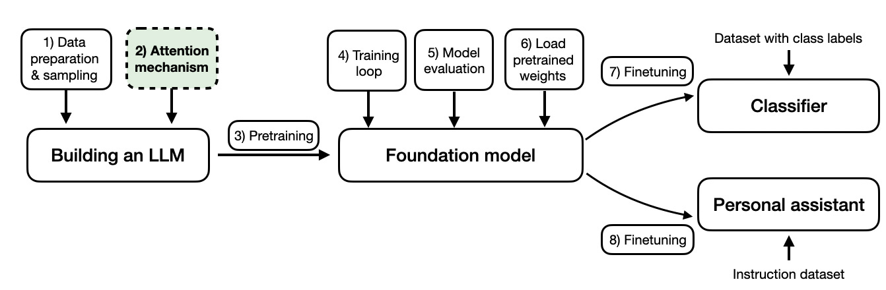

](https://substackcdn.com/image/fetch/$s_!zkNz!,f_auto,q_auto:good,fl_progressive:steep/https%3A%2F%2Fsubstack-post-media.s3.amazonaws.com%2Fpublic%2Fimages%2F924a2d16-e8c2-4acb-84ba-bf95f2df1b31_1342x440.png)

An overview of the topics covered in the _[Build a Large Language Model (from Scratch)](http://mng.bz/amjo) book_

To keep the length of this article somewhat reasonable, I'll assume you already know about LLMs and you also know about attention mechanisms on a basic level. The goal and focus of this article is to understand how attention mechanisms work via a Python & PyTorch code walkthrough.

**Introducing Self-Attention**

--------------------------------

Since its introduction via the original transformer paper ([Attention Is All You Need](https://arxiv.org/abs/1706.03762)), self-attention has become a cornerstone of many state-of-the-art deep learning models, particularly in the field of Natural Language Processing (NLP). Since self-attention is now everywhere, it's important to understand how it works.

[

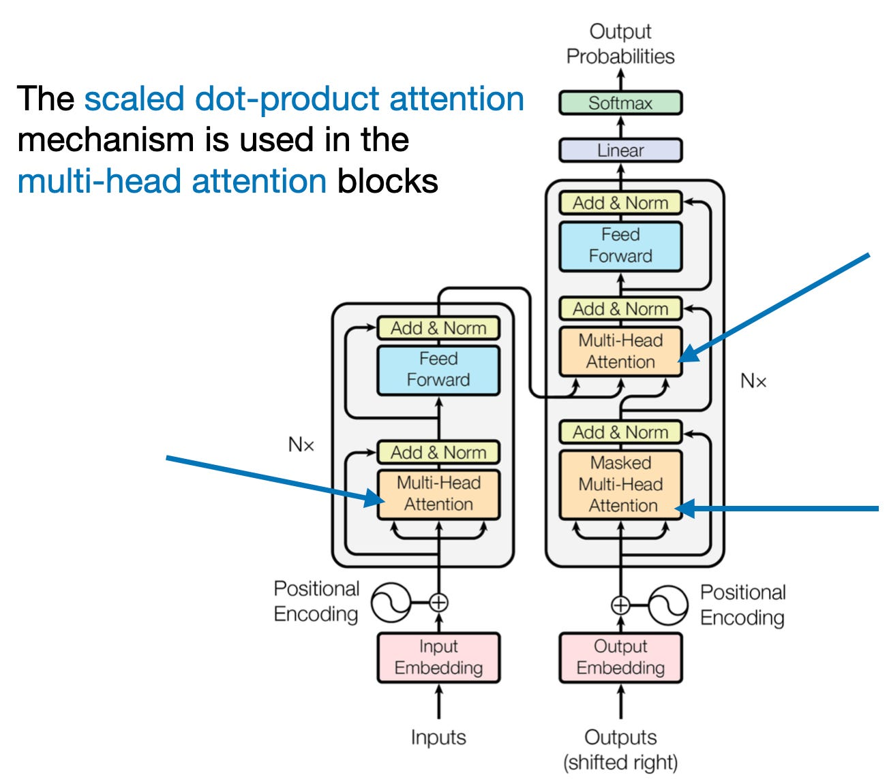

](https://substackcdn.com/image/fetch/$s_!BtVj!,f_auto,q_auto:good,fl_progressive:steep/https%3A%2F%2Fsubstack-post-media.s3.amazonaws.com%2Fpublic%2Fimages%2F97567e7b-f8b9-4dea-a678-162378609a75_1304x1150.png)

The original transformer architecture from [https://arxiv.org/abs/1706.03762](https://arxiv.org/abs/1706.03762)

The concept of "attention" in deep learning [has its roots in the effort to improve Recurrent Neural Networks (RNNs)](https://arxiv.org/abs/1409.0473) for handling longer sequences or sentences. For instance, consider translating a sentence from one language to another. Translating a sentence word-by-word is usually not an option because it ignores the complex grammatical structures and idiomatic expressions unique to each language, leading to inaccurate or nonsensical translations.

[

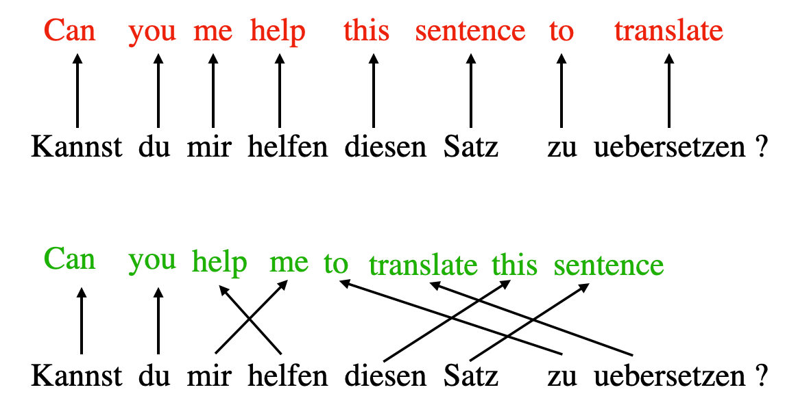

](https://substackcdn.com/image/fetch/$s_!uRaO!,f_auto,q_auto:good,fl_progressive:steep/https%3A%2F%2Fsubstack-post-media.s3.amazonaws.com%2Fpublic%2Fimages%2F2d632b81-5bd6-432a-a456-37f20788be20_1180x614.png)

An incorrect word-by-word translation (top) compared to a correct translation (bottom)

To overcome this issue, attention mechanisms were introduced to give access to all sequence elements at each time step. The key is to be selective and determine which words are most important in a specific context. [In 2017, the transformer architecture](https://arxiv.org/abs/1706.03762) introduced a standalone self-attention mechanism, eliminating the need for RNNs altogether.

(For brevity, and to keep the article focused on the technical self-attention details, I am keeping this background motivation section brief so that we can focus on the code implementation.)

[

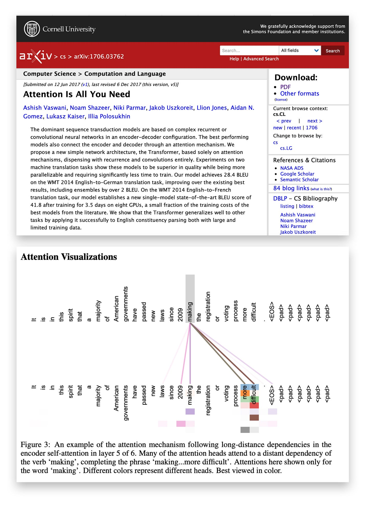

](https://substackcdn.com/image/fetch/$s_!sSRX!,f_auto,q_auto:good,fl_progressive:steep/https%3A%2F%2Fsubstack-post-media.s3.amazonaws.com%2Fpublic%2Fimages%2F49828e20-cd55-47bb-84a3-59effec1be79_3140x4251.png)

A visualization from the “Attention is All You Need” paper ([https://arxiv.org/abs/1706.03762](https://arxiv.org/abs/1706.03762)) showing how much the word “making” depends or focuses on other words in the input via attention weights (the color intensity is proportional the attention weight value).

We can think of self-attention as a mechanism that enhances the information content of an input embedding by including information about the input's context. In other words, the self-attention mechanism enables the model to weigh the importance of different elements in an input sequence and dynamically adjust their influence on the output. This is especially important for language processing tasks, where the meaning of a word can change based on its context within a sentence or document.

Note that there are many variants of self-attention. A particular focus has been on making self-attention more efficient. However, most papers still implement the original scaled-dot product attention mechanism introduced in the [Attention Is All You Need paper](https://arxiv.org/abs/1706.03762) since self-attention is rarely a computational bottleneck for most companies training large-scale transformers.

So, in this article, we focus on the original scaled-dot product attention mechanism (referred to as self-attention), which remains the most popular and most widely used attention mechanism in practice. However, if you are interested in other types of attention mechanisms, check out the [2020](https://arxiv.org/abs/2009.06732) _[Efficient Transformers: A Survey](https://arxiv.org/abs/2009.06732)_, the [2023](https://arxiv.org/abs/2302.01107) _[A Survey on Efficient Training of Transformers](https://arxiv.org/abs/2302.01107)_ review, and the recent [FlashAttention](https://arxiv.org/abs/2205.14135) and [FlashAttention-v2](https://arxiv.org/abs/2307.08691) papers.

**Embedding an Input Sentence**

---------------------------------

Before we begin, let's consider an input sentence _"Life is short, eat dessert first"_ that we want to put through the self-attention mechanism. Similar to other types of modeling approaches for processing text (e.g., using recurrent neural networks or convolutional neural networks), we create a sentence embedding first.

For simplicity, here our dictionary `dc` is restricted to the words that occur in the input sentence. In a real-world application, we would consider all words in the training dataset (typical vocabulary sizes range between 30k to 50k entries).

**In:**

    sentence = 'Life is short, eat dessert first'
    ​
    dc = {s:i for i,s 
          in enumerate(sorted(sentence.replace(',', '').split()))}
    
    print(dc)

**Out:**

    {'Life': 0, 'dessert': 1, 'eat': 2, 'first': 3, 'is': 4, 'short': 5}

Next, we use this dictionary to assign an integer index to each word:

**In:**

    import torch
    ​
    sentence_int = torch.tensor(
        [dc[s] for s in sentence.replace(',', '').split()]
    )
    print(sentence_int)

**Out:**

    tensor([0, 4, 5, 2, 1, 3])

Now, using the integer-vector representation of the input sentence, we can use an embedding layer to encode the inputs into a real-vector embedding. Here, we will use a tiny 3-dimensional embedding such that each input word is represented by a 3-dimensional vector.

Note that embedding sizes typically range from hundreds to thousands of dimensions. For instance, Llama 2 utilizes embedding sizes of 4,096. The reason we use 3-dimensional embeddings here is purely for illustration purposes. This allows us to examine the individual vectors without filling the entire page with numbers.

Since the sentence consists of 6 words, this will result in a 6×3-dimensional embedding:

**In:**

    vocab_size = 50_000
    ​
    torch.manual_seed(123)
    embed = torch.nn.Embedding(vocab_size, 3)
    embedded_sentence = embed(sentence_int).detach()
    ​
    print(embedded_sentence)
    print(embedded_sentence.shape)

**Out:**

    tensor([[ 0.3374, -0.1778, -0.3035],
            [ 0.1794,  1.8951,  0.4954],
            [ 0.2692, -0.0770, -1.0205],
            [-0.2196, -0.3792,  0.7671],
            [-0.5880,  0.3486,  0.6603],
            [-1.1925,  0.6984, -1.4097]])
    torch.Size([6, 3])

**Defining the Weight Matrices**

----------------------------------

Now, let's discuss the widely utilized self-attention mechanism known as the scaled dot-product attention, which is an integral part of the transformer architecture.

Self-attention utilizes three weight matrices, referred to as _**Wq**_, _**Wk**_, and _**Wv**_, which are adjusted as model parameters during training. These matrices serve to project the inputs into _query_, _key_, and _value_ components of the sequence, respectively.

The respective query, key and value sequences are obtained via matrix multiplication between the weight matrices _**W**_ and the embedded inputs _**x**_:

*   Query sequence: _**q(i)**_ \= _**x(i)Wq**_ for _i_ in sequence _1 … T_
    
*   Key sequence: _**k(i)**_ \= _**x(i)Wk**_ for _i_ in sequence _1 … T_
    
*   Value sequence: _**v(i)**_ \= _**x(i)Wv**_ for _i_ in sequence _1 … T_
    

The index _i_ refers to the token index position in the input sequence, which has length _T_.

[

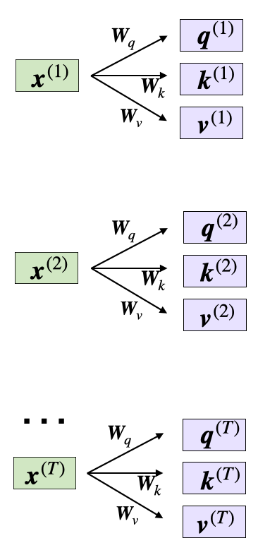

](https://substackcdn.com/image/fetch/$s_!3woZ!,f_auto,q_auto:good,fl_progressive:steep/https%3A%2F%2Fsubstack-post-media.s3.amazonaws.com%2Fpublic%2Fimages%2Fecef3e00-4c0e-4c7a-9a9f-42ac4e4ada69_366x786.png)

Computing the query, key, and value vectors via the input x and weights W.

Here, both _**q(i)**_ and _**k(i)**_ are vectors of dimension _**dk**_. The projection matrices _**Wq**_ and _**Wk**_ have a shape of _**d**_ × _**dk**_ , while _**Wv**_ has the shape _**d**_ × _**dv**_ .

(It's important to note that _**d**_ represents the size of each word vector, _**x**_.)

Since we are computing the dot-product between the query and key vectors, these two vectors have to contain the same number of elements (_**dq \= dk**_). In many LLMs, we use the same size for the value vectors such that _**dq \= dk \= dv**_. However, the number of elements in the value vector _**v(i)**_, which determines the size of the resulting context vector, can be arbitrary.

So, for the following code walkthrough, we will set _**dq \= dk \= 2**_ and use _**dv \= 4**_, initializing the projection matrices as follows:

**In:**

    torch.manual_seed(123)
    ​
    d = embedded_sentence.shape[1]
    ​
    d_q, d_k, d_v = 2, 2, 4
    ​
    W_query = torch.nn.Parameter(torch.rand(d, d_q))
    W_key = torch.nn.Parameter(torch.rand(d, d_k))
    W_value = torch.nn.Parameter(torch.rand(d, d_v))

(Similar to the word embedding vectors earlier, the dimensions _**dq, dk, dv**_ are usually much larger, but we use small numbers here for illustration purposes.)

Ahead of AI is a reader-supported publication. To receive new posts and support my work, consider becoming a free or paid subscriber.

**Computing the Unnormalized Attention Weights**

--------------------------------------------------

Now, let's suppose we are interested in computing the attention vector for the second input element -- the second input element acts as the query here:

[

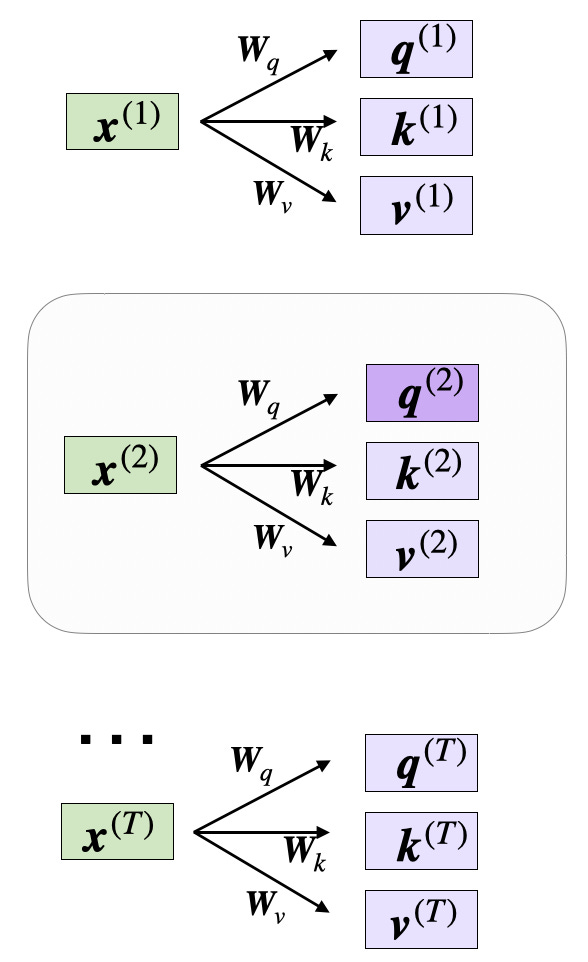

](https://substackcdn.com/image/fetch/$s_!qmcs!,f_auto,q_auto:good,fl_progressive:steep/https%3A%2F%2Fsubstack-post-media.s3.amazonaws.com%2Fpublic%2Fimages%2Ff9774001-ea9d-48bf-9857-3c911b0a279d_588x962.png)

For the following sections below, we focus on the second input, _**x**_(2)

In code, this looks like as follows:

**In:**

    x_2 = embedded_sentence[1]
    query_2 = x_2 @ W_query
    key_2 = x_2 @ W_key
    value_2 = x_2 @ W_value
    ​
    print(query_2.shape)
    print(key_2.shape)
    print(value_2.shape)

**Out:**

    torch.Size([2])
    torch.Size([2])
    torch.Size([4])

We can then generalize this to compute the remaining key, and value elements for all inputs as well, since we will need them in the next step when we compute the unnormalized attention weights later:

**In:**

    keys = embedded_sentence @ W_key
    values = embedded_sentence @ W_value
    ​
    print("keys.shape:", keys.shape)
    print("values.shape:", values.shape)

**Out:**

    keys.shape: torch.Size([6, 2])
    values.shape: torch.Size([6, 4])

Now that we have all the required keys and values, we can proceed to the next step and compute the unnormalized attention weights _**ω**_ (omega), which are illustrated in the figure below:

[

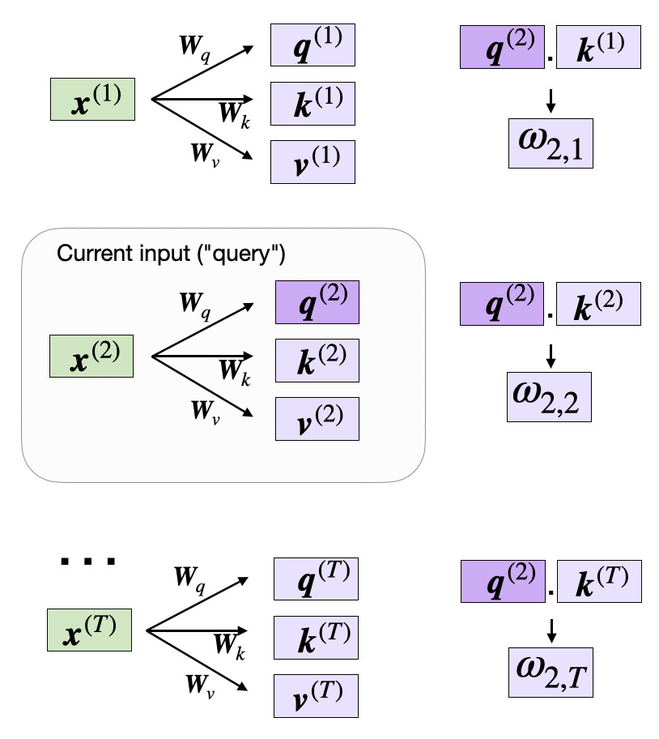

](https://substackcdn.com/image/fetch/$s_!7mUN!,f_auto,q_auto:good,fl_progressive:steep/https%3A%2F%2Fsubstack-post-media.s3.amazonaws.com%2Fpublic%2Fimages%2Fbaf9e308-223b-429e-8527-a7b868003e8c_814x912.png)

Computing the unnormalized attention weights _**ω**_ (omega)

As illustrated in the figure above, we compute _**ωi,j**_ as the dot product between the query and key sequences, _**ωi,j** \=_ _**q(i)**_ _**k(j)**_.

For example, we can compute the unnormalized attention weight for the query and 5th input element (corresponding to index position 4) as follows:

**In:**

    omega_24 = query_2.dot(keys[4])
    print(omega_24)

(Note that _**ω**_ is the symbol for the Greek letter "omega", hence the code variable with the same name above.)

**Out:**

    tensor(1.2903)

Since we will need those unnormalized attention weights _**ω**_ to compute the actual attention weights later, let's compute the _**ω**_ values for all input tokens as illustrated in the previous figure:

**In:**

    omega_2 = query_2 @ keys.T
    print(omega_2)

**Out:**

    tensor([-0.6004,  3.4707, -1.5023,  0.4991,  1.2903, -1.3374])

**Computing the Attention Weights**

-------------------------------------

The subsequent step in self-attention is to normalize the unnormalized attention weights, _**ω**_, to obtain the normalized attention weights, _**α**_ (alpha), by applying the softmax function. Additionally, 1/√{_**dk**_} is used to scale _**ω**_ before normalizing it through the softmax function, as shown below:

[

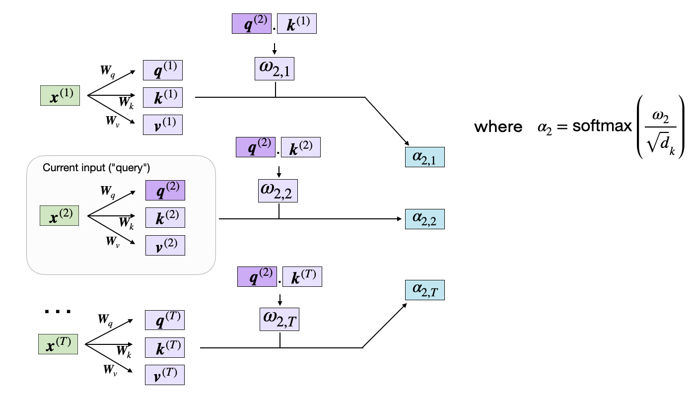

](https://substackcdn.com/image/fetch/$s_!rgXp!,f_auto,q_auto:good,fl_progressive:steep/https%3A%2F%2Fsubstack-post-media.s3.amazonaws.com%2Fpublic%2Fimages%2F42da287a-18e8-45c7-860c-46e8a3a534fc_1400x798.png)

Computing the normalized attention weights _**α**_

The scaling by _**dk**_ ensures that the Euclidean length of the weight vectors will be approximately in the same magnitude. This helps prevent the attention weights from becoming too small or too large, which could lead to numerical instability or affect the model's ability to converge during training.

In code, we can implement the computation of the attention weights as follows:

**In:**

    import torch.nn.functional as F
    ​
    attention_weights_2 = F.softmax(omega_2 / d_k**0.5, dim=0)
    print(attention_weights_2)

**Out:**

    tensor([0.0386, 0.6870, 0.0204, 0.0840, 0.1470, 0.0229])

Finally, the last step is to compute the context vector _**z(2)**_, which is an attention-weighted version of our original query input _**x(2)**_, including all the other input elements as its context via the attention weights:

[

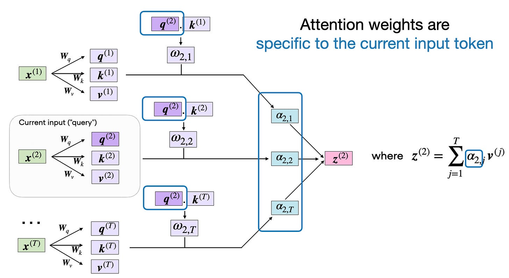

](https://substackcdn.com/image/fetch/$s_!GpWw!,f_auto,q_auto:good,fl_progressive:steep/https%3A%2F%2Fsubstack-post-media.s3.amazonaws.com%2Fpublic%2Fimages%2F6e1dcdeb-e096-4ff9-bdf9-3338e4efa4b4_1916x1048.png)

The attention weights are specific to a certain input element. Here, we chose input element _**x**(2)._

In code, this looks like as follows:

**In:**

    context_vector_2 = attention_weights_2 @ values
    ​
    print(context_vector_2.shape)
    print(context_vector_2)

**Out:**

    torch.Size([4])
    tensor([0.5313, 1.3607, 0.7891, 1.3110])

Note that this output vector has more dimensions (_**dv \= 4**_) than the original input vector (_**d** **\= 3**_) since we specified _**dv** **\> d**_ earlier; however, the embedding size choice _**dv**_ is arbitrary.

**Self-Attention**

--------------------

Now, to wrap up the code implementation of the self-attention mechanism in the previous sections above, we can summarize the previous code in a compact `SelfAttention` class:

**In:**

    import torch.nn as nn
    ​
    class SelfAttention(nn.Module):
    ​
        def __init__(self, d_in, d_out_kq, d_out_v):
            super().__init__()
            self.d_out_kq = d_out_kq
            self.W_query = nn.Parameter(torch.rand(d_in, d_out_kq))
            self.W_key   = nn.Parameter(torch.rand(d_in, d_out_kq))
            self.W_value = nn.Parameter(torch.rand(d_in, d_out_v))
    ​
        def forward(self, x):
            keys = x @ self.W_key
            queries = x @ self.W_query
            values = x @ self.W_value
            
            attn_scores = queries @ keys.T  # unnormalized attention weights    
            attn_weights = torch.softmax(
                attn_scores / self.d_out_kq**0.5, dim=-1
            )
            
            context_vec = attn_weights @ values
            return context_vec

Following PyTorch conventions, the `SelfAttention` class above initializes the self-attention parameters in the `__init__` method and computes attention weights and context vectors for all inputs via the `forward` method. We can use this class as follows:

**In:**

    torch.manual_seed(123)
    ​
    # reduce d_out_v from 4 to 1, because we have 4 heads
    d_in, d_out_kq, d_out_v = 3, 2, 4
    ​
    sa = SelfAttention(d_in, d_out_kq, d_out_v)
    print(sa(embedded_sentence))

**Out:**

    tensor([[-0.1564,  0.1028, -0.0763, -0.0764],
            [ 0.5313,  1.3607,  0.7891,  1.3110],
            [-0.3542, -0.1234, -0.2627, -0.3706],
            [ 0.0071,  0.3345,  0.0969,  0.1998],
            [ 0.1008,  0.4780,  0.2021,  0.3674],
            [-0.5296, -0.2799, -0.4107, -0.6006]], grad_fn=<MmBackward0>)

If you look at the second row, you can see that it matches the values in `context_vector_2` from the previous section exactly: `tensor([0.5313, 1.3607, 0.7891, 1.3110])`.

**Multi-Head Attention**

--------------------------

In the very first figure, at the top of this article (also shown again for convenience below), we saw that transformers use a module called _multi-head attention_.

[

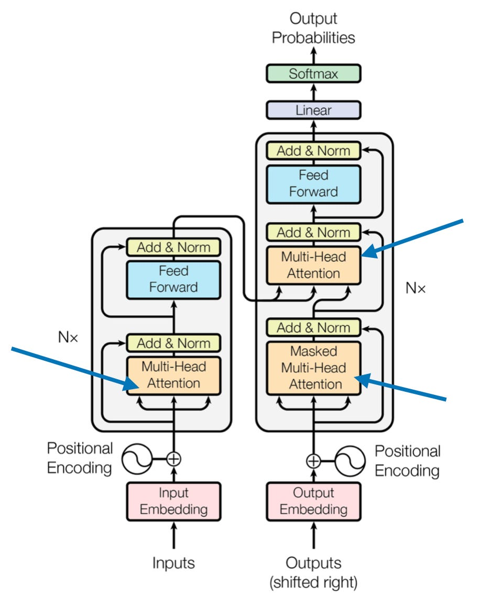

](https://substackcdn.com/image/fetch/$s_!vVWg!,f_auto,q_auto:good,fl_progressive:steep/https%3A%2F%2Fsubstack-post-media.s3.amazonaws.com%2Fpublic%2Fimages%2F57269a7a-8ecc-4ed6-b6d7-79a9982dd776_918x1152.png)

The multi-head attention modules in the original transformer architecture from [https://arxiv.org/abs/1706.03762](https://arxiv.org/abs/1706.03762)

How does this "multi-head" attention module relate to the self-attention mechanism (scaled-dot product attention) we walked through above?

In scaled dot-product attention, the input sequence was transformed using three matrices representing the query, key, and value. These three matrices can be considered as a single attention head in the context of multi-head attention. The figure below summarizes this single attention head we covered and implemented previously:

[

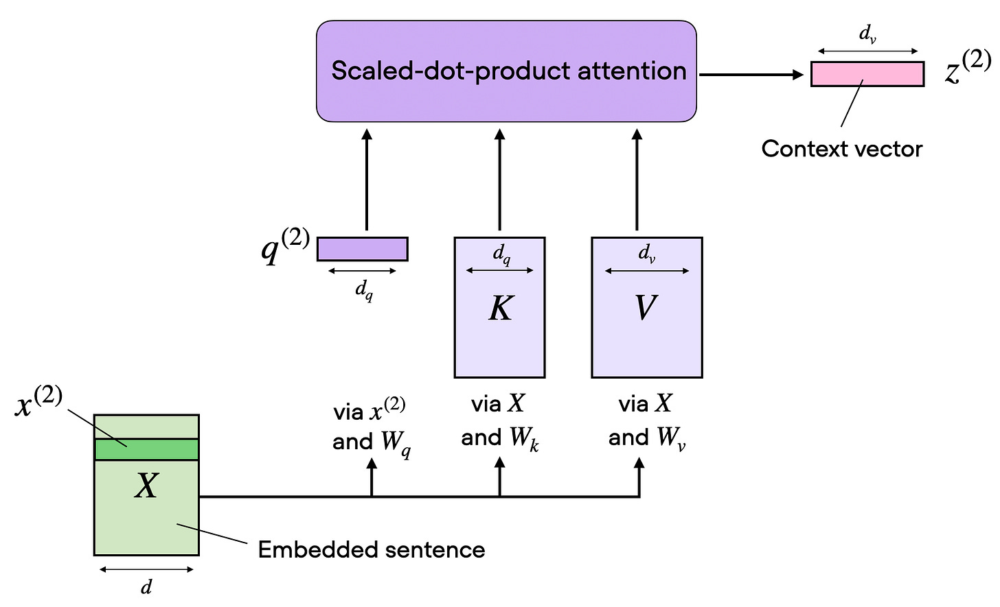

](https://substackcdn.com/image/fetch/$s_!sfR2!,f_auto,q_auto:good,fl_progressive:steep/https%3A%2F%2Fsubstack-post-media.s3.amazonaws.com%2Fpublic%2Fimages%2F7651e279-01ed-4316-91dc-d6be8ef4e947_1836x1116.png)

Summarizing the self-attention mechanism implemented previously

As its name implies, multi-head attention involves multiple such heads, each consisting of query, key, and value matrices. This concept is similar to the use of multiple kernels in convolutional neural networks, producing feature maps with multiple output channels.

[

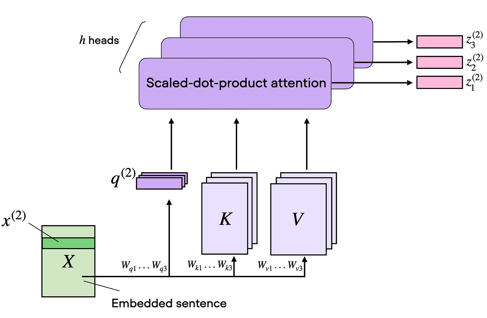

](https://substackcdn.com/image/fetch/$s_!57T6!,f_auto,q_auto:good,fl_progressive:steep/https%3A%2F%2Fsubstack-post-media.s3.amazonaws.com%2Fpublic%2Fimages%2Ff406d55e-990a-4e3b-be82-d966eb74a3e7_1766x1154.png)

Multi-head attention: self-attention with multiple heads

To illustrate this in code, we can write a `MultiHeadAttentionWrapper` class for our previous `SelfAttention` class:

    class MultiHeadAttentionWrapper(nn.Module):
    ​
        def __init__(self, d_in, d_out_kq, d_out_v, num_heads):
            super().__init__()
            self.heads = nn.ModuleList(
                [SelfAttention(d_in, d_out_kq, d_out_v) 
                 for _ in range(num_heads)]
            )
    ​
        def forward(self, x):
            return torch.cat([head(x) for head in self.heads], dim=-1)

The `d_*` parameters are the same as before in the `SelfAttention` class -- the only new input parameter here is the number of attention heads:

*   `d_in`: Dimension of the input feature vector.
    
*   `d_out_kq`: Dimension for both query and key outputs.
    
*   `d_out_v`: Dimension for value outputs.
    
*   `num_heads`: Number of attention heads.
    

We initialize the `SelfAttention` class `num_heads` times using these input parameters. And we use a PyTorch `nn.ModuleList` to store these multiple `SelfAttention` instances.

Then, the `forward` pass involves applying each `SelfAttention` head (stored in `self.heads`) to the input `x` independently. The results from each head are then concatenated along the last dimension (`dim=-1`). Let's see it in action below!

First, let's suppose we have a single Self-Attention head with output dimension 1 to keep it simple for illustration purposes:

**In:**

    torch.manual_seed(123)
    ​
    d_in, d_out_kq, d_out_v = 3, 2, 1
    ​
    sa = SelfAttention(d_in, d_out_kq, d_out_v)
    print(sa(embedded_sentence))

**Out:**

    tensor([[-0.0185],
            [ 0.4003],
            [-0.1103],
            [ 0.0668],
            [ 0.1180],
            [-0.1827]], grad_fn=<MmBackward0>)

Now, let's extend this to 4 attention heads:

**In:**

    torch.manual_seed(123)
    ​
    block_size = embedded_sentence.shape[1]
    mha = MultiHeadAttentionWrapper(
        d_in, d_out_kq, d_out_v, num_heads=4
    )
    ​
    context_vecs = mha(embedded_sentence)
    ​
    print(context_vecs)
    print("context_vecs.shape:", context_vecs.shape)

**Out:**

    tensor([[-0.0185,  0.0170,  0.1999, -0.0860],
            [ 0.4003,  1.7137,  1.3981,  1.0497],
            [-0.1103, -0.1609,  0.0079, -0.2416],
            [ 0.0668,  0.3534,  0.2322,  0.1008],
            [ 0.1180,  0.6949,  0.3157,  0.2807],
            [-0.1827, -0.2060, -0.2393, -0.3167]], grad_fn=<CatBackward0>)
    context_vecs.shape: torch.Size([6, 4])

Based on the output above, you can see that the single self-attention head created earlier now represents the first column in the output tensor above.

Notice that the multi-head attention result is a 6×4-dimensional tensor: We have 6 input tokens and 4 self-attention heads, where each self-attention head returns a 1-dimensional output. Previously, in the Self-Attention section, we also produced a 6×4-dimensional tensor. That's because we set the output dimension to 4 instead of 1. In practice, why do we even need multiple attention heads if we can regulate the output embedding size in the `SelfAttention` class itself?

The distinction between increasing the output dimension of a single self-attention head and using multiple attention heads lies in how the model processes and learns from the data. While both approaches increase the capacity of the model to represent different features or aspects of the data, they do so in fundamentally different ways.

For instance, each attention head in multi-head attention can potentially learn to focus on different parts of the input sequence, capturing various aspects or relationships within the data. This diversity in representation is key to the success of multi-head attention.

Multi-head attention can also be more efficient, especially in terms of parallel computation. Each head can be processed independently, making it well-suited for modern hardware accelerators like GPUs or TPUs that excel at parallel processing.

In short, the use of multiple attention heads is not just about increasing the model's capacity but about enhancing its ability to learn a diverse set of features and relationships within the data. For example, the 7B Llama 2 model uses 32 attention heads.

**Causal Self-Attention**

---------------------------

In this section, we are adapting the previously discussed self-attention mechanism into a causal self-attention mechanism, specifically for GPT-like (decoder-style) LLMs that are used to generate text. This causal self-attention mechanism is also often referred to as “masked self-attention”. In the original transformer architecture, it corresponds to the “masked multi-head attention” module — for simplicity, we will look at a single attention head in this section, but the same concept generalizes to multiple heads.

[

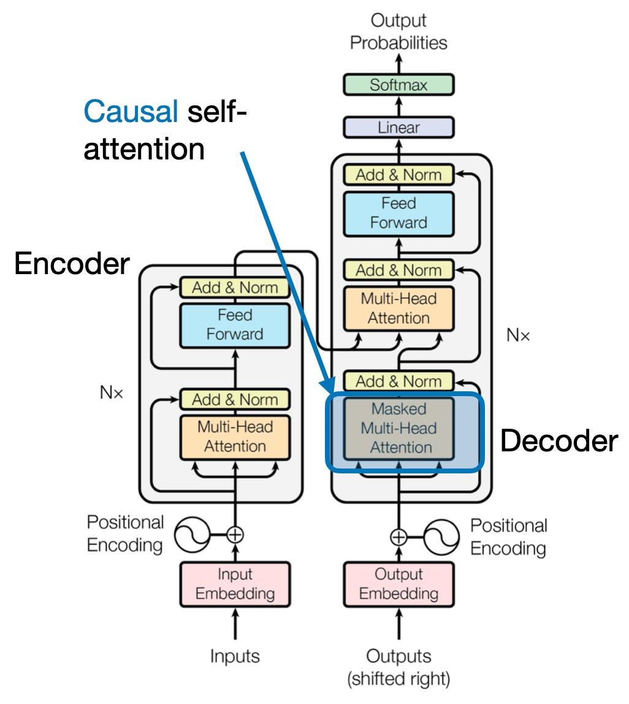

](https://substackcdn.com/image/fetch/$s_!vQYr!,f_auto,q_auto:good,fl_progressive:steep/https%3A%2F%2Fsubstack-post-media.s3.amazonaws.com%2Fpublic%2Fimages%2Fc51bfe11-c2cf-4ce5-95d4-4f8a57eac997_1026x1148.png)

The causal self-attention module in the original transformer architecture (via “Attention Is All You Need”, [https://arxiv.org/abs/1706.03762](https://arxiv.org/abs/1706.03762))

Causal self-attention ensures that the outputs for a certain position in a sequence is based only on the known outputs at previous positions and not on future positions. In simpler terms, it ensures that the prediction for each next word should only depend on the preceding words. To achieve this in GPT-like LLMs, for each token processed, we mask out the future tokens, which come after the current token in the input text.

The application of a causal mask to the attention weights for hiding future input tokens in the inputs is illustrated in the figure below.

[

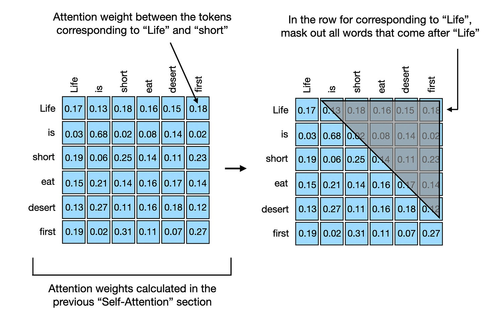

](https://substackcdn.com/image/fetch/$s_!W-5R!,f_auto,q_auto:good,fl_progressive:steep/https%3A%2F%2Fsubstack-post-media.s3.amazonaws.com%2Fpublic%2Fimages%2Fb7dd5ec8-4912-4e0d-8265-b335c08d2958_1760x1126.png)

To illustrate and implement causal self-attention, let's work with the unweighted attention scores and attention weights from the previous section. First, we quickly recap the computation of the attention scores from the previous _Self-Attention_ section:

**In:**

    torch.manual_seed(123)
    ​
    d_in, d_out_kq, d_out_v = 3, 2, 4
    ​
    W_query = nn.Parameter(torch.rand(d_in, d_out_kq))
    W_key   = nn.Parameter(torch.rand(d_in, d_out_kq))
    W_value = nn.Parameter(torch.rand(d_in, d_out_v))
    ​
    x = embedded_sentence
    ​
    keys = x @ W_key
    queries = x @ W_query
    values = x @ W_value
    ​
    # attn_scores are the "omegas", 
    # the unnormalized attention weights
    attn_scores = queries @ keys.T 
    ​
    print(attn_scores)
    print(attn_scores.shape)

**Out:**

    tensor([[ 0.0613, -0.3491,  0.1443, -0.0437, -0.1303,  0.1076],
            [-0.6004,  3.4707, -1.5023,  0.4991,  1.2903, -1.3374],
            [ 0.2432, -1.3934,  0.5869, -0.1851, -0.5191,  0.4730],
            [-0.0794,  0.4487, -0.1807,  0.0518,  0.1677, -0.1197],
            [-0.1510,  0.8626, -0.3597,  0.1112,  0.3216, -0.2787],
            [ 0.4344, -2.5037,  1.0740, -0.3509, -0.9315,  0.9265]],
           grad_fn=<MmBackward0>)
    torch.Size([6, 6])

Similar to the _Self-Attention_ section before, the output above is a 6×6 tensor containing these pairwise unnormalized attention weights (also called attention scores) for the 6 input tokens.

Previously, we then computed the scaled dot-product attention via the softmax function as follows:

**In:**

    attn_weights = torch.softmax(attn_scores / d_out_kq**0.5, dim=1)
    print(attn_weights)

**Out:**

    tensor([[0.1772, 0.1326, 0.1879, 0.1645, 0.1547, 0.1831],
            [0.0386, 0.6870, 0.0204, 0.0840, 0.1470, 0.0229],
            [0.1965, 0.0618, 0.2506, 0.1452, 0.1146, 0.2312],
            [0.1505, 0.2187, 0.1401, 0.1651, 0.1793, 0.1463],
            [0.1347, 0.2758, 0.1162, 0.1621, 0.1881, 0.1231],
            [0.1973, 0.0247, 0.3102, 0.1132, 0.0751, 0.2794]],
           grad_fn=<SoftmaxBackward0>)

The 6×6 output above represents the attention weights, which we also computed in the _Self-Attention_ section before.

Now, in GPT-like LLMs, we train the model to read and generate one token (or word) at a time, from left to right. If we have a training text sample like "Life is short eat desert first" we have the following setup, where the context vectors for the word to the right side of the arrow should only incorporate itself and the previous words:

*   "Life" → "is"
    
*   "Life is" → "short"
    
*   "Life is short" → "eat"
    
*   "Life is short eat" → "desert"
    
*   "Life is short eat desert" → "first"
    

The simplest way to achieve this setup above is to mask out all future tokens by applying a mask to the attention weight matrix above the diagonal, as illustrated in the figure below. This way, “future” words will not be included when creating the context vectors, which are created as a attention-weighted sum over the inputs.

[

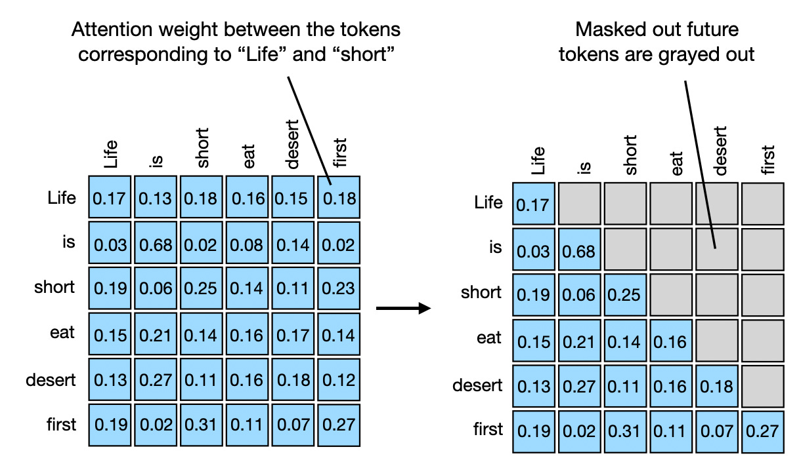

](https://substackcdn.com/image/fetch/$s_!rOs7!,f_auto,q_auto:good,fl_progressive:steep/https%3A%2F%2Fsubstack-post-media.s3.amazonaws.com%2Fpublic%2Fimages%2Fe1317a05-3542-4158-94bf-085109a5793a_1220x702.png)

Attention weights above the diagonal should be masked out

In code, we can achieve this via PyTorch's [tril](https://pytorch.org/docs/stable/generated/torch.tril.html#) function, which we first use to create a mask of 1's and 0's:

**In:**

    block_size = attn_scores.shape[0]
    mask_simple = torch.tril(torch.ones(block_size, block_size))
    print(mask_simple)

**Out:**

    tensor([[1., 0., 0., 0., 0., 0.],
            [1., 1., 0., 0., 0., 0.],
            [1., 1., 1., 0., 0., 0.],
            [1., 1., 1., 1., 0., 0.],
            [1., 1., 1., 1., 1., 0.],
            [1., 1., 1., 1., 1., 1.]])

Next, we multiply the attention weights with this mask to zero out all the attention weights above the diagonal:

**In:**

    masked_simple = attn_weights*mask_simple
    print(masked_simple)

**Out:**

    tensor([[0.1772, 0.0000, 0.0000, 0.0000, 0.0000, 0.0000],
            [0.0386, 0.6870, 0.0000, 0.0000, 0.0000, 0.0000],
            [0.1965, 0.0618, 0.2506, 0.0000, 0.0000, 0.0000],
            [0.1505, 0.2187, 0.1401, 0.1651, 0.0000, 0.0000],
            [0.1347, 0.2758, 0.1162, 0.1621, 0.1881, 0.0000],
            [0.1973, 0.0247, 0.3102, 0.1132, 0.0751, 0.2794]],
           grad_fn=<MulBackward0>)

While the above is one way to mask out future words, notice that the attention weights in each row don't sum to one anymore. To mitigate that, we can normalize the rows such that they sum up to 1 again, which is a standard convention for attention weights:

**In:**

    row_sums = masked_simple.sum(dim=1, keepdim=True)
    masked_simple_norm = masked_simple / row_sums
    print(masked_simple_norm)

**Out:**

    tensor([[1.0000, 0.0000, 0.0000, 0.0000, 0.0000, 0.0000],
            [0.0532, 0.9468, 0.0000, 0.0000, 0.0000, 0.0000],
            [0.3862, 0.1214, 0.4924, 0.0000, 0.0000, 0.0000],
            [0.2232, 0.3242, 0.2078, 0.2449, 0.0000, 0.0000],
            [0.1536, 0.3145, 0.1325, 0.1849, 0.2145, 0.0000],
            [0.1973, 0.0247, 0.3102, 0.1132, 0.0751, 0.2794]],
           grad_fn=<DivBackward0>)

As we can see, the attention weights in each row now sum up to 1.

Normalizing attention weights in neural networks, such as in transformer models, is advantageous over unnormalized weights for two main reasons. First, normalized attention weights that sum to 1 resemble a probability distribution. This makes it easier to interpret the model's attention to various parts of the input in terms of proportions. Second, by constraining the attention weights to sum to 1, this normalization helps control the scale of the weights and gradients to improve the training dynamics.

**More efficient masking without renormalization**

In the causal self-attention procedure we coded above, we first compute the attention scores, then compute the attention weights, mask out attention weights above the diagonal, and lastly renormalize the attention weights. This is summarized in the figure below:

[

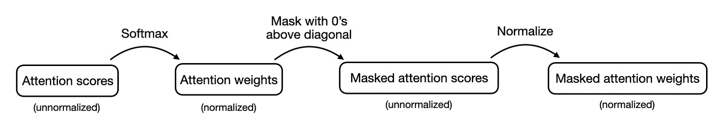

](https://substackcdn.com/image/fetch/$s_!pRz7!,f_auto,q_auto:good,fl_progressive:steep/https%3A%2F%2Fsubstack-post-media.s3.amazonaws.com%2Fpublic%2Fimages%2F7fcce180-cda2-4094-bb7c-32ea12e60c9a_1468x274.png)

The previously implemented causal self-attention procedure

Alternatively, there is a more efficient way to achieve the same results. In this approach, we take the attention scores and replace the values above the diagonal with negative infinity before the values are input into the softmax function to compute the attention weights. This is summarized in the figure below:

[

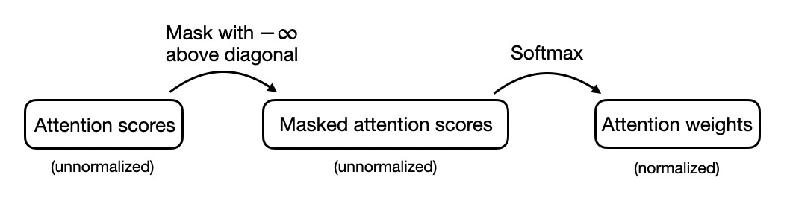

](https://substackcdn.com/image/fetch/$s_!vh8x!,f_auto,q_auto:good,fl_progressive:steep/https%3A%2F%2Fsubstack-post-media.s3.amazonaws.com%2Fpublic%2Fimages%2Fa94e36c7-ec67-43d6-96c0-7f9781f402b5_1054x270.png)

An alternative, more efficient approach to implementing causal self-attention

We can code up this procedure in PyTorch as follows, starting with masking the attention scores above the diagonal:

**In:**

    mask = torch.triu(torch.ones(block_size, block_size), diagonal=1)
    masked = attn_scores.masked_fill(mask.bool(), -torch.inf)
    print(masked)

The code above first creates a `mask` with 0s below the diagonal, and 1s above the diagonal. Here, `torch.triu` (**u**pper **tri**angle) retains the elements on and above the main diagonal of a matrix, zeroing out the elements below it, thus preserving the upper triangular portion. In contrast, `torch.tril` (**l**ower **t**riangle) keeps the elements on and below the main diagonal.

The `masked_fill` method then replaces all the elements above the diagonal via positive mask values (1s) with `-torch.inf`, with the results being shown below.

**Out:**

    tensor([[ 0.0613,    -inf,    -inf,    -inf,    -inf,    -inf],
            [-0.6004,  3.4707,    -inf,    -inf,    -inf,    -inf],
            [ 0.2432, -1.3934,  0.5869,    -inf,    -inf,    -inf],
            [-0.0794,  0.4487, -0.1807,  0.0518,    -inf,    -inf],
            [-0.1510,  0.8626, -0.3597,  0.1112,  0.3216,    -inf],
            [ 0.4344, -2.5037,  1.0740, -0.3509, -0.9315,  0.9265]],
           grad_fn=<MaskedFillBackward0>)

Then, all we have to do is to apply the softmax function as usual to obtain the normalized and masked attention weights:

**In:**

    attn_weights = torch.softmax(masked / d_out_kq**0.5, dim=1)
    print(attn_weights)

**Out:**

    tensor([[1.0000, 0.0000, 0.0000, 0.0000, 0.0000, 0.0000],
            [0.0532, 0.9468, 0.0000, 0.0000, 0.0000, 0.0000],
            [0.3862, 0.1214, 0.4924, 0.0000, 0.0000, 0.0000],
            [0.2232, 0.3242, 0.2078, 0.2449, 0.0000, 0.0000],
            [0.1536, 0.3145, 0.1325, 0.1849, 0.2145, 0.0000],
            [0.1973, 0.0247, 0.3102, 0.1132, 0.0751, 0.2794]],
           grad_fn=<SoftmaxBackward0>)  

Why does this work? The softmax function, applied in the last step, converts the input values into a probability distribution. When `-inf` is present in the inputs, softmax effectively treats them as zero probability. This is because `e^(-inf)` approaches 0, and thus these positions contribute nothing to the output probabilities.

**Conclusion**

----------------

In this article, we explored the inner workings of self-attention through a step-by-step coding approach. Using this as a foundation, we then looked into multi-head attention, a fundamental component of large language transformers.

We then also coded cross-attention, a variant of self-attention that is particularly effective when applied between two distinct sequences. And lastly, we coded causal self-attention, a concept crucial for generating coherent and contextually appropriate sequences in decoder-style LLMs such as GPT and Llama.

By coding these complex mechanisms from scratch, you hopefully gained a good understanding of the inner workings of the self-attention mechanism used in transformers and LLMs.

(Note that the code presented in this article is intended for illustrative purposes. If you plan to implement self-attention for training LLMs, I recommend considering optimized implementations like [Flash Attention](https://arxiv.org/abs/2307.08691), which reduce memory footprint and computational load.)

**Bonus Topic: Cross-Attention**

----------------------------------

In the code walkthrough above, the sections on Self-Attention and Causal-Attention, we set _**d\_q = d\_k = 2**_ and _**d\_v = 4**_. In other words, we used the same dimensions for query and key sequences. While the value matrix _**W\_v**_ is often chosen to have the same dimension as the query and key matrices (such as in PyTorch's [MultiHeadAttention](https://pytorch.org/docs/stable/generated/torch.nn.MultiheadAttention.html) class), we can select an arbitrary number size for the value dimensions…