Understanding Large Language Models
===================================

### A Cross-Section of the Most Relevant Literature To Get Up to Speed

[Sebastian Raschka, PhD](https://substack.com/@rasbt)

Apr 16, 2023

Large language models have taken the public attention by storm – no pun intended. In just half a decade large language models – transformers – have almost completely changed the field of natural language processing. Moreover, they have also begun to revolutionize fields such as computer vision and computational biology.

Since transformers have such a big impact on everyone’s research agenda, I wanted to flesh out a short reading list (an extended version of [my comment yesterday](https://www.linkedin.com/feed/update/urn:li:activity:7028449312300834816?commentUrn=urn%3Ali%3Acomment%3A%28activity%3A7028449312300834816%2C7028519126105030656%29&dashCommentUrn=urn%3Ali%3Afsd_comment%3A%287028519126105030656%2Curn%3Ali%3Aactivity%3A7028449312300834816%29)) for machine learning researchers and practitioners getting started.

The following list below is meant to be read mostly chronologically, and I am entirely focusing on academic research papers. Of course, there are many additional resources out there that are useful. For example,

*   the [Illustrated Transformer](http://jalammar.github.io/illustrated-transformer/) by Jay Alammar;
    
*   a [more technical blog article](https://lilianweng.github.io/posts/2020-04-07-the-transformer-family/) by Lilian Weng;
    
*   [a catalog and family tree](https://amatriain.net/blog/transformer-models-an-introduction-and-catalog-2d1e9039f376/) of all major transformers to date by Xavier Amatriain;
    
*   [a minimal code implementation](https://github.com/karpathy/nanoGPT) of a generative language model for educational purposes by Andrej Karpathy;
    
*   [a lecture series](https://sebastianraschka.com/blog/2021/dl-course.html#l19-self-attention-and-transformer-networks) and [book chapter](https://github.com/rasbt/machine-learning-book/tree/main/ch16) by yours truly.
    

Understanding the Main Architecture and Tasks

-----------------------------------------------

If you are new to transformers / large language models, it makes the most sense to start at the beginning.

**(1)** _**Neural Machine Translation by Jointly Learning to Align and Translate**_ **(2014)** by Bahdanau, Cho, and Bengio, [https://arxiv.org/abs/1409.0473](https://arxiv.org/abs/1409.0473)

I recommend beginning with the above paper if you have a few minutes to spare. It introduces an attention mechanism for recurrent neural networks (RNN) to improve long-range sequence modeling capabilities. This allows RNNs to translate longer sentences more accurately – the motivation behind developing the original transformer architecture later.

[

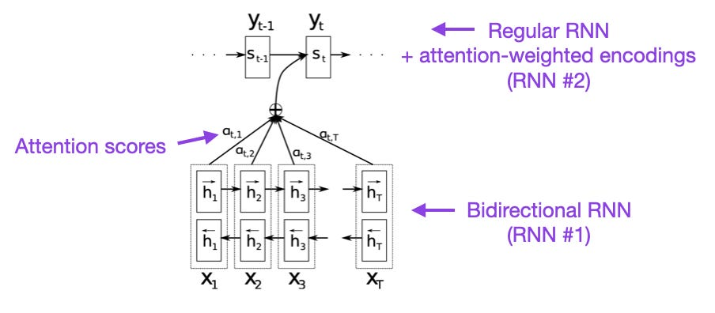

](https://substackcdn.com/image/fetch/$s_!Ss64!,f_auto,q_auto:good,fl_progressive:steep/https%3A%2F%2Fsubstack-post-media.s3.amazonaws.com%2Fpublic%2Fimages%2Ff907c364-b179-4112-a2b9-50c389d0377b_904x396.png)

Source: [https://arxiv.org/abs/1409.0473](https://arxiv.org/abs/1409.0473)

***

**(2)** _**Attention Is All You Need**_ **(2017)** by Vaswani, Shazeer, Parmar, Uszkoreit, Jones, Gomez, Kaiser, and Polosukhin, [https://arxiv.org/abs/1706.03762](https://arxiv.org/abs/1706.03762)

The paper above introduces the original transformer architecture consisting of an encoder- and decoder part that will become relevant as separate modules later. Moreover, this paper introduces concepts such as the scaled dot product attention mechanism, multi-head attention blocks, and positional input encoding that remain the foundation of modern transformers.

[

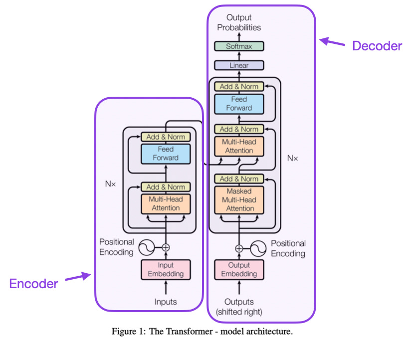

](https://substackcdn.com/image/fetch/$s_!GCTD!,f_auto,q_auto:good,fl_progressive:steep/https%3A%2F%2Fsubstack-post-media.s3.amazonaws.com%2Fpublic%2Fimages%2Fc820b36a-8e07-4eea-8975-d7e391006d52_824x690.png)

Source: [https://arxiv.org/abs/1706.03762](https://arxiv.org/abs/1706.03762)

***

**(3)** _**On Layer Normalization in the Transformer Architecture**_ **(2020)** by Xiong, Yang, He, K Zheng, S Zheng, Xing, Zhang, Lan, Wang, and Liu, [https://arxiv.org/abs/2002.04745](https://arxiv.org/abs/2002.04745)

While the original transformer figure above (from Attention Is All You Need, [https://arxiv.org/abs/1706.03762](https://arxiv.org/abs/1706.03762)) is a helpful summary of the original encoder-decoder architecture, the location of the LayerNorm in this figure remains a hotly debated subject.

For instance, the Attention Is All You Need transformer figure places the layer normalization between the residual blocks, which doesn't match the [official (updated) code implementation](https://github.com/tensorflow/tensor2tensor/commit/f5c9b17e617ea9179b7d84d36b1e8162cb369f25) accompanying the original transformer paper. The variant shown in the Attention Is All You Need figure is known as Post-LN Transformer, and the updated code implementation defaults to the Pre-LN variant.

The _[Layer Normalization in the Transformer Architecture](https://arxiv.org/abs/2002.04745)_ paper suggests that Pre-LN works better, addressing gradient problems, as shown below. Many architectures adopted this in practice, but it can result in representation collapse.

So, while there's still an ongoing discussion regarding using Post-LN or Pre-LN, there's also a new paper that proposes taking advantage of both worlds: _ResiDual: Transformer with Dual Residual Connections_ ([https://arxiv.org/abs/2304.14802](https://arxiv.org/abs/2304.14802)); whether it will turn out useful in practice remains to be seen.

[

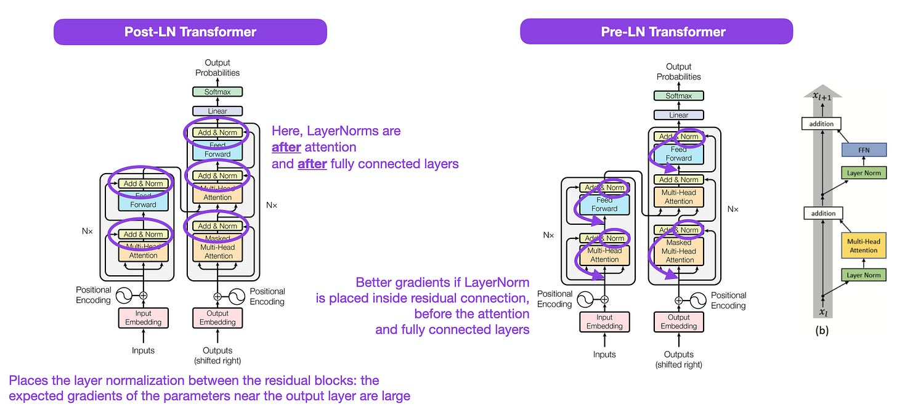

](https://substackcdn.com/image/fetch/$s_!JOyz!,f_auto,q_auto:good,fl_progressive:steep/https%3A%2F%2Fsubstack-post-media.s3.amazonaws.com%2Fpublic%2Fimages%2F5a0a1e39-de22-4a95-8a42-b4040cf33b54_2040x956.png)

Sources: [https://arxiv.org/abs/1706.03762](https://arxiv.org/abs/1706.03762) (left and center) and [https://arxiv.org/abs/2002.04745](https://arxiv.org/abs/2002.04745) (right)

***

**(4)** _**Learning to Control Fast-Weight Memories: An Alternative to Dynamic Recurrent Neural Networks**_ **(1991)** by Schmidhuber, [https://www.semanticscholar.org/paper/Learning-to-Control-Fast-Weight-Memories%3A-An-to-Schmidhuber/bc22e87a26d020215afe91c751e5bdaddd8e4922](https://www.semanticscholar.org/paper/Learning-to-Control-Fast-Weight-Memories%3A-An-to-Schmidhuber/bc22e87a26d020215afe91c751e5bdaddd8e4922)

This paper is recommended for those interested in historical tidbits and early approaches fundamentally similar to modern transformers.

For instance, in 1991, which is about two-and-a-half decades before the original transformer paper above ("Attention Is All You Need"), Juergen Schmidhuber proposed an alternative to recurrent neural networks called _Fast Weight Programmers_ (FWP). The FWP approach involves a feedforward neural network that slowly learns by gradient descent to program the changes of the fast weights of another neural network.

The analogy to modern transformers is explained [in this blog post](https://people.idsia.ch//~juergen/fast-weight-programmer-1991-transformer.html#sec2) as follows:

> _In today's Transformer terminology, FROM and TO are called key and value, respectively. The INPUT to which the fast net is applied is called the query. Essentially, the query is processed by the fast weight matrix, which is a sum of outer products of keys and values (ignoring normalizations and projections). Since all operations of both networks are differentiable, we obtain end-to-end differentiable active control of fast weight changes through additive outer products or second order tensor products.\[FWP0-3a\] Hence the slow net can learn by gradient descent to rapidly modify the fast net during sequence processing. This is mathematically equivalent (apart from normalization) to what was later called Transformers with linearized self-attention (or linear Transformers)._

As mentioned in the blog post excerpt above, this approach is now called "linear Transformers" or "Transformers with linearized self-attention" via the more recent papers [Transformers are RNNs: Fast Autoregressive Transformers with Linear Attention](https://arxiv.org/abs/2006.16236) and [Rethinking Attention with Performers](https://arxiv.org/abs/2009.14794) that appeared on arXiv in 2020.

In 2021, the [Linear Transformers Are Secretly Fast Weight Programmers](https://arxiv.org/abs/2102.11174) paper then explicitly showed the equivalence between linearized self-attention and the fast weight programmers from the 1990s.

[

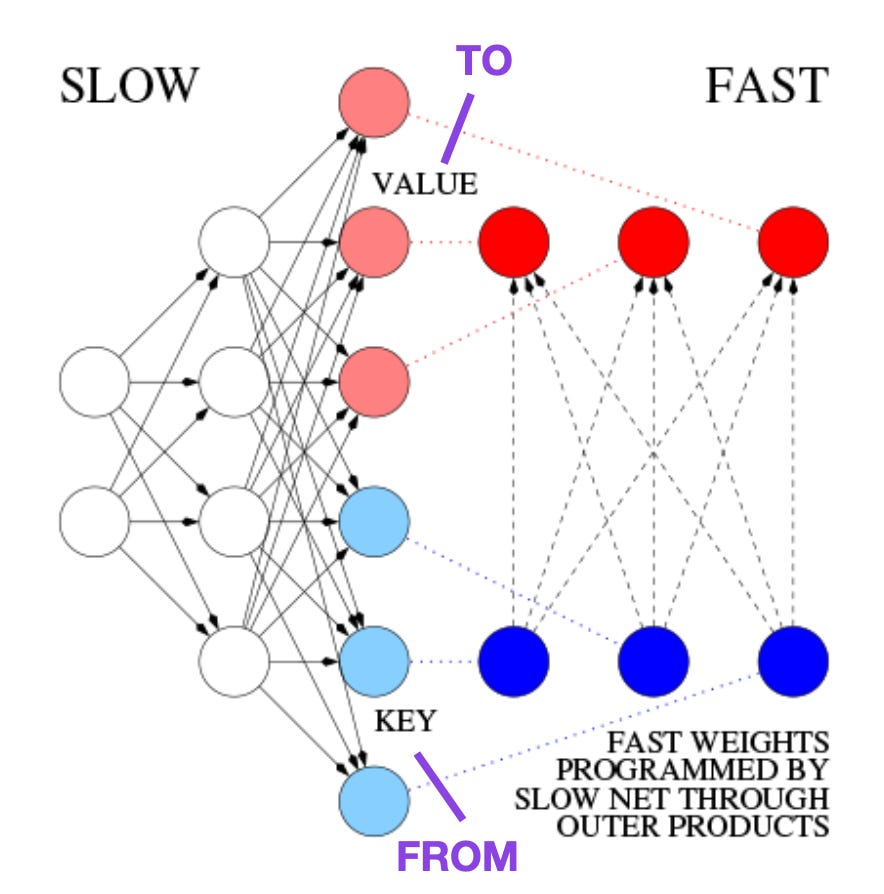

](https://substackcdn.com/image/fetch/$s_!xKpc!,f_auto,q_auto:good,fl_progressive:steep/https%3A%2F%2Fsubstack-post-media.s3.amazonaws.com%2Fpublic%2Fimages%2F2217256f-c000-49bf-878e-7a3e062c7fb8_884x894.png)

Source: Annotated figure based on [https://people.idsia.ch//~juergen/fast-weight-programmer-1991-transformer.html#sec2](https://people.idsia.ch//~juergen/fast-weight-programmer-1991-transformer.html#sec2)

***

**(5)** _**Universal Language Model Fine-tuning for Text Classification**_ **(2018)** by Howard and Ruder, [https://arxiv.org/abs/1801.06146](https://arxiv.org/abs/1801.06146)

This is another paper that's very interesting from a historical perspective. While it was written one year after the original _Attention Is All You Need_ transformer was released, it doesn't involve transformers but instead focuses on recurrent neural networks. However, it's still noteworthy since it effectively proposed pretraining language models and transfer learning for downstream tasks.

While transfer learning was already established in computer vision, it wasn't yet prevalent in natural language processing (NLP). ULMFit was among the first papers to demonstrate that pretraining a language model and finetuning it on a specific task could yield state-of-the-art results in many NLP tasks.

The three-stage process for finetuning the language models suggested by ULMFit was as follows:

*   Train a language model on a large corpus of text.
    
*   Finetune this pretrained language model on task-specific data, allowing it to adapt to the specific style and vocabulary of the text.
    
*   Finetune a classifier on the task-specific data with gradual unfreezing of layers to avoid catastrophic forgetting.
    

This recipe -- training a language model on a large corpus and then finetuning it on a downstream task -- is the central approach used in transformer-based models and foundation models like BERT, GPT-2/3/4, RoBERTa, and others.

However, the gradual unfreezing, a key part of ULMFiT, is usually not routinely done in practice when working with transformer architectures, where all layers are typically finetuned at once.

[

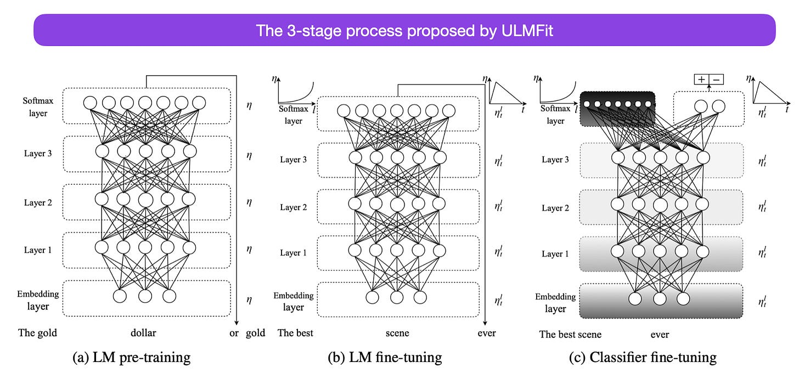

](https://substackcdn.com/image/fetch/$s_!G1sW!,f_auto,q_auto:good,fl_progressive:steep/https%3A%2F%2Fsubstack-post-media.s3.amazonaws.com%2Fpublic%2Fimages%2Fb2d217b3-4596-42bb-a070-c7c1ae9b90cb_1762x850.png)

Source: [https://arxiv.org/abs/1801.06146](https://arxiv.org/abs/1801.06146)

***

**(6)** _**BERT: Pre-training of Deep Bidirectional Transformers for Language Understanding**_ **(2018)** by Devlin, Chang, Lee, and Toutanova, [https://arxiv.org/abs/1810.04805](https://arxiv.org/abs/1810.04805)

Following the original transformer architecture, large language model research started to bifurcate in two directions: encoder-style transformers for predictive modeling tasks such as text classification and decoder-style transformers for generative modeling tasks such as translation, summarization, and other forms of text creation.

The BERT paper above introduces the original concept of masked-language modeling, and next-sentence prediction. It still is the most influential encoder-style architecture. If you are interested in this research branch, I recommend following up with [RoBERTa](https://arxiv.org/abs/1907.11692), which simplified the pretraining objectives by removing the next-sentence prediction tasks.

[

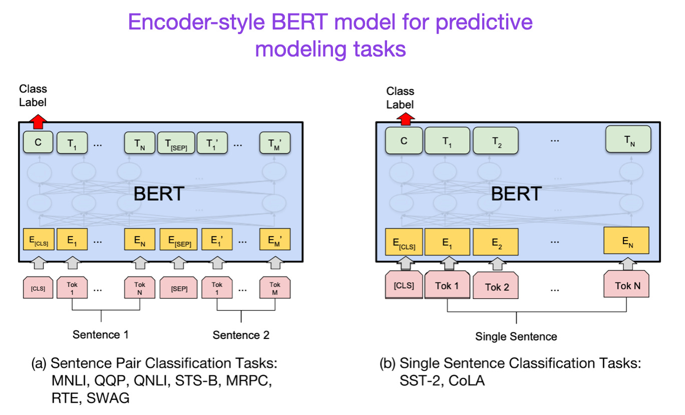

](https://substackcdn.com/image/fetch/$s_!f1ZR!,f_auto,q_auto:good,fl_progressive:steep/https%3A%2F%2Fsubstack-post-media.s3.amazonaws.com%2Fpublic%2Fimages%2F89243595-9867-4420-b753-802ca1226518_1368x830.png)

Source: [https://arxiv.org/abs/1810.04805](https://arxiv.org/abs/1810.04805)

***

**(7)** _**Improving Language Understanding by Generative Pre-Training**_ **(2018) by Radford and Narasimhan**, [https://www.semanticscholar.org/paper/Improving-Language-Understanding-by-Generative-Radford-Narasimhan/cd18800a0fe0b668a1cc19f2ec95b5003d0a5035](https://www.semanticscholar.org/paper/Improving-Language-Understanding-by-Generative-Radford-Narasimhan/cd18800a0fe0b668a1cc19f2ec95b5003d0a5035)

The original GPT paper introduced the popular decoder-style architecture and pretraining via next-word prediction. Where BERT can be considered a bidirectional transformer due to its masked language model pretraining objective, GPT is a unidirectional, autoregressive model. While GPT embeddings can also be used for classification, the GPT approach is at the core of today’s most influential LLMs, such as chatGPT.

If you are interested in this research branch, I recommend following up with the [GPT-2](https://www.semanticscholar.org/paper/Language-Models-are-Unsupervised-Multitask-Learners-Radford-Wu/9405cc0d6169988371b2755e573cc28650d14dfe) and [GPT-3](https://arxiv.org/abs/2005.14165)papers. These two papers illustrate that LLMs are capable of zero- and few-shot learning and highlight the emergent abilities of LLMs. GPT-3 is also still a popular baseline and base model for training current-generation LLMs such as ChatGPT – we will cover the InstructGPT approach that lead to ChatGPT later as a separate entry.

[

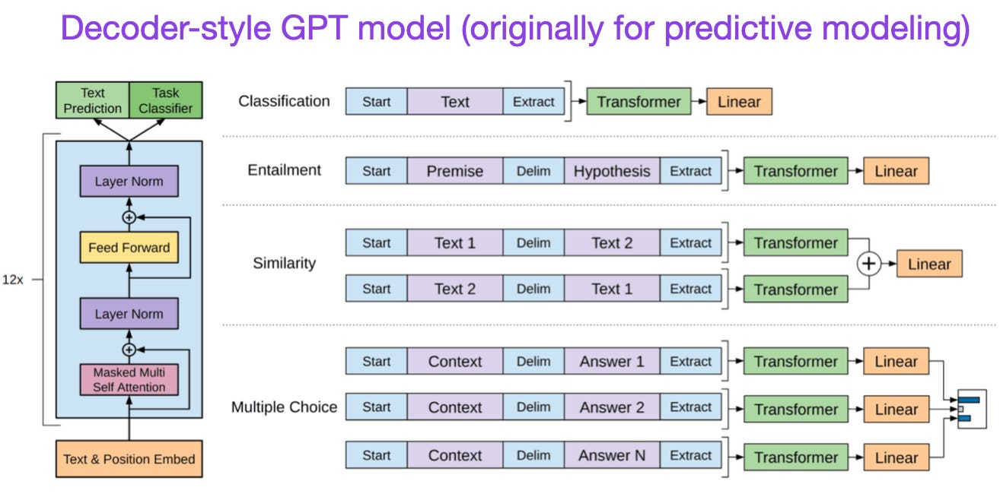

](https://substackcdn.com/image/fetch/$s_!--fa!,f_auto,q_auto:good,fl_progressive:steep/https%3A%2F%2Fsubstack-post-media.s3.amazonaws.com%2Fpublic%2Fimages%2F573a9c49-2ff3-4a14-98b6-6b8a44333601_1314x658.png)

Source: [https://www.semanticscholar.org/paper/Improving-Language-Understanding-by-Generative-Radford-Narasimhan/cd18800a0fe0b668a1cc19f2ec95b5003d0a5035](https://www.semanticscholar.org/paper/Improving-Language-Understanding-by-Generative-Radford-Narasimhan/cd18800a0fe0b668a1cc19f2ec95b5003d0a5035)

***

**(8)** _**BART: Denoising Sequence-to-Sequence Pre-training for Natural Language Generation, Translation, and Comprehension**_ **(2019)** by Lewis, Liu, Goyal, Ghazvininejad, Mohamed, Levy, Stoyanov, and Zettlemoyer, [https://arxiv.org/abs/1910.13461](https://arxiv.org/abs/1910.13461).

As mentioned earlier, BERT-type encoder-style LLMs are usually preferred for predictive modeling tasks, whereas GPT-type decoder-style LLMs are better at generating texts. To get the best of both worlds, the BART paper above combines both the encoder and decoder parts (not unlike the original transformer – the second paper in this list).

[

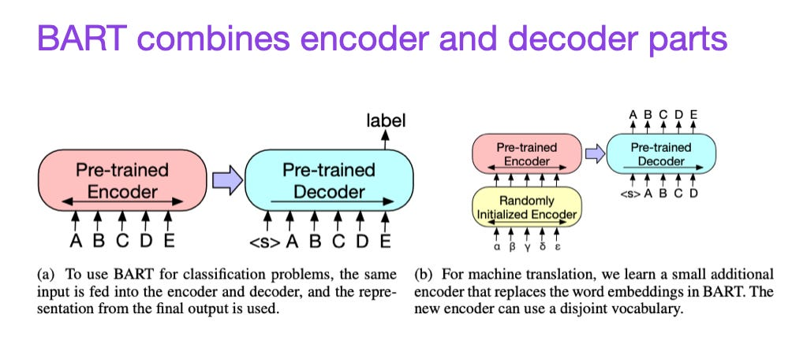

](https://substackcdn.com/image/fetch/$s_!cnoO!,f_auto,q_auto:good,fl_progressive:steep/https%3A%2F%2Fsubstack-post-media.s3.amazonaws.com%2Fpublic%2Fimages%2F7797ec59-f683-4f30-8281-ed0503076b6b_1004x432.png)

Source: [https://arxiv.org/abs/1910.13461](https://arxiv.org/abs/1910.13461)

***

**(9)** _**Harnessing the Power of LLMs in Practice: A Survey on ChatGPT and Beyond**_ **(2023)** by Yang, Jin, Tang, Han, Feng, Jiang, Yin, and Hu, [https://arxiv.org/abs/2304.13712](https://arxiv.org/abs/2304.13712)

This is not a research paper but probably the best general architecture survey to date illustrating how the different architectures evolved. However, next to discussing BERT-style masked language models (encoders) and GPT-style autoregressive language models (decoders), it also provides useful discussions and guidance regarding pretraining and finetuning data.

[

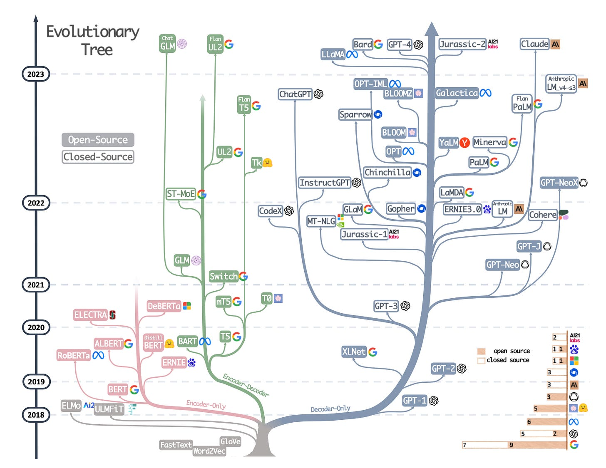

](https://substackcdn.com/image/fetch/$s_!w0MI!,f_auto,q_auto:good,fl_progressive:steep/https%3A%2F%2Fsubstack-post-media.s3.amazonaws.com%2Fpublic%2Fimages%2Fb1f675dc-d643-405d-8111-eab067b7012f_1538x1188.png)

The evolutionary tree of modern LLMs via [https://arxiv.org/abs/2304.13712](https://arxiv.org/abs/2304.13712).

Scaling Laws and Improving Efficiency

---------------------------------------

If you want to learn more about the various techniques to improve the efficiency of transformers, I recommend the [2020](https://arxiv.org/abs/2009.06732) _[Efficient Transformers: A Survey](https://arxiv.org/abs/2009.06732)_ paper followed by the [2023](https://arxiv.org/abs/2302.01107) _[A Survey on Efficient Training of Transformers](https://arxiv.org/abs/2302.01107)_ paper.

In addition, below are papers that I found particularly interesting and worth reading.

**(10)** _**FlashAttention: Fast and Memory-Efficient Exact Attention with IO-Awareness**_ (2022), by Dao, Fu, Ermon, Rudra, and Ré, [https://arxiv.org/abs/2205.14135](https://arxiv.org/abs/2205.14135).

While most transformer papers don’t bother about replacing the original scaled dot product mechanism for implementing self-attention, FlashAttention is one mechanism I have seen most often referenced lately.

[

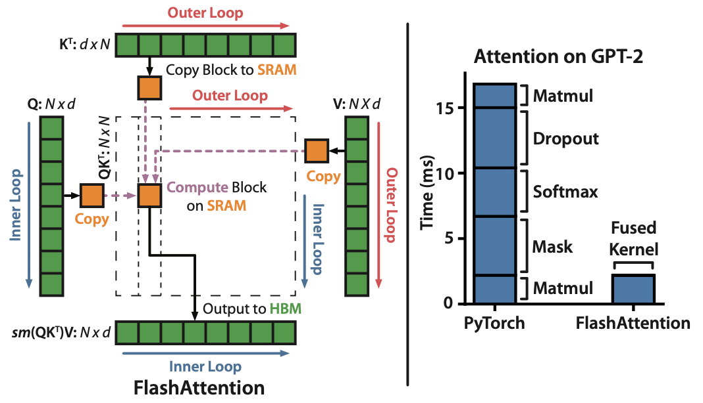

](https://substackcdn.com/image/fetch/$s_!92eZ!,f_auto,q_auto:good,fl_progressive:steep/https%3A%2F%2Fsubstack-post-media.s3.amazonaws.com%2Fpublic%2Fimages%2F659f5e23-5641-406f-9a08-a2461ffff345_1068x614.png)

Source: [https://arxiv.org/abs/2205.14135](https://arxiv.org/abs/2205.14135)

***

**(11)** _**Cramming: Training a Language Model on a Single GPU in One Day (2022)**_ by Geiping and Goldstein, [https://arxiv.org/abs/2212.14034](https://arxiv.org/abs/2212.14034).

In this paper, the researchers trained a masked language model / encoder-style LLM (here: BERT) for 24h on a single GPU. For comparison, the original 2018 BERT paper trained it on 16 TPUs for four days. An interesting insight is that while smaller models have higher throughput, smaller models also learn less efficiently. Thus, larger models do not require more training time to reach a specific predictive performance threshold.

[

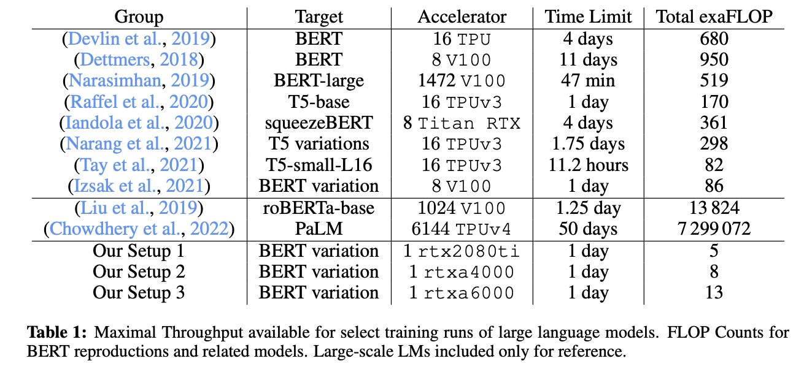

](https://substackcdn.com/image/fetch/$s_!ElDh!,f_auto,q_auto:good,fl_progressive:steep/https%3A%2F%2Fsubstack-post-media.s3.amazonaws.com%2Fpublic%2Fimages%2F8197f14a-dcb6-471e-8958-09032c75e73f_1310x620.png)

Source: [https://arxiv.org/abs/2212.14034](https://arxiv.org/abs/2212.14034)

***

**(12)** _**LoRA: Low-Rank Adaptation of Large Language Models (2021)**_ by Hu, Shen, Wallis, Allen-Zhu, Li, L Wang, S Wang, and Chen, [https://arxiv.org/abs/2106.09685](https://arxiv.org/abs/2106.09685).

Modern large language models that are pretrained on large datasets show emergent abilities and perform well on various tasks, including language translation, summarization, coding, and Q&A. However, if we want to improve the ability of transformers on domain-specific data and specialized tasks, it’s worthwhile to finetune transformers.

Low-rank adaptation (LoRA) is one of the most influential approaches for finetuning large language models in a parameter-efficient manner. While other methods for parameter-efficient finetuning exist (see the survey below), LoRA is particularly worth highlighting as it is both an elegant and very general method that can be applied to other types of models as well.

While the weights of a pretrained model have full rank on the pretrained tasks, the LoRA authors point out that pretrained large language models have a low “intrinsic dimension” when they are adapted to a new task. So, the main idea behind LoRA is to decompose the weight changes, ΔW, into a lower-rank representation, which is more parameter efficient.

[

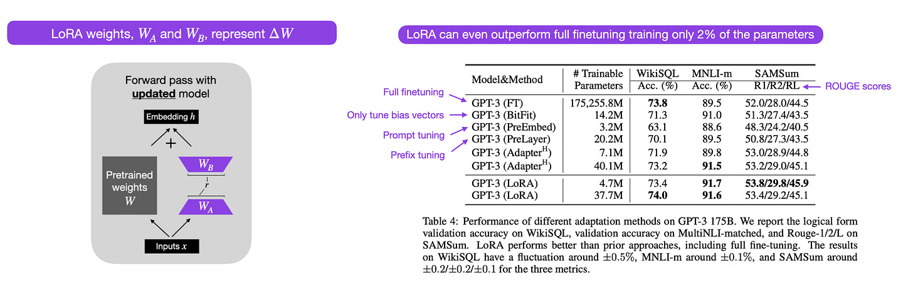

](https://substackcdn.com/image/fetch/$s_!-mrt!,f_auto,q_auto:good,fl_progressive:steep/https%3A%2F%2Fsubstack-post-media.s3.amazonaws.com%2Fpublic%2Fimages%2F542db321-11fe-4641-8f63-2fa7ac7a6536_2302x726.png)

An illustration of LoRA alongside its performance from [https://arxiv.org/abs/2106.09685](https://arxiv.org/abs/2106.09685).

***

**(13)** _**Scaling Down to Scale Up: A Guide to Parameter-Efficient Fine-Tuning (2022)**_ by Lialin, Deshpande, and Rumshisky, [https://arxiv.org/abs/2303.15647](https://arxiv.org/abs/2303.15647).

Modern large language models that are pretrained on large datasets show emergent abilities and perform well on various tasks, including language translation, summarization, coding, and Q&A. However, if we want to improve the ability of transformers on domain-specific data and specialized tasks, it’s worthwhile to finetune transformers. This survey reviews more than 40 papers on parameter-efficient finetuning methods (including popular techniques such as prefix tuning, adapters, and low-rank adaptation) to make finetuning (very) computationally efficient.

[

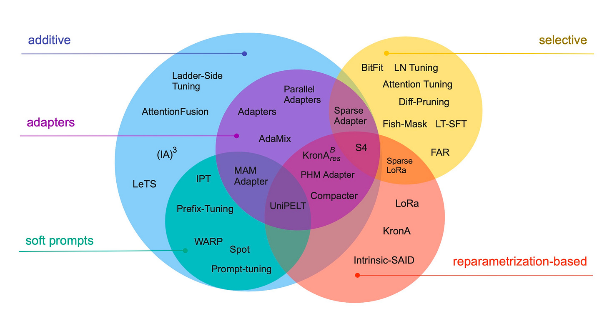

](https://substackcdn.com/image/fetch/$s_!O4Fa!,f_auto,q_auto:good,fl_progressive:steep/https%3A%2F%2Fsubstack-post-media.s3.amazonaws.com%2Fpublic%2Fimages%2F47c015d7-1345-48b4-8170-fd9bb636b92f_2102x1078.png)

Source: [https://arxiv.org/abs/2303.15647](https://arxiv.org/abs/2303.15647)

***

**(14)** _**Scaling Language Models: Methods, Analysis & Insights from Training Gopher**_ **(2022)** by Rae and colleagues (78 co-authors!), [https://arxiv.org/abs/2112.11446](https://arxiv.org/abs/2112.11446)

_Gopher_ is a particularly nice paper including tons of analysis to understand LLM training. Here, the researchers trained a 280 billion parameter model with 80 layers on 300 billions tokens. This includes interesting architecture modifications such as using RMSNorm (Root Mean Square Normalization) instead of LayerNorm (Layer Normalization). Both LayerNorm and RMSNorm are preferred over BatchNorm since they don't depend on the batch size and doesn't require synchronization, which is an advantage in distributed settings with smaller batch sizes. However, RMSNorm is generally said to stabilize the training in deeper architectures.

Besides interesting tidbits such the ones above, the main focus of this paper is the analysis of task performance for different scales. The evaluation on 152 diverse tasks reveal that increasing model sizes benefits tasks like comprehension, fact-checking, and the identification of toxic language the most. However, tasks related to logical and mathematical reasoning benefit less from architecture scaling.

[

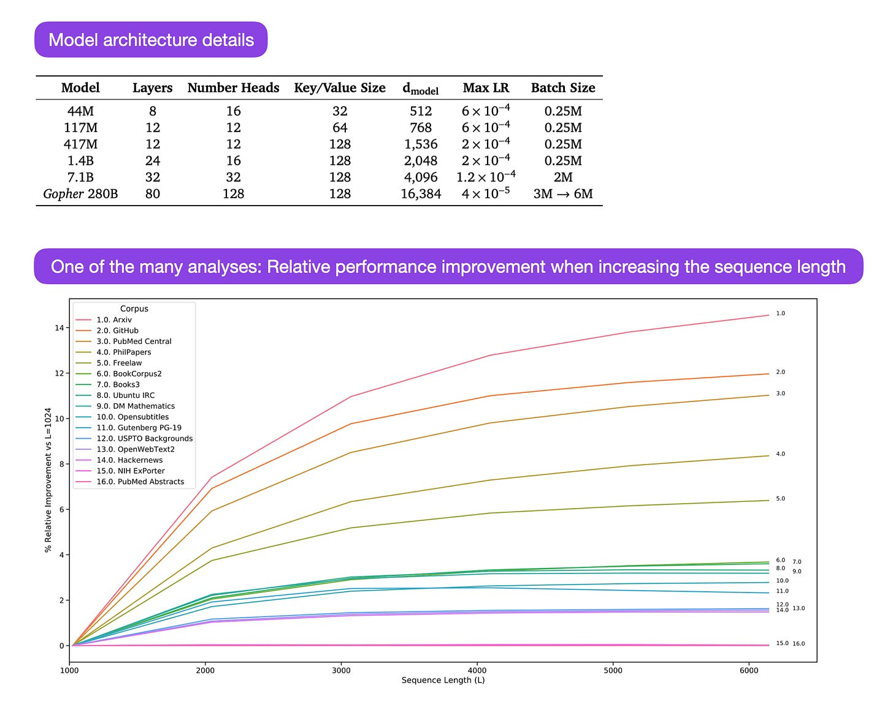

](https://substackcdn.com/image/fetch/$s_!BVt9!,f_auto,q_auto:good,fl_progressive:steep/https%3A%2F%2Fsubstack-post-media.s3.amazonaws.com%2Fpublic%2Fimages%2F86050fd8-33e1-483e-bdb8-daa1873fd018_1788x1408.png)

Source: Figure from [https://arxiv.org/abs/2112.11446](https://arxiv.org/abs/2112.11446)

***

**(15)** _**Training Compute-Optimal Large Language Models**_ **(2022)** by Hoffmann, Borgeaud, Mensch, Buchatskaya, Cai, Rutherford, de Las Casas, Hendricks, Welbl, Clark, Hennigan, Noland, Millican, van den Driessche, Damoc, Guy, Osindero, Simonyan, Elsen, Rae, Vinyals, and Sifre, [https://arxiv.org/abs/2203.15556](https://arxiv.org/abs/2203.15556).

This paper introduces the 70-billion parameter Chinchilla model that outperforms the popular 175-billion parameter GPT-3 model on generative modeling tasks. However, its main punchline is that contemporary large language models are “significantly undertrained.”

The paper defines the linear scaling law for large language model training. For example, while Chinchilla is only half the size of GPT-3, it outperformed GPT-3 because it was trained on 1.4 trillion (instead of just 300 billion) tokens. In other words, the number of training tokens is as vital as the model size.

[

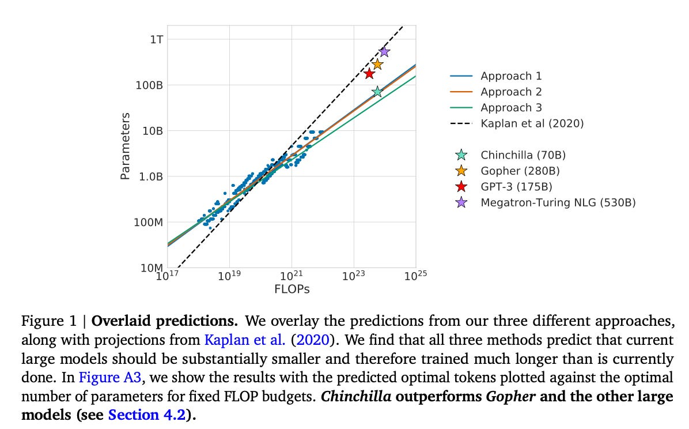

](https://substackcdn.com/image/fetch/$s_!biVl!,f_auto,q_auto:good,fl_progressive:steep/https%3A%2F%2Fsubstack-post-media.s3.amazonaws.com%2Fpublic%2Fimages%2F760d60f7-c4e6-4a8b-a540-09c8d1ffef36_1196x744.png)

Source: [https://arxiv.org/abs/2203.15556](https://arxiv.org/abs/2203.15556)

***

**(16)** _**Pythia**_**:** _**A Suite for Analyzing Large Language Models Across Training and Scaling**_ **(2023)** by Biderman, Schoelkopf, Anthony, Bradley, O'Brien, Hallahan, Khan, Purohit, Prashanth, Raff, Skowron, Sutawika, and van der Wal, [https://arxiv.org/abs/2304.01373](https://arxiv.org/abs/2304.01373)

Pythia is a suite of open-source LLMs (70M to 12B parameters) to study how LLMs evolve over the course of training.

The architecture is similar to GPT-3 but includes some improvements, for example, Flash Attention (like [LLaMA](https://arxiv.org/abs/2302.13971)) and Rotary Positional Embeddings (like [PaLM](https://arxiv.org/abs/2204.02311)). Pythia was trained on [The Pile dataset](https://arxiv.org/abs/2101.00027) (825 Gb) for 300 B tokens (~1 epoch on regular PILE, ~1.5 epochs on deduplicated PILE.

[

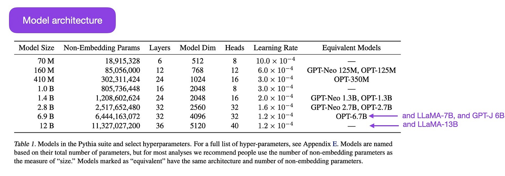

](https://substackcdn.com/image/fetch/$s_!L-Fu!,f_auto,q_auto:good,fl_progressive:steep/https%3A%2F%2Fsubstack-post-media.s3.amazonaws.com%2Fpublic%2Fimages%2Fcf0be27f-4d1b-4761-9019-b04735c3bd25_1854x648.jpeg)

The Pythia model suite via [https://arxiv.org/abs/2304.01373](https://arxiv.org/abs/2304.01373).

The main insights of the Pythia study are as follows:

1.  Training on duplicated data (due to how LLMs are trained, this means training for more than one epoch) does not benefit or hurt performance.
    
2.  Training order does not influence memorization. This is unfortunate because if the opposite were true, we could mitigate undesirable verbatim memorization issues by reordering the training data.
    
3.  Pretrained term frequency influences task performance. For instance, few-shot accuracy tends to be higher for more frequent terms.
    
4.  Doubling the batch size halves the training time but doesn't hurt convergence.
    

Alignment – Steering Large Language Models to Intended Goals and Interests

----------------------------------------------------------------------------

In recent years, we have seen many relatively capable large language models that can generate realistic texts (for example, GPT-3 and Chinchilla, among others). It seems that we have reached a ceiling in terms of what we can achieve with the commonly used pretraining paradigms.

To make language models more helpful and reduce misinformation and harmful language, researchers designed additional training paradigms to fine-tune the pretrained base models.

**(17)** _**Training Language Models to Follow Instructions with Human Feedback**_ **(2022)** by Ouyang, Wu, Jiang, Almeida, Wainwright, Mishkin, Zhang, Agarwal, Slama, Ray, Schulman, Hilton, Kelton, Miller, Simens, Askell, Welinder, Christiano, Leike, and Lowe, [https://arxiv.org/abs/2203.02155](https://arxiv.org/abs/2203.02155).

In this so-called InstructGPT paper, the researchers use a reinforcement learning mechanism with humans in the loop (RLHF). They start with a pretrained GPT-3 base model and fine-tune it further using supervised learning on prompt-response pairs generated by humans (Step 1). Next, they ask humans to rank model outputs to train a reward model (step 2). Finally, they use the reward model to update the pretrained and fine-tuned GPT-3 model using reinforcement learning via proximal policy optimization (step 3).

As a sidenote, this paper is also known as the paper describing the idea behind ChatGPT – according to the recent rumors, ChatGPT is a scaled-up version of InstructGPT that has been fine-tuned on a larger dataset.

[

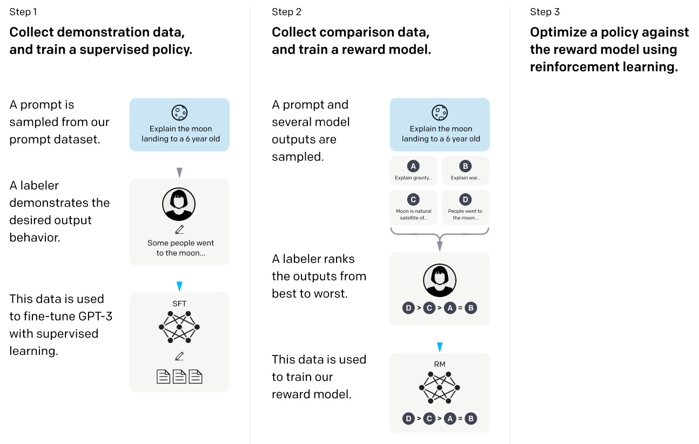

](https://substackcdn.com/image/fetch/$s_!bc_C!,f_auto,q_auto:good,fl_progressive:steep/https%3A%2F%2Fsubstack-post-media.s3.amazonaws.com%2Fpublic%2Fimages%2F79d09d26-5644-4830-a1de-a94c7149d50c_1294x822.png)

Source: [https://arxiv.org/abs/2203.02155](https://arxiv.org/abs/2203.02155)

***

**(18)** _**Constitutional AI: Harmlessness from AI Feedback**_ **(2022**) by Yuntao, Saurav, Sandipan, Amanda, Jackson, Jones, Chen, Anna, Mirhoseini, McKinnon, Chen, Olsson, Olah, Hernandez, Drain, Ganguli, Li, Tran-Johnson, Perez, Kerr, Mueller, Ladish, Landau, Ndousse, Lukosuite, Lovitt, Sellitto, Elhage, Schiefer, Mercado, DasSarma, Lasenby, Larson, Ringer, Johnston, Kravec, El Showk, Fort, Lanham, Telleen-Lawton, Conerly, Henighan, Hume, Bowman, Hatfield-Dodds, Mann, Amodei, Joseph, McCandlish, Brown, Kaplan, [https://arxiv.org/abs/2212.08073](https://arxiv.org/abs/2212.08073).

In this paper, the researchers are taking the alignment idea one step further, proposing a training mechanism for creating a “harmless” AI system. Instead of direct human supervision, the researchers propose a self-training mechanism that is based on a list of rules (which are provided by a human). Similar to the InstructGPT paper mentioned above, the proposed method uses a reinforcement learning approach.

[

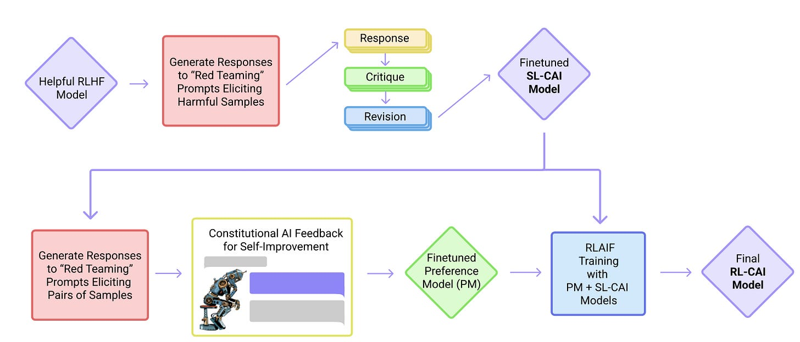

](https://substackcdn.com/image/fetch/$s_!h1rb!,f_auto,q_auto:good,fl_progressive:steep/https%3A%2F%2Fsubstack-post-media.s3.amazonaws.com%2Fpublic%2Fimages%2Fdebca6d8-b504-4645-ac80-8d9aaabccd3b_1466x628.png)

Source: [https://arxiv.org/abs/2212.08073](https://arxiv.org/abs/2212.08073)

***

**(19)** _**Self-Instruct: Aligning Language Model with Self Generated Instruction**_ **(2022)** by Wang, Kordi, Mishra, Liu, Smith, Khashabi, and Hajishirzi, [https://arxiv.org/abs/2212.10560](https://arxiv.org/abs/2212.10560)

Instruction finetuning is how we get from GPT-3-like pretrained base models to more capable LLMs like ChatGPT. And open-source human-generated instruction datasets like [databricks-dolly-15k](https://github.com/databrickslabs/dolly/tree/master/data) can help make this possible. But how do we scale this? One way is bootstrapping an LLM off its own generations.

Self-Instruct is one (almost annotation-free) way to align pretrained LLMs with instructions.

How does this work? In a nutshell, it's a 4-step process:

1.  Seed task pool with a set of human-written instructions (175 in this case) and sample instructions.
    
2.  Use a pretrained LLM (like GPT-3) to determine the task category.
    
3.  Given the new instruction, let a pretrained LLM generate the response.
    
4.  Collect, prune, and filter the responses before adding them to the task pool.
    

[

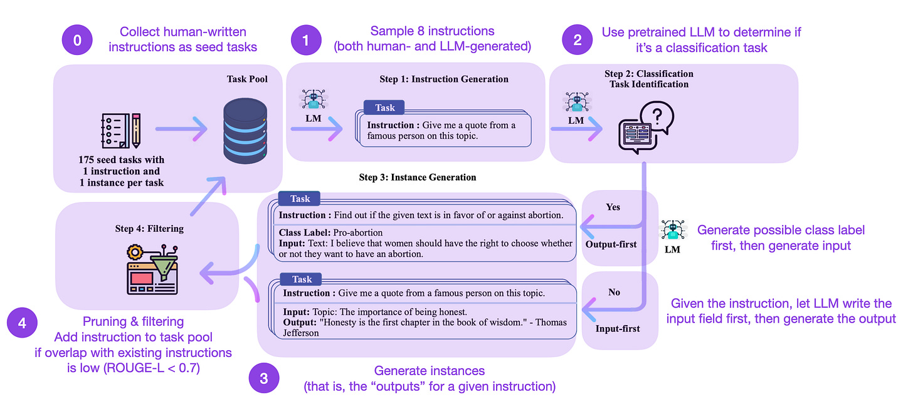

](https://substackcdn.com/image/fetch/$s_!t9yF!,f_auto,q_auto:good,fl_progressive:steep/https%3A%2F%2Fsubstack-post-media.s3.amazonaws.com%2Fpublic%2Fimages%2F88f7c2ca-5592-423d-b551-9794e325bafc_2218x1004.png)

Annotated version of the self-instruct method from [https://arxiv.org/abs/2212.10560](https://arxiv.org/abs/2212.10560).

In practice, this works relatively well based on the ROUGE scores.

For example, a Self-Instruct-finetuned LLM outperforms the GPT-3 base LLM (1) and can compete with an LLM pretrained on a large human-written instruction set (2). And self-instruct can also benefit LLMs that were already finetuned on human instructions (3).

But of course, the gold standard for evaluating LLMs is to ask human raters. Based on human evaluation, Self-Instruct outperforms base LLM, and LLMs trained on human instruction datasets in supervised fashion (SuperNI, T0 Trainer). But interestingly, Self-Instruct does not outperform methods trained via reinforcement learning with human feedback (RLHF)

Which is more promising, human-generated instruction datasets or self-instruct-datasets? I vote for both. Why not start with a human-generated instruction dataset like the 15k instructions from [databricks-dolly-15k](https://github.com/databrickslabs/dolly/tree/master/data) and then scale this with self-instruct?

Reinforcement Learning with Human Feedback (RLHF)

---------------------------------------------------

For additional explanations of Reinforcement Learning with Human Feedback (RLHF), plus papers on proximal policy optimization for implementing RLHF, please see my more detailed article below:

[

LLM Training: RLHF and Its Alternatives
---------------------------------------

](https://magazine.sebastianraschka.com/p/llm-training-rlhf-and-its-alternatives)

[Sebastian Raschka, PhD](https://substack.com/profile/27393275-sebastian-raschka-phd)

·

September 10, 2023

[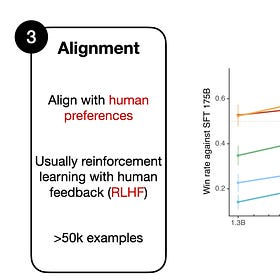](https://magazine.sebastianraschka.com/p/llm-training-rlhf-and-its-alternatives)

I frequently reference a process called Reinforcement Learning with Human Feedback (RLHF) when discussing LLMs, whether in the research news or tutorials. RLHF is an integral part of the modern LLM training pipeline due to its ability to incorporate human preferences into the optimization landscape, which can improve the model's helpfulness and safety.

[

Read full story

](https://magazine.sebastianraschka.com/p/llm-training-rlhf-and-its-alternatives)

Conclusion and Further Reading

--------------------------------

I tried to keep the list above nice and concise, focusing on the top-10 papers (plus 3 bonus papers on RLHF) to understand the design, constraints, and evolution behind contemporary large language models.

For further reading, I suggest following the references in the papers mentioned above. Or, to give you some additional pointers, here are some additional resources (these lists are not comprehensive):

**Open-source alternatives to GPT**

*   _BLOOM: A 176B-Parameter Open-Access Multilingual Language Model_ (2022), [https://arxiv.org/abs/2211.05100](https://arxiv.org/abs/2211.05100)
    
*   _OPT: Open Pre-trained Transformer Language Models_ (2022), [https://arxiv.org/abs/2205.01068](https://arxiv.org/abs/2205.01068)
    
*   _UL2:_ _Unifying Language Learning Paradigms_ (2022)_, [https://arxiv.org/abs/2205.05131](https://arxiv.org/abs/2205.05131)_
    

**ChatGPT alternatives**

*   _LaMDA: Language Models for Dialog Applications_ (2022), [https://arxiv.org/abs/2201.08239](https://arxiv.org/abs/2201.08239)
    
*   (Bloomz) _Crosslingual Generalization through Multitask Finetuning_ (2022), [https://arxiv.org/abs/2211.01786](https://arxiv.org/abs/2211.01786)
    
*   (Sparrow) _Improving Alignment of Dialogue Agents via Targeted Human Judgements_ (2022), [https://arxiv.org/abs/2209.14375](https://arxiv.org/abs/2209.14375)
    
*   _BlenderBot 3: A Deployed Conversational Agent that Continually Learns to Responsibly Engage_, [https://arxiv.org/abs/2208.03188](https://arxiv.org/abs/2208.03188)
    

**Large language models in computational biology**

*   _ProtTrans: Towards Cracking the Language of Life’s Code Through Self-Supervised Deep Learning and High Performance Computing_ (2021), [https://arxiv.org/abs/2007.06225](https://arxiv.org/abs/2007.06225)
    
*   _Highly Accurate Protein Structure Prediction with AlphaFold_ (2021), [https://www.nature.com/articles/s41586-021-03819-2](https://www.nature.com/articles/s41586-021-03819-2)
    
*   _Large Language Models Generate Functional Protein Sequences Across Diverse Families_ (2023), [https://www.nature.com/articles/s41587-022-01618-2](https://www.nature.com/articles/s41587-022-01618-2)
