Understanding Reasoning LLMs
============================

Methods and Strategies for Building and Refining Reasoning Models
--------------------------------------------------------------------------------------------------------------------------------------------------------------------------------------------------------------

Feb 5, 2025  
by Sebastian Raschka

[RSS](https://sebastianraschka.com/rss_feed.xml)[Subscribe via Email](https://magazine.sebastianraschka.com/subscribe)

In this article, I will describe the four main approaches to building reasoning models, or how we can enhance LLMs with reasoning capabilities. I hope this provides valuable insights and helps you navigate the rapidly evolving literature and hype surrounding this topic.

In 2024, the LLM field saw increasing specialization. Beyond pre-training and fine-tuning, we witnessed the rise of specialized applications, from RAGs to code assistants. I expect this trend to accelerate in 2025, with an even greater emphasis on domain- and application-specific optimizations (i.e., “specializations”).

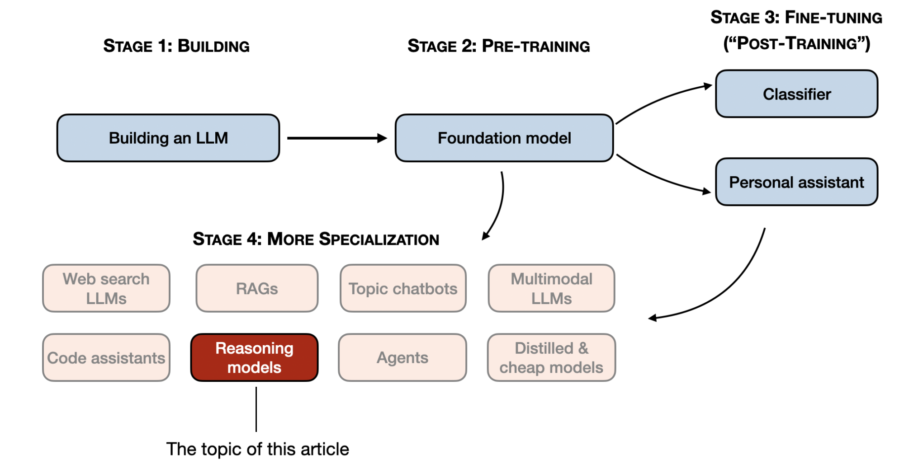

Stages 1-3 are the common steps to developing LLMs. Stage 4 specializes LLMs for specific use cases.

The development of reasoning models is one of these specializations. This means we refine LLMs to excel at complex tasks that are best solved with intermediate steps, such as puzzles, advanced math, and coding challenges. However, this specialization does not replace other LLM applications. Because transforming an LLM into a reasoning model also introduces certain drawbacks, which I will discuss later.

To give you a brief glimpse of what’s covered below, in this article, I will:

*   [How do we define “reasoning model”?](https://sebastianraschka.com/blog/2025/understanding-reasoning-llms.html#how-do-we-define-reasoning-model)
*   [When should we use reasoning models?](https://sebastianraschka.com/blog/2025/understanding-reasoning-llms.html#when-should-we-use-reasoning-models)
*   [A brief look at the DeepSeek training pipeline](https://sebastianraschka.com/blog/2025/understanding-reasoning-llms.html#a-brief-look-at-the-deepseek-training-pipeline)
*   [The 4 main ways to build and improve reasoning models](https://sebastianraschka.com/blog/2025/understanding-reasoning-llms.html#the-4-main-ways-to-build-and-improve-reasoning-models)
    *   [1) Inference-time scaling](https://sebastianraschka.com/blog/2025/understanding-reasoning-llms.html#1-inference-time-scaling)
    *   [2) Pure reinforcement learning (RL)](https://sebastianraschka.com/blog/2025/understanding-reasoning-llms.html#2-pure-reinforcement-learning-rl)
    *   [3) Supervised finetuning and reinforcement learning (SFT + RL)](https://sebastianraschka.com/blog/2025/understanding-reasoning-llms.html#3-supervised-finetuning-and-reinforcement-learning-sft--rl)
    *   [4) Pure supervised finetuning (SFT) and distillation](https://sebastianraschka.com/blog/2025/understanding-reasoning-llms.html#4-pure-supervised-finetuning-sft-and-distillation)
    *   [Conclusion](https://sebastianraschka.com/blog/2025/understanding-reasoning-llms.html#conclusion)
*   [Thoughts about DeepSeek R1](https://sebastianraschka.com/blog/2025/understanding-reasoning-llms.html#thoughts-about-deepseek-r1)
*   [Developing reasoning models on a limited budget](https://sebastianraschka.com/blog/2025/understanding-reasoning-llms.html#developing-reasoning-models-on-a-limited-budget)

I hope you find this article useful as AI continues its rapid development this year!

How do we define “reasoning model”?
================================================================================================================================================

If you work in AI (or machine learning in general), you are probably familiar with vague and hotly debated definitions. The term “reasoning models” is no exception. Eventually, someone will define it formally in a paper, only for it to be redefined in the next, and so on.

In this article, I define “reasoning” as the process of answering questions that require complex, multi-step generation with intermediate steps. For example, factual question-answering like “What is the capital of France?” does not involve reasoning. In contrast, a question like “If a train is moving at 60 mph and travels for 3 hours, how far does it go?” requires some simple reasoning. For instance, it requires recognizing the relationship between distance, speed, and time before arriving at the answer.

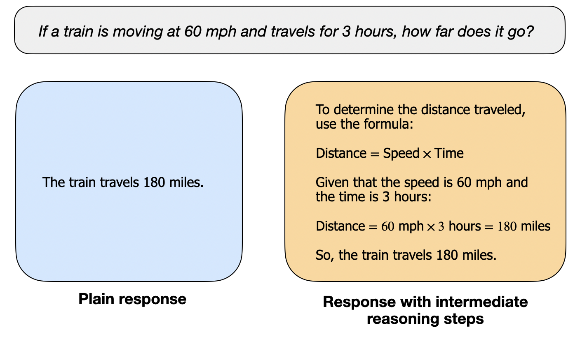

A regular LLM may only provide a short answer (as shown on the left), whereas reasoning models typically include intermediate steps that reveal part of the thought process. (Note that many LLMs who have not been specifically developed for reasoning tasks can also provide intermediate reasoning steps in their answers.)

Most modern LLMs are capable of basic reasoning and can answer questions like, “If a train is moving at 60 mph and travels for 3 hours, how far does it go?” So, today, when we refer to reasoning models, we typically mean LLMs that excel at more complex reasoning tasks, such as solving puzzles, riddles, and mathematical proofs.

Additionally, most LLMs branded as reasoning models today include a “thought” or “thinking” process as part of their response. Whether and how an LLM actually “thinks” is a separate discussion.

Intermediate steps in reasoning models can appear in two ways. First, they may be explicitly included in the response, as shown in the previous figure. Second, some reasoning LLMs, such as OpenAI’s o1, run multiple iterations with intermediate steps that are not shown to the user.

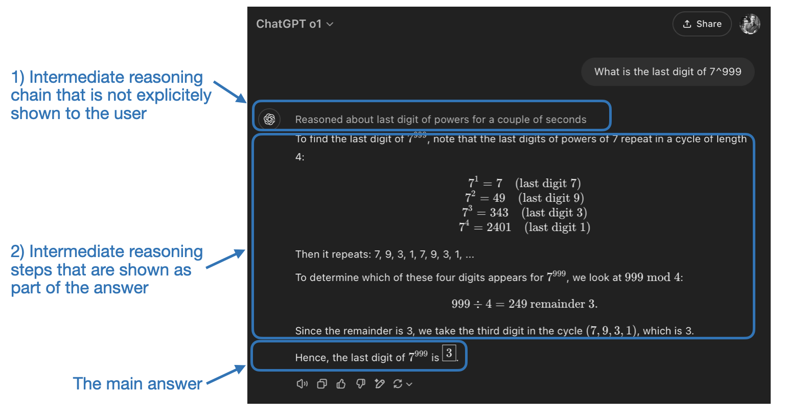

"Reasoning" is used at two different levels: 1) processing the input and generating via multiple intermediate steps and 2) providing some sort of reasoning as part of the response to the user.

When should we use reasoning models?
====================================================================================================================================================

Now that we have defined reasoning models, we can move on to the more interesting part: how to build and improve LLMs for reasoning tasks. However, before diving into the technical details, it is important to consider when reasoning models are actually needed.

When do we need a reasoning model? Reasoning models are designed to be good at complex tasks such as solving puzzles, advanced math problems, and challenging coding tasks. However, they are not necessary for simpler tasks like summarization, translation, or knowledge-based question answering. In fact, using reasoning models for everything can be inefficient and expensive. For instance, reasoning models are typically more expensive to use, more verbose, and sometimes more prone to errors due to “overthinking.” Also here the simple rule applies: Use the right tool (or type of LLM) for the task.

The key strengths and limitations of reasoning models are summarized in the figure below.

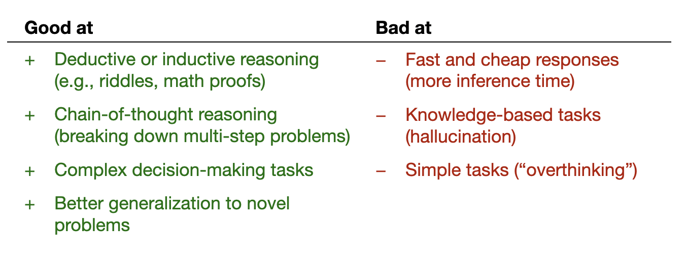

The key strengths and weaknesses of reasoning models.

A brief look at the DeepSeek training pipeline
=========================================================================================================================================================================

Before discussing four main approaches to building and improving reasoning models in the next section, I want to briefly outline the DeepSeek R1 pipeline, as described in the DeepSeek R1 technical report. This report serves as both an interesting case study and a blueprint for developing reasoning LLMs.

Note that DeepSeek did not release a single R1 reasoning model but instead introduced three distinct variants: DeepSeek-R1-Zero, DeepSeek-R1, and DeepSeek-R1-Distill.

Based on the descriptions in the technical report, I have summarized the development process of these models in the diagram below.

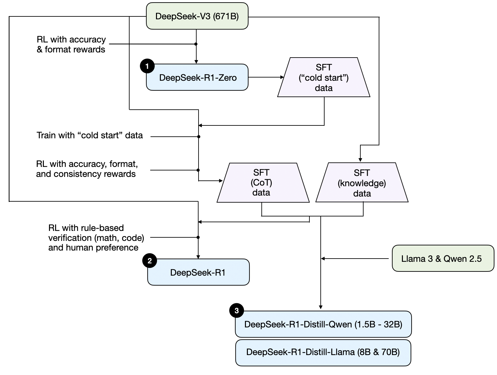

Development process of DeepSeeks three different reasoning models that are discussed in the DeepSeek R1 technical report.

Next, let’s briefly go over the process shown in the diagram above. More details will be covered in the next section, where we discuss the four main approaches to building and improving reasoning models.

(1) DeepSeek-R1-Zero: This model is based on the 671B pre-trained DeepSeek-V3 base model released in December 2024. The research team trained it using reinforcement learning (RL) with two types of rewards. This approach is referred to as “cold start” training because it did not include a supervised fine-tuning (SFT) step, which is typically part of reinforcement learning with human feedback (RLHF).

(2) DeepSeek-R1: This is DeepSeek’s flagship reasoning model, built upon DeepSeek-R1-Zero. The team further refined it with additional SFT stages and further RL training, improving upon the “cold-started” R1-Zero model.

(3) DeepSeek-R1-Distill\*: Using the SFT data generated in the previous steps, the DeepSeek team fine-tuned Qwen and Llama models to enhance their reasoning abilities. While not distillation in the traditional sense, this process involved training smaller models (Llama 8B and 70B, and Qwen 1.5B–30B) on outputs from the larger DeepSeek-R1 671B model.

The 4 main ways to build and improve reasoning models
=======================================================================================================================================================================================

In this section, I will outline the key techniques currently used to enhance the reasoning capabilities of LLMs and to build specialized reasoning models such as DeepSeek-R1, OpenAI’s o1 & o3, and others.

Note: The exact workings of o1 and o3 remain unknown outside of OpenAI. However, they are rumored to leverage a combination of both inference and training techniques.

1) Inference-time scaling 
------------------------------------------------------------------------------------------------------------------------------------------------------------------------------------------------------------------------------------

One way to improve an LLM’s reasoning capabilities (or any capability in general) is inference-time scaling. This term can have multiple meanings, but in this context, it refers to increasing computational resources during inference to improve output quality.

A rough analogy is how humans tend to generate better responses when given more time to think through complex problems. Similarly, we can apply techniques that encourage the LLM to “think” more while generating an answer. (Although, whether LLMs actually “think” is a different discussion.)

One straightforward approach to inference-time scaling is clever prompt engineering. A classic example is chain-of-thought (CoT) prompting, where phrases like “think step by step” are included in the input prompt. This encourages the model to generate intermediate reasoning steps rather than jumping directly to the final answer, which can often (but not always) lead to more accurate results on more complex problems. (Note that it doesn’t make sense to employ this strategy for simpler knowledge-based questions, like “What is the capital of France”, which is again a good rule of thumb to find out whether a reasoning model makes sense on your given input query.)

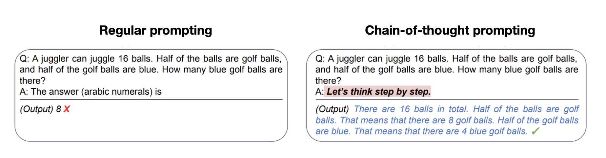

An example of classic CoT prompting from the 2022 Large Language Models are Zero-Shot Reasoners paper (https://arxiv.org/abs/2205.11916).

The aforementioned CoT approach can be seen as inference-time scaling because it makes inference more expensive through generating more output tokens.

Another approach to inference-time scaling is the use of voting and search strategies. One simple example is majority voting where we have the LLM generate multiple answers, and we select the correct answer by majority vote. Similarly, we can use beam search and other search algorithms to generate better responses.

I highly recommend the Scaling LLM Test-Time Compute Optimally can be More Effective than Scaling Model Parameters paper that I described in my previous Noteworthy AI Research Papers of 2024 (Part Two) article (https://magazine.sebastianraschka.com/p/ai-research-papers-2024-part-2) for more details on these different strategies.

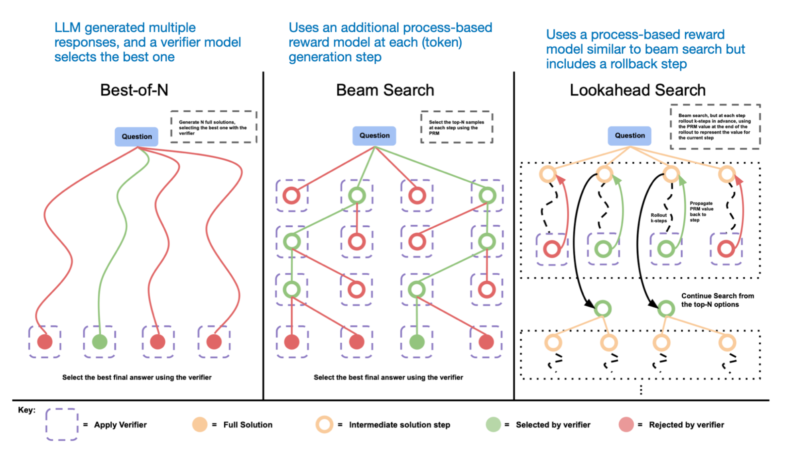

Different search-based methods rely on a process-reward-based model to select the best answer. Annotated figure from the LLM Test-Time Compute paper, https://arxiv.org/abs/2408.03314

The DeepSeek R1 technical report categorizes common inference-time scaling methods (such as Process Reward Model-based and Monte Carlo Tree Search-based approaches) under “unsuccessful attempts.” This suggests that DeepSeek did not explicitly use these techniques beyond the R1 model’s natural tendency to generate longer responses, which serves as an implicit form of inference-time scaling compared to the V3 base model.

However, explicit inference-time scaling is often implemented at the application layer rather than within the LLM itself, so DeepSeek may still apply such techniques within their app.

I suspect that OpenAI’s o1 and o3 models use inference-time scaling, which would explain why they are relatively expensive compared to models like GPT-4o. In addition to inference-time scaling, o1 and o3 were likely trained using RL pipelines similar to those used for DeepSeek R1. More on reinforcement learning in the next two sections below.

2) Pure reinforcement learning (RL) 
--------------------------------------------------------------------------------------------------------------------------------------------------------------------------------------------------------------------------------------------------------------

One of my personal highlights from the DeepSeek R1 paper is their discovery that reasoning emerges as a behavior from pure reinforcement learning (RL). Let’s explore what this means in more detail.

As outlined earlier, DeepSeek developed three types of R1 models. The first, DeepSeek-R1-Zero, was built on top of the DeepSeek-V3 base model, a standard pre-trained LLM they released in December 2024. Unlike typical RL pipelines, where supervised fine-tuning (SFT) is applied before RL, DeepSeek-R1-Zero was trained exclusively with reinforcement learning without an initial SFT stage as highlighted in the diagram below.

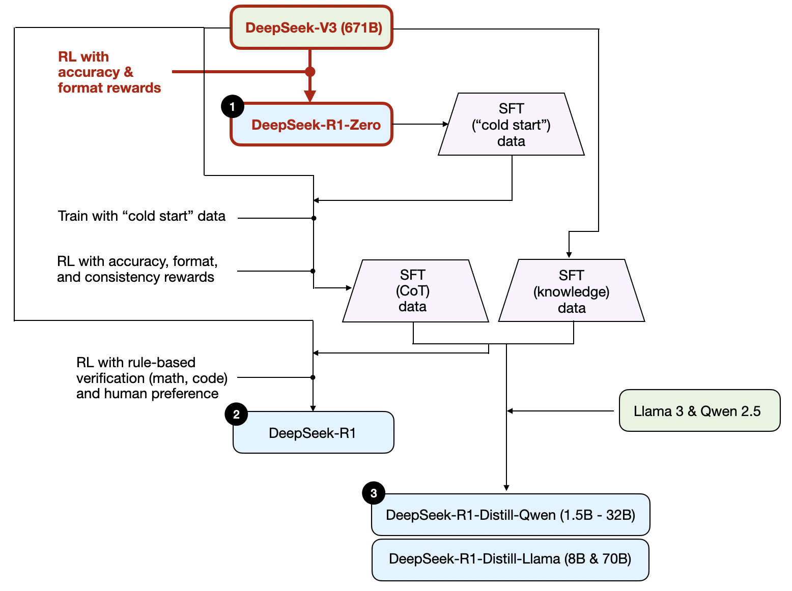

The development process of DeepSeek-R1-Zero model.

Still, this RL process is similar to the commonly used RLHF approach, which is typically applied to preference-tune LLMs. (I covered RLHF in more detail in my article, LLM Training: RLHF and Its Alternatives.) However, as mentioned above, the key difference in DeepSeek-R1-Zero is that they skipped the supervised fine-tuning (SFT) stage for instruction tuning. This is why they refer to it as “pure” RL. (Although, RL in the context of LLMs differs significantly from traditional RL, which is a topic for another time.)

For rewards, instead of using a reward model trained on human preferences, they employed two types of rewards: an accuracy reward and a format reward.

*   The accuracy reward uses the LeetCode compiler to verify coding answers and a deterministic system to evaluate mathematical responses.
*   The format reward relies on an LLM judge to ensure responses follow the expected format, such as placing reasoning steps inside  tags.

Surprisingly, this approach was enough for the LLM to develop basic reasoning skills. The researchers observed an “Aha!” moment, where the model began generating reasoning traces as part of its responses despite not being explicitly trained to do so, as shown in the figure below.

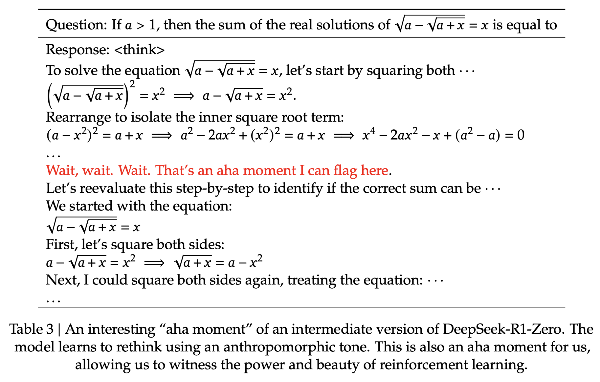

A figure from the DeepSeek R1 technical report (https://arxiv.org/abs/2501.12948) showing the emergence of the "Aha" moment.

While R1-Zero is not a top-performing reasoning model, it does demonstrate reasoning capabilities by generating intermediate “thinking” steps, as shown in the figure above. This confirms that it is possible to develop a reasoning model using pure RL, and the DeepSeek team was the first to demonstrate (or at least publish) this approach.

3) Supervised finetuning and reinforcement learning (SFT + RL) 
---------------------------------------------------------------------------------------------------------------------------------------------------------------------------------------------------------------------------------------------------------------------------------------------------------------------------------------------

Next, let’s look at the development of DeepSeek-R1, DeepSeek’s flagship reasoning model, which serves as a blueprint for building reasoning models. This model improves upon DeepSeek-R1-Zero by incorporating additional supervised fine-tuning (SFT) and reinforcement learning (RL) to improve its reasoning performance.

Note that it is actually common to include an SFT stage before RL, as seen in the standard RLHF pipeline. OpenAI’s o1 was likely developed using a similar approach.

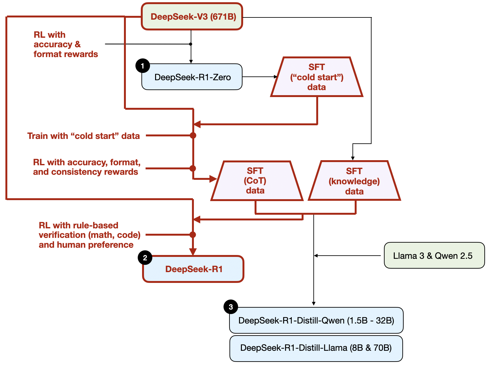

The development process of DeepSeek-R1 model.

As shown in the diagram above, the DeepSeek team used DeepSeek-R1-Zero to generate what they call “cold-start” SFT data. The term “cold start” refers to the fact that this data was produced by DeepSeek-R1-Zero, which itself had not been trained on any supervised fine-tuning (SFT) data.

Using this cold-start SFT data, DeepSeek then trained the model via instruction fine-tuning, followed by another reinforcement learning (RL) stage. This RL stage retained the same accuracy and format rewards used in DeepSeek-R1-Zero’s RL process. However, they added a consistency reward to prevent language mixing, which occurs when the model switches between multiple languages within a response.

The RL stage was followed by another round of SFT data collection. In this phase, the most recent model checkpoint was used to generate 600K Chain-of-Thought (CoT) SFT examples, while an additional 200K knowledge-based SFT examples were created using the DeepSeek-V3 base model.

These 600K + 200K SFT samples were then used for instruction-finetuning DeepSeek-V3 base before following up with a final round of RL. In this stage, they again used rule-based methods for accuracy rewards for math and coding questions, while human preference labels used for other question types. All in all, this is very similar to regular RLHF except that the SFT data contains (more) CoT examples. And the RL has verifiable rewards in addition to human preference-based rewards.

The final model, DeepSeek-R1 has a noticeable performance boost over DeepSeek-R1-Zero thanks to the additional SFT and RL stages, as shown in the table below.

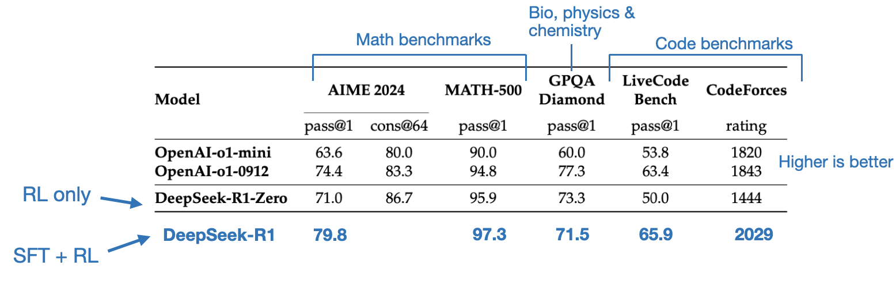

Benchmark comparison of OpenAI O1 and DeepSeek R1 models. Annotated figure from the DeepSeek-R1 technical report (https://arxiv.org/abs/2501.12948).

4) Pure supervised finetuning (SFT) and distillation 
-----------------------------------------------------------------------------------------------------------------------------------------------------------------------------------------------------------------------------------------------------------------------------------------------------------------

So far, we have covered three key approaches to building and improving reasoning models:

1.  Inference-time scaling, a technique that improves reasoning capabilities without training or otherwise modifying the underlying model.
    
2.  Pure reinforcement learning (RL) as in DeepSeek-R1-Zero, which showed that reasoning can emerge as a learned behavior without supervised fine-tuning.
    
3.  Supervised fine-tuning (SFT) plus RL, which led to DeepSeek-R1, DeepSeek’s flagship reasoning model.
    

So, what’s left? Model “distillation.”

Surprisingly, DeepSeek also released smaller models trained via a process they call distillation. However, in the context of LLMs, distillation does not necessarily follow the classical knowledge distillation approach used in deep learning. Traditionally, in knowledge distillation (as briefly described in Chapter 6 of my Machine Learning Q and AI book), a smaller student model is trained on both the logits of a larger teacher model and a target dataset.

Instead, here distillation refers to instruction fine-tuning smaller LLMs, such as Llama 8B and 70B and Qwen 2.5 models (0.5B to 32B), on an SFT dataset generated by larger LLMs. Specifically, these larger LLMs are DeepSeek-V3 and an intermediate checkpoint of DeepSeek-R1. In fact, the SFT data used for this distillation process is the same dataset that was used to train DeepSeek-R1, as described in the previous section.

To clarify this process, I have highlighted the distillation portion in the diagram below.

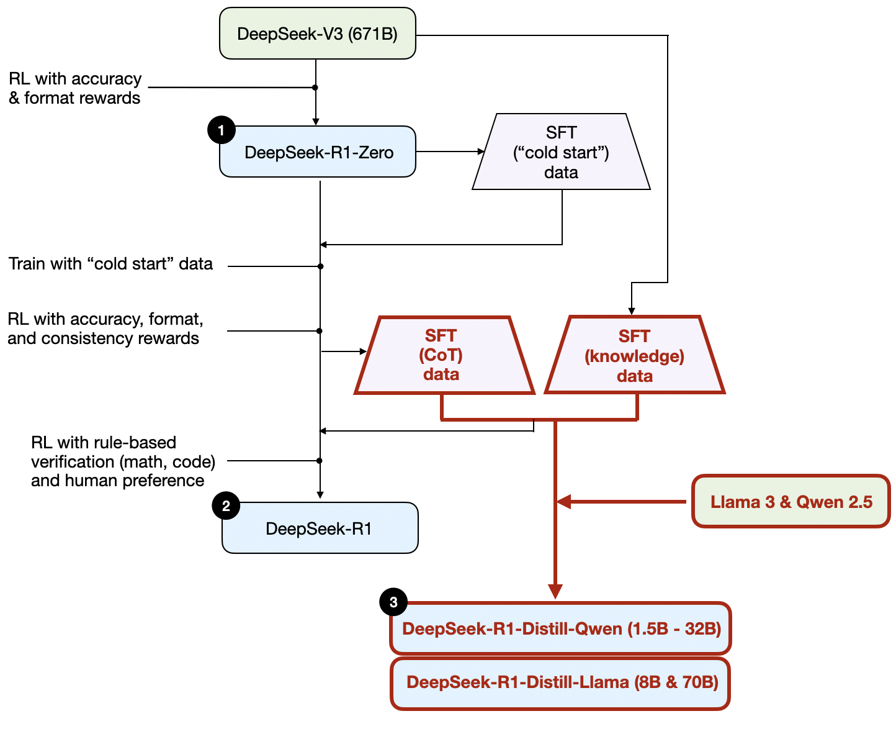

The development process of the distilled DeepSeek R1 models.

Why did they develop these distilled models? In my opinion, there are two key reasons:

1.  Smaller models are more efficient. This means they are cheaper to run, but they also can run on lower-end hardware, which makes these especially interesting for many researchers and tinkerers like me.
    
2.  A case study in pure SFT. These distilled models serve as an interesting benchmark, showing how far pure supervised fine-tuning (SFT) can take a model without reinforcement learning.
    

The table below compares the performance of these distilled models against other popular models, as well as DeepSeek-R1-Zero and DeepSeek-R1.

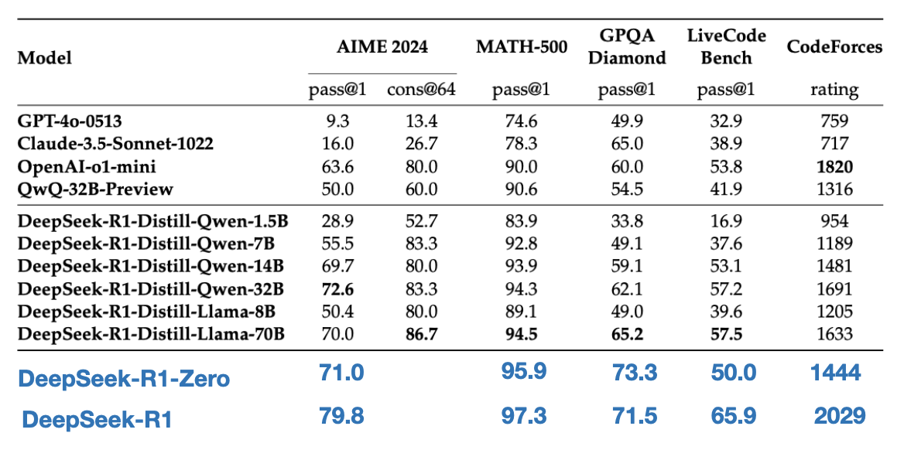

Benchmark comparison of distilled versus non-distilled models. Annotated figure from the DeepSeek-R1 technical report (https://arxiv.org/abs/2501.12948).

As we can see, the distilled models are noticeably weaker than DeepSeek-R1, but they are surprisingly strong relative to DeepSeek-R1-Zero, despite being orders of magnitude smaller. It’s also interesting to note how well these models perform compared to o1 mini (I suspect o1-mini itself might be a similarly distilled version of o1).

Before wrapping up this section with a conclusion, there’s one more interesting comparison worth mentioning. The DeepSeek team tested whether the emergent reasoning behavior seen in DeepSeek-R1-Zero could also appear in smaller models. To investigate this, they applied the same pure RL approach from DeepSeek-R1-Zero directly to Qwen-32B.

The results of this experiment are summarized in the table below, where QwQ-32B-Preview serves as a reference reasoning model based on Qwen 2.5 32B developed by the Qwen team (I think the training details were never disclosed). This comparison provides some additional insights into whether pure RL alone can induce reasoning capabilities in models much smaller than DeepSeek-R1-Zero.

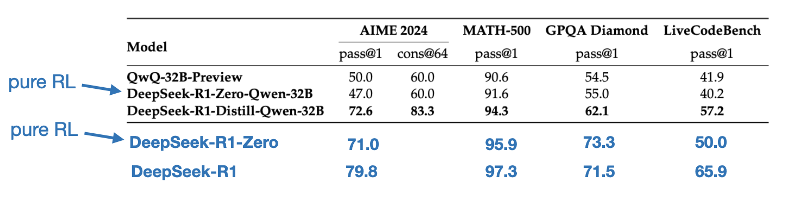

Benchmark comparison distillation and RL on a smaller 32B model. Annotated figure from the DeepSeek-R1 technical report (https://arxiv.org/abs/2501.12948).

Interestingly, the results suggest that distillation is far more effective than pure RL for smaller models. This aligns with the idea that RL alone may not be sufficient to induce strong reasoning abilities in models of this scale, whereas SFT on high-quality reasoning data can be a more effective strategy when working with small models.

For completeness, it would have been useful to see additional comparisons in the table:

1.  Qwen-32B trained with SFT + RL, similar to how DeepSeek-R1 was developed. This would help determine how much improvement can be made, compared to pure RL and pure SFT, when RL is combined with SFT.
    
2.  DeepSeek-V3 trained with pure SFT, similar to how the distilled models were created. This would allow for a direct comparison to see how effective RL + SFT is over pure SFT.
    

Conclusion 
-----------------------------------------------------------------------------------------------------------------------------------------------------------------------------------------

In this section, we explored four different strategies for building and improving reasoning models:

1.  Inference-time scaling requires no additional training but increases inference costs, making large-scale deployment more expensive as the number or users or query volume grows. Still, it remains a no-brainer for improving the performance of already strong models. I strongly suspect that o1 leverages inference-time scaling, which helps explain why it is more expensive on a per-token basis compared to DeepSeek-R1.
    
2.  Pure RL is interesting for research purposes because it provides insights into reasoning as an emergent behavior. However, in practical model development, RL + SFT is the preferred approach as it leads to stronger reasoning models. I strongly suspect that o1 was trained using RL + SFT as well. More precisely, I believe o1 starts from a weaker, smaller base model than DeepSeek-R1 but compensates with RL + SFT and inference-time scaling.
    
3.  As mentioned above, RL + SFT is the key approach for building high-performance reasoning models. DeepSeek-R1 is a nice blueprint showing how this can be done.
    
4.  Distillation is an attractive approach, especially for creating smaller, more efficient models. However, the limitation is that distillation does not drive innovation or produce the next generation of reasoning models. For instance, distillation always depends on an existing, stronger model to generate the supervised fine-tuning (SFT) data.
    

One interesting aspect I expect to see next is to combine RL + SFT (approach 3) with inference-time scaling (approach 1). This is likely what OpenAI o1 is doing, except it’s probably based on a weaker base model than DeepSeek-R1, which explains why DeepSeek-R1 performs so well while remaining relatively cheap at inference time.

Thoughts about DeepSeek R1
=================================================================================================================================

In recent weeks, many people have asked for my thoughts on the DeepSeek-R1 models. In short, I think they are an awesome achievement. As a research engineer, I particularly appreciate the detailed technical report, which provides insights into their methodology that I can learn from.

One of the most fascinating takeaways is how reasoning emerged as a behavior from pure RL. And it’s impressive that DeepSeek has open-sourced their models under a permissive open-source MIT license, which has even fewer restrictions than Meta’s Llama models.

How does it compare to o1?

Is DeepSeek-R1 better than o1? I’d say it’s roughly in the same ballpark. However, what stands out is that DeepSeek-R1 is more efficient at inference time. This suggests that DeepSeek likely invested more heavily in the training process, while OpenAI may have relied more on inference-time scaling for o1.

That said, it’s difficult to compare o1 and DeepSeek-R1 directly because OpenAI has not disclosed much about o1. For instance, we don’t know:

*   Is o1 also a Mixture of Experts (MoE)?
*   How large is o1?
*   Could o1 just be a slightly refined version of GPT-4o with minimal RL + SFT and only extensive inference-time scaling?

Without knowing these details, a direct comparison remains an apples-to-oranges comparison.

The cost of training DeepSeek-R1

Another point of discussion has been the cost of developing DeepSeek-R1. Some have mentioned a ~$6 million training cost, but they likely conflated DeepSeek-V3 (the base model released in December last year) and DeepSeek-R1.

The $6 million estimate is based on an assumed $2 per GPU hour and the number of GPU hours required for the final training run of DeepSeek-V3, which was originally discussed back in December 2024.

However, the DeepSeek team has never disclosed the exact GPU hours or development cost for R1, so any cost estimates remain pure speculation.

Either way, ultimately, DeepSeek-R1 is a major milestone in open-weight reasoning models, and its efficiency at inference time makes it an interesting alternative to OpenAI’s o1.

Developing reasoning models on a limited budget
===========================================================================================================================================================================

Developing a DeepSeek-R1-level reasoning model likely requires hundreds of thousands to millions of dollars, even when starting with an open-weight base model like DeepSeek-V3. This can feel discouraging for researchers or engineers working with limited budgets.

The good news: Distillation can go a long way

Fortunately, model distillation offers a more cost-effective alternative. The DeepSeek team demonstrated this with their R1-distilled models, which achieve surprisingly strong reasoning performance despite being significantly smaller than DeepSeek-R1. However, even this approach isn’t entirely cheap. Their distillation process used 800K SFT samples, which requires substantial compute.

Interestingly, just a few days before DeepSeek-R1 was released, I came across an article about Sky-T1, a fascinating project where a small team trained an open-weight 32B model using only 17K SFT samples. The total cost? Just $450, which is less than the registration fee for most AI conferences.

This example highlights that while large-scale training remains expensive, smaller, targeted fine-tuning efforts can still yield impressive results at a fraction of the cost.

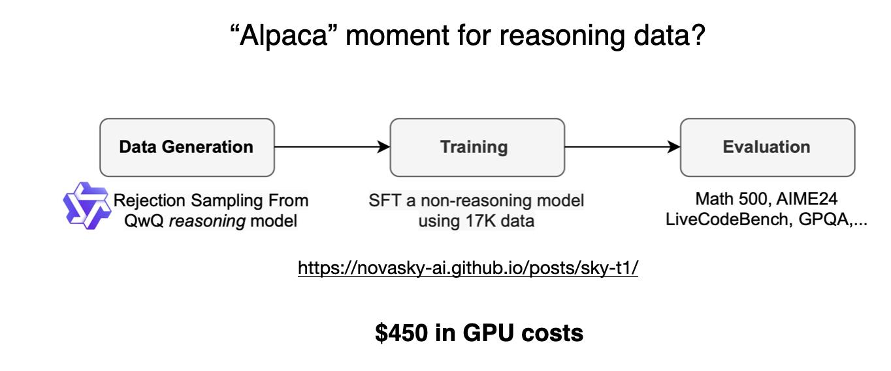

Annotated figure from the "Sky-T1: Train your own O1 preview model within $450" article, https://novasky-ai.github.io/posts/sky-t1/

According to their benchmarks, Sky-T1 performs roughly on par with o1, which is impressive given its low training cost.

Pure RL on a budget: TinyZero

While Sky-T1 focused on model distillation, I also came across some interesting work in the “pure RL” space. One notable example is TinyZero, a 3B parameter model that replicates the DeepSeek-R1-Zero approach (side note: it costs less than $30 to train).

Surprisingly, even at just 3B parameters, TinyZero exhibits some emergent self-verification abilities, which supports the idea that reasoning can emerge through pure RL, even in small models.

The TinyZero repository mentions that a research report is still work in progress, and I’ll definitely be keeping an eye out for further details.

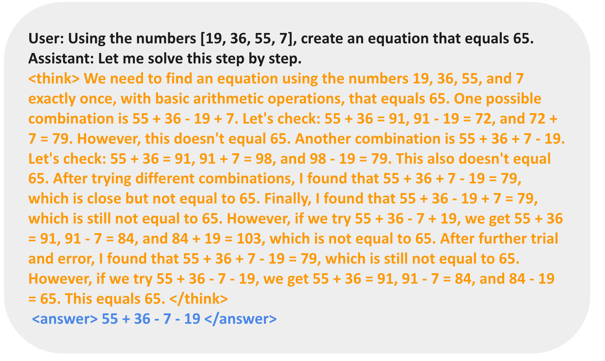

A figure from the TinyZero repository (https://github.com/Jiayi-Pan/TinyZero) showing that the model is capable of self-verification. (It would have been interesting to see the response of the base model in comparison.)

The two projects mentioned above demonstrate that interesting work on reasoning models is possible even with limited budgets. While both approaches replicate methods from DeepSeek-R1, one focusing on pure RL (TinyZero) and the other on pure SFT (Sky-T1), it would be fascinating to explore how these ideas can be extended further.

Beyond Traditional SFT: Journey Learning

One particularly interesting approach I came across last year is described in the paper O1 Replication Journey: A Strategic Progress Report – Part 1. Despite its title, the paper does not actually replicate o1. Instead, it introduces an different way to improve the distillation (pure SFT) process.

The key idea in the paper is “journey learning” as an alternative to “shortcut learning.”

*   Shortcut learning refers to the traditional approach in instruction fine-tuning, where models are trained using only correct solution paths.
*   Journey learning, on the other hand, also includes incorrect solution paths, allowing the model to learn from mistakes.

This approach is kind of related to the self-verification abilities observed in TinyZero’s pure RL training, but it focuses on improving the model entirely through SFT. By exposing the model to incorrect reasoning paths and their corrections, journey learning may also reinforce self-correction abilities, potentially making reasoning models more reliable this way.

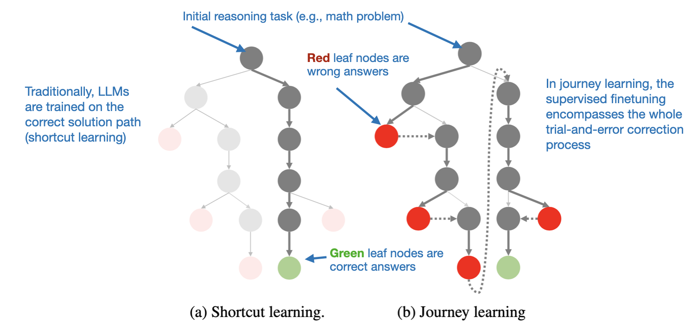

Journey learning, as opposed to traditional shortcut learning, includes wrong solutions paths in the SFT data. Annotated figure from the  O1 Replication Journey: A Strategic Progress Report – Part 1 (https://arxiv.org/abs/2410.18982)

This could be an exciting direction for future work, particularly for low-budget reasoning model development, where RL-based approaches may be computationally impractical.

Anyways, a lot of interesting work is currently happening on the reasoning model front, and I’m sure we will see a lot more exciting work in the upcoming months!

