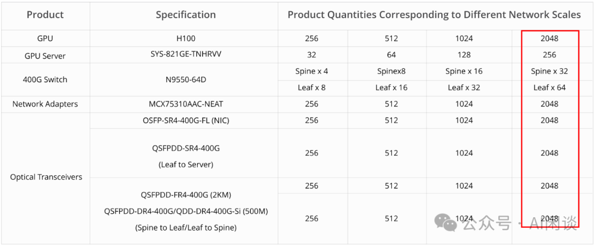

# 万卡 GPU 集群互联：硬件配置和网络设计

**作者：** AI闲谈

---

## 一、背景

自从 OpenAI 推出 ChatGPT 以来，LLM 迅速成为焦点关注的对象，并取得快速发展。众多企业纷纷投入 LLM 预训练，希望跟上这一波浪潮。然而，要训练一个 100B 规模的 LLM，通常需要庞大的计算资源，例如拥有万卡 GPU 的集群。以 Falcon 系列模型为例，其在 4096 个 A100 组成的集群上训练 180B 模型，训练 3.5T Token 耗时将近 70 天。随着数据规模不断膨胀，对算力的需求也日益增长。例如，Meta 在训练其 LLaMA3 系列模型时使用了 15T 的 Token，这一过程是在 2 个 24K H100 集群上完成的。

本文中，我们将深入探讨构建大规模 GPU 集群所涉及的各种组件和配置，包括不同 GPU 类型及 GPU 服务器的配置，网络设备（如网卡、交换机、光模块）的配置，以及数据中心的网络拓扑的设计（如 3-Tier、Fat-Tree 等）。特别地，文章详细介绍了 NVIDIA 的 DGX A100 SuperPod 和 DGX H100 SuperPod 的配置和网络拓扑，同时也会提及业界标准的万卡集群的拓扑结构。

当然，构建超万卡 GPU 集群是一个极其复杂的工程，本文所涉及的只是冰山一角。在实际的集群构建中，还会涉及到存储网络，管理网络等多个方面，这些连接方式比较类似，这里就没有特别多的展开。此外，针对不同的应用场景，网络拓扑的设计也呈现出多样性，本文主要针对大规模 AI GPU 集群中广泛采用的树形拓扑结构。最后，本文也未涉及大规模 GPU 集群中至关重要的电力系统和冷却系统，这些同样是构建和维护集群时不可或缺的重要组成部分。

关于 GPU 硬件配置及 NVLink+NVSwitch 全互联可以参考之前的文章，有更加详细的介绍：

- [全面解析 NVIDIA 最新硬件：B100/B200/GH200/NVL72/SuperPod 等](http://mp.weixin.qq.com/s?__biz=Mzk0ODU3MjcxNA==&mid=2247486395&idx=1&sn=af0da5924032217ec0823d549bbe55b0&chksm=c364ccfef41345e8054707ff8c7ca5ef84241a97bd8806df7ff1ac7cbc086c94619a334c800a&scene=21#wechat_redirect)
- [GPU 关键指标汇总：算力、显存、通信](http://mp.weixin.qq.com/s?__biz=Mzk0ODU3MjcxNA==&mid=2247484942&idx=1&sn=2b69b610d4dacdc372036916d4c91325&chksm=c364c14bf413485d01b3d766d47ecfa170bef6451a97f981d1dc0d0261e23ec088961f423db1&scene=21#wechat_redirect)

## 二、相关组件

### 2.1 GPU

如下图表所示为 Ampere、Hopper 以及最新的 Blackwell 系列最强的 GPU，可以看出，不管是显存、算力还是 NVLink 都是在逐渐增强。

- A100 -> H100 FP16 稠密算力增加到 3 倍多，而功耗只从 400w 增加到 700w。
- H200 -> B200 FP16 稠密算力增加到 2 倍多，而功耗只从 700w 增加到 1000w。
- B200 FP16 稠密算力是 A100 的 7 倍左右，而功耗只是其 2.5 倍。
- Blackwell GPU 支持 FP4 精度，其算力为 FP8 的两倍，NVIDIA 的报告中有部分数据是用 FP4 算力和 Hopper 架构的 FP8 算力比较的，因此加速比会更夸张。
- 需要说明的是：GB200 采用的是 Full B200 芯片，而 B100 和 B200 为相应的阉割版。

### 2.2 HGX

HGX 是 NVIDIA 出的高性能服务器，通常一台机器包含 8 个或 4 个 GPU，搭配 Intel 或 AMD CPU，并且使用 NVLink 和 NVSwitch 实现全互联（8 个 GPU 通常也是除 NVL 和 SuperPod 之外的 NVLink 全互联上限），而且一般会采用风冷散热。

- 从 HGX A100 -> HGX H100 和 HGX H200，其 FP16 稠密算力增加到 3.3 倍，而功耗不到原来的 2 倍。
- 从 HGX H100 和 HGX H200 -> HGX B100 和 HGX B200，其 FP16 稠密算力增加到 2 倍左右，而功耗相当，最多不到 50%。
- 需要说明的是：HGX B100 和 HGX B200 的网络基本没有升级，后向 IB 网卡还是 8x400Gb/s。

NVIDIA DGX 和 HGX 是两种高性能解决方案，它们都是针对深度学习、人工智能和大规模计算需求的，但是设计和目标应用有所不同：

- DGX：主要面向普通消费者，提供即插即用的高性能解决方案，配套全面的软件支持，包括 NVIDIA 的深度学习软件栈、驱动程序和工具等，通常是预构建的、封闭的系统。
- HGX：主要面向云服务提供商和大规模数据中心运营商，适合用于构建自定义的高性能解决方案。提供模块化的设计，运行客户根据自己需求定制硬件，通常是作为一个硬件平台或参考架构提供。

### 2.3 网络

#### 2.3.1 网卡

这里主要介绍 ConnectX-5/6/7/8，是 Mellanox 的高速网卡，都支持以太网和 IB（InfiniBand）。2016 年发布 ConnectX-5，2019 年 NVIDIA 收购 Mellanox，然后 2020 年发布了 ConnectX-6，2022 年发布 ConnectX-7，2024 年 GTC 大会上老黄介绍了 ConnectX-8，还没看到详细参数。几个网卡对应的简要配置如下所示，可以看出，基本上每一代的总带宽都翻倍，下一代估计能到 1.6Tbps：

#### 2.3.2 交换机

NVIDIA 同样提供针对以太网和 IB 的交换机，其往往有几十甚至上百个 Port，对应总的 Throughput（Bidirectional Switching Capacity）为最大带宽 * Port 数目 * 2，其中 2 表示双向。

如下图为常见的 Spectrum-X 系列以太网交换机（PS：这里主要列了高带宽的数据，低带宽也支持，不过总 Port 数是固定的，意义不大，因此这里省略了）：

如下图为常见的 Quantum-X 系列 IB 交换机：

除了以上的 Mellanox 交换机外，现在也有很多数据中心会采用框式交换机（Modular Switch），比如 Meta 最近的 Building Meta's GenAI Infrastructure 中提到其构建了 2 个包含 24K H100 的 GPU 集群，其中使用了 Arista 7800 系列交换机，而 7800 系列就包含框式交换机，如下图所示，7816LR3 和 7816R3 甚至可以提供 576 Port 的 400G 高速带宽，其内部通过高效的总线或者交换背板互联，传输和处理的延迟非常低：

#### 2.3.3 光模块

光模块（Optical Modules）是实现光纤通信的设备，能够将电信号（Electrical Signal）转换为光信号（Optical Signal），然后通过光纤传输，其传输速率更高、传输距离更远，而且不容易受到电磁干扰。光模块通常包含发射器（Transmit）和接收器（Receive），发射器用于电转光，接收器用于光转电，如下图所示：

SFP（Small Form-factor Pluggable）和 QSFP（Quad Small Form-factor Pluggable）是光纤通信中常用的两种光模块接口类型，它们在尺寸、带宽和应用方面有一些区别。比如：

- SFP 通常是单传输通道（一条光纤或一对光纤）
- QSFP 是多传输通道。QSFP 还包含 QSFP-DD，其中 DD 表示双倍密度（Double Density），提供更高的端口密度，使用 8 个信道。

除了以上的 SFP 和 QSFP 封装方式以外，最近几年也出现了 OSFP 封装方式，它有 8 个通道数，主要针对高带宽场景，比如 400Gbps 和 800Gbps。它与 SFP 和 QSFP 的接口不兼容，尺寸比 QSFP-DD 略大，需要使用转换器转换。如下图所示为针对不同传输距离（100米、500米、2千米、10千米）的 400Gbps OSFP 光模块：

针对不同的距离，场景可以选择不同的光模块，如下图所示，在 Core 和 Spine 层之间采用 10Km 的 400G LR4 和 800G 2xLR4，在 Spine 和 Leaf 之间选择 2Km 的 400G FR4，在 Leaf 和 ToR 之间选择 500m 的 400G DR（PS：后文会具体介绍相关的网络拓扑）：

光模块的单价比较高，通常单个光模块可以到几千甚至几万人民币，和带宽、传输距离有关，通常是带宽越大、距离越远，价格越贵。如下图所示为 FS 上热销的几个 400Gbps 光模块：

由于每个 Port 都要使用光模块，因此光模块的数量基本与 GPU 的数量成正比，通常可以达到 GPU 的 4-6 倍，因此，仅光模块的成本就很高。

### 2.4 数据中心网络（DCN）拓扑

#### 2.4.1 基本概念

南北向（North-South）流量：指的是来自数据中心外的流量，不仅包含来自或访问互联网的流量，也包含和其他数据中心的流量。

东西向（East-West）流量：指的是来自同一数据中心的流量，比如数据中心中不同 Server 相互访问的流量。在现在的数据中心中，这一部分流量是大头，通常至少占 70%-80%。

常见的数据中心网络（Data Center Network，DCN）拓扑如下图 Figure 2 所示：

#### 2.4.2 多层 DCN 架构

多层（multi-tier） DCN 网络架构非常常见，尤其是 3 层（3-Tier）DCN 架构，它是一种 Tree-based 结构，通常主要用于管理南北向流量，包含 3 层：

- Core Layer：核心层，通常是高容量的路由器或交换机。
- Aggregation Layer（Distribution Layer）：负责连接接入层设备，并在它们之间提供路由、过滤和流量管理工程。
- Access Layer：接入层，网络中用户直接连接的地方，负责将用户设备连接到网络。

该架构中，通常会假设并非所有接入设备同时以最大带宽通信，因此，常见的做法是越往上总带宽越小，比如 Access 层的总带宽是 20 Gbps，而 Distribution 层的总带宽可能只有 1 Gbps。此时，一旦出现多个设备通信带宽总和超过设计容量，比如极端情况，所有设备都以最大带宽通信，则一定会出现 blocking，延迟增加，也将导致延迟的不可预测性。以上也就是常说的 oversubscription，其中 20:1 就是相应的 oversubscription rate。

在该架构中，通常存在冗余或备份机制，其 Core 层之间或 Distribution 层之间的交换机会相互连接，导致可能出现环路，因此都会需要生成树协议（Spanning Tree Protocol，SFP）来避免环路，也会进一步导致带宽的冗余浪费。

#### 2.4.3 CLOS 网络

CLOS 网络是一种多级交换网络结构，最初由 Charles Clos 在 1953 年提出，旨在解决大型电话交换系统中的连通性和扩展性问题。尽管最初用于电话交换，但它的原理和设计现在广泛应用于数据中心和高性能计算中。其核心思想是通过多级互联结构提供高带宽和低延迟的网络服务，并同时保持网络的可扩展性。

如下图所示，CLOS 网络通常为三级结构：

- 输入层（Ingress）：负责接收外部输入信号。
- 中间层（Middle）：负责连接输入层和输出层交换机。
- 输出层（Egress）：负责发送数据到最终目的地。

CLOS 网络有如下特点和优势：

- 非阻塞（Non-Blocking）：理想的 CLOS 网络设计为非阻塞（无收敛）结构，意味着在网络中不会因为交换机的瓶颈而导致数据传输延迟或丢失。
- 可扩展（Scalability）：通过增加更多的层级和交换机，CLOS 网络可以轻松扩展以支持更多的输入和输出连接，而不会降低性能。
- 冗余（Redundancy）：由于多路径的设计，即使某些交换机或连接失败，数据通常还可以通过其他路径传输，提高了整体网络的可靠性。
- 灵活（Flexibility）：CLOS 网络允许多种不同的配置方式，支持各种大小和性能需求的系统。

#### 2.4.4 Fat-Tree 拓扑

Fat-Tree（胖树）DCN 架构是一种特殊的 CLOS 网络，广泛应用于高性能计算和大型数据中心。这种网络拓扑由 Charles Leiserson 在 1985 年提出，其由多层交换机组成，这些交换机以树形结构组织，但与 3-tier 树形网络不同，在 Fat-Tree 中：

- 所有层交换机都被替换为低端交换机，成本更低。
- 如下图所示，在向上连接到更高层级时“变粗”，每一层之间的总带宽保持不变，从而避免瓶颈问题。
- 每一层的交换机数量和连接方式都是对称的，这也就意味着每个设备到达任何其他设备的路径数相同，有助于负载均衡和避免单点故障。

Fat-Tree DCN 架构的目的是最大化端到端带宽，提供 1:1 的 oversubscripition ratio，也就是实现无阻塞（Non-Blocking）网络。因此，在 Fat-Tree 中，交换机的数目会比 3-Tier 多的多，一般情况 Fat-Tree 中所有交换机都有相同个数的 Port，比如 K 个，相应的称为 K-port Fat-Tree 网络拓扑。2 层 Fat-Tree 和 3 层 Fat-Tree 拓扑如下所示：

- 2 层 Fat-Tree 拓扑
- Spine Switch：K/2 个，对应 K*(K/2) 个 Port。
- Leaf Switch：K 个，对应 K*K 个 Port。
- 最多实现 K*K/2 个 Server 的无阻塞（Non-Blocking）网络。需要 K+K/2=3*K/2 个 Network Switch。
- 3 层 Fat-Tree 拓扑
- Core Switch（Super Spine Switch）：(K/2)^2 个，对应 K*(K/2)^2 个 Port。
- Spine Switch：2*(K/2)^2 个，对应 K*2*(K/2)^2 个 Port。
- Leaf Switch：2*(K/2)^2 个，对应 K*2*(K/2)^2 个 Port。
- 最多实现 K*2*(K/2)^2/2=K^3/4 个 Server 的无阻塞（Non-Blocking）网络。需要 (K/2)^2 + 2*(K/2)^2 + 2*(K/2)^2 = 5*(K/2)^2 = 5*K^2/4 个 Switch。

具体的计算方式如下表所示：

PS：关于 Fat-Tree 架构与 Spine-Leaf 架构的说法各异，有说 Fat-Tree 都是 3 层的，Spine-Leaf 是 2 层的，但很多场景也会介绍 Fat-Tree 的多层级拓扑。对于 Spine-Leaf 架构，也存在 SuperSpine-Spine-Leaf 的拓扑。我们这里就不再区分，都统一为 Fat-Tree 架构。此外，即使 Fat-Tree，也有场景提到无阻塞 Fat-Tree 和 有阻塞 Fat-Tree，这里如果没有特殊说明，都指无阻塞 Fat-Tree。

## 三、NVIDIA DGX SuperPod - A100

### 3.1 DGX A100 System

如下图 Figure 3 所示为一个 DGX A100 System（6U），具体可以参考 Introduction to the NVIDIA DGX A100 System 包含：

- 8 个 A100 GPU，每个 GPU 600 GB/s NVLink 带宽。
- 总共 600*8=4.8TB/s NVSwitch 带宽，80*8=640GB HBM2 显存。
- 8 个 Compute Connection（IB），对应 8 个 ConnectX-6 网卡，提供 8 * 200Gbps 总带宽。
- 2 个 Storage Connection（IB）。
- 1 个 In-Band Connection（Ethernet）。
- 1 个 Out-Band Connection（Ethernet）。

如下图 Figure 3 所示为相应的网络接口：

如下图所示为常见的 8*A100 的配置，其 8 个 GPU 通过 6 个 NVSwitch 实现了全互联。需要注意的是 NVLink 的带宽单位是 Byte，而网络都使用的都是 bit，如下 DGX A100 System 机内总带宽达到 4.8TB/s，而总的网络带宽只有 1.6Tbps，差了 24 倍：

### 3.2 SuperPod SU

如下图 Figure 14 所示为构建 DGX-SuperPod-A100 的基本单元，称作 SuperPod SU（Scalable Unit）：

- 每个 SU 中包含 5 个 Compute Rack 和 1 个 Leaf Network Rack。
- 每个 Compute Rack 包含 4 个 DGX A100 System，以及 2 个 3U 的 PDU（Power Distribution Unit），也就是每个 Compute Rack 32 个 A100 GPU，则一个 SU 有 160 个 A100 GPU。
- Leaf Network Rack 中包含 8 个 Compute Switch（1U） 和 2 个 Storage Switch（1U）。
- Compute Switch 使用的是 QM8790 200 Gb/s IB 交换机，因此共有 8*40=320 个 Port：
- 160 个通过光模块连接 Compute Rack 上的 ConnectX-6 网卡，每个 GPU 对应 1 个 200Gbps 连接。
- 其余 160 个通过光模块连接 Spine Rack。

有些场景也会使用 ToR Switch（Top-of-Rack，柜顶交换机），通常是作为 Leaf Switch。因为和 Server 在一个机柜内，其布线会更加简单，但也可能导致 Switch Port 的浪费。比如一个机柜内放置的 Server 可能是有限的，尤其现在 GPU Server 的功耗越来越高，给冷却系统带来很大的挑战，也就不会在一个机柜放太多 GPU Server，相应的网卡也会减少：

PS：工业界也有些场景会在一个 8*A100 System 中使用更少的网卡，比如 4x200 Gbps，此时需要的 Port 会少一半，相应的 Switch 都可以减半，但整体的网络拓扑方式都是类似的，我们这里先忽略这种情况。

### 3.3 Spine Rack

如下图 Figure 15 所示，一个 Spine Rack 中包含 20 个 1U 的 Compute Switch，同样是 QM8790 200 Gb/s IB 交换机，总共有 20*40=800 个 Port。剩下的 Out-of-band Switch 和 In-band Switch 可以用于管理网络。

### 3.4 DGX SuperPod 100-node

如下图 Figure 4 所示为一个 100-node 组成的 DGX-SuperPOD，其中包含 5 个 SU，还有 1 个额外的 Spine Rack。

- SU 中包含 8 个 Leaf Compute Switch（QM7890 200 Gbps）：
- 每个 Node 上的 8 个 ConnectX-6 网卡分别连接到 8 个 Leaf Compute Switch，每个 ConnectX-6 网卡对应 1 个 GPU。
- 每个 Leaf Compute Switch 上的 20 个 Port 连接 SU 中 20 个 Node，每个 Node 连接 1 个。另外的 20 个 Port 连接 Spine 中的 20 个 Spine Compute Switch。
- Spine Rack 包含 20 个 Spine Compute Switch（QM8790 200 Gbps）
- 每个 Spine Compute Switch 中的 40 个 Port 分别连接 5*8=40 个 Leaf Compute Switch。

通过以上拓扑可以实现 100*8=800 GPU 的无阻塞（Non-Blocking）网络，也就是任意两个 GPU 都可以连通：

- 不同 SU 的 GPU 可以通过 ConnectX-6 -> Leaf Switch -> Spine Switch -> Leaf Switch -> ConnectX-6 的方式连通。
- 同一个 SU 不同 Node 的 GPU 可以通过 ConnectX-6-> Leaf Switch -> ConnectX-6 的方式连通。
- 同一个 Node 内的 GPU 可以通过 NVLink 连通。

实际上 800 GPU（1 个 GPU 对应 1 个 200 Gbps NIC Port） 也是使用 QM8790 实现 2 级 Fat-Tree 无阻塞网络连接的 GPU 上限，可以用 Port 数计算：40*(40/2)=800。超过 800 GPU 则需要使用 3 级 Fat-Tree，相应的 GPU 上限为 40*(40/2)*(40/2)=16000 GPU。

### 3.5 DGX SuperPod 140-node

在 100-node 的系统中，所有 Compute Switch 的 Port 都已占满，此时如果想要支持更多 GPU，只能将 2 层 Switch 变成 3 层 Switch，再增加一层 Core Compute Switch，还是使用 QM8790 200 Gbps。

如下图 Figure 4 所示为 140-node 的 SuperPod，共包含 7 个 SU，所以总共 7*8=56 个 Leaf Switch。正常来说，56 个 Leaf Switch 只需要 56 个 Spine Switch，28 个 Core Switch 即可。而实际上用了 80 个 Spine Switch，并分为 8 个 Group，每个 SG 中 10 个 Spine Switch，每个 CG 中 14 个 Core Switch。（PS：也许是因为这样可以实现对称式的 Fat-Tree 拓扑，更好管理）

- 所有 SU 中的第 k 个 Leaf Switch 连接第 k 个 SG 的 10 个 Spine Switch，也就是：
- 每个 Leaf Switch 中有 2 个 Port 连接 SG 中的 1 个 Spine Switch，总共为 10*2=20。
- 每个 Spine Switch 有 2*7=14 个 Port 与 Leaf Switch 连接。
- Spine Switch 中奇数位置的 Switch 与 Core Switch 中奇数位置相连，偶数位置与偶数位置相连。比如 Spine Switch 1 的 14 个 Port 分别有 1 个 Port 与 Core Switch 1,3,5,...,25,27（CG1） 相连；Spine Switch 2 的 14 个 Port 分别有 1 个 Port 与 Core Switch 2,3,6,...,26,28（CG2） 相连。
- 每 1 个 Core Switch 都会连接 40 个 Spine Switch。

通过以上方式即可以构建一个 140*8=1120 GPU，每个 GPU 1 个 ConnectX-6 200Gbps 网卡的 GPU 集群。

### 3.7 Storage Rack

如下图 Figure 16 所示为一个 Storage Rack，其包含 4 个 Storage Switch，也是 QM8790 200 Gbps IB 交换机，总共有 4*40=160 个 Port，在 Rack 也会有相应的 Store。

### 3.8 DGX SuperPod Storage Fabric

如下图 Figure 7 所示为 140 node 对应的 Storage Fabric，总共 18 个 Leaf Switch。其中每个 SU 中的 Leaf Network Rack 包含 2 个，1 个 Storage Rack 包含 4 个；此外还有 8 个 Spine Switch。

### 3.9 更多配置

如下图 Table 3 所示为不同 node 对应的 Compute 配置：

如下图 Table 4 所示为不同 node 对应的 Storage 配置：

## 四、NVIDIA DGX SuperPod - H100

### 4.1 DGX H100 System

如下图所示为一个 DGX H100 System（6U），具体可以参考 Introduction to the NVIDIA DGX H100 System 包含：

- 8 个 H100 GPU，每个 GPU 900 GB/s NVLink 带宽。
- 总共 900*8=7.2TB/s NVSwitch 带宽，80*8=640GB HBM3 显存。
- 4 个 OSFP Port（IB），对应 8 个 ConnectX-7 网卡，提供 8*400 Gbps 带宽。
- Slot 1 和 2，对应 2 个 ConnectX-7 网卡，提供 2*400 Gbps 带宽。
- 1 个 In-Band Connection（Ethernet）。

其 8 个 GPU 通过 NVSwitch 实现全互联。机内总带宽达到 7.2TB/s，而总的网络带宽只有 3.2Tbps，差了 18 倍：

### 4.2 SuperPod SU

如下图 Figure 2 所示为构建 DGX-SuperPod-H100 的基本单元，称作 SuperPod SU（Scalable Unit）：

- 每个 SU 中包含 8 个 Compute Rack，每个 Rack 40 kW。
- 每个 Compute Rack 包含 4 个 DGX H100 System，以及 3 个 PDU（Power Distribute Unit），也就是每个 Compute Rack 32 个 H100 GPU，则一个 SU 有 256 个 H100 GPU。

### 4.3 Management Rack

在 H100 对应的 DGX SuperPod 中，NVIDIA 提供了 Management Rack，其实和 A100 系列中的 Spine Rack 和 Storage Rack 类似。如下图 Figure 3 所示为一个示例（针对不同的规模相应的配置会有所改变），其包含：

- 32 个 Leaf Compute Switch，使用 QM9700，每个可以提供 64 个 400Gbps 的 Port。理论上有 32*(64/2)=1024 个 400Gbps Port 可以连接 node 上的 ConnectX-7 网卡，剩下的 1024 个 Port 正好连接 16 个 Spine Compute Switch，实现 1024 GPU 的无阻塞（Non-Blocking）网络。
- 16 个 Spine Compute Switch，同样使用 QM9700。正好连接 32 个 Leaf Compute Switch 的一半 Port。
- 8 个 Leaf Storage Switch，同样使用 QM9700。
- 4 个 Spine Storage Switch，同样使用 QM9700。

### 4.4 DGX SuperPod 127-node

如下图 Figure 5 所示为一个 127 node 的 DGX SuperPod，对应 4 个 SU，以及一个上述的 Management Rack。理论上上述的 Management Rack 正好可以连接 4 个 SU 的 128 个 node，但是 Leaf Switch 有一部分连接了 UFM（Unified Fabric Manager），所以实际上只有 127 个 node。

### 4.5 更多配置

如下图 Table 3 所示，使用 QM9700 Switch，2 级 Fat-Tree 最多可以实现 64*64/2=2048 GPU 的无阻塞网络，对应 8 SU；3 级 Fat-Tree 最多实现 64*64*64/4=65536 GPU 的无阻塞网络。不过这里作者最多配置了 64 SU，也就是 16384 GPU：

## 五、业内 GPU 训练集群方案

### 5.1 两层 Fat-Tree 拓扑

如下图所示为常见的两层无阻塞 Fat-Tree 拓扑（Spine-Leaf），常见的训练 GPU 机器都是 8 GPU 方案，同一台机器内的 8 个 GPU 通过 NVLink + NVSwitch 实现全互联，其通信带宽远高于网络带宽。因此，业内基本都会把同一台机器的 8 个 GPU 的网卡连到不同的交换机，也就是说：

- 每一个 Group 中有 8 个 Leaf Switch，对应每台机器的 8 个 GPU；假设一个 Leaf 交换机有 128 个 Port，为了实现无阻塞，会有 64 个 Port 连接对应 GPU 的网卡；则每个 Group 有 64*8=512 个 GPU。其中 Leaf Switch 1 把 Group 中所有 Node 的 1 号 GPU 对应的网卡连接起来，以此类推。在设计分布式训练策略的时候也可以充分利用这个特性。
- 要实现 Spine Switch 和 Leaf Switch 的 Full Mesh，任何一个 Leaf Switch 要连一个 Spine Switch，因此有 64 个 Spine Switch；而每个 Spine Switch 都要连所有 Leaf Switch，也就是有 128 个 Leaf Switch；因此，需要有 16 个 Group。
- 综上，最多有 64+128=192 个 128 Port 的 Switch，最多支持 512*16=8192 GPU。

### 5.2 FS 两层 Fat-Tree 拓扑

如下图所示为 FS 上的两层 Fat-Tree 标准解决方案（利用 RoCE 网络为高性能计算赋能），可以看出其拓扑和我们上述介绍的两层 Fat-Tree 相同，只不过是采用了 64 Port Switch：

由于其采用的是 64 Port 400Gbps Switch，因此：

- Leaf，Spine Switch 都会减半，分别为 64 和 32
- 支持 GPU 数减到 1/4，为 2*(64/2)*(64/2)=2048
- 光模块总数为 Switch 的 Port 数加上网卡数（GPU 数），为 (64+32)*64+2048=8192

### 5.3 三层 Fat-Tree 拓扑

如下图所示为常见的三层无阻塞 Fat-Tree 拓扑（SuperSpine-Spine-Leaf），可以将两层的 Spine-Leaf 看做一个 Pod。图片来自 [星融元针对LLM大模型承载网发布星智AI网络解决方案](https://mp.weixin.qq.com/s?__biz=MzU2NjQ1OTE3Mw==&mid=2247523136&idx=1&sn=9fdb15f0e098cca63cc4ba71ac838041&scene=21#wechat_redirect)。

- 由于 Spine Switch 还有一半的 Port 要连接 SuperSpine Switch，相应 Group 的数目要减半，一个 Pod 有 64 个 Spine Switch，对应 8 个 Group。因此，一个 Pod 有 64 个 Leaf Switch，对应 4096 GPU。
- 有了多个 Pod，可以进一步构建 64 个 SuperSpine Fabric，每一个 Fabric 要与不同 Pod 中的 Spine Switch 实现全互联。这里以 8 个 Pod 为例，将 8 个 Pod 里的第 i 个 Spine Switch 与 Fabric i 中的 SuperSpine Switch 实现 Full Mesh，这里有 8 个 Pod，因此一个 Fabric 中只需要 4 个 128 Port 的 SuperSpine Switch 即可。
- 以上配置 8 个 Pod 对应：
- 总的 GPU：4096*8=32768
- SuperSpine Switch：64*4=256
- Spine Switch：64*8=512
- Leaf Switch：64*8=512
- 总的 Switch：256+512+512=1280
- 总的光模块数：1280*128+32768=196608
- 实际上理论最多可以支持 128 个 Pod，对应的设备数为：
- GPU：4096*128=524288=2*(128/2)^3
- SuperSpine Switch：64*64=4096=(128/2)^2
- Spine Switch：64*128=8192=2*(128/2)^2
- Leaf Switch：64*128=8192=2*(128/2)^2
- 总的 Switch：4096+8192+8192=20480=5*(128/2)^2

### 5.4 百度三层 Fat-Tree 拓扑

如下图所示为百度智能云（大规模AI 高性能网络的设计与实践）上介绍的三层 Fat-Tree 无阻塞网络。可以看出与上述介绍的稍有不同，Spine Switch 和 Leaf Switch 之间采用了分组 Full Mesh，也就是所有 Group 中的第 i 个 Leaf Switch 与 Channel i 中的 Spine Switch 实现 Full Mesh（和上面介绍的 SuperSpine 与 Spine 的连接方式类似）。然后在 SuperSpine 和 Spine 之间继续采用分组 Full Mesh。

## 六、参考链接

1. https://www.fibermall.com/blog/sfp112-qsfp112-qsfp-dd800-osfp-800g-dac.htm
2. https://packetpushers.net/blog/demystifying-dcn-topologies-clos-fat-trees-part2/
3. https://network-insight.net/2014/09/04/spine-leaf-architecture/
4. https://docs.nvidia.com/dgx/dgxa100-user-guide/introduction-to-dgxa100.html
5. https://docs.nvidia.com/dgx/dgxh100-user-guide/introduction-to-dgxh100.html
6. [https://mp.weixin.qq.com/s/Uxixl_43_poc8lgiA3Gvsg](https://mp.weixin.qq.com/s?__biz=MzU2NjQ1OTE3Mw==&mid=2247523136&idx=1&sn=9fdb15f0e098cca63cc4ba71ac838041&scene=21#wechat_redirect)
7. https://cloud.baidu.com/article/364290
8. https://cn.fs.com/mo/solutions/empower-hpc-with-roce-network-10046.html
9. https://arxiv.org/abs/2311.16867
10. 面向超万卡集群的新型智算技术白皮书
11. https://engineering.fb.com/2024/03/12/data-center-engineering/building-metas-genai-infrastructure/

