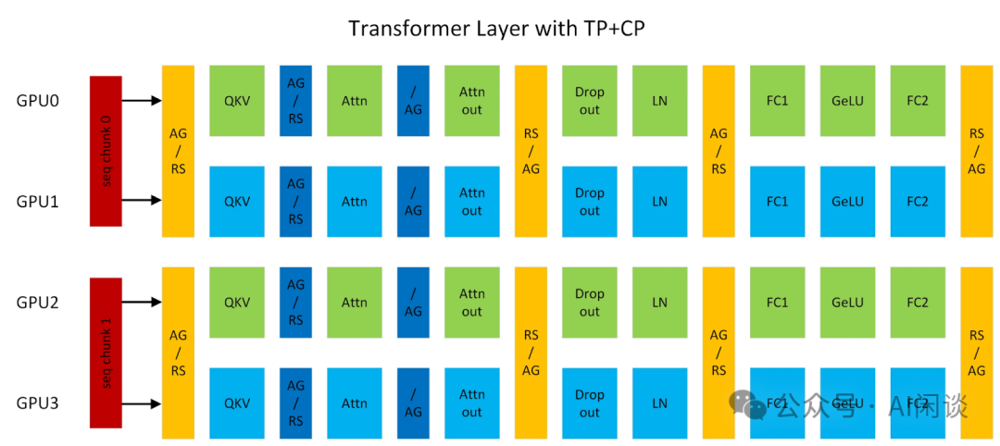
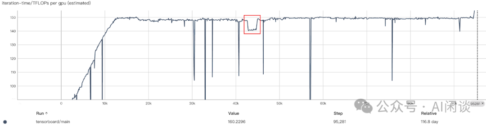
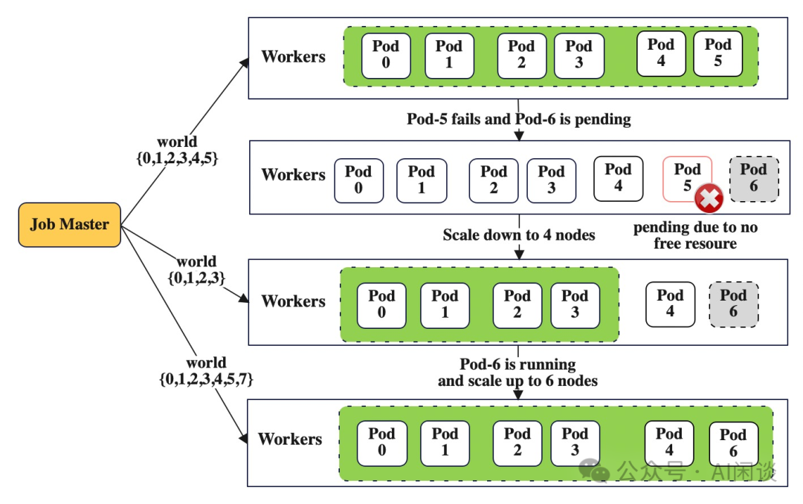

# 万卡 GPU 集群实战：探索 LLM 预训练的挑战

**作者：** AI闲谈

---

## 一、背景

之前的文章中我们介绍过 LLM 预训练相关的数据集、数据清洗流程和数据索引格式，也探讨了 LLM 微调、推理、RAG（检索增强生成） 相关工作，甚至还介绍过 GPU 以及万卡 GPU 集群建设等内容。然而，关于 LLM 预训练的具体细节我们还未深入探讨。这篇文章我们将对其进行相关补充。

假设我们已经搭建了万卡 GPU 训练集群，并准备好相应的训练数据，那么是否可以直接启动预训练任务并顺利完成呢？实际上，事情并没有那么简单。在启动预训练之前，我们需要选择合适的分布式策略，训练中做好有效的 Checkpointing，故障巡检与修复，甚至要考虑弹性训练等多方面的优化和容错措施。

这篇文章中我们将通过 Meta OPT、BigScience Bloom，TII Falcon-180B，字节 MegaScale 以及蚂蚁 DLRover 的相关工作，来简单介绍大规模 LLM 预训练中的分布式策略、优化方案和容错、弹性机制等内容。

其他相关总结可以参考：

- [万卡 GPU 集群互联：硬件配置和网络设计](http://mp.weixin.qq.com/s?__biz=Mzk0ODU3MjcxNA==&mid=2247486775&idx=1&sn=abf7af24181cf5189e113fb161cc8d30&chksm=c364ca72f4134364f4e3fa4a971f767c2b07e6c2cae38c2a4ae28071fd330abaea68c36542c4&scene=21#wechat_redirect)
- [全面解析 LLM 推理优化：技术、应用与挑战](http://mp.weixin.qq.com/s?__biz=Mzk0ODU3MjcxNA==&mid=2247486732&idx=1&sn=9887fdc9b6d1151aaf8c2b443d3c595d&chksm=c364ca49f413435f5f93e68195a38708cb195454272d044d7df368d78586958bef75f5075c8e&scene=21#wechat_redirect)
- [全面解析 NVIDIA 最新硬件：B100/B200/GH200/NVL72/SuperPod 等](http://mp.weixin.qq.com/s?__biz=Mzk0ODU3MjcxNA==&mid=2247486395&idx=1&sn=af0da5924032217ec0823d549bbe55b0&chksm=c364ccfef41345e8054707ff8c7ca5ef84241a97bd8806df7ff1ac7cbc086c94619a334c800a&scene=21#wechat_redirect)
- [Prompt Engineering, Finetune, RAG？：OpenAI LLM 应用最佳实践](http://mp.weixin.qq.com/s?__biz=Mzk0ODU3MjcxNA==&mid=2247486148&idx=1&sn=52eb25529c626c01f5bdd01252239a4d&chksm=c364cd81f41344970e0faa53fe36d53d7fbcf5e8f78de714dcc527e160e8587cc94fc1c8fe3a&scene=21#wechat_redirect)
- [揭秘 LLM 推理：全面解析 LLM 推理性能的关键因素](http://mp.weixin.qq.com/s?__biz=Mzk0ODU3MjcxNA==&mid=2247485863&idx=1&sn=1f4cb40b0ff2908f1fa0b5b0f3b6ebb7&chksm=c364cee2f41347f4e2f9568d359b3ec2ca88d9039370af9b51b7b831dbf537ea312851cf9c76&scene=21#wechat_redirect)
- [万字综述 10+ 种 LLM 投机采样推理加速方案](http://mp.weixin.qq.com/s?__biz=Mzk0ODU3MjcxNA==&mid=2247485998&idx=1&sn=66bb9bea773cde1f9633b2b81ff1a656&chksm=c364cd6bf413447d6b1d97365f54f8cb2273aef700ff1f53de37b2aeecdad17b2904b0772290&scene=21#wechat_redirect)
- [LLM 预训练语料、预处理和数据集索引、加载总结](http://mp.weixin.qq.com/s?__biz=Mzk0ODU3MjcxNA==&mid=2247485650&idx=1&sn=7f9ee5cdc6e2c973d4b582673a1c9cd8&chksm=c364cf97f41346816b40ce530bf532cc57b6dd678d99946c703c0212454a3f9c818d4d7dbb68&scene=21#wechat_redirect)
- [检索增强生成（RAG）综述](http://mp.weixin.qq.com/s?__biz=Mzk0ODU3MjcxNA==&mid=2247485775&idx=1&sn=299f98d39f6915f51e922d6ff7eb76b9&chksm=c364ce0af413471cd851cc42800d815e1b183399b95d41a99a84345c5c172ebd794ece11a6fb&scene=21#wechat_redirect)
- [7 种 LLM 融合扩展总结：LLaMA-Pro、SOLAR、MoE 等](http://mp.weixin.qq.com/s?__biz=Mzk0ODU3MjcxNA==&mid=2247485690&idx=1&sn=8eaade8ad751a90d957d2cde34d5e45b&chksm=c364cfbff41346a97d51c765d2a3a901239b29cc530fc3dce5d98afa02b62776950d63ccce0a&scene=21#wechat_redirect)
- [DALL-E、Stable Diffusion 等 20+ 图像生成模型综述](http://mp.weixin.qq.com/s?__biz=Mzk0ODU3MjcxNA==&mid=2247485596&idx=1&sn=b5ea1a5b583f393675f60a886bab3d72&chksm=c364cfd9f41346cfb08da03041b6c8df132b73043fb8ccfc8068ff3e4099832b2e014d56bd7c&scene=21#wechat_redirect)
- [最全 LMM 评估指标汇总：20+模型、7个维度](http://mp.weixin.qq.com/s?__biz=Mzk0ODU3MjcxNA==&mid=2247484866&idx=1&sn=c33bc7805afa27f9c653dabd8a5b37d6&chksm=c364c287f4134b91110ecfd68d7f0112380dcd44ac952dc0420fa8530691b48daa1198c157b1&scene=21#wechat_redirect)
-  [最全 LMM 模型结构（13种）综述](http://mp.weixin.qq.com/s?__biz=Mzk0ODU3MjcxNA==&mid=2247484681&idx=1&sn=b79969e0a79cd102164499cfecdf3a1d&chksm=c364c24cf4134b5a54baff3bb22bf8b9960d673efa8f1ea3e2f04768a4110f348d66608e4fef&scene=21#wechat_redirect)

## 二、引言

### 2.1 训练预估

如下表所示，常见的 LLM 的预训练代价很高，往往可能需要上千 GPU 训练几十天。尤其是早期的百 B 规模 LLM 都只在几百 B Token 上训练，而现在通常是几 T Token，比如 LLaMA-3 系列模型训练的 Token 数已经达到 15T。

| 模型 | 大小 | Tokens | 资源 | 时长 |
| --- | --- | --- | --- | --- |
| GPT-3 | 175B | 300B | 10000 V100 | 14.8d |
| LaMDA | 137B | 768B | 1024 TPU-v3 | 57.7d |
| OPT | 175B | 300B | 992 A100-80G | 34d(811K GPU hours) |
| PaLM | 540B | 780B | 6144 TPU-v4 | 50d |
| BLOOM | 176B | 366B | 384 A100-80G | 1083K GPU hours(大约3.5m) |
| GLM | 130B | 400B | 768 A100-40G | 60d |
| LLaMA-1 | 65B | 1.4T | 2048 A100-80G | 21d(1022K GPU hours) |
| Falcon | 180B | 3.5T | 4096 A100-40G | 43,500 PFLOP/s-days |

对于现在广泛采用的 Decoder Only LLM 而言，通常可以根据其模型参数量和 Token 数以及训练资源预估出训练时长。具体来说，每个 Token 的 Forward 计算量大约为 2 倍的参数量，如下所示，其中 W 是模型参数量：

考虑到大部分情况下总的计算量与 Forward 计算量的比例接近 3:1，因此可以根据每个 Token 的计算量预估出训练中的计算量约为（与论文 [2001.08361] Scaling Laws for Neural Language Models 中结论一致）：

根据每个 Token 计算量和计算资源可以大概预估出训练的总时长，其中 MFU 表示 Model FLOPS Utilization，是广泛采用的用于衡量分布式训练效率的指标：

训练天数 = Token 数 * Ctoken / (GPU 数 * GPU FLOPs * MFU * 3600 * 24)

根据以上公式可以进一步预估使用 8192 H100-80G GPU，10T Token 数据训练 175B 模型的天数为 30 天：

10T*6*175B/(8192*1000T*50%)/3600/24=30 天

需要说明的是，在 Efficient Large-Scale Language Model Training on GPU Clusters Using Megatron-LM 中 NVIDIA 使用了 Activation 重计算，所以相应需要多一次 Forward 操作，相应总的计算量为：

Ctoken =8 * W

在 [2205.05198] Reducing Activation Recomputation in Large Transformer Models 中作者对 Activation 重计算进行了优化，基本还能保持 3:1 相关的比例，所以后续还是以 3:1 为准。如下图 Table 4 所示：

### 2.2 显存占用

训练中显存占用通常包含四个部分：模型参数，优化器状态，梯度以及中间激活。

以 Adam 优化器为例，Adam 是一种结合了动量（Momentum）和自适应学习率（如 RMSprop）技术的优化算法，广泛用于深度学习模型的训练。Adam 优化器的核心优势在于能够根据参数的更新历史自适应调整每个参数的学习率，这有助于加快收敛速度并提高训练稳定性。为了实现这一点，Adam 维护了 2 个额外的参数（或“矩”），也就是每个参数都对应 2 个优化器参数：

- 一阶矩：过去梯度的移动平均，提供了平滑过的梯度方向。这有助于增加稳定性，使模型在参数空间中的移动更加平滑。
- 二阶矩：过去梯度平方的指数移动平均，代表过去梯度的变化率，允许每个参数有自适应的学习率。参数更新的规模由其梯度的不确定性决定，有助于调整学习步长，避免在参数空间中过大或过小的步进。

在分布式训练中也经常使用指数加权平均（Exponential Moving Average，EMA）来减少训练中噪声的影响，保证训练的稳定性。使用 EMA 后至少还需要维护一个对应的指数平均值，也会占据不小的空间，后续的计算中暂时忽略。

以此可以推测出 LLM 预训练中显存占用情况：（GPT 175B 模型，Adam 优化器，半精度存储）：

- 模型参数：175B 参数 * 2 Byte = 350 GB。在常见的混合精度训练中，为了减少累积误差，提高训练稳定性，通常会保留一份 FP32 精度的模型参数，如果是这种情况，则对应的模型参数为 750GB 左右。
- Adam 优化器状态：350 GB * 2 = 700 GB，对应上述的一阶矩 m 和二阶矩 v。有些时候也会使用 FP32 存储，需要的显存空间也会加倍，为 1400GB。
- 梯度：350 GB。在实际的训练过程中，由于反向传播中链式法则的存在，不需要永久保存所有的梯度，可以边反向传播边更新梯度（Pytorch 默认是在反向传播完统一更新），一旦使用梯度更新了参数即可以释放相应存储，这也是显存优化的一种常见手段。然而，当采用了梯度累积或者其它需要梯度常驻的方案时，也就无法即用即销毁。
- 激活：相对以上参数会小一些，暂时忽略。

综上，LLM 预训练中显存占用大概是 8 倍参数量（或12 倍），175B 模型占用的显存为 1400GB，这甚至超过了常见的单机 8*H100 80G 的限制，需要至少 3 台 8*H100 80G 才能装下。

### 2.3 分布式策略

#### 2.3.1 DP + PP + TP

LLM 由于模型比较大，通常单个 GPU 甚至单机都无法装下，需要进行模型的切分。此外，为了加快训练速度，也都会使用数据并行策略。如下图 Figure 6 所示为一个典型的数据并行（Data Parallelism，DP）+ 流水线并行（Pipeline Parallelism，PP）+ 张量并行（Tensor Parallelism，TP）的方案。

- DP：每一个 DP 切片都有一份完整的模型副本，它们输入不同的数据切片，并行的处理。当所有切片完成一个训练 Step 后需要进行同步更新。通常是每个 DP 切片反向传播获得梯度后，所有 DP 切片之间通过 All Reduce 进行梯度聚合，然后每个 DP 切片分别更新各自的模型参数。
- PP：将模型按照层次切分，不同 GPU 上可以放置一部分的层，通常需要切分尽可能的均衡。由于 Transformer 模型（Decoder）每一层参数量和计算量是固定的，因此相对比较好切分。不过也需要考虑开始的 Token Embedding 和最后 lm_head 中的 World Embedding，因此也有论文中会在第一个 PP 和 最后一个 PP 时让 Transformer Layer 少一点，以便更加的均衡（[2210.02414] GLM-130B: An Open Bilingual Pre-trained Model 中的 PP 为 8，共 70 层，中间各 9 层，起始各 8 层）。PP 的通信量相对比较小，因此常常会放在不同的机器上。
- TP：将模型的某个部分，比如一个 PP 切片对应的几层切分到多个 GPU 上，这样一般就会将一个 Tensor 划分到不同的 GPU。其通信量更大，因此往往会将 TP 放在单个机器内部，可以充分利用机内的 NVLink 高速带宽。

上图中采用的是 8DP 12PP 4TP 方案，因此需要的 GPU 为 8*12*4=384。

#### 2.3.2 Zero-DP

为了进一步降低显存占用，也经常会采用 Zero-DP 进行优化，其分为 Zero-1，Zero-2，Zero-3 和 Zero-offload，具体可以参考 ZeRO & DeepSpeed: New system optimizations enable training models with over 100 billion parameters - Microsoft Research，对应的显存占用如下所示：

- Zero-1：在不同 DP 组之间进一步切分优化器状态。
- Zero-2：除了优化器状态外，进一步切分梯度。
- Zero-3：进一步切分模型参数。

#### 2.3.3 EP

现在混合专家（Mixture of Expert，MoE）模型也越来越多，其参数量进一步增加，因此在训练 MoE 模型时通常也会进一步引入专家并行（Expert Parallelism，EP），简单来说是将不同的专家放在不同的 GPU 上，不过也可以和其他切分方案结合。如下图 Figure 6 所示，可以将 2 个专家 E0 和 E1 分别切分，放到 4 个 GPU 上，每个 GPU 上只有 1/4 个专家：

#### 2.3.4 SP

其实有两个序列并行（Sequence Parallel，SP）的工作，一个是 ColossalAI 的 [2105.13120] Sequence Parallelism: Long Sequence Training from System Perspective，一个是 Megatron-LM 的 [2205.05198] Reducing Activation Recomputation in Large Transformer Models。两者都叫 SP，但是实际上方法不太一样，解决的问题也不同。

如下图 Figure 1 所示，ColossalAI SP 的主要思路是将序列数据切分为更小的子序列，然后将这些子序列分到不同的 GPU 中并行处理。例如，一个长度为 L 的序列，可以将其分成 N 个长度为 L/N 的子序列，然后分别在 N 个 GPU 上进行处理：

由于序列之间是有依赖关系的，因此需要如下图 Figure 2 所示的 Ring Self-Attention 机制来通信，保证计算结果的等价：

如下图 Figure 5 所示为 Megatron-LM SP，其主要是为了解决 TP 中无法分摊的显存。作者分析后发现 LayerNorm 和 Dropout 的输入输出没有被分摊到不同的 GPU。实际上它们在不同的 Token 上并没有依赖关系，因此可以按照 Sequence 维度进行切分，不同 GPU 只保留序列的一部分，也只计算这一部分：

#### 2.3.5 CP

在 Megatron-LM 中还有上下文并行（Context Parallelism，CP），实际上就是 ColossalAI SP，也就是按照输入序列进行切分。如下图所示为 Megatron-LM 中 TP 和 CP 的组合，其中 AG/RS 表示 Forward 为 All Gather，Backward 为 Reduce Scatter；RS/AG 表示前向为 Reduce Scatter，反向为 All Gather。具体可参考 Context parallelism overview - NVIDIA Docs：

### 2.4 GPU 故障

GPU 故障是大规模 GPU 集群中最常见的问题之一，通常会暴露 ECC Error 或 Xid Code，有关 Xid Code 的错误可以参考 NVIDIA 的官方文档 XID Errors :: GPU Deployment and Management Documentation。也可参考一些公有云平台上的 FAQ，比如 常见 Xid 事件的处理方法--机器学习平台-火山引擎，此外也会提供一些排查手段，比如 自助诊断GPU节点问题-阿里云。

GPU 故障最大的挑战是其数量比较多，故障率比较高，一个 GPU 异常往往意味这个训练任务的暂停，而且通常需要按照整机的方式替换。比如 1 个 GPU 异常，通常是直接驱逐整机。这是因为大规模 LLM 预训练往往要利用单机内高速的 NVLink，如果不是整机调度很可能会影响整体吞吐。假设一天内 GPU 发生故障的概率为 0.1%，则一台 8 卡 GPU 机器每天发生故障的概率为 1-(1-0.1%)^8=0.8%，万卡 GPU 一天内有 GPU 发生故障的概率为 1-(1-0.1%)^10000=99.99%。

## 三、Meta OPT

### 3.1 概述

Meta 在 2022 年上半年开源了 OPT（Open Pre-trained Transformer）系列模型，期望复现 OpenAI 的 GPT-3 模型。并且公开模型、代码等，以便促进 NLP 技术在学术、工业界的研究和应用。对应的 Paper 为 [2205.01068] OPT: Open Pre-trained Transformer Language Models。除了论文之外，Meta 也公开了其训练的 logbook Meta OPT-175B Logbook，详细的记录了整个模型的训练过程，包括遇到的各种问题，相关的分析讨论以及采取的相应措施等，具有很大的参考价值。

OPT-175B 模型是在 992 个 80GB A100 GPU 上训练的，每个 GPU 达到了 147 TFLOP/s，按照这个 TFLOP/s，对应的 MFU 大约为 147/312=47%。为了应对机器异常等问题，还额外准备了 12 台机器，以便随时替换（平均每天 2 台机器异常，也就是一台机器每天发生故障的概率高达 1.61%，参考：OPT/chronicles/final_update.md）。

整个训练持续了 2 个多月，包括从 2021-10-20 到 2021-11-11 半个多月的各种测试，以及从 2021-11-11 到 2022-01-06 正式结束训练，正式训练大概 57 天左右。如果按照之前的公式预估，实际只需要训练 25 天左右：

300B*6*175B/(992*147)/3600/24=25 天

有效训练时间只有 25/57=44% 左右，这是因为在整个过程还会出现各种各样的问题。前期由于各种问题至少手动重启了 35 次任务。为了避免每次需要人工重启，因此后续加入了自动重启机制，由于硬件故障又触发了 70+ 次，平均每天都要重启一次任务。

### 3.2 监控&容错

实际上 11-06 就正式启动了训练任务，但是到 11-11 期间尝试了各种方案依然不太符合预期。如下图所示（来自 OPT/chronicles/10_percent_update.md），从 11-06 启动任务到 11-11 期间总共触发了 10 次重启，每种不同的颜色都代表一次重启。

经过讨论，作者决定从头再来，配置与 OpenAI 对齐。如下图所示，11.XX 为之前配置，12.XX 为对齐之后的配置，真正的训练从 11-11 正式开始：

除了上述配置导致的重训之外，大量的硬件异常也需要相应的重启，在 OPT-175B 模型训练中经常遇到的硬件异常包括：

- GPU ECC Error：通常需要重启机器或 Reset GPU。128 个节点每 1-2 天就有一个。
- IB（Infiniband）/NCCL问题：通常是硬件问题，比如网卡坏了，或者网络抖动等。
- 由于网络问题导致训练降速，比如降速 20% 左右，需要通过二分法来判断异常的节点进行相应替换。
- 也可能导致任务直接异常，比如 ：“p2p_plugin.c:141 NCCL WARN NET/IB : Got async event : port error”。
- 任务 Hang 住：通常和 IB/NCCL 问题相关，也需要人工检测。OPT-175B 训练中多次出现任务 Hang 住的情况。
- GPU 掉卡：此时一般会触发 CUDA Error 或程序异常退出，比如：“RuntimeError: Caught RuntimeError in pin memory thread for device 4.”。
- 机器异常：GPU 之外的硬件异常，比如硬盘、CPU 等异常，甚至机器直接挂掉。
- 机器配置异常：比如发现某个机器开启了 MIG。
- 集群维护：通常一个集群里不仅仅是支持一个任务，偶尔会需要维护升级，可能需要停止任务。

任务异常最大的问题就是导致计算的浪费。虽然通过 Checkpointing 机制可以从断点继续训练，但由于 Checkpoint 往往很大，此外 Checkpointing 也会有额外的消耗，因此会选择合适的间隔进行保存。比如每 300 个 Step 保存一个 Checkpoint，那么一旦异常就只能从最新的 Checkpoint 加载继续训练，平均来看会有 150 Step 的计算浪费。

## 四、BigScience Bloom

### 4.1 概述

BigScience 的 Bloom（BigScience Large Open-science Open-access Multilingual Language Model）模型是一个开源、多语言的 LLM。它是众多研究机构和志愿者合作开发完成的，旨在解决多种语言和文化的通用性问题，并鼓励透明度和科学共享，以推动全球研究社区的协作。对应的论文为：[2211.05100] BLOOM: A 176B-Parameter Open-Access Multilingual Language Model。

BigScience 也公布了 Bloom 的详细训练 log：bigscience/train/tr11-176B-ml/chronicles.md at master，甚至包含详细的 Tensorboard 记录：bigscience/tr11-176B-logs · Training metrics。其从 2022-03-11 正式启动训练，并在 2022-06-28 完成 1 个 Epoch 的训练。由于还有预算，又接着训练了一段时间，并在 2022-07-04 从 48 台机器切换为 24 台机器。

Bloom 训练使用了 48 台 8 * A100 80G 机器，共 384 GPU，另外也有 4 台灾备机器，机器数量不到 OPT-175B 的一半。在这些资源下总共训练了 366B Token，最优 GPU 利用率为 156 TFLOPs，实际训练时为 150 TFLOPs，总共花费 3.5 个月。而理论的训练时间为 77 天左右，有效训练比例为 77/110=70%。

366B*6*175B/(384*150T)/3600/24=77 天

其训练的 TFLOPs 如下图所示（注意其中红框的 TFLOPs 下降，后面会介绍）：

### 4.2 分布式并行方案

Bloom 训练使用了 Megatron-DeepSpeed 训练框架，其结合了 Megatron-LM 和 DeepSpeed 的优势。如下图 Figure 6 所示为训练中采用的分布式并行方案：8DP 12PP 4TP，此外作者也使用了 ZeRO-1。

### 4.3 监控&容错

在训练中作者同样面临了硬件问题，平均每周会有 1-2 次的 GPU 异常。为了应对异常，每 3 个小时会保存一次 Checkpoint，也就是平均每次重启会有 1.5 小时左右的计算浪费。此外，作者也遇到了 PyTorch 的死锁 Bug 以及硬盘用满的问题，导致 5-10 小时左右的闲置。

其实刚启动训练时 Checkpoint 保存间隔是比较大的，但是很快在 2022-03-21 遇到 GPU 异常导致失败，由于间隔比较长，导致浪费了 7.5 小时的训练。因此在失败后降低为每 200 个 Step 保存一次，但是在 2022-03-22 再次失败，又浪费了几个小时，进一步降低为每 100 个 Step 保存一次，这样保存间隔在 3 小时左右，也就意味着每次最多浪费 3 小时。

Bloom 训练中同样遇到了任务 Hang 住的问题（2022-04-xx），为了避免无效的等待，作者在启动任务时设置了 “NCCL_ASYNC_ERROR_HANDLING=1”，以便 Hang 住后 NCCL 能直接结束进程，触发重启任务，而不是等待。除此之外，还遇到了评估任务 Hang 住，以及任务异常但 Slurm 未正常退出的问题。

作者也在 2022-04-28 遇到了训练降速问题（上图中的红框），训练吞吐大概降低 5%，GPU 从 149 TFLOPs 降低到 140 TFLOPs。作者怀疑是某个机器存在性能问题，因此停掉任务进行相应的网络吞吐测试，但是并没有发现异常节点。由于正好处于周末，并且手头没有现成的对所有 GPU 进行快速基准测试的工具，只能采用 3 个备份机器逐次替换的方案来找到异常机器。经过多次尝试后终于发现异常机器，并将其替换，再次重启后恢复到 149 TFLOPs 的速度。（PS：有趣的是，单独测试时该机器的性能只有 2.5% 的降低，而不是 5%，但是将其加入集群再次测试时又能复现 5% 的性能下降）。

## 五、TII Falcon-180B

### 5.1 分布式并行方案

Falcon-180B 是由阿联酋的科技创新研究院（TII）开发，拥有 180B 参数，主要基于 RefinedWeb 数据集进行训练，最终训练了 3.5T Token。Falcon-180B 训练使用了 4096 A100 40G GPU，对应 64DP 8PP 8TP，大概需要 43,500 PFLOP/s-days。假设 MFU 为 50%，则相应训练天数为：

43500*1000T/(4096*312T*0.5)=68天

按照之前的计算公式得出了和上述一致的结论：

3.5T*6*180B/(4096*312T*0.5)/3600/24=68天

对于张量并行（TP），考虑到 Falcon-180B 采用了 GQA，对应的 KV head 为 8，因此采用了 8TP 的方案。也就是每个 KV head 分配到 1 个 GPU 上，所以 8TP 完全在单机内通信，可以重复利用机内的高速 NVLink 带宽。针对 MLP Layer 中的两个矩阵乘法，作者同样采用了先列切，再行切的方案，这样在两个子矩阵乘法之间不用进行通信。

对于流水线并行（PP）：作者同样进行了 PP 的切分，使用的 PP 为 8，也就是模型按层切分为 8 个切片。为了减少 PP 中的 Bubble，作者采用了 [2006.09503] Memory-Efficient Pipeline-Parallel DNN Training 的 1F1B 方案。此外，作者也尝试了 [2104.04473] Efficient Large-Scale Language Model Training on GPU Clusters Using Megatron-LM 中的 Interleaved-1F1B 方案，当每个 DP 中 Micro-Batch 较小时，Interleaved-1F1B 会有一定收益，但是当 Micro-Batch 比较大时，并没有获得收益。

如下图 Figure 4 所示，上图是常规的 1F1B，下图是 Interleaved-1F1B。Interleaved-1F1B 是对 1F1B 的改进，通过更灵活的调整不同 Micro Batch 的 Forward 和 Backend 的顺序，可以进一步减少 Bubble，当然，其调度也更加复杂：

除了上述的 1F1B 优化外，为了减少通信量，作者也使用了所谓的 Scatter-Gather 优化。也就是：

1. 激活在发送到下一个切片之前，首先在 TP 上切分（同一个机器上，NVLink 带宽很高）。
2. 然后通过 P2P 通信传输到下一个 PP 切片对应的 GPU 上（跨机通信）。
3. 最后，下一个 PP 切片的所有 GPU 通过 All Gather 来获取全量激活（同机 NVLink）。

对于序列并行（SP）：作者已经使用了 ZeRO 和 FlashAttention 来优化显存占用，进一步尝试 SP 时并没有明显提升，甚至略有下降，因此并未采用 SP。

对于数据并行（DP）：DP 是最常见的并行方案。确定了 TP 和 PP 后，就可以综合考虑资源情况确定 DP 并行度，需要说明的是，DP 间的 All Reduce 会随着 Batch Size 的增加而增加，最终使 DP 变为 Bandwidth Bound，因此也需要综合考虑。总共有 4096 GPU，因此最终的 DP 为 4096/8/8=64。

### 5.2 监控&容错

当 GPU 数目比较大时，有一个 GPU 出现故障的概率会急剧增加，比如 4096 GPU 稳定运行一天相当于一个 GPU 连续稳定使用 11 年。作者同样面临了硬件故障的问题，其中主要是 A100 的故障，尤其是 ECC Error 等。但也并不是所有的故障都会返回 Xid Code，通常需要人工测试来捕获，因为它们通常会导致计算返回 NaN。因此，作者在任务启动是会运行一系列的大型矩阵乘法来捕获这些故障。此外，还会启动一些简单的通信测试，以保证网络的正常。

要保证任务的稳定、可靠运行，监控是必不可少的手段。作者也提到当前大部分 Web-Based 的监控工具，比如 Prometheus，通常会有一定的采样间隔（15s，30s，甚至 60s），这就导致其可能会错过一些问题，比如毛刺。因此作者也部署了自己的可视化工具。

5.3 训练损失毛刺（Spike）

除了运行的稳定性之外，训练损失应经常会出问题。比如训练过程中，损失偶尔会出现毛刺的情况。针对这种情况，Falcon 作者会恢复到上一个最新的 Checkpoint，并跳过 1B Token 数据继续训练。作者训练 Falcon-180B 时出现了 9 次毛刺。

其实 Google 训练 PaLM 模型（[2204.02311] PaLM: Scaling Language Modeling with Pathways）也遇到了同样的问题，作者在一个训练中遇到了 20 次的毛刺。针对此种情况，作者会重启训练，并从毛刺之前的 100 个 step 开始，然后跳过 200-500 个 Batch 的数据，通过这种方式，没有再出现毛刺现象。此外，作者也做了消融实验，发现并不是单个数据的问题，而可能是这连续的一系列 Batch 数据引起的。

为了保证训练的稳定性，[2211.05100] BLOOM: A 176B-Parameter Open-Access Multilingual Language Model 中作者参考 bitsandbytes 库的方式，使用了 StableEmbedding Layer，也就是在 Embedding Layer 之后增加 layer normalization，然后发现极大提升了训练稳定性。

如下图所示，是 Bloom 中遇到的毛刺现象：

关于训练损失出现毛刺的情况，[2210.02414] GLM-130B: An Open Bilingual Pre-trained Model 和 bigscience/train/tr8b-104B/chronicles.md at master 中都有一些讨论和实验，这里不再展开。

## 六、字节 MegaScale

字节在今年 2 月份发表了 [2402.15627] MegaScale: Scaling Large Language Model Training to More Than 10,000 GPUs，其中详细介绍了万卡 GPU 训练 LLM 的各种挑战和非常全面的优化手段。如下图 Table 2 所示，其最终在 3072 GPU 上实现了 59.1% 的 MFU，在 12288 GPU 上也实现了 55.2% 的 MFU，相比 Megatron-LM 明显提升。

### 6.1 优化手段

字节采用了多种优化手段来提升训练性能，包括算法优化、通信优化、算子优化、数据处理优化以及网络优化等。

其算法优化主要包括三个方面，一个是使用并行 Transformer Block，也就是 Attention 和 MLP 可以并行；另外一个是使用滑动窗口 Attention，可以降低计算量；最后，使用了 LAMB 优化器，最最大的好处是可以在不影响精度的情况下将 Batch Size 扩大 4 倍，这也为降低 PP 中的 Bubble 提供了空间，使用 LAMB 优化器，MegaScale 减少了 87.5% 的 PP Bubble。

其通信优化也包含三个方面，分布式 DP 的 overlap，PP 的 overlap，以及 TP 和 SP 中的 overlap。

其算子优化包括使用 FlashAttention-2，以及 LayerNorm 和 GeLU 的算子融合等。

其数据处理优化也包含两个方面，一个是进行异步数据加载，在 GPU 同步梯度的时候执行下一个 Step 的数据处理，可以隐藏掉数据处理的开销；另外一个是考虑到一个 TP 组都是在同一台机器内，需要读取相同的数据，因此可以在每台机器共享 DataLoader，并将数据放在共享内存，每个 GPU Worker 从共享内存加载数据即可。

此外，字节还对集合通信初始化进行了优化，字节发现当 GPU 的规模很大时，使用 torch.distributed 进行 NCCL 初始化的开销很大。在 2048 Ampere GPU 上进行测试，其初始化时间大约为 1047 秒，万卡时更慢。经过优化，字节将 2048 GPU 上的初始化时间从 1047 秒降低到 361 秒。此外还对全局 barrier 进行优化，复杂度从 O(n2) 降低到 O(n)。

最后，字节还进行了网络性能优化，包括网络互联拓扑设计，减少 ECMP 哈希冲突以及拥塞控制等。

### 6.2 监控&容错

当训练任务达到万卡规模时，各种软硬件故障几乎是不可避免的，为了保证稳定的训练，作者建立了一个自动故障检测和快速恢复机制，以便提供容错能力，并尽量减少人工干预。

如下图 Figure 5 所示为作者构建的稳定训练流程，当用户提交训练任务后，除了在每个 GPU 上创建一个训练 Executor 外，还会创建一个训练守护进程，定期向 Driver 发送心跳。心跳信号包含各种信息，以实现实时的异常检测和发送告警信息。Driver 在特定时间内未收到心跳信号时，也会触发故障恢复流程，包括：

1. 暂停所有训练的 Executor，并执行一系列的自检诊断。
2. 一旦识别到异常机器，将其驱逐，并将通过测试的同等数量的健康机器加入集群。除此之外，还提供了用户接口，允许用户手动识别并驱逐异常机器。
3. 机器恢复完成之后，将从最近的 Checkpoint 恢复训练。作者也对 Checkpoint 的保存和恢复过程进行了优化，以最大限度减少对训练进度的影响。

通过上述的守护进程，可以收集详细的信息用于数据分析。其心跳信号包括 IP 地址，Pod 名字，硬件信息等，还包含当前的训练进度信息。除此之外，训练进程的 stdout/stderr 日志也会被收集，以便进行实时的聚合、过滤和分析。如果识别到 warning 或 error 等关键字，Driver 将实时的上报这些诊断信息。最后，RAMA 的流量指标也会包含在内，以便更好的识别网络利用率和通信效率。为了增强对训练稳定性和性能的监控，字节开发了一个精确到毫秒级的监控系统，以便进行更全面的评估。

对于自检诊断流程，作者充分考虑了诊断时长和准确性之间的平衡。部署了一套轻量级的诊断测试，能够有效覆盖实际训练过程中的各种软硬件故障：

- 机内测试：
- 回环测试（Loopback test）：测量机器内所有的 RAMA 网卡到各种机内端点（包括内存、GPU）的回环带宽。会进行 full-mesh 测试，覆盖所有可能的链路组合，以便推断 PCIe 配置中潜在的链路问题。
- RNIC-to-RNIC 测试：主要测试机内不同 RNIC 之间的连通性和带宽性能。以便发现 RNIC 是否符合速度规格或存在路由问题。
- NCCL 测试：在机内进行 All-to-All 测试，也会在同一个 TOR 交换机的机器之间进行 All Reduce 测试，以发现潜在的硬件故障和性能问题。

关于 Checkpoint 保存和恢复优化，作者引入了两阶段方案，第一阶段每个 GPU 训练进程将显存中的状态信息写入主机内存中，由于高速 PCIe 带宽，这个过程通常只要几秒钟，这样训练进程可以马上继续训练。第二阶段中，一个后台进程异步的将状态信息同步到分布式文件系统，这里作者使用的是 HDFS。

在训练过程中，作者还发现 MFU 会随着训练的迭代逐步下降，但是单独测试机器的性能又没有发现明显的差异。为了诊断这些问题，作者开发了一个性能剖析工具，其会记录每个训练 Executor 中关键代码片段的执行时间。与 torch profiler 和 Megatron-LM timer 不同，作者的工具基于 CUDA events，可以最大程度减少对 CUDA 同步的需求，从而避免性能下降。通过 profiler 工具，作者发现训练过程中有 0.5% 的机器性能较差，驱逐这些机器后 MFU 变得很稳定。

此外，通过可视化工具，还可以显示不同的分布式视图，比如 DP，PP，TP。如下图 Figure 8 所示显示了 PP 的数据依赖关系：

除了以上的问题外，作者也经常遇到网络抖动问题。网络抖动会导致训练停止或训练速度下降。经历多次网络抖动作者总结了两个经验教训：

- 一个是增大超时阈值（PS：估计是 NCCL_IB_TIMEOUT，其范围为 1-22，NCCL 2.14 之前默认值为 14，之后改为 18，推荐设置为 22。不知道为什么 HPC-基于NCCL通信库的多机RDMA网络性能测试--GPU云服务器-火山引擎 推荐为 23？）
- 另外一个教训是，问题的根本原因是网卡、AOC 电缆和交换机之间链路质量差。通过对网卡信号强度、AOC 电缆质量和交换机侧信号强度进行较低级别的质量控制，可以将抖动频率降低到可接受范围。

除了 NCCL_IB_TIMEOUT 之外，也可以关注 NCCL_IB_RETRY_CNT 的配置，表示重试次数，默认配置为 7 即可。奇怪的是，NCCL 官方文档并没有介绍 NCCL_IB_RETRY_CNT 的范围，不过其对应的值为 3bit 数值，最大也就是 7，不确定超过 7 后会怎么处理，可以参考如下图所示的 issue NCCL only use RDMA_WRITE/READ why it still got opcode 0 error 12 err · Issue #902 · NVIDIA/nccl · GitHub：

## 七、DLRover

### 7.1 概述

针对大规模 LLM 训练中的各种问题，蚂蚁也开源了相应的 DLRover 工具 DLRover: An Automatic Distributed Deep Learning System。其提供容错，Flash Checkpoint 以及弹性能力，也计划开源其 Profiling 工具 [xpu_timer](https://mp.weixin.qq.com/s?__biz=MzkyNzQyMjkxNQ==&mid=2247488502&idx=1&sn=69716c96cf4593291eb7e82176cd3f28&scene=21#wechat_redirect)。

DLRover 中，作者也提到在蚂蚁的 GPU 训练集群中，一个月内单卡的故障率约为 8%，也就是一天单卡的故障率为 0.27%，对于一个千卡训练任务而言，一天内因为 GPU 故障导致任务失败的概率为 1-(1-0.27%)^1000=93%。其常见的故障也是 Xid、ECC、NVLink error 和 NCCL error。

### 7.2 容错&自愈

为了实现故障自愈能力，DLRover 实现了自动的节点检查，训练进程自动重启等能力，大幅提升训练稳定性，减少人工运维成本。其故障自愈流程如下：

- 任务失败后保存 Checkpoint 并启动故障检测。
- 检测到异常机器后会驱逐并找到新的机器替换。
- 重新检测正常后重启任务，加载最新的 Checkpoint 继续训练。

其机器检测流程如下图所示，会在每个 GPU 上启动一个子进程来进行轻量级的检测任务，包括一些简单的矩阵乘法计算和 All Gather 任务。

如下图所示，在进行检测时，job master 会将节点两两划分为多个 Group，然后在 Group 内运行 All Gather 任务，并将结果上报给 job master。如果 Group 中有节点检测失败，则此 Group 会被划分为潜在故障机。然后开启第二轮测试，将故障机器和正常机器再次重组为 Group，以此就可以发现故障机器。

### 7.3 Flash Checkpoint

在 DLRover 发布Flash Checkpoint 实现大模型训练的秒级容错 中，作者详细介绍了其 Flash Checkpoint 能力。简单来说，其提供如下能力：

- 异步持久化：首先同步将状态信息写到共享内存，然后异步从共享内存写到存储系统，训练时间可以降到最低。
- 断点续存：故障发生后，DLRover 可以紧急将 Checkpoint 持久化到存储中，防止 Checkpoint 数据丢失，减少迭代时间浪费。
- 内存热加载：如果非机器宕机问题，可以直接重启训练进程，并从主机内存中加载 Checkpoint，省去读取存储系统的开销。

### 7.4 弹性

DLRover 重新实现了 TorchElastic 的 ElasticAgent，以便实现更好的弹性能力。如下图所示，当训练任务失败并且资源不足时，可以驱逐异常机器并较少资源继续训练。当资源数目满足后，会重新扩容并继续训练：

### 7.5 Profiling 工具

作者最近也介绍了其 Profiling 工具 [故障排查难？xpu_timer 让大模型训练无死角！](https://mp.weixin.qq.com/s?__biz=MzkyNzQyMjkxNQ==&mid=2247488502&idx=1&sn=69716c96cf4593291eb7e82176cd3f28&scene=21#wechat_redirect)，通过截获 Cublas/Cudart 库，使用 cudaEvent 为训练中的各种计算、通信进行计时。此外还提供 Timeline 分析，Hang 检测和 Hang 栈分析等能力。不过目前还未正式开源。

## 八、参考链接

1. https://arxiv.org/abs/2001.08361
2. https://arxiv.org/pdf/2104.04473
3. https://arxiv.org/abs/2105.13120
4. https://docs.nvidia.com/megatron-core/developer-guide/latest/api-guide/context_parallel.html
5. https://arxiv.org/abs/2205.05198
6. https://docs.nvidia.com/deploy/xid-errors/index.html
7. https://www.volcengine.com/docs/6459/974350
8. https://help.aliyun.com/zh/ack/ack-managed-and-ack-dedicated/user-guide/use-node-diagnosis-to-self-troubleshoot-gpu-node-problems
9. https://arxiv.org/abs/2210.02414
10. https://www.microsoft.com/en-us/research/blog/zero-deepspeed-new-system-optimizations-enable-training-models-with-over-100-billion-parameters/
11. https://arxiv.org/abs/2205.01068
12. https://github.com/facebookresearch/metaseq/blob/main/projects/OPT/chronicles/README.md
13. https://github.com/facebookresearch/metaseq/blob/main/projects/OPT/chronicles/final_update.md
14. https://github.com/facebookresearch/metaseq/blob/main/projects/OPT/chronicles/10_percent_update.md
15. https://arxiv.org/abs/2211.05100
16. https://github.com/bigscience-workshop/bigscience/blob/master/train/tr11-176B-ml/chronicles.md
17. https://huggingface.co/bigscience/tr11-176B-logs/tensorboard
18. https://arxiv.org/abs/2006.09503
19. https://arxiv.org/abs/2104.04473
20. https://arxiv.org/abs/2204.02311
21. https://arxiv.org/abs/2402.15627
22. https://arxiv.org/abs/2210.02414
23. https://www.volcengine.com/docs/6419/105002
24. https://github.com/NVIDIA/nccl/issues/902
25. https://github.com/intelligent-machine-learning/dlrover
26. [https://mp.weixin.qq.com/s/OYkv4gXh_l_HpHXHqK6Ijw](https://mp.weixin.qq.com/s?__biz=MzkyNzQyMjkxNQ==&mid=2247488502&idx=1&sn=69716c96cf4593291eb7e82176cd3f28&scene=21#wechat_redirect)
27. [https://mp.weixin.qq.com/s/XC_jhFgpx872C7taf6JLIg](https://mp.weixin.qq.com/s?__biz=Mzg4NDQwNTI0OQ==&mid=2247578017&idx=2&sn=ccb6c9210946f0ac70fdc2e8e1756dd1&scene=21#wechat_redirect)
28. https://huggingface.co/docs/transformers/v4.15.0/en/parallelism
29. https://neptune.ai/blog/distributed-training-errors

