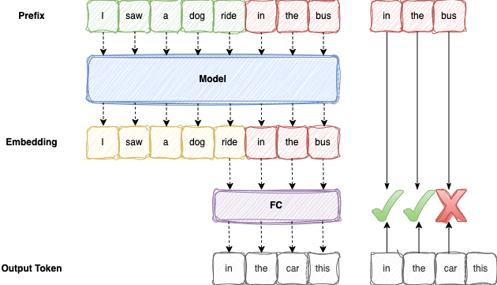
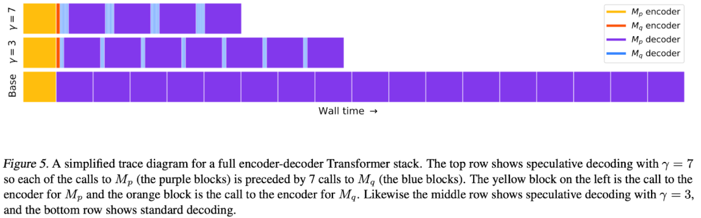
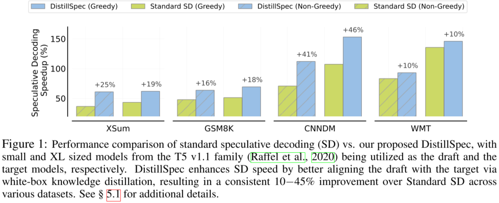

# 万字综述 10+ 种 LLM 投机采样推理加速方案

**作者：** AI闲谈

---

一、背景
二、自回归解码（Autoregressive Decoding）

三、并行解码（Parallel Decoding）

四、投机解码（Speculative Decoding）

五、SpecInfer

六、Medusa

七、REST（基于检索）

八、前向解码（Lookahead Decoding）

九、EAGLE（基于特征）

十、阿里 Lookahead（针对 RAG 等）

十一、其他优化方案

十二、总结

十三、参考链接

## 一、背景

我们之前对投机解码（Speculative Decoding）方案做过比较多的介绍，从 Parallel Decoding 到 Google 的 Speculative Decoding，再有 SpecInfer、Medusa、Lookahead Decoding，以及最近阿里的 Lookahead。最近看到也有一篇关于 Speculative Decoding 的综述文章 [2401.07851] Unlocking Efficiency in Large Language Model Inference: A Comprehensive Survey of Speculative Decoding，如下图Figure 3 所示：

这里我们也对投机解码相关工作进行总结，更多的是汇总我们之前接触过的或开源的方案，并对各种方案进行比较。

## 二、自回归解码（Autoregressive Decoding）

### 2.1. 概述

当前的主流 LLM 基本都是 Decoder Only 的 Transformer 模型，其推理过程可以分为两个阶段：

- Prefill：根据输入 Tokens（Recite, the, first, law, of, robotics） 生成第一个输出 Token（A），通过一次 Forward 就可以完成，在 Forward 中，输入 Tokens 间可以并行执行（类似 Bert 这些 Encoder 模型），因此执行效率很高。
- Decoding：从生成第一个 Token（A） 之后开始，采用自回归方式一次生成一个 Token，直到生成一个特殊的 Stop Token（或者满足用户的某个条件，比如超过特定长度） 才会结束，假设输出总共有 N 个 Token，则 Decoding 阶段需要执行 N-1 次 Forward，这 N-1 次 Forward 只能串行执行，效率很低。另外，在生成过程中，需要关注的 Token 越来越多（每个 Token 的生成都需要 Attention 之前的 Token），计算量也会适当增大。

### 2.2 KV Cache

如下图所示，在 LLM 推理中最关键的就是下图中的 Multi-Head Attention，其主要的计算集中在左图中灰色的 Linear（矩阵乘）和 Scaled Dot-Product Attention 中的 MatMul 矩阵乘法：

如上右图中的 Mask 是一个下三角矩阵，也是因为这个下三角矩阵实现了 LLM Decoder 的主要特性，每个 Token 都只能看到当前位置及之前的 Token。

如下图所示，其中的 QKT 可以理解为一个相关性矩阵，如动图所示，4 个 Token 对应 4 个 Step，其中：

- Step 2 依赖 Step 1 的结果，相关性矩阵的第 1 行不用重复计算
- Step 3 依赖 Step 1 和 Step 2 的结果，相关性矩阵的第 1 行和第 2 行不用重复计算
- Step 4 依赖 Step 1、Step 2 和 Step 3 的结果，相关性矩阵的第 1 行、第 2 行和第 3 行不用重复计算

在 Decoding 阶段 Token 是逐个生成的，上述的计算过程中每次都会依赖之前的结果，此时最简单的思路就是 Cache 之前计算过的中间结果，在计算当前 Token 时直接从 Cache 中读取而不是重新计算，如下图所示，上面是没有 Cache 的情况，下面是有 Cache 的情况：

如下表所示，在 T4 GPU 上以 GPT2 模型为例验证有无 Cache 对推理时延的影响，其加速效果非常明显，因此也成为 LLM 推理的标配：

| GPT2/T4 | 无 KV Cache | 有 KV Cache | 加速比 |
| --- | --- | --- | --- |
| Output Token 1000 | 52.53s | 9.12s | 5.76x |

当然，KV Cache 也有一定不足，其相当于使用空间换时间，占用的显存会大幅增加，尤其是对于参数规模较大的模型。比如，对于 Vicuna-13B 模型（FP16 推理，其 Transformer layer num=40, embedding size=5120）来说，在 Sequence Length=1024，batch size=8 下，KV 缓存所占显存大小为 2 * 2 * 40 * 5120 * 1024 * 8 = 6.7G。

### 2.3 访存瓶颈

因为 Decoding 阶段 Token 逐个处理，使用 KV Cache 之后，上面介绍的 Multi-Head Attention 里的矩阵乘矩阵操作全部降级为矩阵乘向量。

除此之外，Transformer 模型中的另一个关键组件 FFN 中主要也包含两个矩阵乘法操作，但是 Token 之间不会交叉融合，也就是任何一个 Token 都可以独立计算，因此在 Decoding 阶段不用 Cache 之前的结果，但同样会出现矩阵乘矩阵操作降级为矩阵乘向量。

矩阵乘向量操作是明显的访存 bound，而以上操作是 LLM 推理中最主要的部分，这也就导致 LLM 推理是访存 bound 类型。

基于 V100 GPU，FP16 精度，LLM 推理 Prefill 阶段和 Decoding 阶段的 Roofline Model 可以近似表示如下（理论上限），其中

- 三角表示 Prefill 阶段：假设 Batch size 为 1，Sequence Length 越大，计算强度越大，通常都会位于 Compute Bound 区域。
- 圆表示 Decoding 阶段：Batch size 越大，计算强度越大，理论性能峰值越大，通常都会位于 Memory Bound 区域。

### 2.4 Decoding 阶段优化

如下图 Figure 4 所示，Prefill 阶段在比较小 Batch Size 下可以获得比较大的计算强度，相应的吞吐也很高；而 Decoding 阶段需要比较大的 Batch Size 才能获得相对高的计算强度及吞吐（图片来自 [2308.16369] SARATHI: Efficient LLM Inference by Piggybacking Decodes with Chunked Prefills ）：

针对 Decoding 阶段计算强度比较低的情况，有两种优化的思路：

- 在不同请求间 Batching 的方式（Continuous Batching），可以增大 Decoding 阶段的 Batch Size，进而更充分发挥 GPU 算力，但是其无法降低单个请求的 Latency，而且如果用户请求比较少，比如只有单一用户，那么永远无法实现 Batching。
- 在单一请求内一次验证多个 Decoding Step（Speculative Decoding），虽然一次 Decoding Step 计算量线性增加，但由于是访存瓶颈，因此计算时间不会明显增加，如果 Decoding Step 数量减少的比例更多，那么就很有可能降低整个请求的时延。

如下图所示为 Batch size 为 1 和 512 时 LLM 中几个主要 OP 的计算耗时，可以看出，将 Batch size 从 1 增加到 512，计算量增加 512 倍，但是其整体时间只增加为原来的 3 倍左右（图片来自 openppl-public · GitHub），如果平均每次验证通过 5 个 Token，那么总的 Decoding Step 数目将降为 1/5，总的 Decoding 时间变为原来的 3/5（忽略其他部分开销），那么即可以实现单一请求的加速：

实际的生成环境中可能要综合考虑上述的两种优化思路，比如如果不同用户间 Continuous Batching 已经达到比较大的 Batch Size，各种矩阵运算接近或超过 Roofline 的交叉点，那么再使用 Speculative Decoding 并不会有什么收益，这一点也是当前提到投机采样最容易被忽略的。

## 三、并行解码（Parallel Decoding）

### 3.1 方案概述

Parallel Decoding 的第一个工作是 2018 发表在 NIPS 上的 Blockwise Parallel Decoding for Deep Autoregressive Models。作者提出分块并行解码（Blockwise Parallel Decoding）方案，在精度不变的情况下可以获得 2x 加速，在牺牲少量精度的情况下可以获得 7x 加速。

假设输出序列的长度为 m，那么 Autoregressive Decoding 要执行 m 步才能获得最终结果，随着模型的增大，每一步的时延也会增大，整体时延也会放大至少 m 倍，在 Blockwise Parallel Decoding 中，作者期望通过 l 步就可完成整个预测，其中 l 远小于 m。

### 3.2 实现细节

具体方案如下图所示，分为三步：

1. Predict 阶段

令 p1=p（p 表示原始模型），然后额外训练一系列的辅助模型 p2，...，pk，其中 pi(yj+i|y<=j,x)，也就是说，第 i 个模型是根据之前 1-j 个输出生成第 j + i 个输出。比如，当前已经生成了 I、saw、a、dog、ride 5 个 Token，后续要生产 in、the、bus，那么

- 第 1 个模型（原始模型）负责生成 in 所在位置的 Token
- 第 2 个模型负责生成 the 所在位置的 Token
- 第 3 个模型负责生成 bus 所在位置的 Token

1. Verify 阶段

上一步得到了 K 个新的输出，但是还无法知道这 K 个输出是否全部正确，因此需要进一步验证。分别将前 j-1 个新的 Token 与输入合并，并预测下一个 Token，如果下一个 Token 与第 j 个 Token 相同，则接受这个 Token。例如，上一步得到了 in，the，car，则需使用模型 p1（原始模型）分三组验证（这三组可以并行执行）：

- 第一组：输入 I saw a dog ride，待验证 Token 为 in，实际预测的 Top1 为 in，结果相同，接受 in 这个 Token
- 第二组：输入 I saw a dog ride in，待验证 Token 为 the，实际预测的 Top1 为 the，结果相同，接受 the 这个 Token
- 第三组：输入 I saw a dog ride in the，待验证 Token 为 car，实际预测的 Top1 为 bus，结果不相同，不接受 car 这个 Token

1. Accept 阶段

假设上一步生成了 10 个 Token，在第 5 个 Token 出不一致，那么就可以将前 4 个 Token 和输入合并，然后开始下一次生成。还是用前两步的例子，因为第三组 car 和 bus 不一致，因此只接受 in 和 the，则下一次迭代的输入为 I saw a dog ride in the。

如下图 Figure 3 所示为模型的实现方式，在模型的最后一个 Transformer Decoder 层额外的加几个 head，分别为 p2，...，pk：

- 在 Blockwise Parallel Decoding 的 Predict 阶段，原始模型 p1 和辅助模型 p2，...，pk 都是相互独立的，可以并行执行，因此时间和生成一个 Token 时间一致。
- 在 Blockwise Parallel Decoding 的 Verify 阶段，需要上一步中生成的 K 个 Token 里选择符合要求的最长前缀，因为可以一次生成多个 Token（<=K），所以可降低整体生成的步数，也就帮助降低整体时延。
- 在 Blockwise Parallel Decoding 的 Accept 阶段，因为只接受第一个不一致的 Token 之前的 Token，并且验证时使用的就是原始模型 p1 ，这也就保证了最终结果是与原始序列预测的结果是完全一致的（与 Greedy Decoding 结果完全一致）。

并行验证过程如下所示，经过一次前向推理即可验证获得新的 in、the、car 三个 Token：

综上所述，由于 Predict 阶段 p1 和 Verify 阶段都使用的原始模型，因此在理想情况下（每次生成的 K 个 Token 都能接受），总的解码次数从 m 降低到 2m/K。
### 3.3. 评估结果

作者使用 WMT 2014 的英语-德语翻译数据集。Baseline 模型是在 8 个 P100 GPU 上训练了 1,000,000 steps 的 Transformer 模型。使用 Greddy Decoding，在 newstest2023 development 数据集上 BLEU 得分为 25.56.

作者针对不同的猜测 Token 数，使用原始数据或者 Beam Search 生成的蒸馏数据分别进行训练，每个模型都在相同的硬件额外训练 1,000,000 steps。基于上述模型，作者统计了相应的 BLEU 得分和对应的平均接受 Token 数，如下图所示：

- Regular ●：表示冻结 backbone，使用原始数据，对应的平均接受 Token 数很小，最大只有 1.76
- Distillation ◼：表示冻结 backbone，使用蒸馏数据，对应的平均接受 Token 数很小，最大只有 1.91，BLEU 得分也相应提高
- Fine Tuning ▲：表示不冻结 backbone，使用原始数据，对应的平均接受 Token 数相对增大，最大为 3.01
- Both ◆：表示不冻结 backbone，使用蒸馏数据，对应的平均接受 Token 数明显增大，最大有 4.95，BLEU 得分相应提高

对应上述的机器翻译任务，当 k=8 时，对应的平均接受 Token 数为 4.7，相应的整个任务的加速比达到 3.3 倍。如下图所示：

## 四、投机解码（Speculative Decoding）

### 4.1. 方案概述

Google 和 Deepmind 于 2022 年提出投机采样方案 Fast Inference from Transformers via Speculative Decoding，其思路很简单，使用一个高效的小模型来生成多个候选 Token，然后让 LLM 来验证。

### 4.2 实现细节

假设 Mp 为目标模型，模型推理就是给定前缀输入 x<t，从模型获得对应的分布 p(xt|x<t)，要做的就是加速这个推理过程；假设 Mq 为针对相同任务的更高效的近似模型，给定前缀输入 x<t，从模型可以获得对应的分布 q(xt|x<t)。核心思想为：

1. 使用更高效的模型 Mq 来生成输出 𝛶∈ℤ+ 个 Token
2. 使用目标模型 Mp 来并行的评估上一步 Mq 生成的 Token，接受能够满足同一分布的 Token
3. 从调整后的分布中生成一个额外的 Token（根据第一个出错 Token 之前的 Token 生成），来修复第一个出错的 Token，如果所有 Token 都被接受，则额外新增一个新生成的 Token，以此来保证每次至少生成一个新的 Token。这样，即使在最坏情况下，目标模型相当于完全串行运行，运行次数也不会超过常规模式直接串行运行目标模型的次数；当然，也很可能能够生成更多的 Token，最多可以达到 𝛶+1，这取决于Mp 和 Mq 的相似度。

如下图 Figure 5 所示，作者提供了一个简单的示例，包含不同的 𝛶（验证的 Token 数目），其中紫色为执行目标模型 Mp 的 decoder，蓝色为执行近似模型 Mq 的 decoder，黄色和橙色为调用 encoder。

### 4.3. 评估结果

作者基于 T5X 代码库验证了 T5-XXL 模型的加速效果。相关的设置如下：

- 模型：标准的 encoder-decoder T5 1.1 版本模型
- 目标模型 Mp：T5-XXL（11B）
- 近似模型 Mq：T5-Large（800M），T5-Base（250M），T5-Small（75M）
- 任务：
- 英语到德语翻译，基于 WMT EnDe 数据集微调
- 文本总结，基于 CCN/DM 数据集微调
- 硬件：TPU-v4
- 推理参数：
- Batch-size：1
- Argmax sampling（temp=0）和 standard sampling（temp=1）

结果如下 Table 2 所示，最小的近似模型 T5-Small（75M）获得最高的加速比（模型很小，推理最快，而且模型生成质量相比 Base 模型没有下降太多，𝛼 表示高效模型的质量与目标模型的接近程度），比如 T5-Small 在 EnDe 任务上，当 temp=0 时获得 3.4 倍加速，temp=1 时获得 2.6 倍加速：

如下所示为 Huggingface 官方的测试结果（Assisted Generation: a new direction toward low-latency text generation）：
- Assistant Model
- facebook/opt-125m
- Model Names:
- 1.3B: facebook/opt-1.3b
- 6.7B: facebook/opt-6.7b
- 30B: facebook/opt-30b
- 66B: facebook/opt-66b
- Dataset used as input prompt:
- C4 (en, validation set)

## 五、SpecInfer

### 5.1. 方案概述

SpecInfer（[2305.09781] SpecInfer: Accelerating Generative Large Language Model Serving with Tree-based Speculative Inference and Verification） 的核心思路为：通过一系列小模型 SSM（Small Speculative Model）联合预测 LLM 输出，并将这些小模型的预测输出组织为 Token 树，树中每个分支表示一个候选 Token 序列。然后 LLM 使用基于树的并行解码（Tree-Based Parallel Decoding）机制来并行的验证 Token 树中所有 Token 的正确性。SpecInfer 使用 LLM 作为 Token 树验证器而非增量解码器，这显著降低了生成式 LLM 的端到端延迟，同时可以保持模型的质量。

作者评估显示，相比现有的 LLM 服务框架（23.05 以前），SpecInfer 分布式推理性能可以提升 1.3 - 2.4 倍，如果使用 offload 机制，可以提升 2.6-3.5 倍。

### 5.2. 实现细节

SpecInfer 中的一个核心为预测器（Speculator）的设计和实现。

- 一方面，更准确的预测器能生成更长匹配长度的预测 Token 序列，这将帮助减少所需的 Decoding 步数。
- 另一方面，句子中某些短语更容易推测，而有些短语很有挑战性，使用固定的配置（比如搜索时 beam search 的宽度和深度）会导致性能不足，因为非常小的预测 Token 窗口可能导致错过匹配更长的 Token 序列，而更大的预测窗口也可能导致生成很多无效 Token。

SpecInfer 采用了两个关键技术来解决这一挑战：

1. 为了提升预测 Token 树的性能，引入 Collective Boost-Tuning，一种新的微调技术，其通过自适应 boosting 来实现一组 SSM 的聚合预测结果和 LLM 输出的对齐。
2. 为了解决不同预测之间的动态性，提出了一个可学习的推测调度器，其学习给定一个输入 Token 序列来找到一组 SSM 和其最优的推测配置。

SpecInfer 的另一个主要工作是设计了 Tree Based Parallel Decoding 机制：

- Sequence-based Decoding：最简单、直观的方案为并行处理 3 个子序列（一个子序列可以经过一次 LLM decoding step 完成），此方式会导致极大的浪费，比如每个子序列都计算并保留了 t2 的 key 和 value 的 Cache。
- Tree-based Parallel Decoding：通过 Attention Mask 的方式，一次验证所有的 Token，计算量小，空间占用也少。

### 5.3. 评估结果

作者验证了端到端分布式推理性能，在 OPT-30B、LLaMA-30B 和 LLaMA-65B 上比较了 SpecInfer 和不同推理框架的性能，比如 vLLM，Huggingface Text Generation Inference（TGI）以及 FasterTransformer。所有模型都是在 2 个 4 x A10 GPU 的机器上分布式运行，机间使用 Pipeline 并行，机内使用 Tensor 并行，使用的是半精度计算。vLLM 和 TGI 不支持流水线并行，也不支持多机，因此这两个框架在单机运行。如下图 Figure 7 所示，提升还是很明显的，在单节点相比现有系统提升 1.3 - 2 倍，在 2 节点提升 1.4 - 2.4 倍：

如下图 Table 1 所示，作者使用 LLaMA-160M 作为 SSM，使用 LLaMA-7B 作为 LLM 验证了 Token 的接受率，其中 Token 树中有 16 个 Token，随着 SSM 数量增加（1->5），平均接受 Token 数从 2.92 增加到 3.58，平均接受率在 1/5 左右。

## 六、Medusa

### 6.1. 方案概述

Medusa（[2401.10774] Medusa: Simple LLM Inference Acceleration Framework with Multiple Decoding Heads） 是将 Blockwise Parallel Decoding 和 SpecInfer 的工作相结合，并对 Blockwise Parallel Decoding 中的多 Head 进行相应的升级，由原来的一个 Head 生成一个 Token 变成一个 head 生成多个候选 Token（这是因为作者观察到，虽然在预测 next next Token 的时候 top1 的准确率可能只有 60%，但是 top5 有可能超过 80%），然后根据这些 Head 生成 Token 的笛卡尔积来构建出多个 Token 序列，之后的步骤就可以采用 SpecInfer 中的 Token 树验证机制来验证。

在早起的 Medusa-1 版本中 LLM 的 Backbone 和 LM Head 都是固定的，只微调新增的 Medusa Head；在新的 Medusa-2 版本中，LLM 的 Backbone 也会联合微调，可以进一步提升速度。

### 6.2. 实现细节

如下图所示，Medusa 也是在 LLM 的最后一个 Transformer Layer 之后保留原始的 LM Head，然后额外增加多个 Medusa Head，获得多个候选的 Token 序列，经过一次 Decoding Step 即可完成验证。

Medusa 中的 Attention Mask 矩阵如下图所示，相当于 Head 1 在下一个位置生成 2 个可能的 Token（It 和 I），Head 2 在下下一个位置生成 3 个可能的 Token（is，’ 和 the），这样下一个位置和下下一个位置就有了 2 x 3 = 6 种可能的候选序列，如下图左侧所示，而其对应的 Attention Mask 矩阵如右侧所示：

那么 Token 树中有多少个 Token 呢？如上图所示的 Token 树中有 2 + 2 x 3 = 8 个 Token。假如有 3 个 head，第一个 head 有 3 个候选 Token，第二个 head 有 5 个候选 Token，第三个 head 有 7 个候选 Token，也就意味着将有 3 x 5 x 7 = 105 个候选 Token 序列，合并成 Token 树后将有 3 + 3 x 5 + 3 x 5 x 7 = 123 个 Token。这将极大的增加计算量，因为计算量基本与待验证 Token 的数目成正比，也就是说为了确定 3 个 Token（3 个 head），计算量扩大了 123/3 = 41 倍。虽然说 LLM 推理阶段当 Batch size 比较小时 GPU 是明显的 IO bound，可以利用空闲的算力，但也不意外着可以无限制的增加计算量。

### 6.3. 评估结果

为了模拟真实场景的设置，作者使用 MT bench 来进行评估，从下图的结果可以看出，Medusa-1 通过比较简单的设置即可获得 2.18x 和 2.33x 的加速，并且 33B 的模型速度和原始方案的 13B 模型速度相当；而 Medusa-2 进一步提升速度，可以加速 2.83x。

作者同样针对不同的验证 Token 数目进行了验证，如下图所示，当待验证 Token 数为 50-100 时获得最大的速度，但是其加速比只有 2.5-3x。

## 七、REST（基于检索）

### 7.1. 方案概述

REST（[2311.08252] REST: Retrieval-Based Speculative Decoding）和 Medusa 是同一个团队的工作，不像 Medusa 一样需要草稿模型来提供待验证 Token 序列，REST 作者借鉴了 RAG 的思想，根据当前上下文从知识库中检索相关 Token，并基于此检索能力来生成草稿 Token 序列。可以无缝的插入到当前的 LLM 中，无需额外的训练。在 Batch Size 为 1 的情况下，7B 和 13B 模型分别实现 1.62x 和 2.36x 的加速。

### 7.2. 实现细节

其思路比较简单，首先使用输入的 Prompt 检索数据库（可以自定义），然后使用检索出的结果构建草稿 Token 树，最后和 Medusa 一样使用 Tree Attenion 通过一次 Decoding 阶段验证：

### 7.3. 评估结果

如下图 Table 1 所示，作者使用 HumanEval 和 MT-Bench 对提出的 REST 进行了评估，在 CodeLlama 模型上可以获得 2.26-2.36x 的加速，在 Vicuna 模型上可以获得 1.62-1.77x 的加速：

如下图 Figure 2 所示，作者验证了知识库大小对平均接受 Token 数的影响，可见知识库越大，接受的 Token 越多，但 25GB 的知识库平均也只接受 2.6 左右 Token：

如下图 Figure 3 所示，作者也验证了草稿 Token 数目对平均接受 Token 数目的影响，可见草稿 Token 越多，平均接受 Token 数目越高。但 50 个草稿 Token 也只接受 2.6 左右，200 个草稿 Token 只接受 2.8 左右，性价比相对比较低：

## 八、前向解码（Lookahead Decoding）

### 8.1. 方案概述

Lookahead Decoding（Break the Sequential Dependency of LLM Inference Using Lookahead Decoding | LMSYS Org） 利用 jacobi 迭代法直接使用 LLM 同时提取和验证 n-grams，打破自回归解码的顺序依赖性。相比之前的并行解码，其不需要草稿模型就可以降低解码次数，从而实现 LLM 的推理加速。

如下为一个使用前向解码加速 LLaMA-2-Chat 7B 生成的示例，可以看出，标准 Autoregressive Decoding 生成速度为 34.83 tokens/s，Lookahead Decoding 的生成速度为 60.69 tokens/s，几乎是原来的 2 倍，并且生成的结果完全一样，图中蓝色表示猜中的 Token：

一个 Decoding Step 中大概包含如下几个步骤：

1. Parallel Decoding：经过一次前向推理，生成候选 Token 对应的待验证 Token 序列
2. Verify：使用上一步生成的待验证 Token 与候选 Token 对比，确定最长的正确序列
3. Collect N-Grams：使用未验证通过的候选 Token 和对应生成的 Token 组成 N-Gram 序列，并添加到 N-Gram Pool 中
4. Update：用生成的待验证 Token 序列更新候选序列
5. Match N-Grams：使用候选序列中的 Token 依次从 N-Grams 中匹配对应 Token，并替换候选序列

### 8.2. 实现细节

#### 8.2.1. Lookahead

Lookahead 的目的是生成新的 N-Grams，该过程由两个参数定义的二维窗口进行操作，内部会维护一个（W，N-1）的二维窗口：

- window size W：在未来的 Token 位置上前向多远（展望），以进行并行解码（增加的计算量与 W 成正比，如果 W 太大，增加的计算量就会很大）
- N-Gram size N：看多少步之前（回顾）的 Jacobi 迭代来检索 N-Gram

如下图所示，回顾 4 个 Step，并展望 5 个 Token。

- 图中标记为 0 的蓝色 Token 表示当前输入。橙色对应之前 t-3 步的结果、绿色对应之前 t-2 步的结果和红色对应之前 t-1 步的结果。每个 Token 上的数字表示其相对当前输入 Token （蓝色 0 ）的位置。
- 在当前步骤 t 中，使用前 3 个步骤形成的轨迹进行一次 Jacobi 迭代，为所有 5 个位置生成新的 Token。然后收集 4-gram（例如，一个 4-gram 可以包括位置 1 的橙色、位置 2 的绿色、位置 3 的红色 Token，以及当前 step 中新生成的黄色 Token “4”）。
- 随着解码的进行，轨迹中最早的 Token 会被删除，以保持 N 和 W 的恒定。
- 需要说明的是，当 N=2 时，Lookahead 解码等价于 Jacobi 解码。

#### 8.2.3. Verify

除了 Lookahead 分支外，剩下的就是每个解码步骤中的 Verify 分支，目的是识别和确定有希望的 N-Gram。在 Verify 分支中，作者使用 N-Gram 中的第一个 Token 来匹配输入的最后一个 Token，一旦匹配上，就会将对应的 N-Gram 添加到当前输入，并通过 LLM forward 来验证。随着 N-Gram 缓存的增加，会有多个相同 Token 开头的 N-Gram 出现，并且越来越频繁，这增加了验证成本。为了降低成本，作者将验证分支中候选 N-Gram 的数量上限设置为 G。通常设置为与 W 成正比，比如 G=W。

#### 8.2.3. Lookahead 和 Verify 同时完成

LLM 解码主要受内存带宽限制，因此可以在一个 Step 内合并 Lookahead 和 Verify，利用 GPU 的并行处理能力来隐藏开销。作者通过设计如上图所示的特殊的注意力掩码来实现，该掩码遵循两个原则：

- 每个 Token 都只能看到它之前的 Token，它自己是一个因果掩码（casual mask）
- Lookahead 分支中的 Token 看不到 Verify 分支中的 Token，反之，Verify 分支中的 Token 也看不到 Lookahead 分支中的 Token（比如左上角虚线框中的 “4” 只能看到 “0”，“1”，“2”，“3”）

我们额外画了一个图做补充（W = 5，N=4，G=5）：

- 如下图左上角中虚线框内为对应的 Lookahead 分支，原来一次 decoding 只需执行 “0”，现在多了虚线框内其他的 W*(N-1) - 1 个 Token，也就是计算量是原来的 W*(N-1) 倍。加上其中新生成的 Token 就可以用于构建下一次 Verify 分支的候选序列
- 如下图做下部分实线框内为对应的 Verify 分支（对应 G 个 N-Gram 候选），其中的 4-Gram 的第一个 Token 都会对应 “0”，因此相当于计算量为原来的 G*(N-1) 倍。会用于更新下一次 Lookahead 分支的序列。

### 8.3. 评估结果

#### 8.3.1. 缩放法则

如下图所示，作者进一步验证了不同的 W 和 N 对效率的影响，从中可以看出，当 N 足够大，比如为 11 时，随着 W 增加，几乎可以线性降低解码步数。

#### 8.3.2. 代价和局限性

前面我们介绍过：Lookahead 部分计算量是原来的 W*(N-1) 倍，Verify 部分计算量为原来的 G*(N-1) 倍，所以相当于在一个 Step 中计算量是原来的 W*(N-1) + G*(N-1) 倍，如下图所示为作者在 A100 上测试比较好的一些配置，这也可以看出，对于 7B、13B、33B 模型，其每个 step 要求的计算量是原来的 120 倍、80 倍 和 56 倍。

- 适合的场景：算力存在极大浪费的情况，比如使用 A100 GPU，当 batch size 为 1 的情况下，是明显的 IO bound。只有 batch size 达到 64 以上甚至 100 以上才能充分发挥算力，此时增加的计算量正好可以充分发挥 GPU 的算力。
- 不适合的场景：当我们提供 LLM 推理服务或者离线计算场景，本身的 batch 已经比较大（在线服务 Continuous batching），比如达到 16 或者 32 的情况，此时给 Lookahead Decoding 留下的空间就很小，意义不大。

## 九、EAGLE（基于特征）

### 9.1. 方案概述

北京大学和微软等团队提出的投机采样方案 EAGLE（Extrapolation Algorithm for Greater Language-model Efficiency，[2401.15077] EAGLE: Speculative Sampling Requires Rethinking Feature Uncertainty），其是一个无损投机采样加速方案。与传统的投机采样方案不同，EAGLE 利用最后一个 Transformer Block 对应的输出特征来自回归的生成草稿（猜测的 Token），并通过提前一步集成 Token 来解决下一个特征预测问题中的采样不确定性问题。

EAGLE 提供的是无损加速，不涉及对原始 LLM 的微调（但会增加一下小的草稿模型），并且生成的文本保持与普通自回归解码相同的分布。使用 gpt-fast，EAGLE 在单个 RTX 3090 GPU 上使用 LLaMA2-Chat 13B 平均达到 160 个 Token/s，而 Huggingface 的实现为 24 个 Token/s。

### 9.2. 实现细节

如下图所示，EAGLE 不是使用一个小的 LLM 来预测后续 Token，也不是使用多个 LM head 来预测，而是借助之前三个 Token 的输入和输出 Embedding 来预测下一个 Token 的 Embedding，然后使用该 Embedding 经过 LM Head 来生成 Token。

假设当前已经生成的 Token 为 How、can、I，则：

- Draft model 第一次 Forward（利用 How、can、I 预测下一个）：
- 使用 how 在原始 LLM 最后一个 Transformer Layer 的输出 Embedding fhow 以及 can 对应的第一个 Transformer Layer 的输入 Embedding ecan 组成第一个 Embedding。
- 使用 can 在原始 LLM 最后一个 Transformer Layer 的输出 Embedding fcan 以及 I 对应的第一个 Transformer Layer 的输入 Embedding eI 组成第二个 Embedding。
- 使用上述两个 Embedding 经过 One Auto-regression Head 预测当前 Token I 对应的最后一个 Transformer Layer 的输出 Embedding fI。
- 使用 Embedding fI 经过原始 LLM 的 LM Head 和 Sampling 过程预测下一个 Token（make/help）。
- Draft model 第二次 Forward（利用 How、can、I、make/help 预测下一个）：
- 和第一次 Forward 类似，不过在上一个 forward 基础上扩增了新生成的 Token （make/help），其中 How、Can、I、make 预测得到 a/out，How、Can、I、help 预测得到 with/you。
- Draft model 第三次 Forward（利用 How、can、I、make（a/our）/help（with/you） 预测下一个）：
- 过程同上，继续增加新增的 Token，预测生成下图下半部分的 the/your 和 to/feel。

其中的 Draft model 的 Embedding 层、LM Head 以及 Sampling 都来自原始的 LLM，而 Auto-regression Head 包含一个 FC Layer（bs, seq len, 2xhidden dim -> bs, seq len, hidden dim 降维，输入的维度因为 Concat 导致维度变长） 和一个 Transformer Decoder Layer。

与其他投机采样方案的差异如下图所示，可以看出，其相比 Medusa 待验证的树更稀疏（可以避免一些无效的生成，比如 I am begin），相应待验证的 Token 也更少：

### 9.3. 评估结果

如下图所示，在 MT-bench 上，EAGLE 比基线 Decoding 快 3 倍，比 Lookahead 快 2 倍，比 Medusa 快 1.6 倍。

EAGLE 中作者采用固定的 3 个 Draft Forward，也就是待验证的 Token 最多为 3 层，相应一次验证通过的最大 Token 数为 3+1=4。为了验证平均接受 Token 数和加速比，作者验证了序列模式（without Tree Attention）和树模式（with Tree Attention）的差异。

如下图 Figure 9 所示为两种模式在 MT-bench 上的加速比，可以看出，树模式（with Tree Attention）因为每次验证的 Token 是序列模式的超集（每次 3 个 Token -> 每次 10 个 Token），因此加速比更高（访存瓶颈，增加的延迟比较小），但提升相对有限：

如下图所示，作者在 MT-bench 上同样对比了两种模式下的平均 Token 接受数，可以看出，树模式（Tree）的平均 Token 接受数接近 4，而序列模式（Chain）也有 3 左右的平均接受 Token 数。

当然，使用树模式会明显增加验证阶段的计算量，由 Chain 模式验证 3 个 Token 变为 Tree 模式验证 10 个 Token，而接受的 Token 数只增加 0.6-0.7 左右，需要综合考虑 Roofline 确定使用何种方案。当然，使用 Chain 模式也能获得 2.2-2.7x 的加速。

除此之外，作者也进一步验证了 EAGLE 与 Batching 的结合，可以看出，随着 Batch Size 的增加，相应的加速比会适当降低，这也符合我们之前的优化结论（此外这里用的 Sampling Temperature 为 0，增加后加速比会进一步降低）。

## 十、阿里 Lookahead（针对 RAG 等）

### 10.1. 方案概述

LLM 受训练语料的限制，无法感知最新的内容，比如 LLM 训练后的新闻；此外，LLM 也容易产生幻觉，生成不正确的内容。为了解决这个问题，业界提出了通过检索外部知识库获得额外语料，并使用 ICL（In-Context-Learning，上下文学习）来改进 LLM 生成效果的范式（RAG）。当用户发起一个生成请求时，首先基于用户的 prompt 来检索相关信息，然后这些信息会被组合到 prompt 中，为生成过程提供额外的上下文，最后将组合后的 prompt 输入 LLM 生成结果。

在 RAG 系统中，LLM 生成的内容很可能来自 Prompt 中之前步骤检索的内容，这就很适合作为投机采样方案中猜测的 Token 序列，避免需要额外的模型或者额外的 Head 来生成待验证 Token 的过程。本文作者也是基于这个情况设计了 Lookahead 机制（[2312.12728] Lookahead: An Inference Acceleration Framework for Large Language Model with Lossless Generation Accuracy）。

### 10.2. 实现细节

整体的思路和之前的投机采样方案类似，主要就是待验证 Token 的来源，作者从 Prompt 构建待验证 Token 序列，与单序列相比，多序列可以提升接受率，Token 前缀树可以进一步降低成本。如下图 Figure 2 所示，第二行验证了 6 个 Token 只接受了 3 个，而第三行同样验证了 6 个但接受了 4 个。

具体来说，是通过设计了如下图 Figure 3 所示的 Mask 来实现一次验证多个 Token 序列或者 Token 前缀树，这种思路在之前的投机采样方案 SpecInfer 和 Medusa 等也有使用：

### 10.3. 评估结果

推理加速结果如下图 Table 4 所示，可见在 AntRAG 上很明显，达到 5 倍，在 Dolly 相对差点，也有 2 倍。其中的 Baseline 使用的是 Huggingface 的 Transformer 库（性能可能比较低，比如 vLLM 或 TensorRT-LLM 在这个数据上的性能如何？），LLMA 为微软发布的方案（GitHub - microsoft/unilm: Large-scale Self-supervised Pre-training Across Tasks, Languages, and Modalities），而 Lookahead(Parallel) 上面介绍的多分支的方案，Lookahead(Hierarchical) 为前缀树的方案：

作者在 GitHub 上也提供了其他模型在 Dolly-15k 和 GSM-8k 上的测试结果，提升同样只有 2 倍左右，其中 decoding length（生成 Token 长度）为 64，branch length（并行验证的 Token 数） 为 8：

如下图所示为不同 decoding length 和不同 branch length 下的 EDL（Effective Decoding Length，接受的 Token 数），可以看出，branch length 越长，接受的 Token 数越多。当 branch length 为 30-40 时，接受的 Token 数在 9-12，基本可以达到 1/4，冗余计算相比之前的方案少了很多。

## 十一、其他优化方案

### 11.1. Staged Speculative Decoding

基于草稿模型来猜测 Token 的方式中，草稿模型效果与原始 LLM 的差异会直接影响验证阶段接受 Token 的数目。草稿模型越大，猜测的越准，草稿模型的效率也就越不可忽略，通常草稿模型可能是原始 LLM 的 1/20-1/15 大小，这种小模型在生成草稿的时候效率也可能比较低。[2308.04623] Accelerating LLM Inference with Staged Speculative Decoding 中，作者提出了进一步优化草稿模型的方案，在草稿模型中也使用投机采样，进一步提升效率。

如下图 Table 2 所示，本文方案相比传统投机采样进一步加速 40%-50%：

### 11.2. DistillSpec

[2310.08461] DistillSpec: Improving Speculative Decoding via Knowledge Distillation 中作者采用蒸馏方案来实现草稿模型与原始 LLM 的进一步对齐，在 Greedy Decoding 等采样方案下相比传统投机解码（Standard SD）方案可以获得 10-45% 的加速，

如果可以接受有损 Decoding，那么该蒸馏方案可以进一步提升解码速度，将解码延迟降低 6-10x，并且损失比较小。

## 十二、总结

### 12.1. 概述

我们将这一系列试图降低 Decoding Step 的方式统称为投机解码。大体思路都是分为两步：

1. 通过某种方式生成一系列候选 Token 序列（可以是序列、树、多头树等）
2. 并行的通过一次 Forward 来验证这些候选序列，只要平均每个 Step 验证的 Token 数 > 1，就可以降低总的 Decoding 步数

### 12.2. 生成序列的方式

极端情况下，假设词表大小为 1000 个 Token，那么如果窗口大小为 5，则窗口内 5 个 Token 所有可能的组合有 10005 种，如果算力是无限的，那么就可以通过一次 Decoding Step 把这些组合全部验证。

当然，实际情况中词表大的多，可能有几万甚至十几万，并且算力不是无限的，但是也有很多办法把这个组合数降低，挑选出最有可能的组合即可。

#### 12.2.1. 多头的方式

如下图 Figure 3 所示，既然可以根据输入序列预测下一个 Token，那么也就可以根据同样的序列预测下下一个，下下下一个 Token，只是准确率可能会低一些而已，这样就可以在 Decoding Step 的同时额外生成一个候选序列，下次 Decoding Step 来验证即可：

#### 12.2.2. 小模型生成

既然 LLM 可以用于序列生成，那么针对同样任务的小模型也可以用于序列生成，只是可能生成的效果不够好而已。比如 LLM 是 100B，小模型是 100M，在 LLM 的每个 Decoding Step 可以先用小模型来验证 10 步，再使用 LLM 来并行的验证生成的候选序列即可。

#### 12.2.3. 利用历史记录

对于确定的上下文（Prompt），后续的生成中就很可能会包含其中的一些短语序列，或者说会包含某些以前的错误生成序列中的短语。比如说，“。。。He is a very very famous computer scientist.”，在 “。。。He is a” 处，如果额外生成一些序列，比如 “。。。He is a computer scientist.”，那么在 “。。。He is a very very” 的后续生成时是有可能利用上 “computer scientist” 这个子序列的。

现在也有很多任务通过 RAG（Retrieval Augmented Generation） 的方式来增强 LLM 的生成能力，生成结果中就很有可能包含 RAG 检索出来的子序列，相当于就可以增加猜中的子序列的概率。

#### 12.2.4. 利用知识库

也有方案通过外部知识库来生成候选序列，与 RAG 类似，只不过检索到的语料不是添加到 Prompt 中，而是用于构建草稿 Token 树。

### 12.3. 方案对比

如下图所示，我们从是否有损、LLM 本身是否需要微调、生成草稿 Token 的方式、适用场景、Token 接受率以及加速比等几个维度对提到的方案进行了汇总：

- 是否有损：表示生成的结果能否与原始 LLM 的保持完全一致，其会受到采样策略的影响，这里主要说的是 Greedy Decoding 情况下。
- LLM 微调：表示是否需要对原始 LLM 进行微调训练，对于 LLM 上添加的多头我们不将其归为 LLM。
- 草稿：表示生成待验证的草稿 Token 的方式。
- Token 接受率：平均接受的 Token 数 / 平均验证的 Token 数，接受率越高，无效的计算越少。如果采用有损方案，该值通常可以增加。
- 加速对比：加入投机采样后的整体生成速度 / 原始的生成速度。如果采用有损方案，该值通常可以增加。

### 12.4. 约束和限制

如下图 Figure 2 所示为投机采样相关方案的演化过程，其相关方案还在不断提出，当我们在进行投机采样方案选型时要充分考虑各种因素。

#### 12.4.1. 加速比和计算量的平衡

投机采样都是以牺牲计算来换取解码步数的减少，要综合考虑留给投机解码的空间有多大，如下图所示：

- 黄球区域：存在非常明显的 Memory Bound，适当增加计算量不会明显增加计算延迟，相应留给投机解码的空间更多，比如常见的 Batch Size 为 1 的情况。
- 绿球区域：存在 Memory Bound，但计算强度已经比较大，离算力峰值不远，此时留给投机解码的空间相对比较小，比如 Online Inference 场景使用了 Continuous Batching 后。
- 红球和蓝球：位于 Compute Bound，此时增加计算量计算时延也会明显增加，使用投机解码基本不会有什么收益。

#### 12.4.2. 实现的复杂度

有些方案需要添加多头或者对原始 LLM 进行微调，这些阶段虽然是一次性的，但依然不能忽略其相应的数据收集、训练、评估等成本。

#### 12.4.3. 与现有 LLM 推理框架的适配

当前有比较多的 LLM 推理框架，比如 Huggingface TGI、vLLM、TensorRT-LLM 以及 LMDeploy 等，它们都会集成一些高级的特性，比如 PagedAttention、FlashDecoding、KV-Cache 等，相比原生的 Huggingface Transformer 推理性能会高很多。

如果采用的投机解码方案与上述推理框架不兼容，那么投机解码带来的加速收益可能不如直接采用高效的推理框架。

#### 12.4.3. 应用场景

同一方案在不同场景，甚至不同模型下的表现差异比较大，因此在真正应用时应针对自己的场景充分测试，以实测为主。

## 十三、参考链接

1. https://arxiv.org/abs/2401.07851
2. https://arxiv.org/abs/2308.16369
3. https://github.com/openppl-public
4. https://arxiv.org/abs/1811.03115
5. https://arxiv.org/abs/2211.17192
6. https://huggingface.co/blog/assisted-generation
7. https://arxiv.org/abs/2305.09781
8. https://arxiv.org/abs/2401.10774
9. https://arxiv.org/abs/2311.08252
10. https://lmsys.org/blog/2023-11-21-lookahead-decoding/
11. https://arxiv.org/abs/2401.15077
12. https://arxiv.org/abs/2312.12728
13. https://github.com/microsoft/unilm
14. https://arxiv.org/abs/2308.04623
15. https://arxiv.org/abs/2310.08461

LLM 推理优化可以参考：

1. [揭秘 LLM 推理：全面解析 LLM 推理性能的关键因素](http://mp.weixin.qq.com/s?__biz=Mzk0ODU3MjcxNA==&mid=2247485863&idx=1&sn=1f4cb40b0ff2908f1fa0b5b0f3b6ebb7&chksm=c364cee2f41347f4e2f9568d359b3ec2ca88d9039370af9b51b7b831dbf537ea312851cf9c76&scene=21#wechat_redirect)

1. [LLM 推理性能优化最佳实践](http://mp.weixin.qq.com/s?__biz=Mzk0ODU3MjcxNA==&mid=2247484362&idx=1&sn=a7a9cc60f95b78083bc12348b168d2cc&chksm=c364c48ff4134d9954f929a4de363bbee2f8a0590008d1ea2099635f503b1a970fa853639e0e&scene=21#wechat_redirect)

2. [LLM 推理常见参数解析](http://mp.weixin.qq.com/s?__biz=Mzk0ODU3MjcxNA==&mid=2247484444&idx=1&sn=da7767b359c5707a8a5c0096a5c9e48c&chksm=c364c359f4134a4f3b8321ab9cffa45deef6b3f453243d290db0fd9af643adaeb105762c6ba6&scene=21#wechat_redirect)

3. [LLM.int8() 论文解读](http://mp.weixin.qq.com/s?__biz=Mzk0ODU3MjcxNA==&mid=2247483930&idx=1&sn=38f65e4b554b40ca2e740b35986c8764&chksm=c364c55ff4134c4900b86a9c19b032929ede28f95773b6478f6d5fbddddb061c7e922564a05b&scene=21#wechat_redirect)

4. [StreamingLLM 论文解读](http://mp.weixin.qq.com/s?__biz=Mzk0ODU3MjcxNA==&mid=2247484057&idx=1&sn=7f98514d6546ec0621d35bb059b0ec3b&chksm=c364c5dcf4134ccac2b1586146aff1b6204b04255dbc2034b1d56fc29451eac2d8e2d4380126&scene=21#wechat_redirect)

5. [加速生成式 AI：Pytorch 团队重写 SAM 分割模型，8 倍加速](http://mp.weixin.qq.com/s?__biz=Mzk0ODU3MjcxNA==&mid=2247485147&idx=1&sn=f90807f1c2e0aabd9a3190c74197bc13&chksm=c364c19ef4134888a16fe4b017606c56a04cf4192e78eec13d89d3f59f94288bf030dd2ddcd0&scene=21#wechat_redirect)

6. [LLM剪枝稀疏化+量化：6 倍加速](http://mp.weixin.qq.com/s?__biz=Mzk0ODU3MjcxNA==&mid=2247485170&idx=1&sn=f3fa0b9716f98b3d8239500e33fa0185&chksm=c364c1b7f41348a1819c55c6d93ca7fbc578fe1e7c9364d0ccc7c31d1ee7c13a3c02b44bc2af&scene=21#wechat_redirect)LLM 加速解码方案可以参考：

1. [Blockwise Parallel Decoding 论文解读](http://mp.weixin.qq.com/s?__biz=Mzk0ODU3MjcxNA==&mid=2247483742&idx=1&sn=47e560f7807d9a62075abb6d15183593&chksm=c364c61bf4134f0d13ae807f9d44969e2421e391bfa75280b9a6331bf5190ae8cbda9b898708&scene=21#wechat_redirect)

2. [Skeleton-of-Thought: LLM Parallel Decoding 论文解读](http://mp.weixin.qq.com/s?__biz=Mzk0ODU3MjcxNA==&mid=2247483784&idx=1&sn=016c2d9bff5596bc4b2ec072c85f1bf4&chksm=c364c6cdf4134fdb5ba4713b6d1a49049742935d217a393f0e059c4c983cebf4d8c8778590f3&scene=21#wechat_redirect)

3. [LLM 投机解码 & 美杜莎(Medusa)实现](http://mp.weixin.qq.com/s?__biz=Mzk0ODU3MjcxNA==&mid=2247483892&idx=1&sn=8ba8df6e8a80405e5e3e61b24dcbb79f&chksm=c364c6b1f4134fa7acbf96c1fd4d952572c5c2887957b545ac0bbd30ee26f4dac2518412e271&scene=21#wechat_redirect)

4. [SpecInfer 投机推理论文解读](http://mp.weixin.qq.com/s?__biz=Mzk0ODU3MjcxNA==&mid=2247483844&idx=1&sn=f6ceaa4958e6cde4329bc8827937d42f&chksm=c364c681f4134f978631bbe25d0cb4af1261ec3b6ee5b973a2a20c6e180a1f14cc38b48a1e91&scene=21#wechat_redirect)

5. [Speclative Decoding(投机采样)论文解读](http://mp.weixin.qq.com/s?__biz=Mzk0ODU3MjcxNA==&mid=2247483817&idx=1&sn=96e9e182b755b3315ea85b1dc7fc4d0d&chksm=c364c6ecf4134ffafe22ba72209719540d98fa5042434081e659b90889552e25f918e6f70104&scene=21#wechat_redirect)

6. [Lookahead Decoding & 6 种 LLM 加速解码对比](http://mp.weixin.qq.com/s?__biz=Mzk0ODU3MjcxNA==&mid=2247485269&idx=1&sn=9f0515f0b4bd3a3954fa566d29a0eb28&chksm=c364c010f413490643d38a5200d30d7d8f8b51cf3829456d8f9cd29faf6e0b8ea5b617496bca&scene=21#wechat_redirect)

7. [阿里开源 Lookahead：RAG 场景 LLM 推理吞吐提升 2-5倍](http://mp.weixin.qq.com/s?__biz=Mzk0ODU3MjcxNA==&mid=2247485755&idx=1&sn=bb4bf5c287c5c0a6e7957c4b30afa934&chksm=c364ce7ef4134768f6577a3c6faf2be7f037614bfb59d999bfe8ea88d99f39b2a907a131c370&scene=21#wechat_redirect)

GPU 相关具体参数可以参考：
1. [GPU 关键指标汇总：算力、显存、通信](http://mp.weixin.qq.com/s?__biz=Mzk0ODU3MjcxNA==&mid=2247484942&idx=1&sn=2b69b610d4dacdc372036916d4c91325&chksm=c364c14bf413485d01b3d766d47ecfa170bef6451a97f981d1dc0d0261e23ec088961f423db1&scene=21#wechat_redirect)
多 LoRA 模型 LLM 推理可以参考：

1. [Punica：多 LoRA 服务系统，提升 12 倍吞吐](http://mp.weixin.qq.com/s?__biz=Mzk0ODU3MjcxNA==&mid=2247484993&idx=1&sn=39915820f788ffc94ee5f353c9acc277&chksm=c364c104f4134812cb7b6e22e6aa06c4e92be0779ea0643fc534319b7266e4d8f718f1be7d46&scene=21#wechat_redirect)

2. [S-LoRA：上千 LoRA 模型，4 倍以上吞吐提升](http://mp.weixin.qq.com/s?__biz=Mzk0ODU3MjcxNA==&mid=2247484973&idx=1&sn=62f327dfa3496d74ae9b2dc652408bb0&chksm=c364c168f413487e9a8143a235a17ce56c7f9796e992d8c47b41d2d995c59909460e52173986&scene=21#wechat_redirect)

