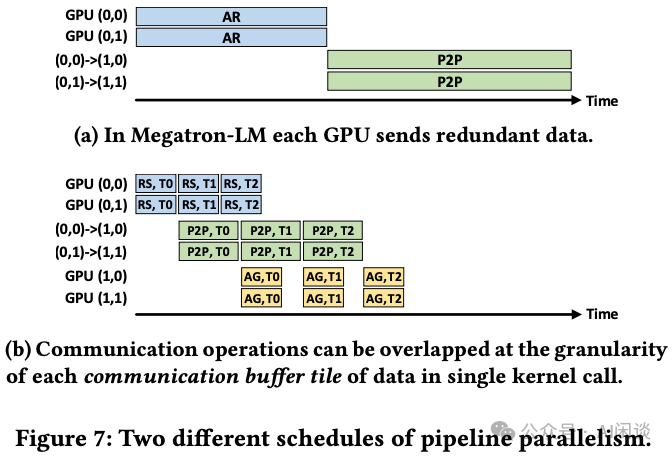
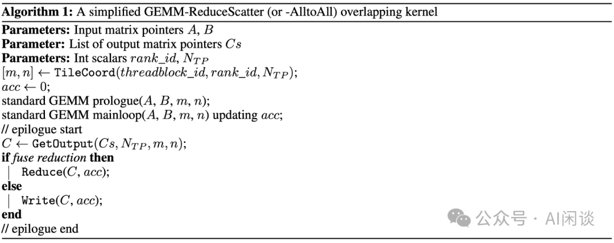
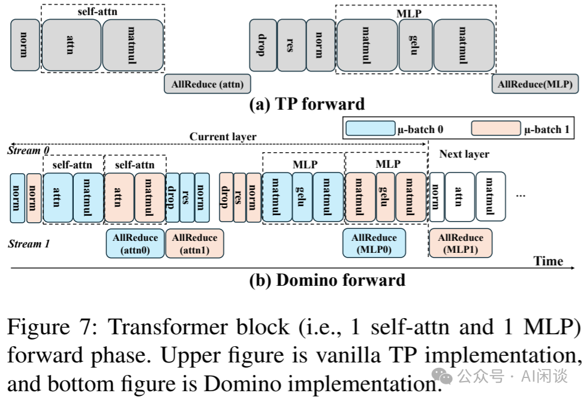
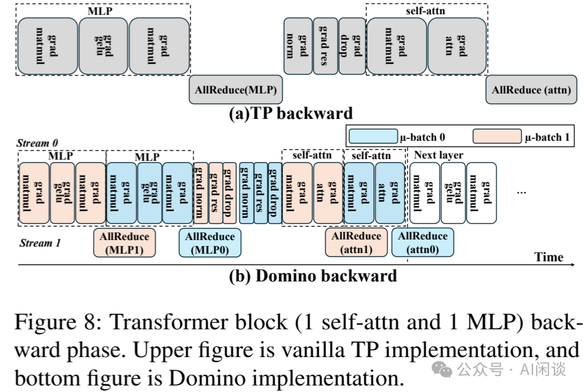

# 万字综述 LLM 训练中的 Overlap 优化：字节 Flux 等 7 种方案

**作者：** AI闲谈

---

一、背景

在大规模分布式训练场景中，计算和通信的重叠（Overlap）一直是一个关键的研究热点。随着硬件性能的提升，计算能力和通信带宽之间的差距日益显著。如下图所示，硬件算力每 2 年大约扩大 3x，而通信带宽每 2 年只提升 1.4x，这种差距带来的影响在大规模训练任务中愈加明显。例如，在使用 H100 和 A100 集群进行 LLM 训练时，H100 的通信开销占比通常会高于 A100。这种情况下，通信可能成为了系统性能的瓶颈，因此，如何在计算和通信之间实现高效的 Overlap，已成为优化分布式训练性能的关键策略之一。

实际上，大部分计算和通信的 Overlap 可以理解为生产者和消费者的 Overlap，生产者可以是计算也可以是通信，生产者与消费者可以是短程依赖也可以是长程依赖，通常短程依赖带来的挑战更大，而长程依赖则较容易实现 Overlap。比如：

- 张量并行（Tensor Parallelism，TP）中的 MatMul 计算与 AllReduce 通信就是一个明显的短程依赖，AllReduce 通信依赖 MatMul 的计算，并且 AllReduce 通信又会阻塞后续的计算操作。
- Deepspeed Zero 的模型切分通信与计算可以看作是一种长程依赖。在这种情况下，只要保证 Layer N 计算之前拿到权重即可，完全可以提前获取权重，避免等到实际开始计算时再进行通信。通过这种方式，通信可以在更早的阶段与之前的计算操作进行重叠，从而更高效地利用计算和通信资源。

本文中我们简单介绍一系列针对大规模训练场景的计算与通信 Overlap 来优化训练性能的工作，包括 Microsoft 的 CoCoNet、Domino，Google 的 Intra-layer Overlapping via Kernel Fusion，AMD 的 T3，北大的 Centauri，字节的 Flux 以及中科大的 DHelix 等。

训练相关可以参考我们之前的文章：

- [大规模分布式 AI 模型训练系列——数据并行](http://mp.weixin.qq.com/s?__biz=Mzk0ODU3MjcxNA==&mid=2247487775&idx=1&sn=52981f832c8ad7c9b111e37c0e788c3a&chksm=c364d65af4135f4cc999fd39659936f42bedc7faebeb2e2a674d5feb064bf50b68a6d412b89b&scene=21#wechat_redirect)
- [大规模分布式 AI 模型训练系列——张量并行](http://mp.weixin.qq.com/s?__biz=Mzk0ODU3MjcxNA==&mid=2247487815&idx=1&sn=69601e66f3f8413b5afbd8149b989ea7&chksm=c364d602f4135f1495f0c5e52bf911b26b528bd85f2ad1d2a97d93a358592676223bb9950ee1&scene=21#wechat_redirect)
- [大规模分布式 AI 模型训练系列——流水线并行](http://mp.weixin.qq.com/s?__biz=Mzk0ODU3MjcxNA==&mid=2247487851&idx=1&sn=7e18c1e0196193157081c4954c97c1af&chksm=c364d62ef4135f386b1f93bc1cd530116cd36a9002ab2f568373a978c6573f2b57661b2e21f3&scene=21#wechat_redirect)
- [大规模分布式 AI 模型训练系列——专家并行](http://mp.weixin.qq.com/s?__biz=Mzk0ODU3MjcxNA==&mid=2247487895&idx=1&sn=e2133a3052722c7c4e1d18f3053a6600&chksm=c364d6d2f4135fc49e3d380b0201678cadd3b741ce056baed4b7555d009c5a1dd36df1fea99d&scene=21#wechat_redirect)
-  [大规模分布式 AI 模型训练系列——序列并行](http://mp.weixin.qq.com/s?__biz=Mzk0ODU3MjcxNA==&mid=2247487939&idx=1&sn=1fe262d9316c6c09e9a267b683cd0b89&chksm=c364d686f4135f902e20e5d3b861f808d86ef77df158ccb3779573e469e3726b4c067fc54401&scene=21#wechat_redirect)
- [超长序列 LLM 训练：DeepSpeed Zero & Ulysses & FPDT](https://mp.weixin.qq.com/s?__biz=Mzk0ODU3MjcxNA==&mid=2247487955&idx=1&sn=b83846e3f008b7483c62cb16443712ae&scene=21#wechat_redirect)
- [DHelix：跨 Micro-Batch 的通信隐藏，SOTA LLM 训练性能](https://mp.weixin.qq.com/s?__biz=Mzk0ODU3MjcxNA==&mid=2247488536&idx=1&sn=c9cc118771f81d105e53a073ca2e28f4&scene=21#wechat_redirect)
- [万字综述：全面梳理 FP8 训练和推理技术](https://mp.weixin.qq.com/s?__biz=Mzk0ODU3MjcxNA==&mid=2247487327&idx=1&sn=784f76c54183fd46dd7300ab7b28cfcb&scene=21#wechat_redirect)

## 二、引言

### 2.1 AllReduce

AllReduce 是集合通信中常见的分布式计算操作，用于多个设备（比如多个 GPU）之间聚合数据的场景，可以包含 Sum、Min、Max 等操作。

对于常见的基于 Ring 的 AllReduce 实现中，通常可以把 AllReduce 操作看成为一个 ReduceScatter 和一个 AllGather 操作，如下图所示：

具体的 ReduceScatter 操作如下，每个设备（GPU）发送一部分数据给下一个设备，同时接收上一个设备的数据并累加。这个过程进行 K-1 步（假设有 K 个设备），ReduceScatter 后每个设备都包含一部分数据的 Sum：

具体的 AllGather 操作如下，每个设备将其持有的部分结果发送给下一个设备，同时接收上一个设备的部分结果，逐步汇集完整的结果，同样需要 K-1 步。AllGather 后，每个设备都包含全量的数据：

### 2.2 LLM Tensor Parallelism AllReduce

当前 LLM 推理通常会采用 Tensor Parallelism（TP）模型并行，以便在多个 GPU 上实现较大 LLM 的推理。对于标准的 Transformer Decoder Only 模型，通常会在每个 Transformer Block 中采用如下的 TP 切分方式：

如下图 （a）所示，MLP 层的两个 Linear 层采用先列切（A，Column Parallelism），然后行切（B，Row Parallelism）的方案，这样两个 Linear 之间不用通信：

如下图（b）所示，由于每个 Head 的 Attention，Softmax 都可以独立计算，因此可以按照 Head 的方式切分（等价于列切分），然后对之后的 Linear 采用行切分（B），这样 Self-Attention 中间也不用通信：

如上所述，采用先列切、再行切的方式，每个 Transformer Block 中都需要两个 AllReduce 操作，对于一个 40 层的模型则需要至少 80 个 AllReduce 操作。

### 2.3 ReduceScatter = All2All + Local Reduce

如下图所示为 Ring ReduceScatter 的优化，可以等效为一个 All2All 操作实现数据的重排，然后在 Local 进行 Reduce 操作。此过程只有一个 All2All 的整体通信操作，虽然实际上与 Ring 实现的方式的通信量和计算量没有变化，但可以避免 K-1 个 Ring Step 的同步，进而可以有效降低时延。

### 2.4 ZeroBubble

[2401.10241] Zero Bubble Pipeline Parallelism [1] 中作者提出 Zero Bubble，核心思路是将 Backward 分为两个部分，一部分计算输入的梯度，另一部分计算参数的梯度，如下图 Figure 1 所示。这里计算输入的梯度有明确的依赖关系，也是链式法则不断传递的基础；而计算权重的梯度却没有明确的依赖，甚至可以滞后很多。此外，三个红色部分计算量相当，这也就是为什么常见的流水线并行（Pipeline Parallelism，PP）中 Backward 的长度为 Forward 的 2 倍。

## 三、Microsoft - CoCoNet

### 3.1 摘要

对应的 Paper 为：[ASPLOS 22] [2105.05720] Breaking the Computation and Communication Abstraction Barrier in Distributed Machine Learning Workloads [2]

CoCoNet 可能是最早提出异步张量并行（Async Tensor Parallelism）的工作，作者提供了一种通用 Kernel 融合的范式，能够自动生成集合通信与常见计算操作（如 GEMM 和卷积）之间的融合 Kernel。具体来说，CoCoNet 包含：

- 一种领域特定语言（DSL），用于以计算和通信操作的形式表示分布式机器学习程序。
- 一组保持语义的转换规则，以优化程序。
- 一个编译器，可以生成联合优化通信和计算的 GPU Kernel。

PS：然而，生成的代码执行效率不及直接采用 cuBlas、cutlass 或 cuDNN 中的高度优化 Kernel，主要原因在于为实现这种细粒度计算-通信 Overlap 需要在 Kernel 内引入额外同步操作。

### 3.2 方法

如下图 Figure 2 所示为 CoCoNet 的工作流：

- 首先，使用 DSL 表示用户的机器学习算法，该语言同时包含计算（如矩阵乘和卷积）与通信操作（如 AllReduce）。
- 然后，Autotuner 应用一系列变换以优化程序，同时确保算法逻辑保持不变。例如，将 AllReduce 与 Dropout 融合为 FusedAllReduce，并使其与矩阵乘法 Overlap。
- 最后，生成对应的通信与计算代码，并且可以通过 PyTorch 执行。

CoCoNet 提供了 4 种能够保持语义的转换方案，用于优化以 DSL 表示的程序。以下图 Figure 3 的代码为例，其主要是实现了 ：矩阵乘法 + AllReduce + Dropout + Add。

具体的几个转换过程如下：

1. AllReduce 拆分为 ReduceScatter（RS）和 AllGather（AG）
2. 操作重排并拆分为等价算子（如下图 Figure 5）：
3. scD 和 scOut 均为 Slice 切片操作。
4. agOut 用于收集计算的最终结果。
5. 算子融合：
6. FushedAllReduce（FusedAR）：融合了 ReduceScatter（rsSum）、计算操作（scD 和 ScOut），以及 AllGather（agOut）。
7. fusedAR.comp(scOut) 则指定了需要与 FusedAllReduce 融合的计算，返回的 out 则是输出结果。
8. Overlap：对一系列生产者-消费者操作，可以执行 Overlap 变换。比如有多个数据要执行上述操作（不同样本，数据的不同 Chunk），则可以实现通信与计算的 Overlap。

CoCoNet 提供了 AutoTunner，能够自动探索程序的所有调度方案的空间，并针对特定底层框架和输入规模，返回性能最佳的调度方案。

以下图 Figure 7 所示为将其应用到 Megatron-LM 中的 TP+PP 的优化案例，具体来说，总共 4 个 GPU，分成两个 PP Stage，每个 Stage 有 2 个 GPU，使用 TP 切分。比如下图 GPU(0, 1) 表示 PP Stage 0 的 1 号 GPU。

- (a)：两个 PP Stage 之间会有一个 PP Stage 0 内部的 AllReduce 操作，以及一个 PP Stage 0 与 Stage 1 之间的 P2P 操作。
- (b)：将数据拆分为多个 Chunk，并使用 ReduceScatter + AllGather 代替 AllReduce，即可实现一定的 Overlap，并减少冗余数据传输。

### 3.3 结果

如下图 Figure 1 所示，MatMul 与 AllReduce 的细粒度 Overlap 执行可掩盖 80% 的 MatMul 执行时间，并带来 1.36x 的加速效果。

## 四、Google - Intra-layer Overlapping via Kernel Fusion

### 4.1 摘要

对应的论文为：[ASPLOS 23] Overlap Communication with Dependent Computation via Decomposition in Large Deep Learning Models [3]

在大规模深度学习模型训练中，层内模型并行化产生的通信开销可能占据整体训练时间的显著部分，而层内模型并行化又对支持大型深度学习模型至关重要。因此作者提出了一种新颖计算，通过计算与通信的 Overlap 来有效降低通信开销。

该技术将识别出的原始集合通信与依赖的计算操作分解为一系列更细粒度的操作，通过创造更多 Overlap 机会并并行执行新生成的细粒度通信与计算操作，可以有效隐藏数据传输时延，实现更优的系统利用率。

在 TPU v4 Pod 上评估不同规模的大模型（10B - 1T 参数量），所提方案可以实现 1.14x 到 1.38x 的吞吐提升。在 1024 TPU 集群中，500B 参数量语言模型训练可以实现 72% 的峰值 FLOPs 利用率。

### 4.2 方法

#### 4.2.1 背景

如下图 Figure 1 所示，不同规模模型在 128-2048 TPU 上训练，通信开销可达 22%-42%：

#### 4.2.2 方案概览

如下图 Figure 4 展示了 AllGather 场景中的执行流程。假设数据 A（比如模型权重） 在初始阶段已被切分，每个设备各持有 A 的一个分片，A0 位于设备 0，A1 位于设备 1。

- 现有系统中：两个设备均需要通过 AllGather 操作得到完整的数据 A，即 [A0, A1]，然后开始相应的计算。
- 所提系统中：并不用等待全部数据准备就绪再启动计算。
- 每个设备异步发送存储在当前设备的数据到其他设备（比如设备 1 异步发送 A1 到设备 0），同时利用已有数据开始启动计算，这样设备即在计算，也在通信。
- 当之前结果计算完成，并且从其他设备接收完成（比如设备 1 的 [A1, B1] 已经计算完，并且已经接收完 A0），开始启动新数据的计算（比如设备 1 上的 [A0, B1]）。
- 为了得到最终结果，每个部分结果需要额外执行一次 Dynamic Updata Slice 操作。
- 通过执行多次上述操作可以获得最终结果，确切的步骤次数取决于 A 的切片数。

同样地，ReduceScatter 操作可与相应的计算过程 Overlap 执行，如下图 Figure 5 所示。在此例中，C0（C00 与 C01 之和）及 C1（C10 与 C11 之和）分别为 C 在设备 0 和 设备 1 上进行 ReduceScatter 后的操作分片。由于基于计算结果进行通信传输，在此情形下，各设备需要异步传输累加结果分片而非操作数，累加结果分片在各设备上初始化为 0：

- 每轮迭代开始时，各设备异步发送累加结果分片到另一个设备（例如，首轮迭代中设备 0 发送切片 C0 到设备 C1），并与此同时启动部分 Einsum 计算。
- 计算完成后，部分结果在迭代末尾被加到接收的累加结果分片，比如首轮迭代的结果 C10 与从设备 1 接收的结果分片 C1。

Kernel Fusion 是一种有效减少慢速主内存访问和 Kernel 启动开销的方案，作为最重要的优化手段之一，Kernel Fusion 在 XLA 中通过启发式方法自动执行。因此，针对本文的方案作者也会进一步应用 Kernel Fusion。然而，基于默认启发式构建的某些融合操作可能损害 Overlap 性能。如下图 Figure 11 所示，11a 展示了一个简化的图结构，为默认的融合策略，其中的灰色方框为融合节点，白色方框表示一个或多个融合的高阶算子指令。其中两个 Einsum，Einsum_1 有一个异步的 CollectivePermuteDone 输入，由于 Einsum_0 与 CollectivePermuteDone 相互独立，预期其能与异步数据通信并行执行，以实现 Overlap。然而，与 Einsum_0 融合的加法操作在 Fusion_0 与 CollectivePermuteDone 之间引入了数据依赖，导致第三个节点顺序执行。为了避免这种不良融合，启发式策略调整为先将 Add 操作与具有异步 CollectivePermuteDone 操作的 Einsum 进行融合，新生成的图结构如图 11b 所示，数据通信得以成功与 Fusion_0 Overlap。

### 4.3 结果

如下图 Figure 12 所示为不同模型优化前后可以达到的峰值 TFLOPS，可以看出，优化后有比较明显的提升：

## 五、AMD - T3

### 5.1 摘要

对应的论文为：[2401.16677] T3: Transparent Tracking & Triggering for Fine-grained Overlap of Compute & Collectives [4]

LLM 在训练与推理过程中，尽管某些分布式技术能够通过计算与通信 Overlap 来隐藏通信开销，但诸如 TP 等技术，其通信与模型执行本质上具有序列化特性。为隐藏这种序列化通信，常见做法是以细粒度方式将其数据生成操作交错进行。然而，在软件层面实现通信与计算的细粒度交错颇为复杂，此外，并发执行通常都要求计算与通信共享计算和存储资源，导致资源竞争，从而削弱 Overlap 的效能。

为应对这些挑战，作者提出 T3 方案，通过硬件与软件协同设计，透明地 Overlap 序列化通信，同时最小化与计算的资源竞争。

- 在软件层面，T3 通过简单配置生产者的输出地址空间，透明地将生产操作与后续通信融合，仅需少量软件改动。
- 在硬件层面，T3 引入轻量级的追踪与触发机制，以协调生产者的计算与通信。同时，利用计算增强型内存处理通信伴随的计算任务。由此，T3 减少了资源竞争，并高效地实现了序列化通信与计算的 Overlap。

对于 T-NLG 等重要 Transformer 模型，T3 使通信密集型子层的平均加速比可以达到 30%（最高47%），平均减少 22% 的传输量（最高 36%）。此外，随着模型规模的扩大，T3 的优势依然显著：在约 500B 参数的 PALM 和 MT-NLG 模型中，子层的平均加速比为 29%。

PS：T3 依赖于特定的硬件特性，如计算增强型存储器（NMC），这可能需要新的硬件支持或者对现有硬件的修改，这也许是其落地应用的最大挑战。

### 5.2 方法

#### 5.2.1 背景

如下图 Figure 2 所示，Transformer 模型通常会采用 TP 来切分模型，以便能训练更大规模模型。然而，这一过程要求在层与层之间执行 AllReduce 操作。其中 Figure 2b 为未切分的操作，而 Figure 2c 为切分后跨两个设备的操作。在 2b 中，每个设备仅持有部分权重。连续两个矩阵乘可以先按列切，再按行切，之后通过一个 AllReduce 操作获取完整结果。

而这些串行的 AllReduce 操作可能成为性能瓶颈。如下图 Figure 4 展示了多种常见 Transformer 模型中使用 TP 后各操作的执行时间占比。可以看出，其 AllReduce（ReduceScatter + AllGather）的通信占比甚至比 GEMM 还长，比如 Megatron-GPT2 和 T-NLG 在训练与推理（Prefill）中，通信时间分别高达 34% 和 43%。而且往往算力增长比网络带宽增长更快，这也会进一步加大通信的占比。

#### 5.2.2 对比

在 T3 中，作者也提到上述 Microsoft - CoCoNet 和 Google Intra-layer Overlapping via Kernel Fusion 两篇论文：

- Microsoft：需要昂贵的细粒度同步机制。
- Google：需要对矩阵乘法 Kernel 进行改动，并且可能对 GPU 软件基础设施造成干扰。
- 此外，上述两个工作中计算与通信的 Overlap 会竞争计算与内存带宽，从而削弱 Overlap 的实际效果。

#### 5.2.3 方案概览

现代 GPU 首先执行生产者 GEMM 并将结果存储于本地内存中。随后，启动集合通信操作。相比之下，T3 系统在 GEMM 生成数据的同时立即启动集合通信操作，以实现细粒度的 Overlap 执行。如下图 Figure 1 所示：

- T3 采用追踪与触发机制监控 GEMM 与集合通信操作的进展，并协调通信流程，无需额外计算单元（CU）参与。
- 此外，T3 利用近内存计算（Near Memory Computing, NMC）进行 Reduce 操作，以减少因通信产生的内存访问。
- 最终，这些优化可以在几乎不修改 Kernel 代码的情况下透明地实现。

如下图 Figure 7 展示了 4 个 GPU 下，ReduceScatter（RS） 操作与 GEMM 的 Overlap 执行情况。该 GEMM 根据输入数据和 Kernel 实现分为多个工作组（WG）阶段执行，而 RS 则依据参与设备数量分为多个 Step 进行。为了简化图示，图中 GEMM 阶段数比所需的 Ring Step 数多 1。在每一个 Step 中，GEMM 某一阶段的执行和其输出的 Reduce 与前一 Step 输出的通信并行进行。在第一个 Step 中，GEMM 直接将输出传输到远程设备（remote_update）。后续的稳态 Step 则需通过 DMA（dma_update）完成。对于 N 台设备，稳态 Step 需执行 N-2 次，以处理不同的数据块。

以稳态下的 GPU 0 为例，对于其在 Step 2 的操作，如下图 Figure 7 所示，GPU 0 在执行并生成GEMM Stage 3 输出的同时，通过 DMA 接收来自邻近设备 GPU 1 的 Stage 3 输出副本（蓝色）。这一过程与 GPU 0 将 GEMM 第二阶段数据（黄色）Reduce 副本通过 DMA 传输至 GPU 3 的操作并行进行，从而实现了通信重叠。在 local_update 和 dma_update 中，T3 利用近内存计算（NMC）进行原子内存位置更新。为生成 Stage 3 数据块的部分 Reduce 副本，无需额外读取或占用 GPU 计算单元。一旦操作完成，GPU 0 即启动对数据块的 dma_update，将其传输到临近设备 GPU 3 的内存中，如下图的 Step 3 所示。

#### 5.2.4 硬件设计

通过一款轻量级且可编程的硬件追踪单一，可以实现上述自动更新追踪及 DMA 触发机制，从而进一步降低对 GPU 计算单元（CU）的依赖。远程/DMA 更新操作则通过配置 GEMM 输出地址映射，辅以微小的应用程序和 Kernel 修改，得以透明执行。

为了提升 T3 的性能，作者还对运行时和硬件进行了细微调整。为实现如图 Figure 7 中 GEMM 与 RS 的完美 Overlap，作者还对跨 GPU 的 GEMM 工作组调度进行了错位安排。此外，还通过引入一种简单而有效的内存控制仲裁（Memory Controller Arbitration，MCA）策略来增强内存系统，以管理计算与通信之间的内存竞争问题。

如下图 Figure 8 展示了搭载 T3 增强功能（以橙色标注）的 GPU 执行上述稳态步骤的情况。GPU 执行 GEMM 运算，为某一 Stage 生成 local 更新（L1）。同时，GPU 接收针对同一 Stage 的 DMA 更新（D1a），并向上一阶段发送 DMA 更新（D1b）。在内存控制器处，经过改进的MCA 策略对 local 与 DMA 流量进行仲裁，以避免争用。随后，更新数据被传输至经过 NMC 增强的 DRAM（L2a，D2a），同时 Tracker 记录其进度（L2b，D2b）。一旦 Tracker 检测到内存区域所需的 local 和 DMA 更新，便会触发这些更新通过 DMA 传输至相邻 GPU（L3）。

### 5.3 结果

由于需要新的硬件支持，因此作者只是使用 Accel-Sim 来模拟评估 T3 的性能，当然，作者也对 Accel-Sim 进行了扩展，以支持多 GPU 系统。

如下图 Figure 16 所示，作者通过模拟评估了本文方案的加速比，可以看出，其能够获得 15%-50% 不等的加速：

## 六、北大 Centauri

### 6.1 摘要

对应的论文为：[ASPLOS 24.04] Centauri: Enabling Efficient Scheduling for Communication-Computation Overlap in Large Model Training via Communication Partitioning [5]

高效训练 LLMs 要求采用混合并行方法，这其中克服通信瓶颈至关重要，通常通过通信与计算的 Overlap 来实现。然而，现有 Overlap 方法多侧重于细粒度 Kernel 融合或有限的算子（OP）调度，限制了异构训练环境下的性能。

本文作者提出 Centauri 框架，其构建了一个由三个固有抽象维度组成的切分空间：原语替换、拓扑感知组切分及工作负载切分。这些维度共同构成了一个全面的优化空间，用于高效 Overlap。为确定通信与计算的高效 Overlap，作者将混合并行训练中的调度任务分解为 OP、Layer 和模型三个层次。通过这些技术，Centauri 有效 Overlap 了通信时延，提升了硬件利用率。评估结果表明，在各种并行训练配置下，Centauri 相较于主流方法可实现高达 1.49x 的加速。

### 6.2 方法

#### 6.2.1 方案对比

以前的工作在 Overlap 通信和计算时存在一些不足，有些框架专注于优化单一并行策略的调度，未能有效应对混合并行方法中的复杂 Overlap 挑战。值得注意的是，即便在 Forward 和 Backward 过程中，最优的 Overlap 模式也可能存在差异。

- 如下图 Figure 1a 所示，其依赖粗粒度方式进行 Graph 级别的 Overlap，可能未能充分利用 GPU 硬件资源。
- 如下图 Figure 1b 所示，有些工作依赖复杂的编译器相关工作来对集合通信及邻近计算进行切分，并在算子层面生成融合 Kernel（比如上述的 Microsoft CoCoNet）。然而，细粒度的 Kernel 融合可能忽视了更广泛的 Graph 级别的调度计算（上述 Microsoft - CoCoNet 和 Google Intra-layer Overlapping via Kernel）。比如，1b 中的 Matmul B 反而比 1a 中的 Matmul B 慢。
- 如下图 Figure 1c 所示，本文方案可以系统且全面地发掘 Overlap 空间的全部潜力，通过合理切分通信操作，能够充分扩展通信 Overlap 的优化空间。

#### 6.2.2 方案概览

如下图 Figure 3 所示，Centauri 的工作流程包含两个核心环节：通信切分与层次调度。以 DP 与 FSDP 混合并行训练为例：

- 通信切分：通过考量三个基本维度，生成潜在切分空间，并为每种集合通信选择高效策略。
- 层次调度：在上述全面但较大的切分空间下，优化整图的 Overlap 调度成为一项复杂的任务，为了简化复杂的调度任务，作者将复杂的混合并行集合通信分解为三个层次，每个集合通信被分配至特定调度层级。各层级选取开销较低的切分与调度方案，旨在实现整体优化 Overlap 方案。

1. 原语替换：将 AllReduce 拆分为 Reduce-Scatter 和 AllGather。

2. 组切分：Forward 阶段中的 AllGather 被切分为节点间组和节点内组通信。具体来说，集合通信在 Rank Group G 内进行，该 Group G 可以进一步细分为若干 Sub Group {𝐺₁, 𝐺₂, 𝐺₃, ...}，以实现更细粒度的通信。在组切分时，应充分考虑网络拓扑结构，比如 FSDP 或 DP 等并行方法通常涉及跨节点的集合通信，导致设备连接的异质性。在带宽不均衡的子组中，低带宽链路上的瓶颈可能抵消高带宽链路的性能优势，此外，组切分应充分利用本地连接的高带宽（比如 NVLink+NVSwitch），并尽量限制跨节点通信量。

3. 任务切分：以适当粒度切分集合通信与计算任务。在给定的原始通信与组切分方案下，若通信触发的工作负载切分与其依赖的计算链之间的 Overlap 不足，则需要进一步切分计算链路。比如，FSDP 训练中，AllGather 可与随后的 MatMul 及 GeLU 和 Dropout Overlap 执行。整个计算链路的工作负载切分是各 OP 切分方案的综合结果。依赖计算链中各 OP 的切分策略会产生多种切分维度的组合，选择兼容的可行切分组合至关重要。例如，沿 Batch 维度切分的 MatMul 输出与随后沿隐藏层维度切分的逐元素加法 OP 不兼容。

如下图 Figure 4 展示了通信切分的流程抽象，在混合训练中的每一个通信都会生成一个树形结构的切分空间，树中的每个叶节点都代表一种可行的切分方案。所选的方案旨在实现最小的调度成本，所有节点上的分区策略构成了一个庞大的切分方案森林，适用于混合训练任务。

4. OP 级调度：OP 级别的细粒度调度旨在有效地 Overlap 每个 Forward Transformer Layer 内的通信和计算操作，实现两个拆分后的集合通信和计算 OP 之间的 Overlap。这个优化保证了每个 通信的 Overlap 策略是按顺序决定的，从而以贪婪的方式提高整个 Layer 的效率。

对于每个集合通信，基于各种切分模式的不同调度方案会导致不同的整体性能。

- 过于精细的工作负载切分可能会导致通信和计算几乎完全 Overlap，但由于多个小型 GPU Kernel 启动和数据移动开销，它可能会对整体性能产生负面影响，如下图 Figure 5b 所示。因此，粒度较大的策略更可取。
- 对于组切分，带宽感知调度以及节点间和节点内通信的恰当顺序至关重要，如下图 Figure 5c 和 5d 的比较所示，适当交错节点内和节点间调度方案，在下图 Figure 5e 中取得了最大的性能改进。因此，以适当的切分粒度正确交错执行节点内和节点间通信至关重要。

5. Layer 级调度：根据 Layer 内关键路径调整执行顺序。

与 Forward 阶段不同，Forward 阶段的高效 Overlap 依赖于切分策略，而 Backward 则具备天然的调度空间。Backward 包含两个独立部分：激活梯度计算与权重梯度计算。

- 如下图 Figure 6a 和 6b，传统方法中，激活计算的输出作为前一 OP Backward 的输入，激活计算往往会赋予更高的调度优先级。然而，在混合并行配置中，这两部分的不同执行优先级会导致不同的时延。
- 如下图 Figure 6c，作者区分了激活梯度计算与权重梯度计算的两条关键路径，在同一个 Layer 内，通过不同调度优先级带来的成本来选择相应的最优策略。（这一部分也可以参考之前我们介绍过的 Zero Bubble）

6. 模型级调度：模型级别的 Overlap 旨在隐藏梯度和权重在 Forward 和 Backward 阶段中的通信过程，提升整体训练效率。

- 在单一数据并行（DP）场景中，所有 AllGather 操作与 Forward 阶段 Overlap 进行，按块粒度方式的 ReduceScatter 操作则与 Backward 阶段 Overlap。
- 在 DP + PP 中，细粒度的流水线调度策略旨在减少流水线 Bubble，这些 Bubble 影响计算与通信的 Overlap 效果。

通常，Micro-Batch 的模型 Chunk 的计算开销小于相关的梯度或权重通信开销。启动多个相同模型 Chunk 的 Micro-Batch 能够释放 Overlap 的潜力，但激活内存消耗也会随着同时启动的 Micro-Batch 数量增加而增长。内存与时间成本是影响 PP 调度方案设计的两大因素。

- 如下图 Figure 7a 所示，Forward、Backward 和 Weight Update 各阶段依次执行，每个设备包含 2 个 PP Stage，每个 Batch 16 个 Micro-Batch，PP 深度为 4。
- 如下图 Figure 7b 所示，为节省内存消耗，深度优先调度选择最小数量的 Micro Batch 同时启动，数量等于流水线阶段深度，它忽略了为提升 End2End 性能而进行的 Overlap 潜力。
- 如下图 Figure 7c 所示，广度优先调度则走向另一个极端，即启动每个 Batch 中所有大小为 𝑚𝑏 的 Micro-Batch 以实现 Overlap（16 个 Micro-Batch 同时启动），但伴随而来的是峰值内存消耗的显著增加。这种权衡体现在内存最小化调度与 Overlap 最大化调度之间。
- 如下图 Figure 7d 所示，AllReduce 拆分为 ReduceScatter 和 AllGather，通过优化选择最优策略，同时启动 8 个 Micro-Batch，内存消耗适中，8 倍激活量。

### 6.3 结果

如下图 Figure 13 和 Figure 14 所示，作者在两种不同的网络环境中验证了 Centauri 的可扩展性。

- 集群 A 代表带宽受限环境，Centauri 显著提升了 FSDP/Zero3 配置对应的吞吐量。并且所达到的吞吐量水平与高性能环境（集群 B）的表现相当，突出了 Centauri 对带宽变化的不敏感性。
- 尽管在集群 B 中性能提升的潜力有限，但仍能在 256 个 GPU 上将吞吐量提高 5%。
- 在 FSDP + DP 配置中，初始阶段，由于 DP 通信开销的增加，所有 6 种配置的吞吐量均有所下降，然而，Centauri 始终能保持更高的加速比。

## 七、字节 Flux

### 7.1 摘要

对应的论文为：[2406.06858] FLUX: Fast Software-based Communication Overlap On GPUs Through Kernel Fusion [6]

对应的开源代码为：GitHub - bytedance/flux: A fast communication-overlapping library for tensor parallelism on GPUs. [11]

大型模型通常需要分布式训练和推理，TP 是其中一种常见的技术，通过在多个设备间划分算子或层的计算，以克服单个处理器内存容量的限制，并/或加速计算以满足时延要求。然而，TP 引入了额外的通信开销，可能占据整体运行时间的重要部分，从而限制了在高速互连设备（如节点内配备 NVLink 的 GPU）中的可扩展性。

本文作者提出的 Flux 旨在通过依赖计算隐藏 GPU 间的通信延迟。Flux 将通信和计算操作分解为更细粒度的操作，并进一步融合成更大的 Kernel，从而在不损害 Kernel 效率的前提下有效隐藏通信。在融合 Kernel 的情况下，Flux 有望重叠高达 96% 的通信时间。

总体而言，在包含 128 个 GPU（涵盖不同代际及互连技术）的集群上，Flux 相较于 Megatron-LM 在训练中可实现 1.24x 的加速；而在包含 8 个 GPU 的集群上，Flux 在推理的 Prefill 和 Decoding 阶段分别比 vLLM 快 1.66x 和1.30x。

### 7.2 方法

#### 7.2.1 背景

如下图所示，作者统计了不同训练任务、推理任务在不同 GPU 上的 TP 通信时延，可以看出，在 PCIe 设备中通信占比很高；而 H800 NVL 相比 A100 NVL 的算力提升更多，通信带宽提升较少，也就导致通信占比更高。在 PCIe 设备中 TP 通信占比甚至达到 40%-60%。

#### 7.2.2 ReduceScatter Overlap

在 Flux 中，同样是将 ReduceScatter 与 GEMM 进行 Overlap 和 Kernel 融合。ReduceScatter 操作可以分解为一个 AlltoAll 操作和一个 local 的 Reduce 操作。这里只有 AlltoAll 需要设备间通信，因此，将 All2All 融合到 GEMM 的尾部通常足以 Overlap 通信。

该算法要求 GPU 之间支持 P2P 通信，现代 NVIDIA GPU 无论是 NVLink 互联还是 PCIe 互联，在节点内都已具备此能力，而 NVSHMEM（NVSHMEM | NVIDIA Developer [7]）进一步扩展了 NVIDSIA GPU 在节点间的 P2P 通信。

如下图 Algorithm 1 所示为具体的算法：

#### 7.2.3 AllGather Overlap

与 ReduceScatter 不同，AllGather 的实现采用首部融合方式，直接嵌入 GEMM Kernel 中。具体而言，AllGather 的信号检查功能被融合至 GEMM 内核的前序阶段。如下图 Algorithm 2 展示了融合 AllGather 后的 GEMM 伪代码，用于计算 C = Aagg × B，其中 Aagg 是通过 AllGather 聚合的输入矩阵 A 的缓冲区，B 为另一输入矩阵，C 为输出矩阵。

在 Kernel 端，GEMM 分块计算被函数 WaitSignal 阻塞，直至信号值被设置为真。此处，信号由GetSignal 依据输出坐标（m 和 n）以及 TP 中的设备数量（NTP）从信号集合（signal_list）中选取。每个通信信号仅在主机端当对应输入 Tensor 的部分（通信分块）准备就绪时才被设置为真，即该部分已在运行融合 Kernel 的设备上接收完毕后。

如下图 Algorithm 3 展示了主机端相应的通信过程：主机端（无论是基于 pull 还是 push）执行分块通信操作（DataTransfer），并异步地将相应信号（SetSignal）设置为真。

- 基于 pull 的方法通过 GetRemotePtr 函数和 GetLocalPtr 函数从远程设备 pulling 分块，从分块 A 矩阵列表（A_list）和聚合矩阵缓冲区列表（Aagg_list）中选择正确的指针，然后设置本地信号。信号由 GetSignalHost 依据通信分块索引从信号集合（signal_list）中选取。
- 基于 push 的方法则将分块推送至远程设备，随后设置远程信号。
- 需注意的是，在 pull 模式下，signal_list 仅包含本地信号，而在 push 模式下，signal_list 包含远程设备的信号。这两种变体的选择被视为一个调优参数。

值得一提的是，在 AllGather 方法中，作者将通信的等待逻辑融合到 GEMM Kernel 中，而非整个通信操作。因此，AllGather 并不必然依赖 P2P 通信。同时，在 AllGather 中，通信的分块策略（tilescomm）与 GEMM 计算的分块策略相互解耦。这一设计提供了一种灵活的权衡方式，能够在不损害 GEMM 效率的前提下，选择 Overlap 机会与通信效率之间的最佳平衡。

#### 7.2.4 方案对比

如下图 Figure 5 展示了 ReduceScatter 中 Overlap 之间的主要差异。现有 Overlap 方案 Tm 理论上可能比原始方法 Tc 执行得更快，但通常情况下，Tm 仍慢于原始 GEMM 操作时间 Tg。主要原因在于，将一个 GEMM Kernel 拆分为一系列较小的 GEMM Kernel 会降低 GPU GEMM 的执行效率。GEMM 通常需要合理大小的矩阵才能充分利用 GPU 的计算能力。这些具有数据依赖性的小型 GEMM 操作序列进一步阻碍了 GEMM Kernel 通过 GPU 多路复用技术并行运行，因此，Tensor 并行度越高，GPU 上的 GEMM 效率越低。

相比之下，作者提出的技术不存在上述限制。作者的 Overlap 方案 Tf 能够在极小开销下实现与原始 GEMM 操作 Tg 相当的性能。其细粒度分解策略完美契合现代 GPU 设计特性，即通过上下文切换的 Warp 和数百个在 SM 间并发活跃的 Warp 来隐藏延迟，如下图 Figure 5 底部所示。最终，作者的方法在不影响 GEMM 计算效率的前提下，仅在执行末尾引入少量通信开销。

如下图 Figure 6 展示了 AllGather 中的各种 Overlap 技术间的关键差异。现有 Overlap 技术 Tm 虽较原始粗粒度方法 Tc 有所提速，但因 GPU GEMM 效率降低，仍逊于原始 GEMM 操作时间 Tg。而作者的 Overlap 技术 Tf 则能实现与原始 GEMM 操作 Tg 相媲美的性能。

AllGather 中长时延指令源于等待信号，此现象始于每个 Warp 的开端，因 WaitSignal 在起始阶段已融合，其时延取决于相应数据传输的到达时间。对于数据已抵达的 Tile，时延近乎为 0；而对于数据尚未就绪的 Tile，Warp 间的上下文切换可掩盖其等待时延。值得一提的是，本地 Tile 的信号始终预设为真，因此总有部分 Warp 无需等待信号。最终，作者的方法仅在执行初期引入少量通信，且未损害 GEMM 计算效率。

### 7.3 结果

如下图 Figure 17 展示了训练、推理的 Prefill 及 Decoding 阶段的性能结果。Flux 相较于 TransformerEngine：

- 在 A100 PCIe 上，可实现最高 1.37x 的训练加速、2.06x 的 Prefill 加速及1.69x 的 Decoding 加速；
- 在 A100 NVLink 上，则分别可达 1.04x、1.14x 及 2.10x 的加速效果；
- 在 H800 NVLink 上，训练、Prefill 及 Decoding 加速分别提升至1.05x、1.18x 及1.76x。

Flux 相较于 Megatron-LM 与 vLLM 基线：

- 在 A100 PCIe 上可实现1.24x 的训练加速、1.46x 的 Prefill 加速及1.28x 的 Decoding 加速；
- 在 A100 NVLink 上，训练与 Prefill 加速分别达到 1.05x 与 1.45x，Decoding 加速则为 1.30x；
- 在 H800 NVLink上，训练与 Prefill 加速分别提升至 1.10x 与 1.66x，但 Decoding 阶段未见显著加速。

## 八、MicroSoft DeepSpeed-Domino

### 8.1 摘要

对应的论文为：[2409.15241] Domino: Eliminating Communication in LLM Training via Generic Tensor Slicing and Overlapping [8]

对应的开源代码：DeepSpeedExamples/training/DeepSpeed-Domino/README.md at master [9]

LLM 训练通常会消耗数百或数千个 GPU 来并行化和加速训练过程，通信开销也变得更加明显。为了消除分布式 LLM 训练中的通信开销，作者提出了 Domino，提供了一种通用方案来隐藏计算后面的通信。通过将单个 Batch 的训练数据依赖关系分解为更小的独立部分，Domino 将这些独立的部分训练流水线化，并提供细粒度通信和计算 Overlap 的通用策略。

大量结果表明，与 Megatron-LM 相比，Domino 在 Nvidia DGX-H100 GPU 上实现了 1.3x 的 LLM 训练加速。

PS：需要说明的是，本文的 Domino 主要是针对 TP 中的 AllReduce 进行优化。此外，本文的方案也有一个比较明显的约束：要求 Micro-Batch 最小为 4（2 也可以，但是效率很低）

### 8.2 方法

#### 8.2.1 背景

作者使用 Megatron-LM 框架，在 DGX-H100 集群中，测量了 GPT-3 和 LLaMA-2 系列模型张量并行（TP）训练中的通信开销，如下图 Figure 3 所示，通信时间占到 End2End 训练时间的 22% 到 47% 不等。可以看出，即使使用高速的 NVLink + NVSwitch 和 Infiniband 互联，通信开销仍然占据很大的部分。这主要是对比 V100/A100 GPU，算力的增长更加明显，通信的开销就会更加突出。

#### 8.2.2 方案概览

如下图 Figure 5 所示，首先是按照输入数据的 Batch 维度进行切分（假设 Tensor 都是 2 维），这样可以避免按列切分时的通信量激增。由于 Batch 维是完全独立的，因此不需要在所有 Transformer 层之间进行同步，可以实现层内和层间计算和通信 Overlap。

如下图 Figure 6 所示，同样可以在 B 的最后一个维度按列切分，也可以实现层内的计算和通信的 Overlap，但是在层结束时需要同步操作，然后才能执行下一个注意力或 MLP 计算。

#### 8.2.3 混合切分

对于大型 LLM 的训练，作者提出了一种混合模型切分方案，同时对输入 X 和最后的权重张量 B 进行切分，通过这种切分方式，Domino 能够实现超细粒度的计算与通信 Overlap，并且通信量与原始基线保持一致。

如下图 Figure 7 中，在 Forward 阶段，为了隐藏 SelfAttention 后的 AllReduce 通信，可以首先执行 μ-Batch 0 的 SelfAttention，然后异步启动其 AllReduce 操作（AllReduce(attn 0)），以避免 GPU 在通信过程中的阻塞。随后立即启动 μ-Batch 1 的 SelfAttention 计算，其可以与 AllReduce(attn 0) 异步执行。而 μ-Batch 1 SelfAttention 后的 AllReduce(attn 1) 可以与随后的 Dropout，残差连接及 Noram 操作 Overlap。MLP 中类似。

如下图 Figure 8 中，在 Backward 阶段，首先采用了上述的跨 Micro-Batch 的计算与通信 Overlap 策略。为进一步扩大 Overlap 范围，作者还采用了同一个 Micro-Batch 内的通信与权重梯度计算的 Overlap。

然而，由于 PyTorch 自动生成了梯度计算图，精确控制梯度通信以与梯度计算 Overlap 比较有挑战。为此，作者开发了一个 no-operation 模块，在 Forward 阶段接收通信句柄，并在 Backward 保留以供使用。其 no-operation 模块可以与 torch.autograd() 无缝集成。这种方式使得能够精确控制异步通信的完成时间，而无需复杂的代码修改。

### 8.3 结果

如下图 Figure 9 所示，提出的 Domino 在不同规模模型，不同的序列长度下可以有效加快迭代速度：

## 九、中科大 DHelix

### 9.1 摘要

对应的论文为：[2411.15871] Hiding Communication Cost in Distributed LLM Training via Micro-batch Co-execution [10]

DHelix，是一种受 DNA 结构启发的新型架构，可以显著提升 LLM 训练的效率。DHelix 的核心是链间交错（Strand Interleaving，SI），它将 GPU 的两个连续 Micro Batch 流视作两条链。DHelix 将两条链的 Forward 和 Backward 并置，并对 SI 规划进行系统优化，具体来说，该规划基于算子级 Overlap 分析的结果和基于动态规划的搜索算法实现不同链的（Forward 与 Backward）和（Backward 与 Forward）的协同调度。同时，DHelix 使两条链能够共享模型状态和激活空间，有效地以不到 3% 的额外内存空间容纳 2 个 Micro Batch。得益于独特的模型折叠设计，DHelix 能够无缝集成所有形式的现有数据/模型并行方案，其中最具挑战的是 PP（Pipeline Parallelism），该设计实现了 W 形流水线。

作者在 3 个 GPU 集群（A40、A800 和 H100）上使用 DHelix 评估了常见的 LLaMA 和 GPT 模型以及 Phi MoE 模型。结果表明，在 64 A40 GPU 和 64 A800 GPU 集群上，DHelix 分别实现了 12-40%（最高 58% MFU）和 2-29%（最高 71% MFU）的提升，显著优于最先进的方案。在 H100 集群上，尽管更快的网络削弱了 DHelix 的优势，但依然使得跨节点的 TP（Tensor Parallelism）更有应用前景。

我们在之前的文章中已经详细介绍过，这里不再赘述，可参考： [DHelix：跨 Micro-Batch 的通信隐藏，SOTA LLM 训练性能](https://mp.weixin.qq.com/s?__biz=Mzk0ODU3MjcxNA==&mid=2247488536&idx=1&sn=c9cc118771f81d105e53a073ca2e28f4&scene=21#wechat_redirect)。

### 9.2 方法

#### 9.2.1 背景

作者首先分析了 64 卡 A40 GPU 集群上使用 Megatron-LM 框架进行训练的通信开销。如下图 Figure 3 所示，作者展示了多种 Transformer 模型，不同规模下总训练时间中计算和 3 种通信操作的分布情况。可以看出，在这个规模下，通信已经占主导地位，尤其是在大模型中。其中主要是模型并行带来的集合通信开销，即 TP/SP、CP、EP。另一方面，DP 和 PP 引入的通信则低得多。例如，在 LLaMA-39B 模型中，TP 和 CP 引起的通信占据执行时间的 55%；而 Phi-31B 模型则产生了约 34.3% 的 EP 通信开销：

#### 9.2.2 方案概览

DHelix 在算子层面执行系统级的交错处理，以适配两条并行链路，即 α 链路 和 β 链路，每条链路处理一个 Micro Batch，从而最大化 GPU 利用率。作者通过引入时间延迟实现 SI 双链路，使得 α 链路的 Forward 与 β 链路的 Backward 得以协同调度，因为它们执行过程中呈现出互补的内存消耗模式，可以保证总激活内存占用量维持在单链路的峰值附近。

#### 9.2.3 模型折叠

作者将模型层的原始线性排布在 GPU 间折叠成 U 形布局。如下图 Figure 7 右侧所示，其包含 32 层，切分在 4 个 GPU 上，每个 GPU 上 8 层。

- 原始线性切分时：L0-7 在 GPU0，L8-15 在 GPU1，L16-23 在 GPU2，L24-31 在 GPU3；
- 本文的 U 形切分为：L0-3 和 L28-31 在 GPU0，L4-7 和 L24-27 在 GPU1，L8-11 和 L20-23 在 GPU2，L12-15 和 L16-19 在 GPU3。

相较于之前的模型复制方案，DHelix 的模型折叠并未改变每个 GPU 上的模型参数规模。因此，借助 SI 技术，同一套模型参数可以同时执行两条链，每个 GPU 上实时处理两个 Micro Batch，而其消耗的 GPU 内存容量几乎与当前最先进的分布式训练框架处理单链时相当。

#### 9.2.4 调度优化

Dhelix 并不是简单地释放两个 Micro Batch 并让 GPU 尽力进行协同调度，而是精心采用系统化和自适应的方法，在算子级别上有意对齐两个链的执行，以尽可能重叠两个链之间的计算和通信操作。如下图 Figure 9 所示为其整体工作流程：

1. 基于恰当的 DAG 生成所有可能的算子序列。
2. 通过将一堆 Forward 和 Backward 算子划分为连续 Segment 来生成算子 Segment。
3. 使用动态规划搜索最优的 SI 配对方案，通过在执行过程中插入 Barrier 来保证两个链的协同执行。

### 9.3 结果

作者在 A800 集群进行了评估，将 LLaMA 模型扩展到 66B，序列长度扩展到 16384 和 32768，相应的 CP 组大小为 2 和 4。

如下图 Figure 13a 展示了每个 GPU 的训练吞吐，借助 NVLink，Megatron-LM 获得了很高的 TFLOPS，在16K 和 32K 序列下分别实现 186 TFLOPS（60% MFU）和 160.9 TFLOPS（52% MFU）。这主要是因为节点内 TP 通信成本降低，仅占总训练时间的 10%；此外，Megatron-LM 能够部分重叠 CP 相关通信。相比之下，DHelix 在 Megatron-LM 基础上仍有 7-24% 的提升，在 CP 为 4 时提升更明显，这是因为 DHelix 有效隐藏了增加的跨节点通信，保持了 199.7 TFLOPS（64% MFU）的吞吐量。

## 十、参考链接

1. https://arxiv.org/abs/2401.10241
2. https://arxiv.org/abs/2105.05720
3. https://dl.acm.org/doi/pdf/10.1145/3567955.3567959
4. https://arxiv.org/abs/2401.16677
5. https://dl.acm.org/doi/10.1145/3620666.3651379
6. https://arxiv.org/abs/2406.06858
7. https://developer.nvidia.com/nvshmem
8. https://arxiv.org/abs/2409.15241
9. https://github.com/microsoft/DeepSpeedExamples/blob/master/training/DeepSpeed-Domino/README.md
10. https://arxiv.org/abs/2411.15871
11. https://github.com/bytedance/flux

