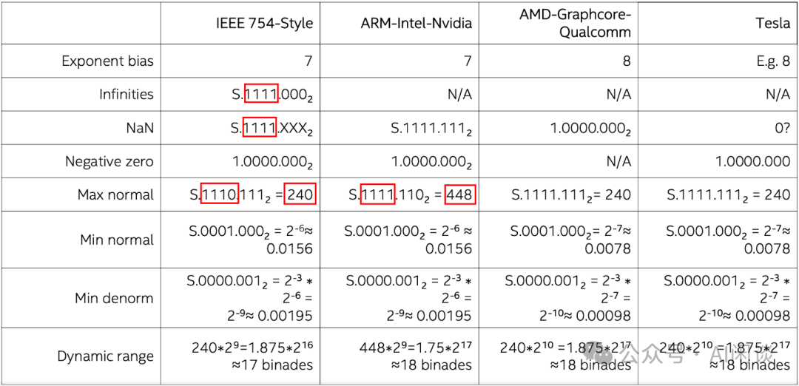
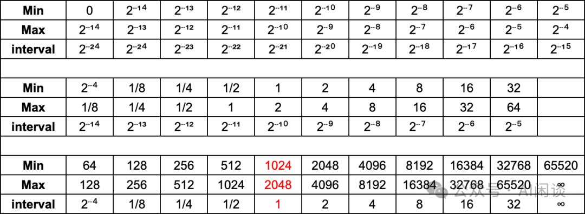
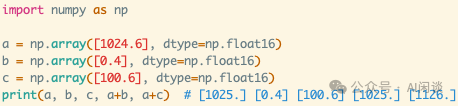
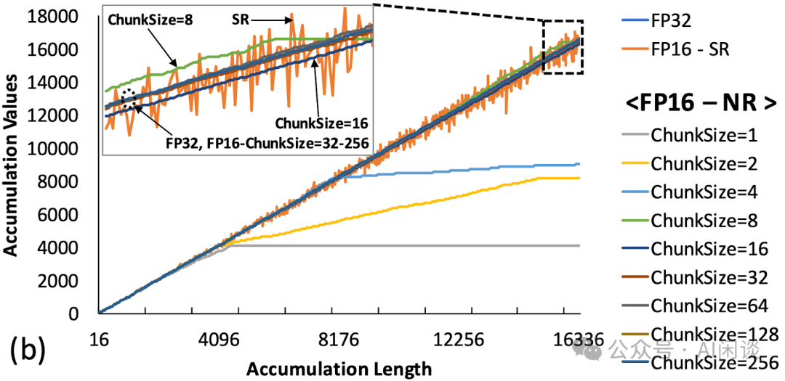
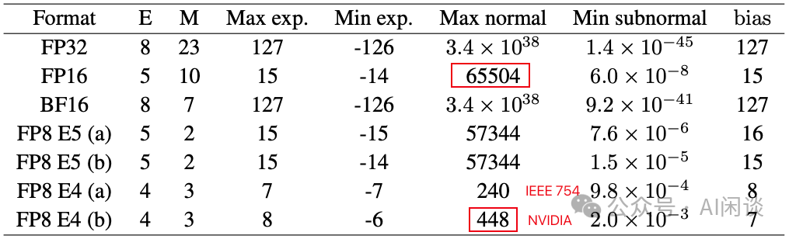
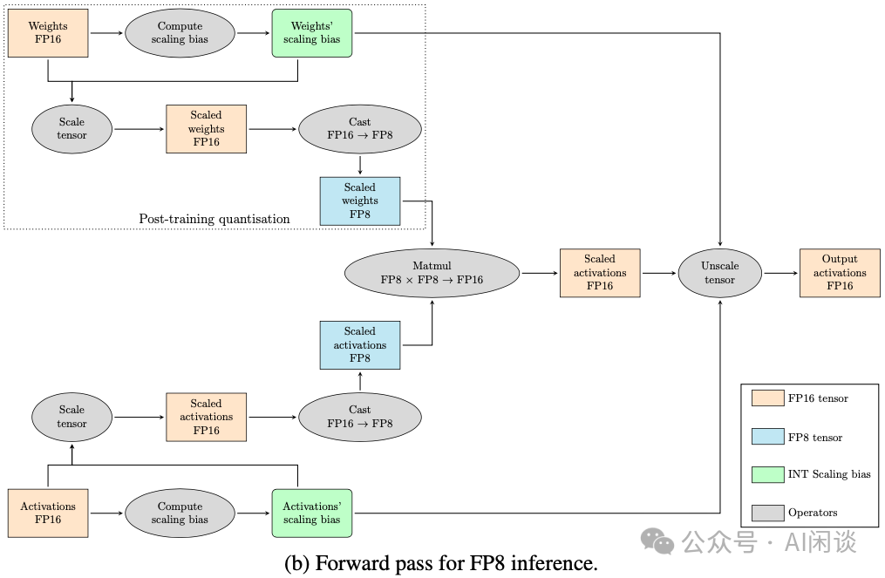
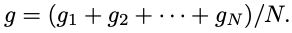

# 万字综述：全面梳理 FP8 训练和推理技术

**作者：** AI闲谈

---

## 一、背景

随着 ChatGPT 的横空出世，LLM/AIGC 领域迎来空前的关注，各类大模型如雨后春笋般出现，科技公司对 AI 算力的需求也呈爆发式增长。在这样的背景下，如何在有限资源内提升模型训练和推理效率成为研究的热点。而在众多的方向中 FP8 逐渐成为研究热点，FP8 的应用落地也是一个极具潜力的方向。

FP8 的重要性日益凸显，很大程度上得益于 NVIDIA Hopper 架构和 Ada Lovelace 架构对 FP8 的硬件支持。最新发布的 Blackwell 架构更是进一步拓展了低精度范围，支持了 FP6 和 FP4 格式。

业界对 FP8 的支持也在不断深入，我们也一直在关注业内对 FP8 的支持情况。比如各种推理框架（如 vLLM、TensorRT-LLM）和训练框架（如 Megatron-LM） 也都在增强对 FP8 的支持。然而，我们发现很多人依然对 FP8 存在诸多疑问和犹豫，比如 FP8 相比 INT8 有什么优势，FP8 的各种表示方式（E5M2、E4M3、E3M4、E2M5）该怎么选择，FP8 对模型精度和训练/推理速度的影响有多大？

为了厘清这些问题，我们系统地梳理了最近几年 FP8 相关的重要论文（主要来自 IBM、高通、微软、Graphcore 和 NVIDIA 的 7 篇论文），旨在提供一个全面而深入的理解。本文将追溯 FP8 的演进历程，分析其在 AI 领域的应用，并探讨其可能带来的变革。通过这一系列的探讨，我们希望大家能更好地理解 FP8 技术，并为其在实际应用中的决策提供有力支持。

我们也介绍过一系列相关工作，比如：

- [万卡 GPU 集群互联：硬件配置和网络设计](http://mp.weixin.qq.com/s?__biz=Mzk0ODU3MjcxNA==&mid=2247486775&idx=1&sn=abf7af24181cf5189e113fb161cc8d30&chksm=c364ca72f4134364f4e3fa4a971f767c2b07e6c2cae38c2a4ae28071fd330abaea68c36542c4&scene=21#wechat_redirect)
- [全面解析 NVIDIA 最新硬件：B100/B200/GH200/NVL72/SuperPod 等](http://mp.weixin.qq.com/s?__biz=Mzk0ODU3MjcxNA==&mid=2247486395&idx=1&sn=af0da5924032217ec0823d549bbe55b0&chksm=c364ccfef41345e8054707ff8c7ca5ef84241a97bd8806df7ff1ac7cbc086c94619a334c800a&scene=21#wechat_redirect)
- [GPU 关键指标汇总：算力、显存、通信](http://mp.weixin.qq.com/s?__biz=Mzk0ODU3MjcxNA==&mid=2247484942&idx=1&sn=2b69b610d4dacdc372036916d4c91325&chksm=c364c14bf413485d01b3d766d47ecfa170bef6451a97f981d1dc0d0261e23ec088961f423db1&scene=21#wechat_redirect)
-  [全面解析 LLM 推理优化：技术、应用与挑战](http://mp.weixin.qq.com/s?__biz=Mzk0ODU3MjcxNA==&mid=2247486732&idx=1&sn=9887fdc9b6d1151aaf8c2b443d3c595d&chksm=c364ca49f413435f5f93e68195a38708cb195454272d044d7df368d78586958bef75f5075c8e&scene=21#wechat_redirect)

## 二、引言

### 2.1 浮点数值表示

如下图为 NVIDIA GPU 常见的浮点数表示方式，其中 sign 表示符号位，exponent 表示指数位（决定了动态范围），mantissa 表示尾数位（决定了表示精度）。

- 相比 FP32：
- FP16 的指数位和尾数位都更小。因此，通常 FP32 转 BF16 时会带来较大的精度损失。
- BF16 的指数位和 FP32 相同，尾数位更少。因此，通常 FP32 转 BF16 只需要做尾数位的截断，损失相对较小。现在的 LLM 预训练中通常都会使用 BF16。
- 相比 FP16：
- FP8 E4M3 的指数位和尾数位都更小。因此，通常 FP16 转 FP8 E4M3 时会带来较大的精度损失。
- FP8 E5M2 的指数位和 FP16 相同，尾数位更少。因此，通常 FP16 转 FP8 E5M2 只需要做尾数位的截断，损失相对较小。

需要说明的是，虽然都是 E5M2 或者 E4M3，不同公司的硬件可能采用不同的格式。比如 NVIDIA GPU 上的 E5M2 符合 IEEE 754 Style，而 E4M3 却不符合 IEEE 754 Style，本文中没有特殊说明都以 ARM-Intel-Nvidia Style 为例。如下图所示，IEEE 754 Style 的 E4M3 的范围为 [-240, 240]，而 ARM-Intel-Nvidia Style 的 E4M3 的范围是 [-448, 448]：

### 2.2 浮点数值精度

如下图所示为 FP16 在不同数值区间的精度：

如下图所示为 ARM-Intel-Nvidia FP8-E4M3 在不同数值区间的精度：

如下图所示为 ARM-Intel-Nvidia FP8-E5M2 在不同数值区间的精度：

与传统的 FP16 和 FP32 相比，FP8 可以显著减少存储，提高计算吞吐。对于 FP8 而言，在表示范围内：

- E4M3 更精准：比如 [1, 2] 之间，E4M3 的最小间隔为 1/8，而 E5M2 的最小间隔为 1/4。
- E5M2 范围更宽：比如 E4M3 的表示范围为 [-448, 448]，而 E5M2 的表示范围为 [-57344, 57344]

### 2.3 舍入错误

浮点数的位数越低，越容易出现舍入误差（大数吃小数）。以 FP16 为例，其在不同区间的精度是不同的，比如在 [1024, 2048] 之间，间隔只有 1，也就是如果是 1024.0 加上 1.5，其结果为 1025.0，如下图所示为一个简单的示例：

- 1024.6 用 FP16 表示时，将表示为 1025.0。
- FP16 的 1025.0 + FP16 的 0.4 = 1025.0。
- FP16 的 1025.0 + FP16 的 100.6 = 1126.0。

### 2.4 FP8 Tensor Scaling

要将 FP8 应用于 LLM 的训练和推理，其中的一个关键问题是如何克服表示范围和精度下降相关的挑战。其中的一个关键技术就是张量缩放（Tensor Scaling），如下图 Figure 9 所示（图片来自 [2310.18313] FP8-LM: Training FP8 Large Language Models），其核心是将不在 FP8 表示范围内的数据缩放到 FP8 的表示范围内。

早期在 V100 和 A100 GPU 上的 FP16 混合精度训练会广泛采用全局损失缩放技术（Global Loss Scaling），很适合一些中小模型的训练。然而，在处理一些超大模型或复杂任务时（例如 DALL-E 等模型），Global Loss Scaling 仍然会遇到严重的下溢问题（Underflow）。因此，越来越多采用 Block-wise 和 Layer-wise 的 Gradient 缩放。在 FP8 的 Per Tensor Scaling 技术中，有两种常见方案：Just-in-time Scaling 和 Delayed Scaling（NVIDIA 在 Transformer Engine 中也有实现 Using FP8 with Transformer Engine）。

- Just-in-time Scaling（即时 Scaling）：要做 Tensor 的 Scaling，首先需要计算 Tensor 绝对值的最大值（amax），然后得到 Scaling 值，再对 Tensor 进行 Scaling。中间的临时存储都是高精度的，可能要多次读写，计算和访存开销很大；此外，如果是分布式场景，比如梯度的 AllReduce，还要涉及分布式通信开销。整体来说，额外引入的开销会大幅降低 FP8 带来的收益。
- Delayed Scaling（延迟 Scaling）：其核心思路是使用额外的 Tensor 来存储之前的 amax 历史，然后根据历史最大值决定当前的最大值。

如下图为 NVIDIA Transformer Engine 中的 Delayed Scaling 实现方案，其 amax history 最多可以存储 1024 个 history。在进行当前 Tensor 的 Scaling 操作时，会使用当前 Tensor 之前的 amax history 来预测当前的 amax（比如之前 history 的最大值），然后进行 Scaling 操作；Scaling 操作的同时会计算当前的 amax，并更新 amax history（PS：不确定这里是分成了两个 Kernel 同时 Scaling 和计算 amax，还是融合为一个 Kernel）。

### 2.5 FP8 硬件支持

如下图所示为常见 NVIDIA GPU 对不同数据类型的支持情况，可以看出，只有 Hopper 架构的 Tensor Core 才开始支持 FP8，CUDA Core 不支持。此外之后的 Ada Lovelace 架构和 Hopper 类似，也开始在 Tensor Core 支持 FP8。也就是说：

- A100 和 RTX 3090 都不支持 FP8。
- H100/H800 和 RTX 4090 的 Tensor Core 支持 FP8，但是 CUDA Core 不支持。也就是说，可以使用 FP8 的矩阵乘法（Tensor Core），但是不支持矩阵加法（CUDA Core）。

如下图所示，从 Hopper 架构开始，新的 Tensor Core 支持输入两个 FP8 的矩阵，然后以 FP8 格式相乘，并以 FP32 或 FP16 格式进行累加。Cublas 中也提供了相关 API 可以把后续的类型转换融合进去，就可以避免 FP32 或 FP16 的中间结果写回 Global Memory。

NVIDIA 最新发布的 Blackwell GPU 的 Tensor Core 相比 Hopper 进一步添加了对 FP6 和 FP4 的支持，而 Blackwell GPU 的 CUDA Core 不再支持 INT8。此外，从 Hopper 开始都不再支持 INT4。

### 2.6 FP8 软件支持

Pytorch 从 2.1 版本开始引入 FP8 格式支持，具体来说增加了 “torch.float8_e4m3fn” 和 “torch.float8_e5m2” 两种数据类型（torch.Tensor — PyTorch 2.3 documentation）。但是现在的 2.3 版本也依然在很早期的阶段，比如很多计算还不支持 FP8，如下图所示（`torch.float8_e4m3fn` does not support `torch.cat` · Issue #107256 · pytorch/pytorch · GitHub）：

NVIDIA 的 Transformer Engine 库添加了对 FP8 的支持，可以查看 Using FP8 with Transformer Engine。

最新发布的 FlashAttention3 也计划开放对 FP8 的支持，可以查看 GitHub - Dao-AILab/flash-attention: Fast and memory-efficient exact attention。

Numpy 目前还不支持 FP8。

vLLM、TensorRT-LLM 以及 Megatron-LM 都在支持 FP8.

## 三、IBM FP8 Training DNN

### 3.1 摘要

在 [1812.08011] Training Deep Neural Networks with 8-bit Floating Point Numbers 中，作者首次展示了使用 8bit 浮点数（FP8）成功训练 Deep Neural Network 模型，并可以保持和 FP32 相当的精度。此外，作者还提出了基于块的累积（Chunk Based Accumulation）和浮点随机舍入（Stochastic Rounding）的方案，成功的将加法的算术精度（用于部分累积和权重更新）从 FP32 降低到 FP16。

需要说明的是：论文中使用的 FP8 为 E5M2 格式；此外，论文中的 FP16 为 E6M9 格式，而现在说的 FP16 通常为 E5M10 格式。

PS：论文发表于 2018 年，作者声称 FP8 可以比 FP16 获得 2x-4x 的加速（考虑了芯片面积），但是当时的 NVIDIA GPU 还都没有支持 FP8，因此并没有在 NVIDIA GPU 进行实际的训练测试。按照当前 H100 系列的 GPU 而言，一般也只能获得不超过 2x 的加速。

### 3.2 方案

其训练方案如下图 Figure 2 所示：

- (a)：前向和反向计算的 GEMM 操作都用 FP8 作为输入和输出，但是在其累加的时候使用 FP16。
- (b)：权重更新中的 AXPY 都用 FP16 进行计算。

#### 3.2.1 基于块的累积（Chunk Based Accumulation）

如下图所示（图片来自 How to Optimize a CUDA Matmul Kernel for cuBLAS-like Performance: a Worklog），对于一个 A*B=C 的矩阵乘法，C 中的每一个位置都是 A 中对应的一行与 B 中对应的一列的内积。比如 C 中的绿色块(0, 1) 是 A 中第 1 行与 B 中的 0 列的内积。

而计算内积的过程可以等价于两个向量的点乘加上一个向量的求和，而对一个 FP8 向量进行求和容易出现误差。

- 通常的方式是有一个 sum 的值，所有结果都在 sum 上累加，这就容易出现上述介绍的大数吃小数问题，导致误差逐渐变大。
- 实际上可以采用分块的方式，如下图所示，先在每个块内累加，然后再将所有块的和进行累加。（PS：由于在 GPU 中的矩阵乘法基本都是分块计算，因此实现这种方案也就非常简单）

其伪代码如下所示，比较简单（也可以看出，其会额外增加很少的计算量）：

#### 3.2.2 浮点随机舍入（Stochastic Rounding）

如下图所示，作者也提出了随机舍入的方案，具体来说，以差值与间隔的比例作为概率来向下或向上舍入（PS：可能需要特殊硬件的支持？）：

以 1025.0 + 100.6 为例，直接使用 FP16 计算将为 1125.0；而使用随机输入，其结果将有 0.6/1.0=60% 的概率为 1126.0，有 1-0.6/1.0=40% 的概率为 1125.0（[1024, 2048] 之间的间隔为 1）。

### 3.3 实验

#### 3.3.1 分块和随机舍入

如下图所示，作者对比了分块和随机舍入在不同向量长度下的误差，可以看出，当 ChunkSize 大于 8 之后就能很好的保持精度。同时，随机舍入（FP16-SR）也能比较好保持精度，但相对波动也比较大：

#### 3.3.2 FP8 训练

如下图 Figure 4 所示，作者在多个 CV 任务上进行了训练，其 FP8 训练可以比较好的维持精度：

#### 3.3.3 消融实验

如下图 Figure 5 所示，作者对比了不同配置的影响：

- (a)：蓝色表示不使用 Chunk 的方式对精度影响较大，红色表示使用 Chunk 方式后最后进步都能对齐。
- (b)：红色和蓝色表示使用 FP16 进行梯度累加，对精度影响较大；绿色表示维持 FP32，完全能够对齐。

此外作者也对比了随机舍入和最近邻舍入的影响，可以看出，提出的随机舍入能更好的维持精度：

## 四、IBM Hybrid 8-bit Floating Training and Inference

### 4.1 摘要

NIPS 2019: Hybrid 8-bit Floating Point (HFP8) Training and Inference for Deep Neural Networks 中，作者指出之前的工作（比如 IBM FP8 E5M2）中已经验证了 FP8 用于 DNN 模型训练，然而其只在少数模型上验证，并不全面。此外，将 FP8 应用于 MobileNet 和 Transformer 等流行模型时，会观察到显著的退化，作者发现这种退化是因为前向传播和反向传播时对精度的要求不一致造成的。

基于以上发现，作者提出了一种混合 FP8（Hybrid FP8，HFP8）格式，并将其用于端到端的分布式模型训练。作者使用 HFP8 在图像分类、目标检测、自然语言处理和语音在内的所有应用中进行 DL 模型训练，验证并不会降低准确性。此外，作者也发现提出的 HFP8 格式可以直接用于训练后量化，只需简单地微调以进行 Batch Normalization 的统计。

PS：本文中使用了 FP8 E4M3，但也不是标准的 ARM-Intel-Nvidia Style 或 IEEE 754 Style 的 E4M3，其自定义的 E4M3 的动态范围只有 [-30, 30]，最小值为 2-11，比标准的 E4M3 的 2-9 更小。

### 4.2 分析 & 方案

如下图 Figure 1 所示，直接使用 FP8 E5M2 进行端到端训练，在 MobileNet V2 和 Transformer 上训练损失都比较大，而在 ResNet50、DenseNet121 和 MaskRCNN 上损失相对比较小：

作者通过实验发现：

- 如下图 b 所示：使用端到端 FP8 E5M2 训练时，Loss 曲面会出现多个鞍点，而且看起来更加的粗糙，这使得基于梯度下降的训练变的不稳定。
- 如下图 c 所示：在 Forward 阶段使用 FP8 E4M3 训练时（PS：这里使用的是自定义 E4M3，最小值可以达到 2-11，区间也更小，可以更好的保留 Weight 和 Activation 中比较小的值），可以显著改善 Loss 曲面，变得更加平滑，使优化变得更加简单。

除此之外，作者也通过硬件设计实验确认，同时支持 E4M3 和 E5M2 格式的浮点运算单元（FPU）的尺寸仅比只支持 E5M2 的单元大 5%，这表明混合格式在硬件上是可行的。

### 4.3 实验

#### 4.3.1 训练实验

如下图所示，作者采用上述提到的混合 FP8 训练范式，在常见的几类任务上进行了训练实验，可以看出，提出的 HFP8 可以很好的维持精度：

#### 4.3.2 后量化推理实验

如下图 Table 1 所示，训练后量化（Post Training Quantization，PTQ）推理中，带有 BN re-tuning 的 FP8 E4M3 可以更好的维持精度：

## 五、NVIDIA FP8 Format for DL

### 5.1 摘要

NVIDIA 在 [2209.05433] FP8 Formats for Deep Learning 中具体介绍了 FP8 的两种编码方式：E4M3（4 位指数和 3 位尾数）和 E5M2（5 位指数和 2 位尾数）。其 E5M2 遵循 IEEE 754 规则来表示特殊值，而 E4M3 通过不表示无穷大并且只有一个 NaN 尾数位模式来扩展动态范围。

作者进一步通过实验验证了 FP8 在 CNN、RNN 和 Transformer 模型上的性能，其所有超参数与 16bit 浮点数基线一致，结果表明 FP8 训练可以很好的维持精度，和 16bit 浮点数基线相当。同时，作者也验证了后量化方式（训练 16bit，推理 FP8）同样可以很好的维持精度。

PS：因为 NVIDIA GPU 不支持 IEEE 754 Style 的 E4M3，所以并没有将其与 ARM-Intel-Nvidia Style 的 E4M3 进行对比实验。

### 5.2 FP8 数据类型

如下图 Table 1 所示，NVIDIA 的 E5M2 遵循 IEEE 754 规则来表示特殊值，所以其动态范围和 IEEE 754 的 E5M2 一致。而 E4M3 中没有无穷大，并且只有一个 NaN，这样可以进一步表示 (256, 288, 320, 352, 384, 416, 448) 这几个数字，将其动态范围从 240 扩大到 448，这在 Deep Learning 领域非常有帮助：

通常来说，Weight Tensor 和 Activation Tensor 会使用 E4M3，Gradient Tensor 会使用 E5M2。不过也有些模型只适合 E4M3 或者 E5M2。

### 5.3 实验

如下图 Table 2 所示，作者验证了一系列模型在 ImageNet 上训练的精度，可以看出，FP8 训练只比 Baseline 略低：

如下图 Figure 1 所示，作者进一步验证了不同规模 GPT-3 模型训练的精度，可以看出，FP8 训练和 FP16，BF16 训练的 Loss 基本完全重合：

如下图 Table 5 所示，作者进一步验证了训练后量化的精度，其中 Weight 采用 per Channel Scale，激活采用 per Tensor Scale。可以看出，FP8 E4M3 相比 INT8 可以更好的维持精度，基本无损：

## 六、高通 FP8 Quantization

### 6.1 摘要

在 [2208.09225] FP8 Quantization: The Power of the Exponent 中，高通的作者深入研究了浮点格式在神经网络推理中的优势。作者详细介绍了 FP8 格式可以做出的选择，包括指数和尾数的选择（E5M2，E4M3，E3M4，E2M5），并具体分析了这些选择在哪些配置下可以提供更好的性能。然后，作者也展示了如何将这些发现转化为真实网络，为 FP8 仿真提供有效实现，并提出了一种能够学习 FP8 格式尺度参数和指数位数的新算法。

作者最终得出的结论是：在各种网络中，对于训练后量化（PTQ），FP8 格式的准确性优于 INT8，指数位数的选择由网络中异常值（Outlier）的严重程度决定。作者还进行了量化感知训练（QAT），格式之间的差异会随着模型的训练而消失，可能是训练减少了异常值的影响。

需要说明的是，这篇论文中的 FP8 采用的是 IEEE 754 Style，因此 E4M3 的动态范围是 [-240, 240]。作者也想通过这篇论文证明 FP8 E2M5 和 E3M4 是更好的 FP8 格式，而不是 NVIDIA、Intel、AMD 和 IBM 普遍支持的 E4M3 和 E5M2。不过 LLM 的大热似乎证明 E4M3 和 E5M2 是更正确的选择。

PS：其实高通这篇论文比 NVIDIA 的 FP8 Format 早一个月，不过 NVIDIA 的论文中提到了对 FP8 E4M3 的扩展，有助于我们理解高通这篇论文中使用的 IEEE 754 Style 的 E4M3，因此我们将 NVIDIA 的 FP8 Format 其放在前面介绍。

### 6.2 预期量化误差

如下图所示，作者分析了不同数据格式在均匀分布（Uniform）、高斯分布（Standard）和 t 分布（Student t）下的量化误差（SQNR Signal to Quantization Noise Ratio），SQNR 越高越好。可以看出：

- 均匀分布、高斯分布：基本上 INT8 和 E2M5 可以获得更高精度，并且 FP8 中指数位越小，精度越高，也就是 E5M2 最差。
- t 分布：相比高斯分布存在更严重的长尾，此时反而 E3M4 获得了更好的精度。（PS：对于 LLM 这种存在严重 Outlier 的场景，E4M3 和 E5M2 更合适）

### 6.3 训练后量化结果

作者是在 A100 和 V100 GPU 上进行训练后量化推理实验，都不支持 FP8，下述的 FP8 都是模拟的结果。此外，作者对比了三种 FP8 量化方案：

- fully fixed format：整个模型都使用固定的尾数 m，指数 e 和 Bias b。
- best flexible bias format：整个模型使用固定的 m 和 e，但是 b 会按 Channel 或 Tensor 调整。
- fully flexible format：每个 Tensor 有对应的 m 和 e，每个 Channel 有对应的 b。

结果如下图 Table 1 所示：

- 对于有更多 Outlier 的模型（ViT、Bert、SalsaNext 和 HRNet）需要 FP8 具有更多的指数位，以便支持更大的动态范围。
- Best flexible 往往获得最优效果。
- BERT-base 上 INT8 的损失比较大，而 FP8 的几种方式都损失比较小。

### 6.4 量化感知训练结果

如下图 Table 2 所示，通过量化感知训练，不论是 INT8，还是各种格式的 FP8 都能比较好的维持精度。通过学习 c（表示 INT8 中的最大值） 和 m（FP8 尾数位） 的方式，甚至可以进一步提升精度：

## 七、高通 FP8 versus INT8 for Inference

### 7.1 摘要

[2303.17951] FP8 versus INT8 for efficient deep learning inference 是高通团队对上面的 FP8 Quantization 工作的延续。作者还是想证明 FP8 E4M3 和 FP8 E5M2 在性能和准确性方面不能替代 INT8 进行深度学习推理，并通过实验说明大部分模型中，FP8 E4M3 和 FP8 E5M2 比 INT8 更差。对于 PTQ 的极端情况，比如层中有显著的异常值（Outlier）时，FP8 E4M3 和 FP8 E5M2 在准确性方面可能更好。此外，即使对于 INT8 不占优势的 Transformer 模型，也可以使用 W8A18 的混合精度运行，或者通过量化感知训练来弥补 INT8 的准确性问题。

除此之外，作者也提到在硬件中实现 FP8 的代价更大，其 FP8 单元的效率可能比 INT8 低 50%-180% 不等，如果 Workload 受计算限制，芯片的速度会明显变慢。（PS：不过 NVIDIA 的 H100 中 INT8 和 FP8 的算力是相同的）

最后，作者提到当论文发表时，FP8 的各种方案还不太成熟，而 INT8 相关的方案却已经存在多年，想进一步论证 INT4-INT8-INT16 为最好的解决方案。

### 7.2 硬件考量

如下图所示为一个矩阵乘法的 accelerator 的概览，作者认为 FP8 的标准还没有确定，导致 FP8 accelerator 的设计存在很多种可能。比如，其中的 Accumulator 可以是 FP16 或者 FP32，计算完之后可能还需要再进一步量化为 FP8 才能被下一次计算使用。除此之外，除了矩阵乘法之外的很多 OP 也都是以 FP16 计算的，比如 Softmax。这样对于一些 Memory Bound 的任务而言可能 FP8 计算也并不会有显著的加速效果。（PS：事实上，通常会有一些高性能的 Kernel 实现，可以将这些操作融合，避免中间结果写回 Global Memory，还是很有帮助的）

除此之外，如下图所示，作者也想证明 FP8 相比 INT8 在硬件实现上更加复杂，可能会占据更大的电路面积，也就意味着同样算力下，FP8 功耗可能更高。比如与 INT8 相比，FP8 E4M3 会增加 53% 的成本（PS：这也与 Meta 和 Microsoft 的结论类似 [2302.08007] With Shared Microexponents, A Little Shifting Goes a Long Way），如果进一步使用 FP32 进行累加，成本更是高达 183%。然而，NVIDIA 并没有具体介绍其 FP8 的硬件设计，我们也无法考证，但至少在 NVIDIA 的 GPU 中，FP8 算力通常是与 INT8 一致的。

### 7.3 训练后量化

如下图 Table 1 所示，作者进一步对比了 FP8 各种格式和 INT8 的训练后量化精度，试图证明 FP8 E2M5 和 E3M4 是更优的方案，从结果中可以看出，对于传统的 CV 类模型也确实如此（现在也有很多基于 Transformer 的视觉模型）。然而，对于 BERT 模型，FP8 E5M2 和 E4M3 反而更优（PS：对于 Transformer 模型而言，NVIDIA 的 E5M2 和 E4M3 确实是更正确的选择）。

### 7.4 Transformer 模型 INT8 校正

针对 INT8 不友好的 Transformer 模型，作者进一步探索了修正方案。如下图 Table 4 所示，作者进一步探索了 FP8 训练后的模型转换为 INT8 推理，发现其相比直接从 FP32 转换的精度会更高，而且使用 W8A16 后基本无损。除此之外，直接使用 INT8 量化感知训练也可以很好的维持精度。

## 八、Graphcore Training and Inference LLM using FP8

### 8.1 摘要

Graphcore 团队也针对 LLM 场景对 FP8 进行了深入的研究，在论文 [2309.17224] Training and inference of large language models using 8-bit floating point 中作者针对 FP8 的缩放问题进行了深入的探讨，并提出了一种针对 FP8 Linear Layer 的尺度缩放方案 FP8-AMAX，其会基于每个权重、梯度和激活的 Tensor 来动态更新 scale。基于这种方案，作者对 LLaMA 2 和 GPT 模型进行了训练和推理的验证，其模型规模从 111M 到 70B 不等，实验表明，其提出的 FP8-AMAX 可以很好的维持精度。

PS：本文作者主要聚焦在 FP8 E4M3 和 FP8 E5M2，和 NVIDIA 中的 FP8 格式一致。

### 8.2 Linear Layer 适配 FP8

#### 8.2.1 FP8 推理

如下图所示，由于 FP8 E4M3 的数据范围远小于 FP16，此外如果是 E5M3 和 E5M2 的矩阵乘，并使用 FP16 进行累加，也可能超出范围，因此一般需要使用 Scaling 来避免上溢出或下溢出。

如下图以 FP8 Inference 的过程为例，针对 FP16 的 Weight 和 Activation 都需要先计算 Scaling bias，然后进行 Scale 操作，之后再进行 Cast FP16 -> FP8 操作即可得到 Scale 后的 FP8 Weight 和 FP8 Activation（对于 Weight 和 Activation 通常转换为 FP8 E4M3），执行完 FP8 的矩阵乘法之后还需要依赖上述获得的 Scaling bias 来执行 Unscale 操作。需要指出的是，对于 Inference 而言，只用对 Weight 执行一次 Scale，然后保存 FP8 的 Weight 和 Scaling bias 即可。

如下图所示，新版本 cuBLAS 中已经支持了 Transformer 中的这种复杂计算：

#### 8.2.2 FP8 训练

在训练阶段 Weight 会不断更新，通常需要过一段时间（step）就重新计算 Scaling bias。在训练的 Backward 阶段需要分别针对 Weight 和 Input Activation 计算 Gradient，这两个操作都可以使用 FP8 矩阵乘加速，不过 Gradient 通常会表示为 FP8 E5M2。

此外，如果使用 BF16 或 FP32 （数据范围一致）进行累加，则不必进行 loss scaling，如果使用 FP16 进行累加，通常需要使用 loss scaling，以便能够更好的保留 Gradient。FP8-FP16 混合精度训练的 loss scaling 方法和 full FP16 训练中的一样。

### 8.3 实验

#### 8.3.1 策略

作者采用了两种计算 Scaling bias 的策略：

- FP8-AMAX：每一个 Linear Layer 的每一个 Batch 或者每一个 Tensor 都独立计算 Scaling bias。
- FP8-CSCALE：所有 Weight、Activation 和 Gradient 共享相同的 Scaling bias。

#### 8.3.2 FP8 推理

如下图 Table 2 所示，使用 FP8-AMAX 或 FP8-CSCALE 推理相比 FP16 都能很好的维持精度，平均可以达到 FP16 的 99.5% 以上：

当然，使用 FP8-CSCALE 时，其 Scaling bias 需要在如下图 Table 3 所示的范围内，否则也会出现比较大的偏差：

#### 8.3.3 FP8 训练

如下图 Table 5 所示，作者进一步验证了使用 FP8-AMAX 进行微调的精度，可以看出基本与 FP16 相当：

除此之外，使用 FP8-CSCALE 时，其 Scaling bias 需要在如下图 Table 6 所示的范围内，才能保证平均达到 FP16 99.5% 以上的精度，否则也会出现比较大的偏差。而且，模型越大，范围会越小：

## 九、微软 FP8-LM：Training FP8 LLM

### 9.1 摘要

在 [2310.18313] FP8-LM: Training FP8 Large Language Models 中，微软的作者探索了 FP8 用于 LLM 的高效训练。作者发现，在 LLM 训练中大部分变量（例如梯度、优化器状态）都可以采用低精度数据格式，而不会影响模型准确性，也不需要更改超参数。具体来说，作者提出了一种新的 FP8 自动混合精度 LLM 训练框架。该框架提供 3 个级别的优化，以简化 LLM 的混合精度和分布式并行训练，包括 FP8 通信、FP8 优化器和 FP8 分布式并行训练。

实验表明，在 H100 GPU 上训练 GPT 175B 模型，提出的 FP8 混合精度训练框架可以降低 42% 的内存占用，而运行速度比广泛采用的 BF16 最多快 64%，甚至比 NVIDIA 的 Transformer Engine 的速度快 17%，大幅降低 LLM 的训练成本。此外，提出的 FP8 混合精度训练时是通用的，可以无缝应用于其他任务，例如 LLM 指令微调和具有人工反馈的强化学习。

对应的开源开源代码库为：GitHub - Azure/MS-AMP: Microsoft Automatic Mixed Precision Library

PS：因为直接使用的 H100 GPU，所以对应的 FP8 E5M2 和 E4M3 为 ARM-Intel-Nvidia Style 的。

### 9.2 FP8 LLM

在作者研究 FP8 训练 LLM 的时候，NVIDIA 的 Transformer Engine 只支持 Transformer 模型中的 Linear Layer，其他操作都是更高精度，比如 Weight 更新，Gradient 同步。因此，作者提出了优化的 FP8 混合精度 LLM 训练策略。其主要包含 3 个方面的优化：FP8 通信，FP8 优化器，以及 FP8 分布式并行训练。

#### 9.2.1 FP8 梯度和 AllReduce 通信

作者发现直接使用 FP8 梯度进行梯度聚合会导致精度降低，这主要是因为低 bit 梯度聚合时有两种 Scaling 机制 pre-scaling 和 post-scaling，容易出现 Underflow 和 Overflow 的问题。

如下图所示为 pre-scaling 方案，假设有 N 个 GPU，则在求和之前先分别除以 N，此时容易出现 Underflow 的问题：

如下图所示为 post-scaling，其主要区别是在求和之后再除以 N，然而此时又容易出现 Overflow 的问题：

为了解决上述问题，作者提出了自定义的 FP8 梯度及 AllReduce 通信方案。由于其中介绍的比较晦涩，有些内容可能需要结合代码才能说明白，比如其 auto scaling factor μ 和 scaling factor s 的关系以及计算方式，因此我们留作后续介绍。

#### 9.2.2 FP8 优化器

在使用混合精度训练时，如下图所示，每个参数通常要对应 16 个字节，包括 FP32 的 Weight，Gradient 以及两个 Adam 优化器状态：

本文中，如下图所示，作者直接使用 FP16 存储 Weight，FP8 存储 Gradient，两个 Adam 优化器状态一个是 FP8 一个是 FP 16，如此可将显存占用降低 16/6=2.6x：

#### 9.2.3 FP8 分布式并行训练

这一部分的优化主要包含两个方面：一个是 TP（Tensor Parallelism）适配 FP8，另一个是 ZeRO（Zero Redundancy Optimizer）适配 FP8。

如下图 Figure 2 所示为 TP 适配 FP8，其中的序列并行（Sequence Parallel）还是使用 FP16，然后在进行 TP 之前会转换为 FP8 以降低通信量。之后 TP 中的 Linear 计算都使用 FP8（算力是 FP16 的 2 倍）。这样可以同时实现降低通信量和提升计算效率的目的：

如下图 Figure 3 所示为 ZeRO 适配 FP8，ZeRO 的核心就是实现模型状态（Weight、Activation、Gradient）在不同 GPU 上的切分。如左图所示，ZeRO 通常是直接按照 Tensor 均匀切分，每个 GPU 都有每个 Tensor 的一部分，这会导致 FP8 的 Scaling 操作需要考虑分布式场景，变得比较复杂；因此，作者采用了如右图所示的方案，1 个 Tensor 只会在 1 个 GPU 上（也包含对应的 Scaling 值），可以采用贪心进行相对均匀的划分，这种方式可以减少通信量和计算的复杂度。

### 9.3 实验

如下图 Figure 4 所示，使用 FP8 和 BF16 分别训练 GPT-7B、GPT-13B 和 GPT-175B 模型，其 Loss 基本都能对齐：

如下图 Table 2 所示为在各种下游任务的 Zero-shot 表现，可以看出其平均精度也基本一致：

如下图 Table 5 所示，作者也进一步对比了其性能表现，可以看出，提出的 FP8 训练方案可以有效降低显存使用并提升吞吐，在 175B 模型上最多可以提升 64% 的吞吐：

## 十、TensorRT-LLM & vLLM FP8

### 10.1 TensorRT-LLM

TensorRT-LLM 很早已经开始对 FP8 的支持，如下图所示，其可以在速度和精度方面比 SmoothQuant 和 AWQ 有比较明显的优势。如果考虑 FP8 节约的显存有助于使用更大的 Batch Size，FP8 甚至会比 FP16 获得 2x 的吞吐提升（可参考 H100 has 4.6x A100 Performance in TensorRT-LLM, achieving 10,000 tok/s at 100ms to first token）：

### 10.2 vLLM

在 GitHub - neuralmagic/AutoFP8 中，也有用户对 vLLM 的 FP8 推理进行了相应评估，可以看出，基于 Open LLM Evaluation 的评估表明 FP8 对精度的影响很小，对速度也能有比较大的提升：

## 十一、参考链接

1. https://developer.nvidia.com/zh-cn/blog/nvidia-gpu-fp8-training-inference/
2. https://arxiv.org/abs/2310.18313
3. https://docs.nvidia.com/deeplearning/transformer-engine/user-guide/examples/fp8_primer.html
4. https://pytorch.org/docs/2.3/tensors.html
5. https://github.com/pytorch/pytorch/issues/107256
6. https://github.com/Dao-AILab/flash-attention
7. https://arxiv.org/abs/1812.08011
8. https://siboehm.com/articles/22/CUDA-MMM
9. https://proceedings.neurips.cc/paper_files/paper/2019/file/65fc9fb4897a89789352e211ca2d398f-Paper.pdf
10. https://arxiv.org/abs/2209.05433
11. https://arxiv.org/abs/2208.09225
12. https://arxiv.org/abs/2303.17951
13. https://arxiv.org/abs/2302.08007
14. https://arxiv.org/abs/2309.17224
15. https://arxiv.org/abs/2310.18313
16. https://github.com/Azure/MS-AMP
17. https://nvidia.github.io/TensorRT-LLM/blogs/H100vsA100.html
18. https://github.com/neuralmagic/AutoFP8

