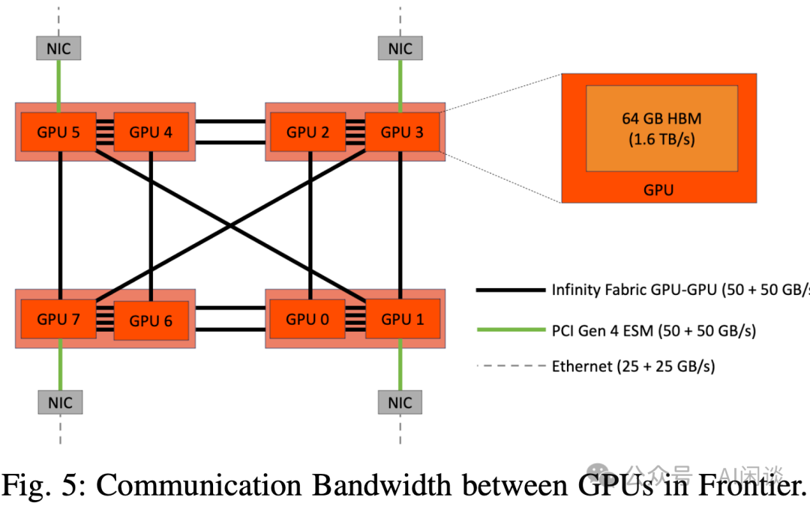
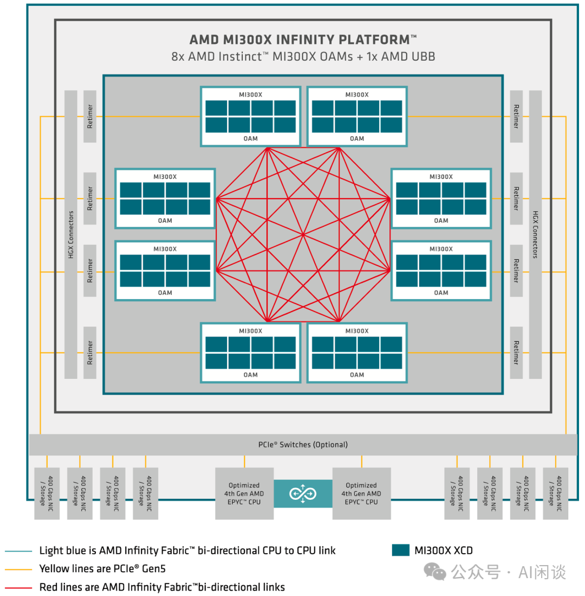

# 全面梳理 AMD CDNA 架构 GPU：MI325X 等 8 种 A/GPU 介绍

**作者：** AI闲谈

---

## 一、背景

在之前的文章中，我们深入探讨过 NVIDIA 系列 GPU 以及其在 AI 计算中的应用。然而，随着AMD 在 GPU 架构领域的快速发展，其 CDNA 系列架构正逐渐成为一种可行的替代方案。AMD CDNA 架构专为数据中心和高性能计算设计，优化了矩阵运算和并行计算能力，并在能效和成本方面具有一定优势。随着 CDNA 1/2/3 系列的演进，AMD 在 AI 模型训练和推理方面的表现也逐步提升，展示出与 NVIDIA GPU 竞争的潜力。这为构建多样化的计算解决方案提供了更多选择。

本文中，我们会对 CDNA 1/2/3 系列的所有主流 GPU 进行介绍，包括 MI100、MI210、MI250、MI250X、MI300A、MI300X、MI325X、MI355X 以及相应的基本硬件架构、算力和互联拓扑等。

本文主要参考 CDNA 系列架构白皮书：

- White Paper: Introducing AMD CDNA™ 1 Architecture
- White Paper: Introducing AMD CDNA™ 2 Architecture
- White Paper: Introducing AMD CDNA™ 3 Architecture

有关 NVIDIA GPU 的介绍可以参考：

- [GPU TLB 与 MIG 切分：真的完全物理隔离吗？](http://mp.weixin.qq.com/s?__biz=Mzk0ODU3MjcxNA==&mid=2247487595&idx=1&sn=9e254ba285377c07a35ad76e73cae2ea&chksm=c364d72ef4135e38ac956c2e551dd1fc6d249263b1de9d7e1db9bbbd8c7efa6e670ea7d01d95&scene=21#wechat_redirect)
- [NVIDIA 最新 GPU 解读：GB200、NVL72、SuperPod-576GPU](http://mp.weixin.qq.com/s?__biz=Mzk0ODU3MjcxNA==&mid=2247486291&idx=1&sn=9be7845ca2ce03a9b15cdc9848d70cef&chksm=c364cc16f41345001e83efda84a5f5594b3b2397712c11360db4c9bd8fabc77af0f8e6dca4af&scene=21#wechat_redirect)
- [GPU 关键指标汇总：算力、显存、通信](http://mp.weixin.qq.com/s?__biz=Mzk0ODU3MjcxNA==&mid=2247484942&idx=1&sn=2b69b610d4dacdc372036916d4c91325&chksm=c364c14bf413485d01b3d766d47ecfa170bef6451a97f981d1dc0d0261e23ec088961f423db1&scene=21#wechat_redirect)
- [万卡 GPU 集群互联：硬件配置和网络设计](http://mp.weixin.qq.com/s?__biz=Mzk0ODU3MjcxNA==&mid=2247486775&idx=1&sn=abf7af24181cf5189e113fb161cc8d30&chksm=c364ca72f4134364f4e3fa4a971f767c2b07e6c2cae38c2a4ae28071fd330abaea68c36542c4&scene=21#wechat_redirect)

## 二、引言

### 2.1 AMD RDNA & CDNA 架构

传统的 GPU 都是通用型，旨在驱动图形导向和计算导向的工作负载，最近几年 AMD 针对高性能计算场景提供了与游戏场景不同的架构，具体来说：

- AMD RDNA 针对游戏进行优化，以最大化每秒帧数。
- AMD CDNA 针对计算进行优化，以突破每秒浮点运算次数的极限。

AMD CDNA 系列移除了所有专为加速图形任务（如 Resterization、Tessellation、Graphics Cache、Blending 以及 Display 引擎）而设计的固定功能硬件。当然，依然保留了用于 HEVC、H.264 和 VP9 解码的专用逻辑单元。移除固定功能的图形硬件释放了面积和功耗，使得可以增加更多的计算单元，从而提升性能和效率。

### 2.2 AMD CDNA 架构

AMD 的第一代 CDNA（Compute DNA） 发布于 2020 年 3 月，并首先应用于 2020 年 11 推出的 AMD Instinct MI100 GPU 中，其采用台积电 N7 FinFET 工艺制造。

CDNA 架构的第二代采用了多芯片模块（MCM）设计，与前代的一体化设计有所不同。并应用于 AMD Instinct MI250X 和 MI250 中。这两种 GPU 于 2021 年 11 月发布。CDNA 2 系列中还包括一款采用一体化设计的后发产品 MI210。不过 MI250 和 MI250X 包含两个 Graphics Compute Die(GCD)，而 MI210 仅包含 1 个 GCD，因此算力也小了很多。

CDNA 架构的第三代同样采用多芯片模块（MCM）设计，包含在多个工艺节点上制造的不同小芯片。早期主要包括 MI300X 和 MI300A 两款产品，最近 AMD 又发布了新的 MI325X。

相关介绍可以参考：

- CDNA (microarchitecture) - Wikipedia
- AMD’s CDNA 3 Compute Architecture

### 2.3 AMD Infinity Fabric

AMD Infinity Fabric 是 AMD 开发的一种高速互连技术，用于处理器内部组件以及多个处理器之间的连接。以下是 Infinity Fabric 的一些关键特点和功能：

- 架构设计：Infinity Fabric 是一种可扩展的网状互连架构，允许不同的处理器组件高效地通信。
- 高带宽和低延迟：提供高达数百 GB/s 的带宽，同时保持低延迟，使其适用于要求苛刻的高性能计算和数据中心应用。
- 可扩展性：支持从单芯片设计到多芯片、多插槽系统的扩展，使其成为构建大规模并行系统的理想选择。
- 统一架构：在 CPU、GPU 和其他加速器中使用相同的互连技术，简化了系统设计并提高了整体效率。
- 内存一致性：支持跨不同处理单元的统一内存访问，简化了编程模型。

### 2.4 AMD CDNA GPU

以下为部分汇总数据，后文会详细介绍：

## 三、CDNA1 - MI100

### 3.1 概述

AMD Instinct MI100 GPU 是第一代集成 AMD CDNA 架构的 GPU，在其中加入了全新的 Matrix Core 技术，并增强了标量和矢量处理能力。此外，其也结合了 Infinity Fabric 技术，可以扩展至更大规模的系统。MI100 也是首款突破 10 TFLOP/s FP64 壁垒的 GPU。

如下图 Figure 2 所示，MI100 GPU 包含 120 个增强型计算单元（Compute Unit，CU），其基于 GCN（Graphics Core Next） 架构构建，并被组织成 4 个计算引擎（SIMD），负责 MI100 GPU 中的所有计算任务。相比上一代 GCN 架构，其主要是增加了 Matrix Core，显著提升多种数据格式的计算吞吐。

### 3.2 MI100 CU

如下图 Figure 5 所示为一个完整的 CU，其包含：

- 4 个 16-wide SIMD 单元
- 16 KB 的 L1 Cache
- Matrix Math Ops/Clock
- 256 FP32
- 512 BF16
- 1024 FP16 or INT8
- Vector ALU Ops/Clock
- 64x64b
- 128x32b
- 156x16b

白框包含：

- 1 个 16-wide SIMD 单元
- 1 个 Matrix Core 单元
- 3.2 KB Scalar Register
- 128 KB Vector Register

### 3.3 MI100 GPU

MI100 包含 120 个 CU，因此总共包含 120x4=480 个 Matrix Core。

如下图 Table 1 所示为 MI100 相关算力，MI100 的峰值 Clock 为 1502MHz，因此：

- 1502M * 1024 * 120(CU) = 184.6 TFLOPS
- 1502M * 128 * 120(CU) = 23.1 TFLOPS

### 3.4 MI100 GPU HPC 拓扑

如下图 Figure 3 所示，4 个 MI100 GPU 可以通过 Infinity Fabric 技术实现全互联，Infinite Fabric 链路速度为 23GT/s，单向 16bit，在每个 MI100 中有 3 条 Link，共 12 条，可以实现 4 个 GPU 的全互联。

- 每个 Link 的双向带宽为 (23GT/s * 16bit * 2) / 8bit = 92 GB/s。
- 每个 GPU 的双向带宽为 92GB/s * 3 = 276 GB/s。
- 4 个 GPU 的双向带宽为 276GB/s * 4 / 2 = 552 GB/s。

如果不使用 Infinity Fabric 互联，则 4 个 MI100 GPU 只能通过 PCIe Gen4 互联，对应的峰值带宽为 64 GB/s x 4 = 256 GB/s。作者对比了两种情况下不同训练任务的吞吐，如下图 Figure 4 所示，使用 Infinity Fabric 互联时可以获得更好的吞吐，提升 27%-44% 左右：

## 四、CDNA2 - MI210&MI250&MI250X

### 4.1 概述

AMD CDNA 2 架构在原有 CDNA 架构的强大核心基础上，通过相似的工艺技术，实现了系统性能和易用性的飞跃。为了实现百亿亿次级性能，该架构在几乎所有方面——从计算单元到内存接口——都进行了全面改进，尤其着重于从根本上提升通信接口，以实现全系统可扩展性。

如下图所示（图片来自 GPU nodes - LUMI-G - Documentation）为 AMD Instinct MI200 图形计算芯片（Graphics Compute Die，GCD）。完整的一个 GCD 包含：

- 28 * 4 = 112 个 CU，实际中由于良品率等问题可能会屏蔽部分 CU。比如，AMD Instinct MI210 GPU 中集成一个 GCD，只保留了 104 个 CU。
- 8 个 Infinity Fabric，其中 7 个用于 GCD 之间的连接（红框），1 个用于 PCIe 连接（左下角，黄框）。

AMD Instinct MI200 基于先进的封装技术构建，使得在 MI250 和 MI250X GPU 中，两个 GCD 能够集成于单一 OAM（OCP Accelerator Module）内，如下图 Figure 1b 所示。具体来说，可以基于 AMD 独有的 Infinity Fabric 技术，将片间的连接扩展到整个封装内部，使得多个 GCD 在一个共享系统中表现为一个 GPU。

- 两个 GCD 通过 4 条 Infinity Fabric Link 连接（红线）。
- 6 条 Infinity Fabric Link 用于连接其他 GPU 的 GCD（绿框）。
- 2 条 Infinity Fabric Link 用于 PCIe 连接（红框）。

### 4.2 MI200 CU

如下图 Figure 3 所示，MI200 的 CU 与 MI100 的 CU 类似，包含：

- 4 个 Matrix Core 单元。
- 4 个 16-wide SIMD 单元，共 64 个 Shader Core。
- 16 KB L1 Cache。

每个 CU 每个 CLOCK 对应的 FLOPS 为：

- Matrix FP64/FP32：256
- Matrix FP16/BF16/INT8/INT4：1024
- Vector FP64/FP32：128

### 4.3 MI200 GPU

如下图所示为 MI250X GPU 的相应架构：

- Infinity Fabric Link：
- 两个 GCD 之间 4 条 Link（红线），对应 400 GB/s。
- 6 个 Infinity Fabric Link 用于外部连接（绿框），但是似乎只用了 5 条 Link，对应带宽为 500 GB/s。
- 1 个 Infinity Fabric Link 连接 PCIe 网卡，带宽 100 GB/s（左下角）。
- 1 个 Infinity Fabric Link 连接 CPU，带宽为 144 GB/s（右上角）。（PS：如果只是一个 Link 理论带宽上限应该是 100 GB/s，所以这里应该是 2 个 Link，这也解释了为什么外部 Link 只有 5 条）
- 算力：
- 220 个 CU。
- 880 个 Matrix Core。
- 内存：
- 128 GB HBM2e。
- 带宽 3.2 TB/s。

如下图所示，MI210、MI250、MI250X 几种 GPU 的主要区别为：

- MI210 包含 1 个 GCD，MI250 和 MI250X 包含 2 个 GCD。
- MI210 和 MI250 的 GCD 可用 104 个 CU，而 MI250X 的 1 个 GCD 可用 110 个 CU。相应的 MI210 包含 104x4=416 个 Matrix Core，MI250 包含 104x4x2=832 个 Matrix Core；MI250X 包含 110x4x2=880 Matrix Core。
- Infinity Fabric Link：
- MI210：3 个 Link 连接外部 GCD，1 个连接 PCIe 设备。
- MI250：6 个 Link 连接外部 GCD，2 个连接 PCIe 设备。
- MI250X：5 个连接外部 GCD，2 个连接 CPU，1 个连接 NIC。（PS：不确定表中 MI250X 最多 8 个 Link 指的是什么？如果是 5+3+1，那么 MI250 也应该是 8？）
- MI210、MI250 和 MI250X 对应的 Memory：
- 大小为：64 GB，128 GB，128 GB。
- 带宽为：1.6 TB/s，3.2 TB/s，3.2 TB/s。
- MI250X 的峰值 CLOCK 为 1700MHz，对应的算力为：
- Vector FP64/FP32：1700M x 220 x 128 = 47.9T
- Matrix FP64/FP32：1700M x 220 x 256 = 95.7T
- Matrix FP16/BF16/INT8/INT4：1700M x 220 x 1024 = 383T

### 4.4 MI210 HPC 拓扑

如下图所示为 2 个 AMD CPU，4 个 MI210 GPU 组成的 HPC 拓扑：

- 每 2 个 MI210 通过 3 条 Infinity Fabric Link 连接，每条 Link 的双向带宽为 100 GB/s。因此，左侧（绿线）或者右侧（红线）两个 MI210 之间的双向带宽可达 300 GB/s。
- 4 个 MI210 都通过 PCIe（黄线） 与 CPU 以及 NIC 连接。
- 2 个 CPU 通过 Infinity Fabric Link 连接。

如下图所示为 2 个 AMD CPU，8 个 MI210 GPU 组成的 HPC 拓扑：

- 每 4 个 MI210 通过 共 6 条 Infinity Fabric Link 全互联，每条 Link 的双向带宽为 100 GB/s。因此，左侧（绿线）或者右侧（红线）4 个 MI210 之间的双向总带宽都可达 600 GB/s。总的通信带宽为 600 x 2 = 1.2 TB/s。
- 8 个 MI210 都通过 PCIe（黄线） 与 CPU 以及 NIC 连接。
- 2 个 CPU 通过 Infinity Fabric Link 连接。

PS：在 NVIDIA SXM GPU 中可以使用 NVLink 实现互联，同样是包含多个 Link，不同的 Link 连到不同的 GPU 可以实现多 GPU 互联，实现方式和上述 AMD MI210 GPU 类似。然而，NVIDIA GPU 中也可以将所有 GPU 通过 NVLink Switch 连接，如下图所示，8 个 A100 通过 NVSwitch 实现全互联，这样总的通信带宽为：每个 GPU NVLink 带宽 * GPU 数。而非 Switch 的连接方式中，总的通信带宽为：每个 GPU NVLink 带宽 * GPU 数 / 2。

### 4.5 MI250 HPC 拓扑

如下图所示为 2 个 AMD CPU，4 个 MI250 GPU 组成的 HPC 拓扑：

- 4 个 MI250（8 个 GCD） 通过 26 条 Infinity Fabric Link 连接，每条 Link 的双向带宽为 100 GB/s，因此：
- 8 个 GCD 通过 16 条 Link 构成了 2 个环：绿线、红线。每个环 8 个 Link，总通信带宽 800 GB/s，2 个环共 1.6 TB/s。（PS：同一个 GPU 内的 2 个 GCD 为固定的 4 条 Link）
- 8 个 GCD 分成两组，每两个 GPU 的 4 个 GCD 还会通过 5 条 Link 连接（黑线），对应总通信带宽 500 GB/s。因此，8 个 GCD 共 500 x 2 = 1 TB/s。
- 综上，4 个 GPU，8 个 GCD 的总通信带宽为 1.6+1=2.6TB/s。然而，如果是 Ring 通信的，则只能使用 2 个环，也就是 1.6 TB/s。
- 8 个 GCD 都通过 PCIe（黄线） 与 CPU 以及 NIC 连接。
- 2 个 CPU 通过 Infinity Fabric Link 连接。

如下图所示为 2 个 AMD CPU，8 个 MI250 GPU 组成的 HPC 拓扑：

- 8 个 MI250（8 个 GCD） 通过 56 条 Infinity Fabric Link 连接，每条 Link 的双向带宽为 100 GB/s，因此：
- 16 个 GCD 通过 48 条 Link 构成了 3 个环，每个 GCD 都有 3 条对外 的 Link，也就是每个 GPU 6 条：绿线、红线、蓝线。每个环 16 个 Link，总通信带宽 1.6 TB/s，3 个环共 4.8 TB/s。（PS：下图注释有问题，实际是 3 个环）
- 每个 GPU 内的两个 GCD 之间的 4 个 Link 中有 3 条用于上述组环，还会剩下 1 条 Link 连接（黑线），对应通信带宽 100 GB/s。因此，8 个 GPU 共 100 x 8 = 0.8 TB/s。
- 综上，8 个 GPU，16 个 GCD 的总通信带宽为 4.8+0.8=5.6TB/s。然而，如果是 Ring 通信，则只能使用 3 个环，也就是 4.8 TB/s。
- 16 个 GCD 都通过 PCIe（黄线） 与 CPU 以及 8 个 NIC 连接。
- 2 个 CPU 通过 Infinity Fabric Link 连接。

### 4.6 MI250X HPC 拓扑

如下图所示为 1 个 AMD CPU，4 个 MI250X GPU 组成的 HPC 拓扑：

- 与上述 4 个 MI250（8 个 GCD） 通过 26 条 Infinity Fabric Link 连接一样，绿线、红线构成 2 个环，通信带宽 1.6TB/s。黑线未构成环，通信带宽 1 TB/s，总通信带宽 2.6TB/s。
- 与上述 4 个 MI250 不同的是，4 个 MI250X 中的 8 个 GCD 还会分别通过 1 条 Link 与 CPU 连接，总带宽为 100 GB/s x 8 = 800 GB/s。
- 8 个 GCD 都通过 Infinity Fabric Link（蓝线） 与 CPU 连接。
- 8 个 GCD 都通过 PCIe（黄线） 与 NIC 连接。

PS：不确定是不是因为 MI250X 中有两个 Link 专门用于连接 CPU，1 个用于连接 PCIe 设备，只剩下 5 个 Link，因此并没有像 MI250 GPU 那样提供 8 GPU 的方案。比如美国橡树湾实验室的 [2312.12705] Optimizing Distributed Training on Frontier for Large Language Models 中使用 MI250X，声称是每个 Node 8 个 GPU，实际只是 8 个 GCD，把每个 GCD 看成一个 GPU，如下图 Fig. 5 所示：

## 五、CDNA3 - MI300A&MI300X&MI325X

### 5.1 概述

AMD CDNA 3 架构进一步演化，采用先进的封装技术，可以实现异构集成。如下图所示，利用先进的 3D 封装技术，MI300 系列可以将多达 8 个垂直堆叠的 Accelerator Complex Dies（XCD）和 4 个 IO Dies（IOD）通过 AMD Infinity Fabric 技术连接，并与 8 个 HBM Stack 相连，还可以选择性的集成 CPU Complex Die（CCD）。此外，底层的 GPU 核心内，Vector 和 Matrix 的计算吞吐也得到进一步增强，并原生支持 Sparse 数据类型。

如下图 Figure 6 所示，CDNA 3 架构的最显著变革体现在其 CU 之外的内存层次结构上，AMD 进行重新设计，以充分利用异构小芯片实现 APU 产品中与 CPU 小芯片共同封装的缓存一致性。首先，XCD 共享 L2 Cache，但随着 AMD Infinity Cache 的加入，L2 Cache 的角色发生了根本性变化，Infinity Cache 位于 IOD 上，作为最后一级缓存（LLC），大小为 256MB。

- 绿线表示 XCD 和 L2 Cache 之间的带宽，可达 51.6 TB/s。
- 黄线表示 XCD 和 LLC 之间的带宽，可达 17.2 TB/s。
- 红线表示 LLC 和 HBM 之间的带宽，可达 5.3 TB/s。（PS：下图的注释应该是有错误）

### 5.2 MI300 CU

如下图 Figure 4 所示，AMD CDNA 3 的 Compute Unit（CU）为完整的、高度现成和并行化的处理核心，涵盖从指令获取和调度、Scalar/Vector/Matrix 类型的执行单元。并且配备了 L1 Cache 和本地数据共享（Local Data Share，LDS）的 load/store 流水线。尽管在架构上与 CDNA 2 的 CU 架构类似，但 CDNA 3 的 CU 在核心各部分进行了全面改进，以在几乎每个层级上实现更高的并行性，对于 Vector 和 Matrix 计算，每个 CU 的性能提升 1x 到 4x。

如下图所示，CDNA 3 的 CU（MI300）相比 CDNA 2 的 CU（MI250X）的主要提升表现在：

- Vector FP32 算力加倍：256/128。
- Matrix FP16/BF16 算力加倍：2048/1024。
- Matrix INT8 算力 4x：4096/1024。
- 新增 Matrix TF32 和 Matrix FP8 支持，并且 FP8 算力和 INT8 相同，都是 4096。

### 5.3 MI300 XCD & CCD

如下图所示，一个完整的 MI300 XCD 包含：

- 40 个 CU，不过只能使用 38 个。
- 4MB 的 L2 Cache。

如下图所示，一个完整的 MI300 CCD 包含：

- 8 个 Zen 4 x86 Core。
- 32 MB L3 Cache。

### 5.4 MI300 APU & GPU

CDNA 3 的架构设计允许其衍生不同的变种，如下图所示，最开始 MI300 系列主要包含 MI300A 和 MI300X 两种。

- MI300X（GPU）：专注于加速计算，集成了 8 个 XCD，使用的是 24GB HBM3 Stack，共 192 GB 内存。
- MI300A（APU）：一个封装内整合了 CPU、GPU 和内存，其计算能力降低 25%（8 个 XCD 变成 6 个 XCD），并与 3 个 Zen 4 架构的 CPU 芯片（CCD）集成。整个 APU 共享一个虚拟和物理内存池，具有极低的延迟。通过消除 Host 与 Device 之间的数据复制，极大简化了开发者的使用体验，并在系统层面省去 DIMM 模块和 CPU 与 GPU 通信链路等组件，显著节省功耗和空间。

如下图所示为一个对应的 MI300A APU，其包含 8 个 HBM3 Stack，6 个 XCD 和 3 个 CCD。一个 XCD 包含 40 个 CU（只能使用 38 个），一个 CCD 包含 8 个 Core。

如下图所示为 MI300A APU 与 MI300X GPU 的详细参数对比，可以看出主要区别是：MI300A 的 XCD 数目是 MI300X 的 75%，因此对应的各种算力也是 MI300X 的 75%：

如下图所示，MI300A APU 与 MI300X GPU 的 Memory 也稍有区别，MI300A 的 Memory 大小为 128 GB（对应 8 个 16 GB HBM3 Stack），MI300X 为 192 GB（对应 8 个 24 GB HBM3 Stack：

如下图所示，MI300A APU 与 MI300X GPU 的 Infinity Fabric interface 也稍有不同，它们都是 8 个 Infinity Fabric interface，可以提供 128 GB/s * 8 = 1TB/s 的双向带宽。不过用途不同：

- MI300X：7 个用于 Infinity Fabric Link 和其他 GPU 互联，对应带宽 128 GB/s x 7 = 896 GB/s；1 个用于 PCIe Gen5 与 CPU 连接。
- MI300A：4 个专用于 Infinity Fabric Link，另外 4 个可以用于 Infinity Fabric 或 PCIe Gen5 连接。

PS：其实上述 MI300A 和 MI300X 的 P2P Ring Peak Aggregate Bandwidth 有点问题，在 4 APU 方案中每个 APU 有 6 个 Link 与其他 APU 连接；而 8 GPU 方案中每个 GPU 有 7 个 Link 与其他 GPU 连接。因此，带宽应该为 384/448 GB/s 或者 768/896 GB/s。

### 5.5 MI325X GPU & MI355X GPU

最近 AMD 也正式发布了最新的 MI325X GPU，并计划 2025 第二季度发布 MI350 系列 GPU，相比 MI300X 的主要不同为：

- MI325X GPU：Memory 从 HBM3 升级到 HBM3e，大小也从 192 GB 升级到 256GB，带宽从 5.3 TB/s 升级到 6TB/s。而算力没有任何提升。
- MI355X GPU：新一代的 CDNA 4 架构，采用 3nm 工艺。提供 288 GB HBM3e Memory。并且进一步支持 FP4/FP6。

### 5.6 MI300A HPC 拓扑

如下图所示，4 个 MI300A APU 可以通过 6 条 Infinity Fabric Link 实现全互联。每个 APU 还通过剩下的 Link 与 PCIe 设备互联。

CDNA 3 中，每个 Infinity Fabric Link 的带宽为 128 GB/s，因此，每个 MI300A 6 条 Link 的总带宽为 128 x 6 = 768 GB/s；4 个 MI300A APU 全互联的带宽为 128GB/s x 6 x 4 / 2 = 1.536 TB/s。如果上述 P2P Ring Peak Aggregate Bandwidth 是每个 GPU 的平均带宽，则为 1.536TB/s / 4 = 384 GB/s；如果指的是其他 GPU 与当前 GPU 的聚合带宽，则为 128GB/s x 6 = 768GB/s。（PS：下图中应该是有错误存在，两个 蓝色X 的连接应该是不存在的，否则每个 APU 的 Link 数就超过 8 了）

### 5.7 MI300X HPC 拓扑

如下图 Figure 9 所示，8 个 MI300X GPU 通过独立的 7 条 Infinity Fabric Link 实现全互联。每个 GPU 还通过 PCIe Gen5 x16 与 CPU 相连。与上一代 GPU 相比，在执行 AllReduce 和 AllGather 等集合通信时，速度和效率可以显著提升。

每个 MI300X 7 个 Link 的总带宽为 128 x 7 = 896 GB/s；8 个 MI300X GPU 全互联的带宽为 128GB/s x 7 x 8 / 2 = 3.584 TB/s。如果上述 P2P Ring Peak Aggregate Bandwidth 是每个 GPU 的平均带宽，则为 3.584TB/s / 8 = 488 GB/s；如果指的是其他 GPU 与当前 GPU 的聚合带宽，则为 128GB/s x 7 = 896 GB/s。

## 六、对比

如下图所示为 AMD MI300X GPU 与 NVIDIA H100 SXM GPU 的性能对比，可以看出：

- MI300X 的内存更大，内存带宽更大。
- MI300X 的算力更强，大概是 H100 的 1.3x。
- MI300X 的 8 GPU 互联带宽与 H100 基本一致，然而，如果考虑 H100 可以通过 NVSwitch 实现高速互联，则 8 x MI300X 的总带宽（3.6TB/s）只有 8 x H100（7.2TB/s） 的一半。

如下图所示，在 AMD’s MI300X Outperforms NVIDIA’s H100 for LLM Inference，作者对比了 MI300X 和 H100 进行 Mixtral 8x7B 推理的性能，因为 H100 只有 80GB 内存，因此 FP16 推理需要 2 个 GPU，也就是 TP=2。而 MI300X 有 192GB 内存，只用一个 MI300X 即可以，也就是 TP=1；为了公平对比，作者也对比了 2 个 MI300X TP=1 实例与 TP=2 H100 实例的性能。其中 Flywheel 为 MK1.ai 优化过的 LLM Inference 框架。

- Batch Size 比较小时：主要是 Memory Bound，MI300X 显存带宽更高，甚至可以获得 2-3x 提升。
- Batch Size 比较大时：主要是 Compute Bound，MI300X 算力是 H100 1.3x，相应吞吐大概是 H100 的 1.2-1.4x。

在 AMD MI300X vs. Nvidia H100 SXM: Performance Comparison on Mixtral 8x7B Inference 中也有类似的实验，可能是测试的配置不同，MI300X 在中等 Batch Size 时的表现不太符合预期，不过整体结论类似。

## 七、参考链接

1. https://www.amd.com/content/dam/amd/en/documents/instinct-business-docs/white-papers/amd-cdna-white-paper.pdf
2. https://www.amd.com/content/dam/amd/en/documents/instinct-business-docs/white-papers/amd-cdna2-white-paper.pdf
3. https://www.amd.com/content/dam/amd/en/documents/instinct-tech-docs/white-papers/amd-cdna-3-white-paper.pdf
4. https://en.wikipedia.org/wiki/CDNA_(microarchitecture)
5. https://chipsandcheese.com/p/amds-cdna-3-compute-architecture
6. https://docs.lumi-supercomputer.eu/hardware/lumig/
7. https://arxiv.org/abs/2312.12705
8. https://tensorwave.com/blog/amds-mi300x-outperforms-nvidias-h100-for-llm-inference
9. https://mk1.ai/
10. https://blog.runpod.io/amd-mi300x-vs-nvidia-h100-sxm-performance-comparison-on-mixtral-8x7b-inference/

