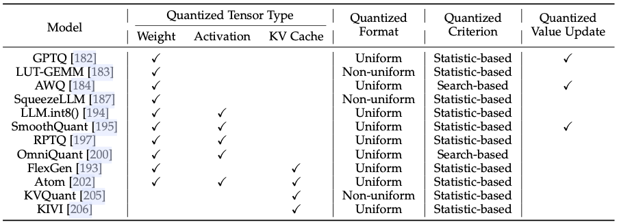
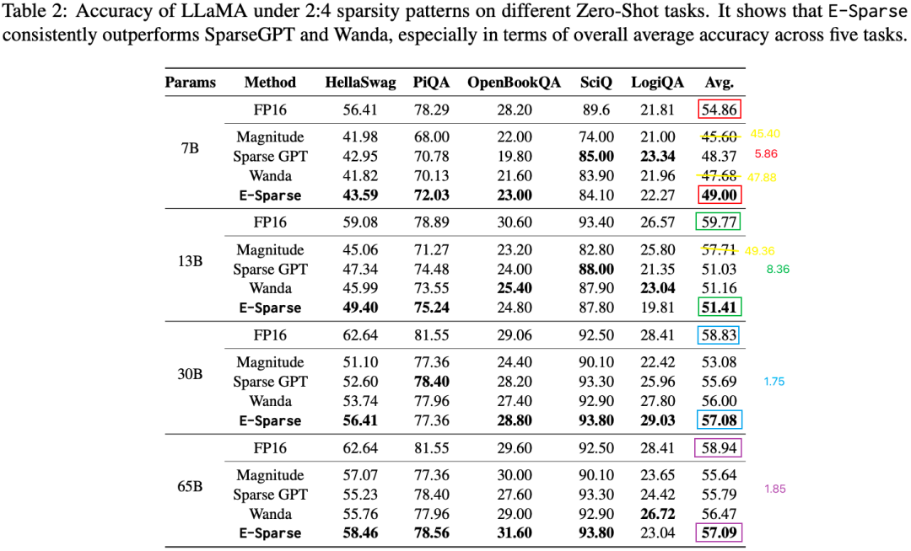

# 全面解析 LLM 推理优化：技术、应用与挑战

**作者：** AI闲谈

---

一、背景

最近又看到了一些 LLM 推理优化的一些综述文章，比如 [2404.14294] A Survey on Efficient Inference for Large Language Models，作者从数据层、模型层和系统层等多方面详细介绍了各种高效 LLM 推理的技术。这些技术中，很多已经在常见的 LLM 推理框架中广泛使用，比如 Continuous Batching，PagedAttention，FlashAttention，FlashDecoding 以及各种量化技术；也包含一些较少使用的技术，比如稀疏化，Prompt 压缩等。

尽管存在众多优化手段，但并非所有手段都得到了广泛采用。这主要是因为每种优化技术都有其代价，关键在于这些代价是否能够被优化带来的收益所抵消。例如，使用 KV Cache 可以显著节约计算资源，但同时会增加显存的使用。因为其计算资源节约带来的收益明显大于显存增加的代价，因此这种方法非常划算且被广泛使用。此外，有些优化方案可能会牺牲模型精度，比如量化、剪枝技术，此时需要充分平衡速度和精度的影响。最后，技术的通用性和鲁棒性也是决定其应用广泛性的重要因素。如果一种技术需要针对每个场景和模型进行分别优化，将大大增加适配成本。即便这种优化能够带来一定的性能提升，也可能不被优先考虑。此外，一些技术，例如，部分投机采样方案，只在小 Batch Size 场景中有优势，这也限制了其应用范围。

那么在实际生成落地过程中，有哪些是我们需要考虑的呢？这篇文章中，我们先简单介绍一下相关背景，然后介绍一下各种技术方案背后需要考量的潜在风险和代价，比如对精度的影响，使用的范围等。

LLM 推理优化相关总结可以参考：

- [LLM 推理性能优化最佳实践](http://mp.weixin.qq.com/s?__biz=Mzk0ODU3MjcxNA==&mid=2247484362&idx=1&sn=a7a9cc60f95b78083bc12348b168d2cc&chksm=c364c48ff4134d9954f929a4de363bbee2f8a0590008d1ea2099635f503b1a970fa853639e0e&scene=21#wechat_redirect)
- [万字综述 10+ 种 LLM 投机采样推理加速方案](http://mp.weixin.qq.com/s?__biz=Mzk0ODU3MjcxNA==&mid=2247485998&idx=1&sn=66bb9bea773cde1f9633b2b81ff1a656&chksm=c364cd6bf413447d6b1d97365f54f8cb2273aef700ff1f53de37b2aeecdad17b2904b0772290&scene=21#wechat_redirect)
- [揭秘 LLM 推理：全面解析 LLM 推理性能的关键因素](http://mp.weixin.qq.com/s?__biz=Mzk0ODU3MjcxNA==&mid=2247485863&idx=1&sn=1f4cb40b0ff2908f1fa0b5b0f3b6ebb7&chksm=c364cee2f41347f4e2f9568d359b3ec2ca88d9039370af9b51b7b831dbf537ea312851cf9c76&scene=21#wechat_redirect)
- [LLM 推理常见参数解析](http://mp.weixin.qq.com/s?__biz=Mzk0ODU3MjcxNA==&mid=2247484444&idx=1&sn=da7767b359c5707a8a5c0096a5c9e48c&chksm=c364c359f4134a4f3b8321ab9cffa45deef6b3f453243d290db0fd9af643adaeb105762c6ba6&scene=21#wechat_redirect)

GPU 相关可以参考：

- [全面解析 NVIDIA 最新硬件：B100/B200/GH200/NVL72/SuperPod 等](http://mp.weixin.qq.com/s?__biz=Mzk0ODU3MjcxNA==&mid=2247486395&idx=1&sn=af0da5924032217ec0823d549bbe55b0&chksm=c364ccfef41345e8054707ff8c7ca5ef84241a97bd8806df7ff1ac7cbc086c94619a334c800a&scene=21#wechat_redirect)
- [GPU 关键指标汇总：算力、显存、通信](http://mp.weixin.qq.com/s?__biz=Mzk0ODU3MjcxNA==&mid=2247484942&idx=1&sn=2b69b610d4dacdc372036916d4c91325&chksm=c364c14bf413485d01b3d766d47ecfa170bef6451a97f981d1dc0d0261e23ec088961f423db1&scene=21#wechat_redirect)

## 二、引言

### 2.1 LLM 推理过程

当前主流 LLM 基本都是 Decoder Only 的 Transformer 模型，其推理过程可以分为两个阶段，如下图 Fig.2（来自 [2404.14294] A Survey on Efficient Inference for Large Language Models） 所示：

- Prefill：根据输入 Tokens（I，like，natural，language） 生成第一个输出 Token（Processing），通过一次 Forward 就可以完成，在 Forward 中，输入 Tokens 间可以并行执行（类似 Bert 这些 Encoder 模型），因此执行效率很高。
- Decoding：从生成第一个 Token（Processing） 之后开始，采用自回归方式一次生成一个 Token，直到生成一个特殊的 Stop Token（或者满足用户的某个条件，比如超过特定长度） 才会结束，假设输出总共有 N 个 Token，则 Decoding 阶段需要执行 N-1 次 Forward，这 N-1 次 Forward 只能串行执行，效率很低。
- 在 Self-Attention 中，每个新的 Token 都要关注之前的 Token，为了避免重复计算，都会使用 KV Cache，这也就需要额外的存储空间。
- 在生成过程中，需要关注的 Token 越来越多，计算量也会适当增大。并且序列越长，这一部分也就越不可忽略。

如下图 Fig.3 所示为生成过程中 Latency 和 Memory 的关系，显存的增量与序列的长度成正比：

- 在红色的 Prefill 阶段，可以并行计算，Latency 比较低，会一次生成大量 KV Cache。
- 在绿色的 Decoding 阶段，不能并行计算，Latency 比较高，显存增加比较慢，但如果生成长度较长，依然会增加很多。
- 黄色为 Decoding 阶段生成一个 Token 的 Latency，需要说明的是，随着序列的变长，这个 Latency 会逐渐增加。
- 当一个序列处理完之后，会释放相应的 KV Cahce；此外，模型参数在不同序列间是共享的，而 KV Cache 则不是。

### 2.2 访存瓶颈

Decoding 阶段 Token 逐个处理，使用 KV Cache 之后，Multi-Head Attention 里的矩阵乘矩阵操作全部降级为矩阵乘向量。

除此之外，FFN 中 Token 之间不会交叉融合，也就是任何一个 Token 都可以独立计算，因此在 Decoding 阶段不用 Cache 之前的结果，但同样会出现矩阵乘矩阵操作降级为矩阵乘向量。

矩阵乘向量操作是明显的 Memory Bound，而以上操作是 LLM 推理中最主要的部分，这也就导致 LLM 推理是 Memory Bound 类型。

基于 V100 GPU，FP16 精度，LLM 推理 Prefill 阶段和 Decoding 阶段的 Roofline Model 可以近似表示如下（理论上限），其中

- 三角表示 Prefill 阶段：假设 Batch size 为 1，序列长度越大，计算强度越大，通常都会位于 Compute Bound 区域。
- 圆表示 Decoding 阶段：Batch size 越大，计算强度越大，理论性能峰值越大，通常都会位于 Memory Bound 区域。

### 2.3 GPU 配置

不同的设备通常有不同的配置，支持不同的特性，比如显存大小、显存带宽、算力不同。此外：

- V100 不支持 INT8/INT4，Ampere GPU 可以支持，而 Hopper GPU 进一步支持 FP8，但不支持 INT4。不过不影响量化的使用，因为大部分情况会采用 W4A8 或 W4A16，虽然参数是以 4bit 形式存储，但是实际计算时是转成 FP8 或 FP16 来计算。
- 从 Ampere 开始支持稀疏化矩阵乘法。
- 有 NVLink 互联的 GPU，相应分布式通信带宽会高得多，否则分布式通信可能成为瓶颈。

## 三、方案

### 3.1 量化

量化是模型压缩中最常用的技术，不同的量化方案会针对不同的精度、Tensor 类型等，比如有常见的 KV Cache Only 量化，Weight Only 量化，以及几种方案的结合，具体如下图所示：

不同的量化方案在不同模型上的量化损失也会有所不同，但是大体上来说，压缩后的 bit 数越低损失越大。如下图 Table 1 所示为 [2404.14047] How Good Are Low-bit Quantized LLaMA3 Models? An Empirical Study 中对 LLaMA3-8B 模型的量化评估（都使用 INT 类型，未使用 FP8/FP6/FP4），可以看出：

- W8A16 的量化损失都比较小，几乎无损
- W4A16 和 W8A8 的损失相比 W8A16 会大一些，大部分情况也基本可以接受，但也和量化方法有关，比如，GPTQ 和 QuIP 的 W4A16 相比 AWQ 的损失会更大一些。
- 更低 bit 的量化损失会比较大，比如 W3A16 和 W2A16 的精度会明显下降。

NVIDIA 的 GPU 从 Hopper 架构开始可以支持 FP8 计算，使用 FP8 后其精度相比 SmoothQuant 的 INT8 以及其他的 W4A16 损失更小，更具有使用价值（数据来自 https://github.com/NVIDIA/TensorRT-LLM/blob/v0.9.0/docs/source/blogs/quantization-in-TRT-LLM.md）：

那么这些量化方案的速度怎么样呢，如下图所示，在 [2404.14294] A Survey on Efficient Inference for Large Language Models 中作者评估了 TensorRT-LLM 和 LMDeploy 推理框架在不同场景的 W4A16 推理性能，使用的 GPU 为 NVIDIA A100，图中的数据分别为 Prefill/Decoding/End2End 的加速比，可以看出，基本都可以实现 2 倍左右加速，当序列比较长或者 batch size 比较大时会略低一些，当然两个框架也各有千秋：

- TensorRT-LLM 在 batch size 比较小时优势更明显。
- LMDeploy 在 batch size 比较大时优势更明显。

如下图所示为使用 FP8 相比 FP16 可以加速 1.4-1.5 倍，这是比较早的数据，进一步优化后可以到 1.6-1.7 倍：

如下表所示为 TensorRT-LLM 中作者对不同量化方案的总结，可以看出，如果 GPU 支持 FP8，则使用 FP8 是最理想的选择，如果允许少量精度损失，则可以进一步使用 INT4-FP8 AWQ 的方案：

### 3.2 模型稀疏化

NVIDIA 在 Ampere 架构的 Tensor Core 中加入了稀疏矩阵乘法支持，理论最多可以提升 2 倍性能，实际上可能只有 1.5 倍，而且对稀疏化的方式有要求，如下图所示，每 4 个 Weight 中需要有 2 个是 0 值，也就是可以剪掉的值。：

基本上稀疏化都会带来一定的精度损失，如下图 Table 2 所示，论文 [2310.15929] E-Sparse: Boosting the Large Language Model Inference through Entropy-based N:M Sparsity 中作者评估了 2:4 稀疏化对模型精度的影响，可以看出（PS：论文图片中的部分数字有误，比如 13B 模型上 Magnitude 平均精度达到了 57.71，实际平均只有 49.36）：

- 每种稀疏化方法都有一定的精度损失，即使最优的方案损失也比较大。
- 不同规模的模型上精度损失差异比较大，小模型损失比较大。
- 13B 模型稀疏化后的精度还不如原始的 7B 模型，那么 13B 模型的稀疏化基本没有太大的意义。

在这样的损失下能带来什么收益呢？其收益主要体现在速度的提升和显存的节约，如下图 Table 5 所示，其矩阵乘法可以加速 20%-30%，而端到端延时只能加速 16% 左右：

当然，显存的节约还是比较客观的，基本可以节约 43% 左右的显存空间，也许可以通过增加 Batch Size 来增加吞吐：

### 3.3 Token 稀疏化

与模型参数的稀疏化相比，数据层面的稀疏化在 LLM 中可能更为有效。这是因为在 LLM 中，每一个输入都会被转换成一个 Token 序列，而序列中各个 Token 的重要性并不相同。得益于Transformer 结构的设计，每个 Token 都能有效捕捉到前面 Token 的相关信息，从而使得 Token 级别的稀疏化成为可能。

OpenAI 在 2019 年提出 Sparse Transformer 的概念，并在多篇公开论文中讨论了其应用。虽然尚不清楚 GPT-3.5 和 GPT-4 是否采用 Sparse Transformer 技术，但该技术的引入无疑为Transformer 模型的优化开辟了新路径。Sparse Transformer 的核心思想在于在推理过程中选择关键的 Token 进行计算，这在处理较长序列时特别有效。通过这种方式，可以显著减少 Attention 机制中参与计算的 KV Cache 的数量。

此后，许多工作对 Sparse Transformer 进行了改进。这些工作通常集中在如何更精确地识别和处理关键 Token，以优化模型的计算效率和性能，其往往表现为 Attention 矩阵的不同，比如 Window Attention，Block Local Attention，Sliding Window Attention，Dilated Sliding Window Attention，Global+Sliding Attention，Routing Attention 以及 BigBird Attention 等；除了静态 Attention 外，还有各种动态 Attention，其关键是找到重要的 KV，然后进行保留，比如 H2O 和 SnapKV 等。

如下图 Table 1 所示，在 [2404.14469] SnapKV: LLM Knows What You are Looking for Before Generation 中，作者评估了 H2O 和 SnapKV 在部分任务上的性能，可以看出，不同模型在不同的任务上有很大的差异，有些甚至优于原始的 Full KV Cache 的结果，也就是说其在普适性和鲁棒性上还有较大挑战，往往需要 case by case 的分析，这也是 Token 稀疏化最大的问题。

当然，Token 稀疏化的优势也很明显，如下图 Figure 6 所示为 SnapKV 的结果，其往往可以支持更长的序列长度或更大的 Batch Size，相应的计算效率更也高：

总的来说，Token 的稀疏化策略为 LLM 推理提供了一种有效的优化手段，使得模型即便在资源受限的环境中也能维持高效的运行。这对于实际应用中需要处理大量数据和或者长序列的场景尤其有效，然而其往往也需要一系列的评估实验相配合。

### 3.4 模型蒸馏

模型蒸馏也是一种有效的模型压缩策略，如图 Fig 12 所示，它主要分为白盒蒸馏和黑盒蒸馏两种类型。白盒蒸馏侧重于模型内部结构和运作机制的透明处理，而黑盒蒸馏则不需要关注源模型的内部细节。在实际应用中，黑盒蒸馏更为常见，例如许多指令微调模型就采用了基于 ChatGPT 或 GPT-4 生成的数据进行微调，这是黑盒蒸馏的一个典型例子：

在模型蒸馏的过程中，所有的操作都集中在模型的训练阶段。这一阶段的关键在于利用大模型（教师模型）的知识来指导小模型（学生模型）的学习，从而使小模型能够在保持较小规模的同时，尽可能地复现大模型的性能。值得注意的是，蒸馏过程对模型的推理阶段是透明的，这意味着蒸馏过程完成后，小模型的推理操作不会受到影响，可以利用所有常见的推理优化手段。

尽管模型蒸馏提供了压缩模型并保持性能的有效手段，但其需要生成和处理大量的数据来训练学生模型，以及可能需要进行多轮迭代来优化学生模型。因此，在考虑采用模型蒸馏技术时，需要综合考量资源投入和性能需求，以确定最合适的实施策略。

### 3.5 投机采样

在前文中，我们分析了 LLM 推理的 Decoding 阶段都是 Memory Bound ，导致 GPU 算力被极大浪费。通常情况下，为了优化这一问题我们会采用 Continuous Batching 方案，将不同的请求合并处理，从而将 GPU 的工作负载从 Memory Bound 过渡到 Compute Bound。然而，KV Cache 的显存占用与序列长度和 Batch size 成正比，显存容量的限制可能会约束 Batching 的发挥；此外，当客户端的并发较少时，也难以实现有效地 Batching。在这种情况下，投机采样（Speculative Sampling）就显得尤为重要，它能进一步提升处理效率，加速模型的响应速度。

投机采样的核心思路如下图 Figure 1 所示，首先以低成本的方式快速生成多个候选 Token（小模型，多头，检索等方式），然后通过一次并行验证阶段快速验证多个 Token，进而减少大模型的 Decoding Step，实现加速的目的：

投机采样可以有效减少 Decoding Step 数量，这也是其存在的意义，然而验证的接受率会很大程度上影响最终的加速比，接受率越高，减少的 Decoding Step 数量就越多，因未接收而浪费的计算就越少（实际上只要不是接受率 100%，就一定存在计算的浪费）。除此之外，当序列比较长时，由于减少 Decoding Step 而减少的对全局 KV Cache 的访问更加可观，相当于在 Memory Bound 的时候用 Compute 换 IO。

如下图 Table 1 所示，在 [2404.14897] Beyond the Speculative Game: A Survey of Speculative Execution in Large Language Models 中作者总结了各种投机采样方案，这些方案往往可以带来 2-3 倍的加速，但是它们大部分是在 Batch Size 为 1 或者特殊场景实现的：

如下图 Table 6 所示，在 [2401.07851] Unlocking Efficiency in Large Language Model Inference: A Comprehensive Survey of Speculative Decoding 中作者提出了 Spec-Bench，对常见的投机采样方案在 Batch Size 为 1 的情况下进行了性能验证，和上述 2-3 倍加速也对的上：

如下图所示 Figure 1 所示，在 [2310.18813] The Synergy of Speculative Decoding and Batching in Serving Large Language Models 中，作者评估了不同 Batch Size 下投机采样长度与 Latency 的关系，可以看出，Batch Size 越大，最优的投机采样长度越短，投机采样带来的收益也就越小。这是因为 Batch Size 越大，越接近 Compute Bound，为投机采样留下的空间就越小：

如下图 Table 7 所示，在 [2401.15077] EAGLE: Speculative Sampling Requires Rethinking Feature Uncertainty 中作者也简单做了关于 Batch Size 的实验，可以看出，随着 Batch Size 增加，加速比逐渐降低。不过作者也只测试到了 Batch Size 为 4 的情况：

如下所示，腾讯 Taco-LLM 推理框架（ [https://mp.weixin.qq.com/s/676kvHK1YH2KRD9Z6yELBg](https://mp.weixin.qq.com/s?__biz=Mzg5NTc0MjgwMw==&mid=2247497726&idx=1&sn=cbf6747f63ad55a668ea611fdfd31436&scene=21#wechat_redirect)）声称在 Batch Size 为 128 的时候也能获得较高的加速潜力，但是其并未开源，因此不确定具体是怎么实现的：

在 LLM 生成过程中，为了增加生成内容的丰富度，通常会采用 top_p 或 top_k 来增加多样性，同时会使用 Temperature 来控制随机性，当 T=0 时等价于 top1 采样，T 越大，随机性越强。而增加随机性后也会降低投机采样的接受率，从而降低投机采样的加速比。如下图 Figure 6 所示，在 [2401.07851] Unlocking Efficiency in Large Language Model Inference: A Comprehensive Survey of Speculative Decoding 中作者验证了几种方案在不同 T 下的加速比，可以看出，随着 T 增加，所有投机采样方案的加速比都会降低：

综上，在考虑是否使用投机采样方案时，我们也需要充分考虑现状，比如 Batch Size 在什么样的范围，是否要使用 Temperature 等。此外，也可以考虑将投机采样与其他有损优化方案相结合，以充分发挥各自的优势，比如 TriForce、SnapKV。

### 3.6 分布式推理

分布式训练和推理涉及到 GPU 间或跨机器的通信，这无疑带来了额外的通信开销。在训练过程中，不仅包括前向传播和反向传播这两个阶段，还采用了多种分布式策略如数据并行（DP）、张量并行（TP）、流水线并行（PP）、专家并行（EP）以及 Zero 优化等，这些策略有助于通过各种方式实现计算与通信的重叠，以提高效率。此外，LLM 的训练阶段与其推理的 Prefill 阶段在计算方式上类似，通常是 Compute Bound，这为梯度累积提供了较大的处理空间。

与此同时，推理阶段的大部分时间消耗集中在 Decoding 阶段，该阶段通常是 Memory Bound。为了更有效地利用 GPU 的计算能力，通常采用 Continuous Batching 策略来增大处理的批量 Batch Size。然而，受限于 GPU 显存容量，通常不能容纳过多的 Batch，这限制了在同一时间进行多个 Batch 处理的可能性，从而减少了计算与通信重叠的机会，这也是 LLM 分布式推理时不可忽视的一环。

#### 3.6.1 TP 推理

在 LLM 分布式推理中最经常使用的是张量并行（TP），如果采用 TP，则每一个 Transformer Block 中会有至少两次 AllReduce 操作，一次是 Attention 的最后，一次是 FFN 的最后。通信量与 hidden_size 和 tokens 成正比。假设有 K 个 GPU，则每一次 AllReduce 通信时延都可以用实测总线带宽 busBW 来预估：：

latency = 2*(K-1) * hidden_size * tokens * sizeof(dtype) / busBW

对于 LLaMA2-13B 而言，其 hidden_size 为 5120，使用 FP16，假设有 4 个 GPU 则对应的 latency 为:

latency = 60K * tokens(batch_size) / busBW

实际总线带宽也与理论总线带宽有一定差距，和数据量、GPU 连接方式、使用的通信算法、NCCL 版本等有关。如下图所示为使用 NCCL-Test 在 4*V100 GPU（通过 NVLink 互联） 上测试出的 AllReduce 总线带宽，可以看出，当数据量比较小时，比如小于 1MB(106B)，测试的 busBW 很低，不到 30GB/s，数据量比较小时 launch 时间占比很大。当通信的数据量达到 128MB 时，相应的 busBW 达到 130GB/s，基本接近极限的 150GB/s。如果没有 NVLink，则实测的 busBW 不到 10GB/s。

当 Batch Size 16 时，latency 为 960K/busBW，此时 NVLink 和 PCIe 的实测总线带宽差距 3 倍多（30GB/s 和 10GB/s），也就意味着通信时延差距 3 倍左右。当 Batch Size 为 128 时，Latency 为 7.7M/busBW，实测总线带宽差 9 倍左右（90GB/s 和 10GB/s），相应的通信时延差 9 倍。因此，在分布式推理中，当 Batch Size 比较大时也要充分考虑通信带宽的影响。

#### 3.6.2 PP 推理

除了 TP，也有些推理框架也支持 PP 方式，比如 NVIDIA 的 TRT-LLM 推理框架。相比 TP 而言，要实现高效的 PP 更加困难，对调度的要求更高。如下图所示，只有同时执行多个 batch 时才能避免出现过多的 bubble，而 LLM Decoding 阶段为了避免访存瓶颈，往往又需要比较大的 Batch Size，这就需要用户请求并发足够大。此外，每个用户请求都需要一次 Main forward 和多次 KV forward，它们之间的计算量存在很大的不均衡，KV forward 的计算量也会和序列长度有关，进一步加剧调度的难度。

如下图所示， run.ai 在 4*V100 上对比了 LLaMA-7B 模型在 TP 和 PP 下的吞吐，可以看出，在这个规模 PP 相比 TP 没有优势（How to achieve almost 2x Inference Throughput and Reduce Latency leveraging Multi-GPU setup）：

#### 3.6.3 性能提升

分布式推理会引入额外的通信开销，但并不意外着无法实现线性加速。当单卡容量有限，可能无法使用更大的 Batch Size，通过分布式推理，可以充分扩展以支持更大的 Batch Size。比如，1 个 4 卡 Batch Size 为 16 的推理吞吐很可能超过 4 个 Batch Size 为 1 或 2 的单卡推理吞吐。此外，分布式推理也可以有效减少 Latency。

## 四、参考链接

1. https://arxiv.org/abs/2404.14294
2. https://arxiv.org/abs/2404.14047
3. https://github.com/NVIDIA/TensorRT-LLM/blob/v0.9.0/docs/source/blogs/quantization-in-TRT-LLM.md
4. https://arxiv.org/abs/2310.15929
5. https://arxiv.org/abs/2404.14469
6. https://arxiv.org/abs/2404.14897
7. https://arxiv.org/abs/2401.07851
8. https://arxiv.org/abs/2310.18813
9. https://www.run.ai/blog/achieve-2x-inference-throughput-reduce-latency-leveraging-multi-gpu

