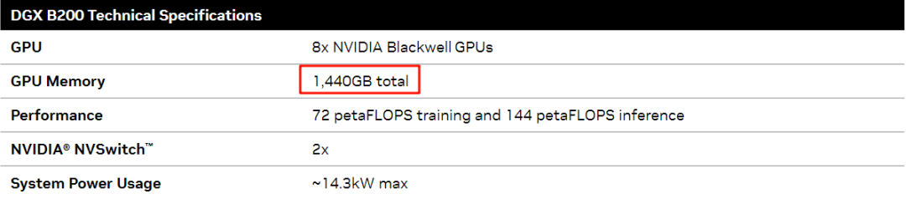
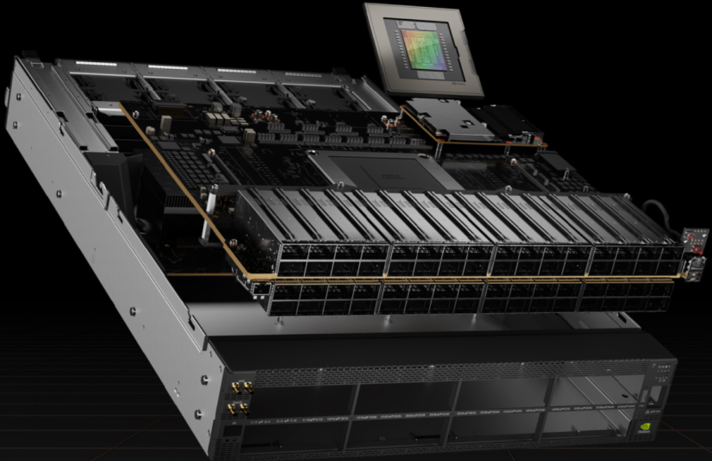
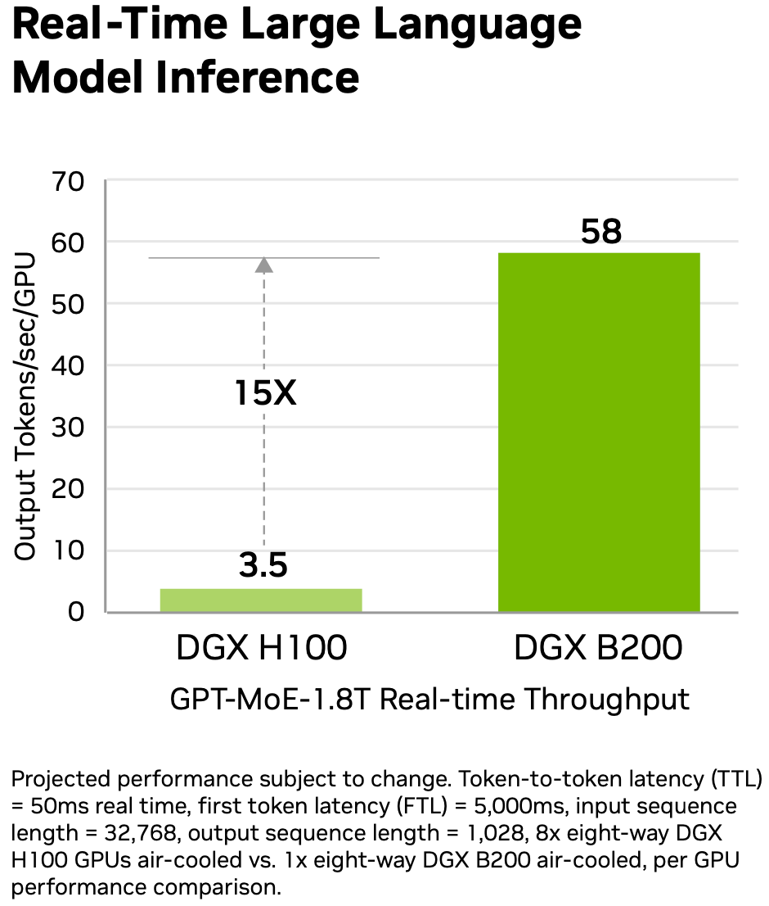

# 全面解析 NVIDIA 最新硬件：B100/B200/GH200/NVL72/SuperPod 等

**作者：** AI闲谈

---

一、概览

我们之前已经简单介绍过 NVIDIA 最新的 Blockwell GPU，但是部分内容可能容易引起误解，比如 NVIDIA 官方的一些介绍中也存在歧义或者概念模糊的地方；此外看到部分地方误解了新一代 GPU 的能力，比如认为其有几十倍的性能提升，因此我们决定综合汇总一下各方面的数据，以便大家进行更充分、更公平的对比。

本文中我们全面收集了 NVIDIA Blackwell GPU 的各种硬件信息，包括 B100，B200、GH200 和 NVL72，SuperPod-576 等，以及相应的 ConnectX-800G网卡、网络交换机等，并进一步与之前的系列进行了对比。需要说明的是，文中也有部分内容是我们根据各方信息推测的数据，比如几个表格里的红色部分，最终数据还是以官方的白皮书为准（目前还没看到）。此外，这里也不包含软件生态相关内容。之前的介绍可以参考：
- [GPU 关键指标汇总：算力、显存、通信](http://mp.weixin.qq.com/s?__biz=Mzk0ODU3MjcxNA==&mid=2247484942&idx=1&sn=2b69b610d4dacdc372036916d4c91325&chksm=c364c14bf413485d01b3d766d47ecfa170bef6451a97f981d1dc0d0261e23ec088961f423db1&scene=21#wechat_redirect)
- [NVIDIA 最新 GPU 解读：GB200、NVL72、SuperPod-576GPU](http://mp.weixin.qq.com/s?__biz=Mzk0ODU3MjcxNA==&mid=2247486291&idx=1&sn=9be7845ca2ce03a9b15cdc9848d70cef&chksm=c364cc16f41345001e83efda84a5f5594b3b2397712c11360db4c9bd8fabc77af0f8e6dca4af&scene=21#wechat_redirect)

### 1.1 演进

NVIDIA 在 2024 年 3 月 19 日发布了最新的 Blackwell 架构 GPU，其中最主要的是发布了 B200、B100 以及 GB200 GPU，以及相应的 GB200-NVL72 和 GB200-SuperPod。各种 GPU 的关系如下图所示，在后续的章节中具体展开。

### 1.2 单 GPU

如下图表所示为 Ampere、Hopper 以及最新的 Blackwell 系列最强的 GPU，可以看出，不管是显存、算力还是 NVLink 都是在逐渐增强（PS：实际上 NVIDIA 还出了一个特殊的方案，两个 H100 PCIe 版本通过 NVBridge 连接在一起，称为 H100 NVL，因为实际还是两个 GPU，这里不再具体介绍。）。

- A100 -> H100 FP16 稠密算力增加到 3 倍多，而功耗只从 400w 增加到 700w。
- H200 -> B200 FP16 稠密算力增加到 2 倍多，而功耗只从 700w 增加到 1000w。
- B200 FP16 稠密算力是 A100 的 7 倍左右，而功耗只是其 2.5 倍。
- Blackwell GPU 支持 FP4 精度，其算力为 FP8 的两倍，NVIDIA 的报告中有部分数据是用 FP4 算力和 Hopper 架构的 FP8 算力比较的，因此加速比会更夸张。
- 需要说明的是：
- GB200 采用的是 Full B200 芯片，而 B100 和 B200 为相应的阉割版。

### 1.3 HGX 服务器

HGX 是 NVIDIA 出的高性能服务器，通常一台机器包含 8 个或 4 个 GPU，通常会搭配 Intel 或 AMD CPU，并且使用 NVLink 和 NVSwitch 实现全互联（8 个 GPU 通常也是除 NVL 和 SuperPod 之外的 NVLink 全互联上线），而且一般会采用风冷散热。

- 从 HGX A100 -> HGX H100 和 HGX H200，其 FP16 稠密算力增加到 3.3 倍，而功耗不到原来的 2 倍。
- 从 HGX H100 和 HGX H200 -> HGX B100 和 HGX B200，其 FP16 稠密算力增加到 2 倍左右，而功耗相当，最多不到 50%。
- 需要说明的是：
- HGX B100 和 HGX B200 的网络基本没有升级，IB 网卡还是 8x400Gb/s。

### 1.3 NVL & SuperPod

NVIDIA 除了 HGX 系列 GPU 服务器外，还有整机柜和集群的方案，使用的都是最新的 Grace CPU + GPU 方案，对应的也都是液冷系统。如下表所示为 Hopper 架构和 Blackwell 架构的对应的 NVL 机柜和 SuperPod。

- NVL32 -> NVL72，GPU 数目从 32 增加到 72，FP16 稠密算力从 32P 增加到 180P，将近 6 倍，而功耗也从 40kw（没有看到具体数字，为推测的数据） 增加到 120kw，将近 3 倍。
- GH200 SuperPod -> GB200 SuperPod，GPU 数目从 256 增加到 576，FP16 稠密算力从 256P 增加到 1440P，将近 6 倍，相应的功耗没有查到具体数字。
- 在 NVL72 和 GB200 SuperPod 中采用了最新的 ConnectX-8 IB 网卡，相应的带宽为 800Gb/s。而 HGX B100 和 HGX B200 中使用的还是 ConnectX-7 IB 网卡，相应的带宽为 400Gb/s。
- 需要说明的是：
- NVIDIA 介绍 GB200 SuperPod 由 8 个 NVL72 组成，而 GH200 SuperPod 并不是由 8 个 NVL32 组成的。
- GB200 SuperPod 中的 L1 NVSwitch Tray 和 L2 NVSwitch Tray 个数并没有看到具体数字，为推算的数据。

## 二、Blackwell GPU

Blackwell GPU 和 H100 GPU 都采用台积电 4N 工艺，H100 包含 800 亿晶体管，Blackwell GPU 包含 2080 亿晶体管。不过 H100 是单 Die（单个完整的半导体单元） 封装方式，而 Blackwell GPU 封装了 2 个 Die。每个 Die 的算力大概是 H100 的 1.25 倍，两个 Die 加起来为 H100 的 2.5 倍左右。从晶体管的数量也可以看出。两个 Die 之间的通信带宽为 10TB/s。

显存采用的是 HBM3e，每片的大小为 24GB，理论带宽上限为 1.2TB/s，实际为 1TB/s，整个 Blackwell 上有 8 个。

总的来说，一个完整的 Blackwell GPU 信息如下：

- 稀疏算力（稠密算力 * 2）
- FP16：5P FLOPS（2 * 2.5P）
- FP8/FP6/INT8：10P FLOPS（2 * 5P）
- FP4：20P FLOPS（2 * 10P）
- 显存：
- 大小：192GB（8 * 24GB）
- 带宽：8TB/s（8 * 1TB/s）

## 三、GH200 & GB200

### 3.1 GH200

GH200 是 NVIDIA 去年发布的 H200 GPU 与 Grace CPU 的结合体，一个 Grace CPU 对应一个 H200 GPU，H200 GPU 的显存可以达到 96GB 或 144GB。Grace CPU 和 Hopper GPU 之间通过 NVLink-C2C 互联，带宽为 900GB/s。除了 HBM3e 之外，Grace CPU 还外接了 480GB 的 LPDDR5X，不过相应的带宽也更低一些，只有 500GB/s。

### 3.2 GB200

和 GH200 不同，一个 GB200 由 1 个 Grace CPU 和 2 个 Blackwell GPU 组成，相应的 GPU 算力和显存都加倍。CPU 和 GPU 之间依然通过 900GB/s 的 NVLink-C2C 实现高速互联。对应的功耗为 1200w。

包含 384 GB HBM3e 显存，以及同样的 480GB LPDDR5X，总的 Fast Memory 为 384GB + 480GB=864GB。

## 四、HGX H100/H200 和 HGX B100/B200

### 4.1 HGX H100 和 HGX H200

如下可以看出，H200 相比 H100 的算力一样，只是显存更大，8 GPU 最大显存从 640GB 增加到 1.1TB。8 GPU 的 稀疏 FP16 算力都为 16P，稀疏 FP8 为 32P。对应的 GPU-to-GPU 通信带宽都为 900GB/s。

### 4.2 HGX B100 和 HGX B200

B100 和 B200 分别与之前的 H100 和 B200 对应，都是不带 Grace CPU 的版本，可以配合 Intel CPU 或 AMD CPU 使用。

B100 和 B200 的显存相比 H100 和 H200 都大，8 GPU 最大可支持 1.5TB 显存（PS：NVIDIA 官网早期显示 1.4TB 显存，与 192GB*8 对不上，后期修正为 1.5TB，而 DGX B200 datasheet 明确写了 1440GB，单个 180GB）。

B100 的算力大概是 B200 的 3/4。8xB100 的稀疏 FP16 算力为 28P，8xB200 的稀疏 FP16 算力为 36P，可见 8xB200 的稀疏 FP16 算力为 8xH100/H200 的 2.25 倍。相当于单个 B200 的稀疏 FP16 算力为 4.5P。需要说明的是：B200 算力其实只是 Full B200（GB200 中） 算力的 90%。

如下图所示为DGX B200 datasheet 数据（NVIDIA DGX B200 Datasheet）

Blackwell 的 Tensor Core 相比 Hopper 添加了对 FP6 和 FP4 的支持，从上图也可以看出其 FP4 算力为 FP8 算力 2 倍，FP16 算力 4 倍。而 Blackwell 的 CUDA Core 不再支持 INT8。此外，从 Hopper 开始都不再支持 INT4。

Blackwell 的 Tensor Core 添加了对 Microscaling 数据格式的支持，可能也是通过这种方式支持了 FP8、FP6、FP4 和 INT8：

如下图 Table 1 所示为 Microscaling 规范的格式类型：

## 五、NVLink 和 NVSwitch

### 5.1 第三代 NVSwitch

如下图所示，第 3 代 NVSwitch 包含 64 个 NVLink Port，每个 Port 对应 2 个 lane。支持的带宽上限为 64*50GB/s=3.2TB/s。

### 5.2 第四代 NVSwitch

如下图所示，NVSwitch Chip 上有 72 个 NVLink Port，每个 Port 2 个 lane，双向带宽为 2 x 2 x 200 Gb/s = 100GB/s，72 个 Port 对应 7.2TB/s。图中的 1.8TB/s 的 NVLinks 实际对应 18 个 Port。

B100 和 B200 使用的第 5 代 NVLink 和第 4 代 NVSwitch。第 5 代 NVLink 的每个 GPU 上依然有 18 个 NVLink，不过单 Link 双向带宽从 H100 的第 4 代 NVLink 的 50GB/s 升级到 100GB/s。所以 B100 和 B200 的 GPU-to-GPU 带宽上限为 1.8TB/s。

第 4 代 NVSwitch 的 GPU-to-GPU 带宽同样扩大一倍，变为 1.8TB/s。最多可以支持 576 个 GPU，所以总的带宽上限可达 576*1.8TB/s=1PB/s。

## 六、网卡和网络交换机

### 6.1 ConnectX-8 IB 网卡

NVIDIA 同样发布了新一代的 IB 网卡 ConnectX-8（ConnectX-800G），相应的通信带宽为 800Gb/s。而之前 H100 和 H200 采用的为 ConnectX-7 网卡，对应的通信带宽为 400Gb/s；A100 采用的 ConnectX-6 网卡的通信带宽为 200Gb/s。

不过 NVIDIA 并没有在 HGX B100/B200 中采用新的 ConnectX-800G 网卡，依旧使用的上一代 ConnectX-7，如下图所示（NVIDIA Launches Blackwell-Powered DGX SuperPOD for Generative AI Supercomputing at Trillion-Parameter Scale 和 NVIDIA Blackwell Platform Arrives to Power a New Era of Computing）。

### 6.2 BlueField-3 DPU/SuperNIC

BlueField-3 支持以太网和 IB 连接，速度高达 400Gb/s，可以与网络、存储等硬件加速器结合，并通过 NVIDIA DOCA 编程。借助 BlueField-3，有了对应的 BlueField-3 DPU 和 BlueField-3 SuperNIC。其中 BlueField-3 SuperNIC 可以在 GPU 服务器间提供以太网远程直接内存访问（RoCE），速度高达 400Bb/s，支持单 Port 400Gb/s，或双 Port 各 200Gb/s。而上一代的 BlueField-2 SuperNIC 只能支持单 Port 200Gb/s，或双 Port 各 100Gb/s。

### 6.3 Quantum-X800 IB 交换机

Quantum-X800 是新一代的 NVIDIA Quantum IB 交换机，可以以超低延迟实现 800Gb/s 的端到端连接，主要支持 NVIDIA ConnectX-8 网卡。相应的 Quantum-X800 Q3400-RA 交换机（4U）可以提供 144 个 800Gb/s 的 Port，如下图所示，其采用风冷散热，也可以支持液冷：

### 6.4 Spectrum-X800 以太网交换机

Spectrum-X800 是新一代的 NVIDIA Spectrum 以太网交换机，包含 SN5600 和 SN5400 两个类型，都采用 2U 设计。

如下表所示，SN5600 最高可支持单 Port 800Gb/s，对应 64 个 Port，总带宽 51.2Tb/s；而 SN5400 最高可支持单 Port 400Gb/s，对应 64 个 Port，总带宽 25.6Tb/s。

## 七、GH200 NVL32 & GH200-SuperPod

### 7.1 GH200 Compute Tray

GH200 Compute Tray 是基于 NVIDIA MGX 设计（大小为 1U），每个 Compute Tray 上有 2 个 GH200，也就是 2 个 Grace CPU 和 2 个 H200 GPU。

### 7.2 NVSwitch Tray

第一代 NVSwitch Tray 包含 2 个第 3 代 NVSwitch 芯片，总共 128 个 NVLink Port，通信带宽上限为 6.4TB/s。

### 7.3 GH200 NVL32

一个机柜中有 16 个 GH200 Compute Tray 和 9 个 NVSwitch Tray，因此总共包含 32 个 GH200 GPU 以及 18 个 NVSwitch。实际上 32 个 GH200 有 32x18=576 个 NVLink，按道理只需 576/64=9 个 NVSwitch 即可以实现全互联，不过这里包含了 18 个 NVSwitch。

### 7.4 GH200 SuperPod

GH200 SuperPod 由 256 个 GH200 GPU 实现全互联，但并不是由 8 个 NVL32 组成的，而是由 32 个 8-Grace Hopper Superchip 组成。

如下图 Figure 7 所示，每个 8-Grace Hopper Superchip 包含：

- 8 个 Hopper Compute Tray（8U），每个包含：
- 1 个 GH200 GPU
- 1 个 ConnectX-7 IB 网卡，400Gb/s
- 1 个 200 Gb/s 以太网卡
- 3 个 NVSwitch Tray（3U），共 6 个 NVSwitch

对应的 NVLink 连接如下图 Figure 6 所示，每个 GH200 和每个 NVSwitch 上有 3 个 NVLink 连接，该方向每个 NVSwitch 上使用了 24 个 Port；此外，每个 NVSwitch 还会有 24 个 Port 与 L2 NVSwitch 相连。相当于每个 NVSwitch 使用了 48 个 Port。（PS：这里的 NVSwitch 上的 Port 有一部分是冗余的，理论上只需要 8*18/(64/2)=4.5 个 NVSwitch，所以选择了 3 个 NVSwitch Tray）

如下图 Figure 8 所示，GH200 SuperPod 由 32 个 8-Grace Hopper Superchip 组成，L1 包含 32 x 3=96 NVSwitch Tray（192 个 NVSwitch），L2 包含 36 个 NVSwitch Tray（64 个 NVSwitch）。每个 L1 NVSwitch Tray 中有 24 x 2=48 个 Port 与 L2 NVSwitch Tray 相连，因此需要 96x48/(64*2)=36 个 L2 NVSwitch Tray。

如下图 Figure 12 所示，256 个 GH200 同样会通过两级 IB 交换机互联：

GH200 SuperPod 完整的连接方式如下图 Figure 5 所示：

## 八、GB200 NVL72 & GB200 SuperPod

### 8.1 GB200 Compute Tray

GB200 Compute Tray 也是基于 NVIDIA MGX 设计的（大小为 1U），一个 Compute Tray 包含 2 个 GB200，也就是 2 个 Grace CPU、4 个 Blackwell GPU。如下图所示：

每个 GB200 Compute Tray 支持 1.7TB Fast Memory（PS：图中 HBM3e 应该是笔误，是 Fast Memory，更不是 HMB3e），如果说的是每个 Blackwell 上的显存的话应该是 192GBx4=768GB，这里说的 1.7TB 应该是包含了每个 GB200 上额外的 480GB LPDDR5X，相加起来为 768GB + 480GBx2=1728GB 也对得上：

### 8.2 NVSwitch Tray

如下图所示，新一代 NVSwitch Tray 同样包含 2 个 NVSwitch 芯片（大小为 1U），共包含 144 个 NVLink Port（单 NVSwitch 芯片 72 NVLink Port），单 Port 的带宽为 100GB/s，支持的带宽上限为 14.4TB/s。第四代 NVSwitch System 可以支持多达 576 个 GPU，所以总的带宽上限可达 576*1.8TB/s=1PB/s。（PS：图中的 8 ports 并不是 NVLink Port，实际每个对应 18 个 NVLink）

如下所示为 NVL72 中使用的 NVSwitch System，包含 9 个 NVSwitch Tray，图中的 72 ports 也是对应上图中的 ports，并不是 NVLink Port，对应的带宽为 1.8TB/s（18 个 100GB/s 的 NVLink）。

### 8.3 GB200 NVL72

一个 GB200 NVL72 包含 18 个 GB200 Compute Tray，所以包含 36 个 Grace CPU，72 个 GPU，对应的显存为 72*192GB=13.8TB，CPU 对应的 Fast Memory LPDDR5X 为 480GB x 36 = 17TB，所以总的 Fast Memory 为 30TB。此外还包含 9 个 NVSwitch Tray。

实际上 NVIDIA 也提供了 NVL36 的配置，还是 18 个 GB200 Compute Tray，但是每个 GB200 Compute Tray 中只放一个 GB200，也就是总共 18 个 Grace CPU 和 36 个 B200 GPU。

对应的算力如下图所示：

所以这里的 30TB HBM3e 应该也是 13.5 TB HBM3e + 17TB LPDDR5X：

### 8.4 GB200 SuperPod

GB200 SuperPod 由 8 个 NVL72 组成，共 576 个 Blackwell GPU，要实现其全互联， 和上一代 256 个 GH200 全互联类似，需要两级 NVSwitch Tray（理论带宽上限为 576*1.8TB/s=1PB/s）：

- 第一级 NVSwitch Tray 的一半 Port 连接 576 个 Blackwell GPU，所以需要 576 * 18/(144/2)=144 个 NVSwitch Tray（剩余 144 * 72 个 Port）。
- 第二级 NVSwitch Tray 的 Port 全部与第一级剩余的 NVSwitch Port 连接，所以需要 144 * 72/144=72 个 NVSwitch Tray。第二级的每一个 NVSwitch Tray 都与第一级的所有 NVSwitch Tray 连接（每一个都有 2 个 Port 连接）。

## 九、性能数据解析

### 9.1 DGX GB200 性能

NVIDIA 声称 DGX B200（对应 HGX B200）相比上一代 DGX H100（HGX H100）的训练性能提升 3 倍，推理性能提升 15 倍，其实是有一定前提条件的。单从 HGX H100 -> HGX B200 的 FP16 或者 FP8 算力来看，算力提升 2.25 倍，但显存更大一些，显存带宽也达到 2.3 倍 左右，此外，NVLink 也加倍，所以整体训练速度提升 3 倍也符合预期。

如下图所示，3 倍训练速度是在 4096 台 HGX B200 和 4096 台 HGX H100 上测量的，训练的是 GPT-MoE-1.8T 模型：

如下图所示，15 倍推理速度是在 8 台 HGX B200 和 8 台 HGX H100 上测量的，使用 GPT-MoE-1.8T 模型进行推理（GPT 模型推理通常是 IO Bound，显存带宽很重要；为了支持更高并发，显存大小也很重要；此外模型比较大，通常会采用 Tensor Parallel 等策略，NVLink 带宽也很重要），分别获得 3.5 Token/s 和 58 Token/s。GPT 推理的影响因素很多，对于这两个设备来说是由以下几个方面共同决定的：

- 显存带宽（8x3.35TB/s -> 8x8TB/s）
- 显存大小（8x141GB -> 8x192GB）
- NVLink 带宽（7.2TB/s -> 14.4TB/s）
- 算力加倍（16P -> 36P）
- FP8 -> FP4 （x2）

如下图所示，老黄在 GTC 的主题演进中给出了更精细的对比，可以看出，使用 B200 FP8 和 H200 FP8 对比时提升也只在 3 倍左右（其中的 TP、EP、DP、PP 分别对应张量并行、专家并行、数据并行和流水线并行），使用 GB200 在 FP4 下的提升非常明显（PS：可能是使用了 NVL72 中的 NVLink 全互联）：

### 9.2 GPT-MoE-1.8T 训练功耗

老黄在 GTC 的主题演讲中介绍到训练 GPT-MoE-1.8T 模型的功耗，并对比了 Hopper 和 Blackwell GPU，具体如下所示：

- 单个 NVL32 机柜是 40kw，8000GPU 大概对应 8000/32*40kw=10MW，加上其他功耗可能在 15MW 左右。
- 单个 NVL72 机柜是 120kw，2000GPU 大概对应 2000/72*120kw=3.3MW，还有其他的功耗，比如网络交换机等，基本能对应 4MW 左右。

## 十、参考链接

1. https://www.nvidia.com/en-us/data-center/gb200-nvl72/
2. https://www.nvidia.com/en-us/data-center/hgx/
3. https://developer.nvidia.com/blog/nvidia-gb200-nvl72-delivers-trillion-parameter-llm-training-and-real-time-inference/
4. https://www.nextplatform.com/2022/03/23/nvidia-will-be-a-prime-contractor-for-big-ai-supercomputers/
5. https://developer.nvidia.com/blog/upgrading-multi-gpu-interconnectivity-with-the-third-generation-nvidia-nvswitch/
6. https://www.theregister.com/2024/03/21/nvidia_dgx_gb200_nvk72/
7. https://developer.nvidia.com/blog/one-giant-superchip-for-llms-recommenders-and-gnns-introducing-nvidia-gh200-nvl32/
8. https://www.youtube.com/watch?v=Y2F8yisiS6E&list=TLGGFIbdOwQMZx4yNTAzMjAyNA&t=1684s

