# 剖析大规模 GPU 集群：针对 LLM 场景的挑战和优化

**作者：** AI闲谈

---

## 一、背景

我们之前详细介绍过在千卡和万卡 GPU 集群中预训练 LLM 的挑战，其简单来说可以总结为几点：1. 优化分布式策略，提升 MFU；2. 异步 Checkpointing，增加 Checkpointing 频率，减少无效计算；3. 完善的故障诊断及任务恢复机制；4. 监控和 Profiling 方案。

然而，在整个 LLM 的开发周期中，除了预训练外还有很多其他阶段，比如数据准备，微调以及模型评估等，如下图 Figure 1 所示。这里我们介绍一篇上海 AI Lab 等团队的工作，其从整个 LLM 集群的角度来揭示大规模 LLM GPU 集群与传统 DL 集群的差异，以及相应的优化工作。

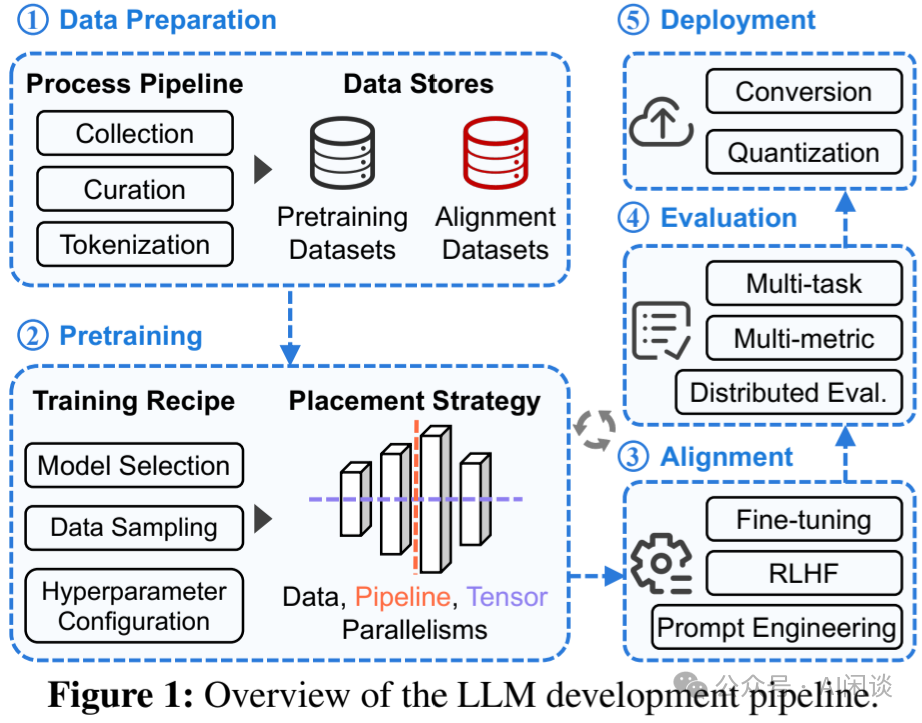

对应的论文为：[2403.07648] Characterization of Large Language Model Development in the Datacenter

我们之前的相关介绍可以参考：

- [万卡 GPU 集群互联：硬件配置和网络设计](http://mp.weixin.qq.com/s?__biz=Mzk0ODU3MjcxNA==&mid=2247486775&idx=1&sn=abf7af24181cf5189e113fb161cc8d30&chksm=c364ca72f4134364f4e3fa4a971f767c2b07e6c2cae38c2a4ae28071fd330abaea68c36542c4&scene=21#wechat_redirect)
- [万卡 GPU 集群实战：探索 LLM 预训练的挑战](http://mp.weixin.qq.com/s?__biz=Mzk0ODU3MjcxNA==&mid=2247486852&idx=1&sn=9f9dc1df99ab6aafb28e091f4532b89e&chksm=c364cac1f41343d7b10d9d234d1c7f3371d996afda01cb94d294a38cba4f1a14fe4594992aa2&scene=21#wechat_redirect)
- [阿里 C4：通信驱动加速大规模并行训练效率](http://mp.weixin.qq.com/s?__biz=Mzk0ODU3MjcxNA==&mid=2247487014&idx=1&sn=c49df9bd2de03acfae39bf4dce1c84b6&chksm=c364c963f4134075edee235c744c68c3f411ac7cdd1b9847de9333169292ff375a56c7d8ebd0&scene=21#wechat_redirect)

## 二、摘要

大型语言模型 （LLM） 的表现令人印象深刻，然而，高效利用大规模集群资源开发 LLM 并非易事。因为 LLM 往往面临许多挑战，例如频繁的硬件故障、复杂的并行化策略和资源利用率不平衡。本文中，作者追踪了内部 Acme GPU 集群为期 6 个月的工作负载，并进行了深入的分析。具体来说，作者首先将 LLM 与之前传统 LLM 的工作负载进行对比，并揭示了针对 LLM 系统的潜在机会。此外，作者还介绍了相关的系统：（1）容错预训练，涉及 LLM 的故障诊断和自动恢复来增强容错能力。（2）评估中的调度解耦，通过分解和调度优化实现及时的性能反馈。

## 三、引言

### 3.1 集群配置

作者的 Acme 中包含 2 个 GPU 集群，都是单节点包含 8 个 NVIDIA A100 SXM 80GB GPU 以及 2 个 Intel Xeon Platinum 8358P CPU，并且都通过 NVLink + NVSwitch 实现全互联。

- Seren 集群建设比较早，单节点只用 1 个 200Gbps 高速 IB 网卡，Seren 集群总共包含 286 个节点，总共 2288 个 A100 GPU；（PS：机器之间没有高速网络互联，感觉不太适合大规模分布式训练，常见解决方案为 4*200Gbps 或 8*200Gbps）
- Kalos 集群比较新，单节点使用 5 个 200Gbps 高速 IB 网卡，其中 4 个用于后向的 GPU 传输，1 个专用于高性能的存储。总共 302 个节点，2416 个 A100 GPU。

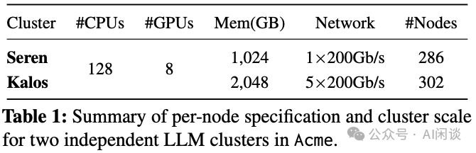

Seren 和 Kalos 两个集群都是用于训练场景的，不涉及任何的 Serving 任务。

### 3.2 Acme Tracing

作者追踪了两个集群从 2023.03 到 2023.08 之间共 6 个月的任务，Seren 总共包含 368K 个 CPU 任务，664K 个 GPU 任务；Kalos 包含了 42K 个 CPU 任务和 20K 个 GPU 任务。收集的数据源主要包含 4 个部分：

- 任务信息：主要包括任务调度相关信息，比如提交时间、启动时间、结束时间，以及最终的状态信息，比如完成、失败、取消，以及相关的资源信息等，比如 CPU、GPU、Memory 等。
- 硬件监控数据：比较 CPU、GPU 利用率，内存、显存占用，网络占用，以及电源相关信息。
- 运行时日志：主要是任务运行中 stdout，stderr 信息，以及 debug 信息等。
- 剖析数据：主要是使用 DCGM 等工具剖析的细粒度数据。

### 3.3 GPU 利用率

对于大规模 LLM 预训练任务而言，其往往需要大量 GPU，任何的 GPU 计算和 NCCL 通信都会占用 GPU，导致 GPU Utilization 很高，往往能达到平均 95% 以上。因此，其往往导致整个 GPU 集群的 GPU Utilization 很高，需要更细力度的监控指标来显示 GPU 的利用情况。

#### 3.3.1 GPU Utilization

对应 DCGM 的 DCGM_FI_PROF_GR_ENGINE_ACTIVE，表示在一个时间间隔内 Graphics 或 Compute 引擎处于 Active 的时间占比。Active 时间比例越高，意味着 GPU 在该周期内越繁忙。该值比较低表示一定没有充分利用 GPU，比较高也不意味着已经充分利用 GPU。如下图所示，表示几个 GPU 的 Utilization 到了 80%-90% 左右：

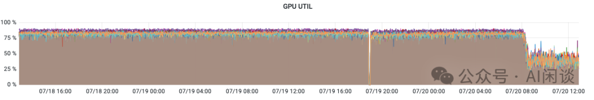

#### 3.3.2 GPU SM Active

对应 DCGM 的 DCGM_FI_PROF_SM_ACTIVE，表示一个时间间隔内，至少一个 Warp 在一个 SM 上处于 Active 的时间占比，该值表示所有 SM 的平均值，对每个 Block 的线程数不敏感。该值比较低表示一定未充分利用 GPU。如下为几种 Case（假设 GPU 包含 N 个 SM）：

- Kernel 在整个时间间隔内使用 N 个 Block 运行在所有的 SM 上，对应 100%。
- Kernel 在一个时间间隔内运行了 N/5 个 Block，该值为 20%。
- Kernel 有 N 个 Block，在一个时间间隔内只运行了 1/4 时间，该值为 25%。

如下图所示为几个 GPU 的 SM Active，可见只有 60% 左右，还有一定提升空间：

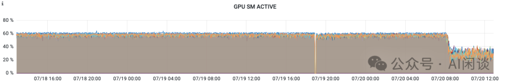

#### 3.3.3 GPU SM Occupancy

对应 DCGM 的 DCGM_FI_PROF_SM_OCCUPANCY，表示一个时间间隔内，驻留在 SM 上的 Warp 与该 SM 最大可驻留 Warp 的比例。该值表示一个时间间隔内的所有 SM 的平均值，该值越高也不一定代表 GPU 使用率越高。

如下图所示为几个 GPU 的 SM Occupancy，只有 20% 多：

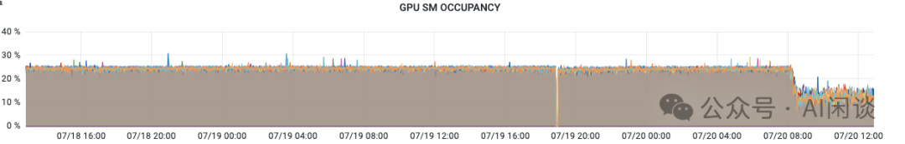

#### 3.3.4 实验

如下图所示，我们在 T4 GPU（包含 40 个 SM） 上通过一个小的实验来说明几个指标的关系：

- 当只有 1 个 Block，1 个 Thread 时，GPU Util 也是 100%，因为 GPU 一直在占用，此时 40 个 SM 中只有 1 个一直 Active，所以 SM Active 为 2.5%。
- 当有 40 个 Block，每个 Block 1 个 Thread 时，GPU Util 为 100%，SM Active 也为 100%，因为每个 Block 都会占用一个 SM。
- 当有 40 个 Block，每个 Block 128 个 Thread 时，GPU Util 为 100%，SM Active 也为 100%，因为每个 Block 都会占用一个 SM。此时 SM Occupancy 到了 12.5%。

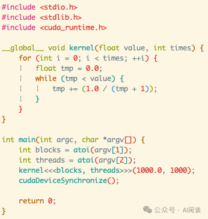

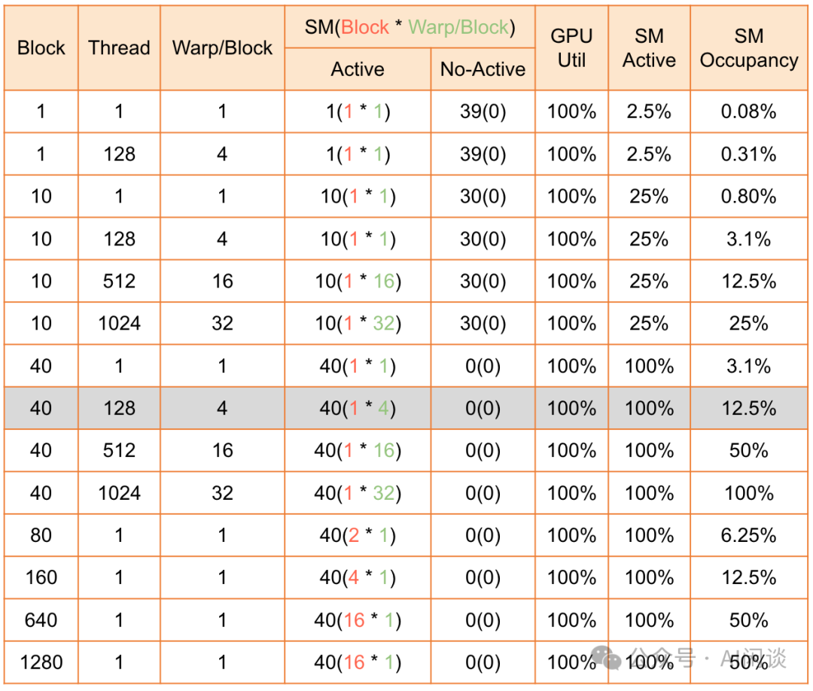

## 四、数据中心刻画

### 4.1 LLM 与传统 DL 任务工作负载对比

如下图 Table 2 所示为 3 个传统 DL 任务（Philly、Helios、PAI）与 LLM 任务（Acme）的集群和任务信息：

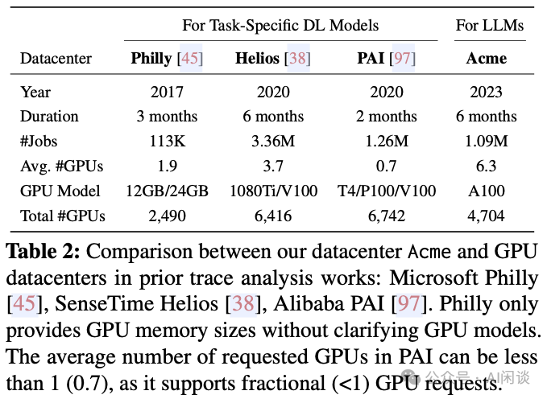

更短的任务时间：如下图 Figure 2(a) 所示为相关任务的 GPU 时间累积分布（Duration CDF）。可以看出，Seren 和 Kalos 中的 Duration 中位数为 2 分钟，比其它集群短 1.7-7.2 倍。出现这个现象可能有几方面的原因：

- 硬件升级：比如 GPU，网络升级，任务执行更快。
- 资源滥用：用户通常会申请过多的资源。
- 额外关联的工作负载：比如 LLM 开发 Pipeline 中通常会有很多小的评估任务。
- 失败率高：大约 40% 的任务失败，完成的任务值只消耗了 20%-30% 的 GPU 资源。

两极化的 GPU 利用率：如下图 Figure 2(b) 所示为相关任务的 GPU 利用率累积分布（Utilization CDF），可以看出，Seren 和 Kalos 的 GPU 利用率中位数为 97% 和 99%，而 Philly 和 PAI 分布为 48% 和 4%。这可能是因为作者的 Seren 和 Kalos 集群中都是相似的 Transformer 类型的 LLM 任务，而 Philly 和 PAI 中有各种各样的任务。此时再用 GPU Utilization 作为利用率指标意义已经不大。可以考虑更加细粒度的 SM Active。

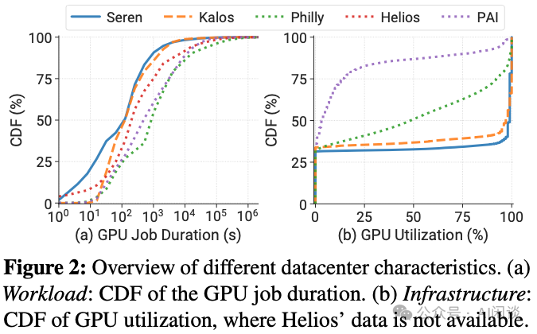

高度差异化的工作负载分布：如下图 Figure 3 所示，作者进一步探究了作业与 GPU 需求的关系。可以看出，LLM 的工作负载与传统 DL 任务很不一样，传统 DL 集群通常依赖抢占机制，但是其对 LLM 集群可能不再合适，其相应的恢复开销可能很大。

- （a）对作业数量而言，所有集群类似，只有 7% 不到的作业需要超过 8 个 GPU。
- （b）对于作业时间而言，差异很大，比如对于 Kalos 集群，大规模作业（超过 256 GPU）占据了 96% 以上的资源。

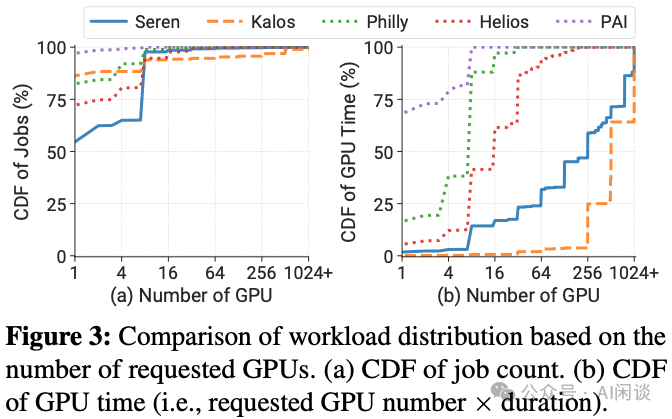

### 4.2 工作负载类别

如下图 Figure 4 所示，在 Seren 和 Kalos 集群中，一多半都是评估（Evaluation）任务，只有极少数的预训练（Pretrain）任务，但是预训练任务却又占据了绝大部分的 GPU 时间，在 Kalos 集群尤其明显。评估任务通常需要比较少的 GPU，不超过 4 个，预训练通常需要超过 100 个 GPU。评估任务通常以 Batch 方式提交，对时效性要求也不高，可以利用碎片资源。

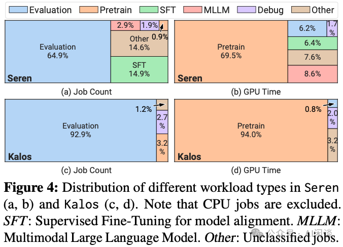

## 五、工作负载剖析

### 5.1 预训练工作负载剖析

针对 LLM 预训练，作者也开发了相应的分布式训练框架 [2401.09149] InternEvo: Efficient Long-sequence Large Language Model Training via Hybrid Parallelism and Redundant Sharding，其包含 V1 和 V2 两个版本，如下图 Figure 10 所示为使用 2048 GPU 训练 123B LLM 时的 SM Active：

- V1：3D Parallelism，4PP，8PP，SM Active 中存在很多空隙，整体利用率不高。
- V2：Hierarchical ZeRO 版本，每个 subgroup 包含 64 GPU，并且使用了重计算，其 SM Active 明显提升。相比 V1 版本，任务提速 16%。

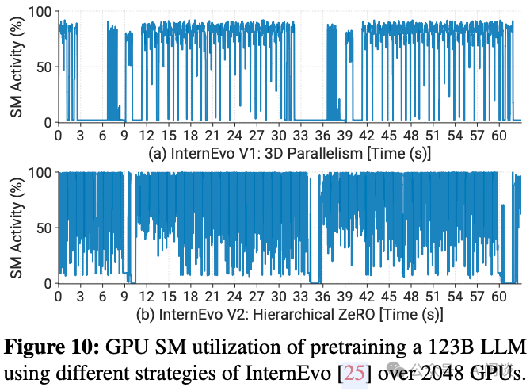

如下图 Figure 19 所示，1024 GPU 时也有类似结论：

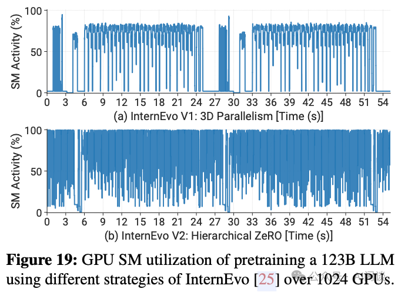

如下图 Figure 22 所示，作者也进一步评估了在 1024 GPU 上训练 Mistral 7B MoE 时的 SM Active，可以看出，其相比 Dense 模型低了很多，主要是因为 MoE 中多了很多 all-to-all 操作，而作者使用的单个 IB NIC 导致其出现瓶颈：

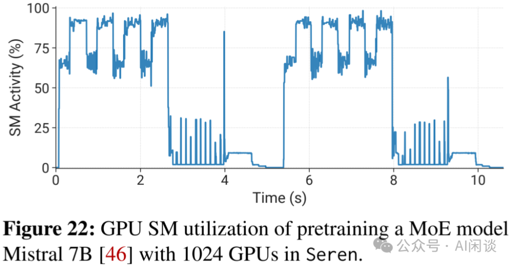

### 5.2 评估工作负载剖析

如下图 Figure 13 所示，针对每个评估任务，初始化阶段都要加载模型和进行数据预处理，这个阶段通常不需要 GPU 参与，导致此阶段 GPU 的浪费。此外，获得模型结果后还会有一定的 CPU 计算，此时 GPU 也会空闲。

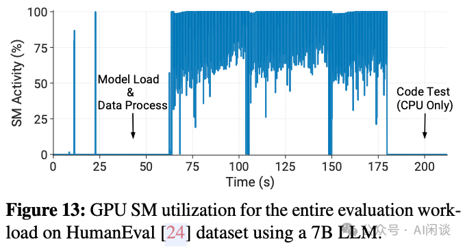

## 六、异常分析

作者统计了两个集群中的监控数据以及运行日志，以便分析异常。在 Kalos 集群中，作者收集 了 32,500 个任务，其中 31,293（96.3%）个推理任务（比如评估），647（2.0%）个预训练任务和调试任务（1.7%）。在 Seren 任务中，作者仅收集了 675 个训练任务。

### 6.1 异常类别

如下图 Table 3 所示为具体的错误类型，总共可以分为 3 类：

- Infrastructure：主要是计算平台和远程存储的问题。主要发生在作业执行中，其会影响训练进度。
- 此种异常失败的作业通常使用了大量 GPU，并且恢复的代价往往比较高。虽然失败数量上只占了 11%，但 GPU 资源（GPU 时间）上占了 82%。并且大部分是预训练任务，可能会多次遇到硬件故障，例如 GPU 问题（CUDAError、ECCError），NVLink 问题（NVLinkError）和网络问题（NCCLRemoteError、S3StoreError）。而其中的 NodeFailure 表示未知硬件问题导致的故障。解决这些问题需要细致的诊断工作，以查明根因。通常需要维护或更换有缺陷的硬件，然后重启作业。
- 作者甚至提到了高温可能导致的故障率增加，当预训练时，机房温度升高了 5 度，此外作者也发现大部分异常发生在 2023.07，是最热的月份。
- Framework：主要是几种运行错误，比如 RuntimeError、ValueError、AttributeError，主要是 Tensor 操作、Shape 以及数据类型相关，或者一系列不符合预期的行为。通常发生在作业起始阶段。
- Script：通常是用户编码错误等，通过修改代码解决。

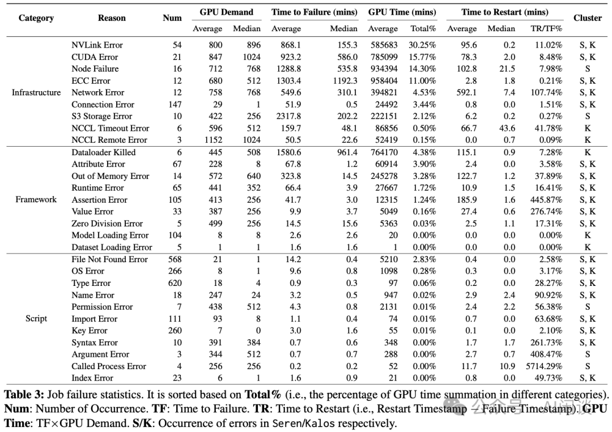

### 6.2 异常恢复

通常有三种场景需要重启任务，一种是作业发生异常，另一种是训练 loss 出现毛刺（loss 突然增加，有些会重新下降，有些不会），还有一种是作业卡住。重启需要从最新的 Checkpoint 开始，也会导致训练进度的回退；此外，在没有自动重启机制之前，都需要有人值班并手动重启。如下图 Figure 14 展示了早期的两个预训练任务，其中 104B 为原始训练框架，123B 为优化后的训练框架，允许在任务结束之前保持当前的状态，相应进度回退也更少。

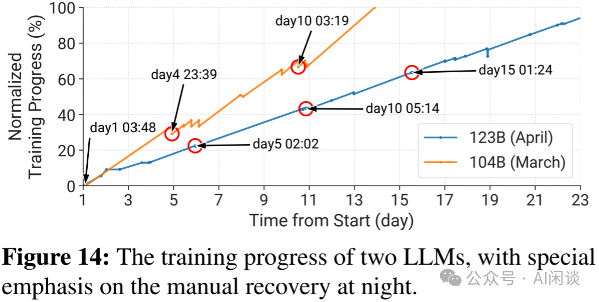

## 七、部署 LLM 系统

### 7.1 容错预训练

作者的容错系统分 3 个关键模块，如下图 Figure 15 所示为其中的异常诊断和恢复过程：

- Checkpointing：更频繁的保存 Checkpoint，以便尽可能少的训练回退。节点的 CPU 内存比较大，可以缓存多个 Checkpoint，作者会先将 Checkpoint 保存到内存中，然后使用一个独立的线程进行定期的异步保存，可以极大降低 Checkpointing 开销。通过每 30 分钟保存一次，其 7B 到 123B 模型的保存开销减少了 3.6-58.7 倍。
- Diagnosis：通过一系列手段识别任务失败的根因。通过规则匹配，向量检索，以及使用 LLM Agent 等手段来识别错误的根因。可以识别 90% 的问题，大幅降低人工成本。
- Recovery：通过一系列错误检测发现异常节点，屏蔽并自动恢复任务。如果检测是 Infrastructure 异常，则会执行一系列的异常检测，比如使用两轮 NCCL test 来识别 NVLinkError。

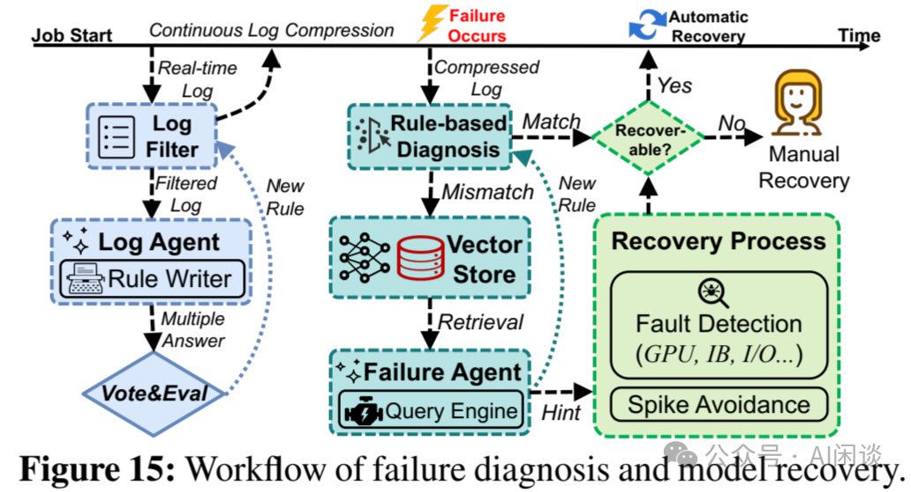

### 7.2 针对评估的解耦调度

其主要动机就是前面介绍的，评估阶段很多时间 GPU 都是空闲的，而评估任务又有很多，这导致了 GPU 资源的浪费。为此作者将相关组件解耦，以便提升 GPU 利用率：

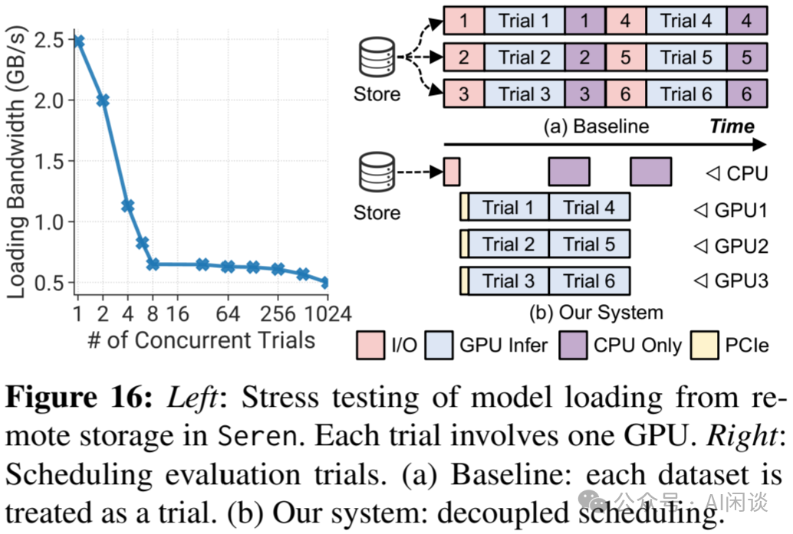

## 八、参考链接

1. https://arxiv.org/abs/2403.07648
2. https://www.alibabacloud.com/help/zh/ack/ack-managed-and-ack-dedicated/user-guide/introduction-to-metrics

