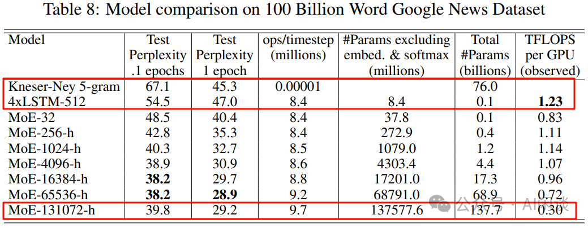
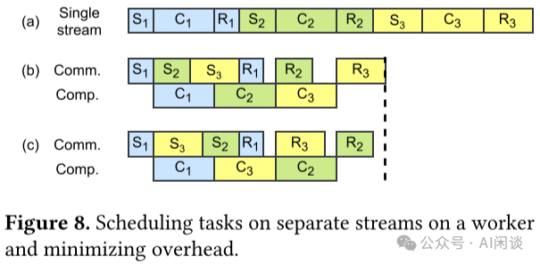
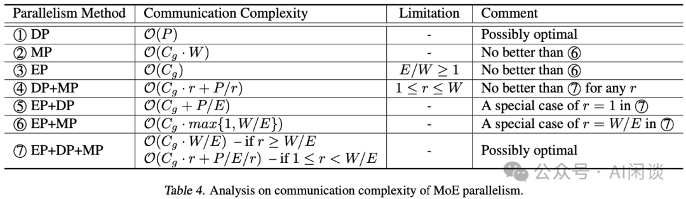
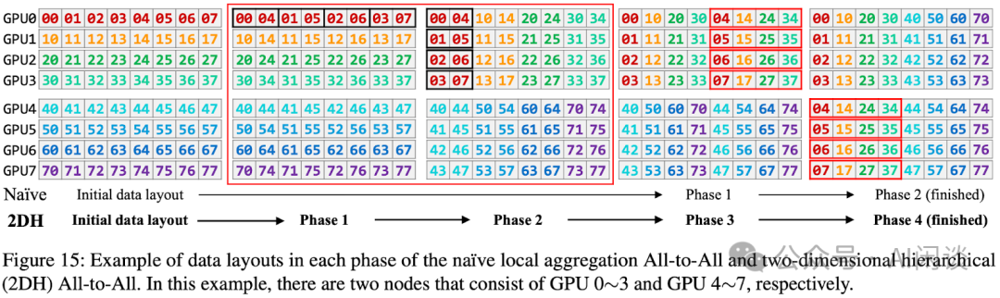

# 大规模分布式 AI 模型训练系列——专家并行

**作者：** AI闲谈

---

## 一、背景

之前的文章中我们详细介绍了大规模分布式训练中的数据并行（Data Parallelism，DP）、张量并行（Tensor Parallelism，TP）和流水线并行（Pipeline Parallelism，PP）。这篇文章中我们继续介绍 MoE 中经常使用的专家并行（Expert Parallelism，EP），以及 EP 中涉及的相关 All2All 操作和优化手段等。

本文中的很多内容在 MoE 系列论文总结中已经介绍过，这里更多的是从 EP 及实现的角度考虑。其他相关内容可以参考之前的文章：

- [大规模分布式 AI 模型训练系列——数据并行](http://mp.weixin.qq.com/s?__biz=Mzk0ODU3MjcxNA==&mid=2247487775&idx=1&sn=52981f832c8ad7c9b111e37c0e788c3a&chksm=c364d65af4135f4cc999fd39659936f42bedc7faebeb2e2a674d5feb064bf50b68a6d412b89b&scene=21#wechat_redirect)
- [大规模分布式 AI 模型训练系列——张量并行](http://mp.weixin.qq.com/s?__biz=Mzk0ODU3MjcxNA==&mid=2247487815&idx=1&sn=69601e66f3f8413b5afbd8149b989ea7&chksm=c364d602f4135f1495f0c5e52bf911b26b528bd85f2ad1d2a97d93a358592676223bb9950ee1&scene=21#wechat_redirect)
- [大规模分布式 AI 模型训练系列——流水线并行](http://mp.weixin.qq.com/s?__biz=Mzk0ODU3MjcxNA==&mid=2247487851&idx=1&sn=7e18c1e0196193157081c4954c97c1af&chksm=c364d62ef4135f386b1f93bc1cd530116cd36a9002ab2f568373a978c6573f2b57661b2e21f3&scene=21#wechat_redirect)
- [MoE 系列论文解读：Gshard、FastMoE、Tutel、MegaBlocks 等](http://mp.weixin.qq.com/s?__biz=Mzk0ODU3MjcxNA==&mid=2247486329&idx=1&sn=32935ff35dc32bb04b4e222fb9b45405&chksm=c364cc3cf413452a2205dc10400e755378c3435b0a180f3d7ba74c15d235e07af709ad61dd10&scene=21#wechat_redirect)
- [万卡 GPU 集群实战：探索 LLM 预训练的挑战](http://mp.weixin.qq.com/s?__biz=Mzk0ODU3MjcxNA==&mid=2247486852&idx=1&sn=9f9dc1df99ab6aafb28e091f4532b89e&chksm=c364cac1f41343d7b10d9d234d1c7f3371d996afda01cb94d294a38cba4f1a14fe4594992aa2&scene=21#wechat_redirect)
- [万字综述：全面梳理 FP8 训练和推理技术](http://mp.weixin.qq.com/s?__biz=Mzk0ODU3MjcxNA==&mid=2247487327&idx=1&sn=784f76c54183fd46dd7300ab7b28cfcb&chksm=c364c81af413410cd1a38f816d7591ce4b0ce38314809a0695d5d9a4b544e8cfbbe16a967cd1&scene=21#wechat_redirect)

## 二、引言

### 2.1 标准 All2All

AlltoAll 是集合通信库（比如 NCCL）中另一种常见的通信原语，用于多个设备之间进行数据交换。AlltoAlll 操作允许每个参与的设备将其本地数据分发到其他设备，同时从其他设备接收数据。

如下图所示是一种标准的 AlltoAll 操作，有 4 个 GPU，每个 GPU 包含 4 个数据。通过 AlltoAll 操作之后每个设备都将 4 个数据分发给 4 个 GPU，同时从 4 个 GPU 接收数据。可以看出，AlltoAll 很像一个矩阵的转置操作：

如下图所示为 Pytorch 实现一个上述标准 AlltoAll 的示例：

实际上 NCCL 中并没有 AlltoAll 通信原语，需要通过 ncclSend 和 ncclRecv 实现，其中 ncclSend 和 ncclRecv 是一个 P2P 通信。如下图所示，每个 Rank 都发送 nranks 块数据，同时接收 nranks 块数据就实现了 AlltoAll 的功能。（可以参考 Point-to-point communication — NCCL 2.22.3 documentation）

类似的方式就可以实现 one2all（Scatter）操作：

类似的方式也可以实现 all2one（Gather）操作：

### 2.2 非标准 All2All

实际上有些场景并非均匀发送和接收，有可能发送到不同设备的数据量不同，从不同设备接收的数据量也可能不同。Pytorch 的 “torch.distributed.all_to_all_single” 提供了 input_split_sizes 和 output_split_sizes 参数来支持：

- input_split_sizes 表示向每个设备发送的数据量。
- output_split_sizes 表示从每个设备接收的数据量。

如下图所示，4 个 GPU，每个 GPU 都包含 10 个数据：

- 4 个 GPU 都向 GPU k 发送 k+1 个数据（比如，都向 GPU 3 发送 4 个数据）。
- GPU k 从所有 GPU 都接收 k+1 个数据（比如，GPU 2 从所有 GPU 都接收 3 个数据）。

如下图所示为 Pytorch 实现一个上述非标准 all2all 的示例：

PS：需要指出的是，上述接口中 output_split_sizes 和 input_split_sizes 的个别值也可以是 0，表示不从某个设备接收，或者不向某个设备发送数据。如上所示，all2all 底层是用 ncclSend 和 ncclRecv 实现，很容易可以做到这一点。

### 2.3 两次 All2All

上述非标准 All2All 中有个问题：有些时候当前设备只知道要向其他设备发送多少数据，而并不知道需要从其他设备接收多少数据。这个问题可以通过 2 次 all2all 来解决：

- 第一次 all2all 交换要传输的数据量信息，这是一个标准的 all2all 操作，如下图红框所示。
- 第二次 all2all 根据上述获取的数据量信息来执行真正的数据传输，此时是一个非标准 all2all 操作。

## 三、Google Sparsely-Gated MoE

### 3.1 摘要

在 [1701.06538] Outrageously Large Neural Networks: The Sparsely-Gated Mixture-of-Experts Layer 中，作者（也包括大名鼎鼎的 Geoffrey Hinton 和 Jeff Dean）将 MoE 引入到 LSTM 模型中，并提出了稀疏 MoE（Sparse MoE）的概念。在 Sparse MoE 中可以包含数千个前馈子网络，并由可训练的门控网络（Gating Network）确定这些专家的稀疏组合。

作者将 MoE 应用于语言建模和机器翻译任务，在相应基准测试中，这些模型可以以较低的计算成本获得优于 SOTA 的效果。

### 3.2 方案

如下图 Figure 1 所示，作者引入了 Gating Network 机制，该机制可以选出 Topk 的 Expert（Expert 2 和 Expert n-1）进行计算。这种稀疏性意味着只有部分专家被激活处理特定的输入，从而可以大大降低计算量：

作者也进一步证明可以通过灵活控制专家数，来获得不同容量的模型。如下图 Table 8 所示，作者分别构建了 32/256/1024/4096/16384/65535/131072 个专家的模型，其最大为 137B 的 LSTM 模型。由于稀疏性的存在，虽然 137B 参数量很大，但可以比当时 SOTA 模型更低的计算成本下获得更好的效果：

### 3.3 Expert Parallelism

然而，想要高效训练上述的模型却非常有挑战，假设有 d 个设备，采用 Data Parallelism 的 Micro Batch Size 为 b，Total 的 Mini Batch Size 为 d*b。同样假设模型中有 n 个 Expert，每个 Sample 都选择 k 个激活。

基于以上条件，对于每个 DP Worker，每个 Expert 平均有 k*b/n 个 Sample。由于往往 k 远小于 n，比如 n 可以是 256/1024/4096/16K/64K/128K，而 k 只是 2 或 4，也就导致 k*b/n << b。也就是说，平均到每个 Expert 上的样本会远小于 b，这种方式很不利于模型的扩展。

作者采用了特殊的模型并行方案，不同的 DP Worker 会共享同一份 Expert 参数，非 Expert 不共享。比如说模型有 256 个 Expert，32 个 DP 的 Worker，则每个 Worker 上各有 8 个 Expert，不同 DP 的 Sample 经 Gate 后重新组合分发到对应的 Expert，此时平均每个 Expert 的 Sample 数为 d*k*b/n，只要 Mini Batch Size 大小 d*b 随着 Expert 数的增加（相当于参数量的增加）而增加，就可以保证每个 Expert 的 Sample 数为常数，对显存和带宽的需求也就基本是常数。

如下图所示，DP 为 3，Expert 个数为 9，每个 Worker 上分 3 个 Expert，而其他部分参数不共享：

## 四、Google Gshard

### 4.1 摘要

在 [2006.16668] GShard: Scaling Giant Models with Conditional Computation and Automatic Sharding 中，作者首次将 MoE 引入到 Transformer 模型中。此外，作者发布了 GShard，它由一组轻量级 API 和 XLA 编译器组成，提供了一种优雅的方式来表达各种并行计算模式，与此同时只需对模型代码进行少量的更改。使用 GShard 可以将 Transformer 模型扩展到 600B 参数，并且可以在 2048 个 TPU v3 上用 4 天训完。

### 4.2 方案

具体的方案如下图 Figure 3 所示：

- 增加 Position-wise Sparsely Gated MoE 层，将 FFN 层替换为 MoE 结构，MoE 中的每个专家都是一个 FFN（每个专家大小相同）
- Gating 模块：通过 Gating 模块将输入路由到不同的专家（Transformer 模型输入的是 Token 序列，因此每个 Token 都会通过 Gating 选择不同的专家，而不是整个序列使用相同的专家，默认为 top2）。
- Random routing：有些时候 Gating 模块得到的排名第二的专家的分数会很低，此时可以简单的忽略第二个专家。
- 并非是每一层的 FFN 都替换为 MoE，而是间隔一层替换，如果有 12 层，则只有 6 层有 MoE（通常是可配置的）。
- 采用专家并行（Expert Parallel，EP）策略，每个设备一个专家，除 MoE 之外的模型其它部分在所有设备存储一份相同的副本。（如果有 128 个专家，则使用 128 个 TPU Core；2048 个专家，则使用 2048 个 TPU Core）

PS：从上可以看出，其实与上述的 Sparsely-Gated MoE 非常类似，只是扩展到了 Transformer 模型。在 Gating 后通过 All-to-All 来分布 Token，在 Expert 后通过 All-to-All 再次重组 Token，后文详细介绍。

## 五、Switch Transformer

### 5.1 摘要

在 [2101.03961] Switch Transformers: Scaling to Trillion Parameter Models with Simple and Efficient Sparsity 中，作者相比 Gshard 等方案主要做了三点改进：简化稀疏路由、高效稀疏路由，以及增强的训练和微调技巧。通过这些手段可以降低通信和计算成本，并减轻训练的不稳定性。在相同的计算资源下，基于 T5-Base 和 T5-Large 设计的模型的预训练可以加速 7 倍。

PS：这里我们主要关注前两个改进。

### 5.2 简化稀疏路由

在 [1701.06538] Outrageously Large Neural Networks: The Sparsely-Gated Mixture-of-Experts Layer 中，稀疏专家的数目需要 > 1，在 Gshard 中作者也是使用的 top2 专家。而 Switch Transformer 中，作者发现仅使用一个专家也能保证模型的质量。这样有 3 个好处：

- Router 计算更简单，通信量也更少。
- 一个 Token 仅对应一个专家，计算量也更少。
- 平均每个专家对应的 batch size 至少可以减半。

如下图 Figure 2 所示，其模型结构和 Gshard 中类似，图中的红框和绿框是同样的 MoE，只是对应不同的输入，经 Router 后也只连接一个专家：

### 5.3 高效稀疏路由

作者采用 Mesh-TensorFlow（PS：之前的文章中介绍过），其提供和 TensorFlow 相似的 API，提供了更简单的分布式数据并行和模型并行。作者的模型主要针对 TPU 设计，其在模型训练中不支持动态 Tensor shape，也就是要求每个专家输入的 Tensor shape 是固定的。然而，路由是动态的，相应路由到每个专家的 Tensor 的 shape 也是动态的，为了解决这一问题，作者使用了专家容量（Expert Capacity），如下所示，专家容量为每个 Batch 中总的 Token 数除以专家数，然后再乘以容量因子（Capacity Factor），即可得到专家容量（每个专家对应的 Token 数）。

如下图 Figure 3 所示，有 6 个 Token，3 个专家，平均每个专家 2 个 Token：

- 容量因子为 1.0：如下图中所示，则对应的专家容量为 2：
- Expert 1 有 3 个 Token，则需要丢弃一个通过残差连接直接传到下一层。
- Expert 2 有 2 个 Token，正好。
- Expert 3 只有 1 个 Token，需要 Padding 1 个空的 Token。
- 容量因子为 1.5：如下图右所示，则对应的专家容量为 3：
- Expert 1 有 3 个 Token，正好。
- Expert 2 只有 2 个 Token，需要 Padding 1 个空的 Token。
- Expert 3 只有 1 个 Token，需要 Padding 2 个空的 Token。

从上也可以看出，容量因子越大，需要 Padding 的 Token 也就越多，无效计算越多；负载越不均衡，需要 Padding 的 Token 也就越多，无效计算越多。为了更好的负载均衡，作者同样添加了 Load Balancing Loss。

## 六、FastMoE

### 6.1 摘要

之前的高性能分布式 MoE 训练系统主要是针对 Google 的硬件（TPU）和软件（Mesh TensorFlow），并且不向公众开放，针对 NVIDIA GPU 和 Pytorch 还没有相应方案。

在 [2103.13262] FastMoE: A Fast Mixture-of-Expert Training System 中，作者提出 FastMoE，其是一个基于 Pytorch 的分布式 MoE 训练系统，并提供高度优化的高性能加速方案。该系统支持将不同的专家放置在多个节点上的多个 GPU 中，从而实现专家数量和 GPU 数量线性增加。

PS：如下图所示（来自 fastmoe/doc/readme-cn.md at master），FastMoE 主要针对的是 Expert 比较多的场景，也就是一个 GPU 上有 1 个或多个 Expert。在 2021 年底的 v0.3.0 版本中集成了 Megatron-LM，通过 Megatron-LM 的 Tensor Parallel 来实现一个 Expert 分布在不同的 GPU 上。

### 6.2 系统设计

#### 6.2.1 灵活性

FastMoE 的灵活性主要体现在以下几个方面：

- 支持任意的网络作为专家。作者对专家模块做了抽象，用户可以专注设计专家模块；此外，FastMoE 也支持将多个专家放在同一个 Worker 上。
- 针对 Transformer 模型高度优化的 FFN。尤其是当多个专家放在一个 Worker 时，常见的方式是通过 for 循环串行的执行 Worker 上的多个专家，而作者实现了并行执行不同专家的方案。（Batched Gemm）
- 插件式支持 Pytorch 和 Megatron-LM。作者对 FastMoE 进行了必要的抽象，使其很容易与其他框架集成，如下图所示为与 Megatron-LM 集成的示例：

#### 6.2.2 扩展模型容量

FastMoE 的模型并行方案。FastMoE 支持将专家分布在多个节点的多个 Worker 上，并且将不同 Worker 之间的数据通信隐藏起来，模型开发人员不用考虑。

此外，在分布式 MoE 系统中的一个主要挑战为：动态路由导致分配给不同专家的输入样本数可能存在很大的差异。作者的方案为：在 Worker 之间交换实际的数据之前，先在 Worker 之间交换大小信息，Worker 根据相应信息分配 Buffer，然后传输真实的数据。（PS：这就是 2.3 的两次 All2All 操作）

异构同步模块。模型的不同部分可能在不同的 Worker 组间重复，这非常有挑战，因为分布式模块不得不识别是否需要对参数的梯度进行同步，以及与谁同步。因此，FastMoE 引入了数据并行通信组标签：

- world：需要与所有 Worker 同步。
- data parallel：需要与模型并行组正交的数据并行组中的 Worker 同步。
- none：不需同步。

例如，无论模型并行设置如何，Gating Network 需要在所有 Worker 之间复制，因此标签为 world。注意力层可以划分为模型并行子层，因此其标签为 data parallel。每个 Worker 都包含几个特定的专家网络，其标签为 none。

### 6.3 优化激活

FastMoE 将所有输入样本一起 Batching 后发给同一个专家。由于数据表示的限制，FastMoE 使用专门开发的 CUDA Kernel 进行内存移动，以减少开销。如下图 Figure 4 所示，给定每个样本要进入的索引（Gating 输出），通过 Scatter 操作（PS：其实也是 All2All，详情看 6.5）将所有样本按照对应顺序进行排布，执行完专家计算之后，再按照相反的 Gather 操作（PS：其实也是 All2All，详情看 6.5）进行复原。（gate output 应该为 0, 1, 2, 1, 1, 0 ?）

### 6.4 多 CUDA Stream 调度

如下图 Figure 8 所示，S 表示 Send，R 表示 Receive，C 表示 Compute，通过利用 CUDA 的 Multi Stream 机制，可以最大限度实现通信和计算的 overlap，实现加速的目的：

### 6.5 MoE 代码实现

需要说明的是，FastMoE 中并不是直接调用 Pytorch 的 all2all 来实现 Token 的分发。如下图所示：

- prepare_forward()：通过 all2all 获得相应的索引、大小信息。（PS：有些实现也会用 AllGather）
- scatter()：稀疏 all2all，分发 Token。
- expert_fn()：执行 Expert 函数。
- gater()：稀疏 all2all，Token 重新返回 Rank，此时不需要再额外获取索引、大小信息。

如下图所示为 prepare_forward() 的具体实现，可以看出其为非稀疏 all2all() 操作：

如下图所示，作者实现了 Global_Scatter 函数，可以理解为一个稀疏的 all2all 操作，因为并不是每个 Rank 都会向其他 Rank 分发，也不是每个 Rank 都从所有 Rank 接收。（参考：fastmoe//cuda/global_exchange.h）

## 七、Tutel

### 7.1 摘要

之前的 MoE 分布式训练系统往往采用静态执行方式（Tensor 的 Shape 在执行中不能改变），导致经 Token 路由之后可能存在 Token 丢弃或者 Padding 无效计算的问题，导致计算效率比较低。

在 [2206.03382] Tutel: Adaptive Mixture-of-Experts at Scale 中，作者提出了 Tutel，其具备动态自适应并行和流水并行（PS：非流水线并行）机制。Tutel 中作者设计了一个统一布局来分发 MoE 模型参数和输入数据，并利用其实现可切换并行性和动态流水并行，而无需引入数学不等价操作或者 Tensor 迁移开销，可以在运行时以零成本实现自适应并行/流水并行优化。基于这一关键设计，Tutel 实现了各种 MoE 加速技术，包括 Flexible All-to-All、二维分层（2DH）All-to-All，以及快速编码、解码等。综合所有技术，Tutel 相比之前的方案，在 16 个和 2048 个 A100 GPU 上，单个 MoE 层的速度提升 4.96x 和 5.75x。

作者评估表明，Tutel 可以高效地运行 SwinV2-MoE，其基于 Swin Transformer V2 构建。使用 Tutel 训练和推理 SwinV2-MoE 比 Fairseq 加速 1.55x 和 2.11x。同时，SwinV2-MoE 在预训练及下游视觉任务中比对应的密集模型实现了更高的准确性。

### 7.2 自适应 MoE

鉴于 EP、DP 和 MP 派生了 7 种不同的并行方法组合，一种方案是为每种方法设计一个执行流程，并使其可与其他方法切换。然而，实际上没有必要设计 7 个执行流程，因为其可以简化为更小但效率相当的问题。作者的方法是分析所有并行方法的复杂性，以将它们缩小到最小子集（这里作者只考虑最重要的通信复杂性，所有 GPU 都执行相同的计算，计算复杂度相同，通信复杂性直接决定了一种并行方法相比其他方法的效率）。如果它们满足以下条件则将其删除：

1. 在任何情况下都不是最佳的。
2. 是另一种方法的特例。

如下图 Table 3 所示为一些常见的参数：

作者在参数表里没有具体介绍 r 参数，只在后文介绍，表示每个专家的 TP 数，也就是每个专家分布在几个 GPU 上：

- 如果 r=1，则表示 EP+DP+MP 变为 EP+DP
- 如果 r= W/E，则表示 EP+DP+MP 变为 EP+MP

如下图 Table 4 所示，经过一系列比较，作者得出结论，该子集只包含 DP（1） 和 EP+DP+MP（7）：

- 对于 DP（1）：仅数据并行，不过采用的是 ZeRO-DP Stage-3，可以将模型参数分布在多个 GPU 设备，在前向计算的时候通过 All-Gather 操作获取所有模型参数进行计算。在反向时，执行一次 Reduce-Scatter。
- 对于 MP（2）：仅模型并行，每个 GPU 上都只有模型的 1/W，所有 GPU 加起来有一份完整模型。只要能使用 EP，则总会差于 EP+MP（6）。
- 对于 EP（3）：只有专家数量 >= GPU 数量才有意义，因此作者假设专家数量 < GPU 数量，这也是当前 LLM-MoE 的现状，不用考虑纯 EP 的方案。

如下图 Figure 6 所示为相应的 Zero-DP，假设有 4 个 GPU，模型有 2 个专家，则每个 GPU 都只存储某个专家的 1/2。在前向计算时需要一次 All-Gather 获取到 2 个完整的专家参数。

经过如上的分析后，作者得出了不同的分布式方案，如下图 Figure 8 所示，假设 ZeRO-DP 为 r=0，根据 r 的不同值可以选择不同的策略，特殊情况为上述介绍的 r=1 和 r=W/E：

### 7.3 优化

#### 7.3.1 Flexible All-to-All

常规的 FFN 层计算时，All-to-All 的 data layout 会和 Word-Size 有关，当 Word-Size（GPU）数目比较大时，性能可能会下降比较多：

PS：出现这一问题的主要原因是：FFN layer 主要为矩阵乘法，GPU 处理大矩阵乘法非常高效，而如果矩阵中的某一维度比较小时，会导致矩阵乘法处于 Roofline-Model 的 Memory-Bound 区域，导致无法充分发挥 GPU 算力，并且维度越小此瓶颈越明显。当 World-Size 为 256 时，对应的矩阵短边为 16384/256=64，可能正好在 Roofline-Model 的转折点，这也是为什么当 Worhd-Size 进一步增大时性能会进一步降低。

Flexible All-to-All 的目的是去除和 World-Size 的相关性，如下图为优化后的效果：

#### 7.3.2 2DH All-to-All

如下图 Figure 15 所示，2DH All-to-All 的主要思路是充分考虑数据的局部性（GPU 内，同 node GPU、多 node GPU），将非连续内存空间对齐到连续内存空间，并将多个小的通信合并成大的通信：

- 第一列 -> 第二列：GPU 内部交换数据（无通信）
- 第二列 -> 第三列：同 node 的 GPU 间交换数据（NVLink）
- 第三列 -> 第四列：GPU 内部交换数据（无通信）
- 第四列 -> 第五列：跨 node 的 GPU 间交换数据（网络）

如下图 Figure 20 和 Figure 21 所示，提出的 2DH All-to-All 比基线提升明显：

#### 7.3.3 Fast Encode 和 Decode Kernel 优化

如下图 Figure 3 所示，在专家并行模式下，专家层的前后会分别引入 All-to-All 通信操作。前一个 All-to-All 用于将每个 Worker 上的 Token 按照 Router 后对应的专家发送到专家所在的 GPU，也叫 All-to-All（Dispatch）；而后一个 All-to-All 用于将专家计算后的 Token 重新按照原来的方式排列，也叫 All-to-All（Combine）。

在 All-to-All（Dispatch）操作之前需要准备好 All-to-All 的输入，也叫 Encode；在 All-to-All（Combine）操作之后需要解包 All-to-All 的输出，组织为原始的顺序，也叫 Decode。而很多框架中 Encode 和 Decode 的实现都不够高效，有很多无效计算，因此作者定制了高性能 CUDA Kernel 来优化，如下图（a）为未优化的 Encode，（b）为优化后的 Encode。

如下图 Figure 15 所示，优化后 Encode、Decode 相关的时间大幅降低（此外也可以有效节约显存）：

#### 7.3.4 Adaptive Pipelining

此外，在 Tutel 中，作者也采用了 Multi-Stream 机制来实现计算和通信的重叠，以提升效率，这里不再展开。

## 八、MegaBlocks

### 8.1 摘要

MegaBlocks（[2211.15841] MegaBlocks: Efficient Sparse Training with Mixture-of-Experts） 是斯坦福大学、微软及谷歌联合发布的在 GPU 上高效训练 MoE 的系统。之前我们提到过，MoE 的 Router 负载不均衡会导致需要删除 Token 或者 Padding 填充，本文中作者采用块稀疏操作对 MoE 计算进行了重新调整，并开发了新的块稀疏 GPU Kernel，以高效处理 MoE 中存在的动态性。作者提出的方法中从不丢弃 Token，并能与现有硬件很好的结合。

与最先进的 Tutel 库相比，端到端训练速度提高 40%；与使用高度优化的 Megatron-LM 框架训练的 DNN 相比，端到端训练速度提高 2.4x。

PS：需要说明的是，MegaBlocks 主要针对的还是单个 GPU 上包含多个专家的场景。

### 8.2 方法

MegaBlocks 主要解决的是 1 个 GPU 上有多个专家时，由于负载不均衡导致的 Token 丢弃或者 Padding 无效计算问题。如下图 Figure 3 所示，假设有 3 个专家，每个专家的 Capability 为 2 个 Token，Router 后分配给 3 个专家的 Token 分别为 3,1,2，因此 Expert-0 需要丢弃一个 Token，Expert-1 需要 Padding 一个 Token。假设 Token Embedding 维度为 1024，FFN 第一个 MLP 升维后为 4096：

- （A）：对应 3 个 (2, 1024) 和 (1024, 4096) 的矩阵乘法，每个输出都是 (2, 4096)
- （B）：可以表示为 Batch Gemm 来计算，输出为 (6, 12288)，但只有对角线上有 3 个 (2, 4096) 的子矩阵，其他位置为 0。采用稀疏计算不会增加额外的计算量。
- （C）：同样可以表示为 Batch Gemm（可变 Shape），但是不丢弃 Token，也不 Padding，相当于 (3, 1024)，(1, 1024) 和 (2, 1024) 的 3 个矩阵分别不同的 (1024, 4096) 的矩阵相乘，稀疏表示后生成的还是 (6, 12288) 矩阵。PS：这个图很容易让人迷惑，图中的列分块是作者想要支持可变大小的专家，但并没有实现。实际上当前用的专家大小都相同，所以各个专家列分块的大小也应该相同。

如下图 Figure 5 所示为对应的稀疏分块矩阵表示方式：

## 九、参考链接

1. https://docs.nvidia.com/deeplearning/nccl/user-guide/docs/usage/p2p.html#
2. https://arxiv.org/abs/1701.06538
3. https://arxiv.org/abs/2006.16668
4. https://arxiv.org/abs/2101.03961
5. https://arxiv.org/abs/2103.13262
6. https://github.com/laekov/fastmoe/blob/master/doc/readme-cn.md
7. https://github.com/laekov/fastmoe/blob/master/cuda/global_exchange.h
8. https://arxiv.org/abs/2206.03382
9. https://arxiv.org/abs/2211.15841

