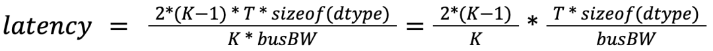
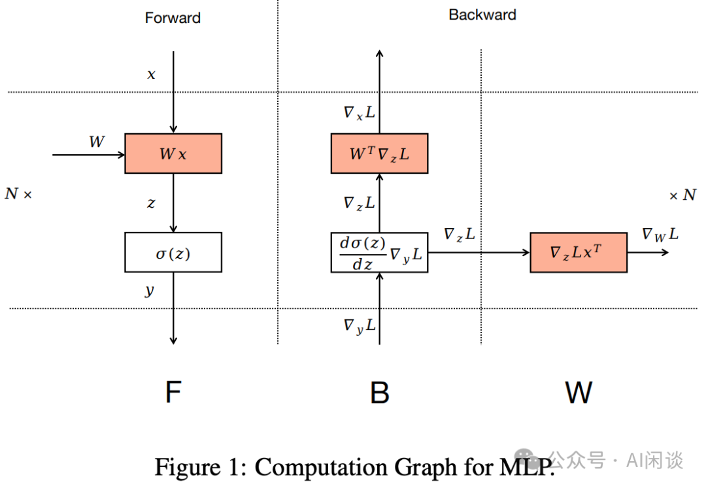

# 大规模分布式 AI 模型训练系列——数据并行

**作者：** AI闲谈

---

## 一、背景

随着生成式人工智能（GenAI）的迅猛发展，模型输入的序列长度呈现显著增长趋势。目前，一些模型已能支持处理长达 100 万甚至 1000 万个 Token 的序列。为了应对长序列的挑战，近几个月来，学术界和工业界涌现出多个序列并行（Sequence Parallelism）相关研究成果。

与此同时，我们也有了长序列技术落地的实际需求。为了应对这一挑战，我们决定对序列并行相关论文进行全面梳理和分析。然而，在研究过程中我们发现，当前各种分布式并行策略之间关系错综复杂，相互影响。这促使我们决定从头开始，逐一深入剖析各种分布式并行方案。

在本文中，我们将首先聚焦于数据并行（Data Parallelism）相关工作，对其进行简要概述和分析。这不仅有助于我们更好地理解数据并行的核心概念和相关技术，也为后续探讨更复杂的并行策略奠定基础。本文暂时不介绍微软的 Zero DP 以及 Meta 的 FSDP，留作后续分享。

相关内容可以参考之前的文章：

- [MoE 系列论文解读：Gshard、FastMoE、Tutel、MegaBlocks 等](http://mp.weixin.qq.com/s?__biz=Mzk0ODU3MjcxNA==&mid=2247486329&idx=1&sn=32935ff35dc32bb04b4e222fb9b45405&chksm=c364cc3cf413452a2205dc10400e755378c3435b0a180f3d7ba74c15d235e07af709ad61dd10&scene=21#wechat_redirect)
- [万卡 GPU 集群实战：探索 LLM 预训练的挑战](http://mp.weixin.qq.com/s?__biz=Mzk0ODU3MjcxNA==&mid=2247486852&idx=1&sn=9f9dc1df99ab6aafb28e091f4532b89e&chksm=c364cac1f41343d7b10d9d234d1c7f3371d996afda01cb94d294a38cba4f1a14fe4594992aa2&scene=21#wechat_redirect)
- [万字综述：全面梳理 FP8 训练和推理技术](http://mp.weixin.qq.com/s?__biz=Mzk0ODU3MjcxNA==&mid=2247487327&idx=1&sn=784f76c54183fd46dd7300ab7b28cfcb&chksm=c364c81af413410cd1a38f816d7591ce4b0ce38314809a0695d5d9a4b544e8cfbbe16a967cd1&scene=21#wechat_redirect)

## 二、引言

### 2.1 模型训练过程

要理解数据并行，首先需要理解模型的训练过程，其包括前向传播（Forward Pass），反向传播（Backward Pass）以及权重更新（Weight Update）过程。这里以序列模型为例，也就是 y = LayerN(LayerN-1(...(Layer1(x))))。

如下图所示为其中关键的 Forward 和 Backward，每个模块从左侧输入，并将其结果从右侧输出。其中 Cache 用于存储中间结果，也就是 Activation；图中的 wrt 表示 with respect to，比如 ∇Loss wrt Weights of LayerN，也就是 Layer N 中关于 Weight 的 ∇Loss。

- Forward：LayerN 的 Forward 需要输入
- LayerN-1 的输出（Activation）
- LayerN 的 Weight
- Backward：LayerN 的 Backward 需要输入
- LayerN-1 的输出（Activation），也就是 LayerN 的输入。
- LayerN 的 Weight
- LayerN 层输出 Activation 对应的 Error

如下图所示为一个 Backward 的过程，可以看出，Backward 其实包含两个部分：

- 链式法则：这是反向传播算法的核心，用于将损失函数的梯度从输出层传递回输入层。在每一层中，根据链式法则计算损失函数对于当前层输入的偏导数，然后将这些梯度传递给前一层。
- 权重梯度：每一层的权重梯度是损失函数对于当前层权重的偏导数，用于指导如何调整权重以最小化损失函数。计算权重梯度是为了更新模型中的权重，从而使得模型能够更好地拟合数据。

将上述过程拼接起来就是 Forward和 Backward 的整个过程，如下动图所示：

如下图所示为其权重更新的过程，有了每一层的梯度即可以使用相应的权重更新算法对模型权重进行更新，需要输入：

- LayerN 的优化器状态。
- LayerN 的权重。
- LayerN 中权重的梯度。

### 2.2 梯度下降

在机器学习中，梯度下降（Gradient Descent）是一种用于优化模型的常用方法，用来最小化损失函数。根据使用的数据量不同，梯度下降可以分为不同的变体：Batched 梯度下降（全量梯度下降），随机梯度下降，以及 mini-batch 梯度下降。

- Batched 梯度下降（Batch Gradient Descent）：每次更新权重时，使用整个训练集来计算损失函数的梯度。假设有 N 个样本，则每个 Weight 在反向传播后都有 N 个梯度，会先计算 N 个梯度的平均，然后使用平均值更新 Weight。
- 优点：由于使用所有的训练数据，梯度估计非常准确，收敛过程稳定。
- 缺点：当训练数据集很大时，每次计算梯度都非常耗时，而且内存需求高，不适合处理大规模数据。
- 随机梯度下降（Stochastic Gradient Descent，SGD）：每次更新模型参数时，只使用单个训练样本来计算梯度。每个 Weight 在反向传播后都只有 1 个梯度，直接使用这 1 个梯度更新 Weight。
- 优点：只用一个样本进行更新，所以计算速度快，适合大规模数据集，且内存占用较小。
- 缺点：由于梯度是基于单个样本计算的，梯度估计不准确，容易导致梯度更新过程中的“噪声”，使得收敛过程不稳定，并可能在接近最优解时出现振荡。
- Mini-batch 梯度下降（Mini-batch Gradient Descent）：介于 Batched 梯度下降和随机梯度下降之间。每次更新模型参数时，使用一小部分训练数据（即 Mini-batch）来计算梯度。
- 优点：Mini-batch 梯度下降结合了全量梯度下降和随机梯度下降的优点，计算速度比全量梯度下降快，同时比随机梯度下降更加稳定，减少了更新中的“噪声”。
- 缺点：虽然它比 SGD 更稳定，但仍然可能面临一个 mini-batch 中样本不够多，导致梯度估计仍有一定的偏差。

### 2.3 AllReduce

AllReduce 是集合通信中常见的分布式计算操作，主要用于需要在多个设备（如多台服务器或多个 GPU）之间聚合数据的场景，可以包含 Sum、Min、Max 等操作。以 AllReduceSum 为例，假设有 K 个 设备，每个设备上有 N 个数据，则 AllReduce 后每个设备上的 out[i] = in0[i] + in1 [i] + … + in(k-1)[i]。可以参考 NCCL 的文档 Collective Operations — NCCL 2.22.3 documentation。

如下图所示，一个基于 Ring 的 AllReduce 操作可以拆分为一个 ReduceScatter 和 一个 AllGather 操作：

具体的 ReduceScatter 操作如下，每个节点发送一部分数据给下一个节点，同时接收上一个节点的数据并累加，这个过程进行 N-1 步。ReduceScatter 后每个设备都包含一部分数据的 Sum：

具体的 AllGather 操作如下，每个节点将其持有的部分结果发送给下一个节点，同时接收上一个节点的部分结果，逐步汇集完整的结果。AllGather 后，每个设备都包含全量的数据：

### 2.4 AllReduce 带宽

如上所示，AllReduce 操作可以分成 ReduceScatter 和 AllGather 操作，假设 GPU 数量为 K，则每一个阶段的通信量为 (K-1) * T * sizeof(dtype)，假设每个 GPU 的总线带宽为 busBW，则 AllReduce 对应的理论通信时延为：

然而，实际的总线带宽并不能达到理论总线带宽，如下图所示，4*V100 通过 NVLink 互联（没有 NVSwitch），每两个 GPU 之间两个 NVLink 连接，理论双向带宽为 100GB/s，实际测试也可以达到 97GB/s，如果 Disable NVLink，则对应的带宽只有 16GB/s。

而 AllReduce 通常更关注的是总线带宽 busBW，对于 4*V100 NVLink 互联（没有 NVSwitch），NCCL 通过如下的方式可以创建 3 个双向环，其中每个颜色都是 1 个双向环。因为每个环的单向通信带宽为 4*25GB/s，通信带宽的理论上限为 6*(4*25GB/s)=600GB/s（也可以用 12 个 NVLink * 50GB/s 得到），那么平均每个 GPU 的 busBW 为 150GB/s。

然而，实际总线带宽也与理论总线带宽有一定差距，这和数据量、GPU 连接方式、使用的通信算法、NCCL 版本等有关。如下图所示为使用 NCCL 测试出的 AllReduce 总线带宽，可以看出，当数据量比较小时，比如小于 1MB(106B)，测试的 busBW 很低，不到 30GB/s。当通信的数据量达到 128MB 时，相应的 busBW 达到 130GB/s，基本接近极限的 150GB/s。如果没有 NVLink，则实测的 busBW 只有 10GB/s 左右。

如下图为 NVIDIA 官方的结果，在 V100 上的性能与我们实测性能相当：

## 三、Pytorch DDP

### 3.1 DP（Data Parallelism）

如下图所示为单个设备采用 Mini-batch 梯度下降训练的过程，设备中加载全量的模型，每次训练加载一个 Mini-batch（6 个样本）数据，首先进行 Forward 计算，然后计算 Loss，之后进行 Backward 计算获得梯度：

数据并行的工作原理是在 N 个设备上存储同样的模型参数，然后将 Mini-batch 按照设备拆分（2 个设备，每个设备 3 个样本），然后分别进行 Forward、Loss 计算和 Backward：

然而，数据并行中每个设备上都只有对应样本的梯度，因此在进行 Mini-batch 梯度下降时需要使用整个 mini-batch 中样本的梯度（也就是在数据并行中的权重更新阶段要额外引入一个梯度聚合的过程），此时可以使用 AllReduceSum 操作在每一个设备上都获得全部梯度（6 个样本对应的梯度）的均值，然后进行权重更新：

### 3.2 DDP（DistributedDataParallel）

Pytorch 中提供了 DataParallel (DP) 和 DistributedDataParallel (DDP) 两种数据并行模式，它们有不同的实现方式和应用场景：

- DataParallel (DP)：
- 实现方式：是一种简单的数据并行方式，利用多 GPU 在单个节点上并行处理，是单进程多线程的。它的执行过程为：
- 将输入数据拆分为若干个 mini-batch，并分发到多个 GPU 上。
- 同时在每个 GPU 上运行 Forward 和 Backward。
- 在主 GPU（默认是 GPU 0）上收集并汇总所有 GPU 的梯度。
- 在 GPU 0 上更新模型参数。
- 将 GPU 0 上更新后的模型参数同步给其他 GPU。
- 适用场景：DP 适合小规模的模型训练，尤其是在单个节点上使用多个 GPU 的场景。
- 性能：DP 的主要问题在于性能瓶颈。由于梯度聚合是在主 GPU 上进行，这会导致主 GPU 的负载过重，同时也会增加 GPU 之间的数据传输开销。使得 DP 在多 GPU 环境下的扩展性较差。
- DistributedDataParallel (DDP)：
- 实现方式：DDP 是 PyTorch 提供的更为高效的数据并行方法，是多进程的。与 DP 不同，DDP 可以在多个节点和多个 GPU 上并行执行。每个 GPU 上都有一个模型的副本，梯度计算在每个 GPU 上独立完成，然后通过通信协议（如 NCCL 或 Gloo）在各 GPU 之间同步梯度。
- 适用场景：DDP 适用于大规模分布式训练，特别是在多节点、多 GPU 环境下。它不仅能充分利用多个 GPU，还能跨节点扩展，使得它非常适合大规模深度学习任务。
- 性能：由于 DDP 可以在每个 GPU 上独立计算并同步梯度，因此避免了 DP 中主 GPU 的瓶颈问题。DDP 的通信和计算是可以重叠的，因此能够大大减少通信开销，从而提高训练效率和扩展性。

如下图所示为 Pytorch DDP 的一个简单示例，需要说明的是，其中并没有初始化 Process Group，详细示例可以参考 Distributed Data Parallel — PyTorch 2.4 documentation。其中第 20 行的 loss.backward() 中会进行 Backward 操作和 AllReduce 梯度聚合；而 23 行的 opt.step() 主要是使用聚合后的梯度来更新模型权重：

PS：数据并行会保证不同设备的初始化状态相同，然后每次迭代时都使用聚合后相同的梯度进行更新，因此可以保证不同设备上的模型参数在每个 Iter 进行 Forward 和 Backward 计算时始终相同。

## 四、优化

### 4.1 梯度分桶

如下图所示，在前面的章节我们已经介绍过，AllReduce 通信的总线带宽与传输的消息大小密切相关，当消息小于 1MB 时，实际总线带宽甚至不到理论总线带宽的 1/10。

解决上述问题的思路也很简单，既然有许多小的消息（梯度），那么在通信的时候也就可以将它们适当的分桶合并，多个小的梯度合并后通过一次 AllReduce 操作完成，如下图所示：

如下图所示，在 Pytorch DDP 中可以通过 bucket_cap_mb 参数控制 Bucket 的大小，默认是 25MB，具体可以参考 DistributedDataParallel — PyTorch 2.4 documentation。需要说明的是，Bucket Size 也不是越大越好，过大的 Bucket Size 可能反而影响性能。

### 4.2 通信&计算 Overlap

在模型训练中，数据并行会额外引入一个梯度聚合（AllReduce）的过程，该过程以通信为主，是可以与 Backward 的计算进行折叠的，这样可以减少 AllReduce 通信时 GPU 的闲置。如下图所示，Backward 中某一层的反向传播开始后即可以开始当前层的梯度聚合（AllReduce）操作，并且可以和下一层的 Backward 同时进行，这在 Pytorch 的 loss.backward() 中已经实现：

如下图所示，通过 Overlap 后可以有效减小每个 Iter 的时延（图片来自 [2006.15704] PyTorch Distributed: Experiences on Accelerating Data Parallel Training）：

PS：可以看出，这里是所有的梯度聚合（AllReduce）都完成之后才开始权重更新（optim）的。实际上权重的更新操作在对应的梯度聚合完成之后就可以开始，但是 Pytorch 的 DDP 中并没有这样实现，可能有多方面的原因，比如权重更新会和 Backward 抢占资源；Optimizer 都是单独实现的，进一步 Overlap 会导致 Optimizer 实现和管理计算图的复杂度增加等。

### 4.3 梯度累加

GPU 的显存比较有限，模型的规模也在不断增加，有些时候即使使用了数据并行依然无法达到比较大的 Batch Size。此时，可以采用梯度累加（Gradient Accumulation），如下图所示，每次都使用一个 micro-batch 的数据进行 Forward 和 Backward，此时只做梯度累加（只在 Local 累加），而不进行梯度聚合以及模型参数更新。直到最后一个 micro-batch 才进行梯度聚合以及权重更新。

如下图所示，在 Pytorch DDP 中可以通过 no_sync() 来实现梯度累加：

### 4.4 激活重计算

在前面的部分我们介绍过，在模型训练中需要保存许多中间状态（Activation），这些 Activation 在训练中会占用大量内存。当计算资源比较充裕而内存不足时，可以通过计算换内存的方式实现训练性能的提升，称为激活检查点（Activation Checkpointing）或激活重计算（Activation Recomputing）。

如下图所示，可以在 Forward 的过程中只保留部分 Activation，比如每隔 3 层保存一个 Activation，也就相当于将模型分段，每段都保留输入的 Activation。在 Backward 的过程中，可以在使用相应的 Activation 之前通过之前保存的 Checkpoint 重计算获取。当然，这里要平衡间隔大小带来的额外开销，间隔越大，越节约内存，重计算代价也越高；间隔越小，重计算代价越小，节约的内存也越有限。

### 4.5 ZeroBubble

我们前面提到，Backward 过程实际是包含两部分，一部分是对输入的梯度（链式法则），一部分是对权重的梯度，而不同权重的梯度计算之间没有任何依赖性。在 [2401.10241] Zero Bubble Pipeline Parallelism 中，作者将这一特性应用到了 Pipeline Parallelism（流水线并行）中，这里不再具体介绍：

## 五、附录

### 5.1 参数平均

在数据并行训练中除了可以采用梯度平均（Gradient averaging）外也可以采用参数平均（Parameter averaging）。具体来说，在每个训练节点上独立地训练模型一段时间后，将各个节点上的模型参数进行平均。梯度平均和参数平均各有优劣及应用场景：

- 参数平均：
- 优点：易于实现，尤其是在数据集分布均匀且节点之间通信成本比较高的情况。
- 缺点：每个节点在本地可能进行多个迭代的训练，因此在节点之间的模型差异可能较大，有可能导致模型收敛不佳。此外，相比梯度平均，收敛速度可能较慢。
- 梯度平均：
- 优点： 在每个 mini-batch 之后就进行梯度平均，所以模型在各节点之间保持同步，有助于加快收敛速度。
- 缺点：对通信的要求较高，每个 mini-batch 之后都需要通信，会增加通信开销。此外，对节点之间的同步要求较高，可能会导致一些延迟。

### 5.2 AllReduce 算法

AllReduce 有不同的实现算法，比如基于 Ring 的 AllReduce 和基于 Tree 的 AllReduce（可以参考 Massively Scale Your Deep Learning Training with NCCL 2.4 | NVIDIA Technical Blog）。它们之间有各自不同的场景和优劣。

Ring AllReduce：是一种环形拓扑结构的 AllReduce 算法，假设有 N 个节点参与

- 通信过程（具体可以参考前面 AllReduce 的介绍）：
- Reduce-Scatter 阶段。
- AllGather 阶段。
- 优点：带宽利用率高，因为在每个通信步骤中，所有节点都在同时发送和接收数据。
- 缺点：延迟较高，尤其是当节点数量较多时，由于需要进行 2*(N-1) 次通信。

Tree AllReduce：采用树状拓扑结构进行通信

- 通信过程
- Reduction 阶段：从叶子节点开始向根节点汇聚数据，根节点最终得到完整的结果。
- Broadcast 阶段：根节点将汇总的结果沿树结构向下广播给所有节点。
- 优点：通信步骤少，通常为 2*log(N)，因此在大规模节点时延迟较低。
- 缺点：在每一步中，只有部分节点参与通信，带宽利用率相对较低。

总体来说：

- Ring AllReduce 更适合在高带宽、低延迟的网络环境下使用，特别是当节点数量较小时，它能更好地利用带宽资源。
- Tree AllReduce 更适合在节点数量较多或网络延迟较高的情况下使用，因为它的通信延迟随节点数量增长的速度较慢。

如下图 Figure 3 所示为 Tree AllReduce 的一个示例，向上箭头是 Reduction 阶段，向下箭头是 Broadcast 阶段：

如下图所示，使用 nccl-test 在 NVLink+NVSwitch 全互联的 8*H100 上测试 Ring AllReduce 的性能（NCCL_ALGO=Ring ./build/all_reduce_perf -b 1M -e 1G -f 2 -g 8）：

如下图所示，使用 nccl-test 在 NVLink+NVSwitch 全互联的 8*H100 上测试 Tree AllReduce 的性能（NCCL_ALGO=Tree ./build/all_reduce_perf -b 1M -e 1G -f 2 -g 8）：

从上述结果可以看出，在 NVLink+NVSwitch 全互联的 8*H100 节点上，Ring AllReduce 性能要比 Tree AllReduce 高不少。

### 5.3 Adam 优化器

Adam 优化器是一种结合了动量（Momentum）和自适应学习率（如 RMSprop）技术的优化算法，广泛用于深度学习模型的训练。Adam 优化器的核心优势在于能够根据参数的更新历史自适应调整每个参数的学习率，这有助于加快收敛速度并提高训练稳定性。为了实现这一点，Adam 维护了两个额外的参数（或“矩”）：

- 一阶矩：过去梯度的移动平均，提供了平滑过的梯度方向。这有助于增加稳定性，使模型在参数空间中的移动更加平滑。
- 二阶矩：过去梯度平方的指数移动平均，代表过去梯度的变化率，允许每个参数有自适应的学习率。参数更新的规模由其梯度的不确定性决定，有助于调整学习步长，避免在参数空间中过大或过小的步进。

Adam 优化器的关键公式如下所示（对应论文 [1412.6980] Adam: A Method for Stochastic Optimization）：

对应的伪代码如下所示（其中的每个参数都对应一个 m 和 v，也就是一阶矩和二阶矩）：

| class AdamOptimizer:   def __init__(self, learning_rate=0.001, beta1=0.9, beta2=0.999, eps=1e-8):       self.learning_rate = learning_rate       self.beta1 = beta1       self.beta2 = beta2       self.eps = eps       self.m = None       self.v = None       self.t = 0   def initialize_moments(self, params):       self.m = {k: np.zeros_like(v) for k, v in params.items()}       self.v = {k: np.zeros_like(v) for k, v in params.items()}   def update_params(self, params, grads):       if self.m is None or self.v is None:           self.initialize_moments(params)       self.t += 1       params_new = {}       for k in params.keys():           self.m[k] = self.beta1 * self.m[k] + (1 - self.beta1) * grads[k]           self.v[k] = self.beta2 * self.v[k] + (1 - self.beta2) * np.square(grads[k])           m_new = self.m[k] / (1 - self.beta1 ** self.t)           v_new = self.v[k] / (1 - self.beta2 ** self.t)           params_new[k] = params[k] - self.learning_rate * m_new / (np.sqrt(v_new) + self.eps)       return params_new |
| --- |

Pytorch 的 Adam 优化器实现可以参考：https://pytorch.org/docs/stable/_modules/torch/optim/adam.html#Adam

## 六、参考链接

1. https://siboehm.com/articles/22/data-parallel-training
2. https://arxiv.org/abs/2006.15704
3. https://medium.com/huggingface/training-larger-batches-practical-tips-on-1-gpu-multi-gpu-distributed-setups-ec88c3e51255
4. https://docs.nvidia.com/deeplearning/nccl/user-guide/docs/usage/collectives.html
5. https://pytorch.org/docs/master/notes/ddp.html#example
6. https://arxiv.org/abs/2401.10241

