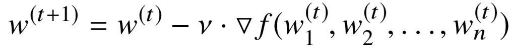

# 大规模分布式 AI 模型训练系列——流水线并行

**作者：** AI闲谈

---

## 一、背景

之前的文章中我们详细介绍了大规模分布式训练中的数据并行（Data Parallelism）和张量并行（Tensor Parallelism）。本文中我们继续介绍另一种非常常见的并行方案——流水线并行（Pipeline Parallelism）。

相关内容可以参考之前的文章：

- [大规模分布式 AI 模型训练系列——数据并行](http://mp.weixin.qq.com/s?__biz=Mzk0ODU3MjcxNA==&mid=2247487775&idx=1&sn=52981f832c8ad7c9b111e37c0e788c3a&chksm=c364d65af4135f4cc999fd39659936f42bedc7faebeb2e2a674d5feb064bf50b68a6d412b89b&scene=21#wechat_redirect)
- [大规模分布式 AI 模型训练系列——张量并行](http://mp.weixin.qq.com/s?__biz=Mzk0ODU3MjcxNA==&mid=2247487815&idx=1&sn=69601e66f3f8413b5afbd8149b989ea7&chksm=c364d602f4135f1495f0c5e52bf911b26b528bd85f2ad1d2a97d93a358592676223bb9950ee1&scene=21#wechat_redirect)
- [MoE 系列论文解读：Gshard、FastMoE、Tutel、MegaBlocks 等](http://mp.weixin.qq.com/s?__biz=Mzk0ODU3MjcxNA==&mid=2247486329&idx=1&sn=32935ff35dc32bb04b4e222fb9b45405&chksm=c364cc3cf413452a2205dc10400e755378c3435b0a180f3d7ba74c15d235e07af709ad61dd10&scene=21#wechat_redirect)
- [万卡 GPU 集群实战：探索 LLM 预训练的挑战](http://mp.weixin.qq.com/s?__biz=Mzk0ODU3MjcxNA==&mid=2247486852&idx=1&sn=9f9dc1df99ab6aafb28e091f4532b89e&chksm=c364cac1f41343d7b10d9d234d1c7f3371d996afda01cb94d294a38cba4f1a14fe4594992aa2&scene=21#wechat_redirect)
- [万字综述：全面梳理 FP8 训练和推理技术](http://mp.weixin.qq.com/s?__biz=Mzk0ODU3MjcxNA==&mid=2247487327&idx=1&sn=784f76c54183fd46dd7300ab7b28cfcb&chksm=c364c81af413410cd1a38f816d7591ce4b0ce38314809a0695d5d9a4b544e8cfbbe16a967cd1&scene=21#wechat_redirect)

## 二、Microsoft Pipelined BP

### 2.1 摘要

我们在之前的文章中提到过，2012: ImageNet Classification with Deep Convolutional Neural Networks 中使用 Tensor Parallelism 在 2 个 GPU 上训练 AlexNet。同一年，微软的研究者开始使用 Pipeline Parallelism 训练语音识别模型 CD-DNN-HMM（Context-Dependent Deep-Neural-Network HMM）。

首先，作者提出了CD-DNN-HMM 模型，其性能大幅优于传统的基于高斯混合的 HMM。然而，在单个 GPU（NVIDIA Tesla S2090 GPU）训练这样的模型需要 59 天。为了解决这个问题，作者提出了近似的 Pipelined BP，通过对模型层进行切分，并使用多个 Mini Batch 同时训练，可以在单台机器内的 2 个或 4 个 GPU 上实现 1.9x 和 3.3x 的端到端加速，并行化效率达到 0.95 和 0.82，并且不会损失精度。

PS：这里的不损失精度是在作者自己的场景下，换个场景也许会损失精度，这个并不能保证。

### 2.2 方案

在 Pipelined BP 中，每个 GPU 负责网络的一部分层，数据从一个 GPU 流向下一个 GPU，每个 GPU 同时处理其负责的层。由于数据在 GPU 之间流动需要时间，因此模型权重的更新将使用稍微延迟的数据。这也就意味着，当一个 GPU 接收到数据并计算梯度时，这些梯度可能是基于更早之前的模型参数，作者称这种方式为延迟更新（Delayed Update）。延迟更新在模型训练中是一个比较有挑战的工作，但作者证明，适当的调整模型参数（比如减小 Mini Batch）可以有效的缓解延迟更新对性能的影响。（PS：在 Microsoft 的 PipeDream 中也有类似的问题，我们后续会具体介绍）

如下图 Figure 1 所示，作者发现使用更小的 Mini Batch Size 并不会影响模型精度，反而会增加精度。但是，更小的 Mini Batch Size 会导致 GPU 上每个 Kernel 的计算量不足，反而降低模型训练的速度。因此，综合考虑速度和精度，作者将 Mini Batch Size 256 到 1024 称为 “Goldilocks zone”。

此外，作者也进一步验证，针对这个任务，在 Goldilocks Zone 里 Delayed Update 并不会影响模型效果：

如下图 Table 4 所示，作者使用不同配置（切分）验证了本文方案（共 8 层，其中 7 层 Hidden Layer）的有效性，可以看出，使用 Pipeline + Striped top Layer 可以获得 59/18=3.3x 的加速：

## 三、CMU STRADS

### 3.1 摘要

卡内基梅隆大学等作者在 2016: STRADS: A Distributed Framework for Scheduled Model Parallel Machine Learning 中介绍了一种名为 Scheduled Model Parallelism (SchMP) 的编程方法，旨在通过有效调度机器学习（Machine Learning）算法的参数更新来提高算法的收敛速度。SchMP 充分考虑了参数之间的依赖性和不同参数收敛速度的不均衡性。

为了支持大规模的 SchMP，作者开发了一个分布式框架 STRADS，它优化了 SchMP 程序的吞吐量，并在四个常见的 ML 应用上进行了基准测试：LDA topic 建模、矩阵分解、稀疏最小二乘（Lasso）回归和稀疏逻辑回归。通过 SchMP 和 STARDS 可以有效提高 ML 中迭代的吞吐量。比如，SchMP LDA 和 SchMP Lasso 分别比当时成熟的基线快 10x 和 5x。

### 3.2 方案概览

如下图 Figure 1 所示，STRADS 系统主要包含 3 个部分：

- 用户实现的 SchMP 指令。
- 服务（Scheduler、Job Executors 和 Parameter Manager）。
- 服务的实现（Static Engine 和 Dynamic Engine）。

用户通过实现 SchMP 指令来创建 SchMP 程序，而 STRADS 系统自动管理底层的机器/通信协调问题。

### 3.3 Dynamic Engine

Dynamic Engine 是 STARADS 中的关键部分，专门针对需要动态调度的模型并行（Model Parallelism）机器学习算法进行优化。动态调度算法根据模型参数的当前状态来决定更新的顺序和优先级。

然而，动态调度算法也面临一些挑战，比如可能需要更多的计算来确定更新顺序，或者可能需要生成更小的任务，这也可能导致网络通信的延迟相对于计算时间变得更为显著。为了解决这些问题，Dynamic Engine 采用了迭代流水线（Pipelining）的方式来有效隐藏网络通信的延迟，当一个迭代的更新正在通过网络通信时，其他迭代的计算可以并行的执行。此外，流水线的深度是可以配置的，以找到最佳的收敛速度和迭代进度之间的平衡。如下图 Figure 3 所示为其 Dynamic Engine 的 Pipelining 方案，右图中通过通信和计算的 overlap 可以有效提升训练速度：

## 四、Microsoft PipeDream

### 4.1 摘要

在上述的 STRADS 中作者已经提出了使用 Pipelining 的方式实现通信和计算的 Overlap，进而提升训练速度的方案，然而，其针对的还是 ML（Maching Learning）场景，并且在 CPU 上运行。在 [1806.03377] PipeDream: Fast and Efficient Pipeline Parallel DNN Training 中，微软提出了 PipeDream，它是一个针对 GPU 上训练 DNN（Deep Neural Network）的训练系统，也是第一个通用的、自动化的融合 Pipeline Parallelism 和 Data Parallelism 的训练系统。

PipeDream 在多台机器之间以流水线的方式并行执行计算，这种 Pipeline Parallelism 避免了 Data Parallelism 训练在面对大模型和/或有限网络带宽时导致的训练变慢问题（通信占比很高）。具体来说，PipeDream 通过减少通信量（相对大型 DNN 模型的 DP 训练方式减少高达 95% 通信量），并允许计算和通信的完美折叠，使得所有 GPU 都保持高速运转。

PS：需要指出的是，PipeDream 中使用的还是 Parameter Server 架构，有专门的参数服务器。此外，PipeDream 最初也不是基于 Google GPipe 改进的方案，PipeDream 比 GPipe 还早几个月，SOSP 2019 - PipeDream: Generalized Pipeline Parallelism for DNN Training 中增加了与 GPipe 的对比。

### 4.2 方案概览

PipeDream 结合了模型并行和流水线并行，通过流水线的方式处理不同的 Mini Batch，使得不同的 Worker 在任何时刻处理不同的输入，具体来说，PipeDream 通过以下方式实现流水线并行训练：

1. 根据模型架构和硬件配置将 DNN 分层自动切分到不同的阶段（Stage）。
2. 使用 DP 并行处理某些 Stage，平衡工作负载。
3. 交错处理每个 Worker 的 Forward 和 Backward，确保所有 Worker 尽可能忙碌，同时防止过多正在训练的 Mini Batch，确保模型收敛。
4. 维护每个执行中的 Mini Batch 的中间状态，以确保等价训练，不会损失效果。

### 4.3 模型自动切分

PipeDream 提出的时候 Transformer 还没有火起来，作者针对的主要是传统的 DNN 模型，其在不同 Layer 的结构、计算量是不同的，模型的切分相对也就没那么简单。为此，作者提出了自动切分机制，如下图 Figure 7 所示，首先使用一些输入数据运行模型，并分析各层的计算时间，然后按照设备数尽可能的均匀切分。

如下图 Figure 9 所示，PipeDream 也有专门的参数服务器（Parameter Server）以存储和更新模型参数：

### 4.4 1F1B

如下图 Figure 3 所示为使用 4 台机器进行 Model Parallelism（这里模型并行不是 Tensor Parallelism，而是 Pipeline Parallelism） 训练的执行过程。其每一行代表一个机器，蓝色表示 Forward，绿色表示 Backward，Forward 和 Backward 中的数字指的是 Mini Batch 的 ID。由于是按层切分，并且同一时间只有 1 个 Mini Batch，每台机器都必须等待之前的机器执行完才能执行对应的 Stage，导致存在大量的 Bubble。

实际上当 Machine 1 执行完 Mini Batch 1 的 Forward 之后就可以开始 Mini Batch 2 的 Forward，以此类推。在调度的过程中，系统中的每个设备都会有两个选择：

- 对某个 Mini Batch 执行 Forward，进而可以将 Mini Batch 传递到下一个设备。
- 对另一个 Mini Batch 执行 Backward，进而确保学习向前推进。

如果始终优先考虑 Forward，则会导致阻塞 Backward，模型也就无法学习和更新，因为只有 Backward 后才能执行权重更新；同样，如果只考虑 Backward 优先调度，则会导致计算资源闲置，无法充分发挥算力。

为了避免上述问题，作者提出了 1F1B（1次 Forward，1次 Backward）的调度机制，如下图 Figure 8 所示，4 个设备，分成 4 个 Stage。在起始阶段允许执行多个 Mini Batch 的 Forward，稳定后就保持 Forward 和 Backward 的交替执行，这样可以保证 GPU 在稳定状态下没有空闲，并且始终继续学习。

上述的 1F1B 过程并不需要 Forward 和 Backward 一样长，实际上，Backward 总是大于 Forward（大约 2 倍），此时 1F1B 依然是有效的调度机制。

### 4.5 有效学习

仔细考虑会发现上述 1F1B 的 Pipelining 方式存在一个问题，在 Backward 后立即更新模型参数会引入两种类型的参数不一致：

- 同一个 Mini Batch 的 Forward 和 Backward 可能使用不同的参数进行计算。比如，以 Figure 8 的 Machine 1 为例，Forward 5 使用的是 Mini Batch 1 更新后的参数；而 Backward 5 使用的是 Mini Batch 1,2,3,4 共同更新后的参数。
- 同一个 Mini Batch 在不同 Stage 使用的参数版本不一致。还是以 Mini Batch 5 为例，Machine 1 上的 Forward 5 使用的是 Mini Batch 1 更新后的参数；Machine 2 上的 Forward 5 使用的是 Mini Batch 1 和 Mini Batch 2 更新后的参数。

为了解决参数不一致的问题，PipeDream 引入了 Weight Stashing 和 Vertical Sync，如下图 Figure 9 所示：

- Weight Stashing：为每个正在计算的 Mini Batch 都保存一份参数。Forward 计算时，每个设备（Stage）都使用最新的权重参数计算输入的 Mini Batch，并将这个参数保存，直到当前设备上对应的 Backward 计算完成。这样可以解决上述的第一个参数不一致问题，但无法解决第二个。
- Vertical Sync：每个 Mini Batch 开始计算时都使用最新版本的权重参数，并且参数的版本号会伴随该 Mini Batch 数据的整个生命周期，在所有 Stage 都使用同一版本的参数，从而实现 Stage 间的参数一致性。这样可以解决上述的第二个参数不一致问题。

假设模型按照 Pipeline Parallelism 切分后不同 Stage 的参数为 w1,w2 等，t 表示第 t 个 Mini Batch 的更新，则原始的 SGD 对应的权重更新可以表示为：

而使用了 Weight Stashing 后的权重更新可以表示如下，可以看出已经不再等价，并且使用的版本不一致：

进一步引入 Vertical Sync 后对应的权重参数更新可以表示如下，虽然权重的版本一致了，都是 t–n+1，但相比 t 来说中间间隔了 n-1 个：

在 PipeDream 中默认采用 Weight Stashing，而不使用 Vertiacl Sync，这也就导致 PipeDream 相当于介于正常的 mini batched SGD 和 DP（使用 BSP 同步）之间的一种方案。

### 4.6 结果

如下图 Table 1 所示，作者在两个不同的集群上对几种不同的 DNN 模型进行训练。可以看出，本文的 PipeDream 相比传统的 BSP（DP 训练）最多可以加速 5x。随着训练机器的增加，PipeDream 获得了更高的加速比，近似线性加速。

## 五、Google GPipe

### 5.1 摘要

与微软的 PipeDream 不太一样，Google 在 [1811.06965] GPipe: Efficient Training of Giant Neural Networks using Pipeline Parallelism 提出了类似的 Pipeline Parallelism 方案。然而，GPipe 中作者采用 Mini Batch 拆分方案，也就是将 Mini Batch 拆分为多个 Micro Batch，并保证 Mini Batch 中的 Micro Batch 都 Backward 完才更新模型参数，以保证与 Mini Batch 更新的等价。此外，作者也引入了 Re-Compute 机制，可以有效降低内存占用。

使用 GPipe 可以实现几乎线性的加速。基于 GPipe，作者训练了 557M 的 AmoebaNet 模型（CV）以及 6B 参数的 Transformer 模型（NLP），分别实现 SOTA 性能。

PS：需要说明的是，GPipe 发表于 2018 年 11 月，和 Mesh-TensorFlow 同期，是在 PipeDream（2018 年 6 月） 之后。此外，GPipe 在 2019 年 7 月的 v5 版本中才加入 Transformer 模型的实验，获得更高的加速比。

### 5.2 方案

如下图 Figure 2 所示为本文的主要方案，假设 Mini Batch 的大小为 N，有 K 个设备：

- Mini Batch 会被切分为 M 个 Micro Batch，每个 Micro Batch 的大小为 N/M。
- M 个 Micro Batch 以 Pipeline 的方式在 K 个设备上依次执行 Forward和 Backward。
- 等 M 个 Micro Batch 都计算完后使用 N 个 Sample 对应的梯度统一进行权重 Update 操作（Optimizer Step）。

此外，作者也引入了 [1604.06174] Training Deep Nets with Sublinear Memory Cost 中的 Re-Compute 机制（也叫 Activation Checkpointing 或 Activation Recomputing）。具体来说，如下图所示，在每个 Device 中都保留该 Stage 的输入，而不保留中间的 Activation，当 Backward 阶段需要相应的 Activation 时，使用对应的输入重新计算 Activation：

当然，由于要在 M 个 Micro Batch 后同步 Update，因此就额外引入了更多的 Bubble，如下图所示。对于 M 个 Micro Batch，K 个 Device，其 Bubble 率为 O((K-1)/(M+K-1))。作者也通过实验验证，当 M>=4K 时可以有效缓解 Bubble 问题。

### 5.3 结果

如下图所示，作者在多个 TPU 设备上验证了提出方案的有效性：

- AmoebaNet 模型（CNN）：在各层的参数量、计算量不同，Pipeline Parallelism 导致很难均匀的按层切分，所以只能实现亚线性加速。比如，8 个 TPU，32 个 Micro Batch 可以获得 3.48x 加速。
- Transformer 模型（NLP）：每层的参数量、计算量相同，切分更加均匀，可以实现近似线性加速比。比如，8 个 TPU，32 个 Micro Batch 可以获得 6.3x 加速。

## 六、Microsoft PipeDream-Flush

### 6.1 摘要

在上述的 Google GPipe 中，作者通过 Activation Recomputing 来减少中间 Activation 占用过多显存空间，然而其也额外引入了更多的计算量。微软 PipeDream 的作者在 [2006.09503] Memory-Efficient Pipeline-Parallel DNN Training 中提出了相应的改进方案 PipeDream-Flush，通过调整 Micro Batch Forward 和 Backward 的顺序来减少内存占用。

### 6.2 方案

如下图所示，PipeDream 作者参考 GPipe 的实现引入了 PipeDream flush，进而保证模型的更新和非 Pipeline Parallelism 方式是等价的，只不过重新调整了 Forward 和 Backward 的顺序。

- (a)：GPipe 中把 M 个 Micro Batch Forward 计算完之后才会开始 Backward，因此其 Micro Batch 1（简写 M1） 的 Backward 执行时内存中要存储 M1、M2、M3 和 M4 的中间 Activation（不考虑 Recomputing）。
- (b)：PipeDream-Flush 中，Worker 2 里 M1 的 Backward 计算完成之后 Worker 1 可以马上开始 M1 的 Backward，此时内存中只有 M1 和 M2 的中间 Activation。并且计算完之后可以马上释放 M1 的中间激活，也就是 M2 的 Backward 计算是内存中只有 M2 和 M3 的中间 Activation。

从上也可以看出，PipeDream-Flush 和 GPipe 是数学等价的，它们都能保证和非 Pipeline Parallelism 方式 Mini Batch 的训练完全等价。

### 6.3 结果

如下图 Figure 6 所示，作者对比了不同切分方式/方案的性能，可以看出，本文的 PipeDream-Flush 方案吞吐明显优于 GPipe：

## 七、NVIDIA Megatron-LM

### 7.1 摘要

我们在之前的文章中介绍过 NVIDIA 提出的 Megatron-LM（[1909.08053] Megatron-LM: Training Multi-Billion Parameter Language Models Using Model Parallelism），其充分分析了 Transformer 模型的 Tensor Parallelism（TP）切分方案，以及与 Data Parallelism（DP）的混合训练。

在 [2104.04473] Efficient Large-Scale Language Model Training on GPU Clusters Using Megatron-LM 中，NVIDIA 的作者进一步对 Megatron-LM 进行扩展，新增了 Pipeline Parallelism（PP），并提出 Interleaved-1F1B 方案；最后，作者进一步将 PP 与 DP 和 TP 结合来训练超大 LLM。基于提出的方案，作者使用 3072 个 GPU 以 502 pFLOP/s 的速度训练了 1T 规模的 LLM，其 MFU 达到 52%（163 TFlops/GPU，A100 BF16 算力 312 TFlops）。

PS：本文的一作 Deepak Narayanan 也是上述 Microsoft PipeDream-Flush 的一作，并且都是实习期间的工作。

### 7.2 Interleaved 1F-1B

如下图 Figure 4 所示为本文作者基于 PipeDream Flush 的 1F1B 提出的 Interleaved 1F1B 调度方案。

- 上图为 PipeDream Flush 的 1F1B：对应 K=4 个 Device，Micro Batch 个数为 M=8，也就是每 M=8 个 Micro Batch 进行一次同步梯度更新。
- 下图为本文的 Interleaved 1F1B：与标准 1F1B 的主要不同是层的切分方式。假设模型有 16 层，每个 Device 有 4层。
- 1F1B：模型被分为 4 个 Stage，Device 1 包含 Layer (0,1,2,3)，Device 2 包含 Layer (4,5,6,7)，Device 3 包含 Layer(8,9,10,11)，Device 4 包含 Layer(12,13,14,15)。
- Interleaved 1F1B：模型被分为 8 个 Stage，Device 1 包含 Layer (0,1,8,9)，Device 2 包含 Layer (2,3,10,11)，Device 3 包含 Layer(4,5,12,13)，Device 4 包含 Layer(6,7,14,15)。可以看出，相当于将模型切分为 8 个 Stage，但是交替放在 4 个 Device 上，下图中深色代表前 4 个 Stage（Layer 0-7），浅色代表后 4 个 Stage（Layer 8-15）。以此就可以实现更细力度的调度，减少 Bubble。

如下图所示为 1 个 Mini Batch（8 个 Micro Batch）详细的调度过程，其中红色数字表示 Layer ID，白色箭头表示调度顺序。可以看出：

- Time-Efficient：在执行 M1 Layer(8,9) 的 Backward 之前，M5、M6 和 M7 部分 Stage 的 Forward 可以插入 Bubble 中计算；而在标准 1F1B 中，M5、M6 和 M7 的 Forward 始终是在 M1 的 Backward 之后的，以此可以实现更少的 Bubble。
- Memory-Efficient：在执行 M1 Layer(8,9) 的 Backward 之前，Device 1 中只有 M1/M2/M3/M4 Layer(0,1,8,9) 以及 M5/M6/M7 Layer(0,1) 对应的中间 Activation；而标准 1F1B 中，Device 1 中只有 M1/M2/M3/M4 Layer(0,1,2,3) 对应的中间激活，因此 Interleaved-1F1B 会比标准 1F1B 占用更多内存，但依然低于 GPipe。
- Memory-Imbalanced：在执行 M1 Layer(14,15) 的 Backward 之前，Device 4 只用缓存 M1/M2/M3/M4 Layer(0,1) 以及 M1 Layer(8,9) 对应的中间 Activation，比 Device 1 少很多，这也就导致 Memory 不均衡的问题。
- Communication-Inefficient：Interleaved-1F1B 带来的另外一个问题 Communication 的增加，1F1B 时模型分为 4 个 Stage，在 Forward 中只需要 3 个 P2P 通信，而 Interleaved-1F1B 将其划分为 8 个 Stage，Forward 中就需要 8 个 P2P 通信；Backward 的通信也会类似增加，整体来说通信量明显增加。当然，通过充分的 Overlap 也可以避免增加的通信量对训练效率的影响。

综上，Interleaved-1F1B 相比 1F1B 可以降低 Bubble 率，虽然会多占用一些内存，但依然优于 GPipe；然而，Interleaved-1F1B 也会加剧 Memory 不均衡的问题，并且会增加更多的通信量。

PS：Interleaved-1F1B 也有个约束条件，Mini Batch 中 Micro Batch 的个数 M 需要是 Device 数 K 的整数倍，比如这里 4 个 Device，得有 4/8/12/16/… 个 Micro Batch。

### 7.3 结果

如下图 Figure 11 所示，作者首先验证了标准 1F1B 的扩展能力，其中模型包含 24 个 Transformer Layer，共 12.1B 参数量。可以看出，当 Mini Batch Size 比较小（8）的时候随着 PP Stage 个数增加，性能损失比较严重；当 Mini Batch Size 比较大（128）的时候随着 PP Stage 个数增加模型性能并没有受到太大影响。

此外，作者也使用 175B 模型（96 层） 96 个 GPU 对比了原始 1F1B 和 Interleaved-1F1B 的性能差异。如下图 Figure 12 所示，提出的 Interleaved-1F1B 有比较明显优势，但是随着 Mini Batch Size 的增加（Micro Batch 个数增加），这种差异也在逐渐缩小，但是两者的性能也都有所提升。

最后，作者也使用 162.2B 模型在 64 个 GPU 对比了 TP 和 PP 组合的方案。如下图 Figure 13 所示，在 TP=8，PP=8 时性能最优，两头时最差，这也证明了单独使用 TP 或 PP 可能不是最优方案：

## 八、Sea Zero-Bubble

### 8.1 摘要

Sea AI-Lab 团队在 [2401.10241] Zero Bubble Pipeline Parallelism 中进一步提出了 Zero Bubble 方案，可以进一步降低 Bubble 率，作者也声称这是第一个 Zero Bubble 的方案。

Zero Bubble 的核心思路是将 Backward 分为两个部分，一部分计算输入的梯度，另一部分计算参数的梯度。基于这一想法，可以定制更加高效的调度策略，为此，作者提出根据特定的模型配置和内存约束自动找到最优调度方案，进而可以实现 Zero Bubble。此外，作者也提出了在 Optimizer 阶段绕过同步的方案。

实验结果表明，在类似的内存约束下，Zero Bubble 可以比 1F1B 吞吐提高 23%。进一步放宽内存约束时，提升可以达到 31%。

### 8.2 方案

如下图 Figure 1 所示，作者将 Backward 分成两个部分，一部分计算输入的梯度，一部分是计算权重的梯度。这里计算输入的梯度有明确的依赖关系，也是链式法则不断传递的基础；而计算权重的梯度却没有明确的依赖，甚至可以滞后很多。此外，三个红色部分计算量相当，这也就是为什么之前 1F1B 或者 Interleaved-1F1B 中 Backward 的长度为 Forward 的 2 倍。

如下图所示为 1F1B 和 本文的 ZB-H1、ZB-H2 的区别，其中 1F1B 中 Backward 没有拆分为两个部分，所以长度时 Forward 2 倍；本文的 ZB 里 Backward 分成了 B 和 W，因此 F、B、W 的长度相同，表示计算 Latency 相当。

- ZB-H1：B 的计算 Latency 更短，也就可以前置，W 的计算没有明显的依赖关系，可以滞后，这样也就提供了更小化 Bubble 的可能。
- ZB-H2：可以进一步的将 W 的计算滞后，并使用其他 Micro Batch 的 F 和 B 前置来填充 Bubble。只要 Device 里面的所有 Micro Batch 的 W 完成就可以立即开始 Optimizer Step 来更新模型参数，并且 Device 之间不用同步更新。然而，滞后 W 也就意味着相应的 Activation 不能释放，因此 ZB-H2 需要占用更多的内存空间。

### 8.3 结果

如下图 Table 4 所示，作者使用不同的模型和 GPU 数目对比了不同的方案，其中 1F1B-I 指的是 Interleaved-1F1B，ZB-2p 和 ZB-1p 为本文提出的方案。可以看出，在几乎不增加内存占用的情况下 ZB-1p 比 1F1B 有一定的优势；如果允许使用更多内存，ZB-2p 的优势会更加明显。

## 九、LLaMA 3.1 Pipeline Parallelism

我们前面已经提到，PP 有几个约束：

- 对 Mini Batch 大小的约束，比如，需要是 Stage 整数倍。
- 存在 Memory 负载不均衡的问题。
- 也可能存在计算不均衡的问题，比如，在最后的一个 Stage，需要计算 LM head 以及 loss，导致这个 Stage 的 Latency 比较高，成为瓶颈（[2210.02414] GLM-130B: An Open Bilingual Pre-trained Model 等工作中都提出了类似的方案）。

为了解决上述几个问题，Meta 作者训练 LLaMA 3 模型时修改了 PP 调度（[2407.21783] The Llama 3 Herd of Models），如下图 Figure 6 所示，允许灵活的设置 N，比如这里 N=5，这样在每个 Batch 中都可以执行任意的 Micro Batch。这样有两个好处：

- 在大规模训练中，可以使用比 PP Stage 更少的 Micro Batch，以便满足 Batch Size 的要求。
- 也可以使用更多的 Micro Batch，以便隐藏 P2P 通信。

为了实现更好的负载均衡，作者在 PP 的第一个和最后一个 Stage 减少了一个 Transformer Layer。

为了减少 PP Bubble，作者采用了 Interleaved-1F1B。此外，采用异步 P2P 通信，也打开 TORCH_NCCL_AVOID_RECORD_STREAMS 来减少异步 P2P 通信中的内存开销。

为了进一步减少内存开销，作者也进行了详细的内存分配 Profiling，主动释放后续不会使用的 Tensor，比如每个 PP Stage 的输入和输出 Tensor。

## 十、Bloom DP + PP + TP

如下图 Figure 6 所示为 [2211.05100] BLOOM: A 176B-Parameter Open-Access Multilingual Language Model 训练（176B）采用的分布式并行方案：8DP 12PP 4TP，比较清晰的说明了怎么结合几种分布式并行方案。

## 十一、参考链接

1. https://proceedings.neurips.cc/paper_files/paper/2012/file/c399862d3b9d6b76c8436e924a68c45b-Paper.pdf
2. https://dl.acm.org/doi/pdf/10.1145/2901318.2901331
3. https://arxiv.org/abs/1806.03377
4. https://www.pdl.cmu.edu/PDL-FTP/BigLearning/sosp19-final271.pdf
5. https://arxiv.org/abs/1811.06965
6. https://arxiv.org/abs/1604.06174
7. https://arxiv.org/abs/2006.09503
8. https://arxiv.org/abs/1909.08053
9. https://arxiv.org/abs/2104.04473
10. https://arxiv.org/abs/2401.10241
11. https://arxiv.org/abs/2210.02414
12. https://arxiv.org/abs/2407.21783
13. https://arxiv.org/abs/2211.05100

