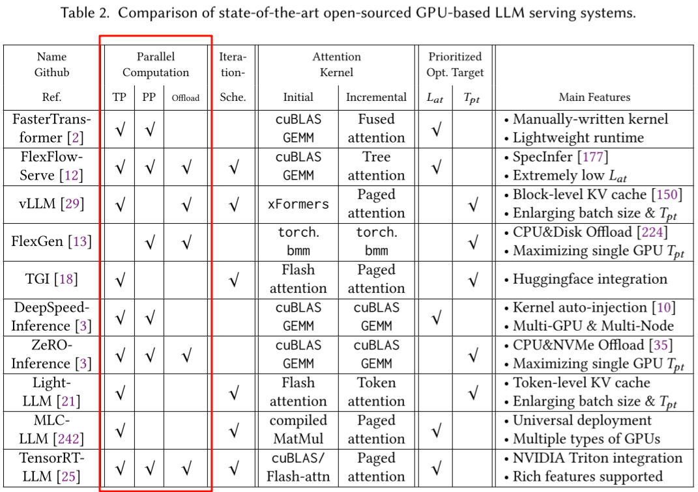
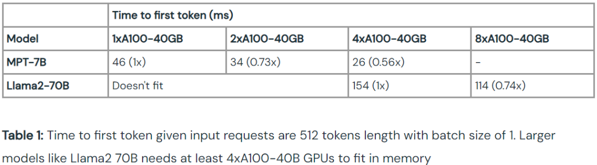
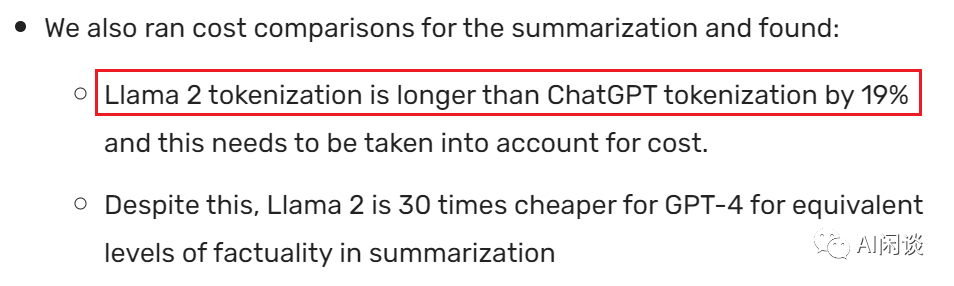
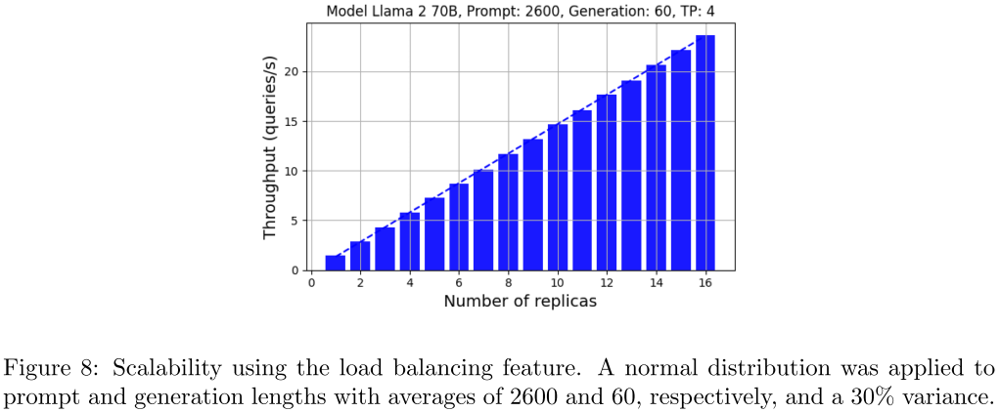

# 揭秘 LLM 推理：全面解析 LLM 推理性能的关键因素

**作者：** AI闲谈

---

一、背景介绍
二、LLM 推理介绍

2.1 LLM 推理过程

2.2 KV Cache

2.3 访存瓶颈

2.4 LLM 评估指标

2.5 影响 LLM 输出结果的因素

三、LLM 推理影响因素

3.1 硬件环境

3.1.1 推理集群

3.1.2 GPU 型号

3.1.3 GPU 成本

3.2 分布式策略

3.2.1 DP

3.2.2 TP

3.2.3 PP

3.2.4 TP + PP

3.2.5 Offload

3.3 精度类型

3.4 模型类型

3.5 数据分布

3.5.1 SGLang & RadixAttention

3.5.2 Lookahead 投机采样

3.5.3 DeepSpeed-FastGen

3.5.4 StreamingLLM

3.5.5 Tokenizer

3.6 Batch Size

3.6.1 Memory Bound -> Compute Bound

3.6.2 Continuous Batching

3.7 推理框架

3.8 多 LoRA

3.8.1 S-LoRA

3.8.2 Punica

3.8.3 Lorax

3.9 投机采样

3.10 采样参数

3.11 负载均衡

3.11.1 可变输入、输出长度

3.11.2 多样化流量分布

3.11.3 多 Pool 部署

四、总结和展望

五、相关链接

一、背景介绍

自 OpenAI 一年前发布 ChatGPT 以来，大型语言模型（LLM）领域经历了前所未有的快速发展。在短短一年时间内，涌现出了数以百计的 LLM 模型，包括开源模型如 LLaMA、Mistral、Yi、Baichuan、Qwen，以及闭源模型如 Claude、Gemini 等。这些模型的出现不仅丰富了人工智能的应用领域，也对模型推理框架提出了新的挑战。

与传统的 AI 模型不同，LLM 的推理过程具有其独特性，简单套用传统 AI 模型的推理框架往往难以满足效率和性能的需求。因此，针对 LLM 的特点，业内出现了一系列专门的推理框架，如vLLM、Huggingface TGI、DeepSpeed-MII、NVIDIA 的 TensorRT-LLM，以及国内的 LMdeploy 等，这些框架旨在优化和加速 LLM 推理，简化部署流程。

然而，在目前的工业界和学术界，尚未形成一个统一且完善的 LLM 推理性能基准测试（Benchmark）工具。这意味着在进行 LLM 的私有化推理部署时，往往缺乏有效的参考基准，需要进行重复的性能评估，以在不同的条件和方案中做出最优选择。造成这一状况的主要原因是影响LLM 推理性能的因素众多且复杂，包括但不限于硬件类型、模型配置、数据分布以及采用的优化策略等。

本文旨在全面总结这些因素，通过对各种影响因素的分析和探讨，提供一个全景式的视角来指导LLM 的推理部署。我们的目标是帮助读者在面对多样化的部署选项时，能够以最小的代价做出充分且明智的评估，从而优化 LLM 应用。

## 二、LLM 推理介绍

### 2.1 LLM 推理过程

当前的主流 LLM 基本都是 Decoder Only 的 Transformer 模型，其推理过程可以分为两个阶段：

- Prefill：根据输入 Tokens（Recite, the, first, law, of, robotics） 生成第一个输出 Token（A），通过一次 Forward 就可以完成，在 Forward 中，输入 Tokens 间可以并行执行（类似 Bert 这些 Encoder 模型），因此执行效率很高。
- Decoding：从生成第一个 Token（A） 之后开始，采用自回归方式一次生成一个 Token，直到生成一个特殊的 Stop Token（或者满足用户的某个条件，比如超过特定长度） 才会结束，假设输出总共有 N 个 Token，则 Decoding 阶段需要执行 N-1 次 Forward，这 N-1 次 Forward 只能串行执行，效率很低。另外，在生成过程中，需要关注的 Token 越来越多（每个 Token 的生成都需要 Attention 之前的 Token），计算量也会适当增大。

### 2.2 KV Cache

如下图所示，在 LLM 推理中最关键的就是下图中的 Multi-Head Attention，其主要的计算集中在左图中灰色的 Linear（矩阵乘）和 Scaled Dot-Product Attention 中的 MatMul 矩阵乘法：

如上右图中的 Mask 是一个下三角矩阵，也是因为这个下三角矩阵实现了 LLM Decoder 的主要特性，每个 Token 都只能看到当前位置及之前的 Token。

如下图所示，其中的 QKT 可以理解为一个相关性矩阵，如动图所示，4 个 Token 对应 4 个 Step，其中：

- Step 2 依赖 Step 1 的结果，相关性矩阵的第 1 行不用重复计算
- Step 3 依赖 Step 1 和 Step 2 的结果，相关性矩阵的第 1 行和第 2 行不用重复计算
- Step 4 依赖 Step 1、Step 2 和 Step 3 的结果，相关性矩阵的第 1 行、第 2 行和第 3 行不用重复计算

在 Decoding 阶段 Token 是逐个生成的，上述的计算过程中每次都会依赖之前的结果，此时最简单的思路就是 Cache 之前计算过的中间结果，在计算当前 Token 时直接从 Cache 中读取而不是重新计算，如下图所示，上面是没有 Cache 的情况，下面是有 Cache 的情况：

如下表所示，在 T4 GPU 上以 GPT2 模型为例验证有无 Cache 对推理时延的影响，其加速效果非常明显，因此也成为 LLM 推理的标配：

| GPT2/T4 | 无 KV Cache | 有 KV Cache | 加速比 |
| --- | --- | --- | --- |
| Output Token 1000 | 52.53s | 9.12s | 5.76x |

当然，KV Cache 也有一定不足，其相当于使用空间换时间，占用的显存会大幅增加，尤其是对于参数规模较大的模型。比如，对于 Vicuna-13B 模型（FP16 推理，其 Transformer layer num=40, embedding size=5120）来说，在 Sequence Length=1024，batch size=8 下，KV 缓存所占显存大小为 2 * 2 * 40 * 5120 * 1024 * 8 = 6.7G。

### 2.3 访存瓶颈

因为 Decoding 阶段 Token 逐个处理，使用 KV Cache 之后，上面介绍的 Multi-Head Attention 里的矩阵乘矩阵操作全部降级为矩阵乘向量。

除此之外，Transformer 模型中的另一个关键组件 FFN 中主要也包含两个矩阵乘法操作，但是 Token 之间不会交叉融合，也就是任何一个 Token 都可以独立计算，因此在 Decoding 阶段不用 Cache 之前的结果，但同样会出现矩阵乘矩阵操作降级为矩阵乘向量。

矩阵乘向量操作是明显的访存 bound，而以上操作是 LLM 推理中最主要的部分，这也就导致 LLM 推理是访存 bound 类型。

基于 V100 GPU，FP16 精度，LLM 推理 Prefill 阶段和 Decoding 阶段的 Roofline Model 可以近似表示如下（理论上限），其中

- 三角表示 Prefill 阶段：假设 Batch size 为 1，Sequence Length 越大，计算强度越大，通常都会位于 Compute Bound 区域。
- 圆表示 Decoding 阶段：Batch size 越大，计算强度越大，理论性能峰值越大，通常都会位于 Memory Bound 区域。

如下图所示，Prefill 阶段在比较小 Batch Size 下就可以获得比较大的计算强度，相应的吞吐也很高；而 Decoding 阶段需要比较大的 Batch Size 才能获得相对高的计算强度及吞吐（图片来自 [2308.16369] SARATHI: Efficient LLM Inference by Piggybacking Decodes with Chunked Prefills ）：

### 2.4 LLM 评估指标

针对 LLM 推理服务通常有两种调用模式，一种是传统的请求方式，一次请求获得所有的生成 Token，这种方式的好处是请求链路比较简单，但 LLM 推理的时间往往比较长，可能需要数秒，这也导致用户体验很不好；另一种是像 ChatGPT 一样的 Streaming 方式，其不是一次返回所有 Token，而是一边生成一边返回，只要生成速度大于人的阅读速度就能获得很好的用户体验。

针对上述的两种方式，也就引申出不同的评估指标。对于非 Streaming 模式，通常需要评估其整个请求的延迟（Latency），请求粒度的 QPS（Throughput）；针对 Streaming 模式，通常需要评估第一个 Token 生成的时延（Time To First Token，TTFT）和后续每个 Token 的时延（Time Per Output Token，TPOT，也就对应每秒能生成的 Token 数目）。除此之外，在评估时延时通常也需要按照不同的维度评估，比如平均时延、P90 时延、P99 时延等。

除了以上的服务指标外，服务的成本也是需要考虑的重要因素，比如 V100、A100 和 H100 哪种硬件更适合 LLaMA 13B 模型的推理部署，成本更低？

### 2.5 影响 LLM 输出结果的因素

在进行 LLM 推理优化、性能评估时首先要保证生成结果的对齐，然而这并不总能保证，主要有以下几个影响因素：

- 低精度量化（KV Cache INT8、GPTQ INT4、AWQ INT4）：必然会影响模型的输出结果。
- 采样参数：LLM 生成时会加上一些采样策略，以保证生成结果的丰富度，然而这些采样策略都会引入随机性，每次请求的结果会变，因此通常会首先会采用 Greedy Search 来去除随机性，等结果对齐之后再进一步打开引入随机性的采样策略。
- Batching：LLM 推理中提升吞吐最主要的手段就是通过 Batching 充分发挥 GPU 算力，然而不同的 Batch Size 会导致 LLM 推理时采用不同的 CUDA Kernel（不同的算法），进而导致出现误差，而且 LLM 这种逐个 Token 生成的方式会导致误差累积，结果差异会进一步放大。

在 LLM 推理中，要想保证生成结果的严格对齐通常是很困难的，此时往往需要进一步地全面评估来验证效果。

## 三、LLM 推理影响因素

### 3.1 硬件环境

与常规的 AI 模型推理一样，LLM 也可以选择使用 GPU 推理或使用 CPU 推理，与传统 AI 模型不同的是，LLM 模型往往很大，需要大量的存储空间，单个推理实例比常规的 AI 模型大得多。比如一个常见的 13B LLM 为例，使用 FP16 精度，其仅模型参数就需要 13B * 2 = 26GB 的存储空间，甚至很多 GPU 显存（比如 T4 GPU 只有 15GB 可用显存）都不足以装下模型参数，更不用说 KV Cache 等临时存储。此时往往需要采用分布式多卡推理，而一个 T4 GPU 却足以容纳多个 ResNet50 或 Bert Base 模型实例。

此外，LLM 的两阶段推理特性（Prefill 和 Decoding）也为硬件选型带来了很大的挑战和可能，可以从一个 LLM 推理集群的角度去考虑，也可以从 LLM 推理服务或单个 LLM 推理实例的角度去考量硬件配置。

#### 3.1.1 推理集群

微软和华盛顿大学在 [2311.18677] Splitwise: Efficient generative LLM inference using phase splitting 中提出了 Splitwise，作者专门构建了 LLM 推理集群，为 LLM 推理不同阶段选择不同的 GPU 类型，Prefill 阶段为计算密集型，可以选择高算力 GPU，而 Decoding 阶段为访存密集型，相应的可以使用算力不是特别强而访存带宽比较大的 GPU。同时为了两个阶段 KV cache 的共享，需要在 GPU 间有高速的 IB 网络互联。

如下图 Figure 2 所示，在 [2310.18547] Punica: Multi-Tenant LoRA Serving 中，作者针对多租户、多 LoRA LLM 推理场景构建了 LLM 推理集群，以便降低 LLM 推理的成本。

如下图 Figure 3 所示，在 [2311.15566] SpotServe: Serving Generative Large Language Models on Preemptible Instances 中作者基于不同云平台的廉价抢占式实例实现了快速、可靠的 LLM 推理服务。其动态的调整 LLM 的并行化配置，以适应波动的工作负载以及动态伸缩的实例，同时在整体吞吐量、推理延迟和推理成本之间取得平衡：

#### 3.1.2 GPU 型号

从推理集群的角度考虑 LLM 推理系统会更加的复杂，因此后续的介绍中我们都主要聚焦于单个 LLM 推理服务和推理实例。

LLM 模型推理计算量很大，使用 CPU 推理的性价比不高，相应的技术栈也是以 NVIDIA GPU 为主，因此我们主要考虑使用 NVIDIA GPU 推理的情况。使用 GPU 进行 LLM 推理时服务器的 CPU 和内存等往往不会成为瓶颈，通常是 GPU 成为制约因素。

NVIDIA 的 GPU 都可以用于 LLM 推理，只是性能各不相同，适合不同的场景和需求。比如在各大公司内使用的 V100、A100、A800、H800、H100，个人用户使用比较多的消费级 GPU RTX 4090 等。需要说明的是，有些 GPU 会有多种型号，比如不同的显存大小，不同的接口类型（A100 有 4 种，40GB 和 80GB，PCIE 和 NVLink 版本），这里我们简单列出一些常见的：

| GPU | RTX 4090 | T4 | V100 | V100 | A30 | A100 | H100 |
| --- | --- | --- | --- | --- | --- | --- | --- |
| 接口 | PCIE | PCIE | PCIE | NVLink | PCIE | NVLink | NVLink |
| 显存大小(GB) | 24 | 16 | 32 | 32 | 24 | 80 | 80 |
| 显存带宽(GB/s) | 1008 | 300 | 900 | 900 | 933 | 2000 | 3500 |
| CUDA 算力 | 82.6 | 16.2 | 31.4 | 31.4 | 20.6 | 39 | 134 |
| Tensor 算力 | 165 | 65 | 125 | 125 | 165 | 312 | 989 |

上述表格中的算力都是 FP16 算力，相应的 INT8 算力可以 x2；此外 Tensor Core 支持稀疏计算，算力是稠密的两倍，但是在 LLM 推理场景中很少使用，这里特指常见的稠密算力。

#### 3.1.3 GPU 成本

在进行 GPU 选型时除了要考虑性能，也要综合考虑各种成本。通常包含一次性成本和持续性运营成本：

- 一次性成本：
- 服务器：包括 GPU、CPU、内存等组件。
- 网络设备：交换机、专用 InfiniBand 设备等。
- 相关设备：比如机柜、电源和冷却系统等。
- 持续性运营成本：
- 电力消耗：GPU 服务器通常电量消耗比较高、散热比较大，对应的冷却系统也需要持续的电力消耗。
- 网络费用：集群可能需要访问外部网络，相应的网络专线也需要一定的成本。
- 硬件维护：硬件维护和置换也会有相应的成本。

如下图所示（Cloud GPUs - The Full Stack），同样的 GPU 在不同的云平台上价格也会有比较大的差异。即使同一个云平台，在不同的区域价格也可能不同。

### 3.2 分布式策略

在训练中常用的分布式策略包含数据并行（Data Parallelism，DP）、张量并行（Tensor Parallelism，TP）、流水线并行（Pipeline Parallelism，PP）以及 Offload，此外也会采用多机分布式训练。

在传统的 AI 模型推理中很少使用这些策略，因为其模型相对比较小，单卡显存足够，而 LLM 出现之后，分布式推理也变得越来越常见。如下图所示为常见 LLM 推理框架的支持情况（图片来自 [2312.15234] Towards Efficient Generative Large Language Model Serving: A Survey from Algorithms to Systems）。

#### 3.2.1 DP

在推理阶段，因为不会更新模型参数，DP 不再有意义，多实例和并发推理在某种程度上也可以理解为数据并行。

#### 3.2.2 TP

相比之下，基本上主流的 LLM 推理框架都支持 TP，其可以有效降低时延，缓解显存的限制（更大显存为 Continuous Batching 提供了更大的空间，可以进一步提升吞吐），也是当前推理优化中常用的手段。不过大部分推理框架中 TP 会按 Hidden 维度及 Multi Head Attention 中的 header 个数来切分，通常要求 TP 个数是 2 的幂次。主流的 GPU 服务器也都满足这个要求，比如 4 * T4 GPU 服务器，比如 Google Cloud Platform 上 A100 80G 就可以选择 1/2/4/8 GPU 套餐，更多相关配置可以参考 GPU 平台 | Compute Engine 文档 | Google Cloud。

如下两个图所示，不管是 Prefill 阶段第一个 Token 的时延 TTFT，还是 Decoding 阶段每个 Token 的时延 TPOP 都会随着 TP 的增加而降低（具体可参考 LLM Inference Performance Engineering: Best Practices | Databricks Blog）：

然而，TP 也有其局限性，其通信可能会比较大，成为另一种形式的访存瓶颈。如下图所示（图片来自 [2312.03134] A Hardware Evaluation Framework for Large Language Model Inference），以常见的 TP 划分方式为例，在一个 Transformer Decoder Layer 中在多个 GPU 间会有两次 AllReduce 通信，一次是 Multi-Head Attention 中的最后一个 Linear，一次是 FFN 中的最后一个矩阵乘。以 GPT-3 175B 为例，其包含 96 层，也就是说一次 Forward 要有 192 次 AllReduce（忽略 Word Embedding 相关通信）。每次的通信量与 Token Embedding 和 Batch Size 成正比，模型确定后 Token Embedding 大小确定，其大小就与 Batch Size 成正比。

由于 LLM 推理通常会使用 Continuous Batching 的方式提升吞吐，其随着 Batch Size 增加，Multi-Head Attention 和 FFN 的 Kernel 计算时延不会明显增加，而 AllReduce 的通信量却线性增加，相应的通信时延基本也线性增加，以至于 AllReduce 通信可能进一步成为瓶颈。而 GPU 间的通信时延与 GPU 之间的互联方式有关，比如节点内采用 PCIE 或 NVLink 互联，跨节点采用 IB 网卡互联等会导致时延有数倍的差距，此时就要根据相应的场景具体分析。

如下图所示为 Batch size 为 1 和 512 时 LLM 中几个主要 OP 的计算耗时，可以看出，将 Batch size 从 1 增加到 512，计算量增加 512 倍，但是其整体时间只增加为原来的 3 倍左右（图片来自 openppl-public · GitHub）：

除此之外，Continuous Batching 的方式会希望组合尽可能大的 Batch Size，也就意味着 GPU 上同一时间可能只有一个 CUDA 计算流，当 AllReduce 通信的时候并没有其他流的计算可以 overlap，相应的 GPU 也就会空闲，存在巨大算力浪费。

#### 3.2.3 PP

相比 TP，PP 中模型按层切分，一次 Forward，N 个 GPU 则有 N 次 GPU 通信，而且是两个 GPU 间，不是 AllReduce，PP 的通信量会小很多。然而，PP 并不能降低推理时延（甚至增加），对于时延敏感的服务不一定合适；此外，也可能导致负载不均衡、GPU 计算间出现很多 Bubble 的情况，比如最后一个 PP 还要承担 Word Embedding 相关计算，调度策略也会更加复杂。

如下图所示，其 PP 为 2，也就是两个 GPU，A、B、C、D 4个请求同时执行，则在 GPU 的调度中会存在很多 Bubble，比如 PB1、PB2 和 PB3，导致 GPU 的浪费：

当然，针对这种问题也有相应的解决方案，比如微软团队 [2308.16369] SARATHI: Efficient LLM Inference by Piggybacking Decodes with Chunked Prefills 中尝试将 Prefill 阶段的 Prompt 切分为不同的 Chunks，并将不同请求间的 Prompt Chunk 与 Decoding 结合以尽可能减少 Bubble，获得了不错的效果。

在 [2401.08671] DeepSpeed-FastGen: High-throughput Text Generation for LLMs via MII and DeepSpeed-Inference 中，作者更进一步在每个 Prompt Chunk 中都与其他请求的 Decoding 结合，进一步提升吞吐。

#### 3.2.4 TP + PP

TP 和 PP 有各自的优势，因此通常也会将其结合起来进行混合并行（在分布式训练中非常常用的手段）推理，以便充分发挥它们各自的优势。

如下图 Figure 8 所示（来自 [2302.11665] AlpaServe: Statistical Multiplexing with Model Parallelism for Deep Learning Serving）：

- 左边为 PP（Inter-op）：单个请求 Latency 不会随 GPU 数目增加而降低，甚至可能增加；橙色（Communication）通信耗时相对较小，但随着 GPU 数目增加绿色（Uneven Partition）Bubble 时间也会增加。
- 右边为 TP（Intra-op）：单个请求 Latency 会随着 GPU 数目增加而降低；与此同时橙色（Communication）通信耗时也比较大。

AlpaServe 中作者提出自动混合并行的调度策略，获得更优的效果。如下图可以看出，在没有 AlpaServe 的情况下，4 PP + 4 TP 相比 16 PP、8 PP + 2 TP 和 2 PP + 8 TP 获得了最优的结果（越大越好），而 AlpaServe 比 4 TP + 4 PP 获得了更优的结果（其中 SLO 为 Service Level Objective，CV 为 Coefficient of Variance）：

#### 3.2.5 Offload

Offload 策略会使系统调度变得更加复杂， 在模型比较大或者 GPU 资源非常有限的情况下会使用，这里就不再展开。可以参考 [2312.17238] Fast Inference of Mixture-of-Experts Language Models with Offloading 中针对 MoE 模型的 Offloading 优化，以及 [2303.06865] FlexGen: High-Throughput Generative Inference of Large Language Models with a Single GPU 中资源有限情况下的 Offloading 优化。

### 3.3 精度类型

所有的 NVIDIA GPU 都支持 FP32 精度，但是其算力相比 FP16 要小得多，而 FP16 推理相比 FP32 推理基本可以做到无损，所以 FP16 推理成为 LLM 推理的默认精度类型。

与此同时，INT8 推理和 INT4 推理也变得越来越流行，其一方面可以节约显存占用，另一方面也可以缓解 LLM 推理的访存瓶颈，此外也可以利用 GPU 更强的 INT8（FP16 的 2 倍） 和 INT4 算力（FP16 的 4 倍）。常见的使用 INT8 和 INT4 的方案有 KV Cache INT8、LLM.int8()、SmoothQuant w8a8、GPTQ INT4 和 AWQ INT4 等。当然，这些量化方案通常有一定损失，需要充分评估，比如 KV Cache INT8 通常可以做到几乎无损，而 GPTQ INT4 可能有一定损失。

然而，不同 GPU 支持的数据类型也不同，比如 V100 的 Tensor Core 不支持 INT8 和 INT4，H100 的 Tensor Core 不支持 INT4，所有 GPU 的 CUDA Core 都不支持 INT4：

虽然说量化可能对模型精度有一定影响，但是也提供了更多可能，比如 INT4 量化的 13B 模型可能效果、速度都比 FP16 的 7B 模型好，如下图所示（数据来自 GitHub - ggerganov/llama.cpp: Port of Facebook's LLaMA model in C/C++），蓝框中量化的 13B 模型比红框未量化的 7B 模型更小、困惑度更低（越低越好），同时时延（ms/tok）更低：

### 3.4 模型类型

目前业内开源的 LLM 比较多，其中主流的是 LLaMA-1 和 LLaMA-2，包括 7B、13B、30B 和 70B，以及基于此微调的 Vicuna 版本。

为了加快推理速度，Mistral AI 也发布了 Mistral 7B 模型和 Mixtral 8x7B 模型，其 Mistral 7B 模型采用 GQA（Grouped Query Attention） 和滑动窗口 Attention （Sliding Window Attention）机制，可以有效加快推理速度，并且其 7B 模型效果甚至达到或超越 LLaMA-13B 模型，因此也被广泛使用。Mixtral 8x7B 模型是一个 MoE 模型，包括 8 个专家，推理时仅采用 2 个专家，也就是计算量和 13B 模型相当，但是其效果接近 ChatGPT 3.5，目前也是业内跟进的重点模型。

此外，也有一些其他的 Attention 机制会影响推理吞吐，比如各种 Saprse Attention（OpenAI 模型用的比较多），如下图所示的 Selective Attention、Sliding + Dilated、Global token 和 Hash-based 等（图片来自 [2312.15234] Towards Efficient Generative Large Language Model Serving: A Survey from Algorithms to Systems）：

如下图 Fig.2 所示，不同模型大小不同、相应的推理吞吐也各不相同（图片来自 [2312.03863] Efficient Large Language Models: A Survey）：

### 3.5 数据分布

LLM 的整个推理时延由 Prefill 阶段时延和 Decoding 阶段时延决定，Prefill 时延对应第一个 Token 的时延，与输入序列中 Token 数量有关；Decoding 阶段时延决定了整体时延，由输出序列的 Token 数决定。

LLM 的输入和输出序列长度都是可变的，整个服务的时延由输入和输出数据的整体分布决定。比如在简单的问答场景，可能输入和输出都比较短；而在模型评估场景，当 Prompt 中加入 few-shot 示例后也会使输入明显变长而输出依旧很短；在 RAG 场景，可能输入和输出都会比较长。此外，有些推理框架会支持设置 max_decode_length，以此避免出现太长生成序列导致时延过高以及占用太多显存空间。比如可以设置 max_decode_length 为 256,512,1024，需要说明的是，约束 max_decode_length 可能会导致结果截断，进而影响生成效果。

#### 3.5.1 SGLang & RadixAttention

在 Few Shot Learning、Self-consistency、Multi-turn chat、Tree-of-thought 等场景中，用户的 Prompt 往往很长，而输出结果 Token 数比较少，同时不同请求间存在大量的公共前缀 Token，此时用户 Decoding 阶段的推理时间可能与 Prefill 相当，甚至更短。针对这种场景，[2312.07104] Efficiently Programming Large Language Models using SGLang 中作者提出了一种共享不同请求间公共前缀的方案，以此大幅降低 Prefill 的重复计算，提升性能，在一些常见的 LLM 推理任务上获得 5 倍的加速。

#### 3.5.2 Lookahead 投机采样

在 RAG 或文档总结等场景中，LLM 生成的内容很可能来自 Prompt 中之前步骤检索的内容，这就很适合作为投机采样方案中猜测的 Token 序列，避免需要额外的模型或者额外的 Head 来生成待验证 Token 的过程。针对这种场景，阿里提出 [2312.12728] Lookahead: An Inference Acceleration Framework for Large Language Model with Lossless Generation Accuracy，其相比之前的投机采样方案来说，Token 的接受率明显提升，也相应地减少了 GPU 算力的浪费。

#### 3.5.3 DeepSpeed-FastGen

在前面的 PP 小节我们介绍了 [2401.08671] DeepSpeed-FastGen: High-throughput Text Generation for LLMs via MII and DeepSpeed-Inference，其作者在每个 Prompt Chunk 中都与其他请求的 Decoding 结合，进一步提升吞吐。然而其效果也会受数据分布的影响，比如作者测试的都是 Prompt 比较长，而 Decoding Length 相对比较短的场景，如下图所示，如果相应 Generation 长度进一步增加，是否还能获得相应的收益也是值得考量的地方：

#### 3.5.4 StreamingLLM

LLM 通常是在 2K 或 4K 序列长度上进行预训练，在推理时基本也能涵盖大部分场景。但是从业界的趋势来看，需求的序列长度在逐渐变长，比如达到十几 K 甚至上百 K，此时就需要使用 LLM 位置编码的长度外推或内插方案来支持，但其会导致计算量的急剧增加。

针对这一场景，目前主流的方案是 [2309.17453] Efficient Streaming Language Models with Attention Sinks，其始终维护一个与训练时相当的滑动窗口来保证计算量不会剧烈增加，同时在序列开头保留几个特殊 Token 来避免效果下降太多，获得不错的效果。当然，这一方案目前还没被主流框架集成，此外也会存在精度的影响，需要进行评估。

#### 3.5.5 Tokenizer

Tokens 可以是单词或者子单词，将文本拆分为 Token 的规则因模型而异（不同模型中可能实现不同的 Tokenizer）。例如，LLaMA 中的 Tokenizer 和 OpenAI 模型的 Tokenizer 就不太一样。虽然评估 LLM 推理时经常讨论的是基于 Token 的度量（比如，tokens/s），但是考虑到 Tokenizer 的不同，这些指标在不同的模型之间进行比较时也需要充分考虑。比如，Anyscale 的团队发现 LLaMA2 生成的 Token 数目会比 ChatGPT 生成的 Token 数目多 19%，Huggingface 的研究者也发现 LLaMA2 的 Tokenizer 生成的 Token 数会比 GPT4 的多 20% 左右。如下所示为 Anyscale 的结论Llama 2 is about as factually accurate as GPT-4 for summaries and is 30X cheaper | Anyscale：

如下所示为 Huggingface 的结论：

### 3.6 Batch Size

由于 Decoding 阶段是逐个 Token 生成，存在明显的访存 Bound，导致可能只发挥 1% 左右的 GPU 算力，存在巨大算力浪费。为了充分发挥 GPU 算力，通常会使用 Continuous Batching 策略来提升处理的 Batch Size。但是增加 Batch Size 又会导致显存占用增加，处理延迟变长，因此往往需要根据时延需求和 GPU 显存容量等因素综合考虑。比如对于时延敏感场景，可能使用的 Batch Size 为 1, 2, 4，如果对时延不敏感且显存充足，Batch Size 甚至可以达到 64,128，直到开始出现计算瓶颈。

当然，Batching 也要考虑实际的请求并发数，如果流量比较小，却要组很大的 Batch Size，也可能导致等待时间过长，进而影响吞吐。

#### 3.6.1 Memory Bound -> Compute Bound

Batching 方式可以提升吞吐得益于其可以增加计算强度，比如从黄色球到紫色球再到红色球，其 TFLOP/s 在不断提升，相应的 GPU 利用率也会更高：

#### 3.6.2 Continuous Batching

如下图所示，使用 Continuous Batching 完成 7 个序列。左图为单次迭代后的批次，右图为多次迭代后的批次。一旦某个序列收到 END Token，就可以在其后立刻插入新的序列（即 S6、S5 和 S7），这样就可以实现更高的 GPU 利用率：

如下图所示为不同框架、不同的 Batching 策略相比原生的 Huggingface Transformer 推理的吞吐提升，最高获得了 23.51x 的提升（可参考 How continuous batching enables 23x throughput in LLM inference while reducing p50 latency）：

### 3.7 推理框架

有许多可以加快 LLM 推理速度、节约显存的手段，比如 Continuous Batching、KV Cache（INT8）、PagedAttention、FlashAttention 和 FlashDecoding 等；当然，传统的 Kernel 融合、CUDA Graph、图优化等手段也依然有用。业内也相继出现了很多不同的推理框架，针对不同手段进行不同的优化。常见的推理框架有 Huggingface TGI、vLLM、DeepSeed-Inference、LMdeploy 以及 NVIDIA 的 TRT-LLM 等。

如下图所示为常见 LLM 推理框架的支持情况（图片来自 [2312.15234] Towards Efficient Generative Large Language Model Serving: A Survey from Algorithms to Systems）：

- FasterTransformer 作为 LLM 流行之前的推理框架，针对 Transformer 模型支持各种 Kernel 融合策略，获得了很高的推理性能，后续的很多推理框架也基于 FasterTransformer，比如 LMDeploy is a toolkit for compressing, deploying, and serving LLMs. 和阿里的 RTP-LLM: Alibaba's high-performance LLM inference engine for diverse applications.，甚至 GitHub - NVIDIA/TensorRT-LLM 中的很多高性能 CUDA Kernel 也来自 FasterTransformer。
- 很多推理框架也不支持 PP，比如 vLLM、TGI、Light-LLM、LMdeploy 和 RTP-LLM 都不支持 PP。

不同框架特性不同，对模型支持的完善度也各不相同，性能也各有差异，甚至同一框架不同版本性能也略有不同。

如下图所示，在 LMdeploy 项目中，作者声称吞吐比 vLLM 明显提升：

如下图所示，vLLM 在 https://github.com/vllm-project/vllm/pull/2221 这个 PR 中使用 NCCL 替换了原始的基于 Ray 的分布式通信方式，其分布式推理吞吐得到明显提升：

### 3.8 多 LoRA

使用 [2106.09685] LoRA: Low-Rank Adaptation of Large Language Models 进行模型微调是一个非常常见的手段，可以大幅提升微调效率。对于单个 LoRA 模型，可以直接将其与 Base 模型合并进行推理即可，与常规的 LLM 推理并没有什么区别。对于多个 LoRA 的场景，当前大部分的推理框架还不支持（vLLM 刚支持，还不是很完善，https://github.com/vllm-project/vllm/pull/1804），只有 FastChat 或使用原生的 Huggingface Transformer 才能支持（阿里新发布的 RTP-LLM 也支持），当然，现在也有专门的多 LoRA 框架，比如 S-LoRA、Punica 和 Lorax。

#### 3.8.1 S-LoRA

在 [2311.03285] S-LoRA: Serving Thousands of Concurrent LoRA Adapters 中，作者发现，在传统的方案下，如果有多个 LoRA Adapter，就需要合并成多个模型副本，这也就丧失了不同请求间 batching 的机会（例如 query1 需要调用 lora1，query2 需要调用 lora2，query3 需要调用 lora3，那么，如果单独合并的话，query1，query2，query3 就要分别调用独立的模型 model1，model2 和 model3。然而，如果不合并的话，三个 query 在基座模型上的计算就可以 batching 处理）。最终可以支持上千个 LoRA 模型，获得 4 倍以上吞吐提升。

作者对于基座模型使用 batching 计算，然后使用自定义的 CUDA Kernel 为所有的 LoRA Adapter 执行额外的 xAB 计算，过程如下图 Figure 1 所示：

#### 3.8.2 Punica

在 [2310.18547] Punica: Multi-Tenant LoRA Serving 中，作者设计了一个多租户系统，该系统管理一个 GPU 集群，以使用共享的预训练基座模型为多个 LoRA 模型提供服务，最多获得了 12 倍的吞吐提升。

如下图 Figure 2 所示为 Punica 的系统架构，与其他模型服务相比：

- Punica 具有前端服务（Frontends），可面向用户提供 RESTful API，并将用户的请求转发给 Punica 调度器（Scheduler）。用户的请求包含 LoRA 模型的标识符和提示（prompt）。
- Scheduler 将请求分发给 GPU。
- 每个 GPU 都会启动一个 Runner，该 Runner 与 Scheduler 通信并控制所有 GPU 的执行。
- 当 GPU 生成新 Token 时，新 Token 会由 Runner 以 Streaming 方式传输给 Scheduler，再通过 Frontends 返回给用户。

#### 3.8.3 Lorax

GitHub - predibase/lorax: Multi-LoRA inference server that scales to 1000s of fine-tuned LLMs 是一个基于 Huggingface TGI 推理框架和 Punica 的多租户 LoRA 系统，其支持动态的 LoRA 模型加载，以及针对 LoRA 的 Continuous Batching 策略，并集成了各种高性能 CUDA Kernel，比如 FlashAttention、PagedAttention 等。

### 3.9 投机采样

投机采样是比较流行的 LLM 推理加速但又不影响生成效果的方案。其核心是通过某种低代价的方式（比如小模型、多头）生成多个候选序列，然后使用 LLM 来快速验证。常见的方案有 Parallel Decoding、Speculative Decoding、SpecInfer、Medusa、Lookahead Decoding 等。不过当前大部分的框架还不支持投机采样，基本都是每种算法基于 Huggingface Transformer 或者特定框架内实现。

此外，投机采样获得 2-3 倍加速的前提是算力无限，也就是专门针对 Batch Size 为 1 的场景，因为其计算量会增加数倍，相当于充分利用 Batch Size 为 1 时未发挥出来的 GPU 算力来换取生成速度，当使用 Continuous Batching 的情况下，将大大降低投机采样的加速比。此外，有些方法还需要额外微调的 LLM 模型才能支持，因此也需综合考虑各种代价。

### 3.10 采样参数

在 LLM 推理中，不同的采样参数会影响模型的生成效果，也会影响生成 Token 的数量，进而影响服务的吞吐和时延。常见的参数有 top_p，top_k，temperature、beam-size、repetition_penalty，max_output_len 等。

在进行 LLM 推理性能评估时可以考虑使用 Greedy Search，保证同一 Prompt 不同请求时的生成结果一致，进而避免随机性对评估结果的影响。

### 3.11 负载均衡

在实际的线上生产场景中，通常会采用多地域、多实例部署方案，以保证服务的稳定性、可靠性和响应速度。在一个服务中部署多个实例，一方面是单实例容量有限，需要多实例来提供足够的吞吐保障，另一方面也可以避免单点故障导致的服务不可用。

多实例场景会进一步引申出负载均衡的问题，比如多实例服务经常采用 Round Robin 策略，可以保证分发到每个实例的流量尽可能的均衡，但不足以保障每个实例的负载尽量均衡。主要是因为单个 LLM 推理实例的吞吐往往不高，整体时延也明显长于传统的服务；而且 LLM 推理中输入、输出序列都是变长的，每个实例的 QPS（Query 粒度，非 Token 粒度） 均衡 ≠ 每个实例负载均衡。

#### 3.11.1 可变输入、输出长度

在 [2401.08671] DeepSpeed-FastGen: High-throughput Text Generation for LLMs via MII and DeepSpeed-Inference 中作者针对 DeepSpeed-FastGen 框架的可伸缩性和负载均衡进行了测试，单个实例 4 个 A100，实例数从 1 扩展到 16 时基本能保持线性的吞吐提升：

当然，上述的测试对应的输入比较长，输出比较短，并且输出的方差也不是特别大，可能会弱化负载不均衡的问题：

#### 3.11.2 多样化流量分布

此外，当流量不均匀时也会对推理吞吐产生很大的影响，比如 [2310.18547] Punica: Multi-Tenant LoRA Serving 中作者验证了不同推理框架在不同流量分布情况下的吞吐（针对多 LoRA 场景，会进一步地放大问题）：

需要说明的是，单实例性能决定了多实例的性能上限，评估通常也是针对单实例的，负载均衡问题需要结合需求在更大规模的资源下测试。

#### 3.11.3 多 Pool 部署

TrueFoundry 提供了多 GPU Pool 部署的方案，采用生产者-消费者模式，其 LLM Gateway 接收用户请求，并将请求放入 Queue 中，供部署于不同 GPU Pool 的 LLM 实例来消费。主要有几个好处：

- 在 Gateway 可以更好地对流量分布进行统计和调度。
- 可以统计不同云平台的报价，动态的调整实例伸缩，以降低整体成本。
- 每个 LLM 实例也可以根据需求尽可能地以高负载运行，比如同时从 Queue 中获取 batch 的请求来处理。

## 四、总结和展望

本文我们深入探讨了影响 LLM 推理性能和部署的众多因素，从硬件环境、分布式策略、精度类型到模型类型、数据分布等多个维度进行了全面分析。通过这些详细的讨论，我们可以看到 LLM 推理性能的优化是一个多方面、多层次的问题，需要综合考虑不同因素的相互作用。

在实际应用中，选择最优的推理部署方案并非简单的黑白选择，而是一个需要根据具体场景细致权衡的过程。例如，硬件选择不仅取决于预算和性能需求，还需考虑能效和可持续性；而分布式策略的选择则需考虑模型的大小、网络延迟和同步开销。此外，模型的精度类型和大小也会直接影响推理效率和成本。因此，面对不同的应用场景和需求，部署 LLM 时的决策过程是复杂且富有挑战性的。

值得注意的是，本文的讨论集中在当前主流的文本处理 LLM 上。然而，AI 领域正在迅速发展，特别是在大型多模态模型（Large MultiModal Model，LMM）方面。这些模型结合了文本、图像、音频等不同类型的数据，提供了更加丰富和细腻的认知能力，但也带来了更大的技术挑战。由于多模态模型正处于快速发展阶段，其技术范式尚未固定，未来可能会有更大的调整和优化。因此，未来的研究需要进一步关注这些新兴模型的推理部署和性能优化。

## 五、相关链接

1. https://arxiv.org/abs/2308.16369
2. https://arxiv.org/abs/2311.18677
3. https://arxiv.org/abs/2310.18547
4. https://arxiv.org/abs/2311.15566
5. https://fullstackdeeplearning.com/cloud-gpus/
6. https://arxiv.org/abs/2312.15234
7. https://cloud.google.com/compute/docs/gpus?hl=zh-cn
8. https://www.databricks.com/blog/llm-inference-performance-engineering-best-practices
9. https://arxiv.org/abs/2312.03134
10. https://github.com/openppl-public
11. https://arxiv.org/abs/2401.08671
12. https://arxiv.org/abs/2302.11665
13. https://arxiv.org/abs/2312.17238
14. https://arxiv.org/abs/2303.06865
15. https://github.com/ggerganov/llama.cpp
16. https://arxiv.org/abs/2312.03863
17. https://arxiv.org/abs/2312.07104
18. https://arxiv.org/abs/2312.12728
19. https://arxiv.org/abs/2309.17453
20. https://www.anyscale.com/blog/continuous-batching-llm-inference
21. https://github.com/InternLM/lmdeploy
22. https://github.com/alibaba/rtp-llm
23. https://github.com/NVIDIA/TensorRT-LLM
24. https://arxiv.org/abs/2106.09685
25. https://arxiv.org/abs/2311.03285
26. https://github.com/predibase/lorax
27. https://www.truefoundry.com/
28. https://jalammar.github.io/how-gpt3-works-visualizations-animations/

LLM 推理优化可以参考：

1. [LLM 推理性能优化最佳实践](http://mp.weixin.qq.com/s?__biz=Mzk0ODU3MjcxNA==&mid=2247484362&idx=1&sn=a7a9cc60f95b78083bc12348b168d2cc&chksm=c364c48ff4134d9954f929a4de363bbee2f8a0590008d1ea2099635f503b1a970fa853639e0e&scene=21#wechat_redirect)

2. [LLM 推理常见参数解析](http://mp.weixin.qq.com/s?__biz=Mzk0ODU3MjcxNA==&mid=2247484444&idx=1&sn=da7767b359c5707a8a5c0096a5c9e48c&chksm=c364c359f4134a4f3b8321ab9cffa45deef6b3f453243d290db0fd9af643adaeb105762c6ba6&scene=21#wechat_redirect)

3. [LLM.int8() 论文解读](http://mp.weixin.qq.com/s?__biz=Mzk0ODU3MjcxNA==&mid=2247483930&idx=1&sn=38f65e4b554b40ca2e740b35986c8764&chksm=c364c55ff4134c4900b86a9c19b032929ede28f95773b6478f6d5fbddddb061c7e922564a05b&scene=21#wechat_redirect)

4. [StreamingLLM 论文解读](http://mp.weixin.qq.com/s?__biz=Mzk0ODU3MjcxNA==&mid=2247484057&idx=1&sn=7f98514d6546ec0621d35bb059b0ec3b&chksm=c364c5dcf4134ccac2b1586146aff1b6204b04255dbc2034b1d56fc29451eac2d8e2d4380126&scene=21#wechat_redirect)

5. [加速生成式 AI：Pytorch 团队重写 SAM 分割模型，8 倍加速](http://mp.weixin.qq.com/s?__biz=Mzk0ODU3MjcxNA==&mid=2247485147&idx=1&sn=f90807f1c2e0aabd9a3190c74197bc13&chksm=c364c19ef4134888a16fe4b017606c56a04cf4192e78eec13d89d3f59f94288bf030dd2ddcd0&scene=21#wechat_redirect)

6. [LLM剪枝稀疏化+量化：6 倍加速](http://mp.weixin.qq.com/s?__biz=Mzk0ODU3MjcxNA==&mid=2247485170&idx=1&sn=f3fa0b9716f98b3d8239500e33fa0185&chksm=c364c1b7f41348a1819c55c6d93ca7fbc578fe1e7c9364d0ccc7c31d1ee7c13a3c02b44bc2af&scene=21#wechat_redirect)LLM 加速解码方案可以参考：

1. [Blockwise Parallel Decoding 论文解读](http://mp.weixin.qq.com/s?__biz=Mzk0ODU3MjcxNA==&mid=2247483742&idx=1&sn=47e560f7807d9a62075abb6d15183593&chksm=c364c61bf4134f0d13ae807f9d44969e2421e391bfa75280b9a6331bf5190ae8cbda9b898708&scene=21#wechat_redirect)

2. [Skeleton-of-Thought: LLM Parallel Decoding 论文解读](http://mp.weixin.qq.com/s?__biz=Mzk0ODU3MjcxNA==&mid=2247483784&idx=1&sn=016c2d9bff5596bc4b2ec072c85f1bf4&chksm=c364c6cdf4134fdb5ba4713b6d1a49049742935d217a393f0e059c4c983cebf4d8c8778590f3&scene=21#wechat_redirect)

3. [LLM 投机解码 & 美杜莎(Medusa)实现](http://mp.weixin.qq.com/s?__biz=Mzk0ODU3MjcxNA==&mid=2247483892&idx=1&sn=8ba8df6e8a80405e5e3e61b24dcbb79f&chksm=c364c6b1f4134fa7acbf96c1fd4d952572c5c2887957b545ac0bbd30ee26f4dac2518412e271&scene=21#wechat_redirect)

4. [SpecInfer 投机推理论文解读](http://mp.weixin.qq.com/s?__biz=Mzk0ODU3MjcxNA==&mid=2247483844&idx=1&sn=f6ceaa4958e6cde4329bc8827937d42f&chksm=c364c681f4134f978631bbe25d0cb4af1261ec3b6ee5b973a2a20c6e180a1f14cc38b48a1e91&scene=21#wechat_redirect)

5. [Speclative Decoding(投机采样)论文解读](http://mp.weixin.qq.com/s?__biz=Mzk0ODU3MjcxNA==&mid=2247483817&idx=1&sn=96e9e182b755b3315ea85b1dc7fc4d0d&chksm=c364c6ecf4134ffafe22ba72209719540d98fa5042434081e659b90889552e25f918e6f70104&scene=21#wechat_redirect)

6. [Lookahead Decoding & 6 种 LLM 加速解码对比](http://mp.weixin.qq.com/s?__biz=Mzk0ODU3MjcxNA==&mid=2247485269&idx=1&sn=9f0515f0b4bd3a3954fa566d29a0eb28&chksm=c364c010f413490643d38a5200d30d7d8f8b51cf3829456d8f9cd29faf6e0b8ea5b617496bca&scene=21#wechat_redirect)

7. [阿里开源 Lookahead：RAG 场景 LLM 推理吞吐提升 2-5倍](http://mp.weixin.qq.com/s?__biz=Mzk0ODU3MjcxNA==&mid=2247485755&idx=1&sn=bb4bf5c287c5c0a6e7957c4b30afa934&chksm=c364ce7ef4134768f6577a3c6faf2be7f037614bfb59d999bfe8ea88d99f39b2a907a131c370&scene=21#wechat_redirect)

GPU 相关具体参数可以参考：

1. [GPU 关键指标汇总：算力、显存、通信](http://mp.weixin.qq.com/s?__biz=Mzk0ODU3MjcxNA==&mid=2247484942&idx=1&sn=2b69b610d4dacdc372036916d4c91325&chksm=c364c14bf413485d01b3d766d47ecfa170bef6451a97f981d1dc0d0261e23ec088961f423db1&scene=21#wechat_redirect)
多 LoRA 模型 LLM 推理可以参考：

1. [Punica：多 LoRA 服务系统，提升 12 倍吞吐](http://mp.weixin.qq.com/s?__biz=Mzk0ODU3MjcxNA==&mid=2247484993&idx=1&sn=39915820f788ffc94ee5f353c9acc277&chksm=c364c104f4134812cb7b6e22e6aa06c4e92be0779ea0643fc534319b7266e4d8f718f1be7d46&scene=21#wechat_redirect)

2. [S-LoRA：上千 LoRA 模型，4 倍以上吞吐提升](http://mp.weixin.qq.com/s?__biz=Mzk0ODU3MjcxNA==&mid=2247484973&idx=1&sn=62f327dfa3496d74ae9b2dc652408bb0&chksm=c364c168f413487e9a8143a235a17ce56c7f9796e992d8c47b41d2d995c59909460e52173986&scene=21#wechat_redirect)

