# 最全 LMM 模型结构（13种）综述

**作者：** AI闲谈

---

一、背景

最近一年，随着 ChatGPT 的发布，大型语言模型（LLM）获得了前所未有的关注，开源 LLM 不断涌现，例如 LLamA 系列、MPT 系列，以及国内的 Baichuan 系列、ChatGLM 系列等。在这些模型的基础上，研究者还进一步开发了 Vicuna 系列模型等，这些模型在各种任务上的性能不断提升。同时，越来越多的研究者开始将 LLM 引入到多模态任务中，产生了一系列大型多模态模型（Large Multimodal Models, LMM），其中以视觉-语言模型最为热门。在本文中，我们将重点介绍最近一年内流行的视觉-语言模型（Vision-Language Model，VLM）。

由于 LLM 只具备处理文本的感知能力，因此需要弥补自然语言和图像模态之间的差距。然而，通过端到端的方式来训练 LMM 代价非常高，并且可能带来灾难性遗忘的风险。因此，目前更实际和常见的方法是基于预训练的视觉编码器和 LLM 来构建 VLM。然而，它们之间存在巨大的模态差距，为了弥补这些差距，研究者提出了各种模态对齐的方案，主要分为以下两类：

- 基于 Learnable Query 的方案，包括：
- Perceiver Resampler
- Q-Former
- Cross-Attention
- 基于投影（Projection）的方案，包括：
- 单层 Linear 投影
- 两层 MLP（多层感知机）

与模态对齐不同，预训练视觉模型（Vision Model）和语言模型（Language Model）的选择更趋同。主要的 Vision Model 包括各种 ViT 模型，如 CLIP ViT 和 EVA-CLIP ViT 系列，而 Language Model 主要以 LLaMA 及其派生的 Vicuna 为主。当然，每家公司也可能选择自研的语言模型。各种模型的具体组成如下图所示：

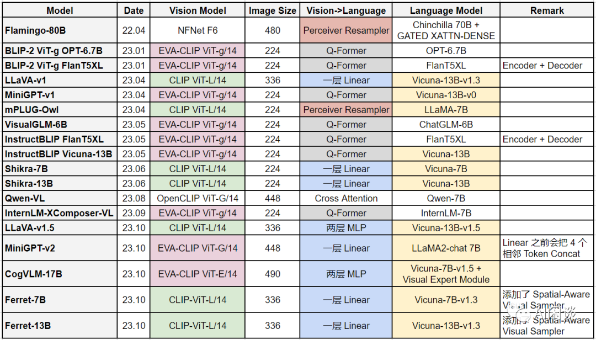

最近常见多模态 LMM 的解读可以参考：

1. [微软 GPT-4V 技术报告解读（1）](http://mp.weixin.qq.com/s?__biz=Mzk0ODU3MjcxNA==&mid=2247484149&idx=1&sn=cde16bd7ddcbd2977115d4c99fc9b99e&chksm=c364c5b0f4134ca6f5890a09c7a3e22dd837e7632b24ee160de058a3d78cd88bcb64695da3ba&scene=21#wechat_redirect)

2. [微软 GPT-4V 技术报告解读（2）](http://mp.weixin.qq.com/s?__biz=Mzk0ODU3MjcxNA==&mid=2247484329&idx=1&sn=d82e6396fcebae4b7c1977083fc86900&chksm=c364c4ecf4134dfaabe1fc2bb0bdaa3b92665535639c36276f00a366110902843215074590c2&scene=21#wechat_redirect)

3. [CogVLM: Visual Expert for Large Language Models 论文解读](http://mp.weixin.qq.com/s?__biz=Mzk0ODU3MjcxNA==&mid=2247484386&idx=1&sn=dbba140094e886a97d1c1c8a2d6057d0&chksm=c364c4a7f4134db104ae1f1f00c488e668a26eb92b18c1b28a4e584ff249872310423a5caf66&scene=21#wechat_redirect)

4. [MiniGPT-v2 论文解读](http://mp.weixin.qq.com/s?__biz=Mzk0ODU3MjcxNA==&mid=2247484403&idx=1&sn=d94fee47af49658ba69a0573d1857603&chksm=c364c4b6f4134da0102cf501fb5103fa4aa32135b9862ee1d365b4730ace78a437a1130cbde1&scene=21#wechat_redirect)

5. [LLaVA-1.5 论文解读](http://mp.weixin.qq.com/s?__biz=Mzk0ODU3MjcxNA==&mid=2247484468&idx=1&sn=240dd86c14e5e8ce519bd85b4f05b6bf&chksm=c364c371f4134a67d2cc394dcfd6caf0bcd682fb6bdd394c4638e38b43be62b18cc09974b3b6&scene=21#wechat_redirect)

6. [BLIP-2 论文及实现解读](http://mp.weixin.qq.com/s?__biz=Mzk0ODU3MjcxNA==&mid=2247484650&idx=1&sn=307af6a448514f992fbcee99c1259349&chksm=c364c3aff4134ab93a8313c22b7dd7b89925536ee219ae33e5c3b663006c4d1f53b80f754b96&scene=21#wechat_redirect)

常见多模态数据集的解读可以参考：

1.[LMM 视觉问答（VQA）数据集解读](http://mp.weixin.qq.com/s?__biz=Mzk0ODU3MjcxNA==&mid=2247484515&idx=1&sn=94b77ab783e903632c83a952a85a4c3c&chksm=c364c326f4134a30c59e9fe1a5a93e030cebb5a893108677d3209e1c17a06c7b7bf4e16d8c51&scene=21#wechat_redirect)

2. [LMM 视觉描述（Captioning）和定位（Grounding）数据集](http://mp.weixin.qq.com/s?__biz=Mzk0ODU3MjcxNA==&mid=2247484571&idx=1&sn=0105194bd7493c33fd8d53be97f688b7&chksm=c364c3def4134ac8512d1d64c7e789e1edabe48e347652c73dc32492cec5627fbdb88cd2eaff&scene=21#wechat_redirect)

其他多模态相关解读可以参考：

1. [Woodpecker: LMM 幻觉校正 - 论文解读](http://mp.weixin.qq.com/s?__biz=Mzk0ODU3MjcxNA==&mid=2247484619&idx=1&sn=355452b204baac7d84bf461fa7788864&chksm=c364c38ef4134a98e922fdff26198ff3293428fad82889208e24a9a9c4fe599efbfdd7094fe5&scene=21#wechat_redirect)

### 1.1 ALBEF

对应的论文：[2107.07651v2] Align before Fuse: Vision and Language Representation Learning with Momentum Distillation

如下图 Figure 1 所示为 Albef 的模型结构，可以看出其主要由三部分组成：

1. Image Encoder：作者采用 12 层的 ViT-B/16，用于从图像中提取 image embedding。
2. Text Encoder：作者采用 6 层的 Transformer encoder，从 Bert-Base 的前六层初始化，用于提取 text embedding。
3. Multimodal Encoder：也是 6 层的 Transformer encoder，从 Bert-Base 的后六层初始化，并在 Self Attention 后添加 Cross Attention，实现 image embedding 和 text embedding 的交互，提取多模态 embedding。从这里也可以看出，Albef 没有使用 decoder，所以不具备序列文本生成能力，如果需要执行 VQA 等任务，需要额外添加 decoder。

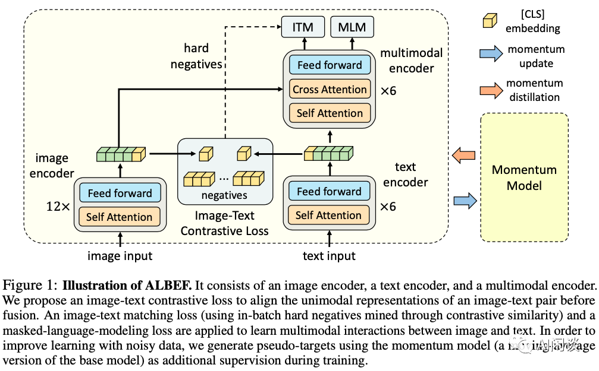

### 1.2 Cross Attention

由于后续的很多模块都使用了 Cross Attention，所以我们此处对其进行简单的介绍，说明是如何通过 Cross Attention 实现维度转换的（很多 VLM 使用较大的图像输入，会导致生成比较多的 Patch embedding，也就是 Vision Token embedding。而 LLM 本身的序列长度也有限，因此为了给 LLM 输入 text 留下更多空间，往往期望降低 Token 数目，当然也涉及 embedding 维度的对齐）。

假设输入的 Query embedding 维度 32 x 768，输入的 image embedding 维度 257 x 1024 为例，如下所示，可以看出 Cross Attention 的过程，K 和 V 的维度为 1024 x 768，Q 的维度为 768 x 768，所以对应的 Attention Score 的维度为 32 x 257，最终也可以保持 Query embedding 维度不变，依然为 32 x 768（红框）：

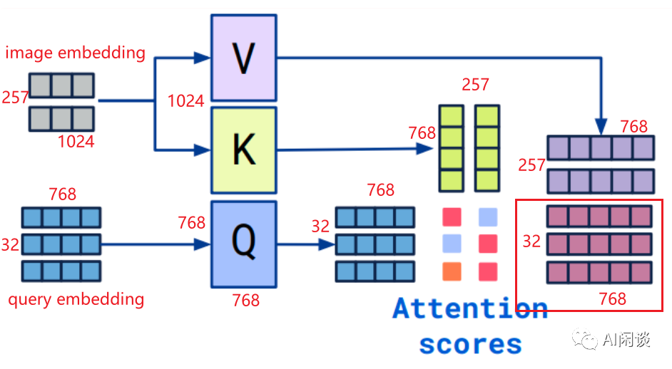

## 二、Flamingo

对应的论文：[2204.14198v2] Flamingo: a Visual Language Model for Few-Shot Learning

Flamingo 模型结构如下图 Figure 3 所示，其支持多图像、多文本输入，模型包含三个主要组件：

1. Vision Encoder：作用是将图片或者视频帧转换为特征，作者采用 NFNet 的 F6 模型，输入图片，输出对应的特征，维度为 [S, d]，其中 S 表示有多少块，d 表示每一个块的特征维度。类似于其他 VLM 常用的 ViT 模型。
2. Perceiver Resampler：作用是对 Vision Encoder 生成的较大的图片特征转换为较小的 Visual Tokens，也就是进行采样，最后生成固定个数的 Token（64）。
3. Large Language Model：主要作用是接收 Viisual Token 和输入文本，然后生成文本，作者采用了 Chinchilla 系列模型。在 LLM 中的部分层之间会插入 GATED XATTN-DENSE 组件。

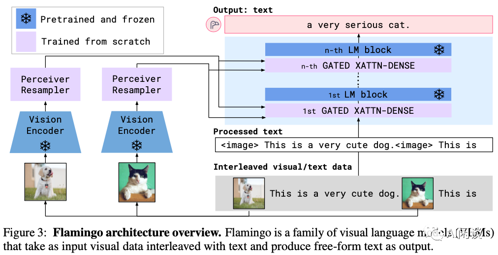

其中的 Perceiver Resampler的结构如下图 Figure 5 所示，可以看出，它是一个常规的 transformer block，其中的 Attention 使用 Cross Attention，具体来说：

- 每个图像经 Vision Encoder 会生成一个 [S, d] 的视觉特征，T 个图像对应 x_f 的维度为 [T, S, d]
- x_f 加上维度为 [T, 1, d] 的 time_embeddings
- 将时间和空间维度拉平，x_f -> [T*S, d]
- 将 x_f 作为 transformer block 的 Key 和 Value 输入
- 自定义的 R 个可学习的 Query Token，对应维度为 [R, d]
- 然后经过 num_layers 层 transformer block 得到对应的新的视觉特征 x，维度为 [R, d]，和可学习的 Query 维度一致

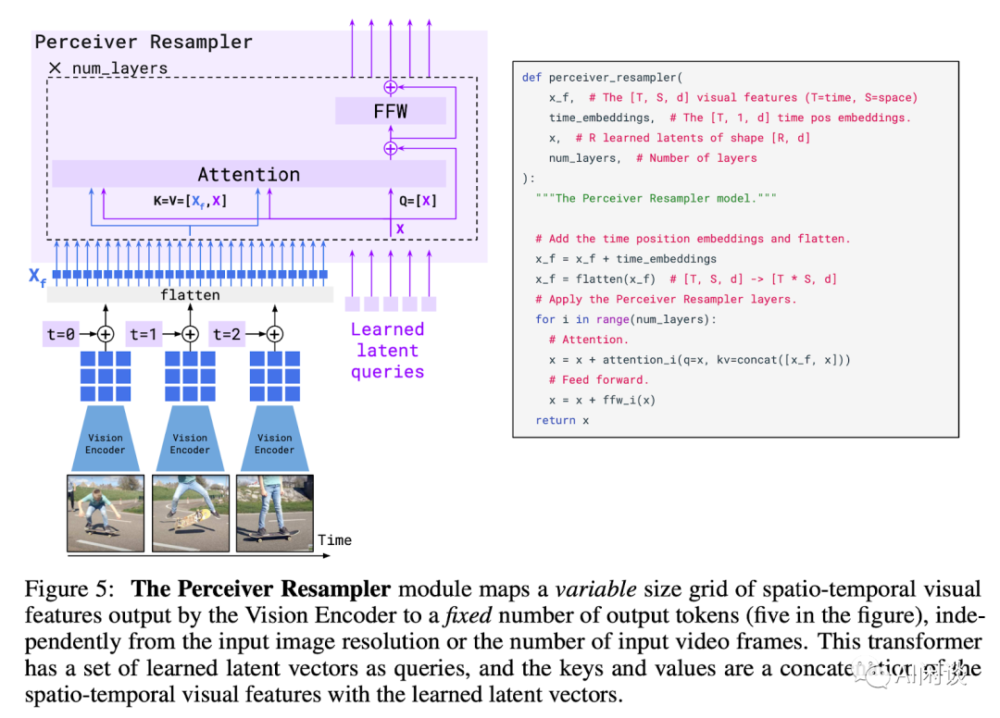

作者并非直接使用现有的 LLM 进行文本生成，而是插入了一定的 GATED XATTN-DENSE 组件，具体如下图 Figure 4 所示，其也是通过 Cross Attention 实现视觉特征和文本特征的交叉，具体来说：

- 将 Perceiver Resampler 生成的 Vision input 作为 Key、Value 输入，Language input 作为 Query 输入
- 首先经过 Gated Cross Attention
- 然后经过 Gated FFW（Feed Forward MLP）
- 输出并作为下一个 LLM 的 transformer layer 的输入

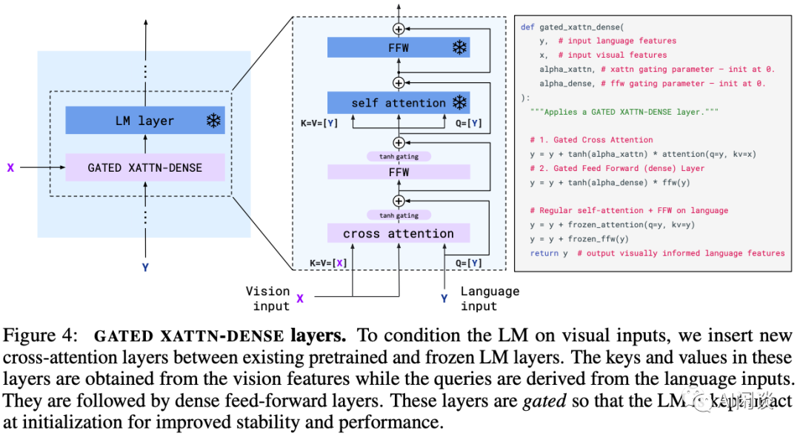

如下图 Figure 7 展示了多个图像、文本输入的排布：

- 视觉图像全部需要经过 Vision Encoder + Perceiver Resampler 生成的 Vision input 作为 Key、Value 输入。
- 文本全部经 Tokenization 后输入。当然，在文本中会插入 <BOS>、<EOC> 等起止 Token，也会插入 <image> Token 作为图像的位置标识。
- 其中的 Cross Attention Mask 也经过特殊设计，让文本只和相关图像进行交互。

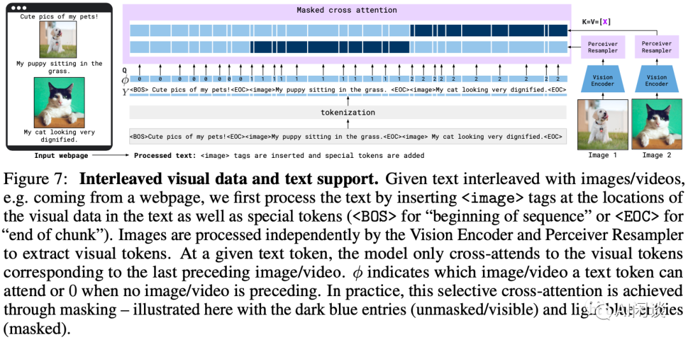

Flamingo 系列包含三个模型，Flamingo-3B，Flamingo-9B 和 Flamingo-80B（也就是 Flamingo），对应的配置如下图 Table 4 所示：

- 三个模型使用相同大小的 Perceiver Resampler。
- Flamingo-3B 采用 Chinchilla 1.4B 作为冻结的 LLM，其有 24 层，然后在每一层之前添加一个 GATED XATTN-DENSE 层，共 24 层。
- Flamingo-9B 采用 Chinchilla 7B 作为冻结的 LLM，其有 40 层，然后在每 4 层之前添加一个 GATED XATTN-DENSE 层，也就是在 0, 4, 8, 12, 16, 20, 24, 28, 32, 36 层之前添加，共 10 层。
- Flamingo-80B 采用 Chinchilla 70B 作为冻结的 LLM，其有 80 层，然后在每 7 层之前添加一个 GATED XATTN-DENSE 层，也就是在 0, 7, 14, 21, 28, 35, 42, 49, 56, 63, 70, 77 层之前添加，共 12 层。

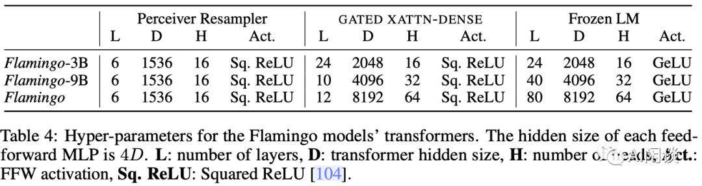

## 三、BLIP-2

对应的论文为：[2301.12597v3] BLIP-2: Bootstrapping Language-Image Pre-training with Frozen Image Encoders and Large Language Models

BLIP-2 模型结构如下图 Figure 1 所示，其也是包含三个基础组件：

1. Image Encoder：和 Flamingo 模型的 Vision Encoder 作用一样，也是用于提取视觉特征，作者采用的是CLIP ViT-L/14 和 EVA-CLIP ViT-g/14。其他 VLM 大多也采用这两个模型作为 Vision Encoder。
2. Q-Former：本文作者提出的组件（Query Transformer），用来弥补 image 模态和 text 模态的差距，实现特征对齐。
3. Large Language Model：和 Flamingo 模型的 LLM 作用相同，用于生成文本，不过作者没有对 LLM 的结构进行修改，作者选择了 OPT 系列和 FlanT5 系列 LLM。

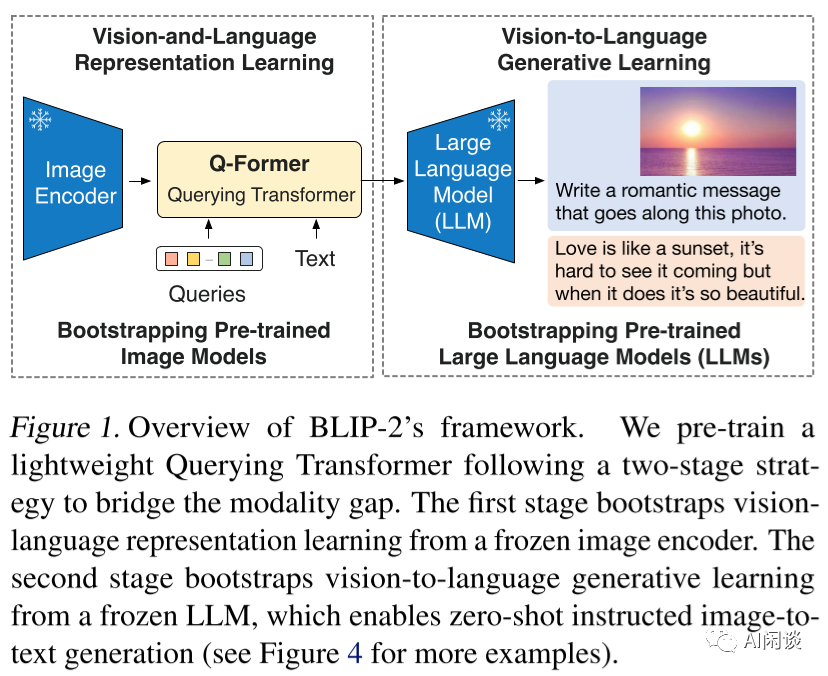

其中 Q-Former 的结构如下所示，它能够从 Image Encoder 中提取固定数量的输出特征，与输入图像分辨率无关。其由两个共享 Self Attention 的 Transformer 子模块组成（也就是说，图中橙色的 Self Attention 是共享的，灰色的 Cross Attention、紫色的 Feed Forward 和绿色的 Feed Forward 都是独立的）：

- Q-Former 左侧为 image transformer：与冻结的 image encoder 交互以进行视觉特征提取
- Q-Former 右侧为 text transformer：可以用文本 encoder 和 文本 decoder

在 Q-Former 中，作者额外创建了一组可学习的 Query embedding 作为 image transformer 的输入（这与 Flamingo 中R 个可学习的 Query Token 作用一样）。这些 Query embedding 在 Self Attention 层相互交叉，并通过 Cross attention 层（每隔一个 transformer block 有一个 Cross attention）与冻结的 image encoder 输出的 image embedding 进行交叉。此外，这些 Query embedding 还通过相同的 Self Attention 与 text embedding 相交叉。作者使用 Bert Base 的预训练权重来初始化 Q-Former，其中的 Cross Attention 是随机初始化的，Q-Former 总共包含 188M 个参数（包括 Query embedding）。

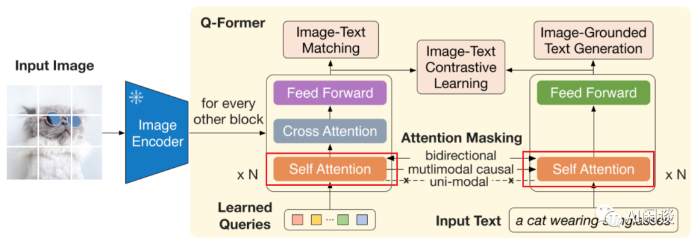

根据预训练任务不同，作者会使用不同的 Self Attention Mask 来控制 Query embedding 和 text embedding 的交互：

- Image-Text Matching：下图第一列，可以看出，相当于没有 Mask，也就是 Query 中的每个 Token 和 Text 中的每个 Token 都能看到 Query + Text 中的所有 Token。此时的 text transformer 相当于 encoder。
- Image-Grounded Text Generation：下图第二列，相当于 Query 会 Mask 掉所有 Text，Text 有 Causal Mask，也就是说，Query 中的 Token 能看到 Query 内的所有 Token，而看不到 Text 中的 Token；同时，Text 中的 Token 都能看到所有 Query 中的 Token，并且只能看到 Text 中当前 Token 之前的 Token。此时的 text transformer 相当于 decoder。
- Image-Text Contrastive Learning：下图第三列，相当于 Query 和 Text 都 Mask 掉彼此，而在内部没有 Mask，也就是说，Query 中的 Token 只能看到 Query 中的所有 Token，Text 中的 Token 只能看到 Text 中的所有 Token，此时 text transformer 相当于 encoder。

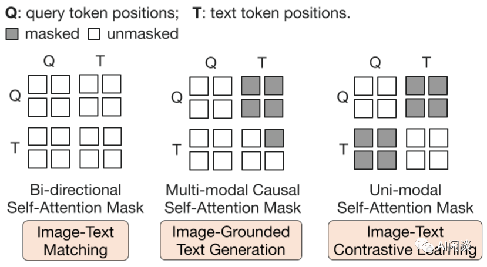

在本文的实验中，作者使用了 32 个 Query，每个 Query 的维度为 768，与 Q-Former 中的 hidden 维度相同。也就是对应的 Query 的维度为 （32 x 768），由于 transformer block 并不会更改输入的维度，因此 image transformer 输出的维度 Z 也为 （32 x 768），这相比冻结的 image encoder 输出的维度小得多（比如，ViT-L/14 对应输出维度为 257 x 1024）。这种架构与预训练一起协同，迫使这些 Query 提取与 Text 最相关的视觉信息。

## 四、LLaVA-v1

对应的论文：[2304.08485v1] Visual Instruction Tuning

如下图 Figure 1 所示为 LLaVA-v1 的模型结构，可以看出其简化了很多，但整体来说还是由三个组件构成：

1. Vision Encoder：和 Flamingo 模型的 Vision Encoder 作用一样，也是用于提取视觉特征，作者采用的是CLIP ViT-L/14。
2. Projection W：其比 Flamingo 中的 Perceiver Resampler和 BLIP-2 中的 Q-Former 简单得多，只是一层简单的 Linear，将 image feature 映射到 LLM 的 word embedding 空间。
3. Large Language Model：和 Flamingo 模型的 LLM 作用相同，用于生成文本，不过作者没有对 LLM 的结构进行修改，直接使用了 Vicuna-v1.5 13B 模型。

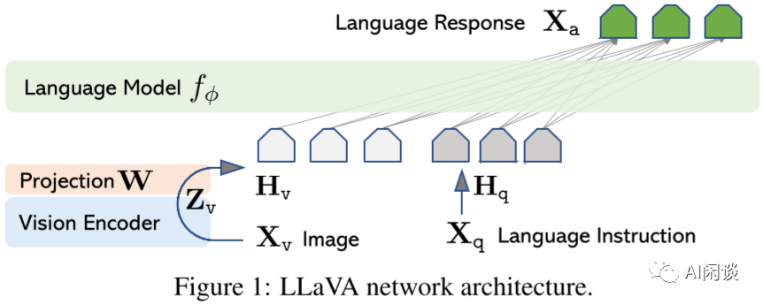

## 五、LLaVA-v1.5

对应的论文：[2310.03744] Improved Baselines with Visual Instruction Tuning

如下图所示为 LLaVA-v1.5 的模型结构，可以看出变化很小，主要包括：

1. Vision Encoder：输入图像从 LLaVA-1 的 224x224 扩展到 336x336，作者采用的是CLIP ViT-L/336px。
2. Vision-Language Connector：从 LLaVA-1 的单层 Linear 扩展为两层 MLP，中间使用 GELU 激活。
3. Large Language Model：从 LLaVA-1 的 Vicuna-v1.3 13B扩展为 Vicuna-v1.5 13B。

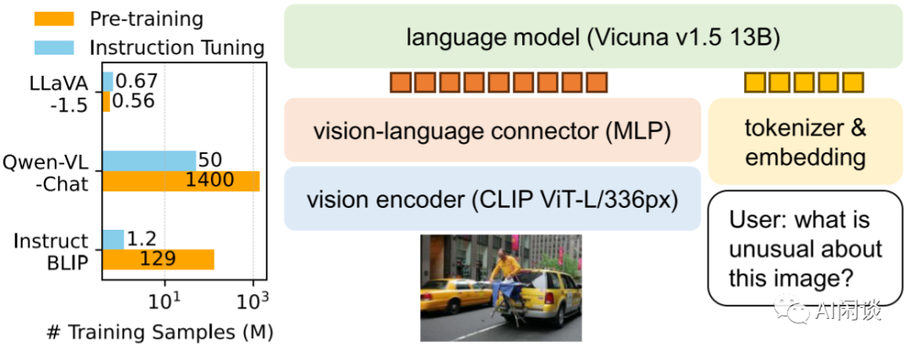

## 六、MiniGPT-v1

对应的论文：[2304.10592v2] MiniGPT-4: Enhancing Vision-Language Understanding with Advanced Large Language Models

MiniGPT-4 的模型结构如下图 Figure 1 所示，可以看出其和 BLIP-2 几乎一样：

1. Vision Encoder：直接使用了 BLIP-2 的方案，作者用的是EVA-CLIP ViT-G/14。
2. Projection：BLIP-2 的 Q-Former 也完整保留，同样后面增加了一层可训练的 Linear 层。
3. Large Language Model：使用 Vicuna-v0 模型作为 LLM。

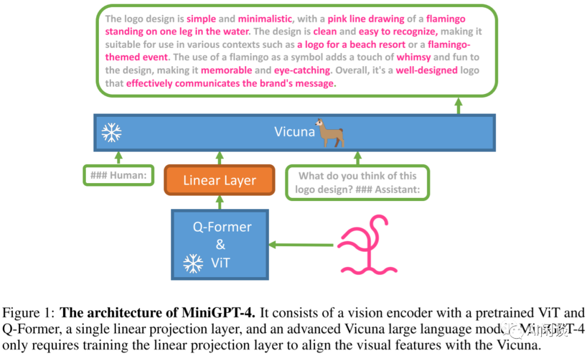

如下图 Table 4 所示，作者也验证了不使用 Q-Former，或者换成 3 层 MLP 等方案，发现还是使用冻结的 Q-Former 比较好：

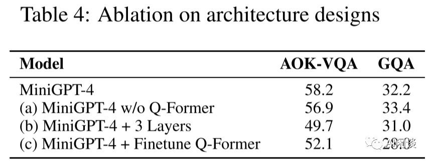

## 七、MiniGPT-v2

对应的论文：[2310.09478] MiniGPT-v2: large language model as a unified interface for vision-language multi-task learning

MiniGPT-v2 的模型结构如下图 Figure 2 所示，可以看出，其模型结构和 LLaVA 更相似了：

1. Vision Encoder：将 EVA（[2211.07636] EVA: Exploring the Limits of Masked Visual Representation Learning at Scale） 作为视觉主干，并在整个模型训练期间冻结视觉主干。
2. Projection：对于更高分辨率的图像（如 448x448），投影所有图像 Token 会导致非常长的序列输入（例如，1024 个 Token），其会显著降低训练和推理效率。因此，作者在嵌入空间中连接 4 个相邻的视觉 Token，并将它们一起投影到大型语言模型的同一特征空间中的单个 embedding 中（如下图的绿色框，直接 concat 到一起），从而将视觉输入 Token 的数量减少了 4 倍。
3. Large Language Model：使用开源的 LLaMA2-chat（7B，[2302.13971] LLaMA: Open and Efficient Foundation Language Models）作为语言模型主干。

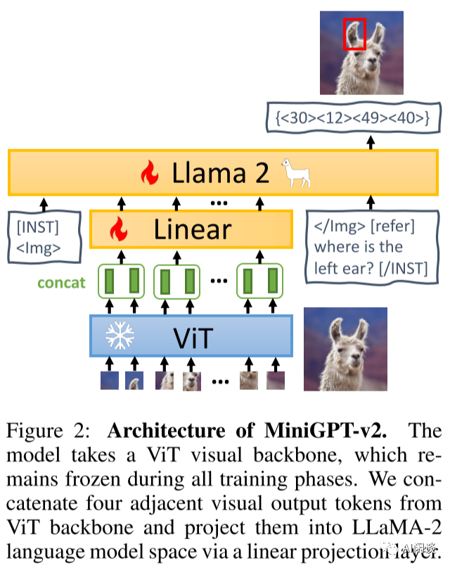

作者提出的模型中为每个任务都指定了不同的标识 Token（如上图中的 [refer]），以减少各种任务之间的歧义。如下图 Table 1 所示，作者提出了 6 种不同的标识 Token，分别对应视觉问答（VQA）、图像描述（Image Caption）、图像定位描述（Grounded Caption）、指示表达理解（REC）、指示表达生成（REG）以及目标解析和定位（Object Parsing and Grounding，模型从输入文本中提取目标并检测它们对应的位置）。对于与视觉无关的指令，模型不会使用任何任务标识 Token。

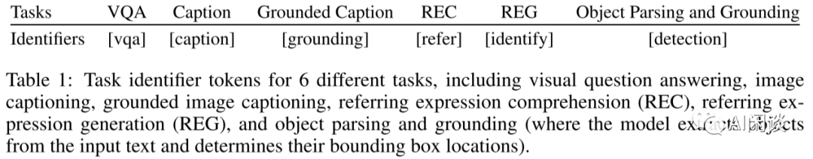

## 八、mPLUG-Owl

对应的论文：[2304.14178] mPLUG-Owl: Modularization Empowers Large Language Models with Multimodality

如下图 Figure 2 所示为 mPLUG-Owl 的模型结构，可以看出其也是由三个模块组成：

1. Vision Encoder：作者采用 CLIP ViT-L/14 作为视觉主干。
2. Visual Abstractor：作者采用了类似 Flamingo 的 Perceiver Resampler结构，论文中没有介绍，在代码库的 ISSUE 中有提到 https://github.com/X-PLUG/mPLUG-Owl/issues/10，查看源码也可以看出来，在此之后有一个 Linear 层。
3. Large Language Model：直接使用开源的 LLaMA-7B 作为语言模型主干，第二阶段会使用 LoRA 微调。

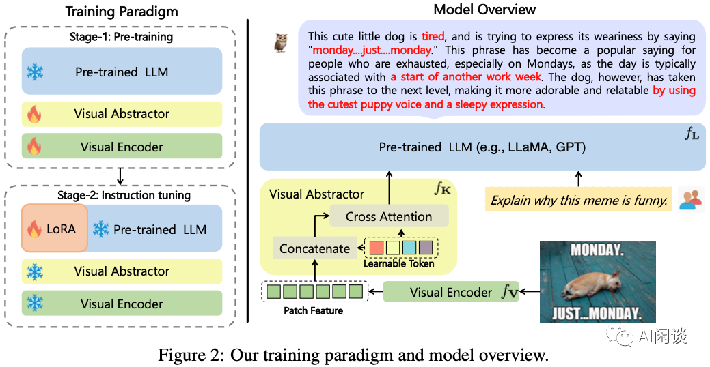

## 九、VisualGLM-6B

对应的代码库：VisualGLM-6B

如下图所示为 VisualGLM-6B 的模型结构，可以看出和 MiniGPT-v1 的结构很类似：

1. Vision Encoder：使用冻结的 EVA-CLIP ViT-G/14 + 可训练的 Lora 参数。
2. Projection：采用 BLIP-2 的 Q-Former，不过会对其进行微调。
3. Large Language Model：使用 ChatGLM + 可训练的 Lora 参数。

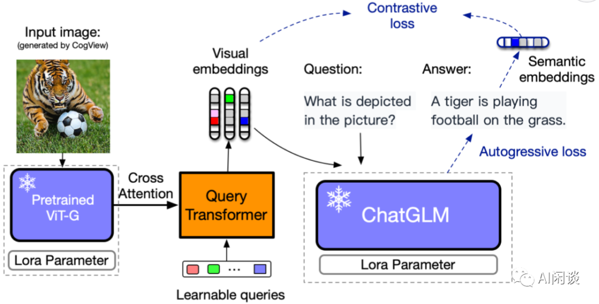

## 十、CogVLM

对应的论文：CogVLM: Visual Expert for Large Language Models

如下图 Figure 3 所示为 CogVLM 的模型结构，可以看出还是三个主要模块，不过对 LLM 进行了较大的修改：

1. Vision Encoder：直接使用预训练的 EVA-CLIP ViT-E/14（[2303.15389] EVA-CLIP: Improved Training Techniques for CLIP at Scale），作者删除了 ViT 的最后一层，因为它是专门用于聚合特征以便进行对比学习的。
2. MLP Adapter：使用 SwiGLU （[2002.05202v1] GLU Variants Improve Transformer) 的两层 MLP，用于将 ViT 的输出映射到文本特征空间（来自 word embedding）。所有图像特征在语言模型中共享相同的位置 ID。
3. Large Language Model：作者向每一个 Transformer 层都添加了一个visual expert module，以实现深度的视觉-语言特征对齐。具体来说，每一层的 visual expert module 都包含 QKV 矩阵（QKV matrix）和 MLP（FFN），它们的形状与虚线内预训练 LLM 中的形状相同，并且都是从 LLM 内的对应模块作为初始化权重。这样做的动机是，LLM 中的每个注意力头都捕获了某个方面的语义信息，训练的 visual expert module 可以转换图像特征，以与不同的头对齐，从而实现深度融合。

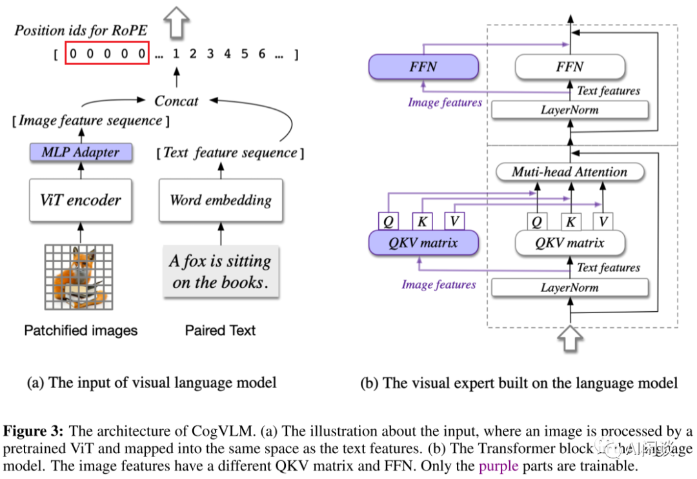

假设一个注意力层的 input hidden states X 的形状为（B, H,LI+LT, D)，其中 B 为 batch size， LI 和 LT 为图像和文本的序列长度，H 是注意力头的个数，D 是每个注意力头特征维度，在 visual expert module 中，X 首先被拆分为图像的 hide states XI 和 文本的 hide states XT，则注意力的计算如下：

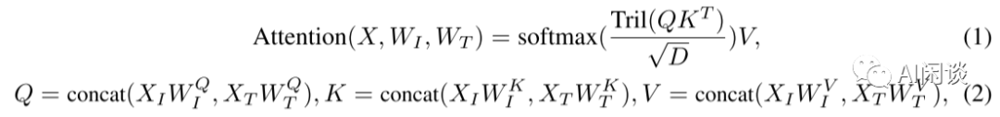

其中，WI 为视觉专家对应的 QKV 矩阵，WT 为语言模型对应的 QKV 矩阵，Tril（·）表示下三角掩码，FFN 层的视觉专家模块类似，如下所示：

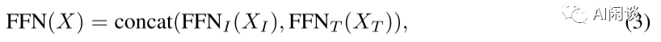

其中，FFNI 对应视觉专家模块，FFNT 对应语言模型。

## 十一、Qwen-VL

对应的论文：[2308.12966v3] Qwen-VL: A Versatile Vision-Language Model for Understanding, Localization, Text Reading, and Beyond

Qwen-VL 对应的模型结构如下图 Figure 3 所示，其结构也由三个模块组成：

1. Vision Encoder：采用的是 OpenCLIP ViT-G/14，在第一和第二阶段的预训练阶段会微调。
2. VL Adapter：采用单层的 Cross Attention 模块，和 Q-Former 类似，包含一组可学习的 Query 向量，经消融实验，选择了最优的 256 个 Query。
3. Large Language Model：采用 Qwen-7B 作为 LLM，并且在训练的第一阶段保持冻结。

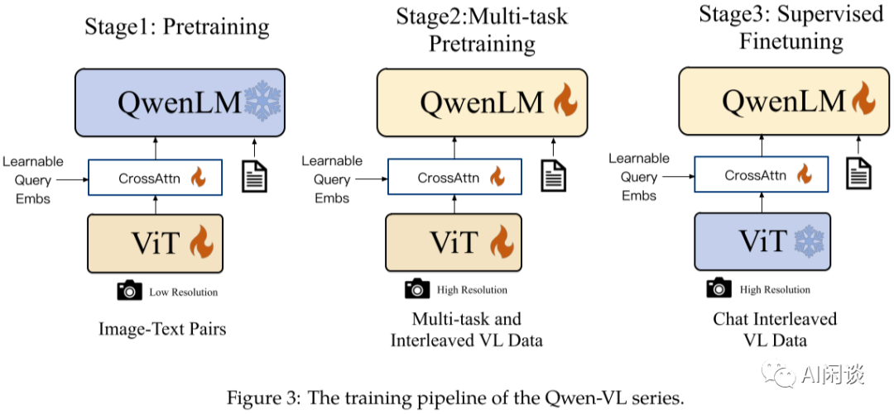

## 十二、InternLM-XComposer-VL

对应的论文：[2309.15112v4] InternLM-XComposer: A Vision-Language Large Model for Advanced Text-image Comprehension and Composition

对应的模型结构如下图 Figure 2 所示，其结构也由三个模块组成：

1. Vision Encoder：采用的是 EVA-CLIP ViT-G/14 模型，图像输入尺寸为 224x224。
2. Perceive Sampler：采用 BLIP-2 的 Q-Former 结构，将 257 个 image embedding 转换为固定的 64 个 image embedding。具体代码可参考：https://github.com/InternLM/InternLM-XComposer/blob/main/huggingface/internlm-xcomposer-vl/modeling_perceive_sampler.py
3. Large Language Model：采用的是 InternLM-7B，在第一阶段全量微调，第二阶段使用 LoRA 微调。

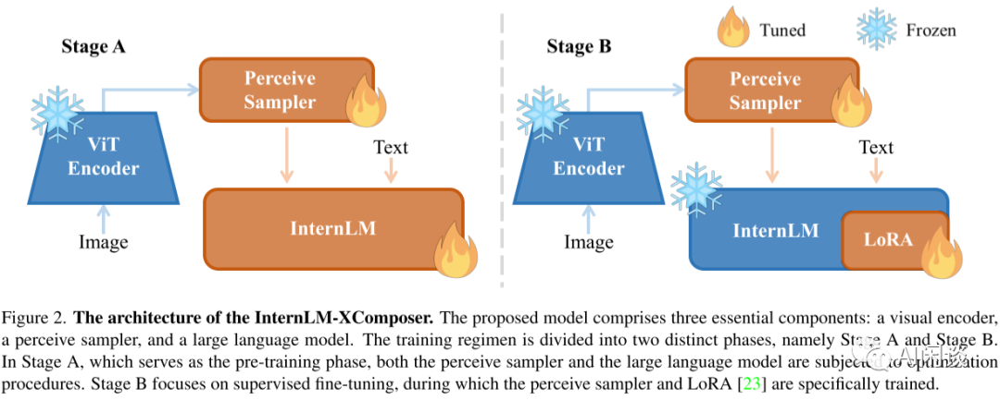

## 十三、Ferret

对应的论文：[2310.07704v1] Ferret: Refer and Ground Anything Anywhere at Any Granularity

Ferret 的模型结构如下图 Figure 3 所示，可以看出其也包含 Image Encoder 和 LLM，相比其他框架多了 Spatial-Aware Visual Sampler：

1. Vision Encoder：采用的是 CLIP ViT-L/14。
2. Projection：图中未标识出来，采用单层 Linear 来投影。
3. Spatial-Aware Visual Sampler：根据 Vision Encoder输出的 image feature 和给定的 Point、Box 或 Free-form Shape 信息采样固定的 region feature，并将该 region feature 也作为 LLM 的输入。这里可以有多个区域，分别生成 region feature。
4. Large Language Model：采用了基于 LLaMA 进行指令微调的 Vicuna-v1.3 模型。

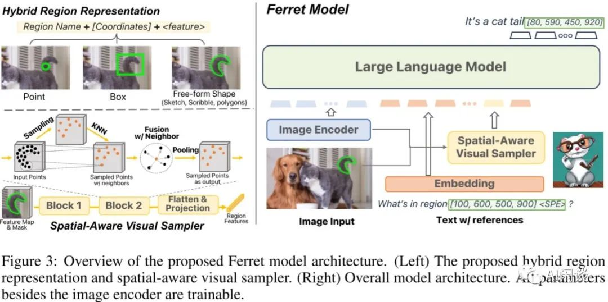

## 十四、Fuyu-8B

对应的官网：Fuyu-8B: A Multimodal Architecture for AI Agents

如下图所示，这应该是当前最简单的 LMM，其不需要额外的 Vision Encoder，直接将 Image Patch 经 Linear 层投影后输入 LMM，不过当前效果还不是特别好。

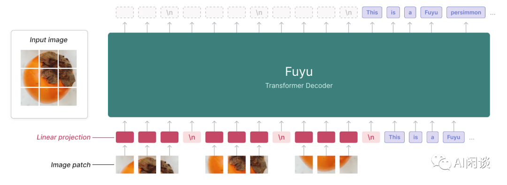

## 十五、参考链接

1. https://arxiv.org/abs/2107.07651v2
2. https://arxiv.org/abs/2204.14198v2
3. https://arxiv.org/abs/2301.12597v3
4. https://arxiv.org/abs/2304.08485v1
5. https://arxiv.org/abs/2310.03744
6. https://arxiv.org/abs/2304.10592v2
7. https://arxiv.org/abs/2310.09478v1
8. https://arxiv.org/abs//2211.07636
9. https://arxiv.org/abs/2302.13971
10. https://arxiv.org/abs/2304.14178
11. https://github.com/X-PLUG/mPLUG-Owl/issues/10
12. https://github.com/THUDM/VisualGLM-6B/tree/main
13. https://github.com/THUDM/CogVLM/blob/main/assets/cogvlm-paper.pdf
14. https://arxiv.org/abs/2303.15389
15. https://arxiv.org/abs/2002.05202v1
16. https://arxiv.org/abs/2308.12966v3
17. https://arxiv.org/abs/2309.15112v4
18. https://github.com/InternLM/InternLM-XComposer/blob/main/huggingface/internlm-xcomposer-vl/modeling_perceive_sampler.py
19. https://arxiv.org/abs/2310.07704v1
20. https://www.adept.ai/blog/fuyu-8b

