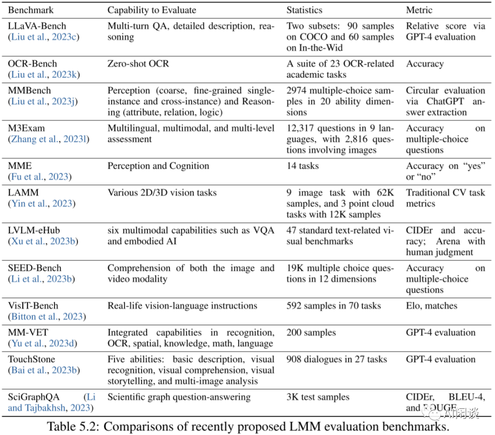
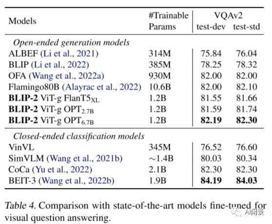
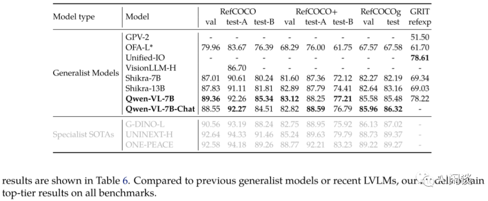

# 最全 LMM 评估指标汇总：20+模型、7个维度

**作者：** AI闲谈

---

一、引言

最近一年，随着 ChatGPT 的发布，大型语言模型（LLM）获得了前所未有的关注，开源 LLM 不断涌现，例如 LLamA 系列、MPT 系列，以及国内的 Baichuan 系列、ChatGLM 系列等。在这些模型的基础上，研究者还进一步开发了 Vicuna 系列模型等，这些模型在各种任务上的性能不断提升。同时，越来越多的研究者开始将 LLM 引入到多模态任务中，产生了一系列大型多模态模型（Large Multimodal Models, LMM），其中以视觉-语言模型最为热门。在本文中，我们将重点介绍最近一年内流行的视觉-语言模型（Vision-Language Model，VLM）。

在之前的文章中我们已经陆续介绍了 LMM 涉及的任务、数据集，以及常见的 10 多种 LMM 的模型结构及其对应的训练数据和训练方式；此外，我们还具体介绍了几个 LMM 的论文，比如 MiniGPT-v2、LLaVA-1.5、CogVLM、mPLUG-Owl2 等；最后，我们还介绍了解决 LMM 幻觉的一些方案，比如 Woodpecker、LURE。

然而，我们只在部分文章中介绍了相关模型的评估结果，却没有将其整合起来一起比较，这是因为不同模型采用的训练模式、训练数据，以及采用的评估基准、评估方式都各不相同，如果去人工评估所有模型的代价非常大。为了解决这一问题，本文中我们尝试将各个指标汇总起来比较（所有指标均来自相关论文），以便大家更好地了解不同模型的性能，并根据场景挑选最合适的模型。

强烈推荐同步阅读 LMM 相关模型和训练综述：

1. [最全 LMM 模型结构（13种）综述](http://mp.weixin.qq.com/s?__biz=Mzk0ODU3MjcxNA==&mid=2247484681&idx=1&sn=b79969e0a79cd102164499cfecdf3a1d&chksm=c364c24cf4134b5a54baff3bb22bf8b9960d673efa8f1ea3e2f04768a4110f348d66608e4fef&scene=21#wechat_redirect)

2. [最全 LMM 模型训练（12种）综述](http://mp.weixin.qq.com/s?__biz=Mzk0ODU3MjcxNA==&mid=2247484711&idx=1&sn=ed0f29d05076af0e3aa8f6c914749897&chksm=c364c262f4134b7428d6f730c7b7942908effda9432414bfe13729cf723069f0543cc5a08ac1&scene=21#wechat_redirect)

最近常见多模态 LMM 的解读可以参考：

1. [微软 GPT-4V 技术报告解读（1）](http://mp.weixin.qq.com/s?__biz=Mzk0ODU3MjcxNA==&mid=2247484149&idx=1&sn=cde16bd7ddcbd2977115d4c99fc9b99e&chksm=c364c5b0f4134ca6f5890a09c7a3e22dd837e7632b24ee160de058a3d78cd88bcb64695da3ba&scene=21#wechat_redirect)

2. [微软 GPT-4V 技术报告解读（2）](http://mp.weixin.qq.com/s?__biz=Mzk0ODU3MjcxNA==&mid=2247484329&idx=1&sn=d82e6396fcebae4b7c1977083fc86900&chksm=c364c4ecf4134dfaabe1fc2bb0bdaa3b92665535639c36276f00a366110902843215074590c2&scene=21#wechat_redirect)

3. [CogVLM: Visual Expert for Large Language Models 论文解读](http://mp.weixin.qq.com/s?__biz=Mzk0ODU3MjcxNA==&mid=2247484386&idx=1&sn=dbba140094e886a97d1c1c8a2d6057d0&chksm=c364c4a7f4134db104ae1f1f00c488e668a26eb92b18c1b28a4e584ff249872310423a5caf66&scene=21#wechat_redirect)

4. [MiniGPT-v2 论文解读](http://mp.weixin.qq.com/s?__biz=Mzk0ODU3MjcxNA==&mid=2247484403&idx=1&sn=d94fee47af49658ba69a0573d1857603&chksm=c364c4b6f4134da0102cf501fb5103fa4aa32135b9862ee1d365b4730ace78a437a1130cbde1&scene=21#wechat_redirect)

5. [LLaVA-1.5 论文解读](http://mp.weixin.qq.com/s?__biz=Mzk0ODU3MjcxNA==&mid=2247484468&idx=1&sn=240dd86c14e5e8ce519bd85b4f05b6bf&chksm=c364c371f4134a67d2cc394dcfd6caf0bcd682fb6bdd394c4638e38b43be62b18cc09974b3b6&scene=21#wechat_redirect)

6. [BLIP-2 论文及实现解读](http://mp.weixin.qq.com/s?__biz=Mzk0ODU3MjcxNA==&mid=2247484650&idx=1&sn=307af6a448514f992fbcee99c1259349&chksm=c364c3aff4134ab93a8313c22b7dd7b89925536ee219ae33e5c3b663006c4d1f53b80f754b96&scene=21#wechat_redirect)

7. [阿里最新 LMM：mPLUG-Owl2 论文解读](http://mp.weixin.qq.com/s?__biz=Mzk0ODU3MjcxNA==&mid=2247484818&idx=1&sn=fdb824af55c3392ca34f35467ee5bdf7&chksm=c364c2d7f4134bc1e6e904ea2d287ac505ae848f9d347a0aa277f8803d55ea42638b72764266&scene=21#wechat_redirect)

常见多模态数据集的解读可以参考：

1. [LMM 视觉问答（VQA）数据集解读](http://mp.weixin.qq.com/s?__biz=Mzk0ODU3MjcxNA==&mid=2247484515&idx=1&sn=94b77ab783e903632c83a952a85a4c3c&chksm=c364c326f4134a30c59e9fe1a5a93e030cebb5a893108677d3209e1c17a06c7b7bf4e16d8c51&scene=21#wechat_redirect)

2. [LMM 视觉描述（Captioning）和定位（Grounding）数据集](http://mp.weixin.qq.com/s?__biz=Mzk0ODU3MjcxNA==&mid=2247484571&idx=1&sn=0105194bd7493c33fd8d53be97f688b7&chksm=c364c3def4134ac8512d1d64c7e789e1edabe48e347652c73dc32492cec5627fbdb88cd2eaff&scene=21#wechat_redirect)

其他多模态幻觉校正可以参考：

1. [Woodpecker: LMM 幻觉校正 - 论文解读](http://mp.weixin.qq.com/s?__biz=Mzk0ODU3MjcxNA==&mid=2247484619&idx=1&sn=355452b204baac7d84bf461fa7788864&chksm=c364c38ef4134a98e922fdff26198ff3293428fad82889208e24a9a9c4fe599efbfdd7094fe5&scene=21#wechat_redirect)

2. [LURE：减少 LMM 多模态 23% 物体幻觉](http://mp.weixin.qq.com/s?__biz=Mzk0ODU3MjcxNA==&mid=2247484776&idx=1&sn=b2afc520d5a5e0706dcd4628bbc533d8&chksm=c364c22df4134b3bc8197eb5b1c247c8d20aecdae774b20263bb4a414ec532852965a1c1d32e&scene=21#wechat_redirect)
### 1.1. 评估基准

本文我们尝试从 7 个方面对 20+ LMM 的指标进行汇总，分别为：

1. 图像描述：COCO、Nocaps、Flickr30K、TextCaps
2. 图像问答：GQA、VQA、VQAv2、OK-VQA、SciQA-Img、VizWiz、IconQA、VSR、HM、TextVQA 和 OCR-VQA
3. 视觉定位：RefCOCO、RefCOCO+、RefCOCOg 和 GRIT
4. 幻觉：PoPE、CHAIR
5. 综合评估：MME、TouchStone、SEED-Bench、MM-Vet、MMB、MMB-CN
6. 纯文本评估：MMLU、BBH、AGIEval、ARC-c 和 ARC-e
7. 视频问答：MSRVIT-QA、MSVD-QA、TGIF-QA

部分评估基准可参考下图 Table 5.2 所示（出自 [2309.10020] Multimodal Foundation Models: From Specialists to General-Purpose Assistants）：

### 1.2. 训练方式、评估方式差异

由于 LLM、LMM 往往需要大规模数据进行训练，因此如果不清楚数据的构成，很容易出现数据污染问题，比如把部分数据加入到训练集中，导致评估指标异常高。此外，现在 LMM 的训练往往会分为预训练和指令微调阶段，有些任务会在预训练阶段加入特定数据集的训练集，有些是在微调阶段加，而有些任务完全不加，这些情况如果一起比较难免不公平。此外，有些任务会使用 zero-shot 评估，有些使用 few-shot 评估，这对最终指标影响非常大。所以本文中我们简单划分：

训练方式：

- 预训练中加入了待评估任务的训练集
- 指令微调阶段加入了待评估任务的训练集
- 整个阶段未使用待评估任务的任何数据

评估方式：

- zero-shot
- few-shot

### 1.3. 约定

我们会将不同文章中的指标交叉汇总，以便能更直观的比较，所有指标按如下约定方式汇总：

1. 所有数据均来自相关 LMM 的论文中
2. 不同的模型我们会使用不同的背景色，指标中的背景色表示该指标的来源论文
3. 指标文章会有黑色、红色、蓝色三种：
4. 红色：在多个论文中看到相同的结果，表示结果比较可信
5. 黑色：只在一个论文中看到该结果
6. 蓝色：多个论文中结果不一致，表示不同文章评估可能存在差异
7. 在指标文本的后面我们还会加上 * 标识，表明对应的模型在训练中使用了该评估数据的训练数据

## 二、图像描述和图像问答

如下图所示为图像描述相关指标，其中主要包括 zero-shot 评估和 finetune 后评估，需要说明的是：

- CogVLM 在 Nocaps 和 Flickr30K 上使用 zero-shot 进行评估，在 COCO 和 TexCaps 会在对应评估任务的训练集上训练，然后进行评估。
- Qwen-VL 的训练集中包含了 COCO 和 Flickr30K 的训练数据，因此指标上我们加上了 * 标识。

如下图所示为图像问答相关的 zero-shot 结果，其中带 * 标识表明模型训练中加入了训练集：

如下图所示为图像问答相关的 finetune 结果：

### 2.1. Flamingo

对应的论文：[2204.14198v2] Flamingo: a Visual Language Model for Few-Shot Learning

如下图 Table 1 所示为 Flamingo 的评估结果，其包含 3 个模型，同时评估了 zero-shot，4-shot、32-shot 以及 finetune 的结果（指标包含图像描述，图像问答和视频问答）：

### 2.2. BLIP-2

对应的论文：[2301.12597v3] BLIP-2: Bootstrapping Language-Image Pre-training with Frozen Image Encoders and Large Language Models

如下图 Table 1 为 BLIP-2 的 zero-shot 评估结果，包括图像问答、图像描述和图文检索：

如下图 Table 2 所示为 BLIP-2 的 zero-shot 图像问答评估结果：

如下图 Table 3 所示为 BLIP-2 的 finetune 图像描述评估结果：

如下图 Table 4 所示为 BLIP-2 finetune 图像问答评估结果：

### 2.3. InstructBLIP

对应的论文：[2305.06500] InstructBLIP: Towards General-purpose Vision-Language Models with Instruction Tuning

如下图 Table 1 所示为 InstructBLIP 的 zero-shot 图像描述和图像问答评估指标：

如下图 Table 3 所示为 InstructBLIP 的 finetune 图像问答评估指标：

### 2.4. Shikra

对应的论文：[2306.15195] Shikra: Unleashing Multimodal LLM's Referential Dialogue Magic

如下图 Table 6 所示为 Shikra 的 zero-shot 图像问答和图像描述评估指标：

### 2.5. Qwen-VL

对应的论文：[2308.12966v3] Qwen-VL: A Versatile Vision-Language Model for Understanding, Localization, Text Reading, and Beyond

如下图 Table 4 所示为 Qwen-VL 的 zero-shot 图像描述和图像问答指标，Nocaps、Flickr30K 和 SciQA-Img、VizWiz 标注为 zero-shot 指标，对于未标注 zero-shot 的任务，Qwen-VL 使用了其对应的训练集：

如下图 Table 5 所示为 Qwen-VL 的文本导向图像问答评估指标，同样使用了相关任务的训练集：

### 2.6. LLaVA-1.5

对应的论文：[2310.03744] Improved Baselines with Visual Instruction Tuning

如下图 Table 2 所示为 LLaVA-1.5 的图像问答评估指标，加 * 表示训练中使用了相关任务的训练集：

### 2.7. MiniGPT-2

对应的论文：[2310.09478] MiniGPT-v2: large language model as a unified interface for vision-language multi-task learning

如下图 Table 3 所示为 MiniGPT-2 的图像问答指标，VSR、IconVQA、VizWiz 和 HM 为 zero-shot 指标，训练中使用了 OKVQA 和 GQA 的训练集：

### 2.8. CogVLM

对应的论文：CogVLM: Visual Expert for Large Language Models

如下图 Table 1 所示为 CogVLM 的图像描述指标，Nocaps 和 Flickr30K 为 zero-shot 指标，COCO 和 TextCaps 为 finetune 评估指标：

如下图 Table 2 所示为 CogVLM 的图像问答指标，其中带 * 的表示 few-shot 或 zero-shot 指标（其他为 finetune 的结果）：

### 2.9. mPLUG-Owl2

对应的论文为：[2311.04257] mPLUG-Owl2: Revolutionizing Multi-modal Large Language Model with Modality Collaboration

如下图 Table 1 所示为 mPLUG-Owl2 的图像描述和图像问答评估指标，评估的为 zero-shot 指标，双 + 表示训练中使用了对应任务的训练集：

## 三、视觉定位

如下图所示为视觉定位相关的评估结果：

### 3.1. Shikra

对应的论文：[2306.15195] Shikra: Unleashing Multimodal LLM's Referential Dialogue Magic

如下图 Table 3 所示为 Shikra 的视觉定位评估指标：

### 3.2. Qwen-VL

对应的论文：[2308.12966v3] Qwen-VL: A Versatile Vision-Language Model for Understanding, Localization, Text Reading, and Beyond

如下图 Table 6 所示为 Qwen-VL 的视觉定位评估指标：

### 3.3. MiniGPT-2

如下图 Table 4 所示为 MiniGPT-2 的视觉定位评估指标：

### 3.4. CogVLM

如下图 Table 4 所示为 CogVLM 的视觉定位评估指标：

### 3.4. SoM-Prompting

如下图 Table 2 所示为 SoM-Prompting 的视觉定位评估指标：

## 四、幻觉指标

如下图所示为几个模型在 POPE 上的评估指标：

### 4.1. Shikra

如下图 Table 7 所示为 Shikra 在 POPE 上的具体评估指标：

### 4.2. MiniGPT-v2

对应的论文：[2310.09478] MiniGPT-v2: large language model as a unified interface for vision-language multi-task learning

如下图 Table 6 所示为 MiniGPT-v2 的 CHAIR 评估指标：

### 4.3. Woodpecker

对应的论文：[2310.16045] Woodpecker: Hallucination Correction for Multimodal Large Language Models

如下图 Table 1 所示为 Woodpecker 在 POPE 上的具体评估指标：

如下图所示为 Woodpecker 在 MME 上的具体评估指标：

### 4.4. LURE

对应的论文：[2310.00754] Analyzing and Mitigating Object Hallucination in Large Vision-Language Models

如下图 Table 4 和 Table 5 所示为 LURE 的 CHAIR 评估指标：

## 五、多模态基准

如下图所示为在多个多模态基准上的评估结果，需要说明的是，MME 的 All 选项指标为 InternLM-xComposer 论文中统计的指标，我们发现其与其他论文中分别统计的 Perception 和 Cognition 指标之和无法对齐：

### 5.1. lynx

对应的论文：[2307.02469] What Matters in Training a GPT4-Style Language Model with Multimodal Inputs?

如下图 Table 7 所示为 lynx 在多个多模态基准上的指标：

### 5.2. Qwen-VL

对应的论文：[2308.12966v3] Qwen-VL: A Versatile Vision-Language Model for Understanding, Localization, Text Reading, and Beyond

如下图 Table 7 所示为 Qwen-VL 在多个多模态基准上的指标：

### 5.3. LLaVA-1.5

对应的论文：[2310.03744] Improved Baselines with Visual Instruction Tuning

如下图 Table 2 所示为 LLaVA-1.5 在多个多模态基准上的指标：

### 5.4. InternLM-xComposer

对应的论文：[2309.15112] InternLM-XComposer: A Vision-Language Large Model for Advanced Text-image Comprehension and Composition

如下图 Table 3 所示为 InternLM-xComposer 在多个多模态基准上的指标：

### 5.5. mPLUG-Owl2

对应的论文：[2311.04257] mPLUG-Owl2: Revolutionizing Multi-modal Large Language Model with Modality Collaboration

如下图 Table 2 所示为 mPLUG-Owl2 在多个多模态基准上的指标：

### 5.6. OtterHD

对应的论文：[2311.04219] OtterHD: A High-Resolution Multi-modality Model

如下图 Table 1 所示为 OtterHD 在多个多模态基准上的指标：

## 六、纯文本基准

### 6.1. mPLUG-Owl2

对应的论文为：[2311.04257] mPLUG-Owl2: Revolutionizing Multi-modal Large Language Model with Modality Collaboration

如下图 Table 3 所示为 mPLUG-Owl2 在纯文本基准上的评估指标：

## 七、视频问答基准

### 7.1. mPLUG-Owl2

对应的论文为：[2311.04257] mPLUG-Owl2: Revolutionizing Multi-modal Large Language Model with Modality Collaboration

如下图 Table 4 所示为 mPLUG-Owl2 在视频问答任务上的评估指标，评估的为 zero-shot 指标：

## 八、参考链接

1. https://arxiv.org/abs/2309.10020
2. https://arxiv.org/abs/2107.07651v2
3. https://arxiv.org/abs/2204.14198v2
4. https://arxiv.org/abs/2301.12597v3
5. https://arxiv.org/abs/2304.08485v1
6. https://arxiv.org/abs/2310.03744
7. https://arxiv.org/abs/2304.10592v2
8. https://arxiv.org/abs/2310.09478v1
9. https://arxiv.org/abs//2211.07636
10. https://arxiv.org/abs/2302.13971
11. https://arxiv.org/abs/2304.14178
12. https://arxiv.org/abs/2303.15389
13. https://arxiv.org/abs/2002.05202v1
14. https://arxiv.org/abs/2308.12966v3
15. https://arxiv.org/abs/2309.15112v4
16. https://arxiv.org/abs/2310.07704v1
17. https://arxiv.org/abs/2311.04219
18. https://arxiv.org/abs/2309.10020

