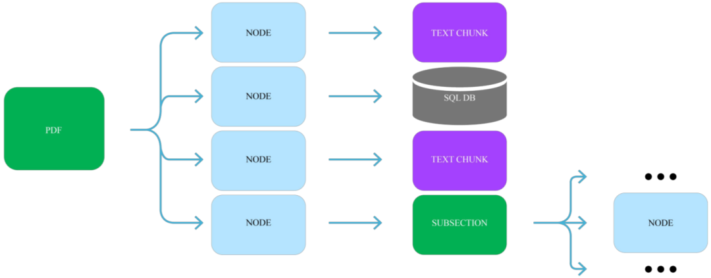
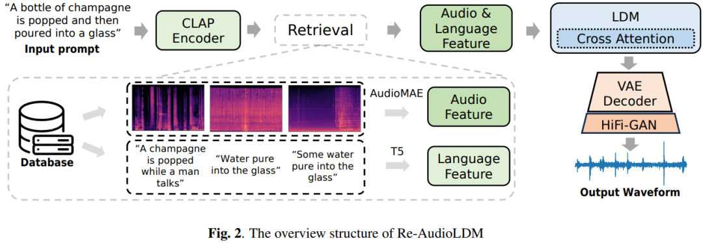

# 检索增强生成（RAG）综述

**作者：** AI闲谈

---

一、背景

最近一年，LLM 展示了强大的能力，但是面对幻觉、最新的知识以及复杂任务时往往略显不足。RAG（Retrieval Augmented Generation，检索增强生成）通过集成外部知识库来解决类似问题，取得了很不错的效果。

这里，我们参考 [2312.10997] Retrieval-Augmented Generation for Large Language Models: A Survey 整理 RAG 相关的方案、优化手段、评估指标等内容，以便对 RAG 有更全面的了解。此外，我们也介绍了最常用的一些向量数据库和 RAG 框架。

## 二、摘要

是什么：RAG 是一种通过检索外部知识库来获得额外语料，并使用 ICL（In-Context-Learning，上下文学习）来改进 LLM 生成效果的范式。

为什么：LLM 受训练语料的限制，无法感知最新的内容，比如 LLM 训练后的新闻；此外，LLM 也容易产生幻觉，生成不正确的内容。

如何做：当用户发起一个生成请求时，首先基于用户的 prompt 来检索相关信息，然后这些信息会被组合到 prompt 中，为生成过程提供额外的上下文，最后将组合后的 prompt 输入 LLM 生成结果。

怎么样：RAG 的主要优势在于可以避免针对特定任务再次进行训练；用户可以额外附加外部知识库，丰富输入，从而优化模型的输出效果。RAG 因其高可用性和低门槛而成为 LLM 系统中最受欢迎的方案之一，许多 LLM 应用都会基于 RAG 构建。

## 三、RAG 框架

### 3.1. Naive RAG

#### 3.1.1. Naive RAG 方案

如下图所示为最简单、最原始的 RAG 方案，也被称为 “Retrieve-Read” 框架，其包含几个关键阶段：

- Indexing（离线处理）：
- 从各种格式（PAF、HTML、Markdown、Word 等）的额外语料库中提取纯文本内容。
- 由于 LLM 上下文窗口的限制，比如常见的 2K、4K，需要将提取的文本内容切分为不同的 chunks。
- 使用文本 embedding 模型，针对每个 chunk 提取相应的文本 embedding。
- 将文本 embedding 和对应的 chunk 存储为索引，能一一对应。
- Retrieval（在线处理）：
- 使用文本 embedding 模型，针对用户 query 提取 query embedding。
- 使用 query embedding 与索引中的 chunk embedding 进行比对，找到最相似的 k 个 embedding。
- 提取 k 个最相似 embedding 对应的 chunk。
- Generation（在线处理）：
- 将 query 与检索到的 chunks 进行合并。
- 将合并后的 query 输入 LLM 用于生成，并返回生成结果。

#### 3.1.2. Naive RAG 不足

在 Naive RAG 中也有一些不足，会带来比较大的挑战：

- 检索质量：低精度的检索系统可能引导 LLM 产生幻觉，生成错误的输出；低召回的检索系统可能导致遗漏部分信息，导致 LLM 生成不准确或不全面的结果。
- 指令遵循：LLM 可能不基于 prompt 中检索到的上下文来生成答案，或者使用了不相关的上下文，从而导致生成结果出现偏差。
- 增强过程：可能无法将检索到的内容很好的与 query 相结合，或者检索到的内容中包含冗余和重复，导致生成结果中出现重复内容。
- 内容相关性：需要平衡检索到的多个内容的价值，辨别其对生成任务的重要性，此外也需尽可能保持风格一致。
- 过度依赖：LLM 可能会过度依赖检索到的内容，而忽略本身已经学习到的知识。

### 3.2. Advanced RAG

#### 3.2.1. Advanced RAG 方案

如下图所示，Advanced RAG 相比 Naive RAG 进一步增加了 Pre-Retrieval 和 Post-Retrieval 模块：

#### 3.2.2. Pre-Retrieval Process

首先是检索前的阶段，可以分为离线优化、在线优化和混合检索：

- 离线优化：优化数据索引，目的是为了提升索引质量，涉及 4 个方面：
- 增强数据粒度：旨在提升文本标准化、一致性、事实准确性和丰富的上下文，以提高 RAG 系统的性能。比如删除不相关的信息、消除实体和数据中的歧义、更新过时文档等。
- 优化索引结构：调整块的大小以捕获相关上下文、跨多个索引路径进行查询。
- 添加元数据：将引用的元数据（如日期和用途）集成到块中以进行过滤，并合并元数据以提高检索效率。
- 对齐优化：通过在文档中引入“假设问题”来解决文档之间的对齐问题和差异，以纠正对齐问题和差异。
- 在线优化：主要是指在检索阶段对用户 query 进行改写、扩展、纠错等，来提升检索质量。
- 混合检索：主要是指充分利用关键词检索、语义检索、向量检索等其他检索技术来提升检索丰富度，同时也可以保证一致性。

#### 3.2.3. Post-Retrieval Process

检索到的内容比较多，重要性也各不相同，如果一味地和 query 合并可能会超过 LLM 上下文限制，同时增加计算开销，也可能引入噪声，导致生成质量不佳。此时，通常需要对检索到的内容进一步处理：

- 重排序（Re-Ranking）：这是搜索领域非常常见的手段，不过在传统搜索中通常是按相关性、质量等进行排序输出；而在 LLM 生成领域要考虑检索到文档的多样性，以及 LLM 对 Prompt 中内容所在位置的敏感度等，比如 LostInTheMiddleRanker 将最佳文档交替地放在上下文窗口的开头和结尾。
- 提示压缩（Prompt Compression）：有研究表明，检索到的文档中的噪声会对 RAG 性能产生不利影响。在后处理中，可以重点压缩不相干的上下文，突出关键段落，减少整体上下文长度。也可以用专门的模型对文档进行压缩、总结、过滤等。

### 3.3. Modular RAG

#### 3.3.1. Advanced RAG 方案

模块化 RAG 源于传统的 RAG 框架，其集成不同功能的子模块，提供了很大的灵活性。其主要是增加了一些新的模块，并构建了一些新的范式。

#### 3.3.2. 新的模块

如下所示为常见的新增模块：

- Search Module：这里的 Search 模块专指针对特定应用场景的模块。这种能力可以通过 LLM 的代码能力来获得，比如直接让 LLM 生成对应的 SQL 代码。
- Memory Module：通常是指存储之前的历史记录，然后在当前的任务中根据 query 的相似性比对等检索历史数据，并辅助当前的生成。
- Fusion：通过 query 改写可以基于用户 query 生成多个 query 去检索和生成，Fusion 模块负责融合这些结果，更好地与用户对齐。
- Routing：用户任务可能比较复杂，此时往往需要多个步骤完成，Routing 模块就是负责任务拆解和分流，比如有多个检索数据源，Routing 负责挑选对应的数据源。
- Predict：检索的数据中可能包含噪声和冗余信息，Predict 用于使用 LLM 生成相应的确定的信息而不是直接检索。
- Task Adapter：是指将 RAG 适配为特定的下游任务，比如从预先构建好的数据池中检索 zero-shot 任务的输入以扩展 prompt，从而增强任务的通用性。

#### 3.3.3. 新的范式

如下所示，Naive RAG 和 Advanced RAG 也可以理解为模块化 RAG 的某种范式，当前的研究集中在两个方面：

- 增加或替换模块：比如在 “Retrieve-Read” 的基础上增加 query 改写。
- 调整模块 Pipeline：比如 DSP 和 ITER-RETGEN。

## 四、RAG 优化

### 4.1. 索引优化

#### 4.1.1. Chunk 优化

在构建离线索引时通常会将文档分为不同的 Chunk，然后提取 embedding。而 Chunk 的大小有多方面影响，比如，如果 Chuck 过大，则可能超过后续 LLM 的上下文窗口大小；如果 Chunk 过小，则可能导致相关信息被分割开来，影响检索质量。

常见的 Chunk 优化手段有：

- Chunk 大小：不是按句子划分 Chunk，而是结合 LLM 窗口大小，此时需要考虑 prompt 占据的长度，为 prompt 留下足够空间。
- 滑动窗口：直接按照某个固定大小切割文档可能导致关键内容被分到两个不同 Chunk 中，从而影响检索质量，此时可以采用有重叠的切割方案。
- 总结：有些时候文档内容会比较冗余，此时可以考虑对文档进行总结，减少冗余信息。

#### 4.1.2. Metadata

为索引添加时间、类型、文档标题以及页面等信息，可以用于后续的过滤，增强检索效率，也可以帮助增强生成质量。

#### 4.1.3. 结构化语料

多级检索也是检索系统中非常常用的手段，比如百亿级的图像检索，如果全量比对其代价非常高，此时可以考虑对索引进行聚类，比如分为 1K 个聚类中心，检索时先与聚类中心比对，取 Top5 后在每个聚类中比对，计算量可以降低为 1/200。同时也可以按照垂类进行划分，比如划分为服饰、箱包、植物、动物等，然后检索时先识别意图，然后在对应的垂类检索。

类似地，可以先对整个文档进行总结归纳，基于总结构建一级索引，文档的 Chunk 构建二级索引，检索时先从总结索引中检索；此外也可以将文档中的不同元素分别建立对应类别的索引，比如对图表索引。

### 4.2. 检索源优化

RAG 的关键是通过额外的语料库来增强 LLM 的生成质量，数据源可以分为非结构化数据、结构化数据和 LLM 生成的内容，它们也往往需要不同的处理手段。如下图所示为不同阶段采用的不同数据来源，其中叶子的颜色表示数据类型，可以看出，大部分为非结构化数据，但使用结构化数据和 LLM 生成内容也越来越多：

- 结构化数据：越来越多的工作开始把知识图谱（Knowledge Graph，KG）引入到 RAG 中，比如 KnowledGPT 用于推理阶段，SUGRE 用于微调阶段。
- LLM 生成的内容：除了外部知识外，LLM 本身的知识也至关重要，有些工作尝试对用户 query 进行分类，然后有选择的使用外部知识或内部知识。此外也可以用 LLM 直接生成代码等。

### 4.3. Query 优化

Query 优化是检索系统中提升检索结果准确性非常有必要的阶段，通过这些手段，系统可以更好的理解用户意图并提供更准确的结果。通常包含如下手段：

- Query 改写：对用户输入 query 进行修改或重写，通常只调整 query 结构、添加或删除关键词，或者通过近义词替换来扩展检索范围。
- Query 纠错：通常是指尝试修正用户 query 中可能的拼写或语法错误。
- Query Clarification：通常是指修正或分解用户 query 中不明确或模糊的内容，使系统更好地理解并执行相应的检索，有助于避免歧义。

### 4.4. Embedding 优化

Embedding 优化主要包括：

- 挑选合适的 embedding 模型：检索任务通常是判断两段内容是否相关，相似任务是判断两段内容是否相似，相关的内容不一定相似。因此随意挑选一个文本模型用于提取 embedding 不一定合适，学习的目标也不一定相同。
- 针对任务进行微调：embedding 模型的训练预料和实际检索的语料分布可能并不相同，此时在对应语料上进行 finetuning 可以显著提升检索到的内容的相关性。比如 OpenAI 也提供了代码相关的 code embedding 模型。
- Adapter：如下图所示，也有研究者引入 Adapter，在提取 query embedding 后进一步让 embedding 经过 Adapter，以便实现与索引更好的对齐。

### 4.5. 检索过程优化

RAG 中的标准做法是通过一次检索、生成获得最终结果，然而这种方式在复杂任务上可能表现不佳，比如需要多步推理的场景。研究者也提出了相应的改进方案：迭代检索、递归检索和自适应检索。

#### 4.5.1. 迭代检索

迭代检索允许模型参与多个检索周期，从而增强获得信息的深度和相关性，为 LLM 生成提供更全面的知识库。

如下图所示， [2305.15294] Enhancing Retrieval-Augmented Large Language Models with Iterative Retrieval-Generation Synergy 中迭代检索的示例，其结合了“检索增强生成”和“生成增强检索”：

#### 4.5.2. 递归检索

递归检索是指可以将之前的检索输出作为后续的检索输入。递归检索通常用于需要渐进式收敛到最终答案的场景，比如学术研究、法律案例分析等。针对多级索引（比如摘要索引，Chunk 索引），可以使用递归检索；此外，针对具有图结构的数据源，使用递归检索也可以检索更全面的信息。

如下图所示为 [2212.10509] Interleaving Retrieval with Chain-of-Thought Reasoning for Knowledge-Intensive Multi-Step Questions 中递归检索的示例，其结合思维链（COT）来指导检索过程，并根据获得的检索结果对 CoT 进行细化：

#### 4.5.3. 自适应检索

自适应检索提供了一种动态调整机制，根据不同任务和上下文的特定需求定制检索过程。

如下图所示为 [2310.11511] Self-RAG: Learning to Retrieve, Generate, and Critique through Self-Reflection 中自适应检索的过程，其引入了 “Reflection” Token，允许模型内省其输出，该模型可自主决定何时激活检索，提高了模型在生成准确结果方面的自主判断能力：

## 五、RAG 评估

在了解到 RAG 是什么，为什么需要 RAG，以及 RAG 怎么做之后，我们进一步需要评估 RAG 的效果。

### 5.1. 评估目标

不管 RAG 系统怎么变，其核心离不开两个关键部分：检索和生成。因此也就可以针对这两个部分进行评估。

- 检索质量：检索系统已经发展多年，在搜索引擎、推荐系统等领域都广泛使用，也相应有很多衡量检索质量的指标，比如命中率、MRR 和 NDCG。
- 生成质量：生成质量主要用于评估模型基于检索到的内容生成连贯、准确答案的能力。其评估通常也包含如下两方面（也都可以采用人工评估和自动评估的方式）：
- 有标注评估：重点评估产生信息的准确性。
- 无标注评估：重点评估生成答案的真实性、相关性和无害型等。

### 5.2. 评估维度

RAG 的评估通常强调 3 个主要的质量分数和 4 个基本的能力，它们为 RAG 模型的两个主要目标提供了相应信息：

- 质量分数：
- Context Relevance（上下文相关性）：评估检索到的上下文的精确性和特异性，确保相关性并最大限度降低与无关内容相关的处理成本。
- Answer Faithfulness（答案真实性）：确保生成的答案与检索到的上下文保持一致并避免矛盾。
- 基本能力：
- Noise Robustness（噪声鲁棒性）：评估模型处理与问题相关但缺乏实质性信息的噪声文档的能力。
- Negative Rejection（否定拒绝）：评估模型对于检索到的文档不包含回答问题的必要知识时不做出响应的辨别力。
- Information Integration（信息融合）：评估模型综合来自多个文档的信息以解决复杂问题的能力。
- Counterfactual Robustness（反事实鲁棒性）：评估模型识别和忽略文档中已知不准确信息的能力。

### 5.3. 评估基准和评估工具

如下图 Table 2 和 Table 3 展示了常见的评估基准和评估工具：

## 六、其他

### 6.1. 模态扩展

最近一年多模态大模型（LMM）大量涌现，出现一系列高质量的文本-图像多模态大模型，文本-语音和文本-视频大模型，而在 RAG 中应用 LMM 也将对 RAG 非常有帮助，比如对论文中图表的理解。

如下图所示，[2211.12561] Retrieval-Augmented Multimodal Language Modeling 作者使用检索来增强图像生成和图像描述任务，embedding 模型采用 CLIP，其实现了比较好的文本-图像特征对齐，可以用于文本检索图像：

如下图所示，[2309.08051] Retrieval-Augmented Text-to-Audio Generation 作者使用检索来增强文本到语音生成任务：

如下图所示，Multi-Vector Retriever for RAG on tables, text, and images 作者介绍了将文档中不同内容出别处理（图片、表格、纯文本），进而提升生成质量的方案：

如下图所示，[2312.14135] V*: Guided Visual Search as a Core Mechanism in Multimodal LLMs 中作者将 VQA LLM 与视觉搜索相结合，通过对视觉目标进行多轮引导搜索，能够提取局部特征，并将其添加到工作记忆中，然后 VQA LLM 利用搜索到的内容生成最终结果：

### 6.2. 向量数据库

向量数据库在 RAG 中扮演着至关重要的角色，随着 RAG 的火热，向量数据库也得到了快速发展。与传统按行或按列组织的数据库不同，向量数据集使用数据的 embedding 作为表示，并基于 embedding 相似性进行检索，能够提供快速、低延时的查询，非常适合 RAG 应用。

#### 6.2.1. Milvus

Milvus 创建于 2019 年，是一个用于对万亿级 embedding 进行索引、查询的开源的、高度可扩展的数据库。与现有的关系型数据库主要按照预定义的模式处理结构化数据不同，Milvus 是自下而上设计的，用于处理从非结构化数据转换而来的嵌入矢量。Milvus 能够通过计算两个 embedding 的相似距离来分析它们之间的相关性，如果两个 embedding 矢量非常相似，则意味着原始数据源也相似。

Milvus 的使用很简单，并且具有高可用、云原生等特性，还提供了大量索引类型，比如 FLAT, IVF_FLAT, IVF_PQ, HNSW, RHNSW_FLAT, RHNSW_PQ, RHNSW_SQ, and, ANNOY。

#### 6.2.2. Pinecone

Pinecone 也是一个非常流行的云原生向量数据库，其基于 Kubernetes 部署，对外提供 API Gateway，并将这些请求路由到用户索引。基于 Pinecone，用户可以在短短 30s 内创建索引，并为搜索、推荐等应用执行超快速检索，它支持数十亿规模的 embedding，也可以通过 Metadata 进行过滤以及实时更新。然而，Pinecone 是闭源的，也就意味着无法私有化部署。

#### 6.2.3. Chroma

Chroma 也是一个开源的向量数据库，可以用于存储和检索 embedding 以及相应的 Metadata，其使用非常简单，也很轻量化，很适合做本地化部署和用于快速验证：

#### 6.2.4. Elasticsearch

Elasticsearch 是一个开源的分布式搜索和分析引擎，它是基于Apache Lucene 搜索引擎构建的。它提供了强大的全文搜索能力，支持实时数据分析，并能够处理大规模数据。Elasticsearch 专注于混合检索，将文本和矢量搜索功能无缝结合，以实现卓越的相关性和准确性。其支持各种检索类型、机器学习模型架构和强大的搜索体验构建工具。

### 6.3. RAG 框架

除了向量数据库外，也出现了一系列的应用层框架，帮助用户集成 LLM、向量数据库等，以实现快速开发 AI 应用。当然，基于这些框架开发 RAG 系统也变得非常简单。

#### 6.3.1. LlamaIndex

LlamaIndex 以前称为 GPT Index，是一个新的数据框架，专门用于支持基于 LLM 的应用开发。它提供了一个高级框架，使开发人员能够将各种数据源与 LLM 集成，包括各种文档格式，例如 PDF、PowerPoint，以及 Notion 和 Slack 等应用，甚至 Postgres 和 MongoDB 等数据库。它包含一系列连接器，可协助数据获取，促进与 LLM 的无缝交互。此外，LlamaIndex 拥有高效的数据检索和查询界面，也支持不同类型的索引，例如矢量、树、列表、关键字和知识图谱索引。

#### 6.3.2. Haystack

Haystack 是 deepset 开源的端到端的 LLM 应用框架，用户能基于此使用 LLM 和向量数据库快速构建自定义应用。无论是想执行 RAG、文档搜索、问答还是答案生成，都可以将最先进的 embedding 模型和 LLM 与 Haystack 一起使用，以构建端到端的 AI 应用。

Haystack 使用一些简单但有效的概念来帮助用户构建自定义的 NLP 应用：

- 组件（Components）：组件是 Haystack 的核心，可以作为文档检索、文本生成或摘要等任务的基本功能模块。Haystack 提供了一系列开箱即用的组件，也允许用户创建自己的自定义组件，这些组件可以是本地调用，也可以通过 API 与远程服务通信。用户可以基于组件构建自己的管道。
- 管道（Pipelines）：管道是由组件（如 Retriever 和 Reader）组成的复杂系统。Haystack 也为用户提供了常见任务的现成的管道，例如问答、文档检索和摘要，用户也很容易构建自己的管道。
- 代理（Agents）：Haystack Agent 利用 LLM 来解决复杂的任务。初始化代理时，可以为其提供一组工具，这些工具可以是管道组件，也可以是整个管道。代理可以迭代地使用这些工具来得出答案。给定查询时，代理会确定哪些工具可用于回答此查询，并在循环中调用它们，直到获得答案。这样，可以实现的不仅仅是提取式或生成式问答管道。

如下图所示为使用 Haystack 构建的信息检索和问答系统：

#### 6.3.3. LangChain

LangChain 是一个最流行的以 LLM 为驱动的用于开发 AI 应用的框架。如下为其架构图，由于其非常流行，这里就不再赘述：

## 七、相关链接

1. https://arxiv.org/abs/2312.10997
2. https://arxiv.org/abs/2305.15294
3. https://arxiv.org/abs/2212.10509
4. https://arxiv.org/abs/2310.11511
5. https://arxiv.org/abs/2211.12561
6. https://arxiv.org/abs/2309.08051
7. https://blog.langchain.dev/semi-structured-multi-modal-rag/
8. https://www.aporia.com/blog/best-vector-dbs-for-retrieval-augmented-generation-rag/
9. https://milvus.io/
10. https://www.pinecone.io/
11. https://docs.trychroma.com/
12. https://www.elastic.co/elasticsearch
13. https://www.llamaindex.ai/
14. https://haystack.deepset.ai/
15. https://www.langchain.com/
16. https://arxiv.org/abs/2312.14135

