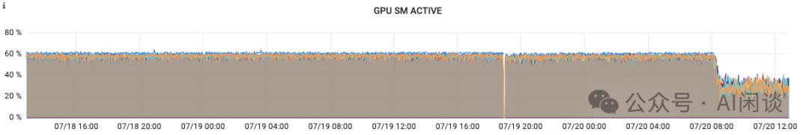
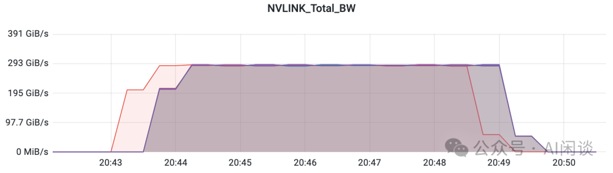
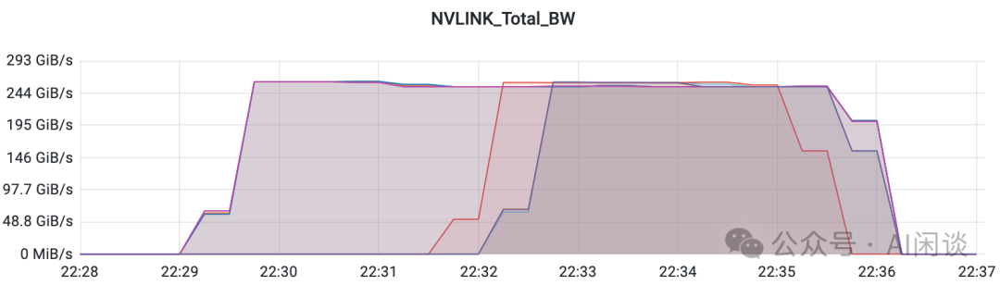
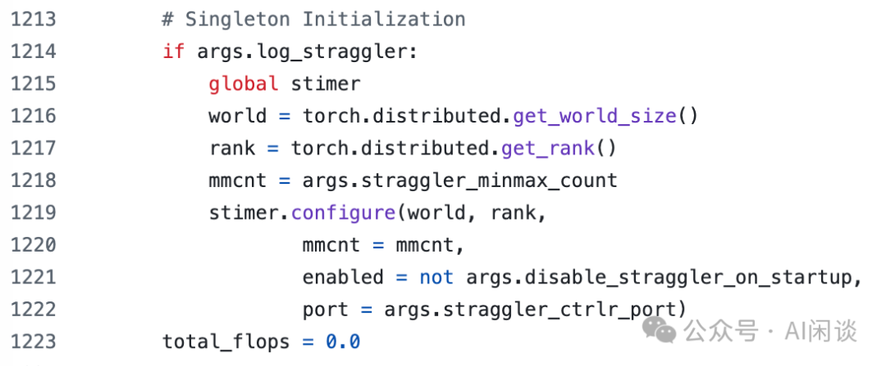

# 聊聊 GPU 监控那些事：利用率 & 故障等

**作者：** AI闲谈

---

## 一、背景

在之前的多篇文章中，我们曾零星提到过 GPU 利用率以及 GPU 异常引发的大规模任务失败问题。在本文中，我们将对这些内容进行更为系统的汇总，具体介绍常见的 GPU 监控指标及各种 GPU 异常情况。为了更好地说明问题，我们还将结合我们自己的实践经验以及其他相关论文中的案例进行分析和讨论。

相关工作可以参考我们之前的文章：

- [Meta 万卡 GPU 集群稳定性剖析与最佳实践](https://mp.weixin.qq.com/s?__biz=Mzk0ODU3MjcxNA==&mid=2247488506&idx=1&sn=008465f344276b47549029ca9747e5f8&scene=21#wechat_redirect)
- [IBM 的大规模 A100/H100 GPU 集群 Infra 建设](https://mp.weixin.qq.com/s?__biz=Mzk0ODU3MjcxNA==&mid=2247488567&idx=1&sn=74da210bc8d61c20ae2ef6613561b601&scene=21#wechat_redirect)
- [HKUST&阿里 Falcon：识别和解决大规模训练的拖后腿问题](https://mp.weixin.qq.com/s?__biz=Mzk0ODU3MjcxNA==&mid=2247488475&idx=1&sn=22499775c25e08e34dbccf37444827db&scene=21#wechat_redirect)
- [幻方 AI DeepSeek 模型背后的万卡集群建设](http://mp.weixin.qq.com/s?__biz=Mzk0ODU3MjcxNA==&mid=2247487981&idx=1&sn=4689d35a198fe1b1f770c861358c0d36&chksm=c364d6a8f4135fbe3e97489bcca59d0119b95745de1216618818228278973591f5806f3a979e&scene=21#wechat_redirect)
- [阿里 HPN：针对大规模 LLM 训练的万卡集群](http://mp.weixin.qq.com/s?__biz=Mzk0ODU3MjcxNA==&mid=2247487170&idx=1&sn=f07d6847526d1f317b361d04c9d0e72c&chksm=c364c987f4134091a5a86ec85112c6ec1e48fe645a1e7d8392e3695d1c16c72f41256c36eb13&scene=21#wechat_redirect)
- [万卡 GPU 集群实战：探索 LLM 预训练的挑战](http://mp.weixin.qq.com/s?__biz=Mzk0ODU3MjcxNA==&mid=2247486852&idx=1&sn=9f9dc1df99ab6aafb28e091f4532b89e&chksm=c364cac1f41343d7b10d9d234d1c7f3371d996afda01cb94d294a38cba4f1a14fe4594992aa2&scene=21#wechat_redirect)
- [万卡 GPU 集群互联：硬件配置和网络设计](http://mp.weixin.qq.com/s?__biz=Mzk0ODU3MjcxNA==&mid=2247486775&idx=1&sn=abf7af24181cf5189e113fb161cc8d30&chksm=c364ca72f4134364f4e3fa4a971f767c2b07e6c2cae38c2a4ae28071fd330abaea68c36542c4&scene=21#wechat_redirect)
- [剖析大规模 GPU 集群：针对 LLM 场景的挑战和优化](http://mp.weixin.qq.com/s?__biz=Mzk0ODU3MjcxNA==&mid=2247487054&idx=1&sn=fd540ee08fc40211d51856a146d22ac8&chksm=c364c90bf413401dc34fb9944f511a2960d4c532ea9bd8e4f88c696a5a7a6c58e549c73a8e27&scene=21#wechat_redirect)
- [Imbue-70B 的 AI Infra：从0到1搭建和运维4088 H100集群的最佳实践](http://mp.weixin.qq.com/s?__biz=Mzk0ODU3MjcxNA==&mid=2247487245&idx=1&sn=e71e3713fb39f0b9e0d308b058b43ce0&chksm=c364c848f413415e4f12b128a39b6cd618a1f29b78180e8f26aec6da649539a8ab91c591ce19&scene=21#wechat_redirect)
- [阿里 C4：通信驱动加速大规模并行训练效率](http://mp.weixin.qq.com/s?__biz=Mzk0ODU3MjcxNA==&mid=2247487014&idx=1&sn=c49df9bd2de03acfae39bf4dce1c84b6&chksm=c364c963f4134075edee235c744c68c3f411ac7cdd1b9847de9333169292ff375a56c7d8ebd0&scene=21#wechat_redirect)
- [LLaMA 3 背后的大规模 GPU 集群 RoCE 网络建设](http://mp.weixin.qq.com/s?__biz=Mzk0ODU3MjcxNA==&mid=2247487544&idx=1&sn=1e500b3d9becc6ec19fc2912834beef7&chksm=c364d77df4135e6b2a2d500e013ea4f9b12eec9b2dcf50f834d9e703a7eed66e96e97e4bab95&scene=21#wechat_redirect)
-  [LLaMA 3 技术报告解读：全面梳理 LLM 相关技术栈](https://mp.weixin.qq.com/s?__biz=Mzk0ODU3MjcxNA==&mid=2247487405&idx=1&sn=647217f38d505bbe15619217f17d20fb&scene=21#wechat_redirect)
-  [NVIDIA 最新 GPU 解读：GB200、NVL72、SuperPod-576GPU](https://mp.weixin.qq.com/s?__biz=Mzk0ODU3MjcxNA==&mid=2247486291&idx=1&sn=9be7845ca2ce03a9b15cdc9848d70cef&scene=21#wechat_redirect)
- [GPU 关键指标汇总：算力、显存、通信](https://mp.weixin.qq.com/s?__biz=Mzk0ODU3MjcxNA==&mid=2247484942&idx=1&sn=2b69b610d4dacdc372036916d4c91325&scene=21#wechat_redirect)

## 二、引言

### 2.1 MFU & HFU

为了评估 LLM 训练时的效率，业界通常会使用 Model FLOPS Utilization（MFU） 和 Hardware FLOPS Utilization（HFU） 两个关键指标来评估模型的 Forward 和 Backward 过程中（包括任何的网络同步开销和 DataLoader IO）硬件的利用率。

- MFU = 预估 FLOPS/硬件理论 FLOPS。其中，预估 FLOPS 就是模型训练时理论需要的计算量，并不包括各种优化方案额外引入的计算量，比如 Gradient Checkpointing/Activation Recomputation 等引入的额外计算量。
- HFU = 实际 FLOPS/硬件理论 FLOPS。其中，实际 FLOPS 也就是理论上所有实际发生的计算量，包含 Gradient checkpointing/Activation Recompution 等引入的额外计算量，因此 HFU 应该总是 >= MFU。

如下所示为 Maximizing training throughput using PyTorch FSDP [1] 中 Meta 在 LLM 训练时的 MFU 和 HFU。对于 LLM 训练任务而言，通常在 A100/A800 GPU 集群中，MFU 可以达到 50%+，甚至接近 60%；而在 H100/H800 GPU 集群中， MFU 往往不超过 50%。

### 2.2 GPU 监控集成

NVIDIA DCGM（GitHub - NVIDIA/DCGM: NVIDIA Data Center GPU Manager (DCGM) is a project for gathering telemetry and measuring the health of NVIDIA GPUs [2]）是一套专为 NVIDIA GPU 集群管理和监控而设计的工具，其涵盖健康检测、全面诊断、系统报警及治理策略等。DCGM 通过 DCGM-Exporter（NVIDIA GPU metrics exporter for Prometheus leveraging DCGM [3]）可以很方便的与 Kubernetes 生态系统集成，为容器化环境提供丰富的 GPU 监测数据。

如下图所示是一种简单又常用的使用方式，每个 Node 上会部署一个 dcgm-exporter 实例，然后由 Prometheus 来周期性的抓取监控数据，并由 Grafana 进行相应监控的可视化（https://github.com/NVIDIA/dcgm-exporter/tree/main/grafana [4] 中也有相应的 Grafana config）：

### 2.3 GPU 监控指标

DCGM 的监控指标非常丰富，包括显存占用，各种算力利用率，温度、功率、频率以及 NVLink 和各种异常相关指标。其实可以在 github/DCGM/dcgmlib/src/dcgm_fields.cpp [5] 中看到所有相关指标，甚至一些单位不清晰的指标也可以从中获取。如下图所示，可以看出 DCGM_FI_DEV_NVLINK_BANDWIDTH_L0 的单位为 MB/s。

部分监控的说明也可以参考：ACK集群GPU监控2.0指标有哪些- 容器服务Kubernetes 版 ACK - 阿里云 [6]

PS：由于指标众多，本文中只会介绍一些关键指标，更多指标可以根据实际需求相应添加。

### 2.4 NVIDIA Fabric Manager

要想使用 NVSwitch 的 Sharp 能力，也就是 NCCL AllReduce 中的 NCCL_ALGO=NVSL 以及 NCCL_NVLS_ENABLE，需要启动对应的 nvidia-fabricmanager，可以参考 1. Overview — Fabric Manager for NVIDIA NVSwitch Systems r560 documentation [7]。

NVIDIA FM（Fabric Manager）负责配置 NVSwitch 内存结构，以在所有参与的 GPU 之间形成一个统一的内存结构，并监控支持该结构的 NVLink。从较高层次来看，FM 承担以下职责：

- 配置 NVSwitch 端口之间的路由；
- 与 GPU 驱动程序协调，初始化GPU；
- 监控结构中的 NVLink 和 NVSwitch 错误。

NCCL 在 2.17+ 版本开始支持 NVLink Sharp，这个也是在 H100 的 NVSwitch 才支持的。

### 2.5 GPU 故障

GPU 故障是大规模 GPU 集群中最常见的问题之一，通常会暴露 ECC Error 或 Xid Code，有关 Xid Code 的错误可以参考 NVIDIA 的官方文档 XID Errors :: GPU Deployment and Management Documentation [8]。也可参考一些公有云平台上的 FAQ，比如 常见 Xid 事件的处理方法--机器学习平台-火山引擎 [9]，此外也会提供一些排查手段，比如 自助诊断GPU节点问题-阿里云 [10]。

GPU 故障最大的挑战是其数量比较多，故障率比较高，一个 GPU 异常往往意味这个训练任务的暂停，而且通常需要按照整机的方式替换。比如 1 个 GPU 异常，通常是直接驱逐整机。这是因为大规模 LLM 预训练往往要利用单机内高速的 NVLink，如果不是整机调度很可能会影响整体吞吐。假设一天内 GPU 发生故障的概率为 0.1%，则一台 8 卡 GPU 机器每天发生故障的概率为 1-(1-0.1%)^8=0.8%，万卡 GPU 一天内有 GPU 发生故障的概率为 1-(1-0.1%)^10000=99.99%。

## 三、GPU 利用率指标

### 3.1 GPU Utilization

对应 DCGM 的 DCGM_FI_PROF_GR_ENGINE_ACTIVE，表示在一个时间间隔内 Graphics 或 Compute 引擎处于 Active 的时间占比。Active 时间比例越高，意味着 GPU 在该周期内越繁忙。该值比较低表示一定没有充分利用 GPU，比较高也不意味着已经充分利用 GPU。如下图所示，表示几个 GPU 的 Utilization 到了 80%-90% 左右：

其实更早之前的 Utilization 指标为 DCGM_FI_DEV_GPU_UTIL，只是因为其局限性现在往往会使用 DCGM_FI_PROF_GR_ENGINE_ACTIVE，更多说明也可以参考：Question about DCGM fields · Issue #64 [19]。

### 3.2 GPU SM Active

对应 DCGM 的 DCGM_FI_PROF_SM_ACTIVE，表示一个时间间隔内，至少一个 Warp 在一个 SM 上处于 Active 的时间占比，该值表示所有 SM 的平均值，对每个 Block 的线程数不敏感。该值比较低表示一定未充分利用 GPU。如下为几种 Case（假设 GPU 包含 N 个 SM）：

- Kernel 在整个时间间隔内使用 N 个 Block 运行在所有的 SM 上，对应 100%。
- Kernel 在一个时间间隔内运行了 N/5 个 Block，该值为 20%。
- Kernel 有 N 个 Block，在一个时间间隔内只运行了 1/4 时间，该值为 25%。

如下图所示为几个 GPU 的 SM Active，可见只有 60% 左右，还有一定提升空间：

### 3.3 GPU SM Occupancy

对应 DCGM 的 DCGM_FI_PROF_SM_OCCUPANCY，表示一个时间间隔内，驻留在 SM 上的 Warp 与该 SM 最大可驻留 Warp 的比例。该值表示一个时间间隔内的所有 SM 的平均值，该值越高也不一定代表 GPU 使用率越高。

如下图所示为几个 GPU 的 SM Occupancy，只有 20% 多：

### 3.4 GPU Tensor Active

对应 DCGM 的 DCGM_FI_PROF_PIPE_TENSOR_ACTIVE，表示一个时间间隔内，Tensor Core 处于 Active 的时间占比，该值表示的是平均值，而不是瞬时值。如下所示是几种 Case（假设 GPU 包含 N 个 SM）：

- 整个时间间隔内，N/2 个 SM 的 Tensor Core 都以 100% 的利用率运行，该值为 50%。
- 整个时间间隔内，N 个 SM 的 Tensor Core 都以 50% 的利用率运行，该值为 50%。
- 整个时间间隔内，N/2 个 SM 的 Tensor Core 都以 50% 的利用率运行，该值为 25%。
- 整个时间间隔的 80% 时间内，N/2 的 SM 的 Tensor Core 都以 50% 的利用率运行，该值为 20%。

### 3.5 GPU NVLink Bandwidth

对应 DCGM 的 DCGM_FI_DEV_NVLINK_BANDWIDTH_TOTAL，表示 GPU 通过 NVLink 的通信带宽情况。甚至还可以使用 DCGM_FI_DEV_NVLINK_BANDWIDTH_L0 获取其中 Lane 0 的通信带宽情况，由于 H100 GPU 有 18 个 NVLink Lane，因此对应的通信带宽往往是上述总带宽的 1/18。

### 3.5 实验

#### 3.5.1 GPU Util & SM Active

如下图所示，我们在 T4 GPU（包含 40 个 SM） 上通过一个小的实验来说明几个指标的关系：

- 当只有 1 个 Block，1 个 Thread 时，GPU Util 也是 100%，因为 GPU 一直在占用，此时 40 个 SM 中只有 1 个一直 Active，所以 SM Active 为 2.5%。
- 当有 40 个 Block，每个 Block 1 个 Thread 时，GPU Util 为 100%，SM Active 也为 100%，因为每个 Block 都会占用一个 SM。
- 当有 40 个 Block，每个 Block 128 个 Thread 时，GPU Util 为 100%，SM Active 也为 100%，因为每个 Block 都会占用一个 SM。此时 SM Occupancy 到了 12.5%。

#### 3.5.2 Tensor Active

如下图所示，我们在 H100 GPU（包含 132 个 SM，每个 SM 上 4 个 Tensor Core） 上通过一个小的实验来说明 Tensor Active 指标的关系。因为 Tensor Core 用于矩阵乘法，所以这里我们构造了一个 C(M, N) = A(M, K) x B(K, N) 的矩阵乘法操作， 而每个 Block 负责的是 C(16, 16) = A(16, K) x B(K, 16) 的计算：

- A100 Tensor Core 一次可以完成 8x4x8 的矩阵乘法，而 H100 Tensor Core 一次可以完成 8x4x16 的矩阵乘法，因此上述一个 Block 里 16x16x16 可以充分利用上一个 SM 里的 4 个 Tensor Core。
- 当只有 1 个 Block 时（16,16,16），只用 1 个 SM，也能充分利用该 SM 的 Tensor Core，因此 SM Active 和 Tensor Active 都是 0.69%，接近 1/132=0.8%。
- 当有 16 个 Block 时（64,512,64），可以利用 16 个 SM，也能充分利用该 SM 的 Tensor Core，因此 SM Active 和 Tensor Active 都是 12.1%，接近 16/132=12.1%。
- 当有 128 个 Block 时（128,16,256），可以利用 128 个 SM，也能充分利用该 SM 的 Tensor Core，因此 SM Active 和 Tensor Active 都是 96.3%，接近 128/132=97%。

PS：Tensor Core 不支持 FP32 的矩阵乘法，上述实验使用的是 FP16 的矩阵乘法。

#### 3.5.3 Tensor Active & HFU

我们在进行大规模 LLM 预训练时通常会关注相应的 MFU，以便评估 GPU 算力发挥水平，了解当前训练任务是否还有比较大的优化空间。然而，有些任务并没有提供相应的 MFU 指标，此时可以使用 Tensor Active 指标来近似 HFU。

Tensor Active 可以近似 HFU 的上限，主要是因为 LLM 中的大部分操作是矩阵乘法，而且往往会采用 BF16 来训练，此时主要的计算都由 Tensor Core 来承担，而 Tensor Active 正好可以反应 Tensor Core 的发挥水平。（PS：我们在实际的训练任务中也有验证，基本符合预期。）

如下图所示，我们在一个 2 个 8 * H100 GPU 的节点上使用 Megatron-LM 训练一个 3B LLM，采用 16DP 配置，基于 Megatron-LM 输出的 MFU 为 45.5%，而下面对应的平均 SM Active 为 80% 左右，平均 Tensor Active 为 48% 左右，符合我们的上述结论：

#### 3.5.4 NVLink Bandwidth - all2all

如下图所示，在 8*H100 GPU 节点上使用 alltoall_perf -b 4G -e 4G -N 10000 -g 8 测试 All2All 的通信带宽，可以看出：

对应的 busbw 约为 350GB/s:

每个 GPU 的 NVLink Bandwidth 达到 290 GiB/s（极限 600 GiB/s）：

每个 GPU Lane 0 的 Bandwidth 达到 16 GiB/s，对应总带宽为 16*18=288 GiB/s

此时的 SM Active 约为 12.1%，表明大概使用了 132*12.1%=16 个 SM，也就是通信依然会占用 GPU SM，可能与计算之间存在竞争：

#### 3.5.5 NVLink Bandwidth - allreduce

NCCL 的 AllReduce 支持多种算法，比如常见的 Ring 和 Tree，也包括 NVLS，也就是启用 NVLink SHARP。NVLink SHARP 适用于搭载 Hopper 及后续 GPU 架构的第三代 NVSwitch 系统（NVLink4），支持将诸如 ncclAllReduce 等集合通信操作卸载至 NVSwitch 执行。

可以使用 NCCL_NVLS_ENABLE 环境变量来启用或禁用 NVLink SHARP（NVLS）功能。

如下图所示，关闭 NVLink SHARP，也就是：NCCL_NVLS_ENABLE=0 all_reduce_perf -b 16G -e 16G -N 10000 -g 8。可以看出，busbw 可以达到 363 GiB/s，而每个 GPU 的 NVLink 通信带宽可以达到 170-190 GiB/s。

如下图所示，启用 NVLink SHARP，也就是：NCCL_NVLS_ENABLE=1 all_reduce_perf -b 16G -e 16G -N 10000 -g 8。可以看出，busbw 可以达到 480 GiB/s，而每个 GPU 的 NVLink 通信带宽则只有达到 100-130 GiB/s。也就是说，此时的 busbw 更大，而 NVLink 通信带宽更低，这主要是利用了 NVSwitch 的 BroadCast 和 Reduce 能力，可以降低通信量。

同时，我们也将 8 个 GPU 分成 2 组，每组 4 个 GPU 进行 AllReduce 操作，首先在 22:29 启动 0-3 号 GPU 的 AllReduce，然后在 22:32 启动 4-7 号 GPU 的 AllReduce。可以看出，0-3 号 GPU 的通信带宽并没有下降，始终为 254 GiB/s 左右。表明不同 GPU 之间的 NVLink 并没有产生干扰，这主要得益于使用 NVSwitch 实现了 GPU 全互联，每个 GPU 理论上都能达到 NVLink 带宽的极限。

## 四、GPU 异常或错误

### 4.1 Xid Error

Xid Error 是 NVIDIA GPU 在运行过程中遇到的一种硬件或驱动层面的错误。Xid Error 通常会出现在 NVIDIA 驱动程序的日志中，并带有一个特定的错误代码。此错误码可以通过 DCGM 的 DCGM_FI_DEV_XID_ERRORS 获取，表示一段时间内，最后发生的 Xid 错误码。

如下图所示为一些常见的通常由用户应用程序导致的错误：

如下图所示为一些常见的通常由硬件导致的错误，往往需要重置 GPU 或者报修：

### 4.2 SXid Error

Sxid Error 是 NVIDIA 为 NVSwitch 提供的类似于 Xid Error 的机制，会在系统内核日志中报告与 NVSwitch 硬件相关的错误状况。Sxid Error 分为非致命性（Non-Fatal）错误和致命性（Fatal）错误。

NVSwitch 非致命性 SXid Error 仅用于参考，nvidia-fabricmanager 不会终止正在运行的 CUDA 应用，亦不会阻止新的 CUDA 应用启动。已有的 CUDA 应用应该能恢复运行；然而，根据具体错误类型，CUDA 应用可能会遭遇性能下降、短暂停滞不前等问题。

当在连接 GPU 与 NVSwitch 之间的 NVSwitch 端口上报致命性 SXid Error 时，该错误将传播至 GPU。运行在该 GPU 上的 CUDA 应用将被终止，且 GPU 可能报告 Xid 74 和 Xid 45 错误。FabricManager 服务将在其日志文件和系统日志中记录相应的 GPU 索引及 PCI 总线信息。系统管理员必须在为 GPU 分配额外的 CUDA 工作负载前，采用以下恢复程序清除错误状态：

- 通过 nvidia-smi 重置指定的 GPU（以及受影响工作负载中涉及的所有 GPU）。可参考 nvidia-smi 中的 -r 或 --gpu-reset 选项。
- 也可尝试重启 nvidia-fabricmanager 服务，若问题依旧，可以尝试重启整个节点。

可以在 DCGM 的下述两个监控中获得相应 Sxid Error：

- DCGM_FI_DEV_NVSWITCH_FATAL_ERRORS：最后一个致命性错误。
- DCGM_FI_DEV_NVSWITCH_NON_FATAL_ERRORS：最后一个非致命性错误。

### 4.3 Memory Row ReMap

NVIDIA GPU 显存经常出现的一个问题是 GPU 显存行重映射，可以使用 DCGM_FI_DEV_ROW_REMAP_PENDING 获取，具体含义是：GPU 的显存行（row）映射操作正在等待处理或挂起。这通常是一个与显存或硬件资源重新映射相关的错误，可能是由于显存损坏、硬件故障或内存管理问题导致的。

尽管上述错误通常表明 GPU 存在可纠正的错误，并且应用程序仍可使用这些 GPU，但强烈建议及时重置这些 GPU。若应用将 GPU 内存使用推向接近满载，作业崩溃的可能性将显著增加。

## 五、案例展示

### 5.1 任务降速

如下图所示为我们实际业务中遇到的一个 Fail-slow 问题。具体来说，我们发现任务训练的速度不符合预期，通过观察每个 Worker 的 GPU SM Active，发现存在一个 GPU 的 SM Active 指标明显高于其他 GPU。经调查后发现该 GPU 上存在被抢占的情况，导致对应的 Worker 成为 Straggler，进而整个任务的所有 GPU 被拖累。红框中驱逐异常抢占后任务速度恢复正常：

如下图所示，Megatron-LM 最近也加入了 Straggler 检测相关的实现（Megatron-LM/megatron/training/training.py [11]）：

### 5.2 周期性降速

我们还遇到过任务周期性降速的问题，起初怀疑过 DataLoader 和 Checkpointing 的问题，也怀疑过节点有周期性任务导致，依次被排除；也进一步排查了 CPU、GPU、网络等均未发现明显问题；最终发现某个 Rank 中 Python 的垃圾回收机制会导致一直持有 GIL，进而导致当前 Rank 成为 Straggler，拖累整个训练任务。当任务规模比较大时，多个 Rank 在一段时间内陆续成为 Straggler，进而放大该问题的影响范围：

解决上述问题的方法也比较简单粗暴，比如 Megatron-LM 中就有主动 GC（Garbage Collect） 的选项（Megatron-LM/megatron/training/training.py [11]）。如下图所示，可以在一定的 Step 后所有 Rank 同时主动 GC，这样就可以将所有 Rank 的 GC 放在同一时间，降低对整个任务的影响：

### 5.3 NVSwitch nvidia-fabricmanager 问题

我们在 H100 系统上也遇到过 nvidia-fabricmanager 的问题。具体来说，我们发现多机分布式训练时 Pytorch 在初始化节点会 Hang 住，甚至用 NCCL 的 AllReduce 测试也会 Hang，但将 NCCL_ALGO=Ring 则可以正常执行。最终发现是节点上某进程 OOM 导致 nvidia-fabricmanager 被 Kill。而在 H100 的 NVSwitch 上支持 NVLink Sharp，所以 NCCL 的 AllReduce 默认会使用 NCCL_ALGO=NVSL，此时 nvidia-fabricmanager service 异常就导致整个任务 Hang 住，通过重启 nvidia-fabricmanager 可以解决（有些时候也需要重启机器 NCCL 2.18 / Cuda 12.2 fails on H100 system with transport/nvls.cc:165 NCCL WARN Cuda failure 'invalid argument' · Issue #976 · NVIDIA/nccl · GitHub [12]）。

### 5.4 用户 Xid Error 问题

我们遇到过很多 Xid Error，如下图所示，任务训练时遇到过 Pytorch 抛出 CUDA error: an illegal memory access was encountered 错误：

同时查看相关系统信息发现 GPU 有 Xid 31 的错误：

进一步根据 NVIDIA Xid 文档（1. Introduction — XID Errors r555 documentation [13]）可知，Xid 31 大部分为用户程序问题，比如访存越界等，但也有一定可能是驱动 Bug 或硬件 Bug：

5.5 硬件 Xid Error

Meta 在 [2410.21680] Revisiting Reliability in Large-Scale Machine Learning Research Clusters [14] 中也提到过一系列 Xid 相关 Error：比如，作者观察到 PCIe 错误常与 Xid 79（通常意味着掉卡，比如从 PCIe 总线上断开链接）和 IPMI “Critical Interrupt” 同时发生。在作者的两个集群上，作者观察到 43% 和 63% 的 PCIe 错误与 Xid 79 共现。此外，作者在两个集群还观察到 2% 和 6% 的 IB 链路故障与 GPU 故障（如与总线断开连接）同时发生，这可能表明与 PCIe 存在关联。

我们也遇到过类似案例，如下图所示，使用 Pytorch 训练时遇到 CUDA error: unknown error 的问题：

进一步排查发现系统中同时出现了 pciehp Link Down，Xid 79（GPU fallen off the bus）以及 NVSwitch timeout 的错误，与此同时还在后续出现 Xid 45 的错误，这个就是常见的掉卡问题。

其实 Xid 也经常会一起出现，如下图所示，一个 uncorrectable 的 ECC Error 往往会伴随多个不同的 Xid 同时出现：

### 5.6 Meta GPU GSP Error

Meta 在 [2410.21680] Revisiting Reliability in Large-Scale Machine Learning Research Clusters [14] 中也提到过 GSP（GPU System Processor） 相关问题，我们在实际生产环境也遇到过，阿里云的 FAQ 中也有相关介绍，如下所示，具体可以参考 ACK集群GPU使用常见问题和解决方法- 容器服务Kubernetes 版 ACK - 阿里云 [6]：

### 5.7 IBM GPU Memory Row ReMap 问题

IBM 在 [2407.05467] The infrastructure powering IBM's Gen AI model development [15] 中提到了 GPU 显存行重映射问题。

作者专门设立了一个面板（如下图 Figure 12(c) 所示），通知系统管理员发生显存行重映射的这些节点无负载，可进行重置。需强调的是，GPU 内存损坏故障可能导致应用程序层面的隐晦错误。应用程序可能在训练迭代中日志显示损失值膨胀前，持续运行而未显露问题。这些故障可能在训练过程中的任何时刻发生，若不监控损失曲线的收敛情况，将导致大量 GPU 时间的浪费。DCGM 诊断（1 级和 2 级）无法检测此问题，需进行 3 级诊断，这要求独占 GPU 访问权限。为此，作者的 Autopilot 将此测试纳入侵入性测试，当 GPU 未用于 AI 工作负载时运行。测试结果导出至 Prometheus 和节点标签，以便监控和分析。

### 5.8 Meta Lemon 节点

Meta 在 [2410.21680] Revisiting Reliability in Large-Scale Machine Learning Research Clusters [14] 中还提到了 Lemon 节点的问题。Lemon 节点是指那些作业失败率显著高于平均水平的节点。

为了识别 Lemon 节点，Meta 作者设计、实施并评估了 lemon 检测机制，在两个集群成功识别出 RSC-1（共 2000 A100 节点）和 RSC-2（16 个节点，共 1000 A100 节点）中的 40 个故障节点。这些被识别的 lemon 节点占 RSC-1 总规模的 1.2%，每日作业的 13%。这种 lemon 检测机制使得大规模作业（512+ GPU）的失败率降低 10%，从 14% 降低至 4%。

我们在新集群的起始阶段也遇到过类似问题，具体来说，我们发现某些节点的 GPU 频繁出现 Xid Error 而导致任务异常，当我们将这些节点驱逐后发现任务稳定性明显提升。

### 5.9 幻方 AI 常见 Xid 错误

幻方 AI 在 [2408.14158] Fire-Flyer AI-HPC: A Cost-Effective Software-Hardware Co-Design for Deep Learning [16] 中也介绍过一系列的 Xid Error。如下图 Table V 所示，作者展示了常见的 Xid Error 和对应的原因：

如下图 Table VI 所示，作者也展示了不同 Xid Error 的数量和比例，可以看出，NVLink Error 占比 42.57%，这可能和作者使用的 NVLink Bridge 有关。而 Xid 31 和 Xid 43 的软件错误总共超过了 50%，这种情况大部分是程序问题，如果排除程序问题那也基本可以确定是硬件故障。

### 5.10 Meta LLaMA 3.1 预训练 GPU 问题

Meta 在训练 LLaMA 3 405B 模型时，使用了 15T Token，16384 H100 GPU，MFU 为 41%，那么对应的理想训练时间为：

15T*6*405B/(16384*989T*41%)/3600/24=42.3 天

然而，Meta 在 LLaMA 3 的技术报告 [2407.21783] The Llama 3 Herd of Models [17] 中介绍 LLaMA 3 的预训练时间在 54 天左右，比 42.3 天多一些，其中一个原因可能是其提到的各种故障导致。

作者提到，在 54 天的训练中，共遇到了 466 个任务中断，其中包括 47 次的有计划中断，以及 419 次的预期外中断。在这些非预期中断中，78% 是硬件问题，例如 GPU 或物理机其他组件的异常，其中 GPU 相关问题占到 58.7%。尽管有大量的异常，但是由于自动化运维手段的帮助，只有 3 次非预期中断是需要人工干预的。

### 5.11 上海 AI-Lab 集群异常问题

上海 AI-Lab 等团队在 [2403.07648] Characterization of Large Language Model Development in the Datacenter [18] 中也对集群中的错误进行过归类，这里的 NVLink Error、ECC Error 等通常也会对应到 Xid Error。

如下图 Table 3 所示为具体的错误类型，总共可以分为 3 类：

- Infrastructure：主要是计算平台和远程存储的问题。主要发生在作业执行中，其会影响训练进度。
- 此种异常失败的作业通常使用了大量 GPU，并且恢复的代价往往比较高。虽然失败数量上只占了 11%，但 GPU 资源（GPU 时间）上占了 82%。并且大部分是预训练任务，可能会多次遇到硬件故障，例如 GPU 问题（CUDAError、ECCError），NVLink 问题（NVLinkError）和网络问题（NCCLRemoteError、S3StoreError）。而其中的 NodeFailure 表示未知硬件问题导致的故障。解决这些问题需要细致的诊断工作，以查明根因。通常需要维护或更换有缺陷的硬件，然后重启作业。
- 作者甚至提到了高温可能导致的故障率增加，当预训练时，机房温度升高了 5 度，此外作者也发现大部分异常发生在 2023.07，是最热的月份。
- Framework：主要是几种运行错误，比如 RuntimeError、ValueError、AttributeError，主要是 Tensor 操作、Shape 以及数据类型相关，或者一系列不符合预期的行为。通常发生在作业起始阶段。
- Script：通常是用户编码错误等，通过修改代码解决。

## 六、参考链接

1. https://pytorch.org/blog/maximizing-training/
2. https://github.com/NVIDIA/DCGM
3. https://github.com/NVIDIA/dcgm-exporter
4. https://github.com/NVIDIA/dcgm-exporter/tree/main/grafana
5. https://github.com/NVIDIA/DCGM/blob/b0ec3c624ea21e688b0d93cf9b214ae0eeb6fe52/dcgmlib/src/dcgm_fields.cpp
6. https://www.alibabacloud.com/help/zh/ack/ack-managed-and-ack-dedicated/user-guide/introduction-to-metrics
7. https://docs.nvidia.com/datacenter/tesla/fabric-manager-user-guide/index.html
8. https://docs.nvidia.com/deploy/xid-errors/index.html
9. https://www.volcengine.com/docs/6459/974350
10. https://help.aliyun.com/zh/ack/ack-managed-and-ack-dedicated/user-guide/use-node-diagnosis-to-self-troubleshoot-gpu-node-problems
11. https://github.com/NVIDIA/Megatron-LM/blob/main/megatron/training/training.py
12. https://github.com/NVIDIA/nccl/issues/976#issuecomment-1697103183
13. https://docs.nvidia.com/deploy/xid-errors/index.html
14. https://arxiv.org/abs/2410.21680
15. https://arxiv.org/abs/2407.05467
16. https://www.arxiv.org/abs/2408.14158
17. https://arxiv.org/abs/2407.21783
18. https://arxiv.org/abs/2403.07648
19. https://github.com/NVIDIA/DCGM/issues/64

