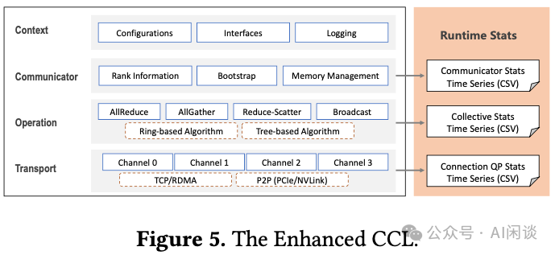

# 阿里 C4：通信驱动加速大规模并行训练效率

**作者：** AI闲谈

---

一、背景

我们在之前的两篇文章中详细介绍了万卡 GPU 集群中的网络拓扑相关信息以及在万卡 GPU 集群中进行大规模 LLM 训练面对的挑战和相应解决方案。最近又看到阿里团队在相关领域的工作，本文中我们简单对其进行总结。论文中很多基础知识没有展开介绍，强烈建议优先阅读对应的两篇文章：

- [万卡 GPU 集群互联：硬件配置和网络设计](http://mp.weixin.qq.com/s?__biz=Mzk0ODU3MjcxNA==&mid=2247486775&idx=1&sn=abf7af24181cf5189e113fb161cc8d30&chksm=c364ca72f4134364f4e3fa4a971f767c2b07e6c2cae38c2a4ae28071fd330abaea68c36542c4&scene=21#wechat_redirect)
- [万卡 GPU 集群实战：探索 LLM 预训练的挑战](http://mp.weixin.qq.com/s?__biz=Mzk0ODU3MjcxNA==&mid=2247486852&idx=1&sn=9f9dc1df99ab6aafb28e091f4532b89e&chksm=c364cac1f41343d7b10d9d234d1c7f3371d996afda01cb94d294a38cba4f1a14fe4594992aa2&scene=21#wechat_redirect)

对应的论文为：[2406.04594] Boosting Large-scale Parallel Training Efficiency with C4: A Communication-Driven Approach
## 二、摘要

大型语言模型（LLM）由于规模很大，需要大量的语料进行预训练，并行训练技术也就非常有必要，其往往需要数千个 GPU 来共同训练一个模型。不幸的是，当前并行训练的效率往往不是最优的，这主要归因于如下两个问题：

- 首先，硬件故障在所难免，会导致训练任务中断。无法快速识别故障组件会导致 GPU 资源的大量浪费。
- 其次，LLM 训练中通常采用同步训练方式，GPU 必须等待参数同步完成后才能进入下一轮计算，网络拥塞会大大增加 GPU 的等待时间。

为了应对这些挑战，论文作者提出了一种由通信驱动的解决方案，即 C4（Calibrating Collective Communication over Converged Ethernet）。其关键想法有两点：

- 首先，在并行训练中，集合通信表现出周期性和同质性的特征，因此任何异常肯定是由于某种形式的硬件故障引起的。利用此特性，C4 可以快速识别故障组件，迅速隔离异常并重新启动任务，从而避免因异常检测时延而造成的资源浪费。
- 其次，集合通信的可预测通信模型（涉及少量大流量）使 C4 能够高效地执行流量规划，从而大大减少网络拥塞。

C4 已经在阿里的生产系统中广泛实施，将错误引起的开销减少了约 30%，并将某些通信成本适中的运行时性能提高了约 15%。

## 三、引言

### 3.1 训练预估

如下表所示，LLM 的预训练代价很高，往往需要上千 GPU 训练几十天。尤其是，早期的百 B 规模 LLM 都只在几百 B Token 上训练，而现在的 LLM 通常会训练几 T Token，比如 LLaMA-3 系列模型训练的 Token 数已经达到 15T。

| 模型 | 大小 | Tokens | 资源 | 时长 |
| --- | --- | --- | --- | --- |
| GPT-3 | 175B | 300B | 10000 V100 | 14.8d |
| LaMDA | 137B | 768B | 1024 TPU-v3 | 57.7d |
| OPT | 175B | 300B | 992 A100-80G | 34d(811K GPU hours) |
| PaLM | 540B | 780B | 6144 TPU-v4 | 50d |
| BLOOM | 176B | 366B | 384 A100-80G | 1083K GPU hours(大约3.5m) |
| GLM | 130B | 400B | 768 A100-40G | 60d |
| LLaMA-1 | 65B | 1.4T | 2048 A100-80G | 21d(1022K GPU hours) |
| Falcon | 180B | 3.5T | 4096 A100-40G | 43,500 PFLOP/s-days |

对于现在广泛采用的 Decoder Only LLM，可以根据其模型参数量和 Token 数以及训练资源预估出训练时长。具体来说，每个 Token 的 Forward 计算量大约为 2 倍的参数量，如下所示，其中 W 是模型参数量：

考虑到大部分情况下总的计算量与 Forward 计算量的比例接近 3:1，因此可以根据每个 Token 的计算量预估出训练中的计算量约为（与论文 [2001.08361] Scaling Laws for Neural Language Models 中结论一致）：

根据每个 Token 计算量和计算资源可以大概预估出训练的总时长，其中 MFU 表示 Model FLOPS Utilization，是广泛采用的用于衡量分布式训练效率的指标：

训练天数 = Token 数 * Ctoken / (GPU 数 * GPU FLOPs * MFU * 3600 * 24)

根据以上公式可以进一步预估使用 8192 H100-80G GPU，10T Token 数据训练 175B 模型的天数为 30 天：

10T*6*175B/(8192*1000T*50%)/3600/24=30 天

### 3.2 基本概念

网络直径（Network Diameter）指的是网络中任意两个节点之间的最短路径中最长的一条路径的长度，通常用跳数（hops）来表示：

- 最短路径：在网络图中，从一个节点到另一个节点的所有可能路径中，所需跳数最少的一条路径。
- 最长的最短路径：对于网络中所有可能的节点对，每个对都有一个最短路径，网络半径就是这些最短路径中跳数最多的那一条的跳数。

交换基数（Switch Radix）是指交换机上可用的端口数量。例如，一个 48 Port 的交换机的交换基数就是 48。交换基数越大，交换机能够直接连接的节点数就越多。这意味着在网络拓扑中，从一个节点到另一个节点可能只需要经过更少的跳数。直接连接的节点越多，数据包传输过程中需要经过的中间节点就越少，从而减少了网络直径。

### 3.3 错误处理

LLM 预训练基本都采用分布式同步训练方式，其集合通信是同步的。也就是说，任何异常都可能导致整个作业失败。为了使作业继续运行，用户在训练中都会定期保存 Checkpoint，以便作业失败后可以从最后一个 Checkpoint 恢复。

如下图 Figure 1 所示，在执行 DL 训练作业之前或之中都可能出现严重错误，它们会以不同的方式影响系统利用率：

- 如果错误发生在作业开始之前，则将在系统诊断、错误组件隔离和作业重新启动方面花费额外的时间。这种情况下，通常需要花费大量时间来诊断和精确定位缺陷组件，可能需要数小时甚至数天。
- 如果错误发生在作业执行中，则会浪费更多的额外时间，包括 Post-Checkpoint Cost（导致 Checkpoint 之后的计算浪费）和 Fault Detection Cost（在错误发生和用户检测到错误之间存在延迟）。

如下图 Table 1 所示，作者统计了一个代表性任务在一个月内遇到的错误。数据显示，由于这些错误，该作业在一个月内失败了 40 次。由于当时缺乏有效的故障检测和诊断工具，可能需要数小时到数天的时间才能确定原因并查明缺陷节点。根据作者经验，大约 30% 的时间花在错误检测、系统诊断、隔离缺陷节点和重新启动任务上，只有 70% 的时间用于实际训练任务。从用户视角看，87.5% 是 “NCCL Error”，而实际的故障问题可能包含多种，比如 GPU 硬件错误，网络断开、内存溢出等，也可能是用户代码异常，比如常见的 Tensor 大小不匹配。其大部分故障都是单节点的异常，发现并隔离节点即可避免再次受该节点异常影响。

### 3.4 优化通信

除了异常导致作业崩溃之外，GPU 还可能由于集合通信操作或数据加载延迟而出现停顿：

- 首先，各种流程之间的流量冲突或硬件问题（如以太网链路故障）可能导致通信成本升高。为了同时扩展系统规模并提高系统可用性和可维护性，作者采用了双 Port NIC 进行系统互联，每个 Port 连接到不同的 Leaf 交换机，节点和 Leaf 交换机之间将有两个可用链路，任何一个链路失效，另一条链路可以接管所有流量，当然也会成为系统瓶颈。
- 此外，处理硬件缺陷造成的通信开销之外，还可能出现多个数据流争夺单个链路的可用带宽。

对于现在的分布式训练作业，带宽限制会显著增加通信时延并导致通信性能下降。随着模型和训练集群规模扩大，这个问题进一步加剧。如下图 Figure 2 展示了训练 22B GPT 模型时实际性能和理论性能的差异，实际性能与理论性能的差异随着 GPU 数的增加逐渐扩大，当达到 512 GPU 时，实际性能下降到理论性能的 30%。

与传统云环境中的通信模式不同，DL 训练集群中通常只有少数较持久的连接，每个节点通常管理大约几百个连接。这种环境下流量的冲突会导致这些连接的有效带宽发生大幅变化，从而导致通信时延增加数倍。然而，这一挑战也伴随着机遇，DL 中的流量通常是周期性的、可预测的，这为通过工程手段提高通信效率提供了独特的优势。

从本质上讲，大规模训练集群的有效性能受到硬件缺陷和流量冲突的显著影响。为了确保 GPU 在模型计算过程中高效运行，最大限度地减少故障检测和系统诊断所浪费的时间至关重要。此外，为了防止 GPU 在定期同步期间停顿，必须消除任何多余的通信开销。

## 四、方法

### 4.1 并行训练稳定性

基于以上的分析，作者通过两种策略解决硬件故障：

- 降低硬件故障率，该策略至关重要，但作者没有太多介绍，主要提到了温度控制是关键（要点 1）。比如，通过动态电压和频率调节（DVFS）等方法有助于防止 GPU 过热，但会影响性能一致性。作者通过更快的风扇和更好的空调系统改善冷却效果，实现温度调节。当然，未来的 AI 基础设施建设也开始转向更高效的冷却方案，比如液冷。（PS：NVIDIA 新一代 Blackwell GPU 的功耗进一步增加，这一挑战更加明显，因此 NVIDIA 也提到了液冷系统。）
- 系统性容错：在传统云应用中通常采用在线容错方案，比如使用冗余计算来容忍计算故障，通过纠错码和/或三重副本技术提供高可靠存储，使用多路径策略承受网络异常；然而，在大规模 LLM 训练中，通常采用离线容错方案，例如定期保存 Checkpoint。作者与用户深入讨论，得到一个关键信息：底层系统不应该将任何不确定性引入模型训练过程中（要点 2）。因此，作者采用了混合的技术方案，具体而言：
- 利用成熟的云存储技术提供可靠的数据存储。
- 准备备份节点以替换故障节点。作者针对 128 台机器 1024 个 GPU 会分配 8 台机器 64 个 GPU 作为备份，以确保在这 136 台机器中的任何 128 台上训练时具有相同的通信吞吐和计算性能。

关于网络，业界普遍采用单 Port NIC（例如 1*400Gbps）来减少哈希冲突的可能性。然而，这种方式可能带来可靠性问题，端口异常可能迫使任务从最近的 Checkpoint 重新启动。而作者采用了 2*200Gbps 双上行链路来增强可靠性，同时解决网络哈希冲突以维持性能。本质上讲，确保每一层的最大可靠性，再加上跨层优化，对于实现最高效、最可靠的整体系统至关重要（要点 3）。

作者的 C4D 容错架构包括如下几点：

- 通过纠错码实现可靠的数据传输。
- 通过双上行链路和多路径通信实现网络可靠性。
- 通过 Checkpoint 和冗余节点处理计算故障。

如下图 Figure 3 所示，该系统的核心是 C4D（C4 Diagnose）子系统，旨在快速检测硬件故障以提示任务重启。C4D 利用了两个洞察（要点 4）：

- 并行训练任务通常是有规律的、可预测的，基于此可以识别出一些异常。
- 并行训练中的 Bulk Synchronous Parallel（BSP）模型需要有规律的同步点，这些同步点可以作为衡量异常的锚点。

PS：下图中的 Wi 表示训练中的 Worker Pod，Ni 表示 Node，SW 表示 NIC Switch。

- 物理机监控（Server Monitor）、网络监控（Network Monitor）可以提供基本的硬件信息，与任务无关。
- 每个 Worker 也会提供相应的统计信息和日志，并由 C4 Runtime Fault Detection 来汇总，并将相关信息同步给 Job Steering Service 和 Background Root Cause Analysis。
- Job Steering Service 会根据 C4 Events 相关信息来决定是否隔离节点或重启任务。
- Background Root Cause Analysis 除了接收 C4 Events 外，也会接收物理机监控和网络监控，以便找到问题的根因。

如下图 Figure 4 所示为 C4D 的主要原理，其包含 3 个基本组件：增强的 CCL（Collective Communication Library）、C4a（C4 agent）以及 C4a Master：

- 在每个 Worker 中都会使用增强的 CCL，并且每个 Worker 上都会有 C4a 以便收集当前 Worker 相关信息，比如 CCL 日志。作者没有直接使用 NCCL 是因为其缺乏一些必要的监控信息。
- 收集并汇总所有 Worker 的各种信息，并生成 events.csv 和 summary.txt。

如下图 Figure 5 所示为其增强的 CCL 库，和其它的 CCL 类似，整个 CCL 包含 4 层，作者对其中下面的 3 层进行了扩展，以增加监控功能：

- Communicator 层：会记录 Communicator ID、Rank 数，Rank 分配情况信息。
- Operation 层：监控集合通信操作类型、算法、数据类型、元素个数以及操作的持续时间和计数。
- Transport 层：收集连接细节信息（比如，RDMA IP 和 QP 编号）以及消息统计信息，包括传输的计数、大小和持续时间等。

在运行时收集上述信息并非易事，需要成本低，准确率高。为了精确监控通信 Kernel 执行模式，作者优化了所有相关的 CUDA Kernel，以直接记录其开始和完成时间，因为 CPU 时间戳和 CUDA Event 并不够准确。基于以上收集到的信息，可以检测到集群中常见的 4 种错误类型：通信 Hang，非通信 Hang，通信慢（Communication Slow）和非通信慢（Non-Communication Slow）。检测前两种错误类型相对容易，作者并没有深入讨论，而是将重点集中在识别慢的问题。如下为两个案例：

案例 1：通信慢检测。以数据并行中的 AllReduce 为例，所有 Worker 都要求所有模型副本的梯度平均。因为所有 Worker 的数据切分方式一样，通信量也一样，理论上任意两个 Worker 的通信时延应该相同。因此可以构建一个 2 维混淆矩阵，横轴表示 Destination 的 Worker ID，纵轴表示 Source 的 Worker ID，对应位置的值表示通信 Latency。如下图 Figure 6 所示：

- 只有一个点 Latency 比较高，表明这两个 Worker 的链路存在瓶颈。
- 一行 Latency 都比较高，表示对应位置的 Source Worker 可能存在问题。
- 一列 Latency 都比较高，表示对应位置的 Destination Worker 可能存在问题。

案例 2：非通信慢检测。以 AllReduce 操作中的 Ring 算法为例，所有参与的 Worker 相互连接，形成一个环状结构。每个 Worker 仅与相邻 Worker 通信，可以称为“上一个 Rank”和“下一个 Rank”。具体而言，Worker 从“上一个 Rank”接收数据块，对其 local 数据执行 Reduce 操作，然后将生成的数据传递给“下一个 Rank”。事实上，由于要求接收方必须首先准备接收缓冲区并通知发送方，然后才能进行数据传输，存在一种不明确的“接收方驱动”调度逻辑。因此，可以通过查看接收方等待数据的时间来诊断非通信慢问题，比如由计算或数据加载引起的等待：

- 如果接收方遇到非通信慢问题，则发送方可能已经在等待，从而一旦接收方发起调度信号就可以快速接收数据。
- 相反，如果发送方存在非通信慢问题，即使接收方发起调度信号后也不会及时发送数据，从而导致接收方等待时间过长。

### 4.2 并行训练可扩展性

并行训练性能依赖于单节点计算效率，数据访问速度以及集合通信速度等。单节点计算能力可以通过混合精度或者使用 Transformer Engine 来提升，数据访问效率可以通过 Alluxio 等 Cache 机制实现。本文主要聚焦在集合通信效率，其中一个关键因素是训练稳定性。

如果将网络带宽视作一种资源，则优化集合通信性能相当于寻找一种最优的资源分配方案。事实上，集合通信可以看做是两个 Worker 之间一对一通信的集合，如果包含 Reduce 操作，也可能涉及计算。因此，寻找最优资源分配的问题可以分解为两个问题：

- 最小化每一次一对一通信的资源需求。
- 将每一次一对一通信映射到网络资源上，使得总通信时间最短。

第一个问题不是本文的重点，为了完整性，作者只是做了简单介绍。一旦一对一通信的数据量固定，其对网络资源的消耗与数据在网络中传输的距离成正比。为了减少数据传输距离，作者采用了两种优化策略：

- 首先，通过创新的网络架构最小化网络直径，AI 训练服务器内部提供高速 NVLink 互连，它是网络固有的一部分（要点 5）。因此，网络实际上是一个分层拓扑，其中 NVLink 构成第一层，不同服务器间的 RDMA 网络构成第二层。此外，还采用了双上行链路技术，这不仅可以提高网络可靠性，还可以增加交换芯片的基数。显然，对于给定数量的 endpoint 和指定的网络拓扑，交换基数越大，网络直径越小。
- 其次，利用网络拓扑感知调度技术来确保需要通信的两个 Rank 在网络中尽可能接近。

基于以上优化，大多数情况下都能实现良好的性能。例如，对于小规模的单个任务，所有通信都可以在单层 Leaf 交换机内完成。但对于较大规模的训练任务或多个任务并存的场景，进一步优化是必不可少的。上述两种场景的根本问题其实是一样的：有大量的流量需要 Spine 交换机转发，导致大量的流量冲突。

为了应对这一挑战，作者引入了 C4P（C4 Performance）系统，旨在减少不必要的通信成本。C4P 通过以下方式优化并发作业和链路故障下的通信：

- 在任务启动时识别和避免故障链路。
- 在路径之间平衡 RDMA QP 以分配负载。
- 根据网络变化和流量冲突动态调整 QP 工作负载。

本质上，C4P 是一种流量工程（traffic engineering）技术，旨在通过调节网络内每个数据流的传输路径来最大限度地减少网络拥塞。这个概念并不新鲜，但由于网络中有大量连接，它在传统数据中心并不常用。C4P 在并行训练场景中很实用，主要是因为并行训练产生的流量特征与传统云应用进程的流量特征有显著不同。也就是说，并行训练任务涉及的数据流数量很少，但传输的数据量很大。少量大流量的存在使得 C4P 可以精心规划每个数据流的路线（要点 6）。

C4P 遵循 C4D 的软件结构，但有关键区别，如下图 Figure 7 所示：

- 首先，与专注于单个作业的 C4D master 不同，C4P master 充当多个作业或租户的控制中心。
- 此外，C4P 的 CCL 可以为通信 Worker 请求路径分配，而 C4D 的 CCL 收集监控数据。
- 最后，C4P 的 master 分配通信路径，而 C4D 的 master 处理故障检测和诊断。

与先前的研究类似，作者使用路径探测（path-probing）进行精细的流量工程：C4P 首先隔离并屏蔽 Leaf 交换机和 Spine 交换机之间的故障链路，从而创建健康链路网络。C4P master 通过每个 Leaf 交换机随机选择的服务器执行全网状路径探测，识别和分类可靠路径。在创建连接时，CCL 会向 C4P master 发出路径请求，后者通过指定 RDMA 连接的源 Port 来响应所选路径。master 通过禁止从左 Port 到右 Port 的路径（反之亦然）来确保来自同一 NIC 的流量在左 Port 和右 Port 之间保持平衡。此外，来自同一 Leaf 交换机下的节点的流量分布在所有可用的 Spine 交换机上，以防止网络拥塞。CCL 不断评估各种路径上的消息完成时间，并优先考虑最快的数据传输。如果最佳 QP 的队列已满，则选择下一个最佳队列。这种方法有助于在路径错误或流量拥塞的情况下保持较低的传输延迟。

C4P 的部署方法与 C4D 相似，两个系统都嵌入到用户镜像中，以方便与 Kubernetes (K8s) 集成。然而，一个显著的区别是，C4P master 在系统级别上运行，提供全局访问，而 C4D master 则发挥更本地化的作用，仅限于单个作业范围。

## 五、评估

### 5.1 配置

如下图 Table 2 所示为作者运维的集群配置及相应评估的配置，可以看出，单节点 8*H800 GPU，对应 8 个 400Gbps BlueField-3 NIC，每个 400 Gbps NIC 会分成 2 个 200 Gbps Port。作者测试时使用了 16 个节点，共 128 H800 GPU。其中的网络为 3-Tier Clos 拓扑，1:1 收敛。网络拓扑中使用博通的 Trident4 作为 Leaf 交换机（64 x 200GbE, 或 32 x 400GbE），Tomahawk4 作为 Spine 交换机（128 × 200GbE，或 64 x 400GbE），其集群可以支持超过 10000 GPU，在单 Pod 中是 512 GPU（(128/2/2)*(64/2/2)=512）。

作者基于一个真实的 LLM 训练任务评估了 C4D 的有效性，其中模型包含 175B 参数量，使用 2400 GPU 进行训练，模型从头训练需要 1 个月的时间。C4P 的有效性是基于集合通信 Benchmark 和 3 个典型的训练任务来评估。为了确保通信基准测试的无偏评估，作者使用基于环的算法。

### 5.2 C4D 有效性评估

如下图 Table 3 所示，作者以内部 2400 GPU，训练 1 个月的任务为例，对比了在部署容错系统之前（2023 年 6 月）和之后（2023 年 12 月）错误导致的停机时间。可以看出，部署 C4D 后停机时间大幅减少，从 31.19% 下降到 1.16%。

在部署 C4D 之前：

- 大部分停机花费在系统诊断和隔离，占 19.65%，主要是排查问题，通常花费数小时到数天时间。从表中也可以看出，大多数错误都是 GPU 缺陷引起，包括 GPU ECC Error，NVLink Error 和 CUDA Error。
- 第二个主要因素是 Post-Checkpoint 时间，占 7.53%，也就是重启导致浪费的计算时间。其解决方案主要是更频繁地保存 Checkpoint。
- 第三个因素是检测时间，占 3.41%，通常用户不会立刻意识到任务异常，比如 Pytorch 作业可能会挂起 30 分钟才会终止进程，这种延迟也会带来资源浪费。

在部署 C4D 之后：

- 显著加快了错误检测和故障组件的精确定位，将响应时间缩短到仅几十秒。尽管如此，仍然需要几分钟来隔离受影响节点并重新启动作业。
- 可以每 10 分钟保存一个 Checkpoint，相应的 Post-Checkpoint 时间可以大幅降低。
- 在部署 C4D 之前的 6 个月里系统中最脆弱的组件也被修复和增强，相应 Re-Initialization 的时间也从 0.6% 降低到 0.15%。

### 5.3 C4P 有效性评估

平衡一个 NIC 上两个物理 Port 之间的流量。每个 Source GPU 和 Destination GPU 都对应一个 NIC，每个 NIC 都有两个物理 Port，如果 Source GPU 中的数据从对应的某个 Port 发出后，再经过交换机，可能被路由到 Destination GPU 对应的任何一个 Port，这样也就可能存在不均衡导致性能下降。使用 C4P，可以为每个物理 Port 中的流量绑定一条专用路径，从而防止这种不均衡。作者使用 NVIDIA 的 NVIDIA/nccl-tests 来测量相应的 busbw，这是一个反映有效通信性能的指标（busbw 越高，通信时延越低）。如下图 Figure 8 所示为启用 C4P 后 AllReduce 操作的性能，可以看出 busbw 都明显提升。比较奇怪的是其中红框里的 busbw 超过了 NIC 的 400 Gbps，作者介绍说是 busbw 的计算方法导致，但并未具体介绍计算方法有什么问题（PS：如果是采用 Tree-based 算法，机内通信可以使用 NVLink，那么是可能超过 busbw 的；但是作者提到了采用的是 Ring-based 算法，所以按道理 busbw 应该小于 NIC 带宽，而且也没看出计算方式有什么问题，此处存疑）。

多作业流量负载均衡。为了评估 C4P 在同时执行多种作业下的有效性，作者使用 8 个 AllReduce Benchmark 来模拟作业。每个作业都会被分配 2 个节点，并且来自不同的 Leaf 交换机 Group，以确保 2 个节点之间的流量肯定需要通过 Spine 交换机。如下图 Figure 9a 所示，使用 C4P 后可以有效提升实际吞吐。为了评估 C4P 在拥塞网络环境中的性能，作者特意将网络中的 Spine 交换机屏蔽了一半，从而将网络收敛比变为 2:1。重新进行上述实验，可以得出类似结论，当然，因为收敛比为 2:1，极限带宽也只有 200Gbps。

需要说明的是，即使启用了 C4P，并发任务的性能也会略有变化。具体来说，最高和最低吞吐之间有 11.27 Gbps 的小差距。这种差异归因于 RDMA NIC 中的拥塞控制机制，该机制根据网络条件动态调整发送方的数据传输速率。如下图 Figure 10 所示，每个绑定端口每秒接收大约 15,000 个拥塞通知数据包 (CNP)，数量在 12,500 到 17,500 之间波动。CNP 的波动直接导致了流量的有效带宽变化。尽管存在这些变化，但启用 C4P 后，总体吞吐量大幅提高了 65.55%，长尾问题明显得到缓解：

对动态链路故障的容忍度。全局流量工程（Global traffic engineering）的高效性取决于网络条件的稳定性。个别链路中断后可能需要重新路由受影响的流量，这可能导致网络中的流量分配不合理，并降低全局流量工程的有效性。此时将启动 C4P 的负载均衡机制以调整流量分布。为了评估这种机制的有效性，作者同样在 1:1 收敛比的情况下复现了以前的实验，并在实验中故意屏蔽某些链路。

- 如下图 Figure 11a 所示为未启动 C4P 负载均衡时流量的吞吐的变化，链路异常后平均带宽只有 185.76 Gbps。
- 如下图 Figure 11b 所示为启动 C4P 负载均衡后流量的吞吐变化，链路异常后平均带宽依然有 301.46 Gbps，大幅提升 62.3%。

为了展示 C4P 负载均衡如何提高系统吞吐量，作者从 Leaf 交换机收集了每个端口的流量分布的统计数据。如下图 Figure 12 所示，在链路异常之前，所有端口都表现出接近最佳的带宽利用率。然而，链路异常后：

- （a）：未启动负载均衡，只有 3 个端口显示流量增加，还有很多正常的端口流量下降。
- （b）：启动负载均衡，C4P 动态调整了流量分布，大部分端口还有较高的带宽利用率，因此才能提高系统吞吐量。

作者基于真实场景评估了 C4P 的效果，具体来说包含 3 个任务：

- job1：使用 Megatron 框架训练 GPT 模型，22B 参数量，TP 为 8，DP 为 16。
- job2：使用 Deepspeed 训练 LLaMA 模型，7B 参数量，采用 Zero-Optimization，仅使用 DP。
- job3：使用 Megatron 框架训练 GPT 模型，参数量 175B，TP 为 8，PP 为 8，DP 为 2。

性能评估结果如下图 Figure 13 所示，可以看出，job 1 和 job 2 的吞吐都有所提升。job1 提升 15.96%，job2 提升 14.1%，而 job3 几乎没有提升。这与训练中通信的占比有关，前两个 job 训练中通信开销占到 30% 以上，但 job3 使用了 16 的梯度累积，大大降低了通信成本，所以提升比较小。

## 六、参考链接

1. https://arxiv.org/abs/2406.04594

