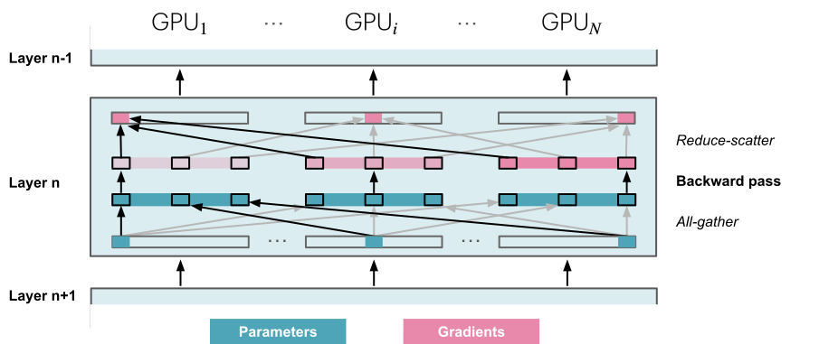
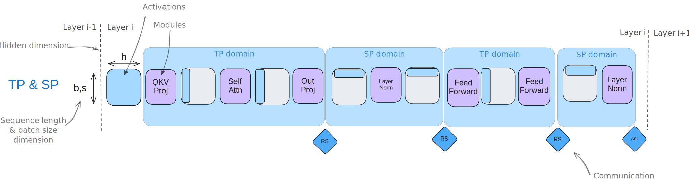
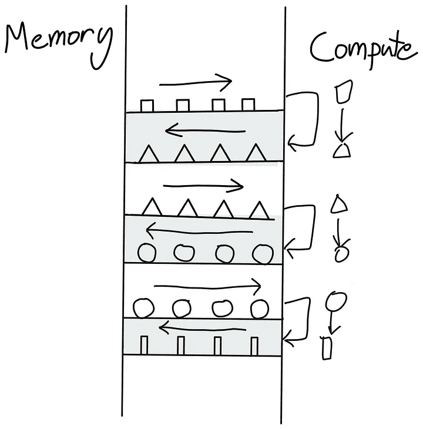
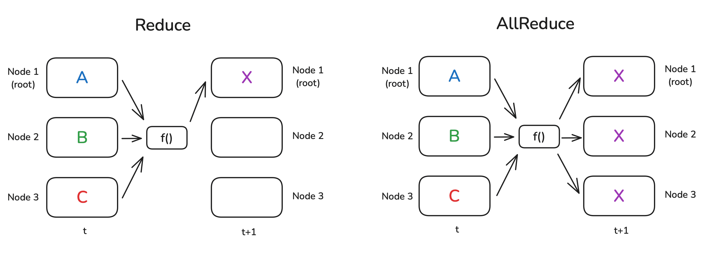
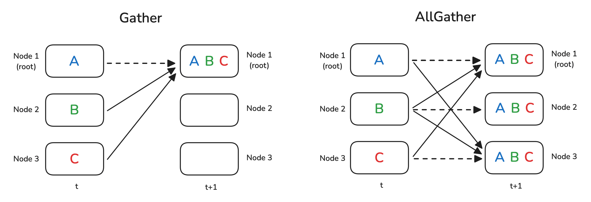
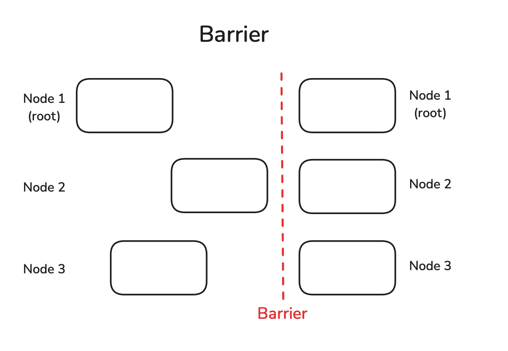

# The Ultra-Scale Playbook:  
Training LLMs on GPU Clusters

Thousands of GPUs humming in perfect harmony. That's what it takes to train today's most powerful AI models – a symphony of computing power that until recently was the exclusive domain of elite research labs. Open source has transformed this landscape, but not completely. Yes, you can download the latest [Llama](https://huggingface.co/meta-llama) or [DeepSeek](https://huggingface.co/deepseek-ai) models. Yes, you can read their [technical](https://ai.meta.com/research/publications/the-llama-3-herd-of-models/) and [experiment](https://github.com/deepseek-ai/DeepSeek-R1/blob/main/DeepSeek_R1.pdf) reports. But the most challenging part – the training code, the knowledge and techniques necessary to coordinate GPUs to train these massive systems – remains shrouded in complexity and spread around in a series of disconnected papers and often private codebases.

Reading time: 2-4 days.  
For the best reading experience, we recommend not using a mobile phone.

This open source book is here to change that. Starting from the basics, we'll walk you through the knowledge necessary to scale the training of large language models (LLMs) from one GPU to tens, hundreds, and even thousands of GPUs, illustrating theory with practical code examples and reproducible benchmarks.

As the size of the clusters used to train these models has grown, various techniques, such as data parallelism, tensor parallelism, pipeline parallelism, and context parallelism as well as ZeRO and kernel fusion, have been invented to make sure that GPUs are highly utilized at all times. This significantly reduces training time and makes the most efficient use of this expensive hardware. These distributed training techniques are not only important for building initial models but have also become essential for fine-tuning large models on specialized data, which often produces the best results. In this book, we'll progressively go over all of these techniques – from the simplest to the most refined ones – while maintaining a single story line to help you understand where each method comes from.

If you have questions or remarks, open a discussion on the [Community tab](https://huggingface.co/spaces/nanotron/ultrascale-playbook/discussions?status=open&type=discussion)!

We'll assume you have some basic knowledge about current LLM architectures and are roughly familiar with how deep learning models are trained, but you can be generally new to distributed training. If needed, you can find information on the basics of model training in the great courses available at [DeepLearning.ai](https://www.deeplearning.ai) or in the [PyTorch tutorials](https://pytorch.org/tutorials/beginner/basics/intro.html). This book can be seen as the second part of a trilogy, following our previous blog post on processing data for pretraining (the so-called “[FineWeb blog post](https://huggingface.co/spaces/HuggingFaceFW/blogpost-fineweb-v1)”). Having read both, you should have almost all the core knowledge you need to fully understand how how high-performing LLMs are being built nowadays and will just be missing the secret sauce regarding data mixing and architecture choices to complete the recipe (stay tuned for part three…).

We are extremely thankful to the whole [distill.pub](https://distill.pub/) team for creating the template on which we based this blog post.

The book is built on the following **three general foundations**:

**1\. Quick intros on theory and concepts:** Before diving into code and experiments, we want you to understand how each method works at a high level and what its advantages and limits are. For example, you’ll learn about which parts of a language model eat away at your memory, and when during training it happens. You’ll also learn how we can work around memory constraints by parallelizing the models and increase throughput by scaling up GPUs. As a result, you'll understand how the following widget to compute the memory breakdown of a Transformer model works:

Note that we're still missing pipeline parallelism in this widget. To be added as an exercise for the reader.

Memory usage breakdown

Attention Heads (a):

 

Mixed Precision:

Micro-Batch Size (b):

 

Sequence Parallelism:

Hidden Dimension (h):

 

Recomputation: None Selective Full

Feedforward Dimension (h\_ff):

 

ZeRO: 0 1 2 3

Number of Layers (L):

 

FF Activation: ReLU GELU SwiGLU

Sequence Length (s):

 

Vocabulary Size (v):

 

Tensor Parallelism (t):

 

Optimizer Parameters (k):

 

Data Parallelism (d):

 

Presets: Llama 3 Tiny Llama 3 8B Llama 3 70B Llama 3 405B

(Don't worry if you have no idea what's happening in this widget. That's why we're here!)

While this widget gives a theoretical breakdown, we also made the [following tool](https://huggingface.co/spaces/nanotron/predict_memory) that can be used to predict the memory usage during a training run:

**2\. Clear code implementations:** Theory is one thing, but we discover all kinds of edge cases and important details when we implement something. That’s why we link to implementation references where possible. Depending on the case, we’ll use two code references:

*   The [Picotron](https://github.com/huggingface/picotron) repository is built for education, so it usually implements concepts in single, self-contained short files.
    
*   On the other hand, to look at production-ready code, we’ll refer to the [Nanotron](https://github.com/huggingface/nanotron) implementations. This is a production training codebase used at Hugging Face.
    

3\. If you want to watch a video on distributed training rather than reading the blog or picotron code, check out [Ferdinand's YouTube channel](https://www.youtube.com/watch?v=u2VSwDDpaBM&list=PL-_armZiJvAnhcRr6yTJ0__f3Oi-LLi9S).

**3\. Real training efficiency benchmarks:** How to _actually_ scale your LLM training depends on your infrastructure, such as the kind of chips used, interconnect, etc., so we can't give a single unified recipe for this. What we will give you is a way to benchmark several setups. This is what we've done on our cluster. We ran over 4,100 distributed experiments (over 16k including test runs) with up to 512 GPUs to scan many possible distributed training layouts and model sizes.

As you can see, there’s a lot of ground to be covered. Before getting into the trenches of distributed training, let’s take a quick high-level look at the challenges we'll cover in the book.

## High-Level Overview

All the techniques we'll cover in this book tackle one or several of the following three key challenges, which we'll bump into repeatedly:

1.  **Memory usage:** This is a hard limitation - if a training step doesn't fit in memory, training cannot proceed.
2.  **Compute efficiency:** We want our hardware to spend most time computing, so we need to reduce time spent on data transfers or waiting for other GPUs to perform work.
3.  **Communication overhead:** We want to minimize communication overhead, as it keeps GPUs idle. To achieve this, we will try to make the best use of intra-node (fast) and inter-node (slower) bandwidths and to overlap communication with compute as much as possible.

In many places, we'll see that we can trade one of these (computation, communication, memory) off against another (e.g., through recomputation or tensor parallelism). Finding the right balance is key to scaling training.

As this book covers a lot of ground, we've made a [cheatsheet](assets/images/ultra-cheatsheet.svg) to help you navigate it and get the general takeaways. Keep it close by as you navigate these stormy waters!

## First Steps: Training on One GPU

 Your browser does not support the audio element.

If you fancy adding a podcast feeling to your reading experience, feel free to listen to the NotebookLM hosts discussing the first sections of this book as you're reading along.

Let’s start by quickly reviewing the very basics of model training before we start to scale to many GPUs. When a model is trained on a single GPU, the training typically consists of three steps:

1.  A forward pass, which passes inputs through the model to yield its outputs
2.  A backward pass to compute the gradients
3.  An optimization step using the gradients to update the parameters

As we’ll see later, these steps may be repeated or intertwined, but for now we’ll start simple.

It looks generally like this:

Hover over the network elements to see their details.

In this figure, the boxes on the top line can be seen as successive layers inside a model (and the same for the last line). The pink boxes are the associated gradients for each of these layers, computed during the backward pass.

The **_batch size_** (bs) is one of the important hyperparameters for model training; it affects both model convergence and throughput.

A small batch size can be useful early in training to quickly move through the training landscape to reach an optimal learning point. However, further along in the model training, small batch sizes will keep gradients noisy, and the model may not be able to converge to the most optimal final performance. At the other extreme, a large batch size, while giving very accurate gradient estimations, will tend to make less use of each training token, rendering convergence slower and potentially wasting compute resources. You can find a nice early discussion of this topic in OpenAI’s paper on large batch training, or in section 4.2 of the MiniMax-01 [technical report](https://filecdn.minimax.chat/_Arxiv_MiniMax_01_Report.pdf).

For instance, during DeepSeek-V3/R1 training, the batch size is gradually increased from 3,072 input sequences to 15,360 in the training of the first 469B tokens, then kept at 15,360 input samples for the remaining training.

Batch size also affects the time it takes to train on a given text dataset: a small batch size will require more optimizer steps to train on the same amount of samples. Optimizer steps are costly (in compute time), and the total time to train will thus increase compared to using a larger batch size. That being said, note that the batch size can often be adjusted quite widely around the optimal batch size without major impact on the performance of the model - that is, the sensitivity of final model performance to the exact batch size value is usually rather low around the optimal batch size.

In the LLM pretraining community, batch sizes are commonly reported in terms of tokens rather than number of samples (bst = batch size tokens). This makes training numbers generally independent of the exact input sequence length used during the training.

In the simplest case, training on a single machine, the bs (in samples) and bst can be computed from the model input sequence length (seq) as follows:

​	bst=bs \*seq

From here onward we’ll show the formulas for the batch size in terms of samples, but you can always get its token unit counterpart by multiplying it with the sequence length.

A sweet spot for recent LLM training is typically on the order of 4-60 million tokens per batch. The batch size and the training corpus size have been steadily increasing over the years: Llama 1 was trained with a batch size of ~4M tokens for 1.4 trillion tokens, while DeepSeek was trained with a batch size of ~60M tokens for 14 trillion tokens.

We run into our first challenge when scaling the training of our model to these large batch sizes: **_out-of-memory (OOM) issues_**. What should we do when our GPU doesn’t have enough memory to hold a full batch of our target batch size?

Let’s start by exploring what leads to the OOM issues in the first place. This will help us gain some useful intuitions on the memory requirements for training a model.

### Memory usage in transformers

When training a neural network model, we store several items in memory:

*   Model weights
*   Model gradients
*   Optimizer states
*   Activations needed to compute the gradients

📝 Note

You might think that you could compute the memory requirements for a model exactly, but there are a few additional memory occupants that make it hard to be precise:

*   CUDA kernels typically require 1-2 GB of GPU memory, which you can quickly verify by running `import torch; torch.ones((1, 1)).to("cuda")` and then checking the GPU memory with `nvidia-smi`.
*   Some memory is used for buffers and intermediate results, and there's some memory that can't be used due to fragmentation.

We’ll neglect these last two contributors, as they are typically small and constant factors.

These items are stored as tensors, which come in different shapes and precisions. The _shapes_ are determined by hyperparameters such as batch size, sequence length, model hidden dimensions, attention heads, vocabulary size, and potential model sharding, as we’ll see later. _Precision_ refers to formats like FP32, BF16, or FP8, which respectively require 4, 2, or 1 byte to store each single value in the tensor. We will have a full discussion of the different precisions and their trade-offs in the ["Mixed precision training"](#mixed_precision_training) section; for now, let's just keep in mind that the memory requirements for these various formats will be different, and that will impact the memory usage of the items we need to store.

So how can you quickly determine memory usage from these variables? One simple way is to do this empirically and just measure it.

#### Profiling the memory usage

Using the PyTorch profiler, we can understand how memory is allocated throughout training. We can see that memory utilization is not a static thing, but varies widely during training and during a training step:

Check out ["A1: Distributed Training Profiling"](#a1%3A_distributed_training_profiling) for a walkthrough of how to profile your model.

Clearly the first step looks very different from the subsequent ones, but before we get to that, let’s take a look at the general anatomy of a step. First the activations increase quickly as we do the forward pass, then during the backward pass the gradients build up, and as the backward pass propagates, the stored activations used to compute the gradients are progressively cleared. Finally, we perform optimization, during which we need all the gradients, and then update the optimizer states before we start the next forward pass.

As mentioned, the first step looks different: the activations increase quickly and then plateau for a while. Why? In this first step, the PyTorch caching allocator does a lot of prep work, preparing memory allocations so that the subsequent steps don’t have to search for free memory blocks, which speeds them up (see [Zach’s blog](https://zdevito.github.io/2022/08/04/cuda-caching-allocator.html)). After the first step we also see the optimizer states appearing, which generally offset the memory usage for further training steps.

Ever noticed how sometimes the training succeeds in the first step but then OOMs during the following training steps? This can be explained by the buildup of the optimizer state after the first step.

Now that we have a first view of memory, let’s see how scaling up training is often a question of maximizing compute efficiency while keeping the memory requirements of these various items (activations, parameters, gradients, optimizer states) within the memory constraints of the GPUs.

#### Memory for weights/grads/optimizer states

Let's start with the first three items in our list: the model’s weights, gradients, and optimizer states. We can actually pretty easily estimate the memory needed for them.

For a simple transformer LLM, the number of parameters is given by the [following formula](https://michaelwornow.net/2024/01/18/counting-params-in-transformer):

N = h \* v + L \* (12 \* h^2 + 13 \* h) + 2\*h

We excluded the positional embedding count as we're not using fixed positional embeddings.

In that equation, h is the hidden dimension, v the vocabulary size, and L the number of layers in the model. Note that looking at the equation, we can see that the term that will dominate with large hidden dimensions is the h^2 term, since it’s the only one growing quadratically as we scale the parameters.

Memory requirements for the parameters and gradients are determined simply by multiplying the number of parameters by the number of bytes per parameter. In good old-fashioned full precision (FP32) training, both parameters and gradients require 4 bytes while the optimizer, if we use Adam, requires the momentum and variance to be stored, adding another 8 bytes per parameter (4 bytes each). In summary:

\\begin{aligned} & m\_{params} = 4 \* N \\\\ & m\_{grad} = 4 \* N \\\\ & m\_{opt} = (4+4) \* N \\end{aligned}

Now, let’s have a look at how things change if we use a lower precision. For stability reasons (see the section on [mixed precision training](#mixed_precision_training) later in the book), we often don't use full low precision training but a mix of higher and lower precision called "mixed precision". The default nowadays for mixed precision training is to generally use BF16 for most of the computations – requiring 2 bytes per parameter and gradient – as well as storing an additional copy of the model weights and gradients in FP32, making 12 bytes per parameter in total. In addition to the parameters and gradients, we need to store the optimizer states; for the Adam optimizer, this requires the momentum and the variance, usually stored in FP32 for numerical stability, each using 4 bytes.

You'll see some more details below when we cover the ZeRO methods.

Here’s the summary:

\\begin{aligned} & m\_{params} = 2 \* N \\\\ & m\_{grad} = 2 \* N \\\\ & m\_{params\\\_fp32} = 4 \* N \\\\ & m\_{opt} = (4+4) \* N \\end{aligned}

📝 Note

Some libraries store grads in FP32, which would require an additional m\_{params\\\_fp32} = 4 \* N memory. This is done, for example, in Nanotron, because BF16 is lossy for smaller values and we always prioritize stability. See [this DeepSpeed issue](https://github.com/microsoft/DeepSpeed/issues/1773) for more information.

📝 Note

The FP32 copy of the parameters (m\_{params\\\_fp32}) is sometimes called the "master weights" in the literature and codebases.

Interestingly, mixed precision training itself doesn’t save memory; it just distributes the memory differently across the three components, and in fact adds another 4 bytes over full precision training if we accumulate gradients in FP32. It’s still advantageous, though, as computing the forward/backward passes in half precision (1) allows us to use optimized lower precision operations on the GPU, which are faster, and (2) reduces the activation memory requirements during the forward pass, which as we saw in the graph above is a large part of the memory usage.

Let’s get a general sense of how much memory we need for a model (with full and mixed precision giving the same overall values):

| **Model parameters** | **FP32 or BF16 w/o FP32 grad acc** | **BF16 w/ FP32 grad acc** |
| --- | --- | --- |
| 1B  | 16 GB | 20 GB |
| 7B  | 112 GB | 140 GB |
| 70B | 1120 GB | 1400 GB |
| 405B | 6480 GB | 8100 GB |

Using FP8 training instead of BF16 would further decrease the memory usage, but it is less stable. This is a very active research topic (see [this tweet](https://x.com/xariusrke/status/1826669126955278401)), and we’ll cover it in more detail later.

As we can see, as soon as we reach **7B**(!), the memory requirements for the weights, gradients, and optimizer states already start to add up significantly and exceed the size of a typical GPU's memory (e.g., 80 GB for an H100 GPU).

But for now, let’s stick with models that fit in a single GPU and take a look at the last big contributor to our memory budget: the activations.

#### Memory for activations

The memory requirements for activations are a bit more complex to compute than for the weights, gradients, and optimizer states, in part because they depend on the inputs of the model. If you’re unsure why we even need to store activations for the backward pass, [this blog post](https://www.determined.ai/blog/act-mem-2) gives a good quick refresher. After a careful inspection of how the backward pass is computed, we can estimate the total memory required for the activations in mixed precision. We arrive at the following equation:

m\_{act} = L \\cdot seq \\cdot bs \\cdot h \\cdot (34 + \\frac{5 \\cdot n\_{heads} \\cdot seq}{h})

Here, L is the number of layers, seq the sequence length, bs the batch size in samples, h the hidden dimension of the model, and n\_{heads} the number of heads.

For the exact derivation of the numbers, you can follow the original NVIDIA paper on recomputation \- it essentially requires you to do some accounting of all the sizes of intermediate activations between each operation in a transformer layer.

An interesting observation here is that memory usage is not static for a given model; rather, it scales linearly with the batch size and quadratically with the sequence length. This means the activation memory is the part that will blow up when we increase our batch size or train with longer sequences. We can use this equation to look at how memory usage changes for various sequence lengths, for example for Llama models (`bs=1`):

These graphs tell a striking story: for short sequences (or small batch sizes), memory usage for activations is almost negligible, but from around 2-4k tokens they start to take up a significant amount of memory, while usage for parameters, gradients, and optimizer states (as we’ll discuss later) is roughly independent of the sequence length and batch size.

For large numbers of input tokens (i.e., large batch sizes/sequences), activations become by far the largest memory burden.

Is there a way to tame this “activation explosion”? Good question, reader!

It’s time to explain our first technique, called **_activation recomputation_**, which will help us cap the activation memory footprint - it's an essential tool in today’s large model training toolbox.

### Activation recomputation

The general idea behind activation recomputation – also called _gradient checkpointing_ or _rematerialization_ – is to discard some activations during the forward pass to save memory and spend some extra compute to recompute these on the fly during the backward pass. Without recomputation, we store every hidden state between two learnable operations (e.g., feedforward, LayerNorm, etc.), so that we can use them during the backward pass to compute gradients. When we use recomputation, we typically only store activations at a few key points in the model architecture, discarding the rest of the activations and recomputing them on the fly during the backward pass from the nearest saved activations. Basically, we perform a sub-part of the forward pass again, to trade off memory for compute. It generally looks like this:

Hover over the network elements to see their details.

There are a few strategies for selecting key activations to store:

*   **Full:** We checkpoint activations at the transition point between each layer of the Transformer model. This is usually called the “full” strategy since it requires a forward pass through each layer, essentially adding a full forward pass during the backward pass. This strategy saves the most memory but is the most expensive one in terms of compute. It typically increases the compute cost and time by up to 30-40%, which is very noticeable.
*   **Selective:** In general, we can do better than full. The authors of the recomputation paper did a detailed analysis studying which activations grow the largest and have the cheapest recomputation cost in terms of floating-point operations per second (FLOPS). It turns out that the attention computations fall in that category, and thus we can usually discard them and focus on checkpointing the expensive feedforward computations. For a GPT-3 (175B) model, this means **a 70% activation memory reduction at a 2.7% compute cost**.

In recent models like DeepSeek-V3, selective checkpointing is performed, optimizing activation memory usage by storing an even smaller size of attention activation —using so-called "Multi-Head Latent Attention" (MLA).

Let’s see how drastically recomputation strategies can reduce the memory footprint in practice, and how selective recomputation strikes a nice balance between memory savings and recomputation cost:

Another trend that's clearly visible here is how the activations for long sequences play a bigger role for smaller models, so the effect of recomputation becomes even more noticeable.

📝 Note

When you're measuring how efficient your training setup is at using your GPU/TPU/accelerator, you usually want to take recomputation into account to compute total FLOPs (floating-point operations) and compare this to the theoretical maximum FLOPS (floating-point operations per second) of the GPU/TPU/accelerator. Taking recomputation into account when calculating FLOPs for a training step gives a value called "hardware FLOPs," which is the real number of operations performed on the accelerator. Dividing this hardware FLOPs value by the duration of the training step (in seconds) gives you the actual FLOPS achieved. Then, dividing this achieved FLOPS by the maximum accelerator FLOPS yields the **_hardware FLOPS utilization (HFU)_**.

However, what really matters at the end of the day is the total time needed to train a model on a given dataset. So, for example, when comparing various GPUs/TPUs/accelerators, if one of these provides enough memory to skip recomputation and thus performs fewer total operations (lower hardware FLOPs) but still trains faster, it should be rewarded, not punished. Thus, an alternative is to compute what is called **_model FLOPS utilization (MFU)_**, which, in contrast to HFU, only takes into account the required operations for the forward and backward passes through the model and does not include recomputation in the measured FLOPs. This value is thus more specific to the model than the training implementation.

Most training frameworks these days use FlashAttention (covered further [later in the book](#flash_attention_1-3)), which natively integrates activation recomputation in its optimization strategy by recomputing attention scores and matrices in the backward pass instead of storing them. Thus, most people using FlashAttention are already making use of selective recomputation.

As you’ve now understood, activation recomputation slightly increases the number of FLOPS due to recomputation, while it significantly reduces memory access overhead.

This trade-off is particularly advantageous on hardware with limited high-speed memory, like GPUs, as accessing memory is typically slower than performing computations. Despite the additional operations involved, the overall effect is thus often faster computation, in addition to the much lower memory footprint.

Now that we’ve learned about recomputation, we can tame the activation memory usage we saw in the previous graphs!

However, activations still have a linear dependence on the batch size, and all our profiles in the bar plots above were using `bs=1`, so as we move to larger batch sizes this might become an issue again. Fortunately, we have a second tool in our box - **_gradient accumulation_** to the rescue!

### Gradient accumulation

Gradient accumulation is a very straightforward method to avoid memory explosion that consists of splitting a batch into micro-batches. We then perform forward and backward passes successively on each micro-batch, compute the gradients, and, as the name suggests, sum the gradients of all micro-batches before we perform optimization. In practice, the optimization step is conducted not on the sum but on the average of the gradients, so that the result is independent of the number of gradient accumulation steps.

Let’s call the batch size for each forward pass the _micro-batch size_ (mbs). We’ll refer to the overall batch size between each optimizer step as the _global batch size_ (gbs). If we do one optimizer step for each eight forward/backward passes, the global batch size will be eight times the micro-batch size.

What we now call the global batch size thus corresponds to what we’ve called just the batch size up to this point, for simplicity (we're now making our terms more precise to avoid ambiguity).

With gradient accumulation, the global batch size can be computed as follows:

bs = gbs = mbs \\times grad\\\_acc

Gradient accumulation allows us to effectively increase our batch size up to infinity (and beyond!) while the memory footprint stays constant. Gradient accumulation is also compatible with activation recomputation for further memory reductions.

Using gradient accumulation means we need to keep buffers where we accumulate gradients that persist throughout a training step, whereas without gradient accumulation, in the backward pass gradients are computed while freeing the activation memory, which means lower peak memory use.

Gradient accumulation allows us to reduce activation memory, which grows linearly with batch size, by processing smaller micro-batches sequentially. This reduces stored activations and gradients since only one micro-batch's worth of activations needs to be kept in memory at a time, which helps reduce the overall activation memory footprint.

One drawback, however, is that gradient accumulation requires multiple consecutive forward/backward passes per optimization step, thereby increasing the compute overhead and slowing down training. No free lunch!

If you’ve been following carefully, though, you probably noticed that the forward/backward passes for each micro-batch can actually be run in parallel. Forward and backward passes are independent from each other, with independent input samples being the only difference. Seems like it’s time to start extending our training to more than one GPU!

Before that, let's quickly see how we can visualize computation and communication with a short tour of one of the most useful tools in the distributed training toolbox: the **_profiler_**. This tool will be extremely useful to understand and validate how communications between GPUs and compute are happening and where the bottlenecks are.

#### Profiling GPU compute and communication

PyTorch's [profiler](https://pytorch.org/tutorials/recipes/recipes/profiler_recipe.html) allows us to trace and visualize exactly what's happening on both the CPU and the GPU during training. It's natively integrated in PyTorch. Let's see how to use it:

with torch.profiler.profile( activities=\[ torch.profiler.ProfilerActivity.CPU, torch.profiler.ProfilerActivity.CUDA, \], schedule=torch.profiler.schedule(wait=1, warmup=1, active=3), on\_trace\_ready=torch.profiler.tensorboard\_trace\_handler('./log/profile'), with\_stack=True ) as prof: for step in range(steps): train\_step() prof.step()

This generates a trace that we can visualize in TensorBoard or Chrome's trace viewer. The trace shows:

*   A CPU threads launching kernels asynchronously on the GPU
*   Multiple CUDA streams handling compute and communication in parallel
*   Kernel execution times and memory allocation

Example trace showing a CPU threads launching kernels asynchronously on the GPU, with compute kernels and communication happening in parallel across different CUDA streams

The trace helps identify bottlenecks like:

*   Sequential compute and communication that could be overlapped
*   Idle GPU time waiting for data transfers
*   CUDA Syncs and memory movement between CPU and GPU
*   Kernel launch overhead on the GPU

Understanding these patterns is crucial for optimizing distributed training performance. For example, the trace will clearly show if gradient synchronization is properly overlapped with backward computation, as we'll discuss later.

Now let’s get a larger workstation with a couple of GPUs and start investigating our first scaling technique, called _**data parallelism**_ - which, as we'll see, is just a parallel version of gradient accumulation.

## Data Parallelism

 Your browser does not support the audio element.

To add a podcast feeling to your reading experience, feel free to listen to the NotebookLM hosts discussing the following sections of this book as you're reading along.

The idea behind data parallelism (DP) is to replicate the model on several GPUs (we call the replicas “model instances”) and run forward and backward passes on different micro-batches of data in parallel on each GPU - hence the name _data parallelism_. You've probably already seen data parallelism in simple training examples, but we'll dive quite a bit deeper in this section, so stay tuned even if you know the general approach.

If you're not familiar with distributed communication patterns like broadcast, gather, and all-reduce, we've put together a small crash course in ["A0: Parallel Programming Crash Course"](#a0%3A_parallel_programming_crash_course).

Using a different micro-batch for each GPU means we’ll have different gradients on each GPU, so to keep the model instances in sync across the different GPUs, we'll average the gradients from the model instances using an operation called “all-reduce.” This operation takes place during the backward pass, before the optimizer step.

This involves our first “distributed communication” primitive, _**all-reduce**_, which handles the synchronization and communication between GPU instances and nodes.

A naive DP implementation would just wait for the backward pass to finish so that we have all the gradients, then trigger an all-reduce over all the DP ranks to sync the gradients. But such sequential steps of computation followed by communication are **A BIG NO-NO** because we don’t want our GPUs to stay idle while communication is happening, like in the above image.

Instead, we should try to overlap communication and computation whenever possible so that they happen at the same time.

Let’s take a look at three optimizations that allow us to do much better than our naive first implementation.

#### **First optimization:** Overlap gradient synchronization with backward pass

The main drawback of the naive DP approach we’ve just described is that after the backward pass (_computation_), we have to wait for gradient synchronization (_communication_) before updating the parameters. Could we overlap this communication with our computation? The answer is yes!

As shown in the figure above, the gradients (pink boxes) for a layer can be gathered and summed even before the gradients from earlier layers (the pink boxes to their left) have been computed. For example, as soon as the backward pass of the last layer is complete (the last box on the right), those gradients can already be gathered and summed while the backward computations continue for earlier layers, moving toward the left.

This can be achieved in PyTorch by attaching an _all-reduce hook function_ to each parameter. An all-reduce operation is then triggered as soon as the gradient for that parameter is ready, while the gradients for other parameters are still being computed. This approach overlaps most of the all-reduce operations with gradient calculations, thereby improving efficiency. Here's a simple function to attach a hook:

def register\_backward\_hook(self, hook): """ Registers a backward hook for all parameters of the model that require gradients. """ for p in self.module.parameters(): if p.requires\_grad is True: p.register\_post\_accumulate\_grad\_hook(hook)

Overlapping computation and communication reduces the time spent waiting for gradient synchronization across the entire model. Gradient synchronization can occur (at least partially) in parallel with the backward pass within the same training step, significantly speeding up data parallelism. Here's a full implementation of naive DP with synchronization overlap:

👉 Naive DP implementation with overlap in Picotron (click to expand)

This is our first example of the concept of overlapping computation and communication, an essential technique for maximizing scaling efficiency that we will discuss several times in this book. But we can improve the efficiency even further!

#### **Second optimization:** Bucketing gradients

GPU operations are usually more efficient when performed on large tensors, rather than having many operations running on smaller tensors. This is also true for communication operations. Thus, we can advantageously group gradients into “buckets” and launch a single all-reduce for all the gradients within the same bucket instead of performing independent all-reduce operations for each gradient. It will generally look like the following:

Think of it like packing items into boxes before shipping them. It's more efficient to send a few big boxes than many small ones. By performing a single all-reduce operation for each bucket, we can significantly reduce the communication overhead and speed up the communication operation.

Here's a code implementation with bucketing:

👉 Bucket DP implementation in Picotron (click to expand)

#### **Third optimization:** Interplay with gradient accumulation

Finally, as we’ve seen, gradient accumulation works by performing multiple forward and backward passes before updating the parameters with `optimizer.step()`. When combining gradient accumulation with data parallelism, we should be careful when we want to synchronize gradients.

In a naive version, an all-reduce operation is automatically triggered after each backward pass during the accumulation. This is suboptimal, as a single reduce after the final step would have the same effect while reducing overhead.

In PyTorch, this is typically solved by adding a [`model.no_sync()`](https://github.com/pytorch/pytorch/blob/5ea67778619c31b13644914deef709199052ee55/torch/nn/parallel/distributed.py#L1408-L1435) decorator, which disables gradient synchronization, on the backward passes that don’t need reduction.

📝 Note

When performing communication operations, tensors must be contiguous in memory to avoid redundant memory copies. To perform this optimally, we often preallocate continuous buffers of the size of the activations or model parameters specifically for communication. While this speeds up communication, it also contributes in part to the peak memory usage during training.

Now, let's have a look what this means for the global batch size.

### Revisiting global batch size

We can update our batch size equation with our newly added data parallelism and gradient accumulation parameters:

bs = gbs = mbs \\times grad\\\_acc \\times dp

Here, grad\\\_acc is the number of gradient accumulation steps and dp is the number of parallel instances used for data parallelism.

Given a targeted global batch size, we can thus trade gradient accumulation steps for data-parallel processes to speed up training.

In practice, people tend to maximize the data-parallel size (dp) over gradient accumulation (grad\\\_acc) as much as possible since data parallelism is inherently parallel, unlike the sequential nature of gradient accumulation. Gradient accumulation is then added on top of data parallelism to achieve the target global batch size, when scaling data parallelism alone is not sufficient before you run out of GPUs.

A good resource for further reading on data parallelism is [https://siboehm.com/articles/22/data-parallel-training](https://siboehm.com/articles/22/data-parallel-training).

Being able to distribute the training over different samples gives us a first dimension of parallelization, thus making this 1D parallelism (we’ll progressively cover four more dimensions).

### Our journey up to now

Let’s quickly summarize how to set up our first 1D parallel training with a draft recipe for an optimal data-parallel setup:

1.  We first determine the best (global) batch size in tokens, either by consulting the literature or by running experiments measuring model convergence.
2.  We then select a sequence length for training, again by either consulting the literature or running experiments. Generally, 2-8k tokens works reliably well for the evaluation benchmarks we have today (we won’t dive into training recipes here, but teams usually increase the sequence length at the end of the training, adding some longer context data samples into the mix to reach the longer context sizes of today).
3.  We now know the batch size (gbs). We can find the maximum local batch size (mbs) on a single GPU by increasing the local batch size until we run out of memory.
4.  Finally, we determine the number of available GPUs for our target dp. The ratio of gbs to dp gives us the remaining number of gradient accumulation steps needed for the desired gbs.

For instance, DeepSeek and Llama models are trained with a 4k token sequence length during the main pretraining phase.  

The reason 2-8k tokens works well for pretraining is that documents that are longer are very rare on the web. See [Harm de Vries’s blog post](https://www.harmdevries.com/post/context-length/) for a detailed analysis.

If the gradient accumulation ratio is lower than 1 - i.e., we have too many GPUs/are GPU-rich 🤑 (!) - we can either choose not to use all our GPUs, explore a larger gbs, or test if a lower mbs will speed up training. In the latter case we’ll end up prioritizing throughput over individual GPU compute efficiency, using a smaller mbs than possible in order to speed up training.

It's time to look at a concrete example. Let's say we want to train a recent model with a gbs of 4M tokens and a sequence length of 4k. Our batch size will thus be 1,024 samples (we pick the closest power of 2). Let's assume we observe that a single GPU can only fit mbs\=2 in memory, and we have 128 GPUs available for training. This means with 4 gradient accumulation steps, we'll achieve our goal of 1,024 samples or 4M tokens per training step. Now, what if we suddenly have 512 GPUs available? We can achieve the same gbs by keeping mbs\=2 and setting the number of gradient accumulation steps to 1, which will result in faster training!

📝 Note

Bear in mind that at the 512+ GPU scale, depending on the network used, the communication operations will start to be bound by _ring latency_ (the time required for a signal to propagate once around the ring), which means we can no longer fully overlap the DP communications. This will decrease our compute efficiency and hit our throughput. In this case, we should start exploring other dimensions to parallelize on.

While data parallelism nicely overlaps the all-reduce gradient synchronization with backward computation to save time, this benefit starts to break down at large scales. Why? As we add more and more GPUs (hundreds or thousands), the overhead of coordinating between them grows significantly, and the network requirements start to become too large for the benefits. As a result, our setup will become less and less efficient with each additional GPU we add to the system.

We can see this happening in practice with some benchmarks:

As shown here, above some limit, our throughput starts to drop quite significantly while the memory usage per GPU stays constant and is not affected by adding more DP ranks.

Data parallelism was our first (simple) strategy to scale training across more GPUs. This technique works like gradient accumulation but parallelizes the forward and backward passes on micro-batches, thus increasing throughput.

The keen reader has already probably noted, however, that this assumes that we can fit at least one input sample forward pass (mbs\=1) into GPU memory. This is not always the case! As we can see, larger models often don’t fit into a single GPU, even with activation recomputation activated:

Tip: You can quickly eyeball the minimum memory required for your model’s parameters by multiplying by 2 - e.g., 70B → 140 GB (= 133 GiB).

We've also seen that data parallelism starts to have some limiting communication overhead above a certain level of scaling. Do we have other options for these larger models or large batch sizes? We do have some solutions, thankfully - they involve either moving some tensors to the CPU or splitting the weights/gradients/optimizer states tensors across GPU devices.

There are two main approaches to splitting: parallelism (tensor, context, or pipeline parallelism) and sharding (DeepSpeed ZeRO or PyTorch FSDP). Both approaches are somewhat orthogonal and can actually be combined!

The sharding paradigm is closely related to DP, so we’ll have a look at it first by investigating the ZeRO method.

### Zero Redundancy Optimizer (ZeRO)

In this section we will introduce DeepSpeed ZeRO, a memory optimization technology designed to reduce memory redundancy in LLM training.

While data parallelism is an efficient way to scale training, the naive replication of optimizer states, gradients, and parameters across each DP rank introduces significant memory redundancy. ZeRO eliminates this by partitioning the optimizer states, gradients, and parameters across the data parallel dimension, while still allowing computation with the full set of parameters. This sometimes requires more communications between DP ranks, which may or may not be fully overlapped, as we’ll see next!

We’ll focus on ZeRO-1 to ZeRO-3 in this book, as this should give a broad view of how this technology helps reduce the memory usage while showing the trade-offs to take into account. You can find details on more ZeRO flavors in the [DeepSpeed docs](https://www.deepspeed.ai/tutorials/zero/).

This approach is organized into three possible optimization stages:

*   ZeRO-1: optimizer state partitioning
*   ZeRO-2: optimizer state + gradient partitioning
*   ZeRO-3: optimizer state + gradient + parameter partitioning

When we say "partitioning" here, it means along the DP axis, as ZeRO is a data-parallel method. We’ll see later that we can partition along other axes as well.

You might have noticed that activations is missing from the list of things we can shard. Since each DP replica of the model receives a different micro-batch, the activations on each DP rank also differ, so they are not duplicated and thus can’t be sharded!

Let’s have a closer look how much we can save with the partitioning of each ZeRO stage.

#### Memory usage revisited

[Earlier](#memory_usage_in_transformers), we discussed the memory usage of optimizer states, gradients, and parameters during standard training. Let's call our model's parameter count \\Psi (previously this was N, but here we use the original ZeRO paper's notation). In mixed precision training (discussed further [later in the book](#mixed_precision_training)) with the Adam optimizer, the memory usage for each item we need to store is:

*   Model’s parameters (half precision; i.e., BF16/FP16): 2\\Psi
*   Model’s gradients (half precision; i.e., BF16/FP16): 2\\Psi
*   Model’s parameters in FP32 and optimizer states: 4\\Psi + (4\\Psi + 4\\Psi)
*   Model’s gradients in FP32: 4\\Psi (optional, only included if we want to accumulate gradients in FP32)

If we don't accumulate gradients in FP32, this gives us a total memory consumption of 2\\Psi + 2\\Psi + 12\\Psi, and if we do it gives us 2\\Psi + 6\\Psi + 12\\Psi. Let's focus for now on the case without FP32 gradient accumulation for simplicity.

The idea of ZeRO is to shard these objects across the DP ranks, with each node only storing a slice of the items. These slices are then reconstructed when and if needed, thereby dividing memory usage by the data parallel degree N\_d:

Here, \\Psi denotes the number of parameters, k denotes the memory multiplier of optimizer states (k=12 for Adam, as we've just seen), and N\_d denotes DP degree.

If you're using FP32 gradient accumulation with ZeRO-2 or ZeRO-3, you would need to add an additional \\frac{4\\Psi}{N\_d} to the gradient term.

Let’s explain this by exploring how each ZeRO stage works. We’ll start with ZeRO-1.

#### ZeRO-1: Partitioning optimizer states

In vanilla DP, all ranks gather the same gradients after the backward pass and simultaneously perform identical optimizer steps. This seems like a lot of duplicated work. Can we avoid it and reduce memory usage at the same time?

In ZeRO-1, the optimizer states are partitioned into N\_d equal parts, where N\_d is the DP degree. This means that the model replicas distributed on the DP ranks each only keep track of \\frac{1}{N\_d} of the optimizer states, and during the optimization step, only \\frac{1}{N\_d} of the FP32 weights are updated.

However, during the forward pass, each replica needs all the parameters. We thus need to add an additional **_all-gather_** (the second type of collective communication primitive we've encountered!) after the optimizer step so that each model replica has the full set of updated weights.

This explains the memory formula of 2\\Psi + 2\\Psi + \\frac{k\\Psi}{N\_d} that we saw in the previous figure! Here’s a summary of the sequence of operations for a single training step:

1.  Perform a forward pass with the same full set of BF16 parameters on each replica, but different micro-batches across replicas.
2.  Perform a backward pass with the same full set of gradients on each replica, but different micro-batches across replicas.
3.  Perform a **_reduce-scatter_** on the gradients (another primitive - we'll explain this one shortly).
4.  Each replica performs an optimizer step on its local optimizer states (only \\frac{1}{N\_d} of the optimizer states) to get \\frac{1}{N\_d} updated FP32 parameters, which can then be converted to \\frac{1}{N\_d} of the full set of BF16 parameters.
5.  Perform an all-gather on the BF16 parameters to send the missing slices back to each replica. This is a new operation in ZeRO and is not used in vanilla DP.

Note: Reduce-scatter is two times faster than all-reduce! _Yay, a third communication primitive!_

You may be wondering what this "reduce-scatter" operation is and what this all looks like, so let's try to make it more graphical with the figure below. We'll go over all the steps of a forward/backward pass cycle:

In terms of practical communications, compared to vanilla DP, ZeRO-1 changes our all-reduce gradient communication to a reduce-scatter operation and adds an all-gather operation over all parameters after the optimizer step. Here's how it looks:

If you've been following along, you'll recall from our discussion of vanilla DP that we can overlap the all-reduce gradient communication with the backward pass computation. In ZeRO-1, we can also investigate how to efficiently overlap the newly added all-gather of BF16 parameters. There are two main strategies for this:

*   **During the optimizer step:** We can initiate the all-gather immediately after the optimizer updates the first slice of the parameters. This allows the communication to potentially overlap with the updating of the other parameters.
*   **During the forward pass:** We can overlap the all-gather of each layer’s parameters with the forward pass.

📝 Note

Unfortunately, these techniques are not straightforward to implement and require sophisticated use of hooks/bucketing. In practice, we can just use PyTorch's native ZeRO-3/FSDP implementation and set the `FSDPUnit` to be the entire model (more details about this later).

In ZeRO-1, the optimizer states have been partitioned, which means that each replica only updates \\frac{1}{N\_d} of the states. The keen reader might have noticed that there is no real need to have all the gradients on all the DP ranks, as only a subset of these are needed for the optimization step. Meet ZeRO-2!

#### ZeRO-2: Adding **gradient partitioning**

Since on each replica we only need to have the gradient shard corresponding to its optimizer state shard, it makes sense to shard gradients as well, similarly to the optimizer states. Then, during the backward pass, instead of performing an all-reduce over the gradients, we only perform a reduce-scatter operation! Here, we only store the \\frac{1}{N\_d} gradients that are needed in memory, thus saving more memory compared to ZeRO-1.

In the case of FP32 gradient accumulation, we only need to keep \\frac{1}{N\_d} FP32 grads used to accumulate the BF16 grads coming from the reduce-scatter. And in the optimizer step, these \\frac{1}{N\_d} FP32 grads are used to update the local shard of the optimizer states.

It's easy to see now that sharding the gradients leads to 2\\Psi + \\frac{2\\Psi+k\\Psi}{N\_d}, and as N\_d is increased, we can use up to 8x less memory than the baseline. In terms of communication, the same process applies as for ZeRO-1, with the only difference being that we communicate and release memory on the fly: they both require a reduce-scatter for the gradients and an all-gather over all parameters. ZeRO-2 is thus also equivalent to vanilla DP training with regard to communication.

Note: You might notice that there is no real overhead to using ZeRO-2 over ZeRO-1 besides implementation complexity, and indeed ZeRO-2 is usually the better option.

Now that we've sharded gradients as well, are we done, or can we keep making improvements? Here comes ZeRO-3!

#### ZeRO-3: Adding **parameter partitioning** (FSDP)

For stage 3, we extend the above approach of sharding optimizer states and gradients over DP replicas to sharding the model’s parameters.

📝 Note

PyTorch's native implementation of this stage is called FSDP (Fully Sharded Data Parallelism). We’ll just refer to it as ZeRO-3 in this book, but you can think of FSDP wherever you see it.

So how do we do a forward or backward pass in practice if the parameters of the model are distributed? Quite simply, we gather them on demand when we need them. In the forward pass, this looks as follows:

As we perform the forward pass and sequentially go through the layers, we retrieve the necessary parameters on demand and immediately flush them from memory when we don't need them anymore. The backward pass works the same way, just inverted in flow. Here, we produce the gradient shards:

The other issue is that we need to do these all-gathers continuously throughout the forward and backward pass in a training step, which amounts to 2\\cdot \\text{num\\\_layers} -1 additional all-gathers in a training step compared to ZeRO-2. Each comes with a small _base latency_ overhead, as we can see in the following figure:

During the forward pass we do all-gather operations for the parameters when we need them, so there's a \\Psi communication tax. Since we discard the parameters immediately after we use them in the forward pass, we need one more all-gather during the backward pass as well, incurring another \\Psi communication tax. Finally, we need the same reduce-scatter operation as in ZeRO-2 for the gradients, which also costs \\Psi in communication. So, we arrive at a total communication cost of 3\\Psi, compared to 2\\Psi for ZeRO-2.

This may sound like a lot of communication overhead, but it's actually not a big deal, as we can overlap the communication of the parameters for the next layer with the forward pass of the current layer in what is called **_prefetching_**. With prefetching, we all-gather the weights for _Layer n+1_ while we do the forward pass for _Layer n_, and similarly, we all-gather the weights for _Layer n-1_ while doing the backward pass for _Layer n_. Of course, this overlap only works as long as we don’t scale DP too much (as a rule of thumb, DP shouldn’t exceed 512).

Note: We use "DP" to refer to both the data parallelism technique and the number of GPUs used for data parallelism _(DP = DP size = DP degree)_.

In terms of memory, we can see that our equation has now reached its final form of \\frac{2\\Psi +2\\Psi+k\\Psi}{N\_d}, which means we can theoretically drive memory usage down indefinitely if we can increase the DP size, at least for the model-related parameters. Notice that it doesn’t help with the intermediate activations, though - for that, we can use activation checkpointing and gradient accumulation, as we saw earlier.

Let’s summarize our journey into DP and ZeRO so far. We've seen that we can increase the throughput of training significantly with DP, simply scaling training by adding more model replicas. With ZeRO, we can train even models that would ordinarily not fit into a single GPU by sharding the parameters, gradients, and optimizer states across DP replicas, while incurring a small communication cost.

If you want to read more about FSDP1, FSDP2, and some of the implementation complexities around them, check out [this nice blog](https://christianjmills.com/posts/mastering-llms-course-notes/conference-talk-012/).

However, there are some limits here: DP only works if a layer of the model fits in a single GPU, and ZeRO can only partition the parameters, gradients, and optimizer states, not the activation memory! Recall from [the activation memory discussion](#memory_usage_in_transformers) that this part of the memory scales with sequence length and batch size. We could just limit those, but in practice we don’t want to be limited by hardware to train with only a short sequence length.

To overcome this issue, it's time to examine a new, orthogonal axis of parallelism - **_tensor parallelism (TP)_**. Unlike ZeRO-3, which relies on heavy parameter communication, TP proposes to shard parameters, gradients, optimizer states, AND activations across devices without requiring any communication of model parameters between GPUs.

What? How is this even possible?! Let's explore this seemingly magical approach together. 🙂

## Tensor Parallelism

 Your browser does not support the audio element.

To add a podcast feeling to your reading experience, feel free to listen to the NotebookLM hosts discussing the following sections of this book as you're reading along.

So, we've sharded the model’s parameters, gradients, and optimizer states with ZeRO, but we hit a limit once activation memory overtakes our memory budget. Welcome tensor parallelism (TP), a method that shards weights, gradients, and optimizer states as well as activations - and without the need to gather them all prior to the computation. Seems like a dream! Let’s first have a look at how TP works with simple matrix multiplication (matmul) operations.

Tensor parallelism leverages the mathematical properties of matrix multiplication, A \\times B. To understand how it works, let's examine two fundamental equations that make this parallelization possible:

\\begin{aligned} &\\text{1.} \\quad A\\cdot B = A \\cdot \\begin{bmatrix} B\_1 & B\_2 & \\cdots \\end{bmatrix} = \\begin{bmatrix} AB\_1 & AB\_2 & \\cdots \\end{bmatrix} \\\\ &\\text{2.} \\quad A\\cdot B =\\begin{bmatrix} A\_1 & A\_2 & \\cdots \\end{bmatrix} \\begin{bmatrix} B\_1 \\\\ B\_2 \\\\ \\vdots \\end{bmatrix} = \\sum\_{i=1}^n A\_i B\_i \\end{aligned}

This means that we can compute the matrix product by either multiplying each column of B individually or multiplying each row individually and combining the results. In a neural network, the matrix multiplication is more often represented in the format X \\times W, where:

*   X represents the input or activation values
*   W represents the weight of the Linear layer

In practice, a small example of the operation looks like this:

Let’s see how we can parallelize this operation! In tensor parallelism, tensors are split into N shards along a particular dimension and distributed across N GPUs. Matrices can be split on either columns or rows, leading to row or column parallelism. As we’ll see in the following discussion, row and column sharding require different communication primitives.

Our first option is to use **_column-wise_** (also called _column-linear_) sharding: we'll copy the complete input matrices to each worker, requiring an operation called **_broadcast_**, and split the weight matrix by columns. The inputs are then multiplied with the partial weight matrices, and finally the results are combined using an all-gather operation.

Here's the code implementation of column-wise tensor parallelism:

👉 Column parallel TP implementation in Picotron (click to expand)

The second option is called **_row-wise_** (or _row-linear_) sharding. As the attentive reader might guess, row-linear means that we split the weight matrix into chunks of rows. However, this also requires us to split the inputs, so we need to use a **_scatter_** operation (our fourth distributed communication primitive!) rather than the broadcast operation used in column-linear sharding. The results on each worker are already in the right shape but need to be summed for the final result, so this scenario also requires an all-reduce operation:

Here's the implementation for row-wise tensor parallelism:

👉 Row-parallel TP implementation in Picotron (click to expand)

Now that we have the basic building blocks of TP, let's have a look at how we can effectively combine them inside a transformer layer!

### Tensor parallelism in a transformer block

To come up with a strategy to follow, let’s move from a toy example to a real model building block. A Transformer model is made of two main building blocks: a feedforward multi-layer perceptron (MLP) block and a multi-head attention (MHA) block. We can apply tensor parallelism to both.

The feedforward part can be parallelized by having a column-linear followed by a row-linear split, which amounts to a broadcast to copy the input and an all-reduce in the forward pass. Note that the broadcast isn’t needed in actual training, where we can make sure inputs are already synced across TP ranks. This setup is more efficient than starting with a row-linear followed by column-linear split, as we can skip the intermediate all-reduce between the split operations.

Now that we've found an efficient schema for the feedforward part of the transformer, let's take a look at the multi-head attention block.

We can generally follow a similar approach here, where the Query (Q), Key (K), and Value (V) matrices are split in a column-parallel fashion and the output projection can be considered a row-linear. With multi-head attention, the column-parallel approach has a very natural interpretation: each GPU computes the attention for an individual or a subset of attention heads. The same approach works as well for [**_multi-query attention (MQA)_**](https://arxiv.org/abs/1911.02150) or [**_grouped query attention (GQA)_**](https://arxiv.org/abs/2305.13245), where keys and values are shared between queries.

We're able to apply tensor parallelism so effectively to both the Attention and MLP blocks because they have dimensions that are naturally independent. The Attention block can be parallelized along the `num_attention_heads` dimension, as each attention head operates independently. Similarly, the MLP block can be parallelized along the `hidden_dim` dimension, as operations within the feedforward network are independent along this dimension.

It's worth noting, however, that the tensor parallelism degree should not exceed the number of attention heads because we shard the QKV projection along the `num_attention_heads` dimension. When using Grouped Query Attention (GQA), we have num\\\_attention\\\_heads query heads but only num\\\_kv\\\_heads key/value heads (with num\\\_attention\\\_heads >= num\\\_kv\\\_heads). In this case, we can still set TP = num\\\_attention\\\_heads, but we'll need to ensure that the K/V heads stay properly synchronized across GPUs. For instance, Llama-3 8B has 32 query heads but only 8 key/value heads, so while the TP degree could theoretically go up to 32, we would need careful implementation to maintain K/V head synchronization across the tensor-parallel workers.

Note also that tensor parallelism is not a silver bullet for training. We’ve added several distributed communication primitives directly in the computation path of our model, which are therefore hard to fully hide/overlap with computation (like we did in ZeRO), so our final performance will be the result of a trade-off between the computation and memory gains and the added communication overhead. Let's illustrate this:

It's possible to partially hide this communication by performing block matrix multiplication coupled with async communication/computation.

Looking at the timeline of operations in tensor-parallel MLP (the same applies for MHA), we can better understand the trade-offs involved. In the forward pass of each decoder layer, we hit a synchronization point with the all-reduce operation that cannot be overlapped with computation. This _exposed communication overhead_ is necessary to combine partial results across tensor-parallel ranks before the final LayerNorm can be applied.

For example, Megatron-LM and Nanotron implement a partial overlapping of all-gather with Fully-Connected (FC1) computation, where a portion of the matrix multiplication result gets sent to the other GPU while the remaining part is still being computed.

Tensor parallelism does help reduce activation memory for the matrix multiplications since the intermediate activations are sharded across GPUs. However, we still need to gather the full activations for operations like LayerNorm, which means we're not getting the full memory benefits we could. Additionally, TP introduces significant communication requirements that heavily depend on the network infrastructure. The inability to fully hide this particular all-reduce behind computation means it directly adds to the critical path of forward propagation, where the critical path refers to the sequence of operations that determine the minimum time required to complete the forward pass.

This is an active area of research, with recent work like Domino exploring novel techniques to maximize this overlap.

Let's take a better look at the trade-off as we scale the TP degree:

While increasing TP leads to reduced per-GPU throughput (left), it enables processing of larger batch sizes (right), illustrating the trade-off between computational efficiency and memory availability in distributed training.

In practice, as we see in the lefthand plot above, the communication overhead of tensor parallelism becomes particularly noticeable as we scale beyond 8 GPUs. While tensor parallelism within a single node can leverage fast NVLink interconnects, going across nodes requires slower network connections. We observe significant drops when moving from TP=8 to TP=16, and an even steeper decline from TP=16 to TP=32. At higher degrees of parallelism, the communication overhead becomes so high that it quickly dominates the computation time.

This being said, tensor parallelism provides important benefits for memory usage by distributing model parameters, gradients, optimizer states, and activations (to some extent) across GPUs. Let's examine this effect on a 70B parameter model:

Increasing tensor parallelism reduces the memory needed for model parameters, gradients, and optimizer states on each GPU to the point where we can start fitting a larger model onto a single node of 8 GPUs.

Is there a way to get even more benefits from this technique? Layer normalization and dropout still require gathering the full activations on each GPU, partially negating the memory savings. We can do better by finding ways to parallelize these remaining operations as well.

📝 Note

One interesting note about layer normalization in tensor-parallel training is that since each TP rank sees the same activations after the all-gather, the LayerNorm weights don't actually require an all-reduce to sync their gradients after the backward pass. They naturally stay in sync across ranks. However, for dropout operations, we must make sure to sync the random seed across TP ranks to maintain deterministic behavior.

Next, we'll explore a small, natural extension to tensor parallelism called **_sequence parallelism_** that does exactly that.

### Sequence parallelism

Sequence parallelism (SP) involves splitting the activations and computations for the parts of the model not handled by tensor parallelism, such as dropout and LayerNorm, but along the input sequence dimension rather than the hidden dimension.

📝 Note

The term sequence parallelism is a bit overloaded. The sequence parallelism discussed in this section is tightly coupled to tensor parallelism and applies to dropout and layer normalization operations. However, when we move to longer sequences, the attention computation will become a bottleneck, which calls for techniques such as Ring Attention. These are sometimes also referred to as sequence parallelism approaches, but we’ll refer to them as _context parallelism_ instead to differentiate the two approaches. So, when you see "sequence parallelism" in this book, remember that it is used together with tensor parallelism (in contrast to context parallelism, which can be used independently).

This is needed because these operations require access to the full hidden dimension to compute correctly. For example, LayerNorm needs the full hidden dimension to compute mean and variance:

\\text{LayerNorm}(x) = \\gamma \\cdot \\frac{x - \\mu}{\\sqrt{\\sigma^2 + \\epsilon}} + \\beta

where \\mu = \\text{mean}(x) and \\sigma^2 = \\text{var}(x) are computed across hidden dimension h.

Consequently, even though these operations are computationally cheap, they still require significant activation memory. Sequence parallelism allows us to shard this memory burden across GPUs by splitting along the sequence dimension instead.

The following diagram shows how we transition between tensor-parallel and sequence-parallel regions using different collective operations (labeled _f_ and _g_). In practice, we’ll go from the left to the right:

The key challenge is managing these transitions efficiently while keeping memory usage low and maintaining correctness.

In tensor parallelism, in the forward pass:

*   _f_ is a no-op (no operation) because activations are already duplicated across ranks.
*   _f\*_ is an all-reduce to synchronize activations and ensure correctness.

And in the backward pass:

*   _f\*_ is a no-op because gradients are already duplicated across ranks.
*   _f_ is an all-reduce to synchronize gradients.

These _f_ and _f\*_ operations are called **_conjugate pairs_** because they complement each other - in each pass, when one is a no-op the other is an all-reduce, and it's the opposite in the other pass.

For sequence parallelism, we use different operations labeled _g_ and _g\*_. Specifically, we avoid using all-reduce in the SP regions since that would require gathering the full activations and increase our peak memory usage, defeating the purpose of SP.

So what is actually happening here? As a famous LLM would say, let’s take it step by step:

**Initial LayerNorm layer (SP region)**

*   Input tensors _X1\*_ and _X2\*_ (b,s/2,h) enter, already split across the sequence dimension.
*   Each GPU computes LayerNorm independently on its sequence chunk, giving _Y1\*_ and _Y2\*_.

**First transition (SP → TP)**

*   _g_ operation (all-gather) combines _Y1_ and _Y2_ back to full sequence length.
*   Restores _Y_ (b,s,h) since column-linear layers need the full hidden dimension h.

**First linear layer (TP region)**

*   _A1_ and _A2_ are column-linear layers, so they split _Y_ along the hidden dimension.
*   GELU is applied independently on each GPU.
*   _Z1\*_ and _Z2\*_ are (b,s,h/2).

**Second linear layer (TP region)**

*   _B1_ and _B2_ are row-linear layers, so they restore the hidden dimension.
*   _W1_ and _W2_ are (b,s,h) that need to be summed together.

**Final transition (TP → SP)**

*   _g\*_ operation (reduce-scatter) reduces for previous row-linear correctness while scattering along the sequence dimension.
*   _W1\*_ and _W2\*_ are (b,s/2,h).

A key advantage of sequence parallelism is that it reduces the maximum activation size we need to store. With tensor parallelism alone, we had to store activations of shape (b,s,h) at various points. However, with sequence parallelism, the maximum activation size is reduced to \\frac{b \\cdot s \\cdot h}{tp} since we always either split along the sequence or the hidden dimension.

It’s a bit difficult to keep track of all the parts that are sharded differently in TP and TP+SP - believe us, we find it hard to map as well, so we made this small table to summarize how the activations (a.k.a. `hidden_states`) shape changes across the hidden dimension h and sequence dimension s during a forward pass:

| Region | TP only | TP with SP |
| --- | --- | --- |
| Enter TP (column-linear) | h: sharded (`weight_out` is sharded)   s: full | h: sharded (`weight_out` is sharded)   s: **all-gather** to full |
| TP region | h: sharded   s: full | h: sharded   s: full |
| Exit TP (row-linear) | h: full (`weight_out` is full + **all-reduce** for correctness)   s: full | h: full (`weight_out` is full + **reduce-scatter** for correctness)   s: **reduce-scatter** to sharded |
| SP region | h: full   s: full | h: full   s: sharded |

And for the embedding layer:

| Region | Vanilla TP | TP with SP |
| --- | --- | --- |
| Embedding layer (row-linear, sharded on vocab) | h: full (`weight_out` is full + **all-reduce** for correctness)   s: full | h: full (`weight_out` is full + **reduce-scatter** for correctness)   s: **reduce-scatter** to sharded |

By using sequence parallelism, we can achieve even greater activation memory savings, allowing us to push our batch size and sequence length further than would be possible with tensor parallelism alone. Let's see what that means for our previous 70B model example:

We've again strongly reduced the maximum memory usage per GPU, allowing us to fit sequence lengths of 16k tokens with TP+SP=16 - an improvement over the vanilla TP case! (TP=16 is still a bit large, as we saw in the previous section, but we'll see how we can improve this in the next section.)

One question you may be asking yourself is whether using TP+SP incurs more communication overhead than vanilla TP. Well, yes and no. In the forward pass with vanilla TP we had two all-reduce operations per transformer block, and in SP we have two all-gather and two reduce-scatter operations per transformer block. So, SP does twice the number of communication operations as TP. But since an all-reduce operation can be broken down into an all-gather and a reduce-scatter (see the ["Ring AllReduce"](#a_quick_focus_on_ring_allreduce) section in the appendix), they’re actually equivalent in terms of communication cost. The same reasoning applies for the backward pass, as we just use the conjugate of each operation (no-op ↔ allreduce and allgather ↔ reducescatter).

If you’ve been paying close attention, you’ll notice that we’re talking about four communication operations in each layer (two for attention and two for MLP). This is what the MLP profiling looks like when using TP+SP:

Just like vanilla TP, TP+SP can’t easily be overlapped with compute, which makes throughput heavily dependent on the communication bandwidth. Here again, like vanilla TP, TP+SP is usually done only within a node (keeping the TP degree under the number of GPUs per node; e.g., TP≤8).

We can benchmark how this communication overhead becomes increasingly problematic as we scale up tensor parallelism. Let’s measure the throughput and memory utilization as we scale TP with SP for a 3B parameter model with a sequence length of 4,096:

Again, there's a trade-off between computational efficiency (left) and memory capacity (right). While higher degrees of parallelism enable processing of significantly larger batch sizes by reducing the activation memory, they also reduce per-GPU throughput, in particular above a threshold corresponding to the number of GPUs per node.

Let’s summarize our observations:

*   For both methods, we notice the biggest performance drop when we move from TP=8 to TP=16, because that’s when we move from only communicating within a single node (NVLink) to communicating between nodes (EFA).
*   The activation memory savings when using TP with SP help us fit far bigger batches than with TP alone.

We've seen how TP helps us shard activations across several GPUs by splitting the attention and feedforward operations along the hidden dimension and how SP is a natural complement for the remaining operations by splitting along the sequence dimension.

📝 Note

Since LayerNorm layers in the SP region operate on different portions of the sequence, their gradients will differ across TP ranks. To ensure the weights stay synchronized, we need to all-reduce their gradients during the backward pass, similar to how DP ensures weights stay in sync. This is, however, a small communication overhead since LayerNorm has relatively few parameters.

Still, there are two limits to TP+SP: if we scale the sequence length the activation memory will still blow up in the TP region, and if the model is too big to fit with TP=8 we will see a massive slowdown due to the inter-node connectivity.

We can tackle the first problem with **_context parallelism_** and the second problem with _**pipeline parallelism**_. Let’s first have a look at context parallelism!

## Context Parallelism

With tensor parallelism + sequence parallelism, we can reduce the memory requirements per GPU significantly as both model weights and activations are distributed across GPUs. However, when training models on longer and longer sequences (e.g., when scaling to 128k or more tokens per sequence), we might still exceed the memory available on a single node as we still have to process a full sequence when we're inside the TP region.

Moreover, even if we use full recomputation of the activations (which incurs a heavy compute overhead of ~30%), we still need to hold in memory some activations at the layer boundaries, which scale linearly with sequence length. Let's take a look and see how context parallelism (CP) can help us:

The core idea of context parallelism is similar to sequence parallelism (i.e., splitting along the sequence length), but this approach is applied to the modules where we already apply tensor parallelism. We will thus split these modules along two dimensions, thereby also reducing the effect of sequence length. You should find this approach quite intuitive after all we’ve already covered, but there's a trick to it, so stay awake!

With context parallelism, just like sequence parallelism, we split the input along the sequence dimension - but we now apply this splitting along the full model, instead of only the sequence-parallel regions of the model, as we did previously with TP+SP.

Splitting the sequence doesn't affect most modules, like MLP and LayerNorm, where each token is processed independently. It also doesn’t require expensive communication like TP, as only the inputs are split, not the weight matrices. Just like with data parallelism, after computing the gradients, an all-reduce operation is initiated to synchronize the gradients across the CP group.

There is one important exception, though: we need to pay particular attention to the attention blocks (haha... pun intended :D). In the attention module, each token needs to access key/value pairs from **all** other sequence tokens (or, in the case of causal attention, at least attend to each previous token).

Because context parallelism splits the inputs along the sequence dimension across GPUs, the attention module will require full communication between GPUs to exchange the necessary key/value data.

That sounds very expensive if we do it naively. Is there a way to do it more cheaply, and fast? Thankfully, there is a core technique that enables us to handle this communication of key/value pairs efficiently: _**Ring Attention**_.

📝 Note

Context parallelism shares some conceptual similarities with FlashAttention, which we'll look at later in the book - both techniques rely on online softmax computation to reduce memory usage. But while FlashAttention focuses on optimizing the attention computation itself on a single GPU, context parallelism achieves memory reduction by distributing the sequence across multiple GPUs.

### Ring Attention

In this implementation of the attention mechanism, each GPU first initiates an asynchronous communication operation to send its key/value pairs to other GPUs. While waiting for the other GPUs' data, it computes the attention score for the portion of the data it already has in memory. Ideally, the next key/value pair is received from another GPU before this computation finishes, allowing the GPU to start the next round of computation immediately after it finishes its first computation.

Let's illustrate this. We'll suppose we have four GPUs and an input of four tokens. Initially, the input sequence is split evenly along the sequence dimension, so each GPU will have just one token along with its corresponding Q/K/V values. Let's say Q1, K1, and V1 represent the query, key, and value of the first token, which are located on the first GPU. The attention calculation will take four time steps to complete. At each time step, each GPU performs these three successive operations:

1.  Send current keys and values to the next machine (in all but the last time step) in a non-blocking manner, so we can start the following operation before this one is finished.
2.  Locally compute the attention score on the current keys and values, which typically involves performing Softmax(\\frac{QK^T}{\\sqrt{d}}) \* V.
3.  Wait to receive keys and values from the previous GPU, and then circle back to step 1, where the current keys and values are now the key/values just received.

We perform these three steps four times to complete the attention calculation.

The whole process with four GPUs is shown in the following animation:

It's probably obvious to you from this animation why the authors chose to call this approach Ring Attention!

There is one big problem, though, which is that a naive implementation of Ring Attention leads to some strong imbalances between GPUs due to the shape of the causal attention matrix. Let’s take a look at the softmax computation by considering the attention score matrix with the causal attention mask:

The softmax is computed row-wise, which means whenever a GPU has received all the tokens of a row, it can be computed. We see that GPU 1 can immediately compute it, as it starts with tokens 1-4 and doesn’t need to receive any information from any other GPUs. However, GPU 2 will need to wait for the second round to receive tokens 1-4 and thus have all the values for tokens 1-8. GPU 1 also seems to perform much less work than all the other GPUs.

Let’s see if we can balance our computations better.

### Zig-Zag Ring Attention – A balanced compute implementation

We need a better way to distribute the input sequences. This can be achieved by not assigning the tokens to the GPUs in a purely sequential manner, but instead mixing up the ordering a bit such that we have a good mix of early and late tokens on each GPU. This approach is called Zig-Zag Attention. In this new arrangement, the attention mask will show an even distribution of computation, but if you count the number of colored squares, you'll see that the computation is now balanced across all GPUs.

We show here Zig-Zag Attention, which slightly differs from Striped Attention. For details on the differences, check [this GitHub discussion](https://github.com/zhuzilin/ring-flash-attention/issues/2#issuecomment-2236746166).

You’ll also see that in order to complete all rows, each GPU will need information from all the other GPUs.

We have two general ways to overlap computation and communication: either by performing a general all-gather, regrouping all the keys and values on each GPU at the same time (in a ZeRO-3 type of way), or by gathering them from each GPU on each GPU as needed.

The key differences between these two implementations lie in their communication patterns and memory usage:

**1\. All-gather implementation:**

*   All GPUs simultaneously gather the complete key/value pairs from all other GPUs.
*   Requires more temporary memory as each GPU needs to store all the K/V pairs at once.
*   Communication happens in one step but with larger memory overhead.

**2\. All-to-all (ring) implementation:**

*   GPUs exchange K/V pairs in a ring-like pattern, one chunk at a time.
*   More memory-efficient, as each GPU only needs to store one additional chunk temporarily.
*   Communication is spread out and overlapped with computation, though with some additional base latency overhead from multiple communication steps.

The all-to-all approach generally offers better memory efficiency at the cost of a slightly more complex communication pattern, while the all-gather approach is simpler but requires more temporary memory during the attention computation.

We've now seen how we can split a model across one node with TP to tame large models and that we can use CP to tame the activation explosion with long sequences.

However, we still know that TP doesn't scale well across nodes, so what can we do if the model weights don't easily fit on one node? Pipeline parallelism - our fourth degree of parallelism - to the rescue!

## Pipeline Parallelism

 Your browser does not support the audio element.

To add a podcast feeling to your reading experience, feel free to listen to the NotebookLM hosts discussing the following sections of this book as you're reading along.

In the ["Tensor Parallelism"](#tensor-parallelism) section, we saw that trying to scale tensor parallelism past the number of GPUs on a single node - typically 4 or 8 - forces us to use lower-bandwidth network communication, which can significantly impair performance. We can see the effects of this inter-node communication clearly in the all-reduce operation when we benchmark it on our cluster across several nodes (each node here has 8 GPUs):

Inter-node communication bandwidth measurements across different node counts, showing median (lines) and 5th-95th percentile ranges (shaded areas) for all-reduce, all-gather, and reduce-scatter operations

Sequence and context parallelism can help for long sequences, but they don’t help much if the root cause of our memory issues is not the sequence length but rather the size of the model itself. For large models (70B+ parameters), the size of the weights alone can already push past the limits of the 4-8 GPUs on a single node. We can solve this issue by summoning another parallelism dimension: _pipeline parallelism_ (PP).

Pipeline parallelism is a simple but powerful technique - we split our model's layers across multiple GPUs! For example, if we have 8 GPUs, we could put layers 1-4 on GPU 1, layers 5-8 on GPU 2, and so on. This way, each GPU only needs to store and process a portion of the model's layers, significantly reducing the memory requirements per GPU. Let's see the effect of pipeline parallelism in action on the memory usage for an 8B parameter model:

This technique may remind you of our discussion of [ZeRO-3](#zero-redundancy-optimizer), where we split the model parameters across GPUs. We compare both techniques in detail later, in the ["5D Parallelism in a Nutshell"](#5d_parallelism_in_a_nutshell) section.

Looking at the figure above, we notice something interesting: while the model parameters are nicely split across GPUs, the activation memory remains the same on each GPU! which means we don't save any activation memory with this approach.

📝 Note

This is because each GPU needs to perform PP forward passes before starting the first backward pass. Since each GPU handles 1/PP of the layers but needs to process PP micro-batches before the first backward, it ends up storing PP \\times (activs / PP) \\approx activs, which means the activation memory requirement remains roughly the same as without pipeline parallelism.

This introduces a new type of communication pattern: instead of communicating parameters like we did with ZeRO-3 in data parallelism, we're now passing activation tensors sequentially between GPUs in a "pipeline." While conceptually simple, efficiently implementing this technique is quite tricky. Let's dive right into the details!

### Splitting layers on various nodes - All forward, all backward

To start, let’s say we simply spread the layers across several devices - e.g., a first GPU will take the first few layers, a second GPU will take the second part of the model, and so on. The forward pass through our model now simply involves sequentially passing the batch of data along the model and thus successively using each compute device.

We have a direct first advantage: the required interconnect bandwidth stays quite low as we only send moderate-sized activations at a handful of locations along the model depth. This can make a huge difference compared to, for example, the TP approach, where communications happen several times within each layer.

But you may be starting to catch a glimpse of the troubles to come: “sequentially” and “successively”?!? This doesn’t sound very efficient in the world of parallel computations, especially after our discussion of computation and communication overlap.

Indeed, reader! The main challenge in pipeline parallelism is how to efficiently circumvent the sequential nature of PP to keep our GPUs busy at all times and avoid having one GPU computing while the others are waiting. Here's how our GPU utilization looks when doing a naive and simple forward and backward pass through the model (here, the numbers indicate the model layers):

An example of pipeline parallelism for a model with 16 layers distributed across 4 GPUs. The numbers correspond to the layer IDs.

The remaining idle time is indicated in gray and usually called the “bubble.” The sight of this probably broke your heart after we spent so much time optimizing throughput.

We can quantify how efficient a pipeline setup is by looking at how much time we lose because of the bubble. Let’s say t\_f and t\_b are the times for the forward and backward passes, respectively, as measured for one micro-batch and one stage of the pipeline (a simple assumption is often to have t\_b \\approx 2 \\times t\_f, as in the above graph). If we could perfectly parallelize, the ideal total time would be t\_{id}=t\_f + t\_b. However, in this example due to the pipeline bubble there is additional time of t\_{pb}=(p-1)\*(t\_f+t\_b) (where p is the degree of pipeline parallelism; i.e., the number of GPUs). This is the time each GPU is waiting while other GPUs are computing.

We can compute the ratio of the additional bubble time over the ideal time as follows:

r\_{bubble} = \\frac{(p-1)\*(t\_f+t\_b)}{t\_f+t\_b} = p-1

As we add more stages, the bubble time thus increases and the utilization drops. As we can see, the bubble can be very large in a naive implementation!

Thankfully, various pipeline parallelism schemes have been designed to reduce the size of the bubble.

Let’s take a first tool out of our toolbox and think about splitting our batch into smaller bite-sized portions that can be processed in parallel (or almost), like we did before in the DP approach, for instance. Now, when the second GPU is busy processing micro-batch 1, the first GPU can already start processing micro-batch 2. Here is a schedule using eight micro-batches:

Before, the numbers in the diagram indicated the layers, but in all pipeline parallel plots from here on they indicate micro-batches. You can think of each square here as containing several layers, as seen in the previous figure.

The above schedule is called the **_all forward, all backward (AFAB)_** schedule, as we first do all the forward passes and then all the backward passes. The advantage is that forward and backward steps are still generally sequential, so we're preserving the general organization of our model training code. This PP implementation is one of the simplest to implement.

You can find the full implementation of the AFAB pipeline in Picotron:

👉 AFAB PP implementation in Picotron (click to expand)

Let’s estimate the bubble in this example. The difference from our first example is that the ideal time to process m micro-batches is now t\_{id} = m\*(t\_f+t\_b):

r\_{bubble} = \\frac{(p-1)\*(t\_f+t\_b)}{m\*(t\_f+t\_b)} = \\frac{p-1}{m}

As we can see, we can fight some of the inefficiencies of pipeline stages by adding more micro-batches, reducing the size of the bubble by a factor of m.

However, just as annoying as the bubble is the memory required for storing all the activations. We need to keep all of the activations in memory until we reach the backward stage, which quickly leads to a memory explosion in these implementations of PP. Can we do better and avoid this issue?

Since the memory explosion is triggered by the activations we store for the backward pass, let’s see if we can start performing the backward pass while we are still performing the forward part of the computation. This will allow us to drop some of the activations needed for the backward pass as soon as possible.

### One forward, one backward and Llama 3.1 schemes

This schedule is called **_one forward, one backward (1F1B)_** because the middle/steady state involves alternately performing one forward and one backward pass. The general idea is to start performing the backward pass as soon as possible. The schedule looks like this:

If you count carefully, you'll see that the bubble still has the same size, so our training efficiency is not significantly improved. However, we only need to store activations for p micro-batches (where p is the degree of pipeline parallelism) instead of m (where m is the number of micro-batches), which can reduce the activation memory explosion we had in the AFAB schedule. As a consequence, we can add more micro-batches, which then will actually reduce the bubble.

A major complexity of this setup, visible in the above figure, is how forward and backward passes are not cleanly sequential anymore but rather are performed in parallel across devices and interleaved. This means we will have to schedule a switch from forward to backward passes independently on each device instead of in a simple and common central training loop as usual.

This is one of the reasons implementing pipeline parallelism usually requires rather extensive modifications to training code as well as modeling code.

You can find a full implementation of 1F1B in Picotron as well:

👉 1F1B PP implementation in Picotron (click to expand)

Let's take a look at how the 1F1B pipeline parallelism schedule scales in practice with some benchmarks on our cluster:

On the left, with a number of micro-batches equal to or less than the PP degree minus one (m = p - 1), we see how detrimental the pipeline bubble can be - performance is low and even drops as we scale PP. The righthand plot shows that using many more micro-batches than the PP degree (m = 32 \\gg p - 1) helps improve low-PP-degree performance, though it's still limited at very large PP degrees. In practice, it's not possible to arbitrarily increase the number of micro-batches to maintain the ratio of m \\gg p - 1 since we're ultimately constrained by the target global batch size. With a maximal possible number of micro-batches as we add more PP degrees, we'll ultimately have to increase the bubble size according to r\_{bubble} = \\frac{p - 1}{m}.

Interestingly, at a small number of micro-batches the performance only drops by 14% when scaling from one node (p = 8) to two nodes (p = 16) - a much better scaling than we achieve with tensor parallelism, which typically sees around 43% performance degradation in similar cross-node scenarios. This type of behavior when hitting the lower-bandwidth inter-node network makes pipeline parallelism particularly attractive for distributed training across multiple nodes.

While 1F1B significantly reduces our activation memory footprint, we see in this last graph that the pipeline bubble remains a major efficiency bottleneck. With the bubble size still proportional to the number of pipeline stages, we're leaving valuable GPU compute idle. Can we design an even smarter schedule to minimize this wasted computation time?

### Interleaving stages

The 1F1B schedule let us improve memory usage but didn't have much effect on the size of the idle bubble. Is there any way we can push this frontier?

It turns out this is possible if we are willing to bring in a few additional communication operations. Time to talk about **_interleaved stages_**!

Up to now, we’ve sliced our model naively along the model depth dimensions, hosting for instance layers 1-4 on the first GPU and layers 5-8 on the second GPU. But there are other ways we could think about slicing our layers, such as having odd layers (1, 3, 5, 7) on the first GPU and even layers (2, 4, 6, 8) on the second GPU.

This can be seen in general as a kind of “looping pipeline” where a micro-batch will move in circles from one GPU to the next as it goes through the forward pass through the model. Let's take a look at how this works:

An example of interleaved pipeline parallelism for a model with layers distributed across 4 GPUs. Numbers still correspond to the micro-batch IDs, but for clarity we've colored the first and last layers of the model differently to illustrate how layers are spread across GPUs.

Additional communications are required here, as the model goes through each GPU several times for the same computation that previously took just one pass. However, each forward and backward pass is divided by a factor of v, where v is the number of stages or model chunks per GPU, as we are able to better interleave forward and backward passes:

\\begin{aligned} &t\_{pb} = \\frac{(p-1)\*(t\_f+t\_b)}{v} \\\\ &r\_{bubble} = \\frac{1}{v}\\frac{(p-1)\*(t\_f+t\_b)}{m\*(t\_f+t\_b)} = \\frac{p-1}{v\*m} \\end{aligned}

So, we can now decrease the bubble by adding micro-batches and interleaved stages - but note that quantitatively, the amount of communication also increases by v so it’s a trade-off. In the following plot, you can see several configurations for a PP setup with p=8, where the special case of m=1, v=1 corresponds to naive pipeline parallelism, the configurations with v=1 are AFAB or 1F1B setups, and the v \\neq 1 cases are interleaved configurations.

Scheduling also becomes more complex here, as we have to decide on a given GPU and at a given moment whether we are prioritizing earlier micro-batches going through later layers – meaning that we close the forward and backward loops as fast as possible (the “depth-first” approach, which prioritizes getting batches out of the model as fast as possible) – or later micro-batches going through earlier layers (the “breadth-first” approach, which prioritizes filling in the pipeline as much as possible). This choice is explained in detail in the "Breadth-Fist Pipeline Parallelism" paper.

You now have all the elements to understand the pipeline parallelism approach in Llama 3.1, which uses a 1F1B setup with interleaved stages and a priority setting tunable between depth-first and breadth-first:

However, we haven’t reached the end of the possible pipeline schedules, and recently some methods have been proposed to **reduce the bubble to virtually zero**! These techniques were, for instance, used in the DeepSeek-V3/R1 implementation. Piqued your curiosity? Let’s have a final quick look at these magical schedules before we leave the world of pipeline parallelism!

### Zero bubble and DualPipe

Even more sophisticated ways to reduce the bubble have recently been proposed that reach close to a “zero bubble” regime, such as the pipeline implementation approach in DeepSeek-V3/R1, called DualPipe. The secret here is to split the operations involved at an even finer-grained level in order to interleave them in the most efficient way.

In the DeepSeek-V3 technical report, the authors indicate that their setup achieved "a near-zero all-to-all communication overhead."

Let’s briefly see how this can work by summarizing Sea AI Lab's zero bubble work, which is a precursor to DualPipe. The basic observation here is that the backward pass through a matrix multiplication actually involves two separate operations: the backward operation for the inputs (B) and the backward operation for the weights (W).

While the output of B, the backward pass for the inputs, is necessary for performing the backward pass of the lower layers, the backward pass of the weights, W, is not and generally only needs to be performed before the optimizer step. We can see that in the following diagram (from the Zero Bubble paper):

This means W can be flexibly scheduled anywhere after the corresponding B of the same stage. This allows for strategic placement of W to fill the pipeline bubbles. The ZB-H2 schedule at the top right is an example of a (theoretical) schedule with zero bubble taking advantage of this fine-grained decomposition.

On the top (Figure 2 from the Zero Bubble paper): the classical 1F1B schedule, interleaving forward and backward passes but keeping a coarse-grained backward pass. On the bottom (Figure 3 from the Zero Bubble paper): two handcrafted schedules splitting the backward pass into finer-grained B and W operations. The lower schedule is an example of a (theoretical) zero bubble schedule taking advantage of this fine-grained decomposition.

DeepSeek’s DualPipe, introduced with its V3 technical report , is an extension of this decomposed approach to the additional case of two streams propagating from both ends of the PP dimension, with these streams being interleaved to further minimize idle time in the GPUs. This schedule is displayed in the following scheduling graph - as you can see, it's even more complex than the previous ones:

In general, fully optimizing such complex schedules involves carefully measuring the duration of the various fine-grained operations and solving an Integer Linear Programming (ILP) problem to minimize the final bubble time. (See, for instance, the Zero Bubble paper for a discussion of the heuristics and algorithms used to perform such scheduling.) As a result, the zero bubble and DualPipe schedules are too complex for us to give code snippets here, but you should have a general idea of the concepts involved.

This concludes our tour of the world of pipeline schedules and bubbles. We hope you enjoyed it!

It's now time to turn to the last parallelism method we'll detail, which we can use to train large models efficiently: **_expert parallelism_**.

## Expert Parallelism

This is the last parallelism method we're going to discuss. Before tackling it, if you don't have any exposure to Mixture of Experts (MoE) models, you might want to take some time to read about them in [this much shorter blog post](https://huggingface.co/blog/moe) we published some time ago, which should help you better understand the MoE architecture in general.

The Mixture of Experts paradigm has recently gained traction and visibility with models such as GPT-4, Mixtral, and DeepSeek-V3/R1. The basic idea is that instead of having a single feedforward module per layer, we can have several parallel modules and route tokens through them to be processed differently.

Illustration of an MoE layer taken from the Switch Transformers paper

The design of MoE layers makes it easy to implement parallelism across the experts dimension, for what we call _expert parallelism (EP)_. Since the feedforward layers are fully independent, we can simply put each expert's feedforward layer on a different worker. Compared to TP, this approach is much more lightweight, since we don't need to split the matrix multiplication; we just need to route the hidden states of a token to the right expert.

In practice, EP is typically used in conjunction with other forms of parallelism, such as data parallelism. This is because EP only affects the MoE layers and doesn't shard the input tokens (unlike context parallelism, which shards tokens along the sequence length dimension). This means our GPUs would be doing redundant computation for all the non-MoE blocks if we only used EP. By combining EP with DP, we can efficiently shard both the experts and the input batches across our GPUs, as you can see in the simplified diagram below:

Source: "A Survey on Mixture of Experts"

But let's not get ahead of ourselves - we'll talk about all the interactions between different parallelism strategies in the following section, so don't worry if you don't understand this last diagram yet.

In practice, there are a few tricks to make EP work efficiently, and they are closely tied to model design. For instance, DeepSeek-V3 enforces a constraint in the router, ensuring that each token is sent to at most M nodes (in their case, 4) to keep the tokens on a single node and reduce communication overhead. While expert parallelism has been around for a while, it is just now gaining new traction with the MoE architecture gaining popularity.

We plan to add a more complete example of EP in Picotron/Nanotron soon, so stay tuned for more!

## 5D Parallelism in a Nutshell

Congratulations, reader! You have now seen all five parallelism strategies you can use to scale model training:

1.  Data parallelism (DP) – along the batch dimension
2.  Tensor parallelism (TP) - along the hidden dimension
3.  Sequence and context parallelism (SP/CP) - along the sequence dimension
4.  Pipeline parallelism (PP) - along the model layers
5.  Expert parallelism (EP) - along the model experts

as well as the three ZeRO strategies that can be combined with data parallelism for memory reduction:

1.  ZeRO-1 – sharding optimizer states among the DP replicas
2.  ZeRO-2 – sharding optimizer states and gradients among the DP replicas
3.  ZeRO-3 – sharding optimizer states, gradients, and parameters among the DP replicas

At this stage, one aspect you are probably curious about is how all these parallelism and ZeRO strategies compare to, and interact with, one another. In other words, which ones can we use and efficiently combine together, and which ones should we keep separated?

Let’s take a look at the similarities and interplay. We'll start by comparing pipeline parallelism are ZeRO-3 side-by-side, as they have some very close similarities but also important differences.

Both **pipeline parallelism** and **ZeRO-3** are ways to partition the model weights over several GPUs and perform communication/computation along the model depth axis (for example, in ZeRO-3, we prefetch the next layer while computing). This means in both cases full layer operations are computed on each device, as opposed to with TP or EP, for instance, in which computations are performed on sub-layer units.

However, there are a few major differences between the PP and ZeRO-3 approaches:

Note here that we say "a layer" to simplify, but the actual sharding unit of the model can vary - it might be multiple layers, a single layer, or even a subset of a layer, depending on the specific implementation.

|     | **ZeRO-3** | **Pipeline Parallelism** |
| --- | --- | --- |
| Each compute unit stores... | only a fraction of a layer | a full layer |
| Communication is used to transfer... | weights | activations |
| Orchestration | Model-agnostic | Model-agnostic |
| Implementation challenges | Complex to handle model partitioning and communications | Complex to handle efficient PP schedules |
| Scaling considerations | Prefers large mbs and seq\\\_len to hide comms | Prefers large grad\\\_acc to hide bubble |

As you can see, ZeRO-3 and PP solve the same challenge but involve different approaches, and the choice between them will depend on whether you decide to focus communication on transferring weights or activations. While they can be combined, it's not often done in practice as doing so requires increasing the global batch size significantly to amortize the communication costs, creating a trade-off between global batch size, model size, network bandwidth, and training efficiency. If you decide to combine them, ZeRO-3 should be configured to keep the weights in memory during the series of PP micro-batches to minimize as much as possible unnecessary communication overhead.

On the other hand, ZeRO-1 and ZeRO-2, which focus on optimizer states and gradients, can be easily combined with pipeline parallelism and are complementary to it. These combinations don't raise any particular new challenges. For instance, the training of DeepSeek-v3 used PP combined with ZeRO-1.

**Tensor parallelism** (with **sequence parallelism**) is naturally complementary to and can be combined with both pipeline parallelism and ZeRO-3, as it relies on the distributive property of matrix multiplications, which allows weights and activations to be sharded and computed independently before being combined.

The main reason we don't want to use TP only for parallelism is that, in practice, TP has two limitations (which we've discussed in previous sections). First, since its communication operations are part of the critical path of computation, it's difficult to scale well beyond a certain point, after which communication overhead begins to dominate. Second, unlike ZeRO and PP, which are model-agnostic, TP requires careful handling of activation sharding - sometimes along the hidden dimension (in the TP region) and sometimes along the sequence dimension (in the SP region) - making it more cumbersome to implement correctly and requiring model-specific knowledge to ensure proper sharding patterns throughout.

As a consequence, when combining parallelism strategies, TP will typically be kept for high-speed intra-node communications, while ZeRO-3 or PP can be used for parallelism groups spanning lower-speed inter-node communications as their communication patterns require less bandwidth (for PP) or can be more easily overlapped with computation (for ZeRO-3). The main consideration when combining these techniques is to organize the GPUs efficiently in groups for each parallelism dimension to maximize throughput and minimize communication overhead, while being mindful of TP's scaling limitations. For instance, the groups of GPUs communicating for TP should be kept inside nodes.

**Context parallelism** and **expert parallelism** also help us shard activations, and can be seen as complementary to TP. CP handles long sequences while EP enables distributed Mixture of Experts training, and they can be combined without any particular issues.

CP specifically targets the challenge of training with very long sequences by sharding activations along the sequence dimension across GPUs. While most modules, like MLP and LayerNorm, can process these sharded sequences independently, attention blocks require communication since each token needs access to keys/values from the full sequence. As we saw in the [CP section](#context_parallelism), this is handled efficiently through Ring Attention patterns that overlap computation and communication. CP is particularly valuable when scaling to extreme sequence lengths (128k+ tokens) where, even when using full activation recomputation, the memory requirements for attention would be prohibitive on a single GPU.

**Expert parallelism** specifically targets the challenge of training MoE models by sharding specialized "experts" across GPUs and dynamically routing tokens to relevant experts during computation. The key communication operations in EP are the "all-to-all" operations routing tokens to their assigned experts and gathering the results back. While this introduces some communication overhead, it enables scaling model capacity significantly since each token is only processed during inference (and training) by a much smaller fraction of the total parameters. In terms of distributed training/inference, partitioning experts across GPUs becomes relevant when models scales to a large number of experts.

For instance, DeepSeek-V3 uses 256 experts.

📝 Note

This similarity between EP and DP in terms of input handling is why some implementations consider expert parallelism to be a subset of data parallelism, with the key difference being that EP uses specialized expert routing rather than having all GPUs process inputs through identical model copies.

### Scope and focus

Let's also quickly summarize the sub-parts of the model where these different parallelism strategies have the most impact:

*   Tensor parallelism (and sequence parallelism) affects computation throughout the entire model by sharding both weights and activations.
*   Context parallelism primarily impacts attention layers, since that's where cross-sequence communication is required, with other layers operating independently on sharded sequences.
*   Expert parallelism primarily affects the MoE layers (which replace standard MLP blocks), leaving attention layers and other components unchanged.
*   Pipeline parallelism and ZeRO are not especially specific to any submodule or component, with the exception that modules and layers need to be balanced in pipeline parallelism (the first and last layers are thus often treated differently due to the additional embedding layers).

| **Tensor + Sequence Parallel** | **Context Parallel** | **Expert Parallel** |
| --- | --- | --- |
| Shards weights and activations along hidden/seq dim | Shards activations along sequence dim | Shards specialized expert weights and activations |
| Communication for matrix multiplication operations (column/row linear) | Communication for attention keys/values | Communication for token routing to experts |
| Model-specific implementation needed | Model-agnostic except for attention | Model-agnostic except for MoE layers |
| Prefers high-bandwidth intra-node communication | Prefers large sequence lengths | Requires MoE layers |

### Summarizing it all

Now, what about gathering all the techniques we've seen into a single diagram combining them all? Yes, we're up for the challenge!

In this summary diagram, you will find illustrated activations and modules for a single transformer layer, in its MoE variant. We also illustrate the various directions of parallelism and the communication operations we've been discussing in the previous sections.

We can also give a **full overview** of the memory savings for each of these strategies. We'll plot them with different sequence lengths as well as with selective (top) and full (bottom) recomputation so you can see how they all play with activations:

Let's finish this section with a high-level view of all of these techniques, their main underlying ideas, and their major bottlenecks:

| **Method** | **Memory savings apply specifically on...** | **Parallel/sharding dimension** | **Disadvantage** |
| --- | --- | --- | --- |
| DP  | Activations (reduce local batch size) | Batch | Limited by max batch size |
| PP  | Model parameters | Model layers | Idle bubble and complex schedules |
| TP+SP | Model parameters and activations | Hidden dimension/sequence length | Requires high-bandwidth communication |
| CP  | Activations | Sequence length | Adds communication overhead in attention modules |
| EP  | Experts parameters | Experts dimension | Requires MoE layers, adds routing communication overhead |
| ZeRO-1 | Optimizer states | Sharded among DP replicas | Params communication overhead |
| ZeRO-2 | Optimizer states and gradients | Sharded among DP replicas | Params communication overhead |
| ZeRO-3 | Optimizer states, gradients, and model parameters | Sharded among DP replicas | Params communication overhead |

Clearly, none of these techniques is a silver bullet for magical scaling, and we'll often have to combine them in one way or another. Can we actually come up with a few rules that will help us find a good starting point to choose among (and combine) them? This will be the topic of the next section.

## Finding the Best Training Configuration

We’ve now covered all the parallelism techniques that are actually used to distribute and train larger models, as well as how and why they can be combined together. The general question remains, though: Which ones should we choose, and how do we decide on a specific combination?

We touched on this a little bit in the previous section, but let's now walk in more detail through a possible decision process, step by step (keeping in mind that you'll always have to run a few experiments to find the definitive optimal setup for your compute cluster given its various physical properties, network bandwidth, GPUs per node, memory per GPU, etc.).

### Step 1: Fitting a training step in memory

First, we need to figure out how we can fit a full model instance on our GPUs. There are two general cases:

**1\. GPU-rich case 🤑** - when you have plenty of GPUs available:

*   For models under 10B parameters, you can use a single parallelism technique, e.g. tensor parallelism or ZeRO-3/DP with full recompute across 8 GPUs.
*   For models between 10B-100B parameters requiring more than 8 GPUs, you have several options:

*   Combining tensor parallelism (TP=8) with pipeline parallelism
*   Combining tensor parallelism (TP=8) with data parallelism (ZeRO-3)
*   Using only ZeRO-3 (i.e., pure data parallelism)

*   At 512+ GPU scale, pure data parallelism/ZeRO-3 will start to becomes inefficient due to communication cost - it can be better to then combine DP with either tensor or pipeline parallelism.
*   At 1024+ GPU scale, a recommended setup may be tensor parallelism (TP=8) with data parallelism (ZeRO-2) and pipeline parallelism.

We focus on fitting a single instance for now - even though we may use DP for ZeRO to achieve this goal - we're only interested here in the model parameters memory savings that it provide when used with ZeRO-3.

_Special considerations:_

*   For very long sequences, you will probably want to add context parallelism across nodes.
*   For Mixture of Experts architectures, it will be advantageous to use expert parallelism across nodes.

**2\. GPU-poor case 😭** - when you might be low on GPU resources:

*   You can enable full activation recomputation to trade some compute for memory (and train a bit more slowly).
*   You can increase gradient accumulation to process larger batches with limited memory.

Now that we have a first model instance training, we need to make sure we have the right batch size.

### Step 2: Achieving the target global batch size

Depending on where step 1 left us in terms of micro-batch size and DP, our current batch size might be too small or too big. It's now time to hit our target batch size.

To increase our current global batch size:

*   We can scale up data parallelism or gradient accumulation steps.
*   For long sequences, we can leverage context parallelism.

To decrease our current global batch size:

*   We can reduce data parallelism in favor of other parallelization strategies.
*   For long sequences, we can reduce context parallelism.

OK, now we have the model running in the general configuration we want in terms of model size and batch size - but are we training it the fastest way? The final step is to work on optimizing throughput.

### Step 3: Optimizing training throughput

We want to make sure the training is running as fast as possible so all our precious GPUs are well utilized at all times. As long as memory and communication aren't bottlenecks, we can try the following:

*   Scale up tensor parallelism (using the fast intra-node bandwidth) until we reach a degree close to the node size, so that we can reduce other forms of parallelism.
*   Increase data parallelism with ZeRO-3 while keeping the target batch size.
*   When data parallelism communication starts to become a bottleneck, transition to using pipeline parallelism.
*   Try scaling up different parallelisms one by one.
*   Experiment with micro-batch sizes (mbs) to aim for an optimal balance between max global batch size, model size, compute, and communication.

### Benchmarking thousands of configurations

Now that we've covered the step-by-step, let's implement this search process in real life.

In the [Nanotron](https://github.com/huggingface/nanotron) repository, you'll find several scripts you can use to run all the experiments discussed previously and benchmark your own model and cluster.

We actually ran benchmarks ourselves on **several thousand distributed configurations**, covering every model size we've discussed here as well as a very large number of cluster configurations (namely, 1-64 nodes of 8xH100s) in order to produce the results we've covered up to now in this book.

We want to take this opportunity to apologize to our coworkers for blocking most of the science cluster, and in turn forgive any threats that may have been whispered.

Now let's take a step back to gather and analyze the results of all our benchmarks and see if, beyond theory, we can actually discover using real-world data how various configurations fare against each other.

All the following benchmarks were conducted with a sequence length of 4,096 and a global batch size of 1M tokens. We gathered all the top configurations for each model and cluster size and plotted them in the following heatmaps:

Heatmap visualization showing the optimal training configurations across different model sizes and compute node counts (we have 8 GPUs per node). For each combination, the configuration details include data parallelism (DP), tensor parallelism (TP), pipeline parallelism (PP), gradient accumulation steps (GAS), micro-batch size (MBS), and ZeRO optimization stage. The color intensity indicates the model FLOPs utilization (MFU), with brighter colors representing higher efficiency.

From this high-level visualization, we can draw several important insights:

*   First, as we increase the number of nodes (higher parallelism), we observe a decrease in efficiency. This effect is particularly pronounced for smaller models, which have a lower compute to model size ratio. While we might typically compensate for small model size by increasing the batch size, we're constrained by our global batch size limit of 1M.
*   Second, larger models present a different challenge. As model size increases, memory requirements grow substantially. This creates two scenarios with fewer nodes: either the model doesn't fit at all, or it fits but runs inefficiently due to operating near the GPU memory limits (see for instance the 80B parameter model training on 4 nodes).
*   Finally, our benchmarks show how performance heavily depends on implementation quality. When we first implemented both parallelism strategies, tensor parallelism outperformed pipeline parallelism. After optimizing our PP code, it became the faster option. Now that we're improving the communication overlap in our TP implementation, we expect it to regain the performance lead.

### Lessons learned on benchmarking

Our goal for this book was not only to discuss theory and implementations, but to provide actual data points as well. So, the plan was simple: let's run every possible distributed configuration for every model and a number of cluster sizes. Even after excluding impossible configurations, we still needed to run thousands of experiments.

On paper, this sounds easy enough: we can easily launch big arrays of jobs on our cluster. However, as soon as we launched the first batches of experiments, our troubles began:

*   PyTorch processes would sometimes fail to clean up properly.
*   The Slurm job manager would forcefully terminate jobs, leading to node failures.
*   Simple benchmarks that should have taken minutes would stretch into hours.
*   Some jobs would hang indefinitely.

Running all the experiments in a finite amount of time required additional engineering, and we ended up spending a significant amount of time on things like:

*   Minimizing cluster restart times and optimizing idle time
*   Analyzing detailed NCCL debug logs
*   Understanding memory usage patterns and CUDA memory allocator behaviors
*   Improving pipeline parallelism performance on multi-node setups

These challenges taught us valuable lessons about the complexities of distributed training infrastructure. What looks simple in theory often requires careful attention to many moving parts in practice.

Reproducing theoretical results in real life is challenging, especially given the limited availability of production training code. Through open source projects like [Nanotron](https://github.com/huggingface/nanotron) and [Picotron](https://github.com/huggingface/picotron), we hope we can help making distributed training techniques more accessible, as well as collaborating on simple and efficient codebases that help researchers and practitioners get the most out of their hardware resources.

- - -

This concludes our very deep dive into the distribution methods of 5D parallelism.

Taking a step back, our discussion so far has often relied on a critical assumption: that computation and communication can be efficiently overlapped on GPUs without any impact on the computation throughput. The reality is more nuanced. When using common communication primitives like NCCL send/recv, we face hidden contention between computation and communication resources as communication kernels will usually make use of the same GPU streaming multiprocessors (discussed in the following section) that are used for computation. This leads to decreased throughput when communication is overlapped with computation. To truly optimize our distributed training, we need to dive deeper into the GPU architecture itself.

Additionally, the synchronization patterns when overlapping computation and communication may not always be optimal for our parallel strategies. You can find an example in [this blog post](https://discuss.pytorch.org/t/distributed-w-torchtitan-introducing-async-tensor-parallelism-in-pytorch/209487) by the PyTorch team.

Time to turn the lights off and activate CUDA mode!

## Diving into the GPUs – Fusing, Threading, and Mixing

 Your browser does not support the audio element.

To add a podcast feeling to your reading experience, feel free to listen to the NotebookLM hosts discussing the following sections of this book as you're reading along.

Up to now, our discussion has been focused on the high-level organization of our model operations. We’ve moved computations around on various accelerators, taking into account general memory constraints and high-level scheduling of the compute units.

But this ignored all the optimizations we can do at a much lower level by carefully understanding how our model operations are scheduled and performed on each GPU.

This section will dig into the details of GPU architecture. We’ll focus on NVIDIA’s GPU architecture in particular, but the general ideas, as is often the case, can be reused on similar accelerator units.

We’ll briefly explain how GPUs are organized before covering the FlashAttention revolution, how to efficiently schedule workloads on GPUs, and how various precisions can be efficiently used on GPUs.

### A primer on GPUs

Generally, GPUs have a very hierarchical organization. On the compute side, a GPU consists of an array of compute units called **_streaming multiprocessors (SMs)_**. Each SM contains and controls a set of streaming processors, also known as _cores_. For example, an NVIDIA H100 GPU has 132 SMs with 128 cores per SM, resulting in a total of 16,896 cores (see [the docs for tensor cores](https://resources.nvidia.com/en-us-tensor-core) for details), each capable of handling multiple threads simultaneously.

In this primer, we’ll keep the discussion at the conceptual level that is necessary for the rest of our presentation.

Source: https://blog.codingconfessions.com/p/gpu-computing

The memory side is also highly hierarchical, with several layers of cache and memory. _Registers_ are the smallest units and are private to the threads during executions. _Shared memory_ and the _L1 cache_ are shared between the threads running on a single SM. Higher up is the _L2 cache_ shared by all SMs, and finally there is the _global memory_, which is the largest memory on the GPU (the advertised 80 GB for an H100, for instance) but also the slowest to access and query.

Source: https://www.youtube.com/watch?v=ZQKMZIP3Fzg

The goal when using a GPU is to run as many workloads as possible, in parallel, on the available cores, by taking advantage of this hierarchical organization of compute/memory resources.

A piece of code running on a core of the GPU is called a **_kernel_**. It can be written at a high level in CUDA or Triton, for instance, and is then compiled to Parallel Thread Execution (PTX), the low-level assembly used by NVIDIA GPUs.

To run the kernel you will also need some **_host code_**, which is executed on the CPU/host and takes care of preparing data allocations and loading data and code:

// Host code void vecAdd(float\* h\_A, float \*h\_B, float \*h\_c, int n) { // Allocate vectors in device memory int size = n \* sizeof(float); float \*d\_A, \*d\_B, \*d\_C; cudaMalloc(&d\_A, size); cudaMalloc(&d\_B, size); cudaMalloc(&d\_C, size); // Copy vectors from host memory to device memory cudaMemcpy(d\_A, h\_A, size, cudaMemcpyHostToDevice); cudaMemcpy(d\_B, h\_B, size, cudaMemcpyHostToDevice); // Invoke kernel int threadsPerBlock = 256; int blocksPerGrid = (N + threadsPerBlock - 1) / threadsPerBlock; VecAdd<<<blocksPerGrid, threadsPerBlock>>>(d\_A, d\_B, d\_C, N); // Copy result from device memory to host memory // h\_C contains the result in host memory cudaMemcpy(h\_C, d\_C, size, cudaMemcpyDeviceToHost); // Free device memory cudaFree(d\_A); cudaFree(d\_B); cudaFree(d\_C); }

Host code for a CUDA kernel for adding two vectors, adapted from https://docs.nvidia.com/cuda/cuda-c-programming-guide/ and https://blog.codingconfessions.com/p/gpu-computing

// Device code \_\_global\_\_ void VecAdd(float\* A, float\* B, float\* C, int N) { int i = blockDim.x \* blockIdx.x + threadIdx.x; if (i < N) C\[i\] = A\[i\] + B\[i\]; }

Device code containing the definition of the vector addition kernel, adapted from https://docs.nvidia.com/cuda/cuda-c-programming-guide/ and https://blog.codingconfessions.com/p/gpu-computing

Kernels are generally scheduled as follows:

*   Threads are grouped in _warps_, each containing 32 threads. All the threads in a warp are synchronized to execute instructions simultaneously but on different parts of the data.
*   Warps are grouped in larger _blocks_ of more flexible size (for example, there may be 512 or 1,024 threads in a block), with each block assigned to a single SM. An SM may run several blocks in parallel. However, depending on the resources available, not all of the blocks may get assigned for execution immediately; some may be waitlisted until more resources become available.

The main thing to retain here is that there are various sizing and allocation constraints (size of the various memories, number of concurrent blocks and threads in the warps) which need to be taken into account to use the GPU architecture in the most efficient way.

Most of the time, you don’t need to go down to this level of precision and you can reuse the kernels and code prepared by other members of the community - but we'll give you a few tips on getting started with kernels anyway!

### Improving performance with kernels

If you’re looking to add a new operation that lacks an optimized kernel or to speed up an existing PyTorch function, writing kernels from scratch might seem like the most direct route. However, creating high-performance CUDA kernels from scratch requires extensive experience, and there's a steep learning curve. Generally, a better way to get started is to leverage `torch.compile`, which dynamically optimizes PyTorch code by capturing your operations and generating lower-level, high-performance kernels in Triton.

Let’s suppose you want to write a kernel for the Exponential Linear Unit (ELU) activation function:

\\text{ELU}(x) = \\begin{cases} e^x - 1 & \\text{if } x < 0 \\\\ x & \\text{if } x \\geq 0 \\end{cases}

You can start by writing a simple PyTorch implementation, and then just add the `@torch.compile` decorator on top:

@torch.compile def elu(x, alpha=1.0): return torch.where(x < 0, alpha \* (torch.exp(x) - 1), x)

As you can see in the following graph, there's a remarkable performance difference between the compiled and non-compiled versions, especially given that we only added a decorator (N here is the number of columns):

However, if this performance increase is insufficient, you can consider implementing Triton kernels. As a starting point, you can take a look at the Triton kernel generated by `@torch.compile`. To do so, you simply need to set the environment variable `TORCH_LOGS` to `"output_code"`:

export TORCH\_LOGS="output\_code"

Once you run the Python script with the `@torch.compile` decorator, it will generate and output the corresponding Triton kernel, which in this case is:

@triton.jit def triton\_(in\_ptr0, out\_ptr0, xnumel, XBLOCK : tl.constexpr): xnumel = 100000000 xoffset = tl.program\_id(0) \* XBLOCK xindex = xoffset + tl.arange(0, XBLOCK)\[:\] xmask = xindex < xnumel x0 = xindex tmp0 = tl.load(in\_ptr0 + (x0), xmask) tmp1 = 0.0 tmp2 = tmp0 < tmp1 tmp3 = tl\_math.exp(tmp0) tmp4 = 1.0 tmp5 = tmp3 - tmp4 tmp6 = tl.where(tmp2, tmp5, tmp0) tl.store(out\_ptr0 + (x0), tmp6, xmask)

To enhance readability, we can modify the variable names, add comments, and make slight adjustments (or ask an LLM to do it for us), as demonstrated below:

@triton.jit def elu\_kernel(input\_ptr, output\_ptr, num\_elements, BLOCK\_SIZE: tl.constexpr): # Calculate the starting index for this block block\_start = tl.program\_id(0) \* BLOCK\_SIZE # Create an array of indices for this block block\_indices = block\_start + tl.arange(0, BLOCK\_SIZE)\[:\] # Create a mask to ensure only valid indices are processed valid\_mask = block\_indices < num\_elements # Load input values from the input pointer based on valid indices input\_values = tl.load(input\_ptr + block\_indices, valid\_mask) # Define the ELU parameters zero\_value = 0.0 # Threshold for ELU activation negative\_mask = input\_values < zero\_value exp\_values = tl.math.exp(input\_values) # Define the ELU output shift one\_value = 1.0 shifted\_exp\_values = exp\_values - one\_value output\_values = tl.where(negative\_mask, shifted\_exp\_values, input\_values) # Store the computed output values back to the output pointer tl.store(output\_ptr + block\_indices, output\_values, valid\_mask)

Here, `tl.program_id(0)` provides a unique block ID, which we use to determine which section of data that block will process. Using this block ID, `block_start` calculates the starting index for each block’s section, while `block_indices` specifies the range of indices within that section. A `valid_mask` ensures that only indices within `num_elements` are processed, safely loading the data with `tl.load`. The ELU function is then applied, modifying values based on whether they're negative, and results are written back to memory with `tl.store`.

When we benchmark the generated kernel using `triton.testing.Benchmark`, we have the following performance:

This standalone kernel even demonstrates superior performance with smaller sizes compared to `@torch.compile`, but this is likely just an artifact of the compilation time of `torch.compile`. In any case, instead of starting from scratch, remember that you can start from such generated kernels and focus your attention on optimizing their performance, saving you a lot of time.

Even in Triton, sometimes we cannot fully achieve the peak performance of the device due to the language's limitations in handling low-level details like shared memory and scheduling within streaming multiprocessors. Triton's capabilities are restricted to blocks and scheduling of blocks across SMs. To gain even deeper control, you will need to implement kernels directly in CUDA, where you will have access to all the underlying low-level details.

With CUDA, various techniques can be employed to improve the efficiency of kernels. We will cover just a few here: optimizing memory access patterns to reduce latency, using shared memory to store frequently accessed data, and managing thread workloads to minimize idle time.

Before we dive deeper into CUDA examples, let's summarize the tools we've seen that let us write kernel code to execute instructions on the GPU:

1.  PyTorch: easy but slow
2.  `@torch.compile`: easy, fast, but not flexible
3.  Triton: harder, faster, but more flexible
4.  CUDA: hardest, fastest, and most flexible (if you get it right)

We'll start by looking at one of the most frequent uses of CUDA: optimizing memory access. The global memory in GPUs (the largest memory area, as you saw earlier) has a long latency and low bandwidth in comparison to the cache, creating a major bottleneck for many applications. Efficiently accessing data from global memory can greatly improve performance.

#### Memory coalescing

To effectively utilize the bandwidth of global memory, it is essential to understand its architecture. In CUDA devices, global memory is implemented using DRAM.

**_Memory coalescing_** takes advantage of how DRAM delivers data in bursts whenever a memory address is accessed. Each time a DRAM location is accessed, a sequence of consecutive locations (including the requested one) is read in parallel by multiple sensors in the DRAM chip. Once read, this data can then be quickly transferred to the processor as a burst. In CUDA, coalescing uses this burst behavior to maximize memory access efficiency by ensuring that threads in a warp — a set of 32 threads that execute the same instruction in lockstep — access consecutive memory locations. For instance, if thread 0 accesses location M, thread 1 accesses M + 1, thread 2 accesses M + 2, and so forth, the GPU hardware coalesces or combines these requests into one large, efficient access request for the DRAM burst, rather than handling each access individually.

Let’s take the example of matrix multiplication. A simple, straightforward implementation would have each thread compute a single element of the output matrix, like this:

\_\_global\_\_ void matmul\_naive(int M, int N, int K, const float \*A, const float \*B, float \*C) { const uint x = blockIdx.x \* blockDim.x + threadIdx.x; const uint y = blockIdx.y \* blockDim.y + threadIdx.y; if (x < M && y < N) { float tmp = 0.0; for (int i = 0; i < K; ++i) { tmp += A\[x \* K + i\] \* B\[i \* N + y\]; } C\[x \* N + y\] = tmp; } }

Here’s an excellent visualization of the kernel from Simon Boehm’s fantastic [blog post](https://siboehm.com/articles/22/CUDA-MMM):

However, when profiling this kernel with a tool like `ncu`, we can see issues, including low memory throughput and uncoalesced memory accesses:

 

The reason for this is that in this kernel, two threads in the same block with thread IDs `(0, 0)` and `(1, 0)` (which will end up in the same warp) will both load from the same column of matrix **B** but different rows of matrix **A**. Since matrix elements are stored in row-major order (meaning row elements are in consecutive memory addresses, as shown in the figure below), thread `(0, 0)` will load A\_{0,0} and thread `(1, 0)` will load A\_{1,0} in the first iteration, i = 0. These elements are not stored close to each other in memory, and this misalignment will be present at each iteration, thereby preventing memory accesses from being coalesced.

To improve the performance of our kernel, we can change the way coordinates `x` and `y` are calculated to the following:

const int x = blockIdx.x \* BLOCKSIZE + (threadIdx.x / BLOCKSIZE); const int y = blockIdx.y \* BLOCKSIZE + (threadIdx.x % BLOCKSIZE); if (x < M && y < N) { float tmp = 0.0; for (int i = 0; i < K; ++i) { tmp += A\[x \* K + i\] \* B\[i \* N + y\]; } C\[x \* N + y\] = tmp; }

Instead of using a 2D block, we switch to a 1D block and redefine how we determine the values of `x` and `y`. In this new method, threads within the same warp (which have close `threadIdx.x` values) will share the same `x` value but have different `y` values. This means that they will load the same row of matrix **A** but different columns of matrix **B**. As a result, memory accesses can be coalesced for a row-major matrix.

When we profile our new kernel, we notice that the warning about uncoalesced memory accesses has disappeared, and **the GPU's memory throughput has increased by approximately a factor of 10**.

We also notice that **the execution time of the kernel has decreased by 10x**. Amazing!

Now let's cover another technique you will often see mentioned in the literature: **_tiling_**.

#### Tiling

Tiling is a technique that leverages shared memory to optimize memory access patterns. As we mentioned earlier, the shared memory on a GPU is a small, fast memory area accessible by all threads within a block. It allows data to be reused by multiple threads, reducing the need to repeatedly load data from the slower global memory.

In matrix multiplication, for example, each thread in a block may need elements from two matrices, say **A** and **B**. If each thread independently loads the row and column it needs from global memory, we'll end up with many redundant loads, as multiple threads in a block will access overlapping data. Instead, we can use tiling to load a block (or "tile") of **A** and **B** into shared memory just once, allowing all threads in that block to reuse the same shared data.

In the tiling approach, each iteration involves all threads within a block cooperatively loading two tiles — one from matrix **A** and another from matrix **B** — into shared memory. Specifically, the threads load a tile of matrix **A** (of size `BLOCK_SIZE_M` by `BLOCK_SIZE_K`) and a tile of matrix **B** (of size `BLOCK_SIZE_K` by `BLOCK_SIZE_N`). Once the tiles are in shared memory, the threads perform matrix multiplication on these tiles, enabling efficient computation since all the necessary data is quickly accessible. The results of the tile multiplication are stored in an accumulation matrix that holds intermediate results. After each iteration, the results from the current tile multiplication are added to this accumulation matrix, continuing until all tiles from both matrices have been processed.

From [https://cnugteren.github.io/tutorial/pages/page4.html](https://cnugteren.github.io/tutorial/pages/page4.html)

Let's take a look at the important parts you need to understand from the implementation:

// Set pointers to the starting elements A += blockRow \* TILE\_SIZE \* K; // Start at row = blockRow, column = 0 B += blockCol \* TILE\_SIZE; // Start at row = 0, column = blockCol C += blockRow \* TILE\_SIZE \* N + blockCol \* TILE\_SIZE; // Start at row = blockRow, column = blockCol float sum = 0.0; // The outer loop moves through tiles of A (across columns) and B (down rows) for (int tileIdx = 0; tileIdx < K; tileIdx += TILE\_SIZE) { sharedA\[localRow \* TILE\_SIZE + localCol\] = A\[localRow \* K + localCol\]; sharedB\[localRow \* TILE\_SIZE + localCol\] = B\[localRow \* N + localCol\]; // Ensure all threads in the block have completed data loading \_\_syncthreads(); // Shift pointers to the next tile A += TILE\_SIZE; B += TILE\_SIZE \* N; // Compute the partial dot product for this tile for (int i = 0; i < TILE\_SIZE; ++i) { sum += sharedA\[localRow \* TILE\_SIZE + i\] \* sharedB\[i \* TILE\_SIZE + localCol\]; } // Synchronize again to prevent any thread from loading new data // into shared memory before others have completed their calculations \_\_syncthreads(); } C\[localRow \* N + localCol\] = sum;

For simplicity, we consider a square-shaped tile.

Each thread begins by loading one element from both matrix **A** and matrix **B** into shared memory. In this scenario, achieving coalesced memory access is straightforward: by assigning `threadIdx.x` as the _local column index_ (`localCol`), we ensure that threads within the same warp will access adjacent elements of both matrices. After each thread in the block completes loading its elements into shared memory (ensured by calling `__syncthreads()`), they proceed to compute the dot product of the two tiles. Once the threads have iterated through all the tiles — horizontally for **A** and vertically for **B** - the resulting sum is stored in the corresponding location of matrix **C**.

When benchmarking this kernel using `ncu`, we noticed that the memory throughput increased to 410 Gb/s and the kernel execution time decreased by ~43%, achieving a ~6.6 TFLOPS performance.

#### Thread coarsening

The tiling technique has significantly improved the performance of our kernel. However, when analyzing the warp states, which quantify how many cycles were spent in each state, we observe the following:

The meaning of these cryptic state names can be found in [NVIDIA's Kernel Profiling Guide](https://docs.nvidia.com/nsight-compute/ProfilingGuide/index.html#metrics-reference), in the "Warp Stall Reasons" section. There, we see that `smsp__pcsamp_warps_issue_stalled_mio_throttle` indicates "Warp was stalled waiting for the MIO (memory input/output) instruction queue to be not full. This stall reason is high in cases of extreme utilization of the MIO pipelines, which include special math instructions, dynamic branches, as well as shared memory instructions. When caused by shared memory accesses, trying to use fewer but wider loads can reduce pipeline pressure."

So it seems warps are stalling waiting for shared memory accesses to return! To solve this issue we can apply a technique called **_thread coarsening_**, which involves merging several threads into a single coarsened thread. This will significantly reduce shared memory accesses, as each coarsened thread can handle multiple output elements.

Next, let's briefly go through a last important consideration when writing or improving custom kernels: **_minimizing control divergence_**.

#### Minimizing control divergence

A streaming multiprocessor is built to execute all threads in a warp using the _Single Instruction, Multiple Data (SIMD)_ model. This means that at any given moment, one instruction is fetched and executed simultaneously for all threads within the warp. When a warp is executed, the threads within it operate on different segments of the data but follow the same instruction (hence the name Single Instruction, Multiple Data). The primary advantage of SIMD is its efficiency: the control hardware responsible for instruction fetching and dispatching is shared among multiple execution units. This design minimizes the hardware overhead associated with control functions, allowing a greater portion of the hardware to focus on improving arithmetic throughput.

_Control divergence_ occurs when threads within the same warp take different execution paths. For instance, if a conditional statement (like an `if` statement) leads to some threads executing one block of code while others execute a different block, the warp must serialize these executions, resulting in idle threads waiting for others to complete. To minimize control divergence, we need to design kernels to ensure that threads within the same warp follow the same execution path. This can be achieved by restructuring code to reduce branching, using data structures that ensure all threads follow similar execution paths, or employing techniques such as predication.

We have covered some of the main considerations when writing custom kernels and improving the performance and memory footprint of GPU operations. But there’s one more important concept to consider before we move to a real example: **_fusing kernels_**.

### Fused kernels

In several places now, we’ve mentioned how GPU and CPU operation can be asynchronous. In particular, the host code on the CPU can schedule workloads on the GPU in a non-blocking way.

This can be useful for overlapping communication and computation – as we've seen many times in our journey – but it can also be extended to the more general idea of trying to avoid, at all cost, going back and forth between host and GPU kernel commands.

This idea is beautifully illustrated by [Horace He](https://upload.wikimedia.org/wikipedia/commons/b/b2/Hausziege_04.jpg) in [these diagrams:](https://horace.io/brrr_intro.html)

A sequence of kernels requiring back and forth between global memory and compute units

Instead of sending our triangle back to global memory just to read it back again, we do all of our operations in one go.

How can we avoid the back and forth shown on the left? Well, the best way is to make our GPU as autonomous as possible. This is achieved by packing as many successive compute operations as possible together in a single kernel for the GPU to run, called a “fused kernel,” as shown on the right.

Fused kernels are especially efficient and simple to write for successions of point-like operations that are performed independently of each other on each input token. In this case, there is no point in sending the computed values back to global memory before moving them to SM memory and spinning up a new kernel. It's much more efficient to keep all the values locally until all the computations have been performed.

In a Transformer model, this "fusing" approach can be applied every time we have a succession of point-wise operations, such as in the computations involved in the LayerNorm layers.

We now have all the understanding necessary to marvel at a true masterpiece of kernel engineering: **_FlashAttention_**.

### FlashAttention

FlashAttention was introduced by [Tri Dao](https://tridao.me) and proposed to optimize attention computations by writing custom CUDA kernels to make them much faster _and_ more memory efficient. The idea behind FlashAttention is to make efficient use of the various memories of the GPU to avoid relying too much on the slowest one: the global memory.

The global memory in modern GPUs often uses a technology called High Bandwidth Memory (HBM), which despite its name, is slower than SRAM in the GPU memory hierarchy. This HBM terminology will be important when we discuss the details of FlashAttention's implementation.

A basic implementation of the attention mechanism involves a lot of transfer between memory and workers. It requires materializing the **S** matrix (where S = QK^T, the attention scores) and the **P** matrix (where P = softmax(S), the normalized attention weights) in HBM, which means that the results need to be sent to HBM and then back to SRAM for the next computations:

Since bandwidth is much lower in HBM, this introduces a severe bottleneck in the attention computation. Can we do better? [Tri Dao](https://upload.wikimedia.org/wikipedia/commons/b/b2/Hausziege_04.jpg) says yes!

The key element is to compute the **S** matrix in small pieces that can fit in the smaller shared memory of the SM. But we can do even better and avoid materializing the very large **S** matrix altogether, in favor of keeping only the necessary statistics for computing the normalization factor of the softmax. So, we can compute part of O directly in one computation in SRAM rather than moving intermediate results back and forth. In this case, not only do we make use of the shared memory, but we also release the memory bottleneck resulting from materializing one of the largest activation matrices in the model (at long context length): the attention matrix.

Source: FlashAttention paper

The idea of FlashAttention resolves so many bottlenecks in model training that it has quickly become the default way to perform attention in all transformers. Notably:

*   By avoiding materializing the **S** matrix, we **reduce the memory burden of attention**.
*   We also **remove a large part of the naive impact of the O(S^2) cost of attention**.

All variants of linear attention and subquadratic approaches to approximate attention (developed shortly after the invention of the Transformer architecture) have mostly been put aside in favor of this exact and fast FlashAttention implementation and mechanism.

Following FlashAttention-1, two successive improved versions were released by the same lab: FlashAttention-2 and -3. In comparison to FlashAttention-1, the improvements in FlashAttention-2 and -3 are less about the general attention mechanism and more about tailoring its low-level implementation more specifically to the GPU by (1) reducing the number of non-matmul operations as much as possible, (2) carefully partitioning the workload among wraps and thread blocks (for FlashAttention-2), and (3) carefully optimizing for FP8 and Tensor Core support on the latest Hopper (H100) architecture for FlashAttention-3.

FlashAttention puts some restrictions on which attention patterns can be sped up. Check out [FlexAttention](https://pytorch.org/blog/flexattention/), which is a fast and flexible variant.

FlashAttention is a master demonstration of the breakthrough improvements that can come when you take into account the internal memory/compute design of current GPU accelerators.

The techniques described so far in this section have required us to implement modeling code changes and write custom kernels for certain operations in order to speed up training.

In the final section of our low-level dive into the compute operations themselves, we will take a look at a range of methods that are agnostic to the modeling code. They can be used for any model, and are so widely used that they have become standard in the industry: up next, **_mixed precision training_**!

### Mixed precision training

In various sections of this book, we've talked about lower-precision formats and their impact on the memory requirements for storing activations, parameters, and optimizer states. It's now time to dive deeper into the details of these formats and get a better understanding of their trade-offs, advantages, and limitations.

Mixed precision training, as the name suggests, involves mixing different precisions when training. The default numerical precision of PyTorch tensors is _single-precision floating-point format_, also called _FP32_ or _float32_, which means that every number stored takes up 32 bits, or 4 bytes. The available bits to represent a number are divided into three parts:

*   Sign: the first bit determines if the number is positive or negative
*   Exponent: controls the magnitude of the number
*   Mantissa: determines the significant figures of the number

The principle of floating-point numbers can be easily illustrated by recalling the scientific notation of numbers, e.g. \- 5.734 \\times 10^{7}, where we first have the sign, followed by the mantissa and the exponent. As such, we can represent numbers across a wide range of magnitudes with an adaptive precision. Although float32 is the default, there are a range of floating-point formats available in PyTorch:

| **Format** | **Total bits** | **Sign** | **Exponent** | **Mantissa** |
| --- | --- | --- | --- | --- |
| float32 | 32  | 1   | 8   | 23  |
| float16 | 16  | 1   | 5   | 10  |
| bfloat16 | 16  | 1   | 8   | 7   |
| float8 (e4m3) | 8   | 1   | 4   | 3   |
| float8 (e5m2) | 8   | 1   | 5   | 2   |

Note: You might be wondering where the “b” in bfloat16 comes from. The format was developed at Google Brain and thus the “b” stands for “brain”.

Reducing the total number of bits comes at a price (no free lunch here either), but we have some control over how to pay: we can sacrifice bits in either the mantissa or the exponent. For this reason, there also exist two float8 (FP8) formats, named according to the exponent and mantissa, so we can flexibly choose the most appropriate format. Let's take a look at the possible range of numbers for each format:

We can see that float32 spans 80 orders of magnitude, and float16 sacrifices a lot of range while bfloat16 maintains the full range. The two float8 formats reduce the range even further: e5m2 can maintain the float16 range, but e4m3 has an even smaller range.

How come some formats are able to maintain the full range while others aren't? Let's investigate their resolutions by plotting 10,000 points between 1 and 2. Each point will be rounded to the nearest representable number in each format:

We can see here that although bfloat16 maintains the range of float32 (unlike float16), it does this at the cost of sacrificing more precision. In the case of float8 the situation is even more dire: e4m3 can represent only 7 and e5m2 only 3 numbers in the interval \[1,2\].

A common metric to measure a format's resolution is _epsilon_: the first representable number after 1.00. We can see that for the float32 format, 10^{-4} is an upper bound (it’s actually 1.19^{-7}). For float16 it's ~10^{-3}, and for bfloat it's 10x higher still.

The idea of mixed precision training is to use some of these lower-precision formats for certain computations while maintaining the performance of full precision training. As it turns out, we **can’t** totally abandon float32 and usually will need to do some of the computations in full precision.

Let’s now take a look at training models with 16 bits and then see if we can take it a step further, all the way down to 8 bits.

#### FP16 and BF16 training

Naively switching all the tensors and operations to float16 unfortunately doesn’t work, and the result is usually diverging losses. However, the original mixed precision training paper came up with three tricks to match float32 training:

1.  **FP32 copy of weights:** There are two possible issues with FP16 weights. During training, some of the weights can become very small and will be rounded to 0. However, even if the weights themselves are not close to 0, if the updates are very small the difference in magnitude can cause them to underflow during the addition. Once the weights are 0, they will remain at 0 for the rest of training as there is no gradient signal coming through anymore.
2.  **Loss scaling:** We have a similar issue with the gradients as well, as gradients tend to be much smaller than 1 and are thus at risk of underflow. A simple yet effective strategy is to scale the loss before the backward pass and unscale the gradients after the backward pass. This ensures that there is no underflow during the backward pass, and the scaling does not affect training because we unscale before processing the gradients further (e.g., clipping) and the optimization step.
3.  **Accumulation:** Finally, when performing certain arithmetic operations in 16-bit precision (such as averages or summations), we can also face under- or overflows. A solution then is to accumulate intermediate results in FP32 during the operation and only cast the final result back to 16-bit precision.

With these techniques, we can get stable training while benefitting from higher throughput due to the faster, lower-precision arithmetic operations.

Naturally, as a curious reader – and by now slightly addicted to maximizing the throughput – you may ask the question: Can we go further and faster than 16-bit precision?

Maybe!

#### FP8 pretraining

Even if we perfectly overlap communication with computation, we always eventually run into the low-level theoretical FLOPS limit of the hardware itself - i.e., the efficiency of each individual operation on our hardware. This is where numerical precision becomes crucial. For instance, on NVIDIA's H100 GPU, FP8 matrix multiplications (GEMM operations) achieve twice the theoretical FLOPS of BF16, making lower-precision training an attractive path for further optimization.

Recent research - including FP8-LM, torchao, and DeepSeek-V3 - has demonstrated the potential of FP8 training for large-scale models. Still, FP8 pretraining introduces a significant challenge: **stability**. At lower precision, numerical instability often leads to loss divergence, making it difficult to match the accuracy of higher-precision training.

We know that instability increases as learning rates rise for a fixed model size, making FP8 pretraining particularly tricky.

Here is an example of a typically divergent loss curve for FP8 training:

The first successful very large scale training with FP8 mixed precision was publicly reported in the DeepSeek-V3 technical report. The authors carefully analyzed each operation of the forward pass (_Fprop_) as well as the activation (_Dgrad_) and weight (_Wgrad_) backward passes. Similar to BF16 mixed precision training, some aggregations and master weights are kept in higher precision while the operations themselves are performed in FP8.

In order to switch from high precision (e.g., FP32 or BF16) to lower precision (e.g., FP16 or FP8) with a smaller range, we need to normalize the range of activation values, for instance by computing their absolute maximum. DeepSeek-V3 further introduced a specific quantization scheme where the ranges are normalized per tile: 1x128 for inputs/activations and 128x128 for weights and scale elements. This makes the normalization less strongly impacted by outlier values in the activations. The authors also proposed a number of additional tricks to further reduce the memory and communication footprint, which you can read about in section 3.3 of the technical report.

Here’s a summary of a few known approaches to FP8 training:

|     | GEMM's precision | Master model weights | Accumulated gradients | Model weights | Gradients | Optimizer states | Total memory |
| --- | --- | --- | --- | --- | --- | --- | --- |
| BF16 with FP32 mixed precision baseline | BF16 | FP32 | FP32 | BF16 | BF16 | FP32 + FP32 | 4 + 4 + 2 + 2 + 4 + 4 = 20 bytes |
| The above without FP32 grad accumulation | BF16 | FP32 | n/a | BF16 | BF16 | FP32 + FP32 | 4 + 2 + 2 + 4 + 4 = 16 bytes (20% reduction) |
| Transformer engine | FP8 | n/a | n/a | FP32 | FP32 | FP32 + FP32 | 4 + 4 + 4 + 4 = 16 bytes (20% reduction) |
| FP8-LM's O3 level | FP8 | FP16 | FP16 | FP8 | FP8 | FP8 + FP16 | 2 + 2 + 1 + 1 + 1 + 2 = 9 bytes (55% reduction) |
| DeepSeek-V3 | FP8 | FP32 | FP32 | FP8 | BF16 | BF16 + BF16 | 4 + 4 + 1 + 2 + 2 + 2 = 15 (25% reduction) |
| Nanotron's FP8 | FP8 | BF16 | FP32 | FP8 | FP8 | FP8 + FP8 | 2 + 4 + 1 + 1 + 1 + 1 = 10 bytes (50% reduction) |

Overall, FP8 remains (in early 2025) an experimental technique, and methods are still evolving. Given its obvious benefits, it will likely become the standard and soon replace BF16 mixed precision. To see an open source implementation of FP8 training techniques, check out [this Nanotron PR](https://github.com/huggingface/nanotron/pull/70).

Projecting further into the future, Blackwell, the next generation of NVIDIA chips, [have been announced](https://www.nvidia.com/en-us/data-center/technologies/blackwell-architecture/) to support FP4 training, further speeding up training but without a doubt also introducing a new training stability challenge.

This last section concluded our long journey into the land of fast and large model training on tens to thousands of GPUs. Time to slowly bring our GPU cluster to rest and take a step back to reflect on all we've learned along the way!

## Conclusion

Congratulations, dear reader, you made it to the end! We've completed quite a journey: we started with exploring how to train a simple model on a single GPU and went all the way to mastering various intricate techniques used to efficiently train massive language models like Llama-405B and DeepSeek-V3 on thousands of GPUs. By now, you can read a diagram like Llama-3's 4D parallel setup with (relative) ease:

Orchestrating large clusters of GPUs to train LLMs efficiently is no easy feat, but you've learned how to optimize computations and communications between GPUs such that they run with maximum utilization at all times. As you've seen, this involves choosing the right parallelization strategy for a given model and cluster size, overlapping communication and computation where possible, and writing custom kernels that take into account the hardware layout to perform an operation as fast as possible on the GPU.

You might still believe that this knowledge is a bit niche and only concerns the small set of people that pretrain LLMs. Historically, that may have been true, but as both the [AI builder community](https://huggingface.co) and model sizes are growing rapidly, the community of people using distributed techniques for inference, fine-tuning, and training is increasing exponentially as well, making distributed training setups more and more common. Diving deeper into all things distributed might thus prove very timely.

This has been a long learning journey, and not just for you! Running thousands of benchmarks on a GPU cluster was more challenging than we anticipated, and we wanted to share a few highlights of our own learning experience as well.

### So, what’s next?

You now have a good overview of the main distributed training concepts, but we just scratched the surface of several of these tools and techniques. There are many ways to dive deeper into a given subject, but here are some steps that we recommend:

*   Carefully read some of the landmark or very recent papers. You can find an extensive list of the most impactful papers, blog posts, and books we know of in the [References](#references).
*   Start from scratch and implement an algorithm yourself. Often, a method only fully “clicks” if you've actually implemented it.
*   Dive into one of the widely used frameworks and start contributing: fix bugs, answer issues, or implement a new feature. That’s the best way to get into any ML field!

We hope this book helps you get started with distributed training, and that you will train the next generation of awesome models to the hum of your GPU cluster! May the force of open source and open science always be with you.

### Acknowledgments

We thank [Elie](https://huggingface.co/eliebak) for conducting thorough reviews and creating the audio components using NotebookLM. Special thanks to [Hynek](https://huggingface.co/hynky) for optimizing the frontend performance. We also thank [Simon](https://huggingface.co/sbrandeis) for resolving some issues on the hub.

### Discussion page

If you want to discuss the content of this book, ask questions, propose changes, or just say hi, please open a thread on the [discussion page](https://huggingface.co/spaces/nanotron/ultrascale-playbook/discussions).

## References

### Landmark LLM scaling papers

[**Megatron-LM**](https://arxiv.org/abs/1909.08053)

Introduces tensor parallelism and efficient model parallelism techniques for training large language models.

[**Megatron-Turing NLG 530B**](https://developer.nvidia.com/blog/using-deepspeed-and-megatron-to-train-megatron-turing-nlg-530b-the-worlds-largest-and-most-powerful-generative-language-model/)

Describes the training of a 530B parameter model using a combination of DeepSpeed and Megatron-LM frameworks.

[**PaLM**](https://arxiv.org/abs/2204.02311)

Introduces Google's Pathways Language Model, demonstrating strong performance across hundreds of language tasks and reasoning capabilities.

[**Gemini**](https://arxiv.org/abs/2312.11805)

Presents Google's multimodal model architecture capable of processing text, images, audio, and video inputs.

[**Llama 3**](https://arxiv.org/abs/2407.21783)

Introduces the Llama 3 herd of models.

[**DeepSeek-V3**](https://arxiv.org/abs/2412.19437v1)

DeepSeek's report on the architecture and training of the DeepSeek-V3 model.

### Training frameworks

[**Nanotron**](https://github.com/huggingface/nanotron)

Our framework for training large language models, featuring various parallelism strategies.

[**Megatron-LM**](https://github.com/NVIDIA/Megatron-LM)

NVIDIA's framework for training large language models, featuring various parallelism strategies.

[**DeepSpeed**](https://www.deepspeed.ai/)

Microsoft's deep learning optimization library, featuring ZeRO optimization stages and various parallelism strategies.

[**FairScale**](https://github.com/facebookresearch/fairscale/tree/main)

A PyTorch extension library for large-scale training, offering various parallelism and optimization techniques.

[**Colossal-AI**](https://colossalai.org/)

An integrated large-scale model training system with various optimization techniques.

[**`torchtitan`**](https://github.com/pytorch/torchtitan)

A PyTorch native library for large model training.

[**GPT-NeoX**](https://github.com/EleutherAI/gpt-neox)

EleutherAI's framework for training large language models, used to train GPT-NeoX-20B.

[**LitGPT**](https://github.com/Lightning-AI/litgpt)

Lightning AI's implementation of 20+ state-of-the-art open source LLMs, with a focus on reproducibility.

[**OpenDiLoCo**](https://github.com/PrimeIntellect-ai/OpenDiLoCo)

An open source framework for training language models across compute clusters with DiLoCo.

[**torchgpipe**](https://github.com/kakaobrain/torchgpipe)

A GPipe implementation in PyTorch.

[**OSLO**](https://github.com/EleutherAI/oslo)

The Open Source for Large-scale Optimization framework for large-scale modeling.

### Debugging

[**Speed profiling**](https://pytorch.org/tutorials/recipes/recipes/profiler_recipe.html)

Official PyTorch tutorial on using the profiler to analyze model performance and bottlenecks.

[**Memory profiling**](https://pytorch.org/blog/understanding-gpu-memory-1/)

Comprehensive guide to understanding and optimizing GPU memory usage in PyTorch.

[**Memory profiling walkthrough on a simple example**](https://huggingface.co/blog/train_memory)

Guide to visualizing and understanding GPU memory in PyTorch.

[**TensorBoard profiler tutorial**](https://pytorch.org/tutorials/intermediate/tensorboard_profiler_tutorial.html)

Guide to using TensorBoard's profiling tools for PyTorch models.

### Distribution techniques

[**Data parallelism**](https://siboehm.com/articles/22/data-parallel-training)

Comprehensive explanation of data parallel training in deep learning.

[**ZeRO**](https://arxiv.org/abs/1910.02054)

Introduces the Zero Redundancy Optimizer for training large models with memory optimization.

[**FSDP**](https://arxiv.org/abs/2304.11277)

Fully Sharded Data Parallel training implementation in PyTorch.

[**Tensor and sequence parallelism + selective recomputation**](https://arxiv.org/abs/2205.05198)

Advanced techniques for efficient large-scale model training combining different parallelism strategies.

[**Pipeline parallelism**](https://developer.nvidia.com/blog/scaling-language-model-training-to-a-trillion-parameters-using-megatron/#pipeline_parallelism)

NVIDIA's guide to implementing pipeline parallelism for large model training.

[**Breadth-first pipeline parallelism**](https://arxiv.org/abs/2211.05953)

Includes broad discussions of PP schedules.

[**Ring all-reduce**](https://andrew.gibiansky.com/blog/machine-learning/baidu-allreduce/)

Detailed explanation of the ring all-reduce algorithm used in distributed training.

[**Ring Flash Attention**](https://github.com/zhuzilin/ring-flash-attention)

Implementation of the Ring Attention mechanism combined with FlashAttention for efficient training.

[**Ring Attention tutorial**](https://coconut-mode.com/posts/ring-attention/)

Tutorial explaining the concepts and implementation of Ring Attention.

[**ZeRO and 3D**](https://www.deepspeed.ai/tutorials/large-models-w-deepspeed/#understanding-performance-tradeoff-between-zero-and-3d-parallelism)

DeepSpeed's guide to understanding the trade-offs between ZeRO and 3D parallelism strategies.

[**Mixed precision training**](https://arxiv.org/abs/1710.03740)

Introduces mixed precision training techniques for deep learning models.

[**Visualizing 6D mesh parallelism**](https://main-horse.github.io/posts/visualizing-6d/)

Explains the collective communication involved in a 6D parallel mesh.

### Hardware

[**Fire-Flyer, a 10,000 PCI chip cluster**](https://www.arxiv.org/abs/2408.14158)

DeepSeek's report on designing a cluster with 10k PCI GPUs.

[**Meta's 24k H100 clusters**](https://engineering.fb.com/2024/03/12/data-center-engineering/building-metas-genai-infrastructure/)

Meta's detailed overview of their massive AI infrastructure built with NVIDIA H100 GPUs.

[**SemiAnalysis's 100k H100 cluster**](https://www.semianalysis.com/p/100000-h100-clusters-power-network)

Analysis of large-scale H100 GPU clusters and their implications for AI infrastructure.

[**Modal GPU glossary**](https://modal.com/gpu-glossary/readme)

CUDA docs for humans.

### Others

[**Stas Bekman's handbook**](https://github.com/stas00/ml-engineering)

Comprehensive handbook covering various aspects of training LLMs.

[**BLOOM training chronicles**](https://github.com/bigscience-workshop/bigscience/blob/master/train/tr11-176B-ml/chronicles.md)

Detailed documentation of the BLOOM model training process and challenges.

[**OPT logbook**](https://github.com/facebookresearch/metaseq/blob/main/projects/OPT/chronicles/OPT175B_Logbook.pdf)

Meta's detailed logbook documenting the training process of the OPT-175B model.

[**Harm's law for training smol models longer**](https://www.harmdevries.com/post/model-size-vs-compute-overhead/)

Investigation of the relationship between model size and training overhead.

[**Harm's blog on long contexts**](https://www.harmdevries.com/post/context-length/)

Investigation of long context training in terms of data and training cost.

[**GPU Mode**](https://www.youtube.com/@GPUMODE/videos)

A GPU reading group and community.

[**EleutherAI YouTube channel**](https://youtube.com/playlist?list=PLvtrkEledFjqOLuDB_9FWL3dgivYqc6-3&si=fKWPotx8BflLAUkf)

ML scalability & performance reading group.

[**Google JAX scaling book**](https://jax-ml.github.io/scaling-book/)

How to scale your model.

[**@fvsmassa & @TimDarcet FSDP**](https://github.com/facebookresearch/capi/blob/main/fsdp.py)

Standalone ~500 LoC FSDP implementation

[**thonking.ai**](https://www.thonking.ai/)

Some of Horace He's blog posts.

[**Aleksa's ELI5: FlashAttention**](https://gordicaleksa.medium.com/eli5-flash-attention-5c44017022ad)

Easy explanation of FlashAttention.

[**TunibAI's 3D parallelism tutorials**](https://github.com/tunib-ai/large-scale-lm-tutorials)

Large-scale language modeling tutorials with PyTorch.

## Appendix

### A0: Parallel Programming Crash Course

Throughout this book, we've scaled LLM training from one to hundreds of GPUs. This requires the communication and synchronization of weights, gradients, and data between all the machines. There’s a set of distributed patterns to achieve exactly that called **_collective operations_**. In this section, we’ll do a small crash course on those operations - _Broadcast_, _AllReduce_, _Scatter_, and more. Let’s dive in!

The general setup is that we have a number of independent nodes, which could be CPU cores, GPUs, or compute nodes. Each performs some computation, and then we want to communicate the result or parts of it to the other nodes for the next computation step (t+1).

Maybe we need to send the result from one node to all other nodes, or to sum all the intermediate results from each node to report the overall result. Usually, there is one node with an elevated status that plays a central role, here denoted with _root_, that is the target or source of some operations. Let’s start with one of the simplest primitives: a Broadcast operation.

#### Broadcast

A very common pattern is that you have some data on node 1 and you want to share it with all the other nodes so they can do some computation with the data. The Broadcast operation does just that:

Collective operations are provided natively by PyTorch, so we can easily write a small example that demonstrates how broadcasting works. We first need to initialize a process group with `dist.initi_process_group`, which sets up the communication backend (we’ll talk about NCCL later). It determines how many workers (a.k.a. nodes) exist and assigns a rank to each one (which we can get with `dist.get_rank`). Finally, it establishes a connection between the workers.

To showcase the `dist.broadcast` operation, let's create a tensor with nonzero values on `rank=0` and tensors full of zeros on the other workers. We then distribute the `rank=0` tensor to all other ranks with `dist.broadcast(tensor, src=0)`:

import torch import torch.distributed as dist def init\_process(): dist.init\_process\_group(backend='nccl') torch.cuda.set\_device(dist.get\_rank()) def example\_broadcast(): if dist.get\_rank() == 0: tensor = torch.tensor(\[1, 2, 3, 4, 5\], dtype=torch.float32).cuda() else: tensor = torch.zeros(5, dtype=torch.float32).cuda() print(f"Before broadcast on rank {dist.get\_rank()}: {tensor}") dist.broadcast(tensor, src=0) print(f"After broadcast on rank {dist.get\_rank()}: {tensor}") init\_process() example\_broadcats()

You can run the above script with `torchrun --nproc_per_node=3 dist_op.py` (you’ll need three GPUs for this, or change `nproc_per_node` accordingly), and you should see the following output:

Before broadcast on rank 0: tensor(\[1., 2., 3., 4., 5.\], device='cuda:0') Before broadcast on rank 1: tensor(\[0., 0., 0., 0., 0.\], device='cuda:1') Before broadcast on rank 2: tensor(\[0., 0., 0., 0., 0.\], device='cuda:2') After broadcast on rank 0: tensor(\[1., 2., 3., 4., 5.\], device='cuda:0') After broadcast on rank 1: tensor(\[1., 2., 3., 4., 5.\], device='cuda:1') After broadcast on rank 2: tensor(\[1., 2., 3., 4., 5.\], device='cuda:2')

Great, seems like it works as expected. Note that the rank messages can be printed out of order, as we have no control over which print statement is executed first (we ordered them here for readability). Now let’s move on to the Reduce and AllReduce patterns!

#### Reduce & AllReduce

Reduce patterns are among the most fundamental patterns in distributed data processing. The idea is that you want to combine the data present on each node through a function `f()`, which may perform, for instance, summation or averaging. In the Reduce paradigm the result is sent to the root node only, whereas in the AllReduce case the result is broadcast to all nodes:

Of course, there's no magic “free-flying” node that can perform this operation itself; generally, each node does a partial computation, with the nodes organized in a ring or tree structure. Here’s a simple example: let’s say we need to compute a sum of numbers on each nodes and our nodes are connected in a ring pattern. The first node sends its number to a neighbor, which adds its number to the received number before forwarding it to the next neighbor. At the end of a round through the ring of nodes, the first node will receive the total sum.

Here’s the code to run a simple Reduce operation summing the tensors. We specify the operation to use with `op=dist.ReduceOp.SUM` (you can find more information on the supported operations in the [PyTorch docs](https://pytorch.org/docs/stable/distributed.html#torch.distributed.ReduceOp)):

def example\_reduce(): tensor = torch.tensor(\[dist.get\_rank() + 1\] \* 5, dtype=torch.float32).cuda() print(f"Before reduce on rank {dist.get\_rank()}: {tensor}") dist.reduce(tensor, dst=0, op=dist.ReduceOp.SUM) print(f"After reduce on rank {rank}: {tensor}") init\_process() example\_reduce()

Note that in the Reduce operation, only the tensor on the `dst` node is updated:

Before reduce on rank 0: tensor(\[1., 1., 1., 1., 1.\], device='cuda:0') Before reduce on rank 1: tensor(\[2., 2., 2., 2., 2.\], device='cuda:1') Before reduce on rank 2: tensor(\[3., 3., 3., 3., 3.\], device='cuda:2') After reduce on rank 0: tensor(\[6., 6., 6., 6., 6.\], device='cuda:0') After reduce on rank 1: tensor(\[2., 2., 2., 2., 2.\], device='cuda:1') After reduce on rank 2: tensor(\[3., 3., 3., 3., 3.\], device='cuda:2')

Similarly, we can perform an AllReduce as follows (we don’t need to specify a destination in this case):

def example\_all\_reduce(): tensor = torch.tensor(\[dist.get\_rank() + 1\] \* 5, dtype=torch.float32).cuda() print(f"Before all\_reduce on rank {dist.get\_rank()}: {tensor}") dist.all\_reduce(tensor, op=dist.ReduceOp.SUM) print(f"After all\_reduce on rank {dist.get\_rank()}: {tensor}") init\_process() example\_all\_reduce()

In this case, the result is available on all nodes:

Before all\_reduce on rank 0: tensor(\[1., 1., 1., 1., 1.\], device='cuda:0') Before all\_reduce on rank 1: tensor(\[2., 2., 2., 2., 2.\], device='cuda:1') Before all\_reduce on rank 2: tensor(\[3., 3., 3., 3., 3.\], device='cuda:2') After all\_reduce on rank 0: tensor(\[6., 6., 6., 6., 6.\], device='cuda:0') After all\_reduce on rank 1: tensor(\[6., 6., 6., 6., 6.\], device='cuda:1') After all\_reduce on rank 2: tensor(\[6., 6., 6., 6., 6.\], device='cuda:2')

Now let’s turn to our next distributed communication operation. In many real cases, each node individually performs many complex computations and we need to share the final results among all nodes. Gather and AllGather are the operations we want to use in this case. Let’s take a look!

#### Gather & AllGather

Gather and AllGather are quite similar to the Broadcast operation in that they allow distributing data among nodes without modification. The main difference to Broadcast is that there is not one value we need to share from one node to all other nodes; instead, each node has an individual chunk of data, and we want to either gather all the data on one node (in the case of Gather) or gather all the data on all nodes (in the case of AllGather). A picture being worth a thousand words, let’s take a look:

The dashed lines indicate that some data actually doesn’t move at all (since it’s already present on the node).

In the case of the Gather operation, we need to prepare a container object where the gathered tensors can be stored - in this example, the `gather_list` object:

def example\_gather(): tensor = torch.tensor(\[dist.get\_rank() + 1\] \* 5, dtype=torch.float32).cuda() if dist.get\_rank() == 0: gather\_list = \[ torch.zeros(5, dtype=torch.float32).cuda() for \_ in range(dist.get\_world\_size()) \] else: gather\_list = None print(f"Before gather on rank {dist.get\_rank()}: {tensor}") dist.gather(tensor, gather\_list, dst=0) if dist.get\_rank() == 0: print(f"After gather on rank 0: {gather\_list}") init\_process() example\_gather()

And we see that `gather_list` indeed contains the tensors of all ranks:

Before gather on rank 0: tensor(\[1., 1., 1., 1., 1.\], device='cuda:0') Before gather on rank 1: tensor(\[2., 2., 2., 2., 2.\], device='cuda:1') Before gather on rank 2: tensor(\[3., 3., 3., 3., 3.\], device='cuda:2') After gather on rank 0: \[tensor(\[1., 1., 1., 1., 1.\], device='cuda:0'), tensor(\[2., 2., 2., 2., 2.\], device='cuda:0'), tensor(\[3., 3., 3., 3., 3.\], device='cuda:0')\]

The only thing we need to change for the AllGather example is that every node will need a placeholder for the results:

def example\_all\_gather(): tensor = torch.tensor(\[dist.get\_rank() + 1\] \* 5, dtype=torch.float32).cuda() gather\_list = \[ torch.zeros(5, dtype=torch.float32).cuda() for \_ in range(dist.get\_world\_size()) \] print(f"Before all\_gather on rank {dist.get\_rank()}: {tensor}") dist.all\_gather(gather\_list, tensor) print(f"After all\_gather on rank {dist.get\_rank()}: {gather\_list}") init\_process() example\_all\_gather()

Here, we see that each node now has all the data:

Before all\_gather on rank 0: tensor(\[1., 1., 1., 1., 1.\], device='cuda:0') Before all\_gather on rank 1: tensor(\[2., 2., 2., 2., 2.\], device='cuda:1') Before all\_gather on rank 2: tensor(\[3., 3., 3., 3., 3.\], device='cuda:2') After all\_gather on rank 0: \[tensor(\[1., 1., 1., 1., 1.\], device='cuda:0'), tensor(\[2., 2., 2., 2., 2.\], device='cuda:0'), tensor(\[3., 3., 3., 3., 3.\], device='cuda:0')\] After all\_gather on rank 1: \[tensor(\[1., 1., 1., 1., 1.\], device='cuda:1'), tensor(\[2., 2., 2., 2., 2.\], device='cuda:0'), tensor(\[3., 3., 3., 3., 3.\], device='cuda:0')\] After all\_gather on rank 2: \[tensor(\[1., 1., 1., 1., 1.\], device='cuda:2'), tensor(\[2., 2., 2., 2., 2.\], device='cuda:2'), tensor(\[3., 3., 3., 3., 3.\], device='cuda:2')\]

What about the inverse of a Gather? In this case, we have all the data on one node and want to distribute/slice it among nodes, possibly with some intermediate processing. We can use the Scatter or, in the case where an operation is performed on the data before distributing it, ReduceScatter pattern for this.

#### Scatter & ReduceScatter

As the name suggests, the goal of the Scatter operation is to take data on one node and scatter it across all the nodes, which it does by distributing a slice of the data to each node. It’s thus different from the Broadcast operation, which sends each node a complete copy of the data without slicing it, and it’s the logical inverse of the Gather operation.

The ReduceScatter pattern is slightly more complex. As in the AllReduce case , you apply an operation on the data from all nodes. But unlike AllReduce where each node receives the full output tensor, in ReduceScatter each node only receives a slice of the output tensor. The following image illustrates the difference between these operations:

The Scatter operation is written in code as the opposite of Gather: instead of preparing a list of tensors as a target, we prepare the source data as a list of tensors we want to distribute. We also need to specify the `src`:

def example\_scatter(): if dist.get\_rank() == 0: scatter\_list = \[ torch.tensor(\[i + 1\] \* 5, dtype=torch.float32).cuda() for i in range(dist.get\_world\_size()) \] print(f"Rank 0: Tensor to scatter: {scatter\_list}") else: scatter\_list = None tensor = torch.zeros(5, dtype=torch.float32).cuda() print(f"Before scatter on rank {dist.get\_rank()}: {tensor}") dist.scatter(tensor, scatter\_list, src=0) print(f"After scatter on rank {dist.get\_rank()}: {tensor}") init\_process() example\_scatter()

As a result, the empty tensors get filled with the contents of `scatter_list`

Rank 0: Tensor to scatter: \[tensor(\[1., 1., 1., 1., 1.\], device='cuda:0'), tensor(\[2., 2., 2., 2., 2.\], device='cuda:0'), tensor(\[3., 3., 3., 3., 3.\], device='cuda:0')\] Before scatter on rank 0: tensor(\[0., 0., 0., 0., 0.\], device='cuda:0') Before scatter on rank 1: tensor(\[0., 0., 0., 0., 0.\], device='cuda:1') Before scatter on rank 2: tensor(\[0., 0., 0., 0., 0.\], device='cuda:2') After scatter on rank 0: tensor(\[1., 1., 1., 1., 1.\], device='cuda:0') After scatter on rank 1: tensor(\[2., 2., 2., 2., 2.\], device='cuda:1') After scatter on rank 2: tensor(\[3., 3., 3., 3., 3.\], device='cuda:2')

Let’s create some more interesting data to demonstrate the ReduceScatter logic. On each node, we'll create a list of two-element vectors with a power exponent and an offset function of the node rank:

def example\_reduce\_scatter(): rank = dist.get\_rank() world\_size = dist.get\_world\_size() input\_tensor = \[ torch.tensor(\[(rank + 1) \* i for i in range(1, 3)\], dtype=torch.float32).cuda()\*\*(j+1) for j in range(world\_size) \] output\_tensor = torch.zeros(2, dtype=torch.float32).cuda() print(f"Before ReduceScatter on rank {rank}: {input\_tensor}") dist.reduce\_scatter(output\_tensor, input\_tensor, op=dist.ReduceOp.SUM) print(f"After ReduceScatter on rank {rank}: {output\_tensor}") init\_process() example\_reduce\_scatter()

The print statements reveal the pattern of data that we created. We also immediately see the ReduceScatter pattern in action - the first rank received the sum of the first tensor from each node, the second rank the sum of the second tensor on each node, and so on:

Before ReduceScatter on rank 0: \[tensor(\[1., 2.\], device='cuda:0'), tensor(\[1., 4.\], device='cuda:0'), tensor(\[1., 8.\], device='cuda:0')\] Before ReduceScatter on rank 1: \[tensor(\[2., 4.\], device='cuda:1'), tensor(\[4., 16.\], device='cuda:1'), tensor(\[8., 64.\], device='cuda:1')\] Before ReduceScatter on rank 2: \[tensor(\[3., 6.\], device='cuda:2'), tensor(\[9., 36.\], device='cuda:2'), tensor(\[27., 216.\], device='cuda:2')\] After ReduceScatter on rank 0: tensor(\[6., 12.\], device='cuda:0') After ReduceScatter on rank 1: tensor(\[14., 56.\], device='cuda:1') After ReduceScatter on rank 2: tensor(\[36., 288.\], device='cuda:2')

Next, let's have a quick look at a common implementation of AllReduce that uses ReduceScatter and AllGather: Ring AllReduce.

#### Ring AllReduce

**_Ring AllReduce_** is a specific implementation of AllReduce optimized for scalability. Rather than all devices communicating with each other directly, which could create communication bottlenecks, Ring AllReduce can be broken down into two key steps: ReduceScatter and AllGather. Here's how it works:

1.  **ReduceScatter**

*   Each device splits its data (e.g., gradients) into N chunks (where N is the number of GPUs) and sends one chunk to its neighbor. Simultaneously, each device receives a chunk from its other neighbor.
*   As each device receives a chunk, it adds (reduces) its corresponding chunk to the received one.
*   This process continues around the ring until each device holds a fully reduced chunk representing the sum of the gradients across all devices for that chunk.

3.  **AllGather**

*   Now, each device needs to collect the fully reduced chunks from the other devices.
*   Each device sends its reduced chunk to its neighbor, and receives the reduced chunk from its other neighbor.
*   The devices continue forwarding the chunks they receive until every device has all the fully reduced chunks, giving each device the complete, summed-up gradient.

Let’s illustrate this with the following gifs, where we have 5 GPUs, each with a tensor of length 5. The first animation shows the ReduceScatter step, where, at the end, each GPU receives the reduced results for a specific chunk of data (the orange rectangle).

The next animation shows the AllGather step, where, at the end, each GPU obtains the full results of the AllReduce operation:

You may have noticed that each of the N GPUs sends and receives values N-1 times during both the ReduceScatter and AllGather steps. Each GPU sends \\frac{K}{N} values per transfer, where K is the total number of values in the array being summed across the GPUs. Therefore, the total amount of data transferred to and from each GPU is 2 \\times (N-1) \\times \\frac{K}{N}. When N (the number of GPUs) is large, the total amount of data transferred to and from each GPU is approximately 2 \\times K, where K is the total number of parameters.

**There are two key things to keep in mind for AllReduce:**

1.  The communication cost for AllReduce is approximately 2 \\times K when N (the number of GPUs) is large.
2.  An AllReduce operation can be broken down into a ReduceScatter followed by an AllGather. The communication cost for these two operations is half that of the AllReduce, which is approximately K.

As you can see, this implementation can make efficient use of even the limited bandwidth between nodes.

You've now seen the main building blocks of distributed operations - but before we see them in action, let’s have a look at a special operation used for synchronization: the Barrier operation.

#### Barrier

**_Barrier_** is a simple operation to synchronize all nodes. A barrier is not lifted until all nodes have reached it. Only then are the nodes allowed to continue with further computations:

We can easily simulate delayed nodes by setting up a different sleep time on each node and seeing how long it takes for all of them to pass the barrier:

def example\_barrier(): rank = dist.get\_rank() t\_start = time.time() print(f"Rank {rank} sleeps {rank} seconds.") time.sleep(rank) # Simulate different processing times dist.barrier() print(f"Rank {rank} after barrier time delta: {time.time()-t\_start:.4f}") init\_process() example\_barrier()

We can see that although the first rank didn’t sleep at all, it also took it 2 seconds to pass the barrier:

Rank 0 sleeps 0 seconds. Rank 1 sleeps 1 seconds. Rank 2 sleeps 2 seconds. Rank 0 after barrier time delta: 2.0025 Rank 1 after barrier time delta: 2.0025 Rank 2 after barrier time delta: 2.0024

We need to be careful with synchronizing all nodes like this, as this defeats the purpose of parallel independent operations and might thus slow down the processing as a whole. In many situations, it can be just fine if a fast node starts processing the next job ahead of the others, as the fast node could be slower in the next iteration, thereby evening out the delay over the whole process.

Before turning to practical distributed training implementations, let’s first solve a mystery: What the heck is NCCL?

#### NCCL

When training large models on many GPUs, we may sometimes strike gold, but we will always encounter nickel (or NCCL 🥁)! What’s that?

There are several libraries that implement collective communication and are supported by PyTorch: there’s the classic **_MPI_** (Message Passing Interface), **_Gloo_** by Meta, and finally NCCL (the NVIDIA Collective Communications Library). They all provide similar functionality in terms of collective communication patterns but are optimized for different hardware setups - NCCL is designed to serve GPU-GPU communication efficiently, while MPI and Gloo are set up for CPU-CPU or CPU-GPU communication. PyTorch provides a [great guide](https://pytorch.org/docs/stable/distributed.html#which-backend-to-use) to decide which one to use, but here's what it boils down to:

*   GPU training: use NCCL
*   CPU training: use Gloo

There are a few finer points in the decision tree that we leave to the reader to explore in the PyTorch guide referenced above.

### A1: Distributed Training Profiling

#### Kernels

Let's begin by assuming for now that the kernels are already integrated into PyTorch. As a simple example, we can look at the layer normalization function implemented in PyTorch as `torch.nn.functional.layer_norm`. There are several methods to profile the kernel that underlies this function. The most straightforward approach might be to use the Python `time` module. However, since CUDA operations are asynchronous, measuring time with this method will only capture the overhead associated with launching the kernel in Python, rather than the actual execution time of the kernel itself.

To address this, we can utilize `torch.cuda.Event` for accurate timing and employ the `torch.cuda.synchronize()` directive to ensure we wait for the kernel execution to complete. This approach is demonstrated in the following snippet:

def profile\_pytorch(func, input): # Create CUDA events to track time. CUDA operations are asynchronous. start = torch.cuda.Event(enable\_timing=True) # Event to mark the start time end = torch.cuda.Event(enable\_timing=True) # Event to mark the end time # Warm up to eliminate any overhead from the first run, which might not reflect # the actual performance for \_ in range(10): func(input) # Record the start time before executing the function start.record() func(input) # Call the function we want to profile # Record the end time after the function has completed end.record() # Synchronize the CUDA operations to ensure all operations are completed # before measuring the elapsed time torch.cuda.synchronize() # Calculate and return the elapsed time in milliseconds return start.elapsed\_time(end)

A more efficient approach to profiling is to utilize the PyTorch profiler, as [explained previously](#profiling_gpu_compute_and_communication). For example, consider the following code:

import torch import torch.nn.functional as F def pytorch\_layer\_norm(input): return F.layer\_norm(input, input.size()\[1:\]) a = torch.randn(10000, 10000).cuda() with torch.profiler.profile( activities=\[ torch.profiler.ProfilerActivity.CPU, # Profile CPU activities torch.profiler.ProfilerActivity.CUDA, # Profile CUDA activities \], # Define a schedule for the profiler schedule=torch.profiler.schedule( wait=1, # Wait for 1 iteration before starting to profile warmup=3, # Warm up for 3 iterations to stabilize performance active=2, # Profile for 2 active iterations repeat=1, # Repeat the profiling schedule once ), on\_trace\_ready=torch.profiler.tensorboard\_trace\_handler('.'), ) as p: for iter in range(10): pytorch\_layer\_norm(a) p.step() # Print a table of the profiling results, sorted by total CUDA time, limited to the top 10 entries print(p.key\_averages().table(sort\_by="cuda\_time\_total", row\_limit=8))

This would print aggregated profiling results sorted by the total CUDA time, and the output would be:

You can also try to inspect the trace, as we previously mentioned, on _chrome://tracing/_.

💡 Tip

If you're new to this tool, you can navigate the trace by using the right and left arrow keys. Additionally, you can zoom in and out by holding down the Alt key while scrolling left or right with your mouse.

After zooming in, you can observe the flow of operations when calling `layer_norm` in this trace:

The sequence begins in the CPU (the upper section) with `aten::layer_norm`, progressing to `aten::native_layer_norm` and then transitioning to `cudaLaunchKernel`. From there, we move on to the GPU, where the `vectorized_layer_norm_kernel` kernel is called.

📝 Note

You can enable memory profiling by setting `profile_memory` to `True` in the profiler. However, this can lead to more complex traces.

While the PyTorch profiler offers a quick performance overview, the NVIDIA Nsight Compute CLI (`ncu`) provides deeper insights into GPU performance, including detailed execution times and memory usage for each kernel. Running the profiler is simple:

ncu --set full python layer\_norm.py

where _layer\_norm.py_ is a straightforward file that executes the layer normalization function. This command will generate log output, but a more effective way to visualize the results is by setting the output flag:

ncu --set full -o output python layer\_norm.py

If you then open the file _output.ncu-rep_ with Nsight Compute, you will have a view that looks like this, with clear warnings about compute and memory utilization and tips on how to make the kernel better at balancing compute and memory and achieve maximal occupancy:

#### CPP extension

If the kernel you want to profile isn't already integrated into PyTorch, you can use PyTorch's `cpp_extension` module to easily compile and run custom CUDA code. The process is straightforward — just create your CUDA kernel in a _.cu_ file, and use the `load` function from the `cpp_extension` module to load it in Python.

The _.cu_ file would like this for a simple `add` kernel:

#include #include #include \_\_global\_\_ void add\_kernel(float\* x, float\* y, float\* output, int size) { int index = blockIdx.x \* blockDim.x + threadIdx.x; if (index < size) { output\[index\] = x\[index\] + y\[index\]; } } void add\_cuda(torch::Tensor x, torch::Tensor y, torch::Tensor output) { int threads = 1024; int blocks = (x.size(0) + threads - 1) / threads; add\_kernel<<\>>(x.data\_ptr(), y.data\_ptr(), output.data\_ptr(), x.size(0)); } PYBIND11\_MODULE(TORCH\_EXTENSION\_NAME, m) { m.def("add\_cuda", &add\_cuda, "Vector addition (CUDA)"); }

And here's the Python file to load the kernel:

import torch from torch.utils.cpp\_extension import load # Load and compile the CUDA extension vector\_add = load( name="vector\_add", sources=\["add\_kernel.cu"\], verbose=True ) # Define input tensors size = 10000 x = torch.randn(size, device='cuda') y = torch.randn(size, device='cuda') output = torch.empty(size, device='cuda') # Run the CUDA kernel vector\_add.add\_cuda(x, y, output)

Using this method, you can profile the custom CUDA kernel just as we demonstrated earlier with PyTorch's profiler or NVIDIA tools.

### A2: Typical Scales in LLM Training

Let's get a feel for the typical sizes of things in LLM training. When we talk about memory or compute, we're often counting "elements" - think of these as numbers in tensors. To get the actual memory in bytes, you'll need to multiply by the size of each number (e.g., 2 bytes for BF16, 4 bytes for FP32).

Here are some quick ballpark figures:

*   **Input tokens:** For each batch, we process seq \\cdot mbs tokens, where mbs is the micro-batch size and seq is the sequence length.
*   **Activations (hidden states):** For a single layer, the hidden state tensor is of size seq \\cdot mbs \\cdot h elements.
*   **Model weights and gradients:** Each weight matrix in your model (e.g. linear layer) contains about h^2 elements. Gradients have the same size as weights.
*   **Optimizer states:** For each weight matrix (of h^2 elements), an optimizer like Adam with mixed precision training will keep momentum and variance states in FP32 precision (2 \\times 2 h^2), plus master weights in FP32 (2 h^2). So, the total number of optimizer states will be around (6 h^2) per weight matrix.
*   **Total model parameters:** Each transformer block will store:
    *   Attention parameters:
        *   QKV projections: 3h^2 parameters
        *   Output projection: h^2 parameters
    *   MLP parameters with Gated Linear Units (GLU):
        *   Gate and up projections: 8h^2 parameters (2 matrices of size h \\times 4h)
        *   Down projection: 4h^2 parameters (1 matrix of size 4h \\times h)
    *   Total per block: 16h^2 with GLU MLPs, or 12h^2 without GLU
    *   For full model: 16h^2 \\cdot num\\\_layers (with GLU)
    *   Additional parameters:
        *   Input embeddings: vocab\\\_size \\cdot h
        *   LM head: vocab\\\_size \\cdot h (if not tied with input embeddings)
        *   Positional embeddings (if used): max\\\_seq\\\_len \\cdot h
*   **Forward and backward pass compute (FLOPS):** A very rough estimate for the FLOPS in a forward pass is 2 \\cdot num\\\_tokens \\cdot num\\\_params. The backward pass compute is twice that: 4 \\cdot num\\\_tokens \\cdot num\\\_params.

📝 Note

A more accurate FLOPs formula for a forward+backward pass would be 6 \\cdot seq\\\_len \\cdot num\\\_params + 12 \\cdot num\\\_layers \\cdot h \\cdot seq\\\_len^2 which accounts for the quadratic scaling from attention operations across the entire sequence, but to simplify the math, we assume that seq\\\_len^2 << h.

### A3: Math for Compute/Communication Overlap

Using the formulas from the previous section, we can estimate when computation and communication can effectively overlap in distributed training. Let's look at data parallelism (ZeRO-0) as an example.

#### Data parallelism communication analysis

The total gradient size that needs to be communicated is:

*   Gradients = Parameters ≈ num\\\_layers \\cdot 16h^2

During the backward pass, these gradients are communicated in buckets (default size 25 MB). The communication time to all-reduce each bucket is:

t\_{comm} = t\_{comm\\\_bucket} = \\frac{bucket\\\_size \\cdot 2(DP-1)}{DP \\cdot peak\\\_bw}

📝 Note

For bandwidth calculations, we use the bus bandwidth formulas from the [NCCL documentation](https://github.com/NVIDIA/nccl-tests/blob/master/doc/PERFORMANCE.md#summary). These formulas account for the specific communication patterns when calculating effective bandwidth between GPUs.

The computation time for the backward pass is:

t\_{compute} = \\frac{4 \\cdot num\\\_tokens \\cdot num\\\_params}{peak\\\_flops}

For effective overlap, we need:

\\frac{t\_{comm}}{t\_{compute}} = \\frac{num\\\_params}{2 \\cdot num\\\_tokens} \\cdot \\frac{DP-1}{DP} \\cdot \\frac{peak\\\_flops}{peak\\\_bw} \\leq 1

This ratio helps determine if communication will become a bottleneck in training. When the ratio is less than 1, communication can be fully overlapped with computation.

#### ZeRO-3 (FSDP) communication analysis

For ZeRO-3, parameters and gradients are sharded across GPUs. Let's analyze the communication pattern for a model with transformer blocks of size 16h^2 parameters each:

*   For each transformer block in the forward pass:
    *   All-gather parameters: 16h^2/DP bytes per rank
*   For each transformer block in the backward pass:
    *   All-gather parameters: 16h^2/DP bytes per rank
    *   Reduce-scatter gradients: 16h^2/DP bytes per rank
*   Total communication per block: 3 \\cdot 16h^2/DP bytes
*   Total communication for full model: 3 \\cdot num\\\_layers \\cdot 16h^2/DP bytes

The communication time for all-gather operations is:

t\_{comm} = 16h^2 \\cdot \\frac{DP-1}{DP \\cdot peak\\\_bw}

The computation time for the forward pass of one decoder layer is:

t\_{compute} = \\frac{2 \\cdot seq\\\_len \\cdot mbs \\cdot (16 \\cdot h^2)}{peak\\\_flops} = \\frac{32 \\cdot seq\\\_len \\cdot mbs \\cdot h^2}{peak\\\_flops}

For effective overlap between computation and communication, we need:

\\frac{t\_{comm}}{t\_{compute}} = \\frac{1}{2 \\cdot seq\\\_len \\cdot mbs} \\cdot \\frac{DP-1}{DP} \\cdot \\frac{peak\\\_flops}{peak\\\_bw} \\leq 1

When this ratio is less than 1, the communication of parameters for the next layer can be hidden behind the computation of the current layer.

\`

#### TP communication analysis

For tensor parallelism, activations are sharded across GPUs in the [TP regions](#sequence_parallelism) (e.g. MLP block). Let's analyze the communication pattern:

*   For each column-linear operation in the forward pass:
    *   All-gather activations: seq \\cdot mbs \\cdot h/TP bytes per rank
*   For each column-linear operation in the backward pass:
    *   Reduce-scatter gradients: seq \\cdot mbs \\cdot h/TP bytes per rank
*   And vice versa for row-linear operations. Each transformer block has 2 column-linear and 2 row-linear operations.
*   Total communication per block: 8 \\cdot seq \\cdot mbs \\cdot h/TP bytes
*   Total communication for full model: 8 \\cdot num\\\_layers \\cdot seq \\cdot mbs \\cdot h/TP bytes

Let's take a TP region within a layer and analyze if we can overlap the all-gather communication with the computation of the next linear. The communication time for all-gather operations is:

t\_{comm} = \\frac{seq \\cdot mbs \\cdot h \\cdot (TP-1)}{TP \\cdot peak\\\_bw}

While the computation time for the next linear layer (with parameters h^2) is:

t\_{compute} = \\frac{2 \\cdot seq \\cdot mbs \\cdot h^2}{TP \\cdot peak\\\_flops}

For effective overlap, we want the communication time to be less than the compute time:

\\frac{t\_{comm}}{t\_{compute}} = \\frac{TP-1}{2 \\cdot h} \\cdot \\frac{peak\\\_flops}{peak\\\_bw} \\leq 1

This ratio tells us whether we can successfully hide the all-gather communication behind the computation of the next linear. Interestingly, the ratio only depends on the hidden size h and tensor parallelism degree tp, not on sequence length or batch size.

#### PP communication analysis

For pipeline parallelism, activations and gradients are communicated between pipeline stages. Let's analyze the communication pattern:

*   For each micro-batch in the forward pass:
    *   Receive and send activations: 2 \\cdot seq \\cdot mbs \\cdot h bytes
*   For each micro-batch in the backward pass:
    *   Receive and send gradients: 2 \\cdot seq \\cdot mbs \\cdot h bytes
*   Total communication per micro-batch: 4 \\cdot seq \\cdot mbs \\cdot h bytes
*   For gradient accumulation steps (gas), total communication: 4 \\cdot gas \\cdot seq \\cdot mbs \\cdot h bytes

Let's analyze if we can overlap the communication of activations/gradients with computation of the next transformer block. The computation time for transformer blocks in the next pipeline stage is:

t\_{compute} = \\frac{32 \\cdot seq \\cdot mbs \\cdot h^2 \\cdot num\\\_layers\\\_in\\\_next\\\_pp}{peak\\\_flops}

While the communication time for P2P transfer is:

t\_{comm} = \\frac{seq \\cdot mbs \\cdot h}{peak\\\_bw}

For effective overlap, we want:

\\frac{t\_{comm}}{t\_{compute}} = \\frac{peak\\\_flops}{32 \\cdot h \\cdot num\\\_layers\\\_in\\\_next\\\_pp \\cdot peak\\\_bw} \\leq 1

As with TP, this ratio is independent of sequence length and batch size. It depends on the hidden size h, the number of layers in the next pipeline stage, and the ratio of compute to P2P bandwidth capabilities of the hardware.

d-appendix .citation { font-size: 11px; line-height: 15px; border-left: 1px solid rgba(0, 0, 0, 0.1); padding-left: 18px; border: 1px solid rgba(0, 0, 0, 0.1); background: rgba(0, 0, 0, 0.02); padding: 10px 18px; border-radius: 3px; color: rgba(150, 150, 150, 1); overflow: hidden; margin-top: -12px; white-space: pre-wrap; word-wrap: break-word; }

### Citation

For attribution in academic contexts, please cite this work as

Tazi et al., "The Ultra-Scale Playbook: Training LLMs on GPU Clusters", 2025.

BibTeX citation

@misc{ultrascale\_playbook,
      title={The Ultra-Scale Playbook: Training LLMs on GPU Clusters},
      author={Nouamane Tazi, Ferdinand Mom, Haojun Zhao, Phuc Nguyen, Mohamed Mekkouri, Leandro Werra, Thomas Wolf},
      year={2025},
}

function toggleTOC() { const content = document.querySelector('.toc-content'); const icon = document.querySelector('.toggle-icon'); content.classList.toggle('collapsed'); icon.classList.toggle('collapsed'); } const article = document.querySelector('d-article'); const toc = document.querySelector('d-contents'); if (toc) { const headings = article.querySelectorAll('h2, h3, h4'); // let ToC = \`<nav role="navigation" class="l-text figcaption"><h3>Table of contents</h3>\`; let ToC = \`<nav role="navigation" class="l-text figcaption">
 Table of Contents ▼ 

\`; let prevLevel = 0; for (const el of headings) { // should element be included in TOC? const isInTitle = el.parentElement.tagName == 'D-TITLE'; const isException = el.getAttribute('no-toc'); if (isInTitle || isException) continue; el.setAttribute('id', el.textContent.toLowerCase().replaceAll(" ", "\_")) const link = '<a target="\_self" href="' + '#' + el.getAttribute('id') + '">' + el.textContent + '</a>'; const level = el.tagName === 'H2' ? 0 : (el.tagName === 'H3' ? 1 : 2); while (prevLevel < level) { ToC += '<ul>' prevLevel++; } while (prevLevel > level) { ToC += '</ul>' prevLevel--; } if (level === 0) ToC += '
' + link + '
'; else // else if (level === 1) ToC += '<li>' + link + '</li>'; } while (prevLevel > 0) { ToC += '</ul>' prevLevel--; } ToC += '
</nav>'; toc.innerHTML = ToC; toc.setAttribute('prerendered', 'true'); const toc\_links = document.querySelectorAll('d-contents > nav div a'); window.addEventListener('scroll', (\_event) => { if (typeof (headings) != 'undefined' && headings != null && typeof (toc\_links) != 'undefined' && toc\_links != null) { find\_active: { for (let i = headings.length - 1; i >= 0; i--) { const heading = headings\[i\]; // Skip headings that shouldn't be in TOC if (heading.parentElement.tagName == 'D-TITLE' || heading.getAttribute('no-toc')) { continue; } if (heading.getBoundingClientRect().top - 50 <= 0) { // Find matching TOC link by href const headingId = heading.getAttribute('id'); const activeLink = Array.from(toc\_links).find(link => link.getAttribute('href') === '#' + headingId ); if (activeLink && !activeLink.classList.contains("active")) { toc\_links.forEach(link => link.classList.remove("active")); activeLink.classList.add('active'); } break find\_active; } } toc\_links.forEach(link => link.classList.remove("active")); } } }); }